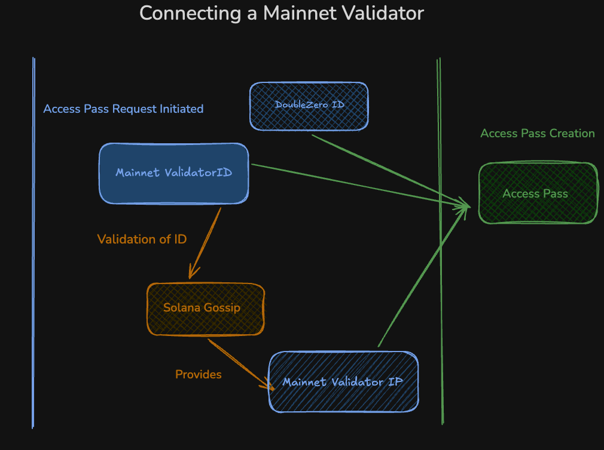
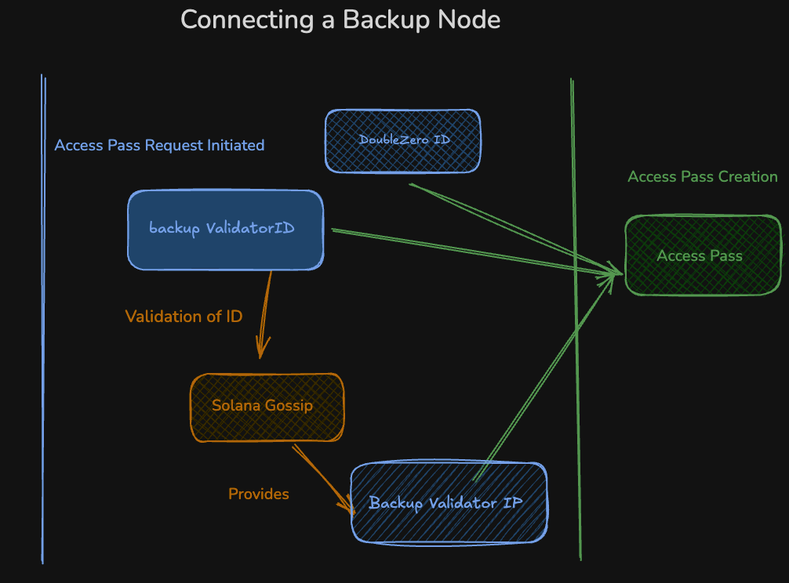

# How to connect to DoubleZero in IBRL Mode - for Mainnet-Beta Users
??? warning "By connecting to the DoubleZero Mainnet-Beta I agree to the terms of the Evaluation Agreement set forth here (click to expand)"
    <span style="font-size:14px;">DoubleZero Testnet</span>
    Evaluation Agreement

    By accessing or using the Solution (defined below), you agree as of the
    first date of such access (the "**Effective Date**") that this
    Evaluation Agreement (the "**Agreement**") sets forth the terms and
    conditions under which DoubleZero Foundation ("**DZF**") will provide
    you ("**User**" or "**you**") access to the Solution on an evaluation
    basis. In consideration of the mutual promises herein, you agree as
    follows:

    <span style="font-size:14px;">1. DEFINITIONS.</span>

    <span style="font-size:14px;">1.1 "**Confidential Information**"</span> means any and all information disclosed by either party to the other which is designated as confidential, or which should otherwise be understood to be confidential, including but not limited to, the Solution, product plans, business plans, trade secrets, technology, or any other proprietary information.

    <span style="font-size:14px;">1.2 "**Solution**" </span> means the testnet version of the DoubleZero high-performance network infrastructure for web3 projects ("**Testnet**") and related edge filtering service with integrated bandwidth ("**Information Service**") the DZ Software (defined below), any and all materials provided by DZF relating to the DZ Software ("**Documentation**"), and other materials that DZF provides to User hereunder.

    <span style="font-size:14px;">2. ACCESS. </span>

    <span style="font-size:14px;">2.1 ^^Access to Solution^^.</span> Subject to the terms and conditions of this Agreement, DZF will provide User access to the Solution through the Internet. User's access is a non-exclusive, non-transferable, limited use of the Solution to enable User to evaluate the Information Service only. With respect to any software comprising the Solution ("**DZ Software**"), DZF hereby grants User a limited, revocable license, during the Evaluation Period, to copy, download, make a reasonable number of copies of, run, and deploy (as applicable) such DZ Software solely as contemplated by the Documentation.

    <span style="font-size:14px;">2.2 ^^Restrictions^^. </span>User may use the Solution in accordance with this Agreement from the Effective Date until terminated by DZF (the "**Evaluation Period**"). User understands that any rights to use the Solution beyond the Evaluation Period will be subject to a separate commercial agreement between the parties with respect thereto, including the payment of fees. User shall not, and shall not permit any third party to: (i) modify or create any derivative works based on the Solution or any portion thereof; (ii) reproduce the Solution except as expressly permitted by this Agreement; (iii) sublicense, distribute, sell, lend, rent, lease, transfer, or grant any rights in or to all or any portion of the Solution or provide access to the Solution to third parties, on a service bureau basis or otherwise, except as an offering of the Information Services through or in connection with User's platform or product and not on a standalone basis; or (iv) use the Solution other than as provided herein.

    <span style="font-size:14px;">2.3 ^^Ownership^^.</span> DZF retains all right, title and interest, including intellectual property rights, in and to the Solution.

    <span style="font-size:14px;">3 FEEDBACK.</span>
    DZF may periodically request that User provide, and User agrees to provide to DZF, feedback regarding the use, operation, and functionality of the Solution ("Feedback"). User hereby grants DZF a non-exclusive, worldwide, perpetual, irrevocable, royalty-free, fully paid-up, fully sublicensable and transferable right and license to use and incorporate Feedback into any products and services, to make, use, sell, offer for sale, import, and otherwise exploit such products and services, and to otherwise use, copy, distribute, and otherwise exploit the Feedback without restriction.

    <span style="font-size:14px;">4. TERM AND TERMINATION.</span>

    <span style="font-size:14px;">4.1 ^^Term^^.</span> This Agreement will commence as of the Effective Date and will remain in full force and effect for the Evaluation Period. Either party may terminate this Agreement immediately for convenience, for any reason or no reason, upon written notice to the other party (email to suffice).

    <span style="font-size:14px;">4.1 ^^Effects of Termination^^.</span> Upon termination of this Agreement for any reason: (i) the rights granted to User hereunder will immediately terminate; (ii) User shall immediately discontinue any use of the Solution and shall return or destroy all Documentation and any DZ Software under its control; (iii) each party shall promptly return or destroy all Confidential Information and property of the other party; and (iv) Sections 2.2, 2.3, 3, 4.2, and 5 through 8 will survive.

    <span style="font-size:14px;">5. CONFIDENTIALITY.</span>
    Each party agrees that it will use the Confidential Information of the other party solely to perform its obligations and exercise its rights under this Agreement and it will not disclose, or permit to be disclosed, the same, except as otherwise permitted hereunder. However, either party may disclose Confidential Information to its personnel, attorneys, and other representatives who have a need to know and are bound by confidentiality obligations no less protective than those set forth in this Agreement; and as required by law (in which case the receiving party will provide the disclosing party with prior notice thereof and opportunity to contest such disclosure, and will minimize such disclosure to the extent permitted by applicable law). The obligations of confidentiality in this Section 5 shall not apply to information that: (a) is or becomes generally known or publicly available through no fault of the receiving party; (b) was properly known to the receiving party, without restriction, prior to disclosure by the disclosing party; (c) was properly disclosed to the receiving party, without restriction, by another person with the legal authority to do so; or (d) is independently developed by the receiving party without use of or reference to the disclosing party's Confidential Information. Each party agrees to exercise due care in protecting the Confidential Information of the other party from unauthorized use and disclosure. In the event of actual or threatened breach of the provisions of this Section or the licenses contained herein, the non-breaching party will be entitled to seek immediate injunctive and other equitable relief, without waiving any other rights or remedies available to it. User is responsible for maintaining the Solution and the secrecy of any passwords, seed phrases, or codes that provide access to the Solution as the Confidential Information of DZF. Nothing herein limits or restricts DZF's right or ability to use data regarding the performance, availability, usage, integrity and security of the Solution. If either party breaches, or threatens to breach the provisions of this Section 5, each party agrees that the non-breaching party will have no adequate remedy at law and is therefore entitled to immediate injunctive and other equitable relief, without bond and without the necessity of showing actual money damages.

    <span style="font-size:14px;">6. WARRANTY DISCLAIMER; LIMITATION OF LIABILITY.</span>

    <span style="font-size:14px;">6.1 ^^WARRANTY DISCLAIMER^^.</span> THE SOLUTION IS PROVIDED "AS IS" WITHOUT WARRANTY OF ANY KIND. DZF MAKES NO WARRANTIES, WHETHER EXPRESS, IMPLIED, STATUTORY OR OTHERWISE WITH RESPECT TO THE SOLUTION AND DOCUMENTATION INCLUDING THEIR CONDITION, CONFORMITY TO ANY REPRESENTATION OR DESCRIPTION, AND DZF SPECIFICALLY DISCLAIMS ALL IMPLIED WARRANTIES OF MERCHANTABILITY, FITNESS FOR A PARTICULAR PURPOSE, TITLE, AND NON-INFRINGEMENT.

    <span style="font-size:14px;">6.2 ^^LIMITATION OF LIABILITY^^.</span>
    EXCEPT FOR A BREACH OF SECTIONS 2.1, 2.2, AND 5, IN NO EVENT SHALL EITHER PARTY BE LIABLE TO THE OTHER FOR INDIRECT, INCIDENTAL, SPECIAL OR OTHER CONSEQUENTIAL DAMAGES, INCLUDING WITHOUT LIMITATION DAMAGES FOR LOSS OF PROFITS OR USE OR LOSS OF DATA, INCURRED BY YOU OR ANY THIRD PARTY, ARISING OUT OF OR RELATED TO THIS AGREEMENT WHETHER IN AN ACTION IN CONTRACT, TORT, OR OTHERWISE, EVEN IF THE OTHER PARTY HAS BEEN ADVISED OF THE POSSIBILITY OF SUCH DAMAGES. IN NO EVENT SHALL DZF'S AGGREGATE LIABILITY ARISING OUT OF OR RELATED TO THIS AGREEMENT EXCEED ONE HUNDRED DOLLARS (\$100), WHETHER AN ACTION IN CONTRACT, TORT, OR OTHERWISE. **THE FOREGOING LIMITATIONS WILL APPLY NOTWITHSTANDING THE FAILURE OF ESSENTIAL PURPOSE OF ANY LIMITED REMEDY HEREIN.** THE PARTIES AGREE THAT THE FOREGOING LIMITATIONS REPRESENT A REASONABLE ALLOCATION OF RISK UNDER THIS AGREEMENT.

    <span style="font-size:14px;">7. GOVERNING LAW.</span>
    This Agreement and all matters arising out of or relating to this Agreement shall be governed, interpreted and constructed in accordance with the laws of the Cayman Islands. Should a controversy, dispute or claim arise out of or in relation to this Agreement ("Dispute"), the relevant party as appropriate, must give 30 days' notice of such Dispute to the other parties (the "Notice of Dispute"). Should the Dispute not be resolved at the expiration of 30 days after service of the Notice of Dispute, the relevant party may commence arbitration proceedings as provided herein. Should the Dispute remain at the expiration of 30 days after service of the Notice of Dispute, the Dispute shall be settled by arbitration administered by the Cayman International Mediation & Arbitration Centre (CI-MAC) in accordance with the CI-MAC Arbitration Rules (the "Arbitration Rules") in force as at the date of this Agreement, which Arbitration Rules are deemed to be incorporated by reference to this clause, and governed by the Arbitration Act (as amended). The arbitration shall be seated in George Town, Grand Cayman, Cayman Islands and governed by Cayman Islands law. The language of the arbitration shall be English. The arbitration shall be determined by a sole arbitrator to be appointed in accordance with the Arbitration Rules. Any award or decision made by the arbitrator shall be in writing and shall be final and binding on the parties without any right of appeal, and judgment upon any award thus obtained may be entered in or enforced by any court having jurisdiction thereof. No action at law or in equity based upon any claim arising out of or related to this Agreement shall be instituted in any court of any jurisdiction. If any litigation or arbitration is necessary to enforce the terms of this Agreement, the prevailing party will be entitled to have their attorney fees paid by the other party. Each party waives any right it may have to assert the doctrine of forum non conveniens, to assert that it is not subject to the jurisdiction of such arbitration or courts or to object to venue to the extent any proceeding is brought in accordance herewith. </span>

    <span style="font-size:14px;">8. GENERAL PROVISIONS.</span>
    This Agreement may not be transferred or assigned by User without the prior written consent of DZF. DZF may freely assign this Agreement. All notices required to be sent hereunder shall be sent by email (to DZF: legal@doublezero.xyz) and deemed received the day after sending (with transmission confirmed). If any provision of this Agreement is held to be invalid or unenforceable, the remaining provisions of this Agreement will remain in full force and effect. The waiver by either party of any default or breach of this Agreement shall not constitute a waiver of any other or subsequent default or breach. Neither party shall be liable for any delay or failure in performance due to acts of God, earthquakes, shortages of supplies, transportation difficulties, labor disputes, riots, war, fire, epidemics, and similar occurrences beyond its control, whether or not foreseeable. This Agreement together with any attachments constitutes the complete agreement between the parties and supersedes all prior or contemporaneous agreements or representations, written or oral, concerning the subject matter herein. This Agreement may not be modified or amended except in writing signed by a duly authorized representative of each party.


###  Connecting to Mainnet-Beta in IBRL Mode

Solana Mainnet Validators will complete connection to DoubleZero Mainnet-beta, which is detailed on this page.
Note that connecting in IBRL mode does not require restarting any validator clients. 

This is because your existing public IP is advertised to DoubleZero so that other users on DoubleZero will route via the DoubleZero network when sending to your validator. Likewise, the routes received from DoubleZero and installed in the kernel routing table cause your validator to send to other DoubleZero-enabled validators over the DoubleZero network.

## 1. Environment Configuration

Please follow the [setup](setup.md) instructions before proceeding.

The last step in setup was to disconnect from the network. This is to ensure that only one tunnel is open on your machine to DoubleZero, and that tunnel is on the correct network.


To configure the DoubleZero Client CLI (`doublezero`) and daemon (`doublezerod`) to connect to **DoubleZero mainnet-beta**:
```bash
DESIRED_DOUBLEZERO_ENV=mainnet-beta \
	&& sudo mkdir -p /etc/systemd/system/doublezerod.service.d \
	&& echo -e "[Service]\nExecStart=\nExecStart=/usr/bin/doublezerod -sock-file /run/doublezerod/doublezerod.sock -env $DESIRED_DOUBLEZERO_ENV" | sudo tee /etc/systemd/system/doublezerod.service.d/override.conf > /dev/null \
	&& sudo systemctl daemon-reload \
	&& sudo systemctl restart doublezerod \
	&& doublezero config set --env $DESIRED_DOUBLEZERO_ENV  > /dev/null \
	&& echo "✅ doublezerod configured for environment $DESIRED_DOUBLEZERO_ENV"
```

You should see the following output:
```
✅ doublezerod configured for environment mainnet-beta
```

After about 30 seconds you will see the DoubleZero devices available:

```bash
doublezero latency
```
Example output (testnet)
```bash
doublezero latency
 pubkey                                       | code         | ip             | min      | max      | avg      | reachable 
 6E1fuqbDBG5ejhYEGKHNkWG5mSTczjy4R77XCKEdUtpb | nyc-dz001    | 64.86.249.22   | 2.44ms   | 2.63ms   | 2.50ms   | true      
 CT8mP6RUoRcAB67HjKV9am7SBTCpxaJEwfQrSjVLdZfD | lax-dz001    | 207.45.216.134 | 71.97ms  | 72.01ms  | 71.99ms  | true
 Cpt3doj17dCF6bEhvc7VeAuZbXLD88a1EboTyE8uj6ZL | lon-dz001    | 195.219.120.66 | 71.94ms  | 72.08ms  | 72.00ms  | true
 4Wr7PQr5kyqCNJo3RKa8675K7ZtQ6fBUeorcexgp49Zp | ams-dz001    | 195.219.138.50 | 76.55ms  | 76.65ms  | 76.61ms  | true
 29ghthsKeH2ZCUmN2sUvhJtpEXn2ZxqAuq4sZFBFZmEs | fra-dz001    | 195.219.220.58 | 83.01ms  | 83.10ms  | 83.05ms  | true
 hWffRFpLrsZoF5r9qJS6AL2D9TEmSvPUBEbDrLc111Y  | fra-dz-001-x | 195.12.227.250 | 84.87ms  | 84.91ms  | 84.89ms  | true
 8jyamHfu3rumSEJt9YhtYw3J4a7aKeiztdqux17irGSj | prg-dz-001-x | 195.12.228.250 | 95.27ms  | 95.30ms  | 95.29ms  | true
 5tqXoiQtZmuL6CjhgAC6vA49JRUsgB9Gsqh4fNjEhftU | tyo-dz001    | 180.87.154.78  | 180.96ms | 181.08ms | 181.02ms | true
 D3ZjDiLzvrGi5NJGzmM7b3YZg6e2DrUcBCQznJr3KfC8 | sin-dz001    | 180.87.102.98  | 220.87ms | 221.14ms | 220.97ms | true
```
Mainnet output will be identical in structure, but with many more available devices.
</details>


## 2. Attest Validator Ownership

With your DoubleZero Enviroment set, it is now time to attest to your Validator Ownership.

In order to accomplish this you will first determine the Solana Validator ID, then use the Solana Validator ID, together with the DoubleZero ID created during setup, to sign an off-chain transaction.
This process only verifies ownership of the validator specified in the command.


### Switching to the `sol` User

Before generating the validator ownership signature, you must switch to the `sol` user (or the user you normally use to run the validator):

```bash
sudo su - sol
```

This is required because the validator's Identity key (`validator-keypair.json`) is usually stored under the `sol` user account. Running the command as `sol` ensures:

- You have permissions to access to the `validator-keypair.json`.
- The signature is generated using the appropriate key that your Solana validator uses.

This step **only requires you to sign a message with your validator Identity** to prove ownership.

### Identify the Pubkey from your validator Identity

You may only create an access pass for the Validator Identity which is in gossip on the server requesting the access pass.
To connect your primary server, use the Validator Identity of your main validator. To connect a backup server, use the Validator Identity configured on the backup server.


<figure markdown="span">
  { width="800" }
  <figcaption>Figure 1: Connecting to DoubleZero Mainnet-Beta</figcaption>
</figure>

<figure markdown="span">
  { width="800" }
  <figcaption>Figure 2: Connecting a backup node to DoubleZero</figcaption>
</figure>

```bash
solana address -k path/to/validator-keypair.json
```
!!! note inline end
      Save the output of this Signature for step 6


**Output:**
```bash
ValidatorIdentity111111111111111111111111111
```

Use the `sign-offchain-message` command to prove you are the owner of the validator.

```bash
solana sign-offchain-message -k path/to/validator-keypair.json service_key=YourDoubleZeroAddress11111111111111111111111111111
```

**Output:**
```bash
Signature111111rrNykTByK2DgJET3U6MdjSa7xgFivS9AHyhdSG6AbYTeczUNJSjYPwBGqpmNGkoWk9NvS3W7
```

### Exit the Validator User

Exit the `sol` user session (or the user used to run the validator):

```bash
exit
```

## 3. Initiate a Connection Request in DoubleZero

Use the `request-validator-access` command to create an account on Solana for the connection request. The DoubleZero Sentinel agent detects the new account, validates its identity and signature, and creates the access pass in DoubleZero so the server can establish a connection.

The example is for Solana Mainnet-beta. For Solana Testnet, change the `mainnet-beta` flag to `testnet`

Check your Solana Balance

```bash
solana balance -u mainnet-beta
```

Use the node ID, DoubleZeroID, and signature.

!!! note inline end
      In this example we use   `-k /home/user/.config/solana/id.json` to find the validator Identity. Use the appropriate location for your local deployment.

```bash
doublezero-solana passport request-validator-access -u mainnet-beta \
  -k /home/user/.config/solana/id.json \
  --node-id ValidatorIdentity111111111111111111111111111 \
  --signature Signature111111rrNykTByK2DgJET3U6MdjSa7xgFivS9AHyhdSG6AbYTeczUNJSjYPwBGqpmNGkoWk9NvS3W7 \
  YourDoubleZeroAddress11111111111111111111111111111

```

**Output:**
```bash
Request Solana validator access: Signature2222222222VaB8FMqM2wEBXyV5THpKRXWrPtDQxmTjHJHiAWteVYTsc7Gjz4hdXxvYoZXGeHkrEayp 
```

## 4. Connect in IBRL Mode

On the server, with the user which will connect to DoubleZero, run the `connect` command to establish the connection to DoubleZero.

```bash
doublezero connect ibrl
```

You should see output indicating provisioning, such as:

```
DoubleZero Service Provisioning
🔗  Start Provisioning User...
Public IP detected: 137.184.101.183 - If you want to use a different IP, you can specify it with `--client-ip x.x.x.x`
🔍  Provisioning User for IP: 137.184.101.183
    User account created
    Connected to device: nyc-dz001
    The user has been successfully activated
    Service provisioned with status: ok
✅  User Provisioned
```
Wait one minute for the tunnel to complete. Until the tunnel is completed, your status output may return "down" or "Unknown" 

Verify your connection:

```bash
doublezero status
```

**Output:**
```bash
Tunnel status | Last Session Update     | Tunnel Name | Tunnel src      | Tunnel dst   | DoubleZero IP   | User Type
up            | 2025-09-10 12:16:03 UTC | doublezero0 | 137.184.101.183 | 64.86.249.22 | 137.184.101.183 | IBRL
```
A status of `up` means you are successfully connected.

You will be able to view routes propagated by other users on DoubleZero by running:

```
ip route
```


```
default via 149.28.38.1 dev enp1s0 proto dhcp src 149.28.38.64 metric 100 
5.39.216.186 via 169.254.0.68 dev doublezero0 proto bgp src 149.28.38.64 
5.39.251.201 via 169.254.0.68 dev doublezero0 proto bgp src 149.28.38.64 
5.39.251.202 via 169.254.0.68 dev doublezero0 proto bgp src 149.28.38.64 
...
```
