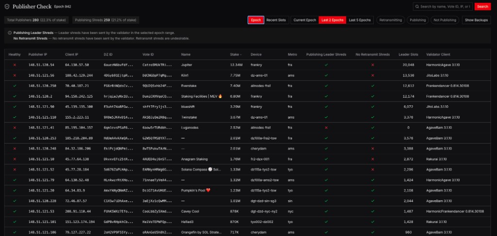
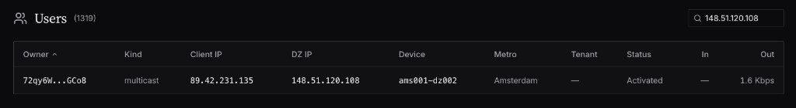
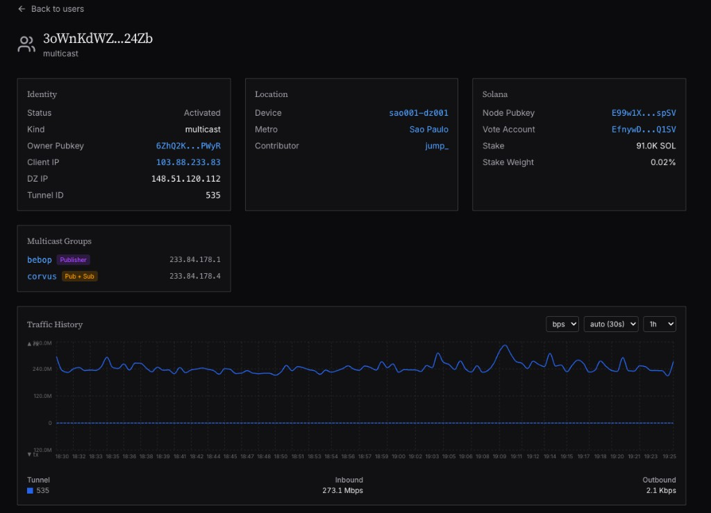
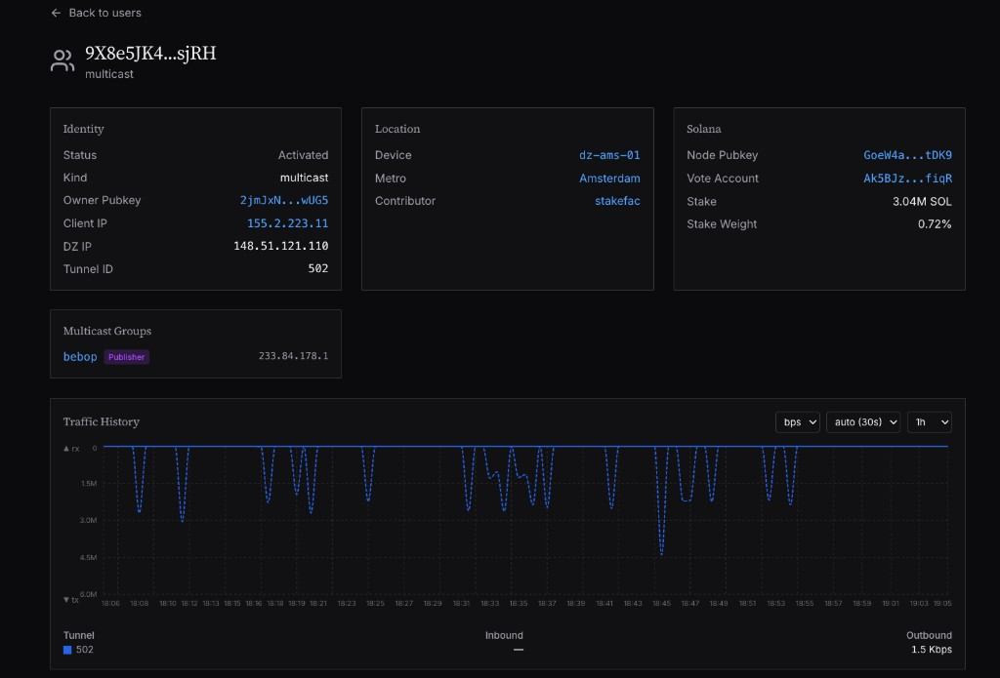

# Conexión de Validador por Multidifusión
!!! warning "Al conectarme a DoubleZero acepto los [Términos de Servicio de DoubleZero](https://doublezero.xyz/terms-protocol)"

!!! note inline end "Firmas de trading y empresas"
    Si opera una firma de trading o empresa que busca suscribirse al feed, por favor registre su interés para obtener más información [aquí](https://doublezero.xyz/edge-form).

Si aún no está conectado a DoubleZero, por favor complete la documentación de [Configuración](<setup.md>) y de conexión de validador a [Mainnet-Beta](<DZ Mainnet-beta Connection.md>).

Si es un validador que ya está conectado a DoubleZero, puede continuar con esta guía.

## 1. Configuración del Cliente

### Jito-Agave (v3.1.9+) y Harmonic (3.1.11+)

1. En su script de inicio del validador, agregue: `--shred-receiver-address 233.84.178.1:7733`

    Puede enviar a Jito y al grupo `edge-solana-shreds` al mismo tiempo.

    ejemplo:

    ```json
    #!/bin/bash
    export PATH="/home/sol/.local/share/solana/install/releases/v3.1.9-jito/bin:$PATH"
    BLOCK_ENGINE_URL=https://ny.mainnet.block-engine.jito.wtf
    RELAYER_URL=http://ny.mainnet.relayer.jito.wtf:8100
    SHRED_RECEIVER_ADDR=<JitoBlockEngineAddress>
    <...The rest of your config...>
    --shred-receiver-address 233.84.178.1:7733
    ```

2. Reinicie su validador.
3. Conéctese al grupo de multidifusión de DoubleZero `edge-solana-shreds` como publicador: `doublezero connect ibrl && doublezero connect multicast --publish edge-solana-shreds`

### Frankendancer

1. En `config.toml`, agregue:

    ```toml
    [tiles.shred]
    additional_shred_destinations_leader = [ "233.84.178.1:7733", ]
    ```

2. Reinicie su validador.
3. Conéctese al grupo de multidifusión de DoubleZero `edge-solana-shreds` como publicador: `doublezero connect ibrl && doublezero connect multicast --publish edge-solana-shreds`

## 2. Confirme que está publicando leader shreds

Una vez que esté conectado, puede consultar [este panel](https://data.doublezero.xyz/dz/publisher-check) para confirmar que está publicando shreds. No verá la confirmación hasta después de haber publicado leader shreds durante al menos un slot.

## Endpoints de Multidifusión (IP vs Puerto)

Para el tráfico de shreds, la **dirección IP** selecciona el feed de multidifusión y el **puerto** selecciona el servicio UDP.  
Todos los feeds a continuación usan el puerto UDP `7733`.

Puede descubrir las IPs de grupo actuales con:

```bash
doublezero multicast group list
```

- `edge-solana-shreds` (leader): `233.84.178.1:7733`
- `edge-solana-retrans-eu`: `233.84.178.12:7733`
- `edge-solana-retrans-apac`: `233.84.178.13:7733`
- `edge-solana-retrans-amer`: `233.84.178.14:7733`

Para referencias de API y endpoints de datos legibles por máquina, consulte [https://data.doublezero.xyz/api/v1/docs](https://data.doublezero.xyz/api/v1/docs).

## 3. Recompensas para Validadores

Por cada época en la que los validadores publiquen leader shreds, serán recompensados proporcionalmente por su contribución en función de las suscripciones. Los detalles específicos de este sistema serán anunciados y detallados en una fecha posterior.

## Solución de Problemas

### No se Publican Leader Shreds:

La causa más común de no transmitir shreds es la versión del cliente:

Debe estar ejecutando Jito-Agave 3.1.9+, JitoBam 3.1.9+, Frankendancer o Harmonic 3.1.11+. Otras versiones de cliente no funcionarán.

### Retransmisión:

1. Una causa común de retransmisión de shreds es una configuración simple. Es posible que tenga habilitada la flag para enviar shreds de retransmisión en su script de inicio; deberá deshabilitarla.

    La flag a eliminar en Jito-Agave es: `--shred-retransmit-receiver-address`.

1. Consulte el [panel de publicadores](https://data.doublezero.xyz/dz/publisher-check) y verifique si tiene shreds retransmitidos. En la tabla, observe la columna **No Retransmit Shreds**: una X roja significa que está retransmitiendo.

    !!! note "vista por época"
        Tenga en cuenta que hay diferentes ventanas de tiempo para ver el panel de publicadores. Si ve retransmisión en la **vista de 2 épocas**, pero ha realizado un cambio reciente, intente cambiar a la vista de **slot reciente**.


    

2. Encuentre la IP de su cliente y busque su usuario en [DoubleZero Data](https://data.doublezero.xyz/dz/users).

    

3. Haga clic en **Multicast** para abrir su vista de multidifusión.

    La captura de pantalla a continuación muestra: **Retransmitiendo** (no deseado) tráfico saliente constante sin patrón de leader-slot.

    

    La captura de pantalla a continuación muestra: **Saludable** (publicando solo leader shreds) tráfico saliente en picos, conocido como patrón de diente de sierra, que se alinean con sus leader slots.

    

El gráfico muestra si está enviando solo leader shreds. Los picos de tráfico deben coincidir con cuando tiene un leader slot. Cuando no tiene un leader slot, no debería haber tráfico. Si está retransmitiendo, verá un flujo constante de tráfico en lugar de picos alineados con los slots.