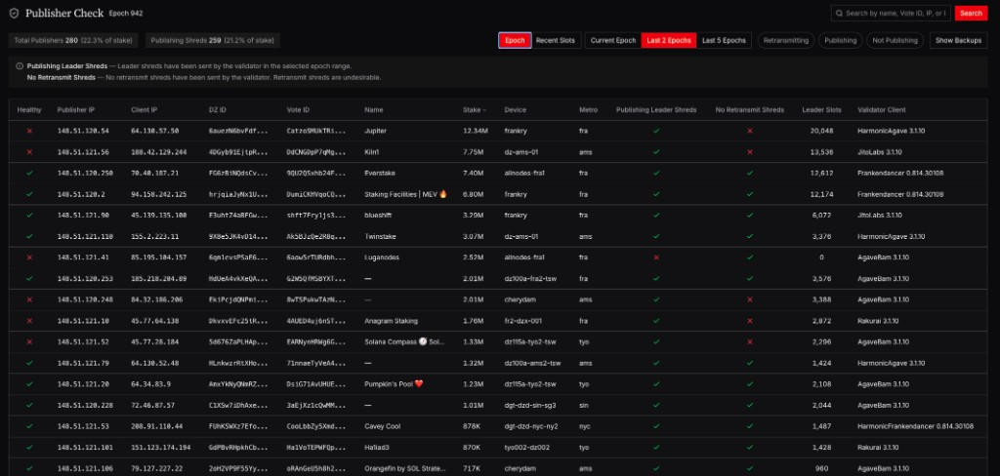
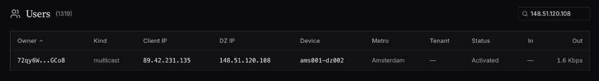
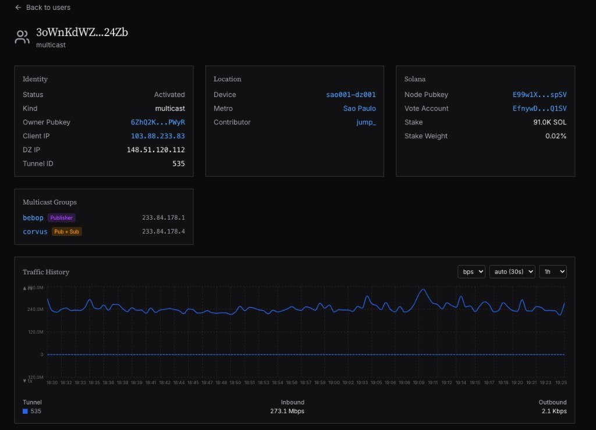
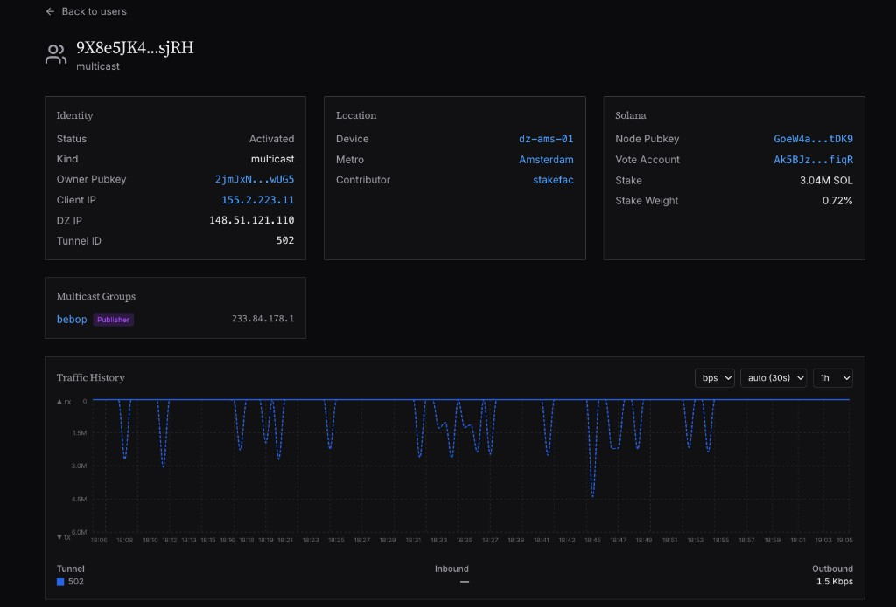

# 验证器多播连接
!!! warning "This translation was generated using artificial intelligence and has not been reviewed by a human translator. It may contain inaccuracies or errors and should not be relied upon."

!!! warning "通过连接到DoubleZero，我同意[DoubleZero服务条款](https://doublezero.xyz/terms-protocol)"

!!! note inline end "交易公司和企业"
    如果您经营交易公司或企业，希望订阅数据流，更多详情即将分享。请在[此处](https://doublezero.xyz/edge-form)注册以获取更多信息。

如果您尚未连接到DoubleZero，请先完成[设置](https://docs.malbeclabs.com/setup/)和[主网Beta](https://docs.malbeclabs.com/DZ%20Mainnet-beta%20Connection/)验证器连接文档。

如果您是已连接到DoubleZero的验证器，可以继续阅读本指南。

## 1. 客户端配置

### Jito-Agave（v3.1.9+）和 Harmonic（3.1.11+）

1. 在您的验证器启动脚本中，添加：`--shred-receiver-address 233.84.178.1:7733`

    您可以同时向Jito和`edge-solana-shreds`组发送数据。

    示例：

    ```json
    #!/bin/bash
    export PATH="/home/sol/.local/share/solana/install/releases/v3.1.9-jito/bin:$PATH"
    BLOCK_ENGINE_URL=https://ny.mainnet.block-engine.jito.wtf
    RELAYER_URL=http://ny.mainnet.relayer.jito.wtf:8100
    SHRED_RECEIVER_ADDR=<JitoBlockEngineAddress>
    <...The rest of your config...>
    --shred-receiver-address 233.84.178.1:7733
    ```

2. 重启您的验证器。
3. 以发布者身份连接到DoubleZero多播组`edge-solana-shreds`：`doublezero connect ibrl && doublezero connect multicast --publish edge-solana-shreds`

### Frankendancer

1. 在`config.toml`中，添加：

    ```toml
    [tiles.shred]
    additional_shred_destinations_leader = [ "233.84.178.1:7733", ]
    ```

2. 重启您的验证器。
3. 以发布者身份连接到DoubleZero多播组`edge-solana-shreds`：`doublezero connect ibrl && doublezero connect multicast --publish edge-solana-shreds`

## 2. 确认您正在发布领导者碎片

连接后，您可以查看[此仪表板](https://data.malbeclabs.com/dz/publisher-check)以确认您正在发布碎片。在您至少发布了一个槽位的领导者碎片之后，才能看到确认信息。

## 3. 验证器奖励

对于验证器发布领导者碎片的每个纪元，将根据订阅情况按比例奖励其贡献。该系统的具体细节将于稍后公布并详细说明。

## 故障排除

### 未发布领导者碎片：

未传输碎片最常见的原因是客户端版本问题：

您必须运行 Jito-Agave 3.1.9+、JitoBam 3.1.9+、Frankendancer 或 Harmonic 3.1.11+。其他客户端版本将无法工作。

### 重传：

1. 碎片重传的常见原因是简单的配置问题。您的启动脚本中可能启用了发送重传碎片的标志；您需要禁用它。

    在Jito-Agave中需要删除的标志是：`--shred-retransmit-receiver-address`。

1. 查看[发布者仪表板](https://data.malbeclabs.com/dz/publisher-check)，检查是否有重传碎片。在表格中，查看**No Retransmit Shreds**列——红色X表示您正在重传。

    !!! note "纪元视图"
        注意发布者仪表板有不同的时间窗口可供查看。如果您在**2纪元视图**中看到重传，但最近做了更改，请尝试切换到**近期槽位**视图。

    

2. 找到您的客户端IP，并在[DoubleZero数据](https://data.malbeclabs.com/dz/users)中查找您的用户。

    

3. 点击**多播**以打开您的多播视图。

    下图显示：**重传**（不理想）稳定的出站流量，没有领导者槽位模式。

    

    下图显示：**健康**（仅发布领导者碎片）出站流量呈尖峰状，称为锯齿波模式，与您的领导者槽位对齐。

    

图表显示您是否仅发送领导者碎片。流量峰值应与您拥有领导者槽位时对齐。当您没有领导者槽位时，应该没有流量。如果您正在重传，您将看到稳定的流量流，而不是与槽位对齐的峰值。
