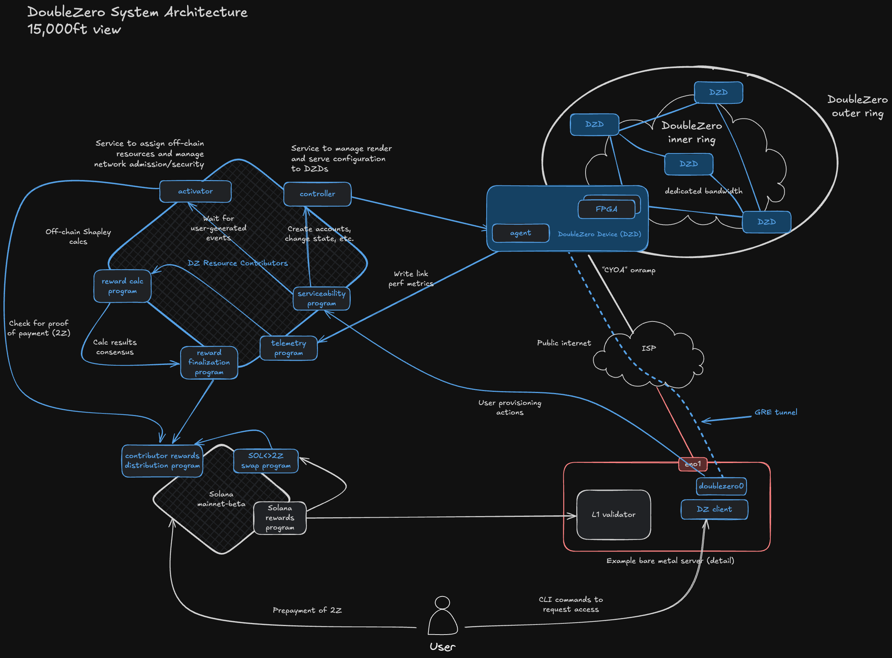

# Arquitectura

¿Qué compone los diferentes actores y componentes de la red DoubleZero?

<figure markdown="span">
  { width="800" }
  <figcaption>Figura 1: Componentes de la arquitectura de red</figcaption>
</figure>

## Contribuidores

La red DoubleZero está formada por contribuciones de conectividad y procesamiento de paquetes de una creciente comunidad de proveedores de infraestructura de red distribuida en ciudades de todo el mundo. Los contribuidores aportan enlaces de fibra óptica y recursos de procesamiento de información al protocolo para proporcionar la red de malla descentralizada.

### Contribuidores de Ancho de Banda de Red

Los contribuidores de red deben proporcionar ancho de banda dedicado entre dos puntos, operar dispositivos compatibles con DoubleZero (DZDs) en cada extremo y una conexión a internet en cada extremo. Los contribuidores de red también deben ejecutar el software DoubleZero en cada DZD para proporcionar servicios como multicast, búsqueda de usuarios y servicios de filtrado en el borde.

Los enlaces físicos de la red DoubleZero se proporcionan en forma de cables de fibra óptica, comúnmente denominados servicios de longitud de onda. Los contribuidores de red comprometen enlaces de red subutilizados, propios o arrendados de proveedores de infraestructura, entre dos o más centros de datos. Estos enlaces se terminan en ambos extremos por Dispositivos DoubleZero, que son recintos físicos de conmutación de red que ejecutan instancias del software Agente DoubleZero.

#### DoubleZero Exchange (DZX / Sitio de Interconexión)

Los Exchanges DoubleZero (DZXs) son puntos de interconexión en la red de malla donde se unen diferentes enlaces de contribuidores. Los DZXs están ubicados en las principales áreas metropolitanas del mundo donde se producen intersecciones de red. Los contribuidores de red deben interconectar sus enlaces a la red de malla DoubleZero más amplia en los DZXs geográficamente más cercanos a los extremos de sus enlaces.

### Contribuidores de Recursos Computacionales

Aparte de los contribuidores de red, los contribuidores de recursos son un grupo descentralizado de participantes de la red que realizan diversas tareas de mantenimiento y monitoreo necesarias para sostener la integridad técnica y la funcionalidad continua de la red DoubleZero. Específicamente, ellos (i) rastrean las transacciones y pagos de los usuarios; (ii) calculan las tarifas para los contribuidores de red; (iii) registran los resultados de (i) y (ii); (iv) administran, estrictamente de forma no discrecional, los contratos inteligentes que controlan la tokenómica del protocolo; (v) transmiten attestations a la blockchain aplicable; y (vi) publican datos de telemetría sobre la calidad y utilización de los enlaces para proporcionar métricas de rendimiento transparentes y en tiempo real para todos los contribuidores de red.

## Componentes

### Daemon DoubleZero

El software Daemon DoubleZero se ejecuta en servidores que necesitan comunicarse a través de la red DoubleZero. El daemon interactúa con la pila de red del kernel del host para crear y gestionar interfaces de túnel, tablas de enrutamiento y rutas.

### Activador

El servicio Activador, alojado por uno o más miembros contribuidores de recursos computacionales de la comunidad DoubleZero, monitorea los eventos de contrato que requieren asignaciones de direcciones IP y cambios de estado, y gestiona esos cambios en nombre de la red.

### Controlador

El servicio Controlador, alojado por uno o más contribuidores de recursos computacionales de la comunidad DoubleZero, sirve como la interfaz de configuración para que los Agentes de Dispositivos DoubleZero representen su configuración actual basada en eventos de contratos inteligentes.

### Agente

El software Agente se ejecuta directamente en los Dispositivos DoubleZero y aplica los cambios de configuración a los dispositivos según lo interpretado por el servicio Controlador. El software Agente consulta al Controlador para detectar cambios de configuración, calcula las diferencias entre la versión canónica on-chain del estado del Dispositivo y la configuración activa en el dispositivo, y aplica los cambios necesarios para reconciliar la configuración activa.

### Dispositivo

El recinto físico del dispositivo que proporciona el enrutamiento y la terminación de enlaces para la red DoubleZero. Los DZDs ejecutan el software Agente DoubleZero y se configuran basándose en los datos leídos del servicio Controlador.
