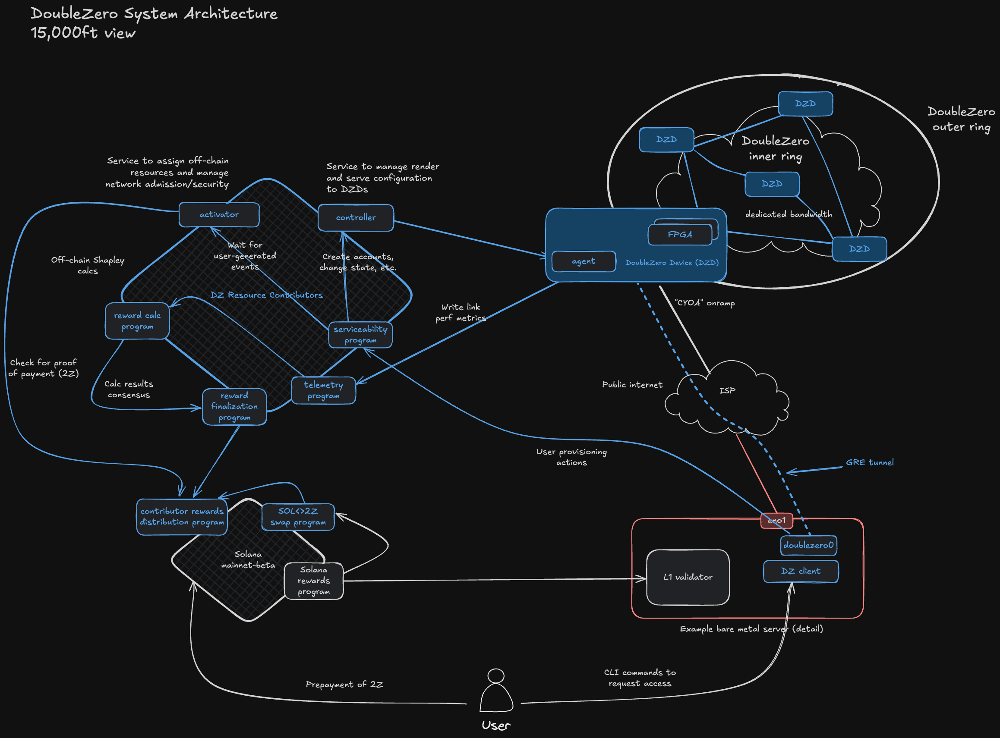

# Architecture

What makes up the different actors and components of the DoubleZero network?

<figure markdown="span">
  { width="800" }
  <figcaption>Figure 1: Network architecture components</figcaption>
</figure>

## Contributors

The DoubleZero network is made up of connectivity and packet processing contributions from a growing community of distributed network infrastructure providers in cities across the globe. Contributors bring fiber optic cable links and information processing resources to the protocol to provide the decentralized mesh network.

### Network Bandwidth Contributors

Network contributors must provide dedicated bandwidth between two points, operate DoubleZero compatible devices (DZDs) at each end, and a connection to the internet at each end. Network contributors must also run DoubleZero software on each DZD to provide services like multicast, user lookup, and edge filtration services.

The physical links of the DoubleZero network are provided in the form of fiber optic cables, commonly referred to as wavelength services. Network contributors commit underutilized network links, owned or leased from infrastructure providers, between two or more data centers. These links are terminated at both ends by DoubleZero Devices, which are physical network switching enclosures running instances of the DoubleZero Agent software.

#### DoubleZero Exchange (DZX / Cross-connect Site)

DoubleZero Exchanges (DZXs) are interconnect points in the mesh network where different contributor links are bridged together. DZXs are located in major metropolitan areas around the world where network intersections occur. Network contributors must cross-connect their links into the broader DoubleZero mesh network at the DZXs geographically located nearest their link endpoints.

### Computational Resource Contributors

Separate from network contributors, resource contributors are a decentralized group of network participants that perform various maintenance and monitoring duties necessary to sustain the technical integrity and ongoing functionality of the DoubleZero network. Specifically, they (i) track user transactions and payments; (ii) calculate fees for network contributors; (iii) record the results of (i) and (ii); (iv) administer, strictly on a non-discretionary basis, the smart contracts that control protocol tokenomics; (v) relay attestations to the Solana blockchain; and (vi) publish telemetry data regarding link quality and utilization to provide transparent, real-time performance metrics for all network contributors.

## Components

### DoubleZero Daemon

The DoubleZero Daemon software runs on servers needing to communicate over the DoubleZero network. The daemon interfaces with the host's kernel networking stack to create and manage tunnel interfaces, routing tables, and routes.

### Activator

The Activator service, hosted by one or more computational resource contributing members of the DoubleZero community, monitors contract events that require IP address allocations and state changes and manages those changes on behalf of the network.

### Controller

The Controller service, hosted by one or more computational resource contributors of the DoubleZero community, serves as the configuration interface for DoubleZero Device Agents to render their current configuration based on smart contract events.

### Agent

The Agent software runs directly on DoubleZero Devices and applies configuration changes to the devices as interpreted by the Controller service. The Agent software polls the Controller for configuration changes, computes any differences between the canonical on-chain version of the Device state and the active configuration on the device and applies the necessary changes to reconcile the active configuration.

### Device

The physical device enclosure providing the routing and link termination for the DoubleZero network. DZDs run the DoubleZero Agent software and are configured based on data read from the Controller service.
