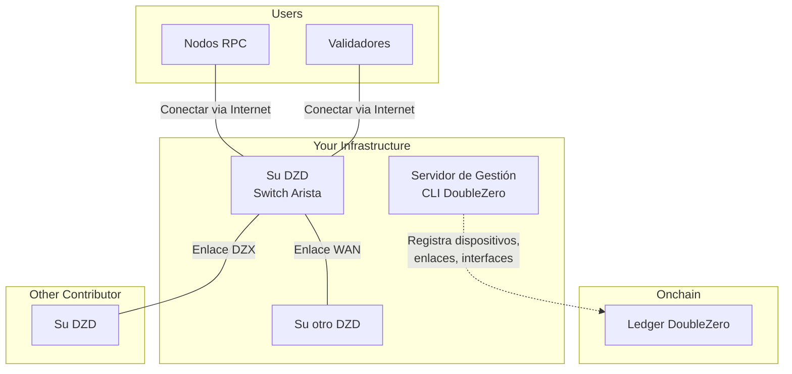
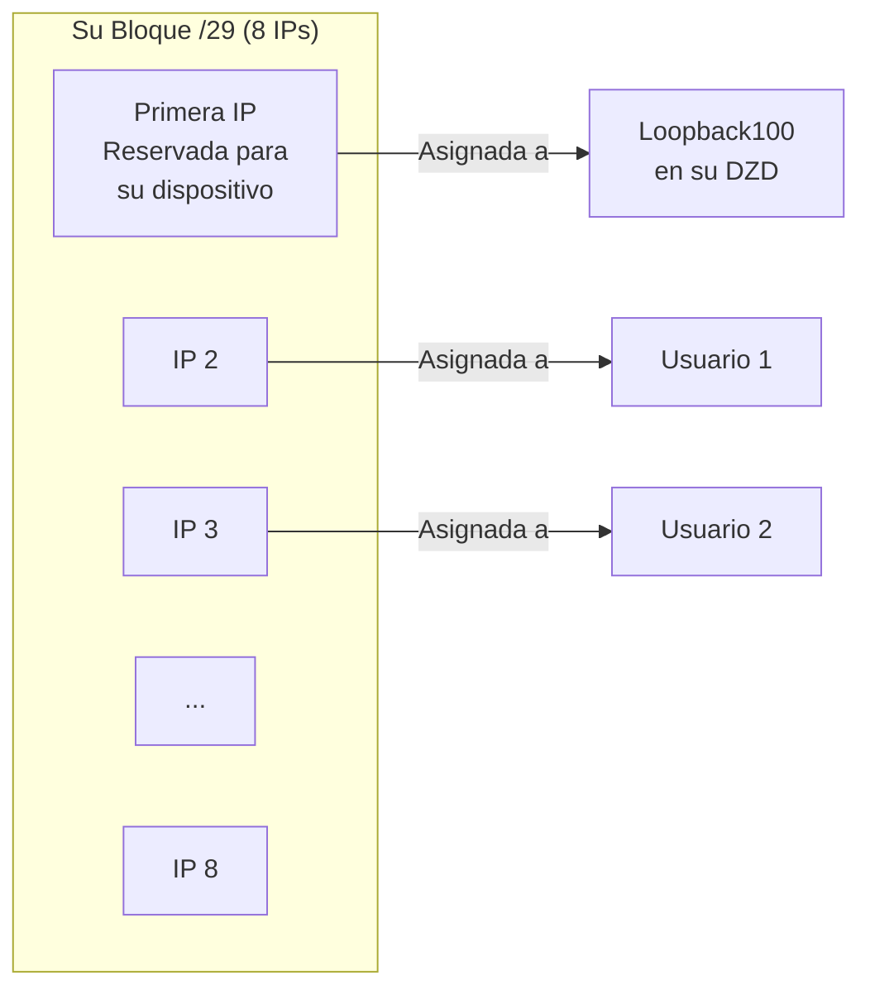
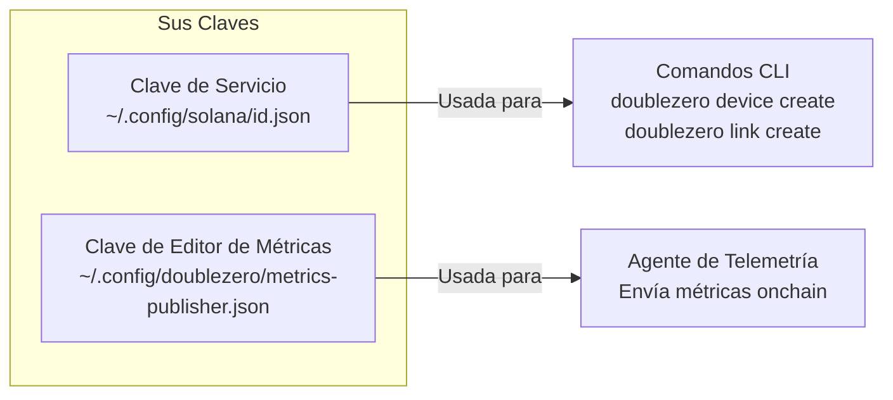
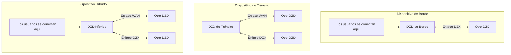
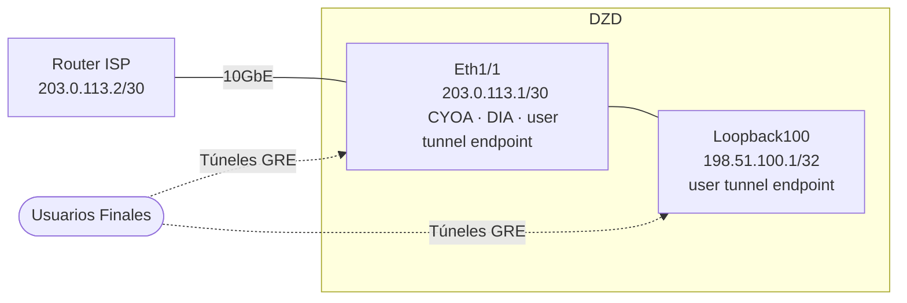
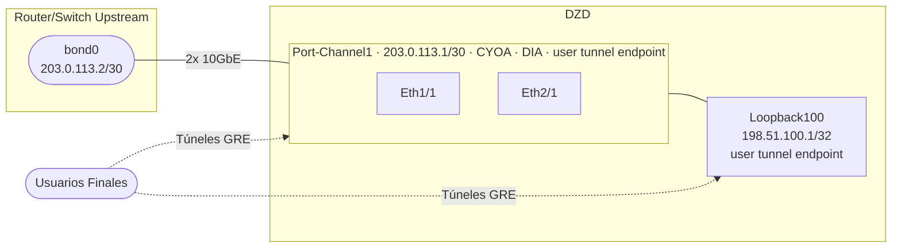
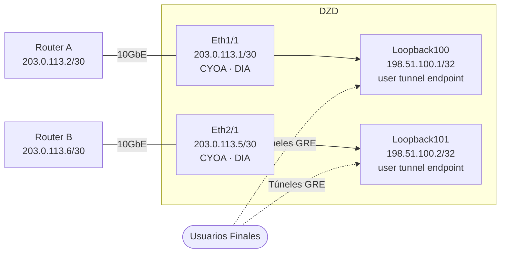
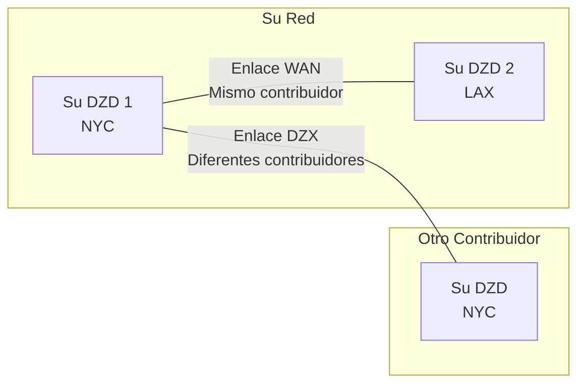
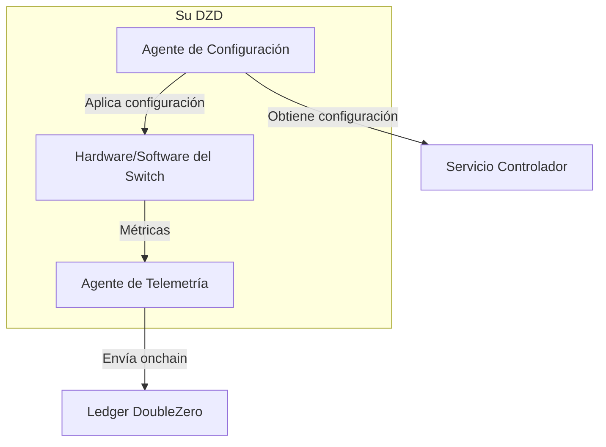
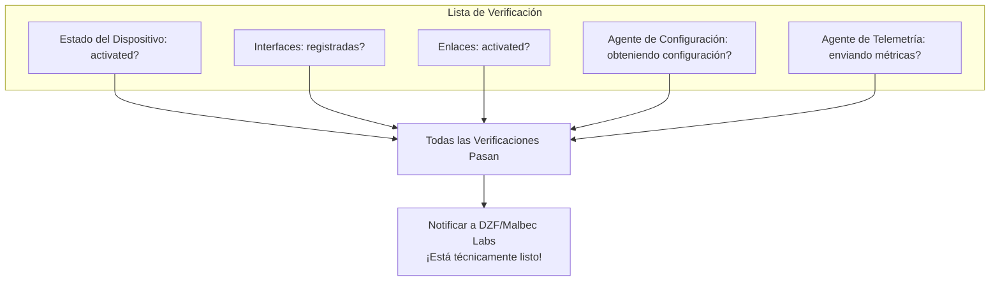

# Guía de Aprovisionamiento de Dispositivos
!!! warning "This translation was generated using artificial intelligence and has not been reviewed by a human translator. It may contain inaccuracies or errors and should not be relied upon."


Esta guía le lleva a través del aprovisionamiento de un Dispositivo DoubleZero (DZD) de principio a fin. Cada fase corresponde a la [Lista de Verificación de Incorporación](contribute-overview.md#onboarding-checklist).

---

## Cómo Encaja Todo

Antes de entrar en los pasos, aquí está el panorama general de lo que está construyendo:



---

## Fase 1: Requisitos Previos

Antes de poder aprovisionar un dispositivo, necesita el hardware físico configurado y algunas direcciones IP asignadas.

### Lo Que Necesita

| Requisito | Por Qué Es Necesario |
|-------------|-----------------|
| **Hardware DZD** | Switch Arista 7280CR3A (consulte [especificaciones de hardware](contribute.md#hardware-requirements)) |
| **Espacio en Rack** | 4U con flujo de aire adecuado |
| **Energía** | Alimentaciones redundantes, ~4KW recomendado |
| **Acceso de Gestión** | Acceso SSH/consola para configurar el switch |
| **Conectividad a Internet** | Para publicación de métricas y para obtener configuración del controlador |
| **Bloque IPv4 Público** | Mínimo /29 para el pool de prefijos DZ (ver abajo) |

### Instalar el CLI de DoubleZero

El CLI de DoubleZero (`doublezero`) se usa durante todo el aprovisionamiento para registrar dispositivos, crear enlaces y gestionar su contribución. Debe instalarse en un **servidor de gestión o VM**, no en el switch DZD en sí. El switch solo ejecuta el Agente de Configuración y el Agente de Telemetría (instalados en la [Fase 4](#phase-4-link-establishment-agent-installation)).

**Ubuntu / Debian:**
```bash
curl -1sLf https://dl.cloudsmith.io/public/malbeclabs/doublezero/setup.deb.sh | sudo -E bash
sudo apt-get install doublezero
```

**Rocky Linux / RHEL:**
```bash
curl -1sLf https://dl.cloudsmith.io/public/malbeclabs/doublezero/setup.rpm.sh | sudo -E bash
sudo yum install doublezero
```

Verificar que el daemon esté ejecutándose:
```bash
sudo systemctl status doublezerod
```

### Comprendiendo Su Prefijo DZ

Su prefijo DZ es un bloque de direcciones IP públicas que el protocolo DoubleZero gestiona para la asignación de IP.



**Cómo se usan los prefijos DZ:**

- **Primera IP**: Reservada para su dispositivo (asignada a la interfaz Loopback100)
- **IPs restantes**: Asignadas a tipos específicos de usuarios que se conectan a su DZD:
    - Usuarios `IBRLWithAllocatedIP`
    - Usuarios `EdgeFiltering`
    - Publicadores multicast
- **Usuarios IBRL**: NO consumen de este pool (usan su propia IP pública)

!!! warning "Reglas de Prefijo DZ"
    **NO PUEDE usar estas direcciones para:**

    - Su propio equipo de red
    - Enlaces punto a punto en interfaces DIA
    - Interfaces de gestión
    - Cualquier infraestructura fuera del protocolo DZ

    **Requisitos:**

    - Deben ser direcciones IPv4 **globalmente enrutables (públicas)**
    - Los rangos de IP privados (10.x, 172.16-31.x, 192.168.x) son rechazados por el contrato inteligente
    - **Tamaño mínimo: /29** (8 direcciones), se prefieren prefijos más grandes (por ejemplo, /28, /27)
    - Todo el bloque debe estar disponible — no preasigne ninguna dirección

    Si necesita direcciones para su propio equipo (IPs de interfaz DIA, gestión, etc.), use un **pool de direcciones separado**.

---

## Fase 2: Configuración de Cuenta

En esta fase, crea las claves criptográficas que lo identifican a usted y a sus dispositivos en la red.

### Dónde Ejecutar el CLI

!!! warning "NO instale el CLI en su switch"
    El CLI de DoubleZero (`doublezero`) debe instalarse en un **servidor de gestión o VM**, no en su switch Arista.

    ```mermaid
    flowchart LR
        subgraph "Servidor/VM de Gestión"
            CLI[CLI DoubleZero]
            KEYS[Sus Keypairs]
        end

        subgraph "Su Switch DZD"
            CA[Agente de Configuración]
            TA[Agente de Telemetría]
        end

        CLI -->|Crea dispositivos, enlaces| BC[Blockchain]
        CA -->|Obtiene configuración| CTRL[Controlador]
        TA -->|Envía métricas| BC
    ```

    | Instalar en Servidor de Gestión | Instalar en Switch |
    |-----------------------------|-------------------|
    | CLI `doublezero` | Agente de Configuración |
    | Su keypair de servicio | Agente de Telemetría |
    | Su keypair de editor de métricas | Keypair de editor de métricas (copia) |

### ¿Qué Son las Claves?

Piense en las claves como credenciales de inicio de sesión seguras:

- **Clave de Servicio**: Su identidad de contribuidor — usada para ejecutar comandos del CLI
- **Clave de Editor de Métricas**: La identidad de su dispositivo para enviar datos de telemetría

Ambas son keypairs criptográficos (una clave pública que comparte, una clave privada que mantiene en secreto).



### Paso 2.1: Generar Su Clave de Servicio

Esta es su identidad principal para interactuar con DoubleZero.

```bash
doublezero keygen
```

Esto crea un keypair en la ubicación predeterminada. La salida muestra su **clave pública** — esto es lo que compartirá con DZF.

### Paso 2.2: Generar Su Clave de Editor de Métricas

Esta clave la usa el Agente de Telemetría para firmar envíos de métricas.

```bash
doublezero keygen -o ~/.config/doublezero/metrics-publisher.json
```

### Paso 2.3: Enviar Claves a DZF

Contacte a la Fundación DoubleZero o Malbec Labs y proporcione:

1. Su **clave pública de la clave de servicio**
2. Su **nombre de usuario de GitHub** (para acceso al repositorio)

Ellos:

- Crearán su **cuenta de contribuidor** onchain
- Otorgarán acceso al **repositorio de contribuidores** privado

### Paso 2.4: Verificar Su Cuenta

Una vez confirmado, verifique que su cuenta de contribuidor existe:

```bash
doublezero contributor list
```

Debería ver su código de contribuidor en la lista.

### Paso 2.5: Acceder al Repositorio de Contribuidores

El repositorio [malbeclabs/contributors](https://github.com/malbeclabs/contributors) contiene:

- Configuraciones base de dispositivos
- Perfiles TCAM
- Configuraciones ACL
- Instrucciones de configuración adicionales

Siga las instrucciones allí para la configuración específica del dispositivo.

---

## Fase 3: Aprovisionamiento de Dispositivos

Ahora registrará su dispositivo físico en la blockchain y configurará sus interfaces.

### Comprendiendo los Tipos de Dispositivos



| Tipo | Qué Hace | Cuándo Usar |
|------|--------------|-------------|
| **Borde** | Solo acepta conexiones de usuarios | Ubicación única, solo orientado al usuario |
| **Tránsito** | Mueve tráfico entre dispositivos | Conectividad de backbone, sin usuarios |
| **Híbrido** | Conexiones de usuarios Y backbone | Lo más común — hace todo |

### Paso 3.1: Encontrar Su Ubicación e Exchange

Antes de crear su dispositivo, busque los códigos de su ubicación de centro de datos y el exchange más cercano:

```bash
# Listar ubicaciones disponibles (centros de datos)
doublezero location list

# Listar exchanges disponibles (puntos de interconexión)
doublezero exchange list
```

### Paso 3.2: Crear Su Dispositivo Onchain

Registre su dispositivo en la blockchain:

```bash
doublezero device create \
  --code <YOUR_DEVICE_CODE> \
  --contributor <YOUR_CONTRIBUTOR_CODE> \
  --device-type hybrid \
  --location <LOCATION_CODE> \
  --exchange <EXCHANGE_CODE> \
  --public-ip <DEVICE_PUBLIC_IP> \
  --dz-prefixes <YOUR_DZ_PREFIX>
```

**Ejemplo:**

```bash
doublezero device create \
  --code nyc-dz001 \
  --contributor acme \
  --device-type hybrid \
  --location EQX-NY5 \
  --exchange nyc \
  --public-ip "203.0.113.10" \
  --dz-prefixes "198.51.100.0/28"
```

**Salida esperada:**

```
Signature: 4vKz8H...truncated...7xPq2
```

Verifique que su dispositivo fue creado:

```bash
doublezero device list | grep nyc-dz001
```

**Parámetros explicados:**

| Parámetro | Qué Significa |
|-----------|---------------|
| `--code` | Un nombre único para su dispositivo (por ejemplo, `nyc-dz001`) |
| `--contributor` | Su código de contribuidor (dado por DZF) |
| `--device-type` | `hybrid`, `transit` o `edge` |
| `--location` | Código del centro de datos de `location list` |
| `--exchange` | Código del exchange más cercano de `exchange list` |
| `--public-ip` | La IP pública donde los usuarios se conectan a su dispositivo a través de internet |
| `--dz-prefixes` | Su bloque de IP asignado para usuarios |

### Paso 3.3: Crear Interfaces Loopback Requeridas

Cada dispositivo necesita dos interfaces loopback para el enrutamiento interno:

```bash
# Loopback VPNv4
doublezero device interface create <DEVICE_CODE> Loopback255 --loopback-type vpnv4

# Loopback IPv4
doublezero device interface create <DEVICE_CODE> Loopback256 --loopback-type ipv4
```

**Salida esperada (para cada comando):**

```
Signature: 3mNx9K...truncated...8wRt5
```

### Paso 3.4: Crear Interfaces Físicas

Registre los puertos físicos que usará:

```bash
# Interfaz básica
doublezero device interface create <DEVICE_CODE> Ethernet1/1
```

**Salida esperada:**

```
Signature: 7pQw2R...truncated...4xKm9
```

### Paso 3.5: Crear Interfaz CYOA (para dispositivos de Borde/Híbridos)

Los DZDs híbridos y de borde necesitan **dos direcciones IP públicas** en las que los usuarios terminan sus túneles GRE. Los usuarios pueden conectarse por unicast, multicast, o ambos, y qué IP sirve para qué propósito rota por usuario.

Ambas IPs deben registrarse con `--user-tunnel-endpoint true`, ya sea en una interfaz física o en un loopback. Esto incluye la IP que proporcionó en el momento de la creación del dispositivo; esa IP aún necesita registrarse explícitamente aquí.

Si tiene restricciones de IP, puede usar el primer `/32` de su prefijo DZ como una de las dos IPs.

#### CYOA y DIA

| Tipo | Flag | Propósito |
|------|------|-----------|
| DIA | `--interface-dia dia` | Marca el puerto como acceso directo a internet |
| CYOA | `--interface-cyoa <subtipo>` | Declara cómo los usuarios conectan túneles GRE a su dispositivo |

El flag CYOA siempre se establece en una **interfaz física** (puerto Ethernet o port channel). Nunca en un loopback.

| Subtipo CYOA | Cuándo usar |
|-------------|-------------|
| `gre-over-dia` | Los usuarios se conectan a través de internet público. El más común. |
| `gre-over-private-peering` | Los usuarios se conectan mediante un cross-connect directo o circuito privado |
| `gre-over-public-peering` | Los usuarios hacen peering con usted en un Internet Exchange (IX) |
| `gre-over-fabric` | Los usuarios están co-ubicados y se conectan a través de un fabric local |
| `gre-over-cable` | Conexión de cable directo a un único usuario dedicado |

#### Escenario A: Interfaz física única

Un uplink físico al ISP. Ethernet1/1 es la interfaz CYOA y DIA y lleva una de las dos IPs públicas. Loopback100 lleva la segunda IP pública.



| Interfaz | `--interface-cyoa` | `--interface-dia` | `--ip-net` | `--bandwidth` | `--cir` | `--routing-mode` | `--user-tunnel-endpoint` |
|----------|-------------------|------------------|------------|---------------|---------|-----------------|--------------------------|
| Ethernet1/1 | `gre-over-dia` | `dia` | IP/subred asignada por el contribuidor | velocidad del puerto | tasa comprometida | `bgp` o `static` | `true` |
| Loopback100 | — | — | su /32 público | `0bps` | — | — | `true` |

Ejemplo de comandos basado en el Escenario A:
```bash
doublezero device interface create mydzd-nyc01 Ethernet1/1 \
  --interface-cyoa gre-over-dia \
  --interface-dia dia \
  --ip-net 203.0.113.1/30 \
  --bandwidth 10Gbps \
  --cir 1Gbps \
  --routing-mode bgp \
  --user-tunnel-endpoint true

doublezero device interface create mydzd-nyc01 Loopback100 \
  --ip-net 198.51.100.1/32 \
  --bandwidth 0bps \
  --user-tunnel-endpoint true
```

#### Escenario B: Port channel (LAG)

El DZD se conecta al dispositivo upstream mediante un port channel con una IP. El port channel lleva una IP pública y es el endpoint CYOA. Loopback100 lleva la segunda IP pública.



| Interfaz | `--interface-cyoa` | `--interface-dia` | `--ip-net` | `--bandwidth` | `--cir` | `--routing-mode` | `--user-tunnel-endpoint` |
|----------|-------------------|------------------|------------|---------------|---------|-----------------|--------------------------|
| Port-Channel1 | `gre-over-dia` | `dia` | IP/subred asignada por el contribuidor | velocidad combinada del LAG | tasa comprometida | `bgp` o `static` | `true` |
| Loopback100 | — | — | su /32 público | `0bps` | — | — | `true` |

Ejemplo de comandos basado en el Escenario B:
```bash
doublezero device interface create mydzd-fra01 Port-Channel1 \
  --interface-cyoa gre-over-dia \
  --interface-dia dia \
  --ip-net 203.0.113.1/30 \
  --bandwidth 20Gbps \
  --cir 2Gbps \
  --routing-mode bgp \
  --user-tunnel-endpoint true

doublezero device interface create mydzd-fra01 Loopback100 \
  --ip-net 198.51.100.1/32 \
  --bandwidth 0bps \
  --user-tunnel-endpoint true
```

#### Escenario C: Doble uplink físico a routers separados

Cada interfaz física se conecta a un router upstream diferente. Las dos IPs públicas se alojan en Loopback100 y Loopback101, ambas registradas como endpoints de túnel de usuario.



| Interfaz | `--interface-cyoa` | `--interface-dia` | `--ip-net` | `--bandwidth` | `--cir` | `--routing-mode` | `--user-tunnel-endpoint` |
|----------|-------------------|------------------|------------|---------------|---------|-----------------|--------------------------|
| Ethernet1/1 | `gre-over-dia` | `dia` | IP/subred asignada por el contribuidor | velocidad del puerto | tasa comprometida | `bgp` o `static` | — |
| Ethernet2/1 | `gre-over-dia` | `dia` | IP/subred asignada por el contribuidor | velocidad del puerto | tasa comprometida | `bgp` o `static` | — |
| Loopback100 | — | — | su /32 público | `0bps` | — | — | `true` |
| Loopback101 | — | — | su /32 público | `0bps` | — | — | `true` |

Ejemplo de comandos basado en el Escenario C:
```bash
doublezero device interface create mydzd-ams01 Ethernet1/1 \
  --interface-cyoa gre-over-dia \
  --interface-dia dia \
  --ip-net 203.0.113.1/30 \
  --bandwidth 10Gbps \
  --cir 1Gbps \
  --routing-mode bgp

doublezero device interface create mydzd-ams01 Ethernet2/1 \
  --interface-cyoa gre-over-dia \
  --interface-dia dia \
  --ip-net 203.0.113.5/30 \
  --bandwidth 10Gbps \
  --cir 1Gbps \
  --routing-mode bgp

doublezero device interface create mydzd-ams01 Loopback100 \
  --ip-net 198.51.100.1/32 \
  --bandwidth 0bps \
  --user-tunnel-endpoint true

doublezero device interface create mydzd-ams01 Loopback101 \
  --ip-net 198.51.100.2/32 \
  --bandwidth 0bps \
  --user-tunnel-endpoint true
```

### Paso 3.6: Verificar Su Dispositivo

```bash
doublezero device list
```

**Ejemplo de salida:**

```
 account                                      | code      | contributor | location | exchange | device_type | public_ip    | dz_prefixes     | users | max_users | status    | health  | mgmt_vrf | owner
 7xKm9pQw2R4vHt3...                          | nyc-dz001 | acme        | EQX-NY5  | nyc      | hybrid      | 203.0.113.10 | 198.51.100.0/28 | 0     | 14        | activated | pending |          | 5FMtd5Woq5XAAg54...
```

Su dispositivo debería aparecer con el estado `activated`.

---

## Fase 4: Establecimiento de Enlace e Instalación de Agentes

Los enlaces conectan su dispositivo al resto de la red DoubleZero.

### Comprendiendo los Enlaces



| Tipo de Enlace | Conecta | Aceptación |
|-----------|----------|------------|
| **Enlace WAN** | Dos de SUS dispositivos | Automática (usted posee ambos) |
| **Enlace DZX** | Su dispositivo a OTRO contribuidor | Requiere su aceptación |

### Paso 4.1: Crear Enlaces WAN (si tiene múltiples dispositivos)

Los enlaces WAN conectan sus propios dispositivos:

```bash
doublezero link create wan \
  --code <LINK_CODE> \
  --contributor <YOUR_CONTRIBUTOR> \
  --side-a <DEVICE_1_CODE> \
  --side-a-interface <INTERFACE_ON_DEVICE_1> \
  --side-z <DEVICE_2_CODE> \
  --side-z-interface <INTERFACE_ON_DEVICE_2> \
  --bandwidth 10000 \
  --mtu 9000 \
  --delay-ms 20 \
  --jitter-ms 1
```

**Ejemplo:**

```bash
doublezero link create wan \
  --code nyc-lax-wan01 \
  --contributor acme \
  --side-a nyc-dz001 \
  --side-a-interface Ethernet3/1 \
  --side-z lax-dz001 \
  --side-z-interface Ethernet3/1 \
  --bandwidth 10000 \
  --mtu 9000 \
  --delay-ms 65 \
  --jitter-ms 1
```

**Salida esperada:**

```
Signature: 5tNm7K...truncated...9pRw2
```

### Paso 4.2: Crear Enlaces DZX

Los enlaces DZX conectan su dispositivo directamente al DZD de otro contribuidor:

```bash
doublezero link create dzx \
  --code <DEVICE_CODE_A:DEVICE_CODE_Z> \
  --contributor <YOUR_CONTRIBUTOR> \
  --side-a <YOUR_DEVICE_CODE> \
  --side-a-interface <YOUR_INTERFACE> \
  --side-z <OTHER_DEVICE_CODE> \
  --bandwidth <BANDWIDTH in Kbps, Mbps, or Gbps> \
  --mtu <MTU> \
  --delay-ms <DELAY> \
  --jitter-ms <JITTER>
```

**Salida esperada:**

```
Signature: 8mKp3W...truncated...2nRx7
```

Después de crear un enlace DZX, el otro contribuidor debe aceptarlo:

```bash
# El OTRO contribuidor ejecuta esto
doublezero link accept \
  --code <LINK_CODE> \
  --side-z-interface <THEIR_INTERFACE>
```

**Salida esperada (para el contribuidor que acepta):**

```
Signature: 6vQt9L...truncated...3wPm4
```

### Paso 4.3: Verificar Enlaces

```bash
doublezero link list
```

**Ejemplo de salida:**

```
 account                                      | code          | contributor | side_a_name | side_a_iface_name | side_z_name | side_z_iface_name | link_type | bandwidth | mtu  | delay_ms | jitter_ms | delay_override_ms | tunnel_id | tunnel_net      | status    | health  | owner
 8vkYpXaBW8RuknJq...                         | nyc-dz001:lax-dz001 | acme        | nyc-dz001   | Ethernet3/1       | lax-dz001   | Ethernet3/1       | WAN       | 10Gbps    | 9000 | 65.00ms  | 1.00ms    | 0.00ms            | 42        | 172.16.0.84/31  | activated | pending | 5FMtd5Woq5XAAg54...
```

Los enlaces deben mostrar el estado `activated` una vez que ambos lados estén configurados.

---

### Instalación de Agentes

Dos agentes de software se ejecutan en su DZD:



| Agente | Qué Hace |
|-------|--------------|
| **Agente de Configuración** | Obtiene configuración del controlador, la aplica a su switch |
| **Agente de Telemetría** | Mide latencia/pérdida hacia otros dispositivos, reporta métricas onchain |

### Paso 4.4: Instalar el Agente de Configuración

#### Habilitar la API en su switch

Agregar a la configuración EOS:

```
management api eos-sdk-rpc
    transport grpc eapilocal
        localhost loopback vrf default
        service all
        no disabled
```

!!! note "Nota sobre VRF"
    Reemplace `default` con el nombre de su VRF de gestión si es diferente (por ejemplo, `management`).

#### Descargar e instalar el agente

```bash
# Entrar al bash en el switch
switch# bash
$ sudo bash
# cd /mnt/flash
# wget AGENT_DOWNLOAD_URL
# exit
$ exit

# Instalar como extensión EOS
switch# copy flash:AGENT_FILENAME extension:
switch# extension AGENT_FILENAME
switch# copy installed-extensions boot-extensions
```

#### Verificar la extensión

```bash
switch# show extensions
```

El estado debe ser "A, I, B":

```
Name                                        Version/Release     Status     Extension
------------------------------------------- ------------------- ---------- ---------
AGENT_FILENAME    MAINNET_CLIENT_VERSION/1             A, I, B    1

A: available | NA: not available | I: installed | F: forced | B: install at boot
```

#### Configurar e iniciar el agente

Agregar a la configuración EOS:

```
daemon doublezero-agent
    exec /usr/local/bin/doublezero-agent -pubkey <YOUR_DEVICE_PUBKEY>
    no shut
```

!!! note "Nota sobre VRF"
    Si su VRF de gestión no es `default` (es decir, el espacio de nombres no es `ns-default`), prefije el comando exec con `exec /sbin/ip netns exec ns-<VRF>`. Por ejemplo, si su VRF es `management`:
    ```
    daemon doublezero-agent
        exec /sbin/ip netns exec ns-management /usr/local/bin/doublezero-agent -pubkey <YOUR_DEVICE_PUBKEY>
        no shut
    ```

Obtenga la pubkey de su dispositivo desde `doublezero device list` (la columna `account`).

#### Verificar que está ejecutándose

```bash
switch# show agent doublezero-agent logs
```

Debería ver "Starting doublezero-agent" y conexiones exitosas al controlador.

### Paso 4.5: Instalar el Agente de Telemetría

#### Copiar la clave de editor de métricas a su dispositivo

```bash
scp ~/.config/doublezero/metrics-publisher.json <SWITCH_IP>:/mnt/flash/metrics-publisher-keypair.json
```

#### Registrar el editor de métricas onchain

```bash
doublezero device update \
  --pubkey <DEVICE_ACCOUNT> \
  --metrics-publisher <METRICS_PUBLISHER_PUBKEY>
```

Obtenga la pubkey de su archivo metrics-publisher.json.

#### Descargar e instalar el agente

```bash
switch# bash
$ sudo bash
# cd /mnt/flash
# wget TELEMETRY_DOWNLOAD_URL
# exit
$ exit

# Instalar como extensión EOS
switch# copy flash:TELEMETRY_FILENAME extension:
switch# extension TELEMETRY_FILENAME
switch# copy installed-extensions boot-extensions
```

#### Verificar la extensión

```bash
switch# show extensions
```

El estado debe ser "A, I, B":

```
Name                                        Version/Release     Status     Extension
------------------------------------------- ------------------- ---------- ---------
TELEMETRY_FILENAME    MAINNET_CLIENT_VERSION/1             A, I, B    1

A: available | NA: not available | I: installed | F: forced | B: install at boot
```

#### Configurar e iniciar el agente

Agregar a la configuración EOS:

```
daemon doublezero-telemetry
    exec /usr/local/bin/doublezero-telemetry --local-device-pubkey <DEVICE_ACCOUNT> --env mainnet --keypair /mnt/flash/metrics-publisher-keypair.json
    no shut
```

!!! note "Nota sobre VRF"
    Si su VRF de gestión no es `default` (es decir, el espacio de nombres no es `ns-default`), agregue `--management-namespace ns-<VRF>` al comando exec. Por ejemplo, si su VRF es `management`:
    ```
    daemon doublezero-telemetry
        exec /usr/local/bin/doublezero-telemetry --management-namespace ns-management --local-device-pubkey <DEVICE_ACCOUNT> --env mainnet --keypair /mnt/flash/metrics-publisher-keypair.json
        no shut
    ```

#### Verificar que está ejecutándose

```bash
switch# show agent doublezero-telemetry logs
```

Debería ver "Starting telemetry collector" y "Starting submission loop".

---

## Fase 5: Rodaje del Enlace

!!! warning "Todos los nuevos enlaces deben rodar antes de transportar tráfico"
    Los nuevos enlaces deben **estar drenados durante al menos 24 horas** antes de activarse para tráfico de producción. Este requisito de rodaje está definido en [RFC12: Aprovisionamiento de Red](https://github.com/malbeclabs/doublezero/blob/main/rfcs/rfc12-network-provisioning.md), que especifica ~200,000 slots del Ledger DZ (~20 horas) de métricas limpias antes de que un enlace esté listo para servicio.

Con los agentes instalados y funcionando, monitoree sus enlaces en [metrics.doublezero.xyz](https://metrics.doublezero.xyz) durante al menos 24 horas consecutivas:

- Panel **"DoubleZero Device-Link Latencies"** — verifique **cero pérdida de paquetes** en el enlace a lo largo del tiempo
- Panel **"DoubleZero Network Metrics"** — verifique **cero errores** en sus enlaces

Solo quite el drenado del enlace una vez que el período de rodaje muestre un enlace limpio con cero pérdidas y cero errores.

---

## Fase 6: Verificación y Activación

Repase esta lista de verificación para confirmar que todo está funcionando.

!!! warning "Su dispositivo comienza bloqueado (`max_users = 0`)"
    Cuando se crea un dispositivo, `max_users` se establece en **0** por defecto. Esto significa que ningún usuario puede conectarse a él todavía. Esto es intencional: debe verificar que todo funciona antes de aceptar tráfico de usuarios.

    **Antes de establecer `max_users` por encima de 0, debe:**

    1. Confirmar que todos los enlaces han completado su **rodaje de 24 horas** con cero pérdidas/errores en [metrics.doublezero.xyz](https://metrics.doublezero.xyz)
    2. **Coordinar con DZ/Malbec Labs** para ejecutar una prueba de conectividad:
        - ¿Puede un usuario de prueba conectarse a su dispositivo?
        - ¿El usuario recibe rutas sobre la red DZ?
        - ¿Puede el usuario enrutar tráfico sobre la red DZ de extremo a extremo?
    3. Solo después de que DZ/ML confirme que las pruebas pasen, establezca max_users en 96:

    ```bash
    doublezero device update --pubkey <DEVICE_ACCOUNT> --max-users 96
    ```

### Verificaciones del Dispositivo

```bash
# Su dispositivo debería aparecer con el estado "activated"
doublezero device list | grep <YOUR_DEVICE_CODE>
```

**Salida esperada:**

```
 7xKm9pQw2R4vHt3... | nyc-dz001 | acme | EQX-NY5 | nyc | hybrid | 203.0.113.10 | 198.51.100.0/28 | 0 | 14 | activated | pending | | 5FMtd5Woq5XAAg54...
```

```bash
# Sus interfaces deberían estar listadas
doublezero device interface list | grep <YOUR_DEVICE_CODE>
```

**Salida esperada:**

```
 nyc-dz001 | Loopback255 | loopback | vpnv4 | none | none | 0 | 0 | 1500 | static | 0 | 172.16.1.91/32  | 56 | false | activated
 nyc-dz001 | Loopback256 | loopback | ipv4  | none | none | 0 | 0 | 1500 | static | 0 | 172.16.1.100/32 | 0  | false | activated
 nyc-dz001 | Ethernet1/1 | physical | none  | none | none | 0 | 0 | 1500 | static | 0 |                 | 0  | false | activated
```

### Verificaciones de Enlace

```bash
# Los enlaces deben mostrar el estado "activated"
doublezero link list | grep <YOUR_DEVICE_CODE>
```

**Salida esperada:**

```
 8vkYpXaBW8RuknJq... | nyc-lax-wan01 | acme | nyc-dz001 | Ethernet3/1 | lax-dz001 | Ethernet3/1 | WAN | 10Gbps | 9000 | 65.00ms | 1.00ms | 0.00ms | 42 | 172.16.0.84/31 | activated | pending | 5FMtd5Woq5XAAg54...
```

### Verificaciones de Agentes

En el switch:

```bash
# El agente de configuración debe mostrar obtenciones de configuración exitosas
switch# show agent doublezero-agent logs | tail -20

# El agente de telemetría debe mostrar envíos exitosos
switch# show agent doublezero-telemetry logs | tail -20
```

### Diagrama de Verificación Final



---

## Solución de Problemas

### La creación del dispositivo falla

- Verifique que su clave de servicio esté autorizada (`doublezero contributor list`)
- Compruebe que los códigos de ubicación y exchange son válidos
- Asegúrese de que el prefijo DZ sea un rango de IP pública válido

### Enlace atascado en estado "requested"

- Los enlaces DZX requieren aceptación por parte del otro contribuidor
- Contáctelos para ejecutar `doublezero link accept`

### El Agente de Configuración no se conecta

- Verifique que la red de gestión tiene acceso a internet
- Compruebe que la configuración VRF coincide con su configuración
- Asegúrese de que la pubkey del dispositivo es correcta

### El Agente de Telemetría no envía

- Verifique que la clave de editor de métricas esté registrada onchain
- Compruebe que el archivo keypair existe en el switch
- Asegúrese de que la pubkey de la cuenta del dispositivo es correcta

---

## Próximos Pasos

- Revise la [Guía de Operaciones](contribute-operations.md) para actualizaciones de agentes y gestión de enlaces
- Consulte el [Glosario](glossary.md) para definiciones de términos
- Contacte a DZF/Malbec Labs si encuentra problemas
