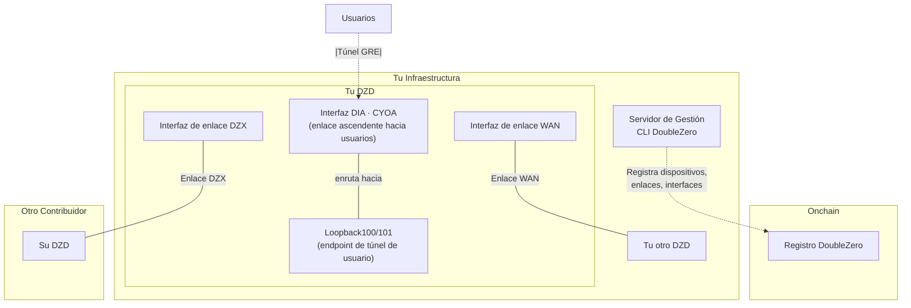
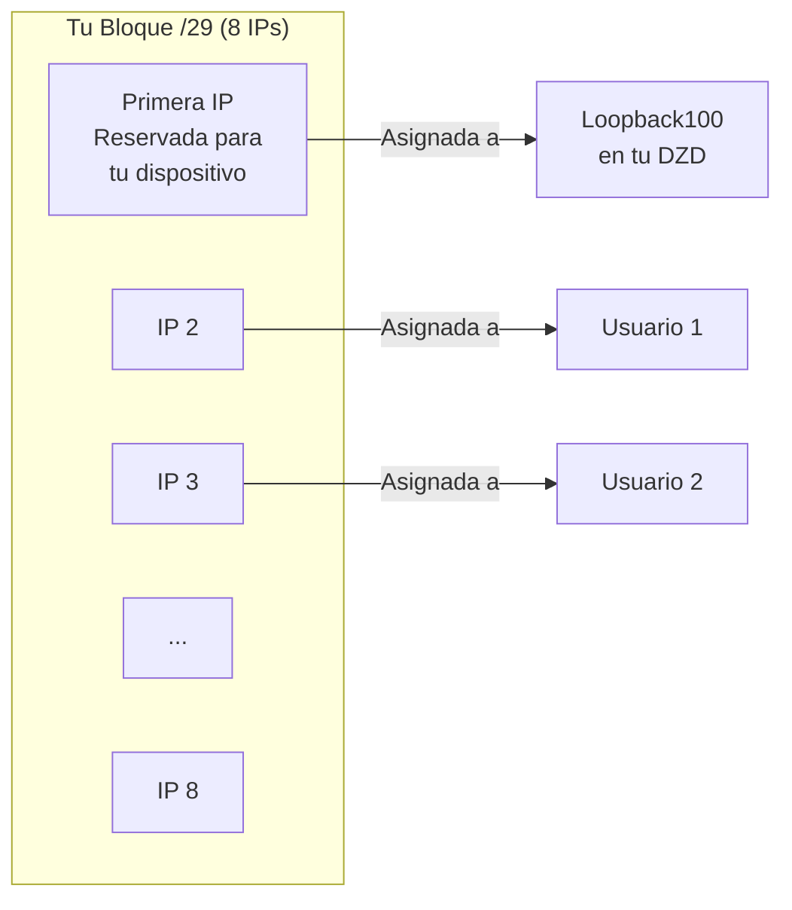
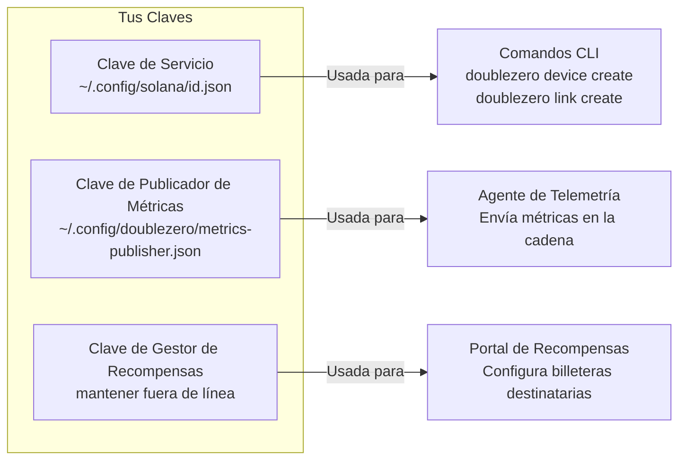
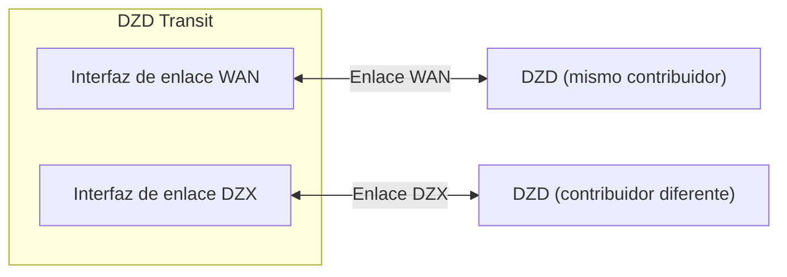

# Guía de Aprovisionamiento de Dispositivos

Esta guía te acompaña a través del aprovisionamiento de un Dispositivo DoubleZero (DZD) de principio a fin. Cada fase corresponde a la [Lista de Verificación de Incorporación](contribute-overview.md#onboarding-checklist).

---

## Cómo Encaja Todo

Esta guía te acompaña a través del registro de tu infraestructura en la cadena para que la red DoubleZero pueda enrutar tráfico a través de ella. Cuanto más completamente esté registrado tu dispositivo, más útil será para la red. Una representación completa en la cadena de tu dispositivo permite una mejor resolución de problemas, planificación de capacidad, y permite al controlador tomar decisiones informadas. Con el tiempo, el objetivo es que el controlador asuma más responsabilidad de configuración.

### Conceptos clave

**Interfaces**

Las interfaces en un DZD vienen en diferentes formas: puertos Ethernet, canales de puertos (LAGs compuestos por múltiples puertos Ethernet) y loopbacks. Cada interfaz que desempeña un rol en la red necesita ser registrada en la cadena con las banderas apropiadas para que el protocolo sepa qué hace.

Los puertos Ethernet y canales de puertos pueden cumplir los siguientes roles:

| Bandera | Qué significa |
|---------|---------------|
| `--interface-dia dia` | Marca la interfaz como el enlace ascendente de acceso directo a internet |
| `--interface-cyoa <subtype>` | Declara cómo los usuarios establecen túneles GRE a través de esta interfaz (p. ej., por internet público, mediante un enlace de peering privado) |
| `--user-tunnel-endpoint true` | Esta interfaz lleva una IP pública en la que los usuarios terminan túneles GRE |

Las interfaces usadas para enlaces WAN o DZX no llevan una bandera específica, se registran con su ancho de banda y luego se referencian cuando se crea el enlace.

Las interfaces loopback sirven para varios propósitos:

| Loopback | Qué significa |
|----------|---------------|
| **Loopback100 / 101** | Llevan IPs públicas en las que los usuarios terminan túneles GRE. Se registran con `--user-tunnel-endpoint true`. |
| **Loopback255** (`vpnv4`) | Se registra para que el controlador pueda asignar una IP usada para el ID de router BGP, peering VPN-IPv4 (unicast), identidad IS-IS y enrutamiento por segmentos |
| **Loopback256** (`ipv4`) | Se registra para que el controlador pueda asignar una IP usada para peering BGP IPv4 (multicast) y sesiones MSDP |

**Enlaces**

Los enlaces se registran por separado de las interfaces, y las interfaces deben existir en la cadena antes de que un enlace pueda referenciarlas. Cuando creas un enlace WAN o DZX, especificas una interfaz ya registrada como el punto final físico del enlace. No todas las interfaces están vinculadas a un enlace: las interfaces DIA, CYOA y loopback no están conectadas a un enlace.

| Término | Qué significa |
|---------|---------------|
| **Enlace WAN** | Un enlace entre dos de tus propios DZDs |
| **Enlace DZX** | Un enlace entre tu DZD y el DZD de otro contribuidor |

### Visión general de la arquitectura


```mermaid
flowchart TB
    subgraph Onchain
        SC[Registro DoubleZero]
    end

    subgraph Tu Infraestructura
        MGMT[Servidor de Gestión<br/>CLI DoubleZero]
        subgraph DZD[Tu DZD]
            CYOA["Interfaz DIA · CYOA<br/>(enlace ascendente hacia usuarios)"]
            WAN_INTF["Interfaz de enlace WAN"]
            DZX_INTF["Interfaz de enlace DZX"]
            LO100["Loopback100/101<br/>(endpoint de túnel de usuario)"]
        end
        DZD2[Tu otro DZD]
    end

    subgraph Otro Contribuidor
        OtherDZD[Su DZD]
    end

    USERS["Usuarios"]

    MGMT -.->|Registra dispositivos,<br/>enlaces, interfaces| SC
    WAN_INTF ---|Enlace WAN| DZD2
    DZX_INTF ---|Enlace DZX| OtherDZD
    USERS -.|Túnel GRE|.-> CYOA
    CYOA ---|enruta hacia| LO100
```

---

## Fase 1: Requisitos Previos

Antes de poder aprovisionar un dispositivo, necesitas tener el hardware físico configurado y algunas direcciones IP asignadas.

### Lo Que Necesitas

| Requisito | Por Qué Se Necesita |
|-----------|---------------------|
| **Hardware DZD** | Switch Arista 7280CR3A (ver [especificaciones de hardware](contribute.md#hardware-requirements)) |
| **Espacio en Rack** | 1U por DZD, con flujo de aire adecuado. Ver [Rack y Alimentación](contribute.md#rack-power-requirements) |
| **Alimentación** | Dos alimentaciones independientes, cada una capaz de soportar toda la carga por sí sola. Ver [Rack y Alimentación](contribute.md#rack-power-requirements) |
| **Acceso de Gestión** | Acceso SSH/consola para configurar el switch |
| **Conectividad a Internet** | Para publicar métricas y obtener configuración del controlador |
| **Bloque IPv4 Público** | Mínimo /29 para el pool de prefijos DZ (ver abajo) |

### Instalar el CLI de DoubleZero

El CLI de DoubleZero (`doublezero`) se usa durante todo el aprovisionamiento para registrar dispositivos, crear enlaces y gestionar tu contribución. Debe instalarse en un **servidor de gestión o VM** — no en el switch DZD. El switch solo ejecuta el Agente de Configuración y el Agente de Telemetría (instalados en la [Fase 4](#fase-4-establecimiento-de-enlaces-e-instalación-de-agentes)).

**Ubuntu / Debian:**
```bash
curl -1sLf https://dl.cloudsmith.io/public/malbeclabs/doublezero/setup.deb.sh | sudo -E bash
sudo apt-get install doublezero
```

**Rocky Linux / RHEL:**
```bash
curl -1sLf https://dl.cloudsmith.io/public/malbeclabs/doublezero/setup.rpm.sh | sudo -E bash
sudo yum install doublezero
```

Verifica que el demonio esté ejecutándose:
```bash
sudo systemctl status doublezerod
```

### Entendiendo Tu Prefijo DZ

Tu prefijo DZ es un bloque de direcciones IP públicas que el protocolo DoubleZero gestiona para la asignación de IPs.


```mermaid
flowchart LR
    subgraph "Tu Bloque /29 (8 IPs)"
        IP1["Primera IP<br/>Reservada para<br/>tu dispositivo"]
        IP2["IP 2"]
        IP3["IP 3"]
        IP4["..."]
        IP8["IP 8"]
    end

    IP1 -->|Asignada a| LO[Loopback100<br/>en tu DZD]
    IP2 -->|Asignada a| U1[Usuario 1]
    IP3 -->|Asignada a| U2[Usuario 2]
```

**Cómo se usan los prefijos DZ:**

- **Primera IP**: Reservada para tu dispositivo (asignada a la interfaz Loopback100)
- **IPs restantes**: Asignadas a tipos específicos de usuarios que se conectan a tu DZD:
    - Usuarios `IBRLWithAllocatedIP`
    - Usuarios `EdgeFiltering` (caso de uso futuro)
- **Usuarios IBRL**: NO consumen de este pool (usan su propia IP pública)

!!! warning "Reglas del Prefijo DZ"
    **NO PUEDES usar estas direcciones para:**

    - Tu propio equipo de red
    - Enlaces punto a punto en interfaces DIA
    - Interfaces de gestión
    - Cualquier infraestructura fuera del protocolo DZ

    **Requisitos:**

    - Deben ser direcciones IPv4 **enrutables globalmente (públicas)**
    - Los rangos de IP privados (10.x, 172.16-31.x, 192.168.x) son rechazados por el contrato inteligente
    - **Tamaño mínimo: /29** (8 direcciones), se prefieren prefijos más grandes (p. ej., /28, /27)
    - El bloque completo debe estar disponible — no preasignes ninguna dirección

    Si necesitas direcciones para tu propio equipo (IPs de interfaz DIA, gestión, etc.), usa un **pool de direcciones separado**.

---

## Fase 2: Configuración de Cuenta

En esta fase, creas las claves criptográficas que te identifican a ti y a tus dispositivos en la red, e indicas dónde deben pagarse tus recompensas.

Tres claves resultan de esta fase: una clave de servicio, una clave de publicador de métricas y una clave de gestor de recompensas. Envía las claves públicas de las tres a DZF juntas en el [Paso 2.4](#paso-24-enviar-claves-a-dzf). [Gestión de Recompensas](contribute-rewards.md) cubre completamente el lado de las recompensas.

### Dónde Ejecutar el CLI

!!! warning "NO instales el CLI en tu switch"
    El CLI de DoubleZero (`doublezero`) debe instalarse en un **servidor de gestión o VM**, no en tu switch Arista.

    ```mermaid
    flowchart LR
        subgraph "Servidor de Gestión/VM"
            CLI[CLI DoubleZero]
            KEYS[Tus Pares de Claves]
        end

        subgraph "Tu Switch DZD"
            CA[Agente de Configuración]
            TA[Agente de Telemetría]
        end

        CLI -->|Crea dispositivos, enlaces| BC[Blockchain]
        CA -->|Obtiene configuración| CTRL[Controlador]
        TA -->|Envía métricas| BC
    ```

    | Instalar en Servidor de Gestión | Instalar en Switch |
    |---------------------------------|-------------------|
    | CLI `doublezero` | Agente de Configuración |
    | Tu par de claves de servicio | Agente de Telemetría |
    | Tu par de claves de publicador de métricas | Par de claves de publicador de métricas (copia) |

### ¿Qué Son las Claves?

Piensa en las claves como credenciales de inicio de sesión seguras:

- **Clave de Servicio**: Tu identidad como contribuidor - usada para ejecutar comandos del CLI
- **Clave de Publicador de Métricas**: La identidad de tu dispositivo para enviar datos de telemetría
- **Clave de Gestor de Recompensas**: Controla qué billeteras reciben tus recompensas - ver [Gestión de Recompensas](contribute-rewards.md)

Las tres son pares de claves criptográficas (una clave pública que compartes, una clave privada que mantienes en secreto).


```mermaid
flowchart LR
    subgraph "Tus Claves"
        SK[Clave de Servicio<br/>~/.config/solana/id.json]
        MK[Clave de Publicador de Métricas<br/>~/.config/doublezero/metrics-publisher.json]
        RK[Clave de Gestor de Recompensas<br/>mantener fuera de línea]
    end

    SK -->|Usada para| CLI[Comandos CLI<br/>doublezero device create<br/>doublezero link create]
    MK -->|Usada para| TEL[Agente de Telemetría<br/>Envía métricas en la cadena]
    RK -->|Usada para| REW[Portal de Recompensas<br/>Configura billeteras destinatarias]
```

!!! note "Mantén la clave de gestor de recompensas separada"
    La clave de servicio y la clave de publicador de métricas residen en tu servidor de gestión y switch. La clave de gestor de recompensas controla hacia dónde va tu dinero, así que mantenla fuera de esas máquinas. Solo se necesita cuando cambias tus billeteras destinatarias.

### Paso 2.1: Genera Tu Clave de Servicio

Esta es tu identidad principal para interactuar con DoubleZero.

```bash
doublezero keygen
```

Esto crea un par de claves en la ubicación predeterminada. La salida muestra tu **clave pública** - esto es lo que compartirás con DZF.

### Paso 2.2: Genera Tu Clave de Publicador de Métricas

Esta clave es usada por el Agente de Telemetría para firmar los envíos de métricas.

```bash
doublezero keygen -o ~/.config/doublezero/metrics-publisher.json
```

### Paso 2.3: Crea Tu Billetera de Gestor de Recompensas

Esta es la tercera clave. Controla qué billeteras reciben tus recompensas, y nunca las retiene.

Crea una billetera Solana que controles y con la que puedas firmar, luego fínanciala con aproximadamente 0.01 SOL para cubrir las tarifas de transacción. Una billetera de hardware es una buena opción. No reutilices tu clave de servicio.

Solo necesitas la billetera en este punto. Configurarás las billeteras que realmente reciben tus recompensas en el [Paso 2.7](#paso-27-configura-tus-destinatarios-de-recompensas), después de que DZF haya registrado esta clave.

### Paso 2.4: Enviar Claves a DZF

Contacta a la Fundación DoubleZero o Malbec Labs y proporciona:

1. Tu **clave pública de servicio**
2. Tu **clave pública de gestor de recompensas** (del Paso 2.3)
3. Tu **nombre de usuario de GitHub** (para acceso al repositorio)

Envía las tres juntas. DZF registra la clave de servicio y la clave de gestor de recompensas en transacciones separadas en la cadena, así que enviarlas al mismo tiempo ahorra un viaje de ida y vuelta.

!!! danger "Solo claves públicas"
    Nunca envíes una clave privada o un archivo de par de claves a nadie, incluyendo DZF. DZF solo necesita tus claves públicas.

Ellos:

- Crearán tu **cuenta de contribuidor** en la cadena
- Registrarán tu **clave de gestor de recompensas** contra tu clave de servicio
- Otorgarán acceso al **repositorio privado de contribuidores**

### Paso 2.5: Verifica Tu Cuenta

Una vez confirmado, verifica que tu cuenta de contribuidor existe:

```bash
doublezero contributor list
```

Deberías ver tu código de contribuidor en la lista.

Verifica también que tu clave de gestor de recompensas fue registrada:

```bash
doublezero-solana revenue-distribution fetch contributor-rewards \
    --service-key <TuClavePublicaDeServicio> -u mainnet-beta
```

La columna `manager` debería mostrar tu clave pública de gestor de recompensas. Si está vacía, pide a DZF que complete ese paso.

### Paso 2.6: Accede al Repositorio de Contribuidores

El repositorio [malbeclabs/contributors](https://github.com/malbeclabs/contributors) contiene:

- Configuraciones base de dispositivos
- Perfiles TCAM
- Configuraciones de ACL
- Instrucciones adicionales de configuración

Sigue las instrucciones allí para la configuración específica del dispositivo.

### Paso 2.7: Configura Tus Destinatarios de Recompensas

Ahora indica qué billeteras reciben tus recompensas y en qué proporciones. Haz esto antes de que tu dispositivo comience a transportar tráfico. Las recompensas se acumulan desde el momento en que tus enlaces están activos, pero el protocolo no puede pagarlas hasta que hayas designado billeteras destinatarias.

Inicia sesión en [doublezero.xyz/rewards](https://doublezero.xyz/rewards) con tu billetera de gestor de recompensas, selecciona tu clave de servicio, luego ingresa cada billetera destinataria y su porcentaje. Los porcentajes deben sumar 100.

!!! warning "Cada destinatario necesita una cuenta de token 2Z"
    El protocolo envía 2Z con una transferencia de token simple y no crea la cuenta de token por ti. Una billetera destinataria sin cuenta de token 2Z causa que el pago de esa época falle.

Consulta [Gestión de Recompensas](contribute-rewards.md) para el tutorial completo, incluyendo la alternativa por CLI, cómo verificar la cuenta de token y cómo verificar el resultado.

---

## Fase 3: Aprovisionamiento del Dispositivo

Ahora registrarás tu dispositivo físico en la blockchain y configurarás sus interfaces.

### Entendiendo los Tipos de Dispositivo

**Edge** — acepta solo conexiones de usuarios


```mermaid
flowchart LR
    subgraph EDZD[DZD Edge]
        E_CYOA["Interfaz DIA · CYOA"]
        E_TUN["Loopback100/101
        (endpoint de túnel de usuario)"]
        E_DZX["Interfaz de enlace DZX"]
        E_CYOA --- E_TUN
    end
    EU["Usuarios"] -.|Túnel GRE|.-> E_CYOA
    E_DZX <-->|Enlace DZX| ED["DZD (contribuidor diferente)"]
```

**Transit** — mueve tráfico entre dispositivos, sin conexiones de usuarios


```mermaid
flowchart LR
    subgraph TDZD[DZD Transit]
        T_WAN["Interfaz de enlace WAN"]
        T_DZX["Interfaz de enlace DZX"]
    end
    T_WAN <-->|Enlace WAN| T2["DZD (mismo contribuidor)"]
    T_DZX <-->|Enlace DZX| TD["DZD (contribuidor diferente)"]
```

**Hybrid** — conexiones de usuarios y backbone, el más común


```mermaid
flowchart LR
    subgraph HDZD[DZD Hybrid]
        H_CYOA["Interfaz DIA · CYOA"]
        H_TUN["Loopback100/101
        (endpoint de túnel de usuario)"]
        H_WAN["Interfaz de enlace WAN"]
        H_DZX["Interfaz de enlace DZX"]
        H_CYOA --- H_TUN
    end
    HU["Usuarios"] -.|Túnel GRE|.-> H_CYOA
    H_WAN <-->|Enlace WAN| H2["DZD (mismo contribuidor)"]
    H_DZX <-->|Enlace DZX| HD["DZD (contribuidor diferente)"]
```

| Tipo | Qué Hace | Cuándo Usarlo |
|------|----------|---------------|
| **Edge** | Acepta solo conexiones de usuarios | Ubicación única, solo orientado a usuarios |
| **Transit** | Mueve tráfico entre dispositivos | Conectividad backbone, sin usuarios |
| **Hybrid** | Conexiones de usuarios Y backbone | El más común - hace todo |

### Paso 3.1: Encuentra Tu Ubicación e Intercambio

Antes de crear tu dispositivo, busca los códigos de la ubicación de tu centro de datos y el intercambio más cercano:

```bash
# Listar ubicaciones disponibles (centros de datos)
doublezero location list

# Listar intercambios disponibles (puntos de interconexión)
doublezero exchange list
```

### Paso 3.2: Crea Tu Dispositivo en la Cadena

Registra tu dispositivo en la blockchain:

```bash
doublezero device create \
  --code <TU_CÓDIGO_DE_DISPOSITIVO> \
  --contributor <TU_CÓDIGO_DE_CONTRIBUIDOR> \
  --device-type hybrid \
  --location <CÓDIGO_DE_UBICACIÓN> \
  --exchange <CÓDIGO_DE_INTERCAMBIO> \
  --public-ip <IP_PÚBLICA_DEL_DISPOSITIVO> \
  --dz-prefixes <TU_PREFIJO_DZ>
```

**Ejemplo:**

```bash
doublezero device create \
  --code nyc-dz001 \
  --contributor acme \
  --device-type hybrid \
  --location EQX-NY5 \
  --exchange nyc \
  --public-ip "203.0.113.10" \
  --dz-prefixes "198.51.100.0/28"
```

**Salida esperada:**

```
Signature: 4vKz8H...truncated...7xPq2
```

Verifica que tu dispositivo fue creado:

```bash
doublezero device list | grep nyc-dz001
```

**Parámetros explicados:**

| Parámetro | Qué Significa |
|-----------|---------------|
| `--code` | Un nombre único para tu dispositivo (p. ej., `nyc-dz001`) |
| `--contributor` | Tu código de contribuidor (proporcionado por DZF) |
| `--device-type` | `hybrid`, `transit`, o `edge` |
| `--location` | Código del centro de datos de `location list` |
| `--exchange` | Código del intercambio más cercano de `exchange list` |
| `--public-ip` | La IP pública donde los usuarios se conectan a tu dispositivo por internet |
| `--dz-prefixes` | Tu bloque de IP asignado para usuarios |

### Paso 3.3: Crea las Interfaces Loopback Requeridas

Cada dispositivo necesita dos interfaces loopback para enrutamiento interno:

```bash
# Loopback VPNv4
doublezero device interface create <CÓDIGO_DISPOSITIVO> Loopback255 --loopback-type vpnv4

# Loopback IPv4
doublezero device interface create <CÓDIGO_DISPOSITIVO> Loopback256 --loopback-type ipv4
```

**Salida esperada (para cada comando):**

```
Signature: 3mNx9K...truncated...8wRt5
```

### Paso 3.4: Crea Interfaces Físicas

Registra las interfaces físicas que se usarán para enlaces WAN o DZX. Estas interfaces deben existir en la cadena antes de que puedas crear un enlace que las referencie. En este paso solo registras la interfaz y su ancho de banda, el enlace se crea en un paso posterior.

```bash
doublezero device interface create <CÓDIGO_DISPOSITIVO> <NOMBRE_INTERFAZ> \
  --bandwidth <VELOCIDAD_PUERTO>
```

**Ejemplo:**

```bash
doublezero device interface create nyc-dz001 Ethernet1/1 \
  --bandwidth 10Gbps
```

**Salida esperada:**

```
Signature: 7pQw2R...truncated...4xKm9
```

Repite esto para cada interfaz que se usará como endpoint de un enlace WAN o DZX. Las interfaces CYOA y DIA se registran por separado en el siguiente paso.

### Paso 3.5: Crea la Interfaz CYOA (para dispositivos Edge/Hybrid)

Los DZDs hybrid y edge necesitan **dos direcciones IP públicas** en las que los usuarios terminan sus túneles GRE. Los usuarios pueden conectarse por unicast, multicast, o ambos, y qué IP sirve para qué propósito rota por usuario.

Ambas IPs deben registrarse con `--user-tunnel-endpoint true`, ya sea en una interfaz física o un loopback. Esto incluye la IP que proporcionaste al crear el dispositivo, esa IP aún necesita registrarse explícitamente aquí.

Si tienes restricciones de IP, puedes usar el primer `/32` de tu prefijo DZ como una de las dos IPs.

#### CYOA y DIA

| Tipo | Bandera | Propósito |
|------|---------|-----------|
| DIA | `--interface-dia dia` | Marca el puerto como acceso directo a internet |
| CYOA | `--interface-cyoa <subtype>` | Declara cómo los usuarios conectan túneles GRE a tu dispositivo |

La bandera CYOA siempre se establece en una **interfaz física** (puerto Ethernet o canal de puertos). Nunca en un loopback.

| Subtipo CYOA | Cuándo usarlo |
|--------------|---------------|
| `gre-over-dia` | Los usuarios se conectan por internet público. El más común. |
| `gre-over-private-peering` | Los usuarios se conectan mediante una conexión cruzada directa o circuito privado |
| `gre-over-public-peering` | Los usuarios hacen peering contigo en un Internet Exchange (IX) |
| `gre-over-fabric` | Los usuarios están co-ubicados y se conectan por un fabric local |
| `gre-over-cable` | Conexión directa por cable a un único usuario dedicado |

#### Escenario A: Interfaz física única

Un único enlace ascendente físico al ISP. Ethernet1/1 es la interfaz CYOA y DIA y lleva una de las dos IPs públicas. Loopback100 lleva la segunda IP pública.


```mermaid
flowchart LR
    USERS(["Usuarios Finales"])

    subgraph DZD["DZD"]
        E1["Eth1/1
        203.0.113.1/30
        CYOA · DIA · endpoint de túnel de usuario"]
        LO["Loopback100
        198.51.100.1/32\n        endpoint de túnel de usuario"]
        E1 --- LO
    end

    ISP["Router ISP
    203.0.113.2/30"]

    ISP -- "10GbE" --- E1
    USERS -. "Túneles GRE" .-> E1
    USERS -. "Túneles GRE" .-> LO
```

| Interfaz | `--interface-cyoa` | `--interface-dia` | `--ip-net` | `--bandwidth` | `--cir` | `--routing-mode` | `--user-tunnel-endpoint` |
|-----------|-------------------|------------------|------------|---------------|---------|-----------------|--------------------------|
| Ethernet1/1 | `gre-over-dia` | `dia` | IP/subred asignada por el contribuidor | velocidad del puerto | tasa comprometida | `bgp` o `static` | `true` |
| Loopback100 | — | — | tu /32 público | `0bps` | — | — | `true` |

Ejemplo de comandos a ejecutar basados en el Escenario A:
```bash
doublezero device interface create mydzd-nyc01 Ethernet1/1 \
  --interface-cyoa gre-over-dia \
  --interface-dia dia \
  --ip-net 203.0.113.1/30 \
  --bandwidth 10Gbps \
  --cir 1Gbps \
  --routing-mode bgp \
  --user-tunnel-endpoint true

doublezero device interface create mydzd-nyc01 Loopback100 \
  --ip-net 198.51.100.1/32 \
  --bandwidth 0bps \
  --user-tunnel-endpoint true
```

#### Escenario B: Canal de puertos (LAG)

El DZD se conecta al dispositivo upstream mediante un canal de puertos con una IP. El canal de puertos lleva una IP pública y es el endpoint CYOA. Loopback100 lleva la segunda IP pública.


```mermaid
flowchart LR
    USERS(["Usuarios Finales"])

    subgraph SW["Router / Switch Upstream"]
        SWPC(["bond0
        203.0.113.2/30"])
    end

    subgraph DZD["DZD"]
        subgraph PC["Port-Channel1 · 203.0.113.1/30 · CYOA · DIA · endpoint de túnel de usuario"]
            E1["Eth1/1"]
            E2["Eth2/1"]
        end
        LO["Loopback100
        198.51.100.1/32\n        endpoint de túnel de usuario"]
        PC --- LO
    end

    SWPC -- "2x 10GbE" --- PC
    USERS -. "Túneles GRE" .-> PC
    USERS -. "Túneles GRE" .-> LO
```

| Interfaz | `--interface-cyoa` | `--interface-dia` | `--ip-net` | `--bandwidth` | `--cir` | `--routing-mode` | `--user-tunnel-endpoint` |
|-----------|-------------------|------------------|------------|---------------|---------|-----------------|--------------------------|
| Port-Channel1 | `gre-over-dia` | `dia` | IP/subred asignada por el contribuidor | velocidad combinada del LAG | tasa comprometida | `bgp` o `static` | `true` |
| Loopback100 | — | — | tu /32 público | `0bps` | — | — | `true` |

Ejemplo de comandos a ejecutar basados en el Escenario B:
```bash
doublezero device interface create mydzd-fra01 Port-Channel1 \
  --interface-cyoa gre-over-dia \
  --interface-dia dia \
  --ip-net 203.0.113.1/30 \
  --bandwidth 20Gbps \
  --cir 2Gbps \
  --routing-mode bgp \
  --user-tunnel-endpoint true

doublezero device interface create mydzd-fra01 Loopback100 \
  --ip-net 198.51.100.1/32 \
  --bandwidth 0bps \
  --user-tunnel-endpoint true
```


#### Escenario C: Enlaces ascendentes físicos duales a routers separados

Cada