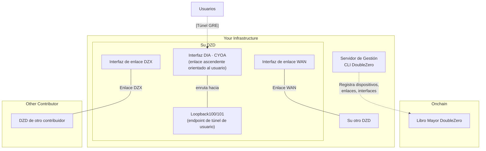
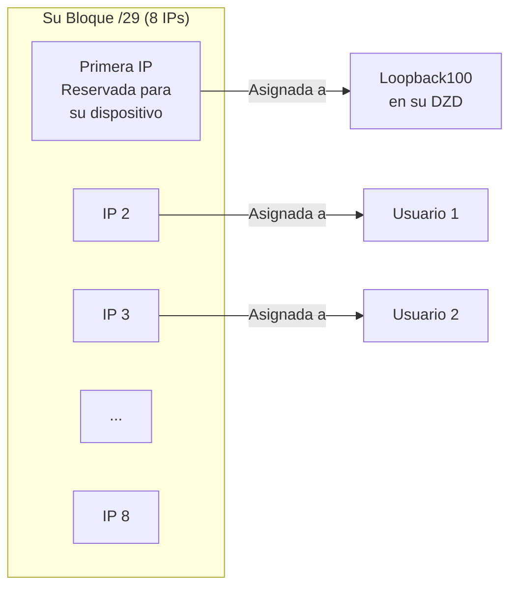
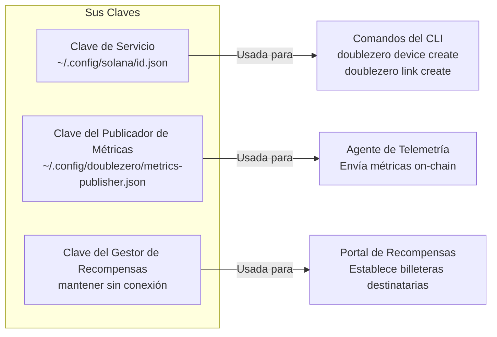
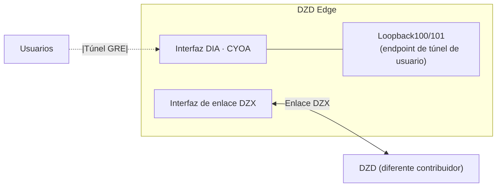
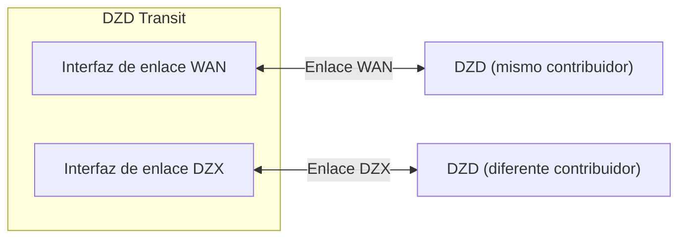
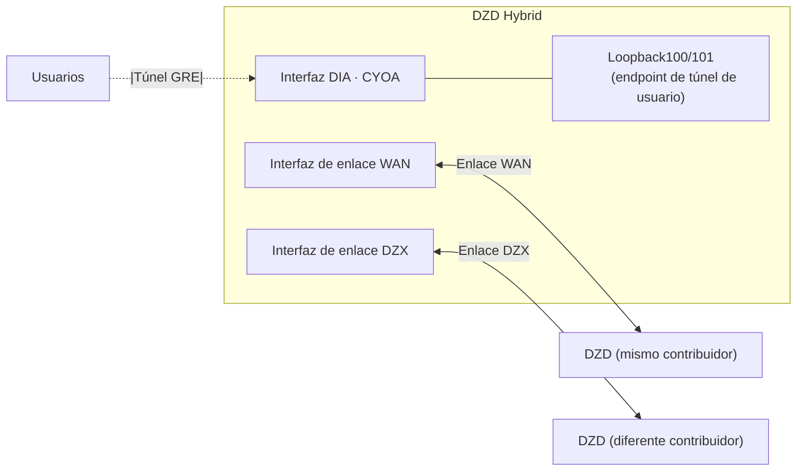
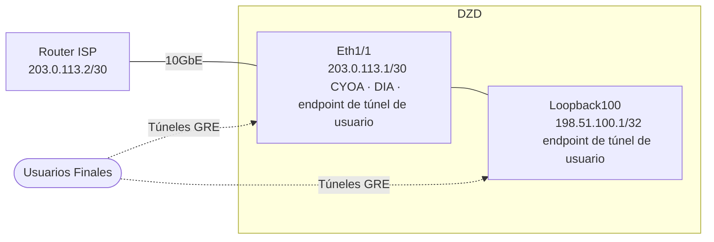
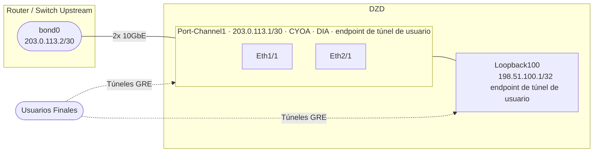
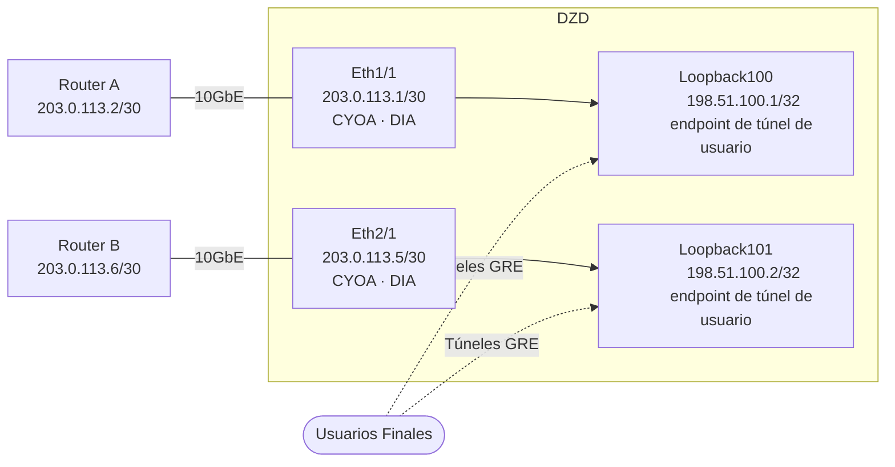

# Guía de Aprovisionamiento de Dispositivos

Esta guía le lleva paso a paso a través del aprovisionamiento de un Dispositivo DoubleZero (DZD) de principio a fin. Cada fase corresponde a la [Lista de Verificación de Incorporación](contribute-overview.md#onboarding-checklist).

---

## Cómo Encaja Todo

Esta guía le lleva a través del registro de su infraestructura on-chain para que la red DoubleZero pueda enrutar tráfico a través de ella. Cuanto más completo sea el registro de su dispositivo, más útil será para la red. Una representación on-chain completa de su dispositivo permite una mejor resolución de problemas, planificación de capacidad y permite al controlador tomar decisiones informadas. Con el tiempo, el objetivo es que el controlador asuma más responsabilidad en la configuración.

### Conceptos clave

**Interfaces**

Las interfaces en un DZD vienen en diferentes formas: puertos Ethernet, canales de puertos (LAGs compuestos por múltiples puertos Ethernet) y loopbacks. Cada interfaz que desempeña un rol en la red necesita ser registrada on-chain con las banderas apropiadas para que el protocolo sepa qué función cumple.

Los puertos Ethernet y los canales de puertos pueden cumplir los siguientes roles:

| Bandera | Qué significa |
|---------|---------------|
| `--interface-dia dia` | Marca la interfaz como enlace ascendente de acceso directo a internet |
| `--interface-cyoa <subtype>` | Declara cómo los usuarios establecen túneles GRE a través de esta interfaz (p. ej., por internet público, mediante un enlace de peering privado) |
| `--user-tunnel-endpoint true` | Esta interfaz lleva una IP pública donde los usuarios terminan túneles GRE |

Las interfaces utilizadas para enlaces WAN o DZX no llevan una bandera específica; se registran con su ancho de banda y luego se referencian cuando se crea el enlace.

Las interfaces loopback cumplen varios propósitos:

| Loopback | Qué significa |
|----------|---------------|
| **Loopback100 / 101** | Llevan IPs públicas donde los usuarios terminan túneles GRE. Se registran con `--user-tunnel-endpoint true`. |
| **Loopback255** (`vpnv4`) | Se registra para que el controlador pueda asignar una IP utilizada para el ID de router BGP, peering VPN-IPv4 (unicast), identidad IS-IS y segment routing |
| **Loopback256** (`ipv4`) | Se registra para que el controlador pueda asignar una IP utilizada para peering BGP IPv4 (multicast) y sesiones MSDP |

**Enlaces**

Los enlaces se registran por separado de las interfaces, y las interfaces deben existir on-chain antes de que un enlace pueda referenciarlas. Cuando crea un enlace WAN o DZX, especifica una interfaz ya registrada como punto final físico del enlace. No todas las interfaces están vinculadas a un enlace: las interfaces DIA, CYOA y loopback no están conectadas a un enlace.

| Término | Qué significa |
|---------|---------------|
| **Enlace WAN** | Un enlace entre dos de sus propios DZDs |
| **Enlace DZX** | Un enlace entre su DZD y el DZD de otro contribuidor |

### Visión general de la arquitectura


```mermaid
flowchart TB
    subgraph Onchain
        SC[Libro Mayor DoubleZero]
    end

    subgraph Your Infrastructure
        MGMT[Servidor de Gestión<br/>CLI DoubleZero]
        subgraph DZD[Su DZD]
            CYOA["Interfaz DIA · CYOA<br/>(enlace ascendente orientado al usuario)"]
            WAN_INTF["Interfaz de enlace WAN"]
            DZX_INTF["Interfaz de enlace DZX"]
            LO100["Loopback100/101<br/>(endpoint de túnel de usuario)"]
        end
        DZD2[Su otro DZD]
    end

    subgraph Other Contributor
        OtherDZD[DZD de otro contribuidor]
    end

    USERS["Usuarios"]

    MGMT -.->|Registra dispositivos,<br/>enlaces, interfaces| SC
    WAN_INTF ---|Enlace WAN| DZD2
    DZX_INTF ---|Enlace DZX| OtherDZD
    USERS -.|Túnel GRE|.-> CYOA
    CYOA ---|enruta hacia| LO100
```

---

## Fase 1: Prerrequisitos

Antes de poder aprovisionar un dispositivo, necesita tener el hardware físico configurado y algunas direcciones IP asignadas.

### Lo Que Necesita

| Requisito | Por Qué Se Necesita |
|-----------|---------------------|
| **Hardware DZD** | Switch Arista 7280CR3A (ver [especificaciones de hardware](contribute.md#hardware-requirements)) |
| **Espacio en Rack** | 2U reservados por DZD (1U en uso actualmente), con flujo de aire adecuado. Ver [Rack y Alimentación](contribute.md#rack-power-requirements) |
| **Alimentación** | Dos alimentaciones independientes, cada una capaz de soportar toda la carga por sí sola. Ver [Rack y Alimentación](contribute.md#rack-power-requirements) |
| **Acceso de Gestión** | Acceso SSH/consola para configurar el switch |
| **Conectividad a Internet** | Para publicación de métricas y obtención de configuración del controlador |
| **Bloque IPv4 Público** | Mínimo /29 para el pool de prefijos DZ (ver abajo) |

### Instalar el CLI de DoubleZero

El CLI de DoubleZero (`doublezero`) se utiliza a lo largo del aprovisionamiento para registrar dispositivos, crear enlaces y gestionar su contribución. Debe instalarse en un **servidor de gestión o VM** — no en el switch DZD en sí. El switch solo ejecuta el Agente de Configuración y el Agente de Telemetría (instalados en la [Fase 4](#phase-4-link-establishment-agent-installation)).

**Ubuntu / Debian:**
```bash
curl -1sLf https://dl.cloudsmith.io/public/malbeclabs/doublezero/setup.deb.sh | sudo -E bash
sudo apt-get install doublezero
```

**Rocky Linux / RHEL:**
```bash
curl -1sLf https://dl.cloudsmith.io/public/malbeclabs/doublezero/setup.rpm.sh | sudo -E bash
sudo yum install doublezero
```

Verifique que el demonio está en ejecución:
```bash
sudo systemctl status doublezerod
```

### Comprender Su Prefijo DZ

Su prefijo DZ es un bloque de direcciones IP públicas que el protocolo DoubleZero gestiona para la asignación de IPs.


```mermaid
flowchart LR
    subgraph "Su Bloque /29 (8 IPs)"
        IP1["Primera IP<br/>Reservada para<br/>su dispositivo"]
        IP2["IP 2"]
        IP3["IP 3"]
        IP4["..."]
        IP8["IP 8"]
    end

    IP1 -->|Asignada a| LO[Loopback100<br/>en su DZD]
    IP2 -->|Asignada a| U1[Usuario 1]
    IP3 -->|Asignada a| U2[Usuario 2]
```

**Cómo se utilizan los prefijos DZ:**

- **Primera IP**: Reservada para su dispositivo (asignada a la interfaz Loopback100)
- **IPs restantes**: Asignadas a tipos específicos de usuarios que se conectan a su DZD:
    - Usuarios `IBRLWithAllocatedIP`
    - Usuarios `EdgeFiltering` (caso de uso futuro)
- **Usuarios IBRL**: NO consumen de este pool (usan su propia IP pública)

!!! warning "Reglas del Prefijo DZ"
    **NO PUEDE usar estas direcciones para:**

    - Su propio equipamiento de red
    - Enlaces punto a punto en interfaces DIA
    - Interfaces de gestión
    - Cualquier infraestructura fuera del protocolo DZ

    **Requisitos:**

    - Deben ser direcciones IPv4 **enrutables globalmente (públicas)**
    - Los rangos de IP privados (10.x, 172.16-31.x, 192.168.x) son rechazados por el contrato inteligente
    - **Tamaño mínimo: /29** (8 direcciones), se prefieren prefijos más grandes (p. ej., /28, /27)
    - El bloque completo debe estar disponible — no pre-asigne ninguna dirección

    Si necesita direcciones para su propio equipamiento (IPs de interfaz DIA, gestión, etc.), use un **pool de direcciones separado**.

---

## Fase 2: Configuración de Cuenta

En esta fase, crea las claves criptográficas que le identifican a usted y a sus dispositivos en la red, y configura la gestión de recompensas.

Los pasos se ejecutan en este orden por una razón: primero el acceso al repositorio, porque el repositorio contiene las instrucciones para los pasos posteriores, luego sus claves, luego las recompensas. Algunos pasos necesitan que DZF actúe antes de que pueda continuar, y cada uno de los siguientes lo indica.

### Dónde Ejecutar el CLI

!!! warning "NO instale el CLI en su switch"
    El CLI de DoubleZero (`doublezero`) debe instalarse en un **servidor de gestión o VM**, no en su switch Arista.

    ```mermaid
    flowchart LR
        subgraph "Servidor de Gestión/VM"
            CLI[CLI DoubleZero]
            KEYS[Sus Pares de Claves]
        end

        subgraph "Su Switch DZD"
            CA[Agente de Configuración]
            TA[Agente de Telemetría]
        end

        CLI -->|Crea dispositivos, enlaces| BC[Blockchain]
        CA -->|Obtiene configuración| CTRL[Controlador]
        TA -->|Envía métricas| BC
    ```

    | Instalar en Servidor de Gestión | Instalar en Switch |
    |---------------------------------|--------------------|
    | CLI `doublezero` | Agente de Configuración |
    | Su par de claves de servicio | Agente de Telemetría |
    | Su par de claves del publicador de métricas | Par de claves del publicador de métricas (copia) |

### ¿Qué Son las Claves?

Piense en las claves como credenciales de inicio de sesión seguras:

- **Clave de Servicio**: Su identidad como contribuidor - utilizada para ejecutar comandos del CLI
- **Clave del Publicador de Métricas**: La identidad de su dispositivo para enviar datos de telemetría
- **Clave del Gestor de Recompensas**: Controla qué billeteras reciben sus recompensas - ver [Gestión de Recompensas](https://github.com/malbeclabs/contributors#rewards-management) en el repositorio de contribuidores

Las tres son pares de claves criptográficas (una clave pública que comparte, una clave privada que mantiene en secreto).


```mermaid
flowchart LR
    subgraph "Sus Claves"
        SK[Clave de Servicio<br/>~/.config/solana/id.json]
        MK[Clave del Publicador de Métricas<br/>~/.config/doublezero/metrics-publisher.json]
        RK[Clave del Gestor de Recompensas<br/>mantener sin conexión]
    end

    SK -->|Usada para| CLI[Comandos del CLI<br/>doublezero device create<br/>doublezero link create]
    MK -->|Usada para| TEL[Agente de Telemetría<br/>Envía métricas on-chain]
    RK -->|Usada para| REW[Portal de Recompensas<br/>Establece billeteras destinatarias]
```

!!! note "Mantenga la clave del gestor de recompensas separada"
    La clave de servicio y la clave del publicador de métricas residen en su servidor de gestión y switch. La clave del gestor de recompensas controla a dónde va su dinero, así que manténgala fuera de esas máquinas. Solo se necesita cuando cambia sus billeteras destinatarias.

### Paso 2.1: Solicitar Acceso al Repositorio de Contribuidores

Contacte a la Fundación DoubleZero o Malbec Labs y proporcióneles su **nombre de usuario de GitHub**.

Le otorgarán acceso al repositorio privado [malbeclabs/contributors](https://github.com/malbeclabs/contributors). Haga esto primero: el repositorio contiene la configuración base del dispositivo, los perfiles TCAM y ACL, y las instrucciones de gestión de recompensas que necesita en los pasos siguientes.

### Paso 2.2: Generar Su Clave de Servicio

Esta es su identidad principal para interactuar con DoubleZero.

```bash
doublezero keygen
```

Esto crea un par de claves en la ubicación predeterminada. La salida muestra su **clave pública** - esto es lo que compartirá con DZF.

### Paso 2.3: Generar Su Clave del Publicador de Métricas

Esta clave es utilizada por el Agente de Telemetría para firmar los envíos de métricas.

```bash
doublezero keygen -o ~/.config/doublezero/metrics-publisher.json
```

### Paso 2.4: Enviar Su Clave de Servicio a DZF

Envíe a DZF su **clave pública de servicio**.

Ellos crearán su **cuenta de contribuidor** on-chain y confirmarán cuando esté listo.

!!! danger "Solo claves públicas"
    Nunca envíe una clave privada o un archivo de par de claves a nadie, incluyendo a DZF. Solo la clave pública es necesaria.

### Paso 2.5: Verificar Su Cuenta

Una vez confirmado, verifique que su cuenta de contribuidor existe:

```bash
doublezero contributor list
```

Debería ver su código de contribuidor en la lista.

### Paso 2.6: Configurar la Gestión de Recompensas

La gestión de recompensas decide qué billeteras reciben los [2Z](glossary.md#2z-token) que genera su contribución, y en qué proporciones.

Siga las instrucciones de [Gestión de Recompensas](https://github.com/malbeclabs/contributors#rewards-management) en el repositorio de contribuidores, al que ahora tiene acceso desde el Paso 2.1.

!!! note "Esto no bloquea el resto de su configuración"
    Puede aprovisionar su dispositivo, establecer enlaces y comenzar a transportar tráfico sin tener esto en su lugar, así que trate las fases siguientes como independientes de esto.

---

## Fase 3: Aprovisionamiento del Dispositivo

Ahora registrará su dispositivo físico en la blockchain y configurará sus interfaces.

### Comprender los Tipos de Dispositivo

**Edge** — acepta solo conexiones de usuarios


```mermaid
flowchart LR
    subgraph EDZD[DZD Edge]
        E_CYOA["Interfaz DIA · CYOA"]
        E_TUN["Loopback100/101
        (endpoint de túnel de usuario)"]
        E_DZX["Interfaz de enlace DZX"]
        E_CYOA --- E_TUN
    end
    EU["Usuarios"] -.|Túnel GRE|.-> E_CYOA
    E_DZX <-->|Enlace DZX| ED["DZD (diferente contribuidor)"]
```

**Transit** — mueve tráfico entre dispositivos, sin conexiones de usuarios


```mermaid
flowchart LR
    subgraph TDZD[DZD Transit]
        T_WAN["Interfaz de enlace WAN"]
        T_DZX["Interfaz de enlace DZX"]
    end
    T_WAN <-->|Enlace WAN| T2["DZD (mismo contribuidor)"]
    T_DZX <-->|Enlace DZX| TD["DZD (diferente contribuidor)"]
```

**Hybrid** — conexiones de usuarios y backbone, el más común


```mermaid
flowchart LR
    subgraph HDZD[DZD Hybrid]
        H_CYOA["Interfaz DIA · CYOA"]
        H_TUN["Loopback100/101
        (endpoint de túnel de usuario)"]
        H_WAN["Interfaz de enlace WAN"]
        H_DZX["Interfaz de enlace DZX"]
        H_CYOA --- H_TUN
    end
    HU["Usuarios"] -.|Túnel GRE|.-> H_CYOA
    H_WAN <-->|Enlace WAN| H2["DZD (mismo contribuidor)"]
    H_DZX <-->|Enlace DZX| HD["DZD (diferente contribuidor)"]
```

| Tipo | Qué Hace | Cuándo Usarlo |
|------|----------|---------------|
| **Edge** | Acepta solo conexiones de usuarios | Ubicación única, solo orientado al usuario |
| **Transit** | Mueve tráfico entre dispositivos | Conectividad backbone, sin usuarios |
| **Hybrid** | Tanto conexiones de usuarios COMO backbone | Más común - hace todo |

### Paso 3.1: Encontrar Su Ubicación e Intercambio

Antes de crear su dispositivo, busque los códigos de la ubicación de su centro de datos y el intercambio más cercano:

```bash
# Listar ubicaciones disponibles (centros de datos)
doublezero location list

# Listar intercambios disponibles (puntos de interconexión)
doublezero exchange list
```

### Paso 3.2: Crear Su Dispositivo On-chain

Registre su dispositivo en la blockchain:

```bash
doublezero device create \
  --code <SU_CÓDIGO_DE_DISPOSITIVO> \
  --contributor <SU_CÓDIGO_DE_CONTRIBUIDOR> \
  --device-type hybrid \
  --location <CÓDIGO_DE_UBICACIÓN> \
  --exchange <CÓDIGO_DE_INTERCAMBIO> \
  --public-ip <IP_PÚBLICA_DEL_DISPOSITIVO> \
  --dz-prefixes <SU_PREFIJO_DZ>
```

**Ejemplo:**

```bash
doublezero device create \
  --code nyc-dz001 \
  --contributor acme \
  --device-type hybrid \
  --location EQX-NY5 \
  --exchange nyc \
  --public-ip "203.0.113.10" \
  --dz-prefixes "198.51.100.0/28"
```

**Salida esperada:**

```
Signature: 4vKz8H...truncated...7xPq2
```

Verifique que su dispositivo fue creado:

```bash
doublezero device list | grep nyc-dz001
```

**Parámetros explicados:**

| Parámetro | Qué Significa |
|-----------|---------------|
| `--code` | Un nombre único para su dispositivo (p. ej., `nyc-dz001`) |
| `--contributor` | Su código de contribuidor (proporcionado por DZF) |
| `--device-type` | `hybrid`, `transit` o `edge` |
| `--location` | Código del centro de datos de `location list` |
| `--exchange` | Código del intercambio más cercano de `exchange list` |
| `--public-ip` | La IP pública donde los usuarios se conectan a su dispositivo por internet |
| `--dz-prefixes` | Su bloque de IPs asignado para usuarios |

### Paso 3.3: Crear Interfaces Loopback Requeridas

Cada dispositivo necesita dos interfaces loopback para enrutamiento interno:

```bash
# Loopback VPNv4
doublezero device interface create <CÓDIGO_DISPOSITIVO> Loopback255 --loopback-type vpnv4

# Loopback IPv4
doublezero device interface create <CÓDIGO_DISPOSITIVO> Loopback256 --loopback-type ipv4
```

**Salida esperada (para cada comando):**

```
Signature: 3mNx9K...truncated...8wRt5
```

### Paso 3.4: Crear Interfaces Físicas

Registre las interfaces físicas que se utilizarán para enlaces WAN o DZX. Estas interfaces deben existir on-chain antes de que pueda crear un enlace que las referencie. En este paso solo registra la interfaz y su ancho de banda; el enlace se crea en un paso posterior.

```bash
doublezero device interface create <CÓDIGO_DISPOSITIVO> <NOMBRE_INTERFAZ> \
  --bandwidth <VELOCIDAD_PUERTO>
```

**Ejemplo:**

```bash
doublezero device interface create nyc-dz001 Ethernet1/1 \
  --bandwidth 10Gbps
```

**Salida esperada:**

```
Signature: 7pQw2R...truncated...4xKm9
```

Repita esto para cada interfaz que se utilizará como punto final de un enlace WAN o DZX. Las interfaces CYOA y DIA se registran por separado en el siguiente paso.

### Paso 3.5: Crear Interfaz CYOA (para dispositivos Edge/Hybrid)

Los DZDs hybrid y edge necesitan **dos direcciones IP públicas** donde los usuarios terminan sus túneles GRE. Los usuarios pueden conectarse por unicast, multicast o ambos, y qué IP sirve para qué propósito rota por usuario.

Ambas IPs deben registrarse con `--user-tunnel-endpoint true`, ya sea en una interfaz física o en un loopback. Esto incluye la IP que proporcionó en el momento de la creación del dispositivo; esa IP aún necesita ser registrada explícitamente aquí.

Si tiene restricciones de IP, puede usar el primer `/32` de su prefijo DZ como una de las dos IPs.

#### CYOA y DIA

| Tipo | Bandera | Propósito |
|------|---------|-----------|
| DIA | `--interface-dia dia` | Marca el puerto como acceso directo a internet |
| CYOA | `--interface-cyoa <subtype>` | Declara cómo los usuarios conectan túneles GRE a su dispositivo |

La bandera CYOA siempre se establece en una **interfaz física** (puerto Ethernet o canal de puertos). Nunca en un loopback.

| Subtipo CYOA | Cuándo usarlo |
|--------------|---------------|
| `gre-over-dia` | Los usuarios se conectan por internet público. El más común. |
| `gre-over-private-peering` | Los usuarios se conectan mediante una conexión cruzada directa o circuito privado |
| `gre-over-public-peering` | Los usuarios hacen peering con usted en un Internet Exchange (IX) |
| `gre-over-fabric` | Los usuarios están co-ubicados y se conectan a través de un fabric local |
| `gre-over-cable` | Conexión directa por cable a un único usuario dedicado |

#### Escenario A: Interfaz física única

Un único enlace ascendente físico al ISP. Ethernet1/1 es la interfaz CYOA y DIA y lleva una de las dos IPs públicas. Loopback100 lleva la segunda IP pública.


```mermaid
flowchart LR
    USERS(["Usuarios Finales"])

    subgraph DZD["DZD"]
        E1["Eth1/1
        203.0.113.1/30
        CYOA · DIA · endpoint de túnel de usuario"]
        LO["Loopback100
        198.51.100.1/32\n        endpoint de túnel de usuario"]
        E1 --- LO
    end

    ISP["Router ISP
    203.0.113.2/30"]

    ISP -- "10GbE" --- E1
    USERS -. "Túneles GRE" .-> E1
    USERS -. "Túneles GRE" .-> LO
```

| Interfaz | `--interface-cyoa` | `--interface-dia` | `--ip-net` | `--bandwidth` | `--cir` | `--routing-mode` | `--user-tunnel-endpoint` |
|-----------|-------------------|------------------|------------|---------------|---------|-----------------|--------------------------|
| Ethernet1/1 | `gre-over-dia` | `dia` | IP/subred asignada por el contribuidor | velocidad del puerto | tasa comprometida | `bgp` o `static` | `true` |
| Loopback100 | — | — | su /32 público | `0bps` | — | — | `true` |

Ejemplo de comandos a ejecutar basándose en el Escenario A:
```bash
doublezero device interface create mydzd-nyc01 Ethernet1/1 \
  --interface-cyoa gre-over-dia \
  --interface-dia dia \
  --ip-net 203.0.113.1/30 \
  --bandwidth 10Gbps \
  --cir 1Gbps \
  --routing-mode bgp \
  --user-tunnel-endpoint true

doublezero device interface create mydzd-nyc01 Loopback100 \
  --ip-net 198.51.100.1/32 \
  --bandwidth 0bps \
  --user-tunnel-endpoint true
```

#### Escenario B: Canal de puertos (LAG)

El DZD se conecta al dispositivo upstream mediante un canal de puertos con una IP. El canal de puertos lleva una IP pública y es el endpoint CYOA. Loopback100 lleva la segunda IP pública.


```mermaid
flowchart LR
    USERS(["Usuarios Finales"])

    subgraph SW["Router / Switch Upstream"]
        SWPC(["bond0
        203.0.113.2/30"])
    end

    subgraph DZD["DZD"]
        subgraph PC["Port-Channel1 · 203.0.113.1/30 · CYOA · DIA · endpoint de túnel de usuario"]
            E1["Eth1/1"]
            E2["Eth2/1"]
        end
        LO["Loopback100
        198.51.100.1/32\n        endpoint de túnel de usuario"]
        PC --- LO
    end

    SWPC -- "2x 10GbE" --- PC
    USERS -. "Túneles GRE" .-> PC
    USERS -. "Túneles GRE" .-> LO
```

| Interfaz | `--interface-cyoa` | `--interface-dia` | `--ip-net` | `--bandwidth` | `--cir` | `--routing-mode` | `--user-tunnel-endpoint` |
|-----------|-------------------|------------------|------------|---------------|---------|-----------------|--------------------------|
| Port-Channel1 | `gre-over-dia` | `dia` | IP/subred asignada por el contribuidor | velocidad combinada del LAG | tasa comprometida | `bgp` o `static` | `true` |
| Loopback100 | — | — | su /32 público | `0bps` | — | — | `true` |

Ejemplo de comandos a ejecutar basándose en el Escenario B:
```bash
doublezero device interface create mydzd-fra01 Port-Channel1 \
  --interface-cyoa gre-over-dia \
  --interface-dia dia \
  --ip-net 203.0.113.1/30 \
  --bandwidth 20Gbps \
  --cir 2Gbps \
  --routing-mode bgp \
  --user-tunnel-endpoint true

doublezero device interface create mydzd-fra01 Loopback100 \
  --ip-net 198.51.100.1/32 \
  --bandwidth 0bps \
  --user-tunnel-endpoint true
```


#### Escenario C: Enlaces ascendentes físicos duales a routers separados

Cada interfaz física se conecta a un router upstream diferente. Las dos IPs públicas residen en Loopback100 y Loopback101, ambos registrados como endpoints de túnel de usuario.


```mermaid
flowchart LR
    USERS(["Usuarios Finales"])

    RA["Router A
    203.0.113.2/30"]
    RB["Router B
    203.0.113.6/30"]

    subgraph DZD["DZD"]
        E1["Eth1/1
        203.0.113.1/30
        CYOA · DIA"]
        E2["Eth2/1
        203.0.113.5/30
        CYOA · DIA"]
        LO0["Loopback100
        198.51.100.1/32\n        endpoint de túnel de usuario"]
        LO1["Loopback101
        198.51.100.2/32\n        endpoint de túnel de usuario"]
        E1 --> LO0
        E2 --> LO1
    end

    RA -- "10GbE" --- E1
    RB -- "10GbE" --- E2
    USERS -. "Túneles GRE" .-> LO0
    USERS -. "Túneles GRE" .-> LO1
```

| Interfaz | `--interface-cyoa` | `--interface-dia` | `--ip-net` | `--bandwidth` | `--cir` | `--routing-mode` | `--user-tunnel-endpoint` |
|-----------|-------------------|------------------|------------|---------------|---------|-----------------|--------------------------|
| Ethernet1/1 | `gre-over-dia` | `dia` | IP/subred asignada por el contribuidor | velocidad del puerto | tasa comprometida | `bgp` o `static` | — |
| Ethernet2/1 | `gre-over-dia` | `dia` | IP/subred asignada por el contribuidor | velocidad del puerto | tasa comprometida | `bgp` o `static` | — |
| Loopback100 | — | — | su /32 público | `0bps` | — | — | `true` |
| Loopback101 | — | — | su /32 público | `0bps` | — | — | `true` |

Ejemplo de comandos a ejecutar basándose en el Esc