# Guía de Aprovisionamiento de Dispositivos

Esta guía te lleva a través del aprovisionamiento de un Dispositivo DoubleZero (DZD) de principio a fin. Cada fase corresponde a la [Lista de Verificación de Incorporación](contribute-overview.md#onboarding-checklist).

---

## Cómo Encaja Todo

Esta guía te lleva a través del registro de tu infraestructura en la cadena para que la red DoubleZero pueda enrutar tráfico a través de ella. Cuanto más completo sea el registro de tu dispositivo, más útil será para la red. Una representación completa en la cadena de tu dispositivo permite una mejor resolución de problemas, planificación de capacidad y permite al controlador tomar decisiones informadas. Con el tiempo, el objetivo es que el controlador asuma más responsabilidad de configuración.

### Conceptos clave

**Interfaces**

Las interfaces en un DZD vienen en diferentes formas: puertos Ethernet, canales de puertos (LAGs compuestos por múltiples puertos Ethernet) y loopbacks. Cada interfaz que cumple un rol en la red necesita ser registrada en la cadena con las flags apropiadas para que el protocolo sepa qué hace.

Los puertos Ethernet y canales de puertos pueden cumplir los siguientes roles:

| Flag | Qué significa |
|------|---------------|
| `--interface-dia dia` | Marca la interfaz como el enlace ascendente de acceso directo a internet |
| `--interface-cyoa <subtype>` | Declara cómo los usuarios establecen túneles GRE a través de esta interfaz (por ejemplo, a través de internet público, mediante un enlace de peering privado) |
| `--user-tunnel-endpoint true` | Esta interfaz lleva una IP pública en la que los usuarios terminan túneles GRE |

Las interfaces usadas para enlaces WAN o DZX no llevan una flag específica, se registran con su ancho de banda y luego se referencian cuando se crea el enlace.

Las interfaces loopback sirven para varios propósitos:

| Loopback | Qué significa |
|----------|---------------|
| **Loopback100 / 101** | Llevan IPs públicas en las que los usuarios terminan túneles GRE. Se registran con `--user-tunnel-endpoint true`. |
| **Loopback255** (`vpnv4`) | Se registra para que el controlador pueda asignar una IP usada para el router ID de BGP, peering VPN-IPv4 (unicast), identidad IS-IS y segment routing |
| **Loopback256** (`ipv4`) | Se registra para que el controlador pueda asignar una IP usada para peering BGP IPv4 (multicast) y sesiones MSDP |

**Enlaces**

Los enlaces se registran por separado de las interfaces, y las interfaces deben existir en la cadena antes de que un enlace pueda referenciarlas. Cuando creas un enlace WAN o DZX, especificas una interfaz ya registrada como el punto final físico del enlace. No todas las interfaces están vinculadas a un enlace: las interfaces DIA, CYOA y loopback no están conectadas a un enlace.

| Término | Qué significa |
|---------|---------------|
| **Enlace WAN** | Un enlace entre dos de tus propios DZDs |
| **Enlace DZX** | Un enlace entre tu DZD y el DZD de otro contribuidor |

### Visión general de la arquitectura

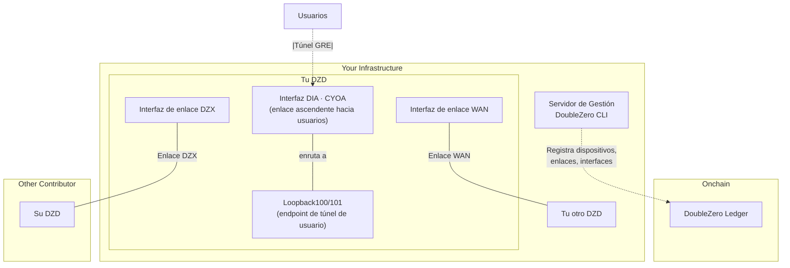
```mermaid
flowchart TB
    subgraph Onchain
        SC[DoubleZero Ledger]
    end

    subgraph Your Infrastructure
        MGMT[Servidor de Gestión<br/>DoubleZero CLI]
        subgraph DZD[Tu DZD]
            CYOA["Interfaz DIA · CYOA<br/>(enlace ascendente hacia usuarios)"]
            WAN_INTF["Interfaz de enlace WAN"]
            DZX_INTF["Interfaz de enlace DZX"]
            LO100["Loopback100/101<br/>(endpoint de túnel de usuario)"]
        end
        DZD2[Tu otro DZD]
    end

    subgraph Other Contributor
        OtherDZD[Su DZD]
    end

    USERS["Usuarios"]

    MGMT -.->|Registra dispositivos,<br/>enlaces, interfaces| SC
    WAN_INTF ---|Enlace WAN| DZD2
    DZX_INTF ---|Enlace DZX| OtherDZD
    USERS -.|Túnel GRE|.-> CYOA
    CYOA ---|enruta a| LO100
```

---

## Fase 1: Prerrequisitos

Antes de poder aprovisionar un dispositivo, necesitas tener el hardware físico configurado y algunas direcciones IP asignadas.

### Lo Que Necesitas

| Requisito | Por Qué Se Necesita |
|-----------|---------------------|
| **Hardware DZD** | Switch Arista 7280CR3A (ver [especificaciones de hardware](contribute.md#hardware-requirements)) |
| **Espacio en Rack** | 4U con flujo de aire adecuado |
| **Energía** | Alimentación redundante, se recomiendan ~4KW |
| **Acceso de Gestión** | Acceso SSH/consola para configurar el switch |
| **Conectividad a Internet** | Para publicar métricas y obtener configuración del controlador |
| **Bloque IPv4 Público** | Mínimo /29 para el pool de prefijos DZ (ver abajo) |

### Instalar el CLI de DoubleZero

El CLI de DoubleZero (`doublezero`) se usa a lo largo del aprovisionamiento para registrar dispositivos, crear enlaces y gestionar tu contribución. Debe instalarse en un **servidor de gestión o VM** — no en el switch DZD en sí. El switch solo ejecuta el Config Agent y el Telemetry Agent (instalados en la [Fase 4](#phase-4-link-establishment-agent-installation)).

**Ubuntu / Debian:**
```bash
curl -1sLf https://dl.cloudsmith.io/public/malbeclabs/doublezero/setup.deb.sh | sudo -E bash
sudo apt-get install doublezero
```

**Rocky Linux / RHEL:**
```bash
curl -1sLf https://dl.cloudsmith.io/public/malbeclabs/doublezero/setup.rpm.sh | sudo -E bash
sudo yum install doublezero
```

Verifica que el demonio esté ejecutándose:
```bash
sudo systemctl status doublezerod
```

### Entendiendo Tu Prefijo DZ

Tu prefijo DZ es un bloque de direcciones IP públicas que el protocolo DoubleZero gestiona para la asignación de IPs.

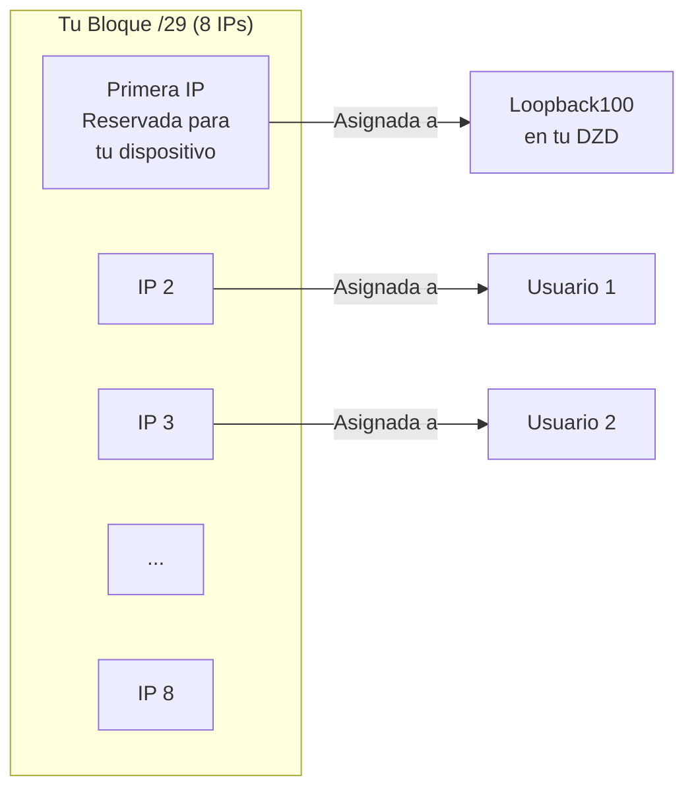
```mermaid
flowchart LR
    subgraph "Tu Bloque /29 (8 IPs)"
        IP1["Primera IP<br/>Reservada para<br/>tu dispositivo"]
        IP2["IP 2"]
        IP3["IP 3"]
        IP4["..."]
        IP8["IP 8"]
    end

    IP1 -->|Asignada a| LO[Loopback100<br/>en tu DZD]
    IP2 -->|Asignada a| U1[Usuario 1]
    IP3 -->|Asignada a| U2[Usuario 2]
```

**Cómo se usan los prefijos DZ:**

- **Primera IP**: Reservada para tu dispositivo (asignada a la interfaz Loopback100)
- **IPs restantes**: Asignadas a tipos específicos de usuarios que se conectan a tu DZD:
    - Usuarios `IBRLWithAllocatedIP`
    - Usuarios `EdgeFiltering` (caso de uso futuro)
- **Usuarios IBRL**: NO consumen de este pool (usan su propia IP pública)

!!! warning "Reglas del Prefijo DZ"
    **NO PUEDES usar estas direcciones para:**

    - Tu propio equipamiento de red
    - Enlaces punto a punto en interfaces DIA
    - Interfaces de gestión
    - Cualquier infraestructura fuera del protocolo DZ

    **Requisitos:**

    - Deben ser direcciones IPv4 **enrutables globalmente (públicas)**
    - Los rangos de IP privados (10.x, 172.16-31.x, 192.168.x) son rechazados por el contrato inteligente
    - **Tamaño mínimo: /29** (8 direcciones), se prefieren prefijos más grandes (por ejemplo, /28, /27)
    - El bloque completo debe estar disponible — no pre-asignes ninguna dirección

    Si necesitas direcciones para tu propio equipamiento (IPs de interfaz DIA, gestión, etc.), usa un **pool de direcciones separado**.

---

## Fase 2: Configuración de Cuenta

En esta fase, creas las claves criptográficas que te identifican a ti y a tus dispositivos en la red.

### Dónde Ejecutar el CLI

!!! warning "NO instales el CLI en tu switch"
    El CLI de DoubleZero (`doublezero`) debe instalarse en un **servidor de gestión o VM**, no en tu switch Arista.

    ```mermaid
    flowchart LR
        subgraph "Servidor de Gestión/VM"
            CLI[DoubleZero CLI]
            KEYS[Tus Pares de Claves]
        end

        subgraph "Tu Switch DZD"
            CA[Config Agent]
            TA[Telemetry Agent]
        end

        CLI -->|Crea dispositivos, enlaces| BC[Blockchain]
        CA -->|Obtiene config| CTRL[Controlador]
        TA -->|Envía métricas| BC
    ```

    | Instalar en Servidor de Gestión | Instalar en el Switch |
    |---------------------------------|-----------------------|
    | CLI `doublezero` | Config Agent |
    | Tu par de claves de servicio | Telemetry Agent |
    | Tu par de claves de publicador de métricas | Par de claves de publicador de métricas (copia) |

### ¿Qué Son las Claves?

Piensa en las claves como credenciales de inicio de sesión seguras:

- **Clave de Servicio**: Tu identidad como contribuidor - usada para ejecutar comandos del CLI
- **Clave de Publicador de Métricas**: La identidad de tu dispositivo para enviar datos de telemetría

Ambas son pares de claves criptográficas (una clave pública que compartes, una clave privada que mantienes en secreto).

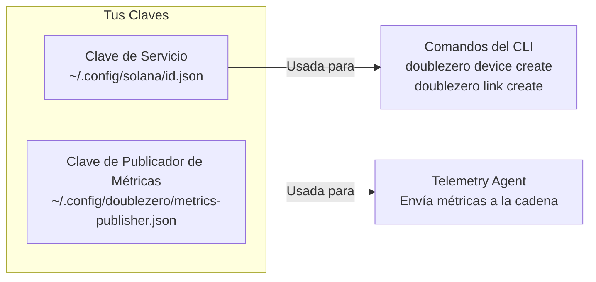
```mermaid
flowchart LR
    subgraph "Tus Claves"
        SK[Clave de Servicio<br/>~/.config/solana/id.json]
        MK[Clave de Publicador de Métricas<br/>~/.config/doublezero/metrics-publisher.json]
    end

    SK -->|Usada para| CLI[Comandos del CLI<br/>doublezero device create<br/>doublezero link create]
    MK -->|Usada para| TEL[Telemetry Agent<br/>Envía métricas a la cadena]
```

### Paso 2.1: Genera Tu Clave de Servicio

Esta es tu identidad principal para interactuar con DoubleZero.

```bash
doublezero keygen
```

Esto crea un par de claves en la ubicación predeterminada. La salida muestra tu **clave pública** - esto es lo que compartirás con DZF.

### Paso 2.2: Genera Tu Clave de Publicador de Métricas

Esta clave es usada por el Telemetry Agent para firmar los envíos de métricas.

```bash
doublezero keygen -o ~/.config/doublezero/metrics-publisher.json
```

### Paso 2.3: Envía las Claves a DZF

Contacta a la Fundación DoubleZero o Malbec Labs y proporciona:

1. Tu **clave pública de servicio**
2. Tu **nombre de usuario de GitHub** (para acceso al repositorio)

Ellos:

- Crearán tu **cuenta de contribuidor** en la cadena
- Otorgarán acceso al **repositorio privado de contribuidores**

### Paso 2.4: Verifica Tu Cuenta

Una vez confirmado, verifica que tu cuenta de contribuidor exista:

```bash
doublezero contributor list
```

Deberías ver tu código de contribuidor en la lista.

### Paso 2.5: Accede al Repositorio de Contribuidores

El repositorio [malbeclabs/contributors](https://github.com/malbeclabs/contributors) contiene:

- Configuraciones base de dispositivos
- Perfiles TCAM
- Configuraciones de ACL
- Instrucciones adicionales de configuración

Sigue las instrucciones allí para la configuración específica del dispositivo.

---

## Fase 3: Aprovisionamiento del Dispositivo

Ahora registrarás tu dispositivo físico en la blockchain y configurarás sus interfaces.

### Entendiendo los Tipos de Dispositivo {#understanding-device-types}

**Edge** — solo acepta conexiones de usuarios

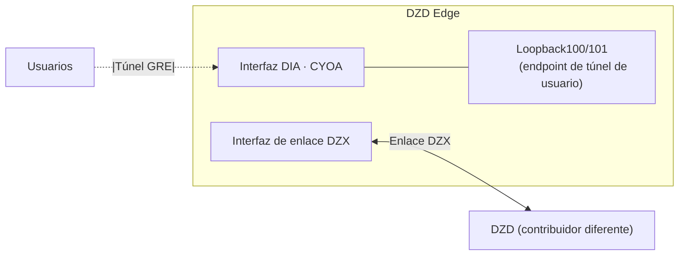
```mermaid
flowchart LR
    subgraph EDZD[DZD Edge]
        E_CYOA["Interfaz DIA · CYOA"]
        E_TUN["Loopback100/101
        (endpoint de túnel de usuario)"]
        E_DZX["Interfaz de enlace DZX"]
        E_CYOA --- E_TUN
    end
    EU["Usuarios"] -.|Túnel GRE|.-> E_CYOA
    E_DZX <-->|Enlace DZX| ED["DZD (contribuidor diferente)"]
```

**Transit** — mueve tráfico entre dispositivos, sin conexiones de usuarios

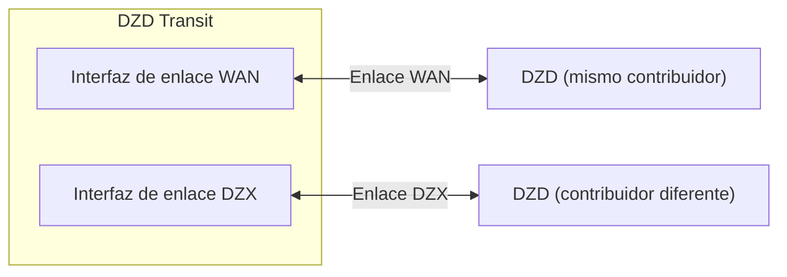
```mermaid
flowchart LR
    subgraph TDZD[DZD Transit]
        T_WAN["Interfaz de enlace WAN"]
        T_DZX["Interfaz de enlace DZX"]
    end
    T_WAN <-->|Enlace WAN| T2["DZD (mismo contribuidor)"]
    T_DZX <-->|Enlace DZX| TD["DZD (contribuidor diferente)"]
```

**Hybrid** — conexiones de usuarios y backbone, el más común

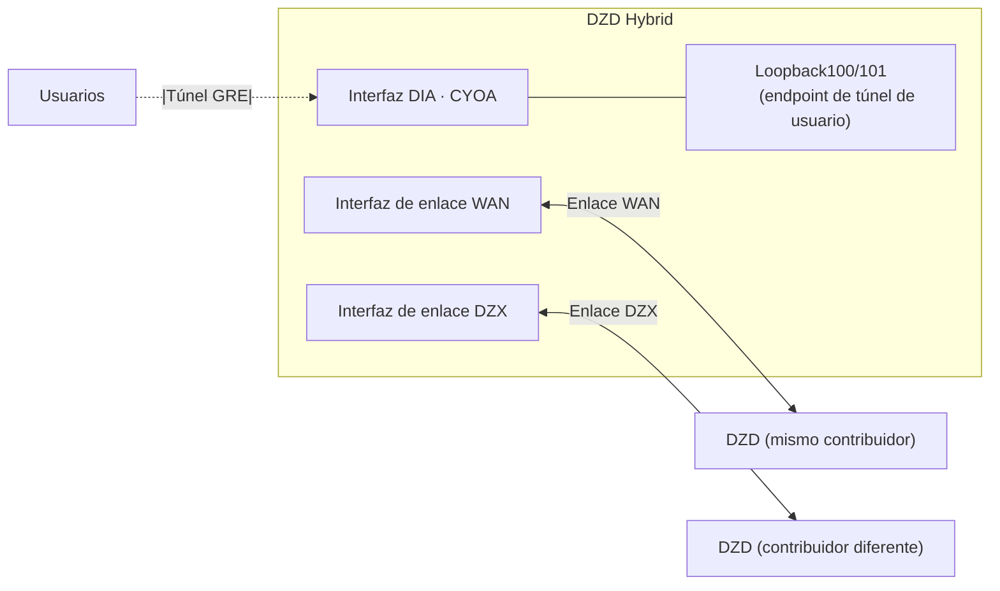
```mermaid
flowchart LR
    subgraph HDZD[DZD Hybrid]
        H_CYOA["Interfaz DIA · CYOA"]
        H_TUN["Loopback100/101
        (endpoint de túnel de usuario)"]
        H_WAN["Interfaz de enlace WAN"]
        H_DZX["Interfaz de enlace DZX"]
        H_CYOA --- H_TUN
    end
    HU["Usuarios"] -.|Túnel GRE|.-> H_CYOA
    H_WAN <-->|Enlace WAN| H2["DZD (mismo contribuidor)"]
    H_DZX <-->|Enlace DZX| HD["DZD (contribuidor diferente)"]
```

| Tipo | Qué Hace | Cuándo Usarlo |
|------|----------|---------------|
| **Edge** | Solo acepta conexiones de usuarios | Ubicación única, solo orientado a usuarios |
| **Transit** | Mueve tráfico entre dispositivos | Conectividad backbone, sin usuarios |
| **Hybrid** | Conexiones de usuarios Y backbone | El más común - hace todo |

### Paso 3.1: Encuentra Tu Ubicación e Intercambio

Antes de crear tu dispositivo, busca los códigos de la ubicación de tu centro de datos y el intercambio más cercano:

```bash
# Lista las ubicaciones disponibles (centros de datos)
doublezero location list

# Lista los intercambios disponibles (puntos de interconexión)
doublezero exchange list
```

### Paso 3.2: Crea Tu Dispositivo en la Cadena {#step-32-create-your-device-onchain}

Registra tu dispositivo en la blockchain:

```bash
doublezero device create \
  --code <TU_CÓDIGO_DE_DISPOSITIVO> \
  --contributor <TU_CÓDIGO_DE_CONTRIBUIDOR> \
  --device-type hybrid \
  --location <CÓDIGO_DE_UBICACIÓN> \
  --exchange <CÓDIGO_DE_INTERCAMBIO> \
  --public-ip <IP_PÚBLICA_DEL_DISPOSITIVO> \
  --dz-prefixes <TU_PREFIJO_DZ>
```

**Ejemplo:**

```bash
doublezero device create \
  --code nyc-dz001 \
  --contributor acme \
  --device-type hybrid \
  --location EQX-NY5 \
  --exchange nyc \
  --public-ip "203.0.113.10" \
  --dz-prefixes "198.51.100.0/28"
```

**Salida esperada:**

```
Signature: 4vKz8H...truncated...7xPq2
```

Verifica que tu dispositivo fue creado:

```bash
doublezero device list | grep nyc-dz001
```

**Parámetros explicados:**

| Parámetro | Qué Significa |
|-----------|---------------|
| `--code` | Un nombre único para tu dispositivo (por ejemplo, `nyc-dz001`) |
| `--contributor` | Tu código de contribuidor (proporcionado por DZF) |
| `--device-type` | `hybrid`, `transit`, o `edge` |
| `--location` | Código del centro de datos de `location list` |
| `--exchange` | Código del intercambio más cercano de `exchange list` |
| `--public-ip` | La IP pública donde los usuarios se conectan a tu dispositivo vía internet |
| `--dz-prefixes` | Tu bloque de IPs asignado para usuarios |

### Paso 3.3: Crea las Interfaces Loopback Requeridas

Cada dispositivo necesita dos interfaces loopback para enrutamiento interno:

```bash
# Loopback VPNv4
doublezero device interface create <CÓDIGO_DISPOSITIVO> Loopback255 --loopback-type vpnv4

# Loopback IPv4
doublezero device interface create <CÓDIGO_DISPOSITIVO> Loopback256 --loopback-type ipv4
```

**Salida esperada (para cada comando):**

```
Signature: 3mNx9K...truncated...8wRt5
```

### Paso 3.4: Crea las Interfaces Físicas

Registra las interfaces físicas que se usarán para enlaces WAN o DZX. Estas interfaces deben existir en la cadena antes de que puedas crear un enlace que las referencie. En este paso solo registras la interfaz y su ancho de banda, el enlace se crea en un paso posterior.

```bash
doublezero device interface create <CÓDIGO_DISPOSITIVO> <NOMBRE_INTERFAZ> \
  --bandwidth <VELOCIDAD_DEL_PUERTO>
```

**Ejemplo:**

```bash
doublezero device interface create nyc-dz001 Ethernet1/1 \
  --bandwidth 10Gbps
```

**Salida esperada:**

```
Signature: 7pQw2R...truncated...4xKm9
```

Repite esto para cada interfaz que se usará como endpoint de enlace WAN o DZX. Las interfaces CYOA y DIA se registran por separado en el siguiente paso.

### Paso 3.5: Crea la Interfaz CYOA (para dispositivos Edge/Hybrid) {#step-35-create-cyoa-interface-for-edgehybrid-devices}

Los DZDs hybrid y edge necesitan **dos direcciones IP públicas** en las que los usuarios terminan sus túneles GRE. Los usuarios pueden conectarse vía unicast, multicast, o ambos, y qué IP sirve para qué propósito rota por usuario.

Ambas IPs deben registrarse con `--user-tunnel-endpoint true`, ya sea en una interfaz física o un loopback. Esto incluye la IP que proporcionaste al momento de crear el dispositivo, esa IP aún necesita ser registrada explícitamente aquí.

Si tienes restricciones de IP, puedes usar el primer `/32` de tu prefijo DZ como una de las dos IPs.

#### CYOA y DIA

| Tipo | Flag | Propósito |
|------|------|-----------|
| DIA | `--interface-dia dia` | Marca el puerto como acceso directo a internet |
| CYOA | `--interface-cyoa <subtype>` | Declara cómo los usuarios conectan túneles GRE a tu dispositivo |

La flag CYOA siempre se establece en una **interfaz física** (puerto Ethernet o canal de puertos). Nunca en un loopback.

| Subtipo CYOA | Cuándo usarlo |
|-------------|---------------|
| `gre-over-dia` | Los usuarios se conectan a través de internet público. El más común. |
| `gre-over-private-peering` | Los usuarios se conectan vía una conexión cruzada directa o circuito privado |
| `gre-over-public-peering` | Los usuarios hacen peering contigo en un Internet Exchange (IX) |
| `gre-over-fabric` | Los usuarios están co-ubicados y se conectan a través de un fabric local |
| `gre-over-cable` | Conexión por cable directa a un único usuario dedicado |

#### Escenario A: Interfaz física única

Un único enlace ascendente físico al ISP. Ethernet1/1 es la interfaz CYOA y DIA y lleva una de las dos IPs públicas. Loopback100 lleva la segunda IP pública.

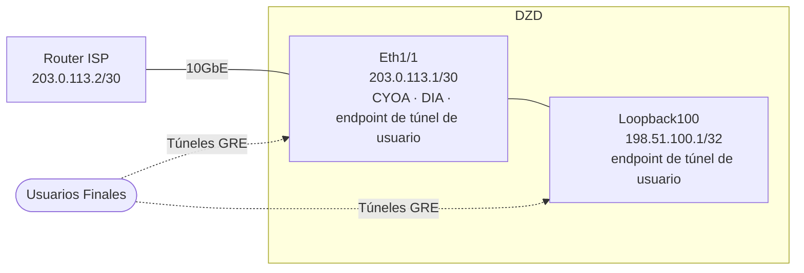
```mermaid
flowchart LR
    USERS(["Usuarios Finales"])

    subgraph DZD["DZD"]
        E1["Eth1/1
        203.0.113.1/30
        CYOA · DIA · endpoint de túnel de usuario"]
        LO["Loopback100
        198.51.100.1/32\n        endpoint de túnel de usuario"]
        E1 --- LO
    end

    ISP["Router ISP
    203.0.113.2/30"]

    ISP -- "10GbE" --- E1
    USERS -. "Túneles GRE" .-> E1
    USERS -. "Túneles GRE" .-> LO
```

| Interfaz | `--interface-cyoa` | `--interface-dia` | `--ip-net` | `--bandwidth` | `--cir` | `--routing-mode` | `--user-tunnel-endpoint` |
|-----------|-------------------|------------------|------------|---------------|---------|-----------------|--------------------------|
| Ethernet1/1 | `gre-over-dia` | `dia` | IP/subred asignada por el contribuidor | velocidad del puerto | tasa comprometida | `bgp` o `static` | `true` |
| Loopback100 | — | — | tu /32 público | `0bps` | — | — | `true` |

Ejemplo de comandos a ejecutar basado en el Escenario A:
```bash
doublezero device interface create mydzd-nyc01 Ethernet1/1 \
  --interface-cyoa gre-over-dia \
  --interface-dia dia \
  --ip-net 203.0.113.1/30 \
  --bandwidth 10Gbps \
  --cir 1Gbps \
  --routing-mode bgp \
  --user-tunnel-endpoint true

doublezero device interface create mydzd-nyc01 Loopback100 \
  --ip-net 198.51.100.1/32 \
  --bandwidth 0bps \
  --user-tunnel-endpoint true
```

#### Escenario B: Canal de puertos (LAG)

El DZD se conecta al dispositivo upstream mediante un canal de puertos con una IP. El canal de puertos lleva una IP pública y es el endpoint CYOA. Loopback100 lleva la segunda IP pública.

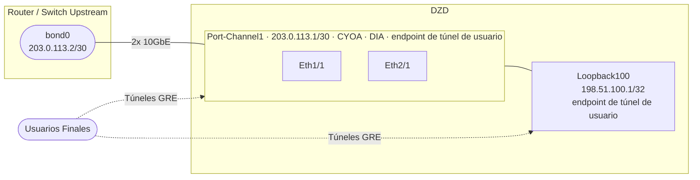
```mermaid
flowchart LR
    USERS(["Usuarios Finales"])

    subgraph SW["Router / Switch Upstream"]
        SWPC(["bond0
        203.0.113.2/30"])
    end

    subgraph DZD["DZD"]
        subgraph PC["Port-Channel1 · 203.0.113.1/30 · CYOA · DIA · endpoint de túnel de usuario"]
            E1["Eth1/1"]
            E2["Eth2/1"]
        end
        LO["Loopback100
        198.51.100.1/32\n        endpoint de túnel de usuario"]
        PC --- LO
    end

    SWPC -- "2x 10GbE" --- PC
    USERS -. "Túneles GRE" .-> PC
    USERS -. "Túneles GRE" .-> LO
```

| Interfaz | `--interface-cyoa` | `--interface-dia` | `--ip-net` | `--bandwidth` | `--cir` | `--routing-mode` | `--user-tunnel-endpoint` |
|-----------|-------------------|------------------|------------|---------------|---------|-----------------|--------------------------|
| Port-Channel1 | `gre-over-dia` | `dia` | IP/subred asignada por el contribuidor | velocidad LAG combinada | tasa comprometida | `bgp` o `static` | `true` |
| Loopback100 | — | — | tu /32 público | `0bps` | — | — | `true` |

Ejemplo de comandos a ejecutar basado en el Escenario B:
```bash
doublezero device interface create mydzd-fra01 Port-Channel1 \
  --interface-cyoa gre-over-dia \
  --interface-dia dia \
  --ip-net 203.0.113.1/30 \
  --bandwidth 20Gbps \
  --cir 2Gbps \
  --routing-mode bgp \
  --user-tunnel-endpoint true

doublezero device interface create mydzd-fra01 Loopback100 \
  --ip-net 198.51.100.1/32 \
  --bandwidth 0bps \
  --user-tunnel-endpoint true
```


#### Escenario C: Enlaces ascendentes físicos duales a routers separados

Cada interfaz física se conecta a un router upstream diferente. Las dos IPs públicas residen en Loopback100 y Loopback101, ambas registradas como endpoints de túnel de usuario.

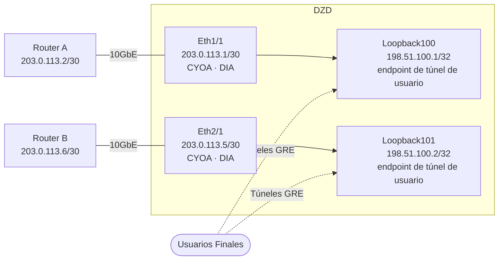
```mermaid
flowchart LR
    USERS(["Usuarios Finales"])

    RA["Router A
    203.0.113.2/30"]
    RB["Router B
    203.0.113.6/30"]

    subgraph DZD["DZD"]
        E1["Eth1/1
        203.0.113.1/30
        CYOA · DIA"]
        E2["Eth2/1
        203.0.113.5/30
        CYOA · DIA"]
        LO0["Loopback100
        198.51.100.1/32\n        endpoint de túnel de usuario"]
        LO1["Loopback101
        198.51.100.2/32\n        endpoint de túnel de usuario"]
        E1 --> LO0
        E2 --> LO1
    end

    RA -- "10GbE" --- E1
    RB -- "10GbE" --- E2
    USERS -. "Túneles GRE" .-> LO0
    USERS -. "Túneles GRE" .-> LO1
```

| Interfaz | `--interface-cyoa` | `--interface-dia` | `--ip-net` | `--bandwidth` | `--cir` | `--routing-mode` | `--user-tunnel-endpoint` |
|-----------|-------------------|------------------|------------|---------------|---------|-----------------|--------------------------|
| Ethernet1/1 | `gre-over-dia` | `dia` | IP/subred asignada por el contribuidor | velocidad del puerto | tasa comprometida | `bgp` o `static` | — |
| Ethernet2/1 | `gre-over-dia` | `dia` | IP/subred asignada por el contribuidor | velocidad del puerto | tasa comprometida | `bgp` o `static` | — |
| Loopback100 | — | — | tu /32 público | `0bps` | — | — | `true` |
| Loopback101 | — | — | tu /32 público | `0bps` | — | — | `true` |

Ejemplo de comandos a ejecutar basado en el Escenario C:
```bash
doublezero device interface create mydzd-ams01 Ethernet1/1 \
  --interface-cyoa gre-over-dia \
  --interface-dia dia \
  --ip-net 203.0.113.1/30 \
  --bandwidth 10Gbps \
  --cir 1Gbps \
  --routing-mode bgp

doublezero device interface create mydzd-ams01 Ethernet2/1 \
  --interface-cyoa gre-over-dia \
  --interface-dia dia \
  --ip-net 203.0.113.5/30 \
  --bandwidth 10Gbps \
  --cir 1Gbps \
  --routing-mode bgp

doublezero device interface create mydzd-ams01 Loopback100 \
  --ip-net 198.51.100.1/32 \
  --bandwidth 0bps \
  --user-tunnel-endpoint true

doublezero device interface create mydzd-ams01 Loopback101 \
  --ip-net 198.51.100.2/32 \
  --bandwidth 0bps \
  --user-tunnel-endpoint true
```

### Paso 3.6: Verifica Tu Dispositivo

```bash
doublezero device list
```

**Salida de ejemplo:**

```
 account                                      | code      | contributor | location | exchange | device_type | public_ip    | dz_prefixes     | users | max_users | status    | health  | mgmt_vrf | owner
 7xKm9pQw2R4vHt3...                          | nyc-dz001 | acme        | EQX-NY5  | nyc      | hybrid      | 203.0.113.10 | 198.51.100.0/28 | 0     | 14        | activated | pending |          | 5FMtd5Woq5XAAg54...
```

Tu dispositivo debería aparecer con estado `activated`.

---

## Fase 4: Establecimiento de Enlaces e Instalación de Agentes {#phase-4-link-establishment-agent-installation}

Los enlaces conectan tu dispositivo al resto de la red DoubleZero.

### Entendiendo los Enlaces

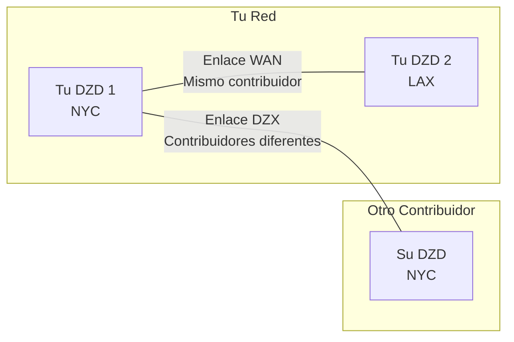
```mermaid
flowchart LR
    subgraph "Tu Red"
        D1[Tu DZD 1<br/>NYC]
        D2[Tu DZD 2<br/>LAX]
    end

    subgraph "Otro Contribuidor"
        O1[Su DZD<br/>NYC]
    end

    D1 ---|Enlace WAN<br/>Mismo contribuidor| D2
    D1 ---|Enlace DZX<br/>Contribuidores diferentes| O1
```

| Tipo de Enlace | Conecta | Aceptación |
|----------------|---------|------------|
| **Enlace WAN** | Dos de TUS dispositivos | Automática (eres dueño de ambos) |
| **Enlace DZX** | Tu dispositivo con el de OTRO contribuidor | Requiere su aceptación |

### Paso 4.1: Crea Enlaces WAN (si tienes múltiples dispositivos)

Los enlaces WAN conectan tus propios dispositivos:

```bash
doublezero link create wan \
  --code <CÓDIGO_ENLACE> \
  --contributor <TU_CONTRIBUIDOR> \
  --side-a <CÓDIGO_DISPOSITIVO_1> \
  --side-a-interface <INTERFAZ_EN_DISPOSITIVO_1> \
  --side-z <CÓDIGO_DISPOSITIVO_2> \
  --side-z-interface <INTERFAZ_EN_DISPOSITIVO_2> \
  --bandwidth 10000 \
  --mtu 9000 \
  --delay-ms 20 \
  --jitter-ms 1
```

**Ejemplo:**

```bash
doublezero link create wan \
  --code nyc-lax-wan01 \
  --contributor acme \
  --side-a nyc-dz001 \
  --side-a-interface Ethernet3/1 \
  --side-z lax-dz001 \
  --side-z-interface Ethernet3/1 \
  --bandwidth 10000 \
  --mtu 9000 \
  --delay-ms 65 \
  --jitter-ms 1
```

**Salida esperada:**

```
Signature: 5tNm7K...truncated...9pRw2
```

### Paso 4.2: Crea Enlaces DZX

Los enlaces DZX conectan tu dispositivo directamente con el DZD de otro contribuidor:

```bash
doublezero link create dzx \
  --code <CÓDIGO_DISPOSITIVO_A:CÓDIGO_DISPOSITIVO_Z> \
  --contributor <TU_CONTRIBUIDOR> \
  --side-a <TU_CÓDIGO_DISPOSITIVO> \
  --side-a-interface <TU_INTERFAZ> \
  --side-z <CÓDIGO_DISPOSITIVO_OTRO> \
  --bandwidth <ANCHO_DE_BANDA en Kbps, Mbps, o Gbps> \
  --mtu <MTU> \
  --delay-ms <LATENCIA> \
  --jitter-ms <JITTER>
```

**Salida esperada:**

```
Signature: 8mKp3W...truncated...2nRx7
```

Después de crear un enlace DZX, el otro contribuidor debe aceptarlo:

```bash
# El OTRO contribuidor ejecuta esto
doublezero link accept \
  --code <CÓDIGO_ENLACE> \
  --side-z-interface <SU_INTERFAZ>
```

**Salida esperada (para el contribuidor que acepta):**

```
Signature: 6vQt9L...truncated...3wPm4
```

### Paso 4.3: Verifica los Enlaces

```bash
doublezero link list
```

**Salida de ejemplo:**

```
 account                                      | code          | contributor | side_a_name | side_a_iface_name | side_z_name | side_z_iface_name | link_type | bandwidth | mtu  | delay_ms | jitter_ms | delay_override_ms | tunnel_id | tunnel_net      | status    | health  | owner
 8vkYpXaBW8RuknJq...                         | nyc-dz001:lax-dz001 | acme        | nyc-dz001   | Ethernet3/1       | lax-dz001   | Ethernet3/1       | WAN       | 10Gbps    | 9000 | 65.00ms  | 1.00ms    | 0.00ms            | 42        | 172.16.0.84/31  | activated | pending | 5FMtd5Woq5XAAg54...
```

Los enlaces deberían mostrar estado `activated` una vez que ambos lados estén configurados.

---

### Instalación de Agentes

Dos agentes de software se ejecutan en tu DZD:

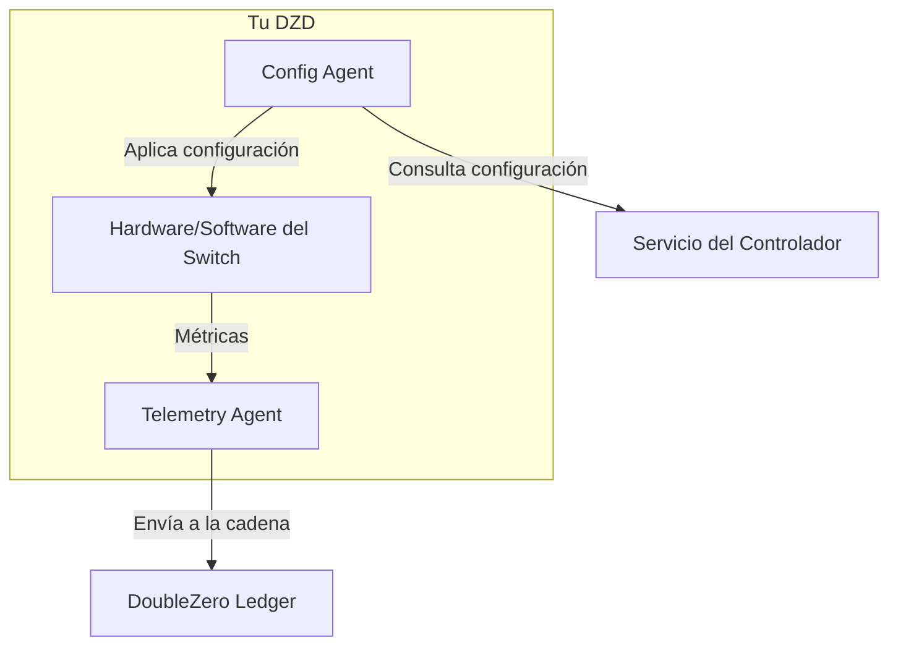
```mermaid
flowchart TB
    subgraph "Tu DZD"
        CA[Config Agent]
        TA[Telemetry Agent]
        HW[Hardware/Software del Switch]
    end

    CA -->|Consulta configuración| CTRL[Servicio del Controlador]
    CA -->|Aplica configuración| HW

    HW -->|Métricas| TA
    TA -->|Envía a la cadena| BC[DoubleZero Ledger]
```

| Agente | Qué Hace |
|--------|----------|
| **Config Agent** | Obtiene la configuración del controlador, la aplica a tu switch |
| **Telemetry Agent** | Mide latencia/pérdida hacia otros dispositivos, reporta métricas en la cadena |

### Paso 4.4: Instala el Config Agent {#step-44-install-config-agent}

#### Habilita la API en tu switch

Agrega a la configuración de EOS:

```
management api eos-sdk-rpc
    transport grpc eapilocal
        localhost loopback vrf default
        service all
        no disabled
```

!!! note "Nota sobre VRF"
    Reemplaza `default` con el nombre de tu VRF de gestión si es diferente (por ejemplo, `management`).

#### Descarga e instala el agente

```bash
# Entra a bash en el switch
switch# bash
$ sudo bash
# cd /mnt/flash
# wget AGENT_DOWNLOAD_URL
# exit
$ exit

# Instala como extensión de EOS
switch# copy flash:AGENT_FILENAME extension:
switch# extension AGENT_FILENAME
switch# copy installed-extensions boot-extensions
```

#### Verifica la extensión

```bash
switch# show extensions
```

El estado debería ser "A, I, B":

```
Name                                        Version/Release     Status     Extension
------------------------------------------- ------------------- ---------- ---------
AGENT_FILENAME    MAINNET_CLIENT_VERSION/1             A, I, B    1

A: available | NA: not available | I: installed | F: forced | B: install at boot
```

#### Configura e inicia el agente

Agrega a la configuración de EOS:

```
daemon doublezero-agent
    exec /usr/local/bin/doublezero-agent -pubkey <PUBKEY_DE_TU_DISPOSITIVO> -controller <IP_controlador>:<puerto_controlador>
    no shut
```

!!! info "IP y puerto del controlador"
    La IP y el puerto del controlador se pueden encontrar en el repositorio de contribuidores al que se te dio acceso en el Paso 2.5.

!!! note "Nota sobre VRF"
    Si tu VRF de gestión no es `default` (es decir, el namespace no es `ns-default`), prefija el comando exec con `exec /sbin/ip netns exec ns-<VRF>`. Por ejemplo, si tu VRF es `management`:
    ```
    daemon doublezero-agent
        exec /sbin/ip netns exec ns-management /usr/local/bin/doublezero-agent -pubkey <PUBKEY_DE_TU_DISPOSITIVO>
        no shut
    ```

Obtén la pubkey de tu dispositivo de `doublezero device list` (la columna `account`).

#### Verifica que está ejecutándose

```bash
switch# show agent doublezero-agent logs
```

Deberías ver "Starting doublezero-agent" y conexiones exitosas al controlador.

### Paso 4.5: Instala el Telemetry Agent {#step-45-install-telemetry-agent}

#### Copia la clave del publicador de métricas a tu dispositivo

```bash
scp ~/.config/doublezero/metrics-publisher.json <IP_DEL_SWITCH>:/mnt/flash/metrics-publisher-keypair.json
```

#### Registra el publicador de métricas en la cadena

```bash
doublezero device update \
  --pubkey <CUENTA_DEL_DISPOSITIVO> \
  --metrics-publisher <PUBKEY_DEL_PUBLICADOR_DE_MÉTRICAS>
```

Obtén la pubkey de tu archivo metrics-publisher.json.

#### Descarga e instala el agente

```bash
switch# bash
$ sudo bash
# cd /mnt/flash
# wget TELEMETRY_DOWNLOAD_URL
# exit
$ exit

# Instala como extensión de EOS
switch# copy flash:TELEMETRY_FILENAME extension:
switch# extension TELEMETRY_FILENAME
switch# copy installed-extensions boot-extensions
```

#### Verifica la extensión

```bash
switch# show extensions
```

El estado debería ser "A, I, B":

```
Name                                        Version/Release     Status     Extension
------------------------------------------- ------------------- ---------- ---------
TELEMETRY_FILENAME    MAINNET_CLIENT_VERSION/1             A, I, B    1

A: available | NA: not available | I: installed | F: forced | B: install at boot
```

#### Configura e inicia el agente

Agrega a la configuración de EOS:

```
daemon doublezero-telemetry
    exec /usr/local/bin/doublezero-telemetry --local-device-pubkey <CUENTA_DEL_DISPOSITIVO> --env mainnet --keypair /mnt/flash/metrics-publisher-keypair.json
    no shut
```

!!! note "Nota sobre VRF"
    Si tu VRF de gestión no es `default` (es decir, el namespace no es `ns-default`), agrega `--management-namespace ns-<VRF>` al comando exec. Por ejemplo, si tu VRF es `management`:
    ```
    daemon doublezero-telemetry
        exec /usr/local/bin/doublezero-telemetry --management-namespace ns-management --local-device-pubkey <CUENTA_DEL_DISPOSITIVO> --env mainnet --keypair /mnt/flash/metrics-publisher-keypair.json
        no shut
    ```

#### Verifica que está ejecutándose

```bash
switch# show agent doublezero-telemetry logs
```

Deberías ver "Starting telemetry collector" y "Starting submission loop".

---

## Fase 5: Periodo de Prueba del Enlace

!!! warning "Todos los enlaces nuevos deben pasar un periodo de prueba antes de transportar tráfico"
    Los enlaces nuevos deben estar **drenados durante al menos 24 horas** antes de ser activados para tráfico de producción. Este requisito de periodo de prueba está definido en [RFC12: Network Provisioning](https://github.com/malbeclabs/doublezero/blob/main/rfcs/rfc12-network-provisioning.md), que especifica ~200,000 slots del DZ Ledger (~20 horas) de métricas limpias antes de que un enlace esté listo para servicio.

Con los agentes instalados y ejecutándose, monitorea tus enlaces en [metrics.doublezero.xyz](https://metrics.doublezero.xyz) durante al menos 24 horas consecutivas:

- Panel **"DoubleZero Device-Link Latencies"** — verifica **cero pérdida de paquetes** en el enlace a lo largo del tiempo
- Panel **"DoubleZero Network Metrics"** — verifica **cero errores** en tus enlaces

Solo desdrena el enlace una vez que el periodo de prueba muestre un enlace limpio con cero pérdidas y cero errores.

---

## Fase 6: Verificación y Activación

Revisa esta lista de verificación para confirmar que todo funciona.

!!! warning "Tu dispositivo comienza bloqueado (`max_users = 0`)"
    Cuando se crea un dispositivo, `max_users` se establece en **0** por defecto. Esto significa que ningún usuario puede conectarse a él todavía. Esto es intencional — debes verificar que todo funcione antes de aceptar tráfico de usuarios.

    **Antes de establecer `max_users` por encima de 0, debes:**

    1. Confirmar que todos los enlaces han completado su **periodo de prueba de 24 horas** con cero pérdidas/errores en [metrics.doublezero.xyz](https://metrics.doublezero.xyz)
    2. **Coordinar con DZ/Malbec Labs** para ejecutar una prueba de conectividad:
        - ¿Puede un usuario de prueba conectarse a tu dispositivo?
        - ¿El usuario recibe rutas a través de la red DZ?
        - ¿Puede el usuario enrutar tráfico a través de la red DZ de extremo a extremo?
    3. Solo después de que DZ/ML confirme que las pruebas pasan, establece max_users en 96:

    ```bash
    doublezero device update --pubkey <CUENTA_DEL_DISPOSITIVO> --max-users 96
    ```

### Verificaciones del Dispositivo

```bash
# Tu dispositivo debería aparecer con estado "activated"
doublezero device list | grep <TU_CÓDIGO_DE_DISPOSITIVO>
```

**Salida esperada:**

```
 7xKm9pQw2R4vHt3... | nyc-dz001 | acme | EQX-NY5 | nyc | hybrid | 203.0.113.10 | 198.51.100.0/28 | 0 | 14 | activated | pending | | 5FMtd5Woq5XAAg54...
```

```bash
# Tus interfaces deberían estar listadas
doublezero device interface list | grep <TU_CÓDIGO_DE_DISPOSITIVO>
```

**Salida esperada:**

```
 nyc-dz001 | Loopback255 | loopback | vpnv4 | none | none | 0 | 0 | 1500 | static | 0 | 172.16.1.91/32  | 56 | false | activated
 nyc-dz001 | Loopback256 | loopback | ipv4  | none | none | 0 | 0 | 1500 | static | 0 | 172.16.1.100/32 | 0  | false | activated
 nyc-dz001 | Ethernet1/1 | physical | none  | none | none | 0 | 0 | 1500 | static | 0 |                 | 0  | false | activated
```

### Verificaciones de Enlaces

```bash
# Los enlaces deberían mostrar estado "activated"
doublezero link list | grep <TU_CÓDIGO_DE_DISPOSITIVO>
```

**Salida esperada:**

```
 8vkYpXaBW8RuknJq... | nyc-lax-wan01 | acme | nyc-dz001 | Ethernet3/1 | lax-dz001 | Ethernet3/1 | WAN | 10Gbps | 9000 | 65.00ms | 1.00ms | 0.00ms | 42 | 172.16.0.84/31 | activated | pending | 5FMtd5Woq5XAAg54...
```

### Verificaciones de Agentes

En el switch:

```bash
# El Config Agent debería mostrar obtenciones exitosas de configuración
switch# show agent doublezero-agent logs | tail -20

# El Telemetry Agent debería mostrar envíos exitosos
switch# show agent doublezero-telemetry logs | tail -20
```

### Diagrama de Verificación Final

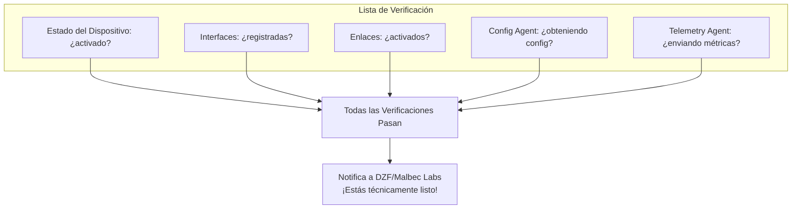
```mermaid
flowchart TB
    subgraph "Lista de Verificación"
        D[Estado del Dispositivo: ¿activado?]
        I[Interfaces: ¿registradas?]
        L[Enlaces: ¿activados?]
        CA[Config Agent: ¿obteniendo config?]
        TA[Telemetry Agent: ¿enviando métricas?]
    end

    D --> PASS
    I --> PASS
    L --> PASS
    CA --> PASS
    TA --> PASS

    PASS[Todas las Verificaciones Pasan] --> NOTIFY[Notifica a DZF/Malbec Labs<br/>¡Estás técnicamente listo!]
```

---

## Solución de Problemas

### La creación del dispositivo falla

- Verifica que tu clave de servicio esté autorizada (`doublezero contributor list`)
- Comprueba que los códigos de ubicación e intercambio sean válidos
- Asegúrate de que el prefijo DZ sea un rango de IP público válido

### El enlace está atascado en estado "requested"

- Los enlaces DZX requieren aceptación por parte del otro contribuidor
- Contáctalos para que ejecuten `doublezero link accept`

### El Config Agent no se conecta

- Verifica que la red de gestión tenga acceso a internet
- Comprueba que la configuración de VRF coincida con tu configuración
- Asegúrate de que la pubkey del dispositivo sea correcta

### El Telemetry Agent no envía datos

- Verifica que la clave del publicador de métricas esté registrada en la cadena
- Comprueba que el archivo del par de claves exista en el switch
- Asegúrate de que la pubkey de la cuenta del dispositivo sea correcta

---

## Próximos Pasos

- Revisa la [Guía de Operaciones](contribute-operations.md) para actualizaciones de agentes y gestión de enlaces
- Consulta el [Glosario](glossary.md) para definiciones de términos
- Contacta a DZF/Malbec Labs si encuentras problemas