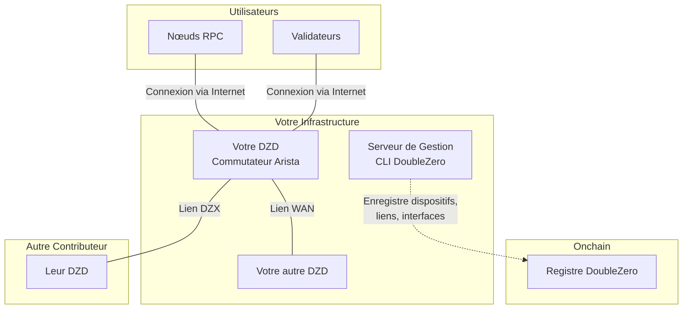
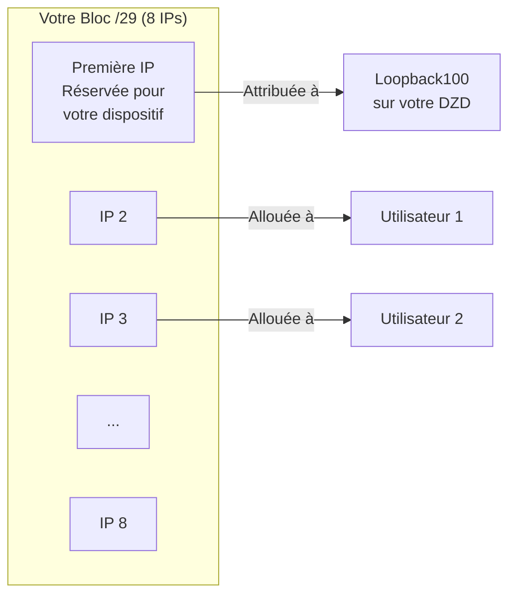
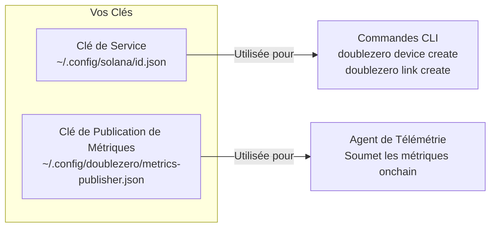
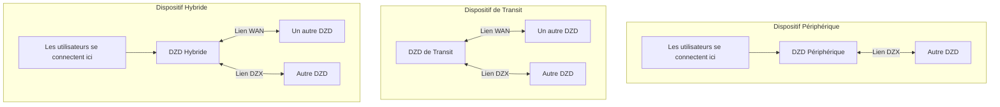
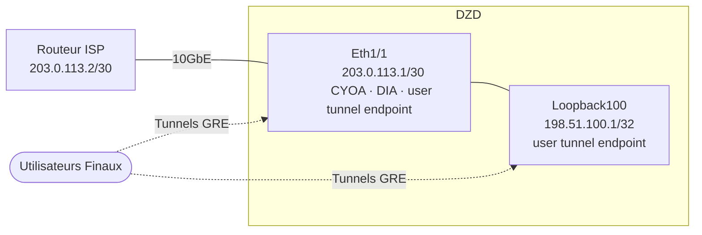
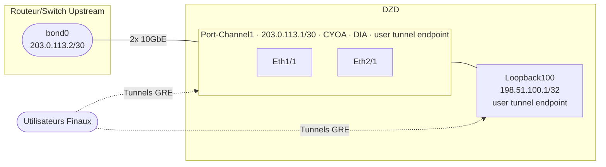
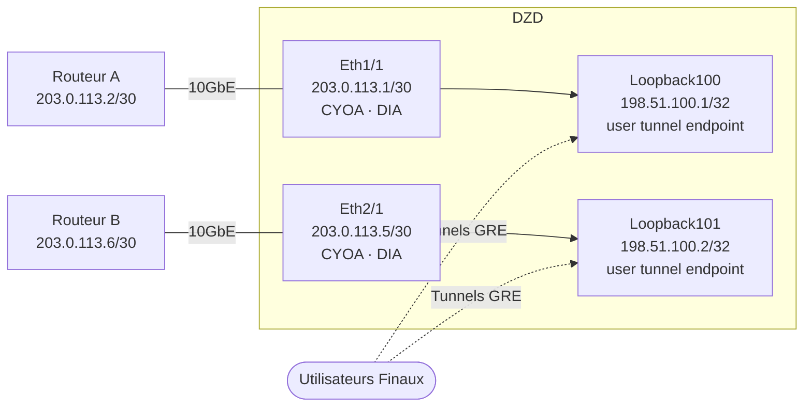
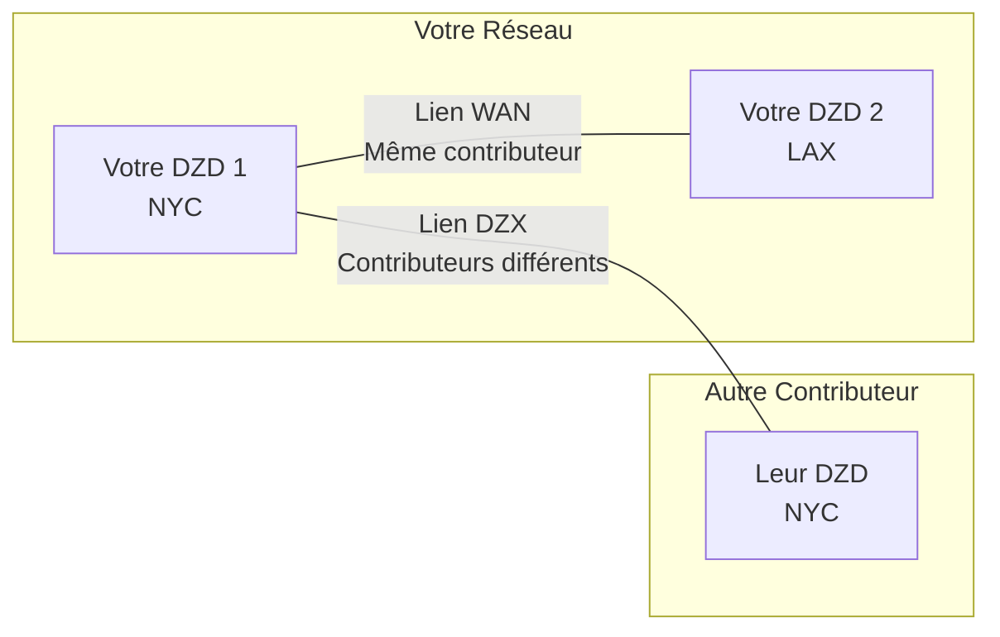
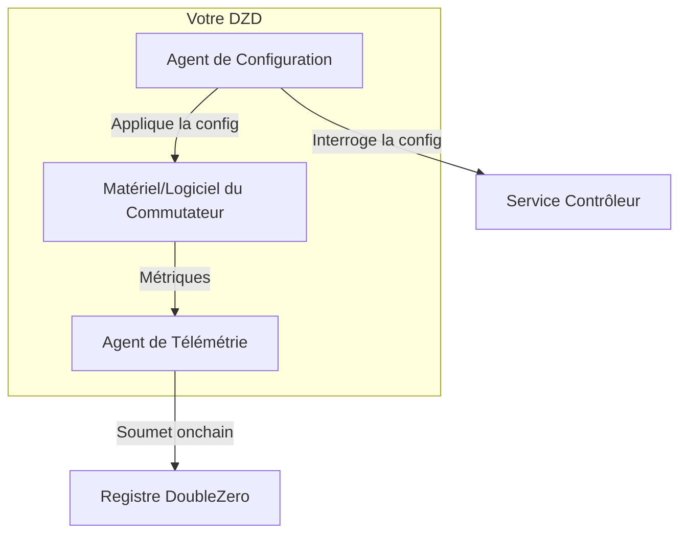
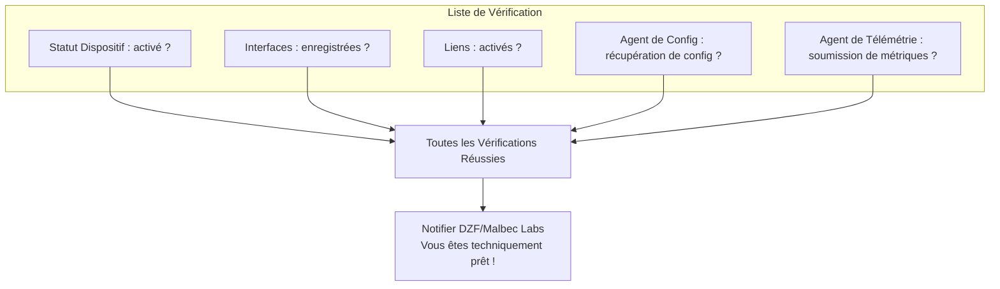

# Guide de Provisionnement des Dispositifs
!!! warning "This translation was generated using artificial intelligence and has not been reviewed by a human translator. It may contain inaccuracies or errors and should not be relied upon."


Ce guide vous accompagne dans le provisionnement d'un DoubleZero Device (DZD) du début à la fin. Chaque phase correspond à la [Liste de Contrôle d'Intégration](contribute-overview.md#onboarding-checklist).

---

## Vue d'Ensemble

Avant de plonger dans les étapes, voici la vue d'ensemble de ce que vous construisez :



---

## Phase 1 : Prérequis

Avant de pouvoir provisionner un dispositif, vous avez besoin du matériel physique configuré et de quelques adresses IP allouées.

### Ce Dont Vous Avez Besoin

| Exigence | Pourquoi C'est Nécessaire |
|----------|--------------------------|
| **Matériel DZD** | Commutateur Arista 7280CR3A (voir [spécifications matérielles](contribute.md#hardware-requirements)) |
| **Espace Baie** | 4U avec une ventilation appropriée |
| **Alimentation** | Alimentations redondantes, ~4KW recommandé |
| **Accès Gestion** | Accès SSH/console pour configurer le commutateur |
| **Connectivité Internet** | Pour la publication de métriques et pour récupérer la configuration depuis le contrôleur |
| **Bloc IPv4 Public** | Minimum /29 pour le pool de préfixes DZ (voir ci-dessous) |

### Installer la CLI DoubleZero

La CLI DoubleZero (`doublezero`) est utilisée tout au long du provisionnement pour enregistrer les dispositifs, créer des liens et gérer votre contribution. Elle doit être installée sur un **serveur de gestion ou une VM** — pas sur le commutateur DZD lui-même. Le commutateur n'exécute que l'Agent de Configuration et l'Agent de Télémétrie (installés dans la [Phase 4](#phase-4-etablissement-des-liens-et-installation-des-agents)).

**Ubuntu / Debian :**
```bash
curl -1sLf https://dl.cloudsmith.io/public/malbeclabs/doublezero/setup.deb.sh | sudo -E bash
sudo apt-get install doublezero
```

**Rocky Linux / RHEL :**
```bash
curl -1sLf https://dl.cloudsmith.io/public/malbeclabs/doublezero/setup.rpm.sh | sudo -E bash
sudo yum install doublezero
```

Vérifiez que le démon est en cours d'exécution :
```bash
sudo systemctl status doublezerod
```

### Comprendre Votre Préfixe DZ

Votre préfixe DZ est un bloc d'adresses IP publiques que le protocole DoubleZero gère pour l'allocation IP.



**Comment les préfixes DZ sont utilisés :**

- **Première IP** : Réservée pour votre dispositif (attribuée à l'interface Loopback100)
- **IPs restantes** : Allouées à des types d'utilisateurs spécifiques se connectant à votre DZD :
    - Utilisateurs `IBRLWithAllocatedIP`
    - Utilisateurs `EdgeFiltering`
    - Éditeurs multicast
- **Utilisateurs IBRL** : N'utilisent PAS ce pool (ils utilisent leur propre IP publique)

!!! warning "Règles du Préfixe DZ"
    **Vous NE POUVEZ PAS utiliser ces adresses pour :**

    - Votre propre matériel réseau
    - Les liens point à point sur les interfaces DIA
    - Les interfaces de gestion
    - Toute infrastructure en dehors du protocole DZ

    **Exigences :**

    - Doivent être des adresses IPv4 **globalement routables (publiques)**
    - Les plages IP privées (10.x, 172.16-31.x, 192.168.x) sont rejetées par le contrat intelligent
    - **Taille minimale : /29** (8 adresses), les préfixes plus grands sont préférés (par exemple, /28, /27)
    - Le bloc entier doit être disponible — ne pré-allouez aucune adresse

    Si vous avez besoin d'adresses pour votre propre équipement (IPs d'interface DIA, gestion, etc.), utilisez un **pool d'adresses séparé**.

---

## Phase 2 : Configuration du Compte

Dans cette phase, vous créez les clés cryptographiques qui vous identifient, vous et vos dispositifs, sur le réseau.

### Où Exécuter la CLI

!!! warning "N'installez PAS la CLI sur votre commutateur"
    La CLI DoubleZero (`doublezero`) doit être installée sur un **serveur de gestion ou une VM**, pas sur votre commutateur Arista.

    ```mermaid
    flowchart LR
        subgraph "Serveur/VM de Gestion"
            CLI[CLI DoubleZero]
            KEYS[Vos Paires de Clés]
        end

        subgraph "Votre Commutateur DZD"
            CA[Agent de Configuration]
            TA[Agent de Télémétrie]
        end

        CLI -->|Crée dispositifs, liens| BC[Blockchain]
        CA -->|Récupère la config| CTRL[Contrôleur]
        TA -->|Soumet les métriques| BC
    ```

    | Installer sur le Serveur de Gestion | Installer sur le Commutateur |
    |------------------------------------|------------------------------|
    | CLI `doublezero` | Agent de Configuration |
    | Votre clé de service | Agent de Télémétrie |
    | Votre clé de publication de métriques | Clé de publication de métriques (copie) |

### Qu'est-ce que les Clés ?

Pensez aux clés comme des identifiants de connexion sécurisés :

- **Clé de Service** : Votre identité de contributeur — utilisée pour exécuter les commandes CLI
- **Clé de Publication de Métriques** : L'identité de votre dispositif pour soumettre les données de télémétrie

Les deux sont des paires de clés cryptographiques (une clé publique que vous partagez, une clé privée que vous gardez secrète).



### Étape 2.1 : Générer Votre Clé de Service

C'est votre identité principale pour interagir avec DoubleZero.

```bash
doublezero keygen
```

Cela crée une paire de clés à l'emplacement par défaut. La sortie montre votre **clé publique** — c'est ce que vous partagerez avec DZF.

### Étape 2.2 : Générer Votre Clé de Publication de Métriques

Cette clé est utilisée par l'Agent de Télémétrie pour signer les soumissions de métriques.

```bash
doublezero keygen -o ~/.config/doublezero/metrics-publisher.json
```

### Étape 2.3 : Soumettre les Clés à DZF

Contactez la DoubleZero Foundation ou Malbec Labs et fournissez :

1. Votre **clé publique de service**
2. Votre **nom d'utilisateur GitHub** (pour l'accès au dépôt)

Ils vont :

- Créer votre **compte de contributeur** onchain
- Accorder l'accès au **dépôt des contributeurs** privé

### Étape 2.4 : Vérifier Votre Compte

Une fois confirmé, vérifiez que votre compte de contributeur existe :

```bash
doublezero contributor list
```

Vous devriez voir votre code de contributeur dans la liste.

### Étape 2.5 : Accéder au Dépôt des Contributeurs

Le dépôt [malbeclabs/contributors](https://github.com/malbeclabs/contributors) contient :

- Configurations de base des dispositifs
- Profils TCAM
- Configurations ACL
- Instructions de configuration supplémentaires

Suivez les instructions là-bas pour la configuration spécifique au dispositif.

---

## Phase 3 : Provisionnement du Dispositif

Vous allez maintenant enregistrer votre dispositif physique sur la blockchain et configurer ses interfaces.

### Comprendre les Types de Dispositifs



| Type | Ce Qu'il Fait | Quand l'Utiliser |
|------|--------------|-----------------|
| **Périphérique** | Accepte uniquement les connexions utilisateurs | Emplacement unique, orienté utilisateurs uniquement |
| **Transit** | Déplace le trafic entre dispositifs | Connectivité backbone, sans utilisateurs |
| **Hybride** | Connexions utilisateurs ET backbone | Le plus courant — fait tout |

### Étape 3.1 : Trouver Votre Emplacement et Exchange

Avant de créer votre dispositif, recherchez les codes de votre emplacement de centre de données et de l'exchange le plus proche :

```bash
# Lister les emplacements disponibles (centres de données)
doublezero location list

# Lister les exchanges disponibles (points d'interconnexion)
doublezero exchange list
```

### Étape 3.2 : Créer Votre Dispositif Onchain

Enregistrez votre dispositif sur la blockchain :

```bash
doublezero device create \
  --code <VOTRE_CODE_DISPOSITIF> \
  --contributor <VOTRE_CODE_CONTRIBUTEUR> \
  --device-type hybrid \
  --location <CODE_EMPLACEMENT> \
  --exchange <CODE_EXCHANGE> \
  --public-ip <IP_PUBLIQUE_DISPOSITIF> \
  --dz-prefixes <VOTRE_PREFIXE_DZ>
```

**Exemple :**

```bash
doublezero device create \
  --code nyc-dz001 \
  --contributor acme \
  --device-type hybrid \
  --location EQX-NY5 \
  --exchange nyc \
  --public-ip "203.0.113.10" \
  --dz-prefixes "198.51.100.0/28"
```

**Sortie attendue :**

```
Signature: 4vKz8H...truncated...7xPq2
```

Vérifiez que votre dispositif a été créé :

```bash
doublezero device list | grep nyc-dz001
```

**Paramètres expliqués :**

| Paramètre | Ce Qu'il Signifie |
|-----------|------------------|
| `--code` | Un nom unique pour votre dispositif (par exemple, `nyc-dz001`) |
| `--contributor` | Votre code de contributeur (donné par DZF) |
| `--device-type` | `hybrid`, `transit`, ou `edge` |
| `--location` | Code du centre de données de `location list` |
| `--exchange` | Code de l'exchange le plus proche de `exchange list` |
| `--public-ip` | L'IP publique où les utilisateurs se connectent à votre dispositif via internet |
| `--dz-prefixes` | Votre bloc IP alloué pour les utilisateurs |

### Étape 3.3 : Créer les Interfaces Loopback Requises

Chaque dispositif a besoin de deux interfaces loopback pour le routage interne :

```bash
# Loopback VPNv4
doublezero device interface create <CODE_DISPOSITIF> Loopback255 --loopback-type vpnv4

# Loopback IPv4
doublezero device interface create <CODE_DISPOSITIF> Loopback256 --loopback-type ipv4
```

**Sortie attendue (pour chaque commande) :**

```
Signature: 3mNx9K...truncated...8wRt5
```

### Étape 3.4 : Créer les Interfaces Physiques

Enregistrez les ports physiques que vous utiliserez :

```bash
# Interface de base
doublezero device interface create <CODE_DISPOSITIF> Ethernet1/1
```

**Sortie attendue :**

```
Signature: 7pQw2R...truncated...4xKm9
```

### Étape 3.5 : Créer l'Interface CYOA (pour les dispositifs Périphériques/Hybrides)

Les DZDs hybrides et périphériques ont besoin de **deux adresses IP publiques** sur lesquelles les utilisateurs terminent leurs tunnels GRE. Les utilisateurs peuvent se connecter via unicast, multicast, ou les deux, et quelle IP sert quel objectif est tournée par utilisateur.

Les deux IPs doivent être enregistrées avec `--user-tunnel-endpoint true`, soit sur une interface physique, soit sur un loopback. Cela inclut l'IP que vous avez fournie lors de la création du dispositif ; cette IP doit encore être explicitement enregistrée ici.

Si vous êtes limité en IPs, vous pouvez utiliser le premier `/32` de votre préfixe DZ comme l'une des deux IPs.

#### CYOA et DIA

| Type | Flag | Objectif |
|------|------|----------|
| DIA | `--interface-dia dia` | Marque le port comme accès internet direct |
| CYOA | `--interface-cyoa <sous-type>` | Déclare comment les utilisateurs connectent des tunnels GRE à votre dispositif |

Le flag CYOA est toujours défini sur une **interface physique** (port Ethernet ou port channel). Jamais sur un loopback.

| Sous-type CYOA | Quand utiliser |
|---------------|---------------|
| `gre-over-dia` | Les utilisateurs se connectent via internet public. Le plus courant. |
| `gre-over-private-peering` | Les utilisateurs se connectent via un cross-connect direct ou un circuit privé |
| `gre-over-public-peering` | Les utilisateurs peerent avec vous à un Internet Exchange (IX) |
| `gre-over-fabric` | Les utilisateurs sont co-localisés et se connectent via un fabric local |
| `gre-over-cable` | Connexion câble directe à un seul utilisateur dédié |

#### Scénario A : Interface physique unique

Un uplink physique vers l'ISP. Ethernet1/1 est l'interface CYOA et DIA et porte l'une des deux IPs publiques. Loopback100 porte la deuxième IP publique.



| Interface | `--interface-cyoa` | `--interface-dia` | `--ip-net` | `--bandwidth` | `--cir` | `--routing-mode` | `--user-tunnel-endpoint` |
|-----------|-------------------|------------------|------------|---------------|---------|-----------------|--------------------------|
| Ethernet1/1 | `gre-over-dia` | `dia` | IP/sous-réseau assigné par le contributeur | vitesse du port | taux engagé | `bgp` ou `static` | `true` |
| Loopback100 | — | — | votre /32 public | `0bps` | — | — | `true` |

Exemple de commandes pour le Scénario A :
```bash
doublezero device interface create mydzd-nyc01 Ethernet1/1 \
  --interface-cyoa gre-over-dia \
  --interface-dia dia \
  --ip-net 203.0.113.1/30 \
  --bandwidth 10Gbps \
  --cir 1Gbps \
  --routing-mode bgp \
  --user-tunnel-endpoint true

doublezero device interface create mydzd-nyc01 Loopback100 \
  --ip-net 198.51.100.1/32 \
  --bandwidth 0bps \
  --user-tunnel-endpoint true
```

#### Scénario B : Port channel (LAG)

Le DZD se connecte au dispositif upstream via un port channel avec une IP. Le port channel porte une IP publique et est le point de terminaison CYOA. Loopback100 porte la deuxième IP publique.



| Interface | `--interface-cyoa` | `--interface-dia` | `--ip-net` | `--bandwidth` | `--cir` | `--routing-mode` | `--user-tunnel-endpoint` |
|-----------|-------------------|------------------|------------|---------------|---------|-----------------|--------------------------|
| Port-Channel1 | `gre-over-dia` | `dia` | IP/sous-réseau assigné par le contributeur | vitesse LAG combinée | taux engagé | `bgp` ou `static` | `true` |
| Loopback100 | — | — | votre /32 public | `0bps` | — | — | `true` |

Exemple de commandes pour le Scénario B :
```bash
doublezero device interface create mydzd-fra01 Port-Channel1 \
  --interface-cyoa gre-over-dia \
  --interface-dia dia \
  --ip-net 203.0.113.1/30 \
  --bandwidth 20Gbps \
  --cir 2Gbps \
  --routing-mode bgp \
  --user-tunnel-endpoint true

doublezero device interface create mydzd-fra01 Loopback100 \
  --ip-net 198.51.100.1/32 \
  --bandwidth 0bps \
  --user-tunnel-endpoint true
```

#### Scénario C : Double uplinks physiques vers des routeurs séparés

Chaque interface physique se connecte à un routeur upstream différent. Les deux IPs publiques se trouvent sur Loopback100 et Loopback101, toutes deux enregistrées comme points de terminaison de tunnel utilisateur.



| Interface | `--interface-cyoa` | `--interface-dia` | `--ip-net` | `--bandwidth` | `--cir` | `--routing-mode` | `--user-tunnel-endpoint` |
|-----------|-------------------|------------------|------------|---------------|---------|-----------------|--------------------------|
| Ethernet1/1 | `gre-over-dia` | `dia` | IP/sous-réseau assigné par le contributeur | vitesse du port | taux engagé | `bgp` ou `static` | — |
| Ethernet2/1 | `gre-over-dia` | `dia` | IP/sous-réseau assigné par le contributeur | vitesse du port | taux engagé | `bgp` ou `static` | — |
| Loopback100 | — | — | votre /32 public | `0bps` | — | — | `true` |
| Loopback101 | — | — | votre /32 public | `0bps` | — | — | `true` |

Exemple de commandes pour le Scénario C :
```bash
doublezero device interface create mydzd-ams01 Ethernet1/1 \
  --interface-cyoa gre-over-dia \
  --interface-dia dia \
  --ip-net 203.0.113.1/30 \
  --bandwidth 10Gbps \
  --cir 1Gbps \
  --routing-mode bgp

doublezero device interface create mydzd-ams01 Ethernet2/1 \
  --interface-cyoa gre-over-dia \
  --interface-dia dia \
  --ip-net 203.0.113.5/30 \
  --bandwidth 10Gbps \
  --cir 1Gbps \
  --routing-mode bgp

doublezero device interface create mydzd-ams01 Loopback100 \
  --ip-net 198.51.100.1/32 \
  --bandwidth 0bps \
  --user-tunnel-endpoint true

doublezero device interface create mydzd-ams01 Loopback101 \
  --ip-net 198.51.100.2/32 \
  --bandwidth 0bps \
  --user-tunnel-endpoint true
```

### Étape 3.6 : Vérifier Votre Dispositif

```bash
doublezero device list
```

**Exemple de sortie :**

```
 account                                      | code      | contributor | location | exchange | device_type | public_ip    | dz_prefixes     | users | max_users | status    | health  | mgmt_vrf | owner
 7xKm9pQw2R4vHt3...                          | nyc-dz001 | acme        | EQX-NY5  | nyc      | hybrid      | 203.0.113.10 | 198.51.100.0/28 | 0     | 14        | activated | pending |          | 5FMtd5Woq5XAAg54...
```

Votre dispositif devrait apparaître avec le statut `activated`.

---

## Phase 4 : Établissement des Liens et Installation des Agents

Les liens connectent votre dispositif au reste du réseau DoubleZero.

### Comprendre les Liens



| Type de Lien | Connecte | Acceptation |
|-------------|----------|-------------|
| **Lien WAN** | Deux de VOS dispositifs | Automatique (vous possédez les deux) |
| **Lien DZX** | Votre dispositif à un AUTRE contributeur | Nécessite leur acceptation |

### Étape 4.1 : Créer des Liens WAN (si vous avez plusieurs dispositifs)

Les liens WAN connectent vos propres dispositifs :

```bash
doublezero link create wan \
  --code <CODE_LIEN> \
  --contributor <VOTRE_CONTRIBUTEUR> \
  --side-a <CODE_DISPOSITIF_1> \
  --side-a-interface <INTERFACE_SUR_DISPOSITIF_1> \
  --side-z <CODE_DISPOSITIF_2> \
  --side-z-interface <INTERFACE_SUR_DISPOSITIF_2> \
  --bandwidth 10000 \
  --mtu 9000 \
  --delay-ms 20 \
  --jitter-ms 1
```

**Exemple :**

```bash
doublezero link create wan \
  --code nyc-lax-wan01 \
  --contributor acme \
  --side-a nyc-dz001 \
  --side-a-interface Ethernet3/1 \
  --side-z lax-dz001 \
  --side-z-interface Ethernet3/1 \
  --bandwidth 10000 \
  --mtu 9000 \
  --delay-ms 65 \
  --jitter-ms 1
```

**Sortie attendue :**

```
Signature: 5tNm7K...truncated...9pRw2
```

### Étape 4.2 : Créer des Liens DZX

Les liens DZX connectent votre dispositif directement au DZD d'un autre contributeur :

```bash
doublezero link create dzx \
  --code <CODE_DISPOSITIF_A:CODE_DISPOSITIF_Z> \
  --contributor <VOTRE_CONTRIBUTEUR> \
  --side-a <VOTRE_CODE_DISPOSITIF> \
  --side-a-interface <VOTRE_INTERFACE> \
  --side-z <CODE_AUTRE_DISPOSITIF> \
  --bandwidth <BANDE_PASSANTE en Kbps, Mbps, ou Gbps> \
  --mtu <MTU> \
  --delay-ms <DELAI> \
  --jitter-ms <GIGUE>
```

**Sortie attendue :**

```
Signature: 8mKp3W...truncated...2nRx7
```

Après avoir créé un lien DZX, l'autre contributeur doit l'accepter :

```bash
# L'AUTRE contributeur exécute ceci
doublezero link accept \
  --code <CODE_LIEN> \
  --side-z-interface <LEUR_INTERFACE>
```

**Sortie attendue (pour le contributeur qui accepte) :**

```
Signature: 6vQt9L...truncated...3wPm4
```

### Étape 4.3 : Vérifier les Liens

```bash
doublezero link list
```

**Exemple de sortie :**

```
 account                                      | code          | contributor | side_a_name | side_a_iface_name | side_z_name | side_z_iface_name | link_type | bandwidth | mtu  | delay_ms | jitter_ms | delay_override_ms | tunnel_id | tunnel_net      | status    | health  | owner
 8vkYpXaBW8RuknJq...                         | nyc-dz001:lax-dz001 | acme        | nyc-dz001   | Ethernet3/1       | lax-dz001   | Ethernet3/1       | WAN       | 10Gbps    | 9000 | 65.00ms  | 1.00ms    | 0.00ms            | 42        | 172.16.0.84/31  | activated | pending | 5FMtd5Woq5XAAg54...
```

Les liens devraient afficher le statut `activated` une fois les deux côtés configurés.

---

### Installation des Agents

Deux agents logiciels s'exécutent sur votre DZD :



| Agent | Ce Qu'il Fait |
|-------|--------------|
| **Agent de Configuration** | Récupère la configuration depuis le contrôleur, l'applique à votre commutateur |
| **Agent de Télémétrie** | Mesure la latence/perte vers les autres dispositifs, rapporte les métriques onchain |

### Étape 4.4 : Installer l'Agent de Configuration

#### Activer l'API sur votre commutateur

Ajouter à la configuration EOS :

```
management api eos-sdk-rpc
    transport grpc eapilocal
        localhost loopback vrf default
        service all
        no disabled
```

!!! note "Note VRF"
    Remplacez `default` par votre nom de VRF de gestion si différent (par exemple, `management`).

#### Télécharger et installer l'agent

```bash
# Entrer dans bash sur le commutateur
switch# bash
$ sudo bash
# cd /mnt/flash
# wget AGENT_DOWNLOAD_URL
# exit
$ exit

# Installer comme extension EOS
switch# copy flash:AGENT_FILENAME extension:
switch# extension AGENT_FILENAME
switch# copy installed-extensions boot-extensions
```

#### Vérifier l'extension

```bash
switch# show extensions
```

Le Statut devrait être "A, I, B" :

```
Name                                        Version/Release     Status     Extension
------------------------------------------- ------------------- ---------- ---------
AGENT_FILENAME    MAINNET_CLIENT_VERSION/1             A, I, B    1

A: available | NA: not available | I: installed | F: forced | B: install at boot
```

#### Configurer et démarrer l'agent

Ajouter à la configuration EOS :

```
daemon doublezero-agent
    exec /usr/local/bin/doublezero-agent -pubkey <VOTRE_PUBKEY_DISPOSITIF>
    no shut
```

!!! note "Note VRF"
    Si votre VRF de gestion n'est pas `default` (c'est-à-dire que le namespace n'est pas `ns-default`), préfixez la commande exec avec `exec /sbin/ip netns exec ns-<VRF>`. Par exemple, si votre VRF est `management` :
    ```
    daemon doublezero-agent
        exec /sbin/ip netns exec ns-management /usr/local/bin/doublezero-agent -pubkey <VOTRE_PUBKEY_DISPOSITIF>
        no shut
    ```

Obtenez la pubkey de votre dispositif depuis `doublezero device list` (colonne `account`).

#### Vérifier qu'il fonctionne

```bash
switch# show agent doublezero-agent logs
```

Vous devriez voir "Starting doublezero-agent" et des connexions réussies au contrôleur.

### Étape 4.5 : Installer l'Agent de Télémétrie

#### Copier la clé de publication de métriques sur votre dispositif

```bash
scp ~/.config/doublezero/metrics-publisher.json <IP_COMMUTATEUR>:/mnt/flash/metrics-publisher-keypair.json
```

#### Enregistrer la publication de métriques onchain

```bash
doublezero device update \
  --pubkey <COMPTE_DISPOSITIF> \
  --metrics-publisher <PUBKEY_PUBLICATION_METRIQUES>
```

Obtenez la pubkey depuis votre fichier metrics-publisher.json.

#### Télécharger et installer l'agent

```bash
switch# bash
$ sudo bash
# cd /mnt/flash
# wget TELEMETRY_DOWNLOAD_URL
# exit
$ exit

# Installer comme extension EOS
switch# copy flash:TELEMETRY_FILENAME extension:
switch# extension TELEMETRY_FILENAME
switch# copy installed-extensions boot-extensions
```

#### Vérifier l'extension

```bash
switch# show extensions
```

Le Statut devrait être "A, I, B" :

```
Name                                        Version/Release     Status     Extension
------------------------------------------- ------------------- ---------- ---------
TELEMETRY_FILENAME    MAINNET_CLIENT_VERSION/1             A, I, B    1

A: available | NA: not available | I: installed | F: forced | B: install at boot
```

#### Configurer et démarrer l'agent

Ajouter à la configuration EOS :

```
daemon doublezero-telemetry
    exec /usr/local/bin/doublezero-telemetry --local-device-pubkey <COMPTE_DISPOSITIF> --env mainnet --keypair /mnt/flash/metrics-publisher-keypair.json
    no shut
```

!!! note "Note VRF"
    Si votre VRF de gestion n'est pas `default` (c'est-à-dire que le namespace n'est pas `ns-default`), ajoutez `--management-namespace ns-<VRF>` à la commande exec. Par exemple, si votre VRF est `management` :
    ```
    daemon doublezero-telemetry
        exec /usr/local/bin/doublezero-telemetry --management-namespace ns-management --local-device-pubkey <COMPTE_DISPOSITIF> --env mainnet --keypair /mnt/flash/metrics-publisher-keypair.json
        no shut
    ```

#### Vérifier qu'il fonctionne

```bash
switch# show agent doublezero-telemetry logs
```

Vous devriez voir "Starting telemetry collector" et "Starting submission loop".

---

## Phase 5 : Rodage du Lien

!!! warning "Tous les nouveaux liens doivent être rodés avant de transporter du trafic"
    Les nouveaux liens doivent être **drainés pendant au moins 24 heures** avant d'être activés pour le trafic de production. Cette exigence de rodage est définie dans [RFC12: Network Provisioning](https://github.com/malbeclabs/doublezero/blob/main/rfcs/rfc12-network-provisioning.md), qui spécifie ~200 000 slots du Registre DZ (~20 heures) de métriques propres avant qu'un lien soit prêt pour le service.

Avec les agents installés et en cours d'exécution, surveillez vos liens sur [metrics.doublezero.xyz](https://metrics.doublezero.xyz) pendant au moins 24 heures consécutives :

- Tableau de bord **"DoubleZero Device-Link Latencies"** — vérifiez **zéro perte de paquets** sur le lien au fil du temps
- Tableau de bord **"DoubleZero Network Metrics"** — vérifiez **zéro erreurs** sur vos liens

Ne dédrainer le lien qu'une fois que la période de rodage montre un lien propre avec zéro perte et zéro erreurs.

---

## Phase 6 : Vérification et Activation

Parcourez cette liste de contrôle pour confirmer que tout fonctionne.

!!! warning "Votre dispositif commence verrouillé (`max_users = 0`)"
    Lorsqu'un dispositif est créé, `max_users` est fixé à **0** par défaut. Cela signifie qu'aucun utilisateur ne peut encore s'y connecter. C'est intentionnel — vous devez vérifier que tout fonctionne avant d'accepter le trafic utilisateurs.

    **Avant de définir `max_users` au-dessus de 0, vous devez :**

    1. Confirmer que tous les liens ont complété leur **rodage de 24 heures** avec zéro perte/erreurs sur [metrics.doublezero.xyz](https://metrics.doublezero.xyz)
    2. **Coordonner avec DZ/Malbec Labs** pour exécuter un test de connectivité :
        - Un utilisateur de test peut-il se connecter à votre dispositif ?
        - L'utilisateur reçoit-il des routes sur le réseau DZ ?
        - L'utilisateur peut-il router le trafic sur le réseau DZ de bout en bout ?
    3. Seulement après que DZ/ML confirme que les tests réussissent, définissez max_users à 96 :

    ```bash
    doublezero device update --pubkey <COMPTE_DISPOSITIF> --max-users 96
    ```

### Vérifications du Dispositif

```bash
# Votre dispositif devrait apparaître avec le statut "activated"
doublezero device list | grep <VOTRE_CODE_DISPOSITIF>
```

**Sortie attendue :**

```
 7xKm9pQw2R4vHt3... | nyc-dz001 | acme | EQX-NY5 | nyc | hybrid | 203.0.113.10 | 198.51.100.0/28 | 0 | 14 | activated | pending | | 5FMtd5Woq5XAAg54...
```

```bash
# Vos interfaces devraient être listées
doublezero device interface list | grep <VOTRE_CODE_DISPOSITIF>
```

**Sortie attendue :**

```
 nyc-dz001 | Loopback255 | loopback | vpnv4 | none | none | 0 | 0 | 1500 | static | 0 | 172.16.1.91/32  | 56 | false | activated
 nyc-dz001 | Loopback256 | loopback | ipv4  | none | none | 0 | 0 | 1500 | static | 0 | 172.16.1.100/32 | 0  | false | activated
 nyc-dz001 | Ethernet1/1 | physical | none  | none | none | 0 | 0 | 1500 | static | 0 |                 | 0  | false | activated
```

### Vérifications des Liens

```bash
# Les liens devraient afficher le statut "activated"
doublezero link list | grep <VOTRE_CODE_DISPOSITIF>
```

**Sortie attendue :**

```
 8vkYpXaBW8RuknJq... | nyc-lax-wan01 | acme | nyc-dz001 | Ethernet3/1 | lax-dz001 | Ethernet3/1 | WAN | 10Gbps | 9000 | 65.00ms | 1.00ms | 0.00ms | 42 | 172.16.0.84/31 | activated | pending | 5FMtd5Woq5XAAg54...
```

### Vérifications des Agents

Sur le commutateur :

```bash
# L'agent de configuration devrait afficher des extractions de configuration réussies
switch# show agent doublezero-agent logs | tail -20

# L'agent de télémétrie devrait afficher des soumissions réussies
switch# show agent doublezero-telemetry logs | tail -20
```

### Diagramme de Vérification Finale



---

## Dépannage

### La création du dispositif échoue

- Vérifiez que votre clé de service est autorisée (`doublezero contributor list`)
- Vérifiez que les codes d'emplacement et d'exchange sont valides
- Assurez-vous que le préfixe DZ est une plage IP publique valide

### Lien bloqué dans le statut "requested"

- Les liens DZX nécessitent l'acceptation de l'autre contributeur
- Contactez-les pour exécuter `doublezero link accept`

### L'Agent de Configuration ne se connecte pas

- Vérifiez que le réseau de gestion a accès à internet
- Vérifiez que la configuration VRF correspond à votre configuration
- Assurez-vous que la pubkey du dispositif est correcte

### L'Agent de Télémétrie ne soumet pas

- Vérifiez que la clé de publication de métriques est enregistrée onchain
- Vérifiez que le fichier de paire de clés existe sur le commutateur
- Assurez-vous que la pubkey du compte du dispositif est correcte

---

## Prochaines Étapes

- Consultez le [Guide des Opérations](contribute-operations.md) pour les mises à niveau des agents et la gestion des liens
- Consultez le [Glossaire](glossary.md) pour les définitions des termes
- Contactez DZF/Malbec Labs si vous rencontrez des problèmes
