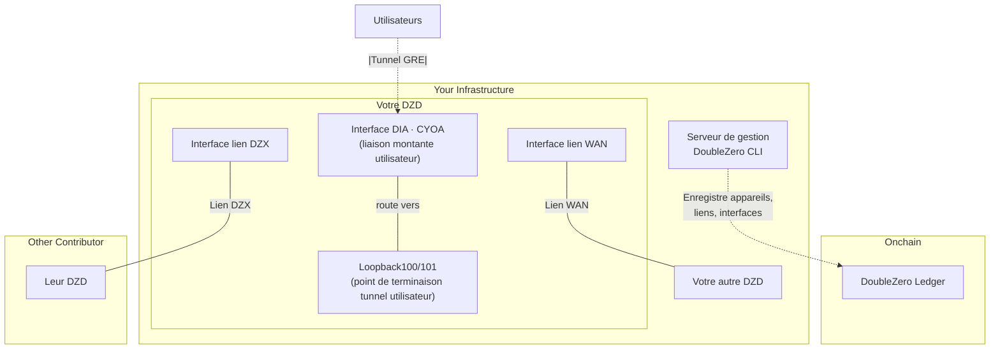
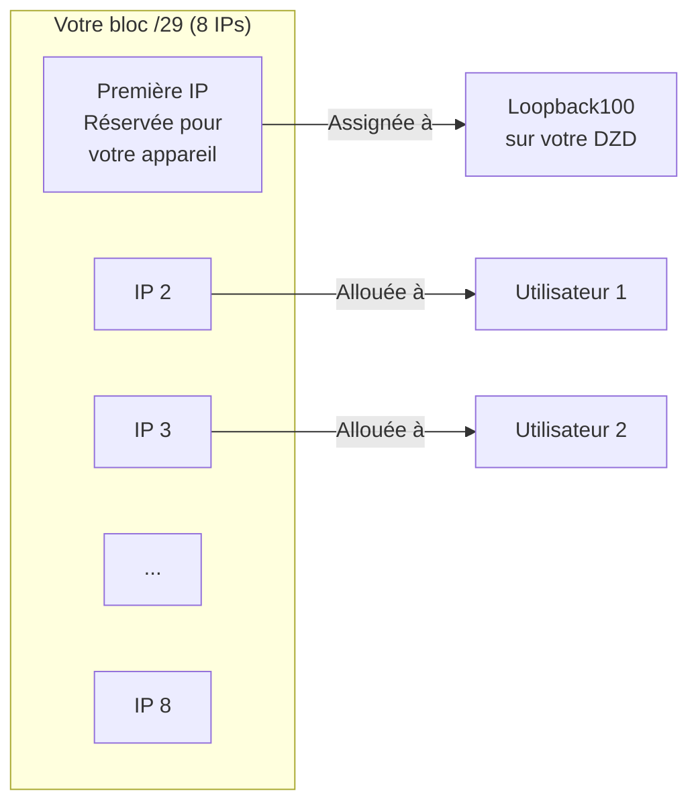
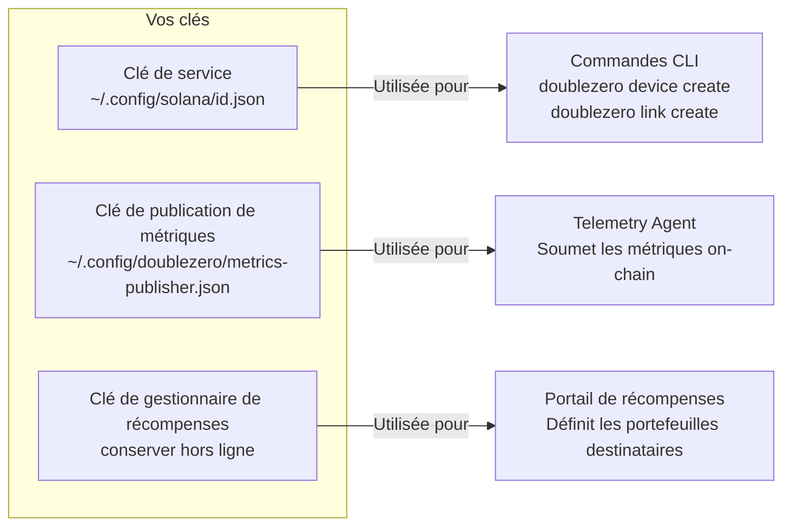
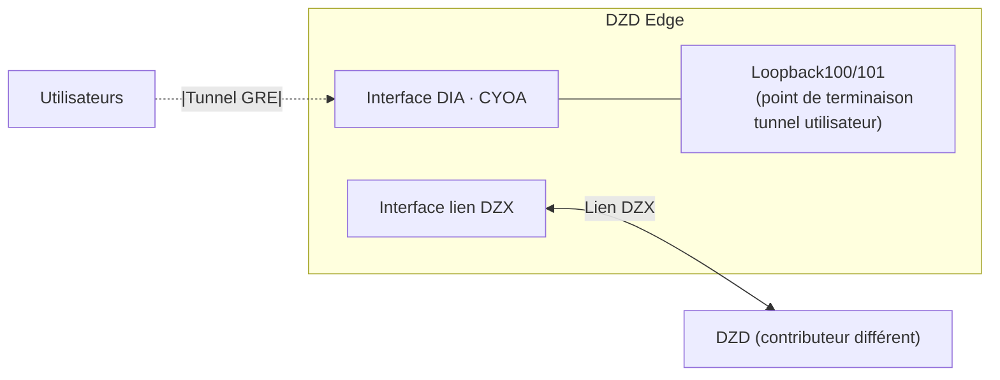
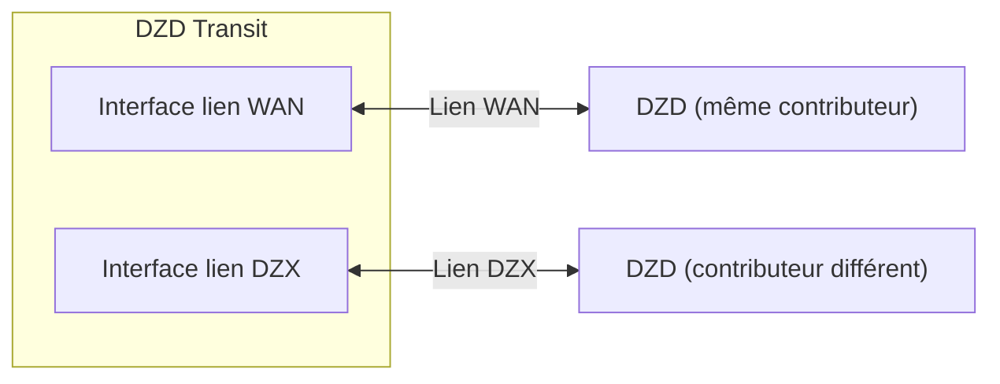
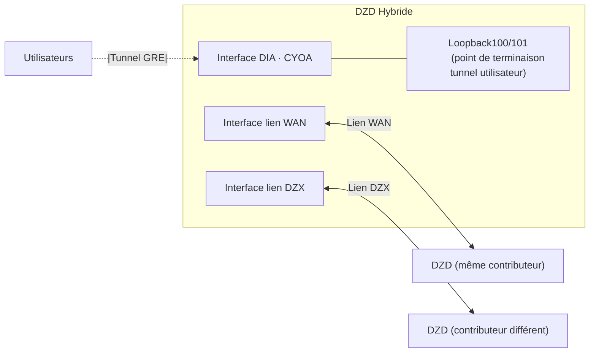
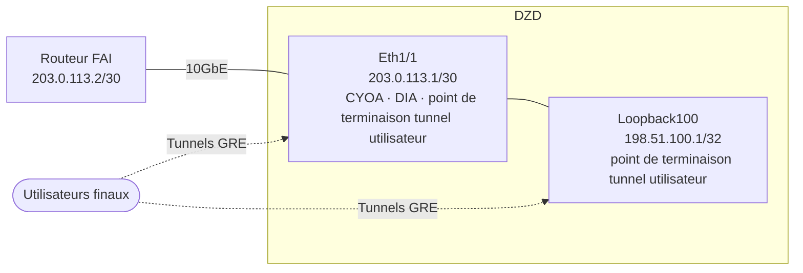
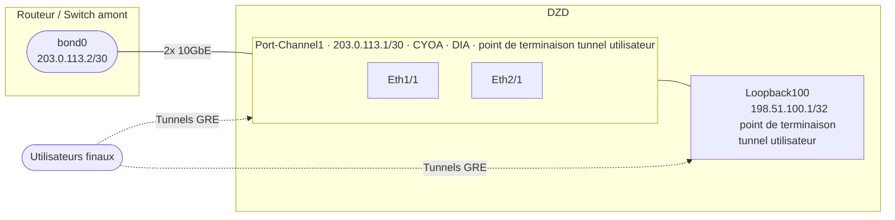

# Guide de provisionnement d'un appareil

Ce guide vous accompagne dans le provisionnement d'un DoubleZero Device (DZD) du début à la fin. Chaque phase correspond à la [Liste de contrôle d'intégration](contribute-overview.md#onboarding-checklist).

---

## Comment tout s'articule

Ce guide vous accompagne dans l'enregistrement de votre infrastructure on-chain afin que le réseau DoubleZero puisse acheminer le trafic à travers celle-ci. Plus votre appareil est complètement enregistré, plus il est utile au réseau. Une représentation on-chain complète de votre appareil permet un meilleur dépannage, une meilleure planification de la capacité, et permet au contrôleur de prendre des décisions éclairées. À terme, l'objectif est que le contrôleur prenne en charge une part croissante de la responsabilité de configuration.

### Concepts clés

**Interfaces**

Les interfaces d'un DZD se présentent sous différentes formes : ports Ethernet, port channels (LAGs composés de plusieurs ports Ethernet) et loopbacks. Chaque interface qui joue un rôle dans le réseau doit être enregistrée on-chain avec les indicateurs appropriés afin que le protocole sache à quoi elle sert.

Les ports Ethernet et les port channels peuvent remplir les rôles suivants :

| Indicateur | Signification |
|------|---------------|
| `--interface-dia dia` | Marque l'interface comme liaison montante d'accès internet direct |
| `--interface-cyoa <subtype>` | Déclare comment les utilisateurs établissent des tunnels GRE via cette interface (ex. via l'internet public, via un lien de peering privé) |
| `--user-tunnel-endpoint true` | Cette interface porte une IP publique sur laquelle les utilisateurs terminent les tunnels GRE |

Les interfaces utilisées pour les liens WAN ou DZX ne portent pas d'indicateur spécifique ; elles sont enregistrées avec leur bande passante puis référencées lors de la création du lien.

Les interfaces loopback servent à plusieurs fins :

| Loopback | Signification |
|----------|---------------|
| **Loopback100 / 101** | Portent des IP publiques sur lesquelles les utilisateurs terminent les tunnels GRE. Enregistrées avec `--user-tunnel-endpoint true`. |
| **Loopback255** (`vpnv4`) | Enregistrée pour que le contrôleur puisse assigner une IP utilisée pour l'identifiant de routeur BGP, le peering VPN-IPv4 (unicast), l'identité IS-IS et le segment routing |
| **Loopback256** (`ipv4`) | Enregistrée pour que le contrôleur puisse assigner une IP utilisée pour le peering BGP IPv4 (multicast) et les sessions MSDP |

**Liens**

Les liens sont enregistrés séparément des interfaces, et les interfaces doivent exister on-chain avant qu'un lien puisse les référencer. Lorsque vous créez un lien WAN ou DZX, vous spécifiez une interface déjà enregistrée comme point de terminaison physique du lien. Toutes les interfaces ne sont pas liées à un lien : les interfaces DIA, CYOA et loopback ne sont pas connectées à un lien.

| Terme | Signification |
|------|---------------|
| **Lien WAN** | Un lien entre deux de vos propres DZD |
| **Lien DZX** | Un lien entre votre DZD et le DZD d'un autre contributeur |

### Vue d'ensemble de l'architecture


```mermaid
flowchart TB
    subgraph Onchain
        SC[DoubleZero Ledger]
    end

    subgraph Your Infrastructure
        MGMT[Serveur de gestion<br/>DoubleZero CLI]
        subgraph DZD[Votre DZD]
            CYOA["Interface DIA · CYOA<br/>(liaison montante utilisateur)"]
            WAN_INTF["Interface lien WAN"]
            DZX_INTF["Interface lien DZX"]
            LO100["Loopback100/101<br/>(point de terminaison tunnel utilisateur)"]
        end
        DZD2[Votre autre DZD]
    end

    subgraph Other Contributor
        OtherDZD[Leur DZD]
    end

    USERS["Utilisateurs"]

    MGMT -.->|Enregistre appareils,<br/>liens, interfaces| SC
    WAN_INTF ---|Lien WAN| DZD2
    DZX_INTF ---|Lien DZX| OtherDZD
    USERS -.|Tunnel GRE|.-> CYOA
    CYOA ---|route vers| LO100
```

---

## Phase 1 : Prérequis

Avant de pouvoir provisionner un appareil, vous devez avoir le matériel physique installé et certaines adresses IP allouées.

### Ce dont vous avez besoin

| Exigence | Pourquoi c'est nécessaire |
|-------------|-----------------|
| **Matériel DZD** | Switch Arista 7280CR3A (voir les [spécifications matérielles](contribute.md#hardware-requirements)) |
| **Espace rack** | 1U par DZD, avec un flux d'air adéquat. Voir [Rack et alimentation](contribute.md#rack-power-requirements) |
| **Alimentation** | Deux alimentations indépendantes, chacune capable de supporter la charge totale seule. Voir [Rack et alimentation](contribute.md#rack-power-requirements) |
| **Accès de gestion** | Accès SSH/console pour configurer le switch |
| **Connectivité internet** | Pour la publication des métriques et la récupération de la configuration depuis le contrôleur |
| **Bloc IPv4 public** | Minimum /29 pour le pool de préfixes DZ (voir ci-dessous) |

### Installer le CLI DoubleZero

Le CLI DoubleZero (`doublezero`) est utilisé tout au long du provisionnement pour enregistrer les appareils, créer des liens et gérer votre contribution. Il doit être installé sur un **serveur de gestion ou une VM** — pas sur le switch DZD lui-même. Le switch exécute uniquement le Config Agent et le Telemetry Agent (installés en [Phase 4](#phase-4-etablissement-des-liens-installation-des-agents)).

**Ubuntu / Debian :**
```bash
curl -1sLf https://dl.cloudsmith.io/public/malbeclabs/doublezero/setup.deb.sh | sudo -E bash
sudo apt-get install doublezero
```

**Rocky Linux / RHEL :**
```bash
curl -1sLf https://dl.cloudsmith.io/public/malbeclabs/doublezero/setup.rpm.sh | sudo -E bash
sudo yum install doublezero
```

Vérifiez que le démon est en cours d'exécution :
```bash
sudo systemctl status doublezerod
```

### Comprendre votre préfixe DZ

Votre préfixe DZ est un bloc d'adresses IP publiques que le protocole DoubleZero gère pour l'allocation d'IP.


```mermaid
flowchart LR
    subgraph "Votre bloc /29 (8 IPs)"
        IP1["Première IP<br/>Réservée pour<br/>votre appareil"]
        IP2["IP 2"]
        IP3["IP 3"]
        IP4["..."]
        IP8["IP 8"]
    end

    IP1 -->|Assignée à| LO[Loopback100<br/>sur votre DZD]
    IP2 -->|Allouée à| U1[Utilisateur 1]
    IP3 -->|Allouée à| U2[Utilisateur 2]
```

**Comment les préfixes DZ sont utilisés :**

- **Première IP** : Réservée pour votre appareil (assignée à l'interface Loopback100)
- **IP restantes** : Allouées à des types d'utilisateurs spécifiques se connectant à votre DZD :
    - Utilisateurs `IBRLWithAllocatedIP`
    - Utilisateurs `EdgeFiltering` (cas d'utilisation futur)
- **Utilisateurs IBRL** : Ne consomment PAS de ce pool (ils utilisent leur propre IP publique)

!!! warning "Règles des préfixes DZ"
    **Vous NE POUVEZ PAS utiliser ces adresses pour :**

    - Votre propre équipement réseau
    - Les liens point-à-point sur les interfaces DIA
    - Les interfaces de gestion
    - Toute infrastructure en dehors du protocole DZ

    **Exigences :**

    - Doivent être des adresses IPv4 **routables globalement (publiques)**
    - Les plages IP privées (10.x, 172.16-31.x, 192.168.x) sont rejetées par le smart contract
    - **Taille minimale : /29** (8 adresses), les préfixes plus grands sont préférés (ex. /28, /27)
    - Le bloc entier doit être disponible — ne pré-allouez aucune adresse

    Si vous avez besoin d'adresses pour votre propre équipement (IP d'interface DIA, gestion, etc.), utilisez un **pool d'adresses séparé**.

---

## Phase 2 : Configuration du compte

Dans cette phase, vous créez les clés cryptographiques qui vous identifient, vous et vos appareils, sur le réseau, et vous indiquez où vos récompenses doivent être versées.

Trois clés résultent de cette phase : une clé de service, une clé de publication de métriques et une clé de gestionnaire de récompenses. Soumettez les clés publiques des trois à la DZF ensemble à l'[Étape 2.4](#etape-24-soumettre-les-cles-a-la-dzf). [Gestion des récompenses](contribute-rewards.md) couvre le volet récompenses dans son intégralité.

### Où exécuter le CLI

!!! warning "N'installez PAS le CLI sur votre switch"
    Le CLI DoubleZero (`doublezero`) doit être installé sur un **serveur de gestion ou une VM**, pas sur votre switch Arista.

    ```mermaid
    flowchart LR
        subgraph "Serveur de gestion/VM"
            CLI[DoubleZero CLI]
            KEYS[Vos paires de clés]
        end

        subgraph "Votre switch DZD"
            CA[Config Agent]
            TA[Telemetry Agent]
        end

        CLI -->|Crée appareils, liens| BC[Blockchain]
        CA -->|Récupère la config| CTRL[Contrôleur]
        TA -->|Soumet les métriques| BC
    ```

    | Installer sur le serveur de gestion | Installer sur le switch |
    |-----------------------------|-------------------|
    | CLI `doublezero` | Config Agent |
    | Votre paire de clés de service | Telemetry Agent |
    | Votre paire de clés de publication de métriques | Paire de clés de publication de métriques (copie) |

### Que sont les clés ?

Pensez aux clés comme des identifiants de connexion sécurisés :

- **Clé de service** : Votre identité de contributeur — utilisée pour exécuter les commandes CLI
- **Clé de publication de métriques** : L'identité de votre appareil pour soumettre les données de télémétrie
- **Clé de gestionnaire de récompenses** : Contrôle quels portefeuilles reçoivent vos récompenses — voir [Gestion des récompenses](contribute-rewards.md)

Les trois sont des paires de clés cryptographiques (une clé publique que vous partagez, une clé privée que vous gardez secrète).


```mermaid
flowchart LR
    subgraph "Vos clés"
        SK[Clé de service<br/>~/.config/solana/id.json]
        MK[Clé de publication de métriques<br/>~/.config/doublezero/metrics-publisher.json]
        RK[Clé de gestionnaire de récompenses<br/>conserver hors ligne]
    end

    SK -->|Utilisée pour| CLI[Commandes CLI<br/>doublezero device create<br/>doublezero link create]
    MK -->|Utilisée pour| TEL[Telemetry Agent<br/>Soumet les métriques on-chain]
    RK -->|Utilisée pour| REW[Portail de récompenses<br/>Définit les portefeuilles destinataires]
```

!!! note "Gardez la clé de gestionnaire de récompenses séparée"
    La clé de service et la clé de publication de métriques se trouvent sur votre serveur de gestion et votre switch. La clé de gestionnaire de récompenses contrôle où va votre argent, alors gardez-la hors de ces machines. Elle n'est nécessaire que lorsque vous modifiez vos portefeuilles destinataires.

### Étape 2.1 : Générer votre clé de service

C'est votre identité principale pour interagir avec DoubleZero.

```bash
doublezero keygen
```

Cela crée une paire de clés à l'emplacement par défaut. La sortie affiche votre **clé publique** — c'est ce que vous partagerez avec la DZF.

### Étape 2.2 : Générer votre clé de publication de métriques

Cette clé est utilisée par le Telemetry Agent pour signer les soumissions de métriques.

```bash
doublezero keygen -o ~/.config/doublezero/metrics-publisher.json
```

### Étape 2.3 : Créer votre portefeuille de gestionnaire de récompenses

C'est la troisième clé. Elle contrôle quels portefeuilles reçoivent vos récompenses, et ne les détient jamais elle-même.

Créez un portefeuille Solana que vous contrôlez et avec lequel vous pouvez signer, puis approvisionnez-le d'environ 0,01 SOL pour couvrir les frais de transaction. Un portefeuille matériel est un bon choix. Ne réutilisez pas votre clé de service.

Vous n'avez besoin du portefeuille qu'à ce stade. Vous définirez les portefeuilles qui reçoivent effectivement vos récompenses à l'[Étape 2.7](#etape-27-definir-vos-destinataires-de-recompenses), après que la DZF a enregistré cette clé.

### Étape 2.4 : Soumettre les clés à la DZF

Contactez la DoubleZero Foundation ou Malbec Labs et fournissez :

1. Votre **clé publique de service**
2. Votre **clé publique de gestionnaire de récompenses** (de l'Étape 2.3)
3. Votre **nom d'utilisateur GitHub** (pour l'accès au dépôt)

Envoyez les trois ensemble. La DZF enregistre la clé de service et la clé de gestionnaire de récompenses dans des transactions on-chain séparées, donc les envoyer en même temps évite un aller-retour.

!!! danger "Clés publiques uniquement"
    N'envoyez jamais une clé privée ou un fichier de paire de clés à qui que ce soit, y compris à la DZF. La DZF n'a jamais besoin que de vos clés publiques.

Ils vont :

- Créer votre **compte contributeur** on-chain
- Enregistrer votre **clé de gestionnaire de récompenses** associée à votre clé de service
- Accorder l'accès au **dépôt privé des contributeurs**

### Étape 2.5 : Vérifier votre compte

Une fois confirmé, vérifiez que votre compte contributeur existe :

```bash
doublezero contributor list
```

Vous devriez voir votre code contributeur dans la liste.

Vérifiez également que votre clé de gestionnaire de récompenses a été enregistrée :

```bash
doublezero-solana revenue-distribution fetch contributor-rewards \
    --service-key <VotreClePubliqueDeService> -u mainnet-beta
```

La colonne `manager` devrait afficher votre clé publique de gestionnaire de récompenses. Si elle est vide, demandez à la DZF de compléter cette étape.

### Étape 2.6 : Accéder au dépôt des contributeurs

Le dépôt [malbeclabs/contributors](https://github.com/malbeclabs/contributors) contient :

- Les configurations de base des appareils
- Les profils TCAM
- Les configurations ACL
- Des instructions de configuration supplémentaires

Suivez les instructions qui s'y trouvent pour la configuration spécifique à votre appareil.

### Étape 2.7 : Définir vos destinataires de récompenses

Indiquez maintenant quels portefeuilles reçoivent vos récompenses, et dans quelles proportions. Faites-le avant que votre appareil ne commence à acheminer du trafic. Les récompenses s'accumulent dès que vos liens sont actifs, mais le protocole ne peut pas les verser tant que vous n'avez pas désigné de portefeuilles destinataires.

Connectez-vous à [doublezero.xyz/rewards](https://doublezero.xyz/rewards) avec votre portefeuille de gestionnaire de récompenses, sélectionnez votre clé de service, puis saisissez chaque portefeuille destinataire et son pourcentage. Les pourcentages doivent totaliser 100.

!!! warning "Chaque destinataire a besoin d'un compte de jetons 2Z"
    Le protocole envoie les 2Z avec un transfert de jetons simple et ne crée pas le compte de jetons pour vous. Un portefeuille destinataire sans compte de jetons 2Z entraîne l'échec du versement de cette époque.

Voir [Gestion des récompenses](contribute-rewards.md) pour le guide complet, y compris l'alternative CLI, comment vérifier le compte de jetons et comment vérifier le résultat.

---

## Phase 3 : Provisionnement de l'appareil

Vous allez maintenant enregistrer votre appareil physique sur la blockchain et configurer ses interfaces.

### Comprendre les types d'appareils

**Edge** — accepte uniquement les connexions utilisateur


```mermaid
flowchart LR
    subgraph EDZD[DZD Edge]
        E_CYOA["Interface DIA · CYOA"]
        E_TUN["Loopback100/101
        (point de terminaison tunnel utilisateur)"]
        E_DZX["Interface lien DZX"]
        E_CYOA --- E_TUN
    end
    EU["Utilisateurs"] -.|Tunnel GRE|.-> E_CYOA
    E_DZX <-->|Lien DZX| ED["DZD (contributeur différent)"]
```

**Transit** — achemine le trafic entre appareils, pas de connexions utilisateur


```mermaid
flowchart LR
    subgraph TDZD[DZD Transit]
        T_WAN["Interface lien WAN"]
        T_DZX["Interface lien DZX"]
    end
    T_WAN <-->|Lien WAN| T2["DZD (même contributeur)"]
    T_DZX <-->|Lien DZX| TD["DZD (contributeur différent)"]
```

**Hybride** — connexions utilisateur et backbone, le plus courant


```mermaid
flowchart LR
    subgraph HDZD[DZD Hybride]
        H_CYOA["Interface DIA · CYOA"]
        H_TUN["Loopback100/101
        (point de terminaison tunnel utilisateur)"]
        H_WAN["Interface lien WAN"]
        H_DZX["Interface lien DZX"]
        H_CYOA --- H_TUN
    end
    HU["Utilisateurs"] -.|Tunnel GRE|.-> H_CYOA
    H_WAN <-->|Lien WAN| H2["DZD (même contributeur)"]
    H_DZX <-->|Lien DZX| HD["DZD (contributeur différent)"]
```

| Type | Ce qu'il fait | Quand l'utiliser |
|------|--------------|-------------|
| **Edge** | Accepte uniquement les connexions utilisateur | Emplacement unique, orienté utilisateur uniquement |
| **Transit** | Achemine le trafic entre appareils | Connectivité backbone, pas d'utilisateurs |
| **Hybride** | Connexions utilisateur ET backbone | Le plus courant — fait tout |

### Étape 3.1 : Trouver votre emplacement et votre point d'échange

Avant de créer votre appareil, recherchez les codes de votre emplacement de data center et du point d'échange le plus proche :

```bash
# Lister les emplacements disponibles (data centers)
doublezero location list

# Lister les points d'échange disponibles (points d'interconnexion)
doublezero exchange list
```

### Étape 3.2 : Créer votre appareil on-chain

Enregistrez votre appareil sur la blockchain :

```bash
doublezero device create \
  --code <VOTRE_CODE_APPAREIL> \
  --contributor <VOTRE_CODE_CONTRIBUTEUR> \
  --device-type hybrid \
  --location <CODE_EMPLACEMENT> \
  --exchange <CODE_ECHANGE> \
  --public-ip <IP_PUBLIQUE_APPAREIL> \
  --dz-prefixes <VOTRE_PREFIXE_DZ>
```

**Exemple :**

```bash
doublezero device create \
  --code nyc-dz001 \
  --contributor acme \
  --device-type hybrid \
  --location EQX-NY5 \
  --exchange nyc \
  --public-ip "203.0.113.10" \
  --dz-prefixes "198.51.100.0/28"
```

**Sortie attendue :**

```
Signature: 4vKz8H...truncated...7xPq2
```

Vérifiez que votre appareil a été créé :

```bash
doublezero device list | grep nyc-dz001
```

**Explication des paramètres :**

| Paramètre | Signification |
|-----------|---------------|
| `--code` | Un nom unique pour votre appareil (ex. `nyc-dz001`) |
| `--contributor` | Votre code contributeur (fourni par la DZF) |
| `--device-type` | `hybrid`, `transit` ou `edge` |
| `--location` | Code du data center depuis `location list` |
| `--exchange` | Code du point d'échange le plus proche depuis `exchange list` |
| `--public-ip` | L'IP publique par laquelle les utilisateurs se connectent à votre appareil via internet |
| `--dz-prefixes` | Votre bloc d'IP alloué pour les utilisateurs |

### Étape 3.3 : Créer les interfaces loopback requises

Chaque appareil a besoin de deux interfaces loopback pour le routage interne :

```bash
# Loopback VPNv4
doublezero device interface create <CODE_APPAREIL> Loopback255 --loopback-type vpnv4

# Loopback IPv4
doublezero device interface create <CODE_APPAREIL> Loopback256 --loopback-type ipv4
```

**Sortie attendue (pour chaque commande) :**

```
Signature: 3mNx9K...truncated...8wRt5
```

### Étape 3.4 : Créer les interfaces physiques

Enregistrez les interfaces physiques qui seront utilisées pour les liens WAN ou DZX. Ces interfaces doivent exister on-chain avant que vous puissiez créer un lien qui les référence. À cette étape, vous enregistrez uniquement l'interface et sa bande passante ; le lien est créé dans une étape ultérieure.

```bash
doublezero device interface create <CODE_APPAREIL> <NOM_INTERFACE> \
  --bandwidth <VITESSE_PORT>
```

**Exemple :**

```bash
doublezero device interface create nyc-dz001 Ethernet1/1 \
  --bandwidth 10Gbps
```

**Sortie attendue :**

```
Signature: 7pQw2R...truncated...4xKm9
```

Répétez cette opération pour chaque interface qui sera utilisée comme point de terminaison d'un lien WAN ou DZX. Les interfaces CYOA et DIA sont enregistrées séparément à l'étape suivante.

### Étape 3.5 : Créer l'interface CYOA (pour les appareils Edge/Hybride)

Les DZD hybrides et edge ont besoin de **deux adresses IP publiques** sur lesquelles les utilisateurs terminent leurs tunnels GRE. Les utilisateurs peuvent se connecter en unicast, multicast, ou les deux, et quelle IP sert quel objectif alterne par utilisateur.

Les deux IP doivent être enregistrées avec `--user-tunnel-endpoint true`, soit sur une interface physique, soit sur un loopback. Cela inclut l'IP que vous avez fournie lors de la création de l'appareil ; cette IP doit tout de même être explicitement enregistrée ici.

Si vous êtes limité en IP, vous pouvez utiliser le premier `/32` de votre préfixe DZ comme l'une des deux IP.

#### CYOA et DIA

| Type | Indicateur | Objectif |
|------|------|---------|
| DIA | `--interface-dia dia` | Marque le port comme accès internet direct |
| CYOA | `--interface-cyoa <subtype>` | Déclare comment les utilisateurs connectent les tunnels GRE à votre appareil |

L'indicateur CYOA est toujours défini sur une **interface physique** (port Ethernet ou port channel). Jamais sur un loopback.

| Sous-type CYOA | Quand l'utiliser |
|-------------|-------------|
| `gre-over-dia` | Les utilisateurs se connectent via l'internet public. Le plus courant. |
| `gre-over-private-peering` | Les utilisateurs se connectent via une interconnexion directe ou un circuit privé |
| `gre-over-public-peering` | Les utilisateurs peerent avec vous dans un point d'échange internet (IX) |
| `gre-over-fabric` | Les utilisateurs sont colocalisés et se connectent via un fabric local |
| `gre-over-cable` | Connexion par câble direct vers un seul utilisateur dédié |

#### Scénario A : Interface physique unique

Une seule liaison montante physique vers le FAI. Ethernet1/1 est l'interface CYOA et DIA et porte l'une des deux IP publiques. Loopback100 porte la seconde IP publique.


```mermaid
flowchart LR
    USERS(["Utilisateurs finaux"])

    subgraph DZD["DZD"]
        E1["Eth1/1
        203.0.113.1/30
        CYOA · DIA · point de terminaison tunnel utilisateur"]
        LO["Loopback100
        198.51.100.1/32\n        point de terminaison tunnel utilisateur"]
        E1 --- LO
    end

    ISP["Routeur FAI
    203.0.113.2/30"]

    ISP -- "10GbE" --- E1
    USERS -. "Tunnels GRE" .-> E1
    USERS -. "Tunnels GRE" .-> LO
```

| Interface | `--interface-cyoa` | `--interface-dia` | `--ip-net` | `--bandwidth` | `--cir` | `--routing-mode` | `--user-tunnel-endpoint` |
|-----------|-------------------|------------------|------------|---------------|---------|-----------------|--------------------------|
| Ethernet1/1 | `gre-over-dia` | `dia` | IP/sous-réseau assigné par le contributeur | vitesse du port | débit garanti | `bgp` ou `static` | `true` |
| Loopback100 | — | — | votre /32 public | `0bps` | — | — | `true` |

Exemple de commandes à exécuter pour le Scénario A :
```bash
doublezero device interface create mydzd-nyc01 Ethernet1/1 \
  --interface-cyoa gre-over-dia \
  --interface-dia dia \
  --ip-net 203.0.113.1/30 \
  --bandwidth 10Gbps \
  --cir 1Gbps \
  --routing-mode bgp \
  --user-tunnel-endpoint true

doublezero device interface create mydzd-nyc01 Loopback100 \
  --ip-net 198.51.100.1/32 \
  --bandwidth 0bps \
  --user-tunnel-endpoint true
```

#### Scénario B : Port channel (LAG)

Le DZD se connecte à l'équipement amont via un port channel avec une IP. Le port channel porte une IP publique et constitue le point de terminaison CYOA. Loopback100 porte la seconde IP publique.


```mermaid
flowchart LR
    USERS(["Utilisateurs finaux"])

    subgraph SW["Routeur / Switch amont"]
        SWPC(["bond0
        203.0.113.2/30"])
    end

    subgraph DZD["DZD"]
        subgraph PC["Port-Channel1 · 203.0.113.1/30 · CYOA · DIA · point de terminaison tunnel utilisateur"]
            E1["Eth1/1"]
            E2["Eth2/1"]
        end
        LO["Loopback100
        198.51.100.1/32\n        point de terminaison tunnel utilisateur"]
        PC --- LO
    end

    SWPC -- "2x 10GbE" --- PC
    USERS -. "Tunnels GRE" .-> PC
    USERS -. "Tunnels GRE" .-> LO
```

| Interface | `--interface-cyoa` | `--interface-dia` | `--ip-net` | `--bandwidth` | `--cir` | `--routing-mode` | `--user-tunnel-endpoint` |
|-----------|