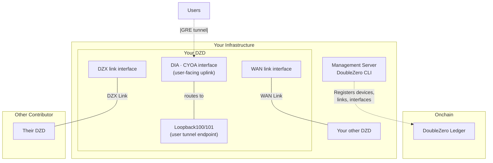
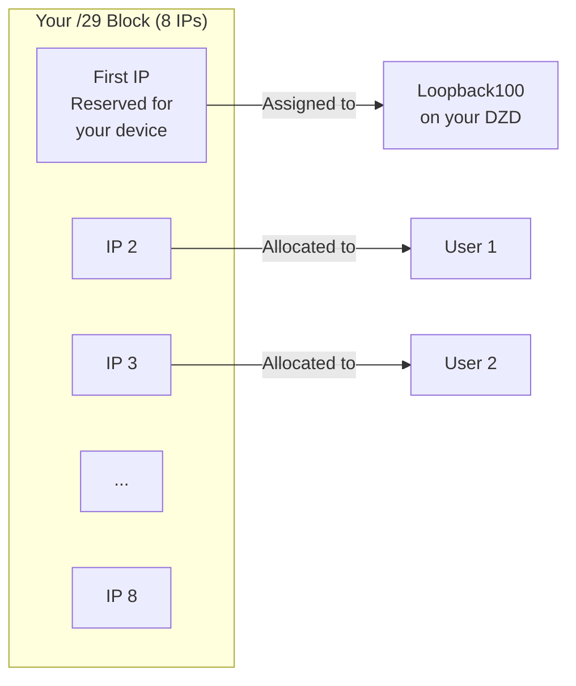
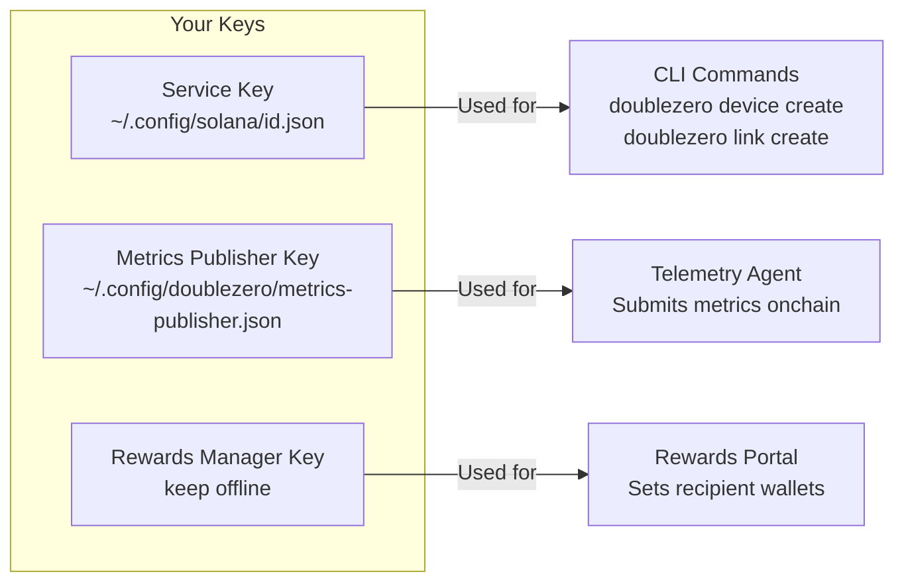
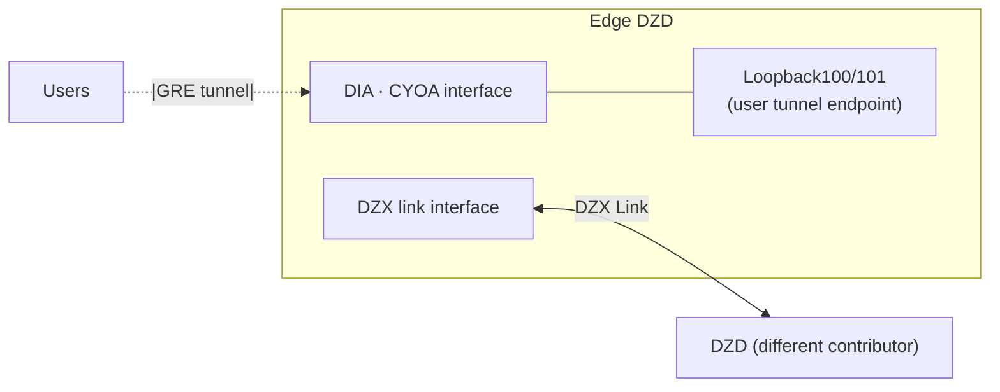
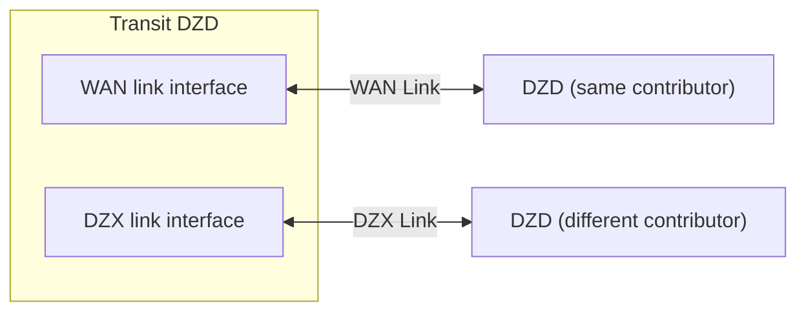
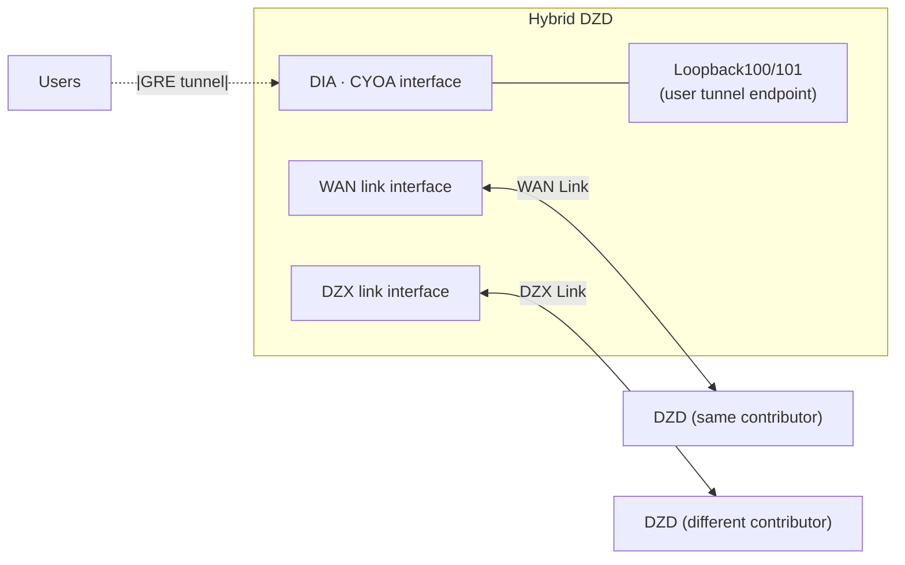
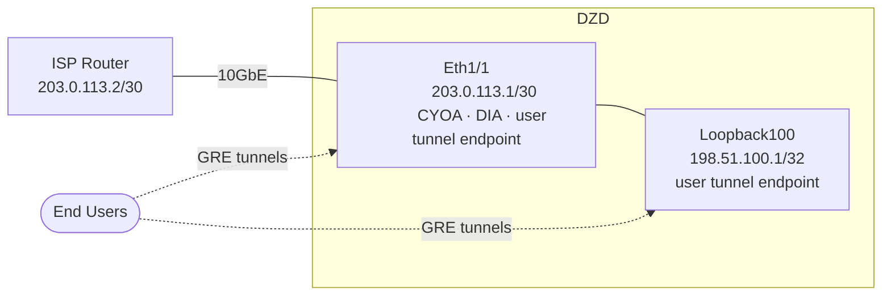
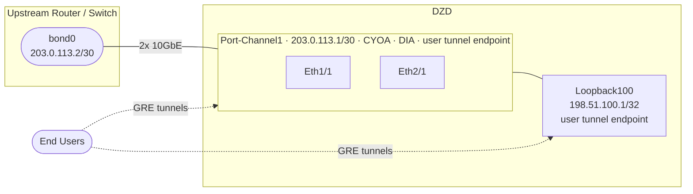
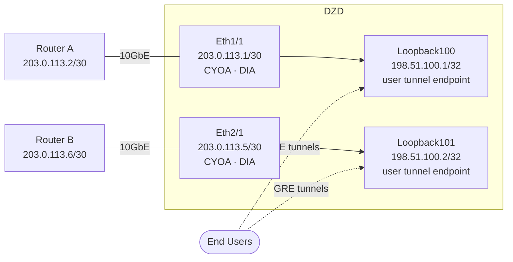

# Guide de provisionnement d'appareil

Ce guide vous accompagne dans le provisionnement d'un appareil DoubleZero (DZD) du début à la fin. Chaque phase correspond à la [Liste de contrôle d'intégration](contribute-overview.md#onboarding-checklist).

---

## Comment tout s'articule

Ce guide vous accompagne dans l'enregistrement de votre infrastructure on-chain afin que le réseau DoubleZero puisse acheminer le trafic à travers celle-ci. Plus votre appareil est complètement enregistré, plus il est utile au réseau. Une représentation on-chain complète de votre appareil permet un meilleur diagnostic, une meilleure planification de capacité et permet au contrôleur de prendre des décisions éclairées. À terme, l'objectif est que le contrôleur prenne en charge une part croissante de la responsabilité de configuration.

### Concepts clés

**Interfaces**

Les interfaces d'un DZD se présentent sous différentes formes : ports Ethernet, port channels (LAGs composés de plusieurs ports Ethernet) et loopbacks. Chaque interface jouant un rôle dans le réseau doit être enregistrée on-chain avec les indicateurs appropriés afin que le protocole sache ce qu'elle fait.

Les ports Ethernet et les port channels peuvent remplir les rôles suivants :

| Indicateur | Ce qu'il signifie |
|------|---------------|
| `--interface-dia dia` | Marque l'interface comme lien montant d'accès internet direct |
| `--interface-cyoa <subtype>` | Déclare comment les utilisateurs établissent des tunnels GRE via cette interface (par ex. via l'internet public, via un lien de peering privé) |
| `--user-tunnel-endpoint true` | Cette interface porte une IP publique sur laquelle les utilisateurs terminent leurs tunnels GRE |

Les interfaces utilisées pour les liens WAN ou DZX ne portent pas d'indicateur spécifique, elles sont enregistrées avec leur bande passante puis référencées lors de la création du lien.

Les interfaces loopback servent plusieurs objectifs :

| Loopback | Ce qu'il signifie |
|----------|---------------|
| **Loopback100 / 101** | Portent des IP publiques sur lesquelles les utilisateurs terminent leurs tunnels GRE. Enregistrées avec `--user-tunnel-endpoint true`. |
| **Loopback255** (`vpnv4`) | Enregistrée pour que le contrôleur puisse attribuer une IP utilisée pour l'identifiant de routeur BGP, le peering VPN-IPv4 (unicast), l'identité IS-IS et le segment routing |
| **Loopback256** (`ipv4`) | Enregistrée pour que le contrôleur puisse attribuer une IP utilisée pour le peering BGP IPv4 (multicast) et les sessions MSDP |

**Liens**

Les liens sont enregistrés séparément des interfaces, et les interfaces doivent exister on-chain avant qu'un lien puisse les référencer. Lorsque vous créez un lien WAN ou DZX, vous spécifiez une interface déjà enregistrée comme point de terminaison physique du lien. Toutes les interfaces ne sont pas liées à un lien : les interfaces DIA, CYOA et loopback ne sont pas connectées à un lien.

| Terme | Ce qu'il signifie |
|------|---------------|
| **Lien WAN** | Un lien entre deux de vos propres DZD |
| **Lien DZX** | Un lien entre votre DZD et le DZD d'un autre contributeur |

### Vue d'ensemble de l'architecture


```mermaid
flowchart TB
    subgraph Onchain
        SC[DoubleZero Ledger]
    end

    subgraph Your Infrastructure
        MGMT[Management Server<br/>DoubleZero CLI]
        subgraph DZD[Your DZD]
            CYOA["DIA · CYOA interface<br/>(user-facing uplink)"]
            WAN_INTF["WAN link interface"]
            DZX_INTF["DZX link interface"]
            LO100["Loopback100/101<br/>(user tunnel endpoint)"]
        end
        DZD2[Your other DZD]
    end

    subgraph Other Contributor
        OtherDZD[Their DZD]
    end

    USERS["Users"]

    MGMT -.->|Registers devices,<br/>links, interfaces| SC
    WAN_INTF ---|WAN Link| DZD2
    DZX_INTF ---|DZX Link| OtherDZD
    USERS -.|GRE tunnel|.-> CYOA
    CYOA ---|routes to| LO100
```

---

## Phase 1 : Prérequis

Avant de pouvoir provisionner un appareil, vous devez avoir le matériel physique installé et quelques adresses IP allouées.

### Ce dont vous avez besoin

| Exigence | Pourquoi c'est nécessaire |
|-------------|-----------------|
| **Matériel DZD** | Switch Arista 7280CR3A (voir [spécifications matérielles](contribute.md#hardware-requirements)) |
| **Espace rack** | 2U réservés par DZD (1U utilisé aujourd'hui), avec une ventilation appropriée. Voir [Rack et alimentation](contribute.md#rack-power-requirements) |
| **Alimentation** | Deux alimentations indépendantes, chacune capable de supporter la charge totale seule. Voir [Rack et alimentation](contribute.md#rack-power-requirements) |
| **Accès de gestion** | Accès SSH/console pour configurer le switch |
| **Connectivité Internet** | Pour la publication de métriques et la récupération de configuration depuis le contrôleur |
| **Bloc IPv4 public** | Minimum /29 pour le pool de préfixes DZ (voir ci-dessous) |

### Installer le CLI DoubleZero

Le CLI DoubleZero (`doublezero`) est utilisé tout au long du provisionnement pour enregistrer les appareils, créer des liens et gérer votre contribution. Il doit être installé sur un **serveur de gestion ou une VM** — pas sur le switch DZD lui-même. Le switch exécute uniquement le Config Agent et le Telemetry Agent (installés en [Phase 4](#phase-4-etablissement-des-liens-installation-des-agents)).

**Ubuntu / Debian :**
```bash
curl -1sLf https://dl.cloudsmith.io/public/malbeclabs/doublezero/setup.deb.sh | sudo -E bash
sudo apt-get install doublezero
```

**Rocky Linux / RHEL :**
```bash
curl -1sLf https://dl.cloudsmith.io/public/malbeclabs/doublezero/setup.rpm.sh | sudo -E bash
sudo yum install doublezero
```

Vérifiez que le démon est en cours d'exécution :
```bash
sudo systemctl status doublezerod
```

### Comprendre votre préfixe DZ

Votre préfixe DZ est un bloc d'adresses IP publiques que le protocole DoubleZero gère pour l'allocation d'IP.


```mermaid
flowchart LR
    subgraph "Your /29 Block (8 IPs)"
        IP1["First IP<br/>Reserved for<br/>your device"]
        IP2["IP 2"]
        IP3["IP 3"]
        IP4["..."]
        IP8["IP 8"]
    end

    IP1 -->|Assigned to| LO[Loopback100<br/>on your DZD]
    IP2 -->|Allocated to| U1[User 1]
    IP3 -->|Allocated to| U2[User 2]
```

**Comment les préfixes DZ sont utilisés :**

- **Première IP** : Réservée à votre appareil (attribuée à l'interface Loopback100)
- **IP restantes** : Allouées à des types d'utilisateurs spécifiques se connectant à votre DZD :
    - Utilisateurs `IBRLWithAllocatedIP`
    - Utilisateurs `EdgeFiltering` (cas d'usage futur)
- **Utilisateurs IBRL** : Ne consomment PAS de ce pool (ils utilisent leur propre IP publique)

!!! warning "Règles des préfixes DZ"
    **Vous NE POUVEZ PAS utiliser ces adresses pour :**

    - Votre propre équipement réseau
    - Les liens point-à-point sur les interfaces DIA
    - Les interfaces de gestion
    - Toute infrastructure en dehors du protocole DZ

    **Exigences :**

    - Doivent être des adresses IPv4 **routables globalement (publiques)**
    - Les plages d'IP privées (10.x, 172.16-31.x, 192.168.x) sont rejetées par le smart contract
    - **Taille minimale : /29** (8 adresses), des préfixes plus grands sont préférables (par ex. /28, /27)
    - Le bloc entier doit être disponible — ne pré-allouez aucune adresse

    Si vous avez besoin d'adresses pour votre propre équipement (IP d'interface DIA, gestion, etc.), utilisez un **pool d'adresses séparé**.

---

## Phase 2 : Configuration du compte

Dans cette phase, vous créez les clés cryptographiques qui vous identifient, vous et vos appareils, sur le réseau, et vous configurez la gestion des récompenses.

Les étapes s'exécutent dans cet ordre pour une raison : d'abord l'accès au dépôt, car celui-ci contient les instructions pour les étapes suivantes, puis vos clés, puis les récompenses. Certaines étapes nécessitent que DZF agisse avant que vous puissiez continuer, et chacune ci-dessous le précise.

### Où exécuter le CLI

!!! warning "N'installez PAS le CLI sur votre switch"
    Le CLI DoubleZero (`doublezero`) doit être installé sur un **serveur de gestion ou une VM**, pas sur votre switch Arista.

    ```mermaid
    flowchart LR
        subgraph "Management Server/VM"
            CLI[DoubleZero CLI]
            KEYS[Your Keypairs]
        end

        subgraph "Your DZD Switch"
            CA[Config Agent]
            TA[Telemetry Agent]
        end

        CLI -->|Creates devices, links| BC[Blockchain]
        CA -->|Pulls config| CTRL[Controller]
        TA -->|Submits metrics| BC
    ```

    | Installer sur le serveur de gestion | Installer sur le switch |
    |-----------------------------|-------------------|
    | CLI `doublezero` | Config Agent |
    | Votre paire de clés de service | Telemetry Agent |
    | Votre paire de clés du publieur de métriques | Paire de clés du publieur de métriques (copie) |

### Que sont les clés ?

Considérez les clés comme des identifiants de connexion sécurisés :

- **Clé de service** : Votre identité de contributeur — utilisée pour exécuter les commandes CLI
- **Clé du publieur de métriques** : L'identité de votre appareil pour soumettre les données de télémétrie
- **Clé du gestionnaire de récompenses** : Contrôle quels portefeuilles reçoivent vos récompenses — voir [Gestion des récompenses](https://github.com/malbeclabs/contributors#rewards-management) dans le dépôt des contributeurs

Les trois sont des paires de clés cryptographiques (une clé publique que vous partagez, une clé privée que vous gardez secrète).


```mermaid
flowchart LR
    subgraph "Your Keys"
        SK[Service Key<br/>~/.config/solana/id.json]
        MK[Metrics Publisher Key<br/>~/.config/doublezero/metrics-publisher.json]
        RK[Rewards Manager Key<br/>keep offline]
    end

    SK -->|Used for| CLI[CLI Commands<br/>doublezero device create<br/>doublezero link create]
    MK -->|Used for| TEL[Telemetry Agent<br/>Submits metrics onchain]
    RK -->|Used for| REW[Rewards Portal<br/>Sets recipient wallets]
```

!!! note "Gardez la clé du gestionnaire de récompenses séparée"
    La clé de service et la clé du publieur de métriques résident sur votre serveur de gestion et votre switch. La clé du gestionnaire de récompenses contrôle où va votre argent, donc gardez-la hors de ces machines. Elle n'est nécessaire que lorsque vous modifiez vos portefeuilles destinataires.

### Étape 2.1 : Demander l'accès au dépôt des contributeurs

Contactez la DoubleZero Foundation ou Malbec Labs et fournissez-leur votre **nom d'utilisateur GitHub**.

Ils vous accordent l'accès au dépôt privé [malbeclabs/contributors](https://github.com/malbeclabs/contributors). Faites-le en premier : le dépôt contient la configuration de base des appareils, les profils TCAM et ACL, et les instructions de gestion des récompenses dont vous avez besoin dans les étapes suivantes.

### Étape 2.2 : Générer votre clé de service

C'est votre identité principale pour interagir avec DoubleZero.

```bash
doublezero keygen
```

Cela crée une paire de clés à l'emplacement par défaut. La sortie affiche votre **clé publique** — c'est ce que vous partagerez avec DZF.

### Étape 2.3 : Générer votre clé de publieur de métriques

Cette clé est utilisée par le Telemetry Agent pour signer les soumissions de métriques.

```bash
doublezero keygen -o ~/.config/doublezero/metrics-publisher.json
```

### Étape 2.4 : Soumettre votre clé de service à DZF

Envoyez à DZF votre **clé publique de service**.

Ils créent votre **compte contributeur** on-chain et confirment lorsque c'est fait.

!!! danger "Clés publiques uniquement"
    N'envoyez jamais une clé privée ou un fichier de paire de clés à quiconque, y compris DZF. Seule la clé publique est nécessaire.

### Étape 2.5 : Vérifier votre compte

Une fois confirmé, vérifiez que votre compte contributeur existe :

```bash
doublezero contributor list
```

Vous devriez voir votre code contributeur dans la liste.

### Étape 2.6 : Configurer la gestion des récompenses

La gestion des récompenses détermine quels portefeuilles reçoivent les [2Z](glossary.md#2z-token) que votre contribution génère, et dans quelles proportions.

Suivez [Gestion des récompenses](https://github.com/malbeclabs/contributors#rewards-management) dans le dépôt des contributeurs, auquel vous avez désormais accès depuis l'étape 2.1.

!!! note "Cela ne bloque pas le reste de votre configuration"
    Vous pouvez provisionner votre appareil, établir des liens et commencer à acheminer du trafic sans que cela soit en place, donc traitez les phases ci-dessous comme indépendantes de celle-ci.

---

## Phase 3 : Provisionnement de l'appareil

Vous allez maintenant enregistrer votre appareil physique sur la blockchain et configurer ses interfaces.

### Comprendre les types d'appareils

**Edge** — accepte uniquement les connexions utilisateurs


```mermaid
flowchart LR
    subgraph EDZD[Edge DZD]
        E_CYOA["DIA · CYOA interface"]
        E_TUN["Loopback100/101
        (user tunnel endpoint)"]
        E_DZX["DZX link interface"]
        E_CYOA --- E_TUN
    end
    EU["Users"] -.|GRE tunnel|.-> E_CYOA
    E_DZX <-->|DZX Link| ED["DZD (different contributor)"]
```

**Transit** — achemine le trafic entre appareils, pas de connexions utilisateurs


```mermaid
flowchart LR
    subgraph TDZD[Transit DZD]
        T_WAN["WAN link interface"]
        T_DZX["DZX link interface"]
    end
    T_WAN <-->|WAN Link| T2["DZD (same contributor)"]
    T_DZX <-->|DZX Link| TD["DZD (different contributor)"]
```

**Hybride** — connexions utilisateurs et backbone, le plus courant


```mermaid
flowchart LR
    subgraph HDZD[Hybrid DZD]
        H_CYOA["DIA · CYOA interface"]
        H_TUN["Loopback100/101
        (user tunnel endpoint)"]
        H_WAN["WAN link interface"]
        H_DZX["DZX link interface"]
        H_CYOA --- H_TUN
    end
    HU["Users"] -.|GRE tunnel|.-> H_CYOA
    H_WAN <-->|WAN Link| H2["DZD (same contributor)"]
    H_DZX <-->|DZX Link| HD["DZD (different contributor)"]
```

| Type | Ce qu'il fait | Quand l'utiliser |
|------|--------------|-------------|
| **Edge** | Accepte uniquement les connexions utilisateurs | Emplacement unique, orienté utilisateur uniquement |
| **Transit** | Achemine le trafic entre appareils | Connectivité backbone, pas d'utilisateurs |
| **Hybride** | Connexions utilisateurs ET backbone | Le plus courant — fait tout |

### Étape 3.1 : Trouver votre emplacement et échange

Avant de créer votre appareil, recherchez les codes de votre emplacement de centre de données et de l'échange le plus proche :

```bash
# List available locations (data centers)
doublezero location list

# List available exchanges (interconnect points)
doublezero exchange list
```

### Étape 3.2 : Créer votre appareil on-chain

Enregistrez votre appareil sur la blockchain :

```bash
doublezero device create \
  --code <YOUR_DEVICE_CODE> \
  --contributor <YOUR_CONTRIBUTOR_CODE> \
  --device-type hybrid \
  --location <LOCATION_CODE> \
  --exchange <EXCHANGE_CODE> \
  --public-ip <DEVICE_PUBLIC_IP> \
  --dz-prefixes <YOUR_DZ_PREFIX>
```

**Exemple :**

```bash
doublezero device create \
  --code nyc-dz001 \
  --contributor acme \
  --device-type hybrid \
  --location EQX-NY5 \
  --exchange nyc \
  --public-ip "203.0.113.10" \
  --dz-prefixes "198.51.100.0/28"
```

**Sortie attendue :**

```
Signature: 4vKz8H...truncated...7xPq2
```

Vérifiez que votre appareil a été créé :

```bash
doublezero device list | grep nyc-dz001
```

**Explication des paramètres :**

| Paramètre | Ce qu'il signifie |
|-----------|---------------|
| `--code` | Un nom unique pour votre appareil (par ex. `nyc-dz001`) |
| `--contributor` | Votre code contributeur (fourni par DZF) |
| `--device-type` | `hybrid`, `transit` ou `edge` |
| `--location` | Code du centre de données depuis `location list` |
| `--exchange` | Code de l'échange le plus proche depuis `exchange list` |
| `--public-ip` | L'IP publique par laquelle les utilisateurs se connectent à votre appareil via internet |
| `--dz-prefixes` | Votre bloc d'IP alloué pour les utilisateurs |

### Étape 3.3 : Créer les interfaces loopback requises

Chaque appareil nécessite deux interfaces loopback pour le routage interne :

```bash
# VPNv4 loopback
doublezero device interface create <DEVICE_CODE> Loopback255 --loopback-type vpnv4

# IPv4 loopback
doublezero device interface create <DEVICE_CODE> Loopback256 --loopback-type ipv4
```

**Sortie attendue (pour chaque commande) :**

```
Signature: 3mNx9K...truncated...8wRt5
```

### Étape 3.4 : Créer les interfaces physiques

Enregistrez les interfaces physiques qui seront utilisées pour les liens WAN ou DZX. Ces interfaces doivent exister on-chain avant que vous puissiez créer un lien qui les référence. À cette étape, vous enregistrez uniquement l'interface et sa bande passante ; le lien est créé dans une étape ultérieure.

```bash
doublezero device interface create <DEVICE_CODE> <INTERFACE_NAME> \
  --bandwidth <PORT_SPEED>
```

**Exemple :**

```bash
doublezero device interface create nyc-dz001 Ethernet1/1 \
  --bandwidth 10Gbps
```

**Sortie attendue :**

```
Signature: 7pQw2R...truncated...4xKm9
```

Répétez cette opération pour chaque interface qui sera utilisée comme point de terminaison d'un lien WAN ou DZX. Les interfaces CYOA et DIA sont enregistrées séparément à l'étape suivante.

### Étape 3.5 : Créer l'interface CYOA (pour les appareils Edge/Hybrides)

Les DZD hybrides et edge nécessitent **deux adresses IP publiques** sur lesquelles les utilisateurs terminent leurs tunnels GRE. Les utilisateurs peuvent se connecter en unicast, multicast, ou les deux, et quelle IP sert quel objectif alterne selon l'utilisateur.

Les deux IP doivent être enregistrées avec `--user-tunnel-endpoint true`, soit sur une interface physique, soit sur un loopback. Cela inclut l'IP que vous avez fournie lors de la création de l'appareil — cette IP doit quand même être explicitement enregistrée ici.

Si vous êtes limité en IP, vous pouvez utiliser le premier `/32` de votre préfixe DZ comme l'une des deux IP.

#### CYOA et DIA

| Type | Indicateur | Objectif |
|------|------|---------|
| DIA | `--interface-dia dia` | Marque le port comme accès internet direct |
| CYOA | `--interface-cyoa <subtype>` | Déclare comment les utilisateurs connectent les tunnels GRE à votre appareil |

L'indicateur CYOA est toujours défini sur une **interface physique** (port Ethernet ou port channel). Jamais sur un loopback.

| Sous-type CYOA | Quand l'utiliser |
|-------------|-------------|
| `gre-over-dia` | Les utilisateurs se connectent via l'internet public. Le plus courant. |
| `gre-over-private-peering` | Les utilisateurs se connectent via un cross-connect direct ou un circuit privé |
| `gre-over-public-peering` | Les utilisateurs peerent avec vous à un point d'échange Internet (IX) |
| `gre-over-fabric` | Les utilisateurs sont colocalisés et se connectent via un fabric local |
| `gre-over-cable` | Connexion par câble direct vers un utilisateur unique dédié |

#### Scénario A : Interface physique unique

Un seul lien montant physique vers le FAI. Ethernet1/1 est l'interface CYOA et DIA et porte l'une des deux IP publiques. Loopback100 porte la seconde IP publique.


```mermaid
flowchart LR
    USERS(["End Users"])

    subgraph DZD["DZD"]
        E1["Eth1/1
        203.0.113.1/30
        CYOA · DIA · user tunnel endpoint"]
        LO["Loopback100
        198.51.100.1/32\n        user tunnel endpoint"]
        E1 --- LO
    end

    ISP["ISP Router
    203.0.113.2/30"]

    ISP -- "10GbE" --- E1
    USERS -. "GRE tunnels" .-> E1
    USERS -. "GRE tunnels" .-> LO
```

| Interface | `--interface-cyoa` | `--interface-dia` | `--ip-net` | `--bandwidth` | `--cir` | `--routing-mode` | `--user-tunnel-endpoint` |
|-----------|-------------------|------------------|------------|---------------|---------|-----------------|--------------------------|
| Ethernet1/1 | `gre-over-dia` | `dia` | IP/sous-réseau attribué par le contributeur | vitesse du port | débit garanti | `bgp` ou `static` | `true` |
| Loopback100 | — | — | votre /32 publique | `0bps` | — | — | `true` |

Exemple de commandes à exécuter selon le scénario A :
```bash
doublezero device interface create mydzd-nyc01 Ethernet1/1 \
  --interface-cyoa gre-over-dia \
  --interface-dia dia \
  --ip-net 203.0.113.1/30 \
  --bandwidth 10Gbps \
  --cir 1Gbps \
  --routing-mode bgp \
  --user-tunnel-endpoint true

doublezero device interface create mydzd-nyc01 Loopback100 \
  --ip-net 198.51.100.1/32 \
  --bandwidth 0bps \
  --user-tunnel-endpoint true
```

#### Scénario B : Port channel (LAG)

Le DZD se connecte à l'équipement amont via un port channel avec une IP. Le port channel porte une IP publique et est le point de terminaison CYOA. Loopback100 porte la seconde IP publique.


```mermaid
flowchart LR
    USERS(["End Users"])

    subgraph SW["Upstream Router / Switch"]
        SWPC(["bond0
        203.0.113.2/30"])
    end

    subgraph DZD["DZD"]
        subgraph PC["Port-Channel1 · 203.0.113.1/30 · CYOA · DIA · user tunnel endpoint"]
            E1["Eth1/1"]
            E2["Eth2/1"]
        end
        LO["Loopback100
        198.51.100.1/32\n        user tunnel endpoint"]
        PC --- LO
    end

    SWPC -- "2x 10GbE" --- PC
    USERS -. "GRE tunnels" .-> PC
    USERS -. "GRE tunnels" .-> LO
```

| Interface | `--interface-cyoa` | `--interface-dia` | `--ip-net` | `--bandwidth` | `--cir` | `--routing-mode` | `--user-tunnel-endpoint` |
|-----------|-------------------|------------------|------------|---------------|---------|-----------------|--------------------------|
| Port-Channel1 | `gre-over-dia` | `dia` | IP/sous-réseau attribué par le contributeur | vitesse LAG combinée | débit garanti | `bgp` ou `static` | `true` |
| Loopback100 | — | — | votre /32 publique | `0bps` | — | — | `true` |

Exemple de commandes à exécuter selon le scénario B :
```bash
doublezero device interface create mydzd-fra01 Port-Channel1 \
  --interface-cyoa gre-over-dia \
  --interface-dia dia \
  --ip-net 203.0.113.1/30 \
  --bandwidth 20Gbps \
  --cir 2Gbps \
  --routing-mode bgp \
  --user-tunnel-endpoint true

doublezero device interface create mydzd-fra01 Loopback100 \
  --ip-net 198.51.100.1/32 \
  --bandwidth 0bps \
  --user-tunnel-endpoint true
```


#### Scénario C : Double lien montant physique vers des routeurs séparés

Chaque interface physique se connecte à un routeur amont différent. Les deux IP publiques sont sur Loopback100 et Loopback101, toutes deux enregistrées comme points de terminaison de tunnel utilisateur.


```mermaid
flowchart LR
    USERS(["End Users"])

    RA["Router A
    203.0.113.2/30"]
    RB["Router B
    203.0.113.6/30"]

    subgraph DZD["DZD"]
        E1["Eth1/1
        203.0.113.1/30
        CYOA · DIA"]
        E2["Eth2/1
        203.0.113.5/30
        CYOA · DIA"]
        LO0["Loopback100
        198.51.100.1/32\n        user tunnel endpoint"]
        LO1["Loopback101
        198.51.100.2/32\n        user tunnel endpoint"]
        E1 --> LO0
        E2 --> LO1
    end

    RA -- "10GbE" --- E1
    RB -- "10GbE" --- E2
    USERS -. "GRE tunnels" .-> LO0
    USERS -. "GRE tunnels" .-> LO1
```

| Interface | `--interface-cyoa` | `--interface-dia` | `--ip-net` | `--bandwidth` | `--cir` | `--routing-mode` | `--user-tunnel-endpoint` |
|-----------|-------------------|------------------|------------|---------------|---------|-----------------|--------------------------|
| Ethernet1/1 | `gre-over-dia` | `dia` | IP/sous-réseau attribué par le contributeur | vitesse du port | débit garanti | `bgp` ou `static` | — |
| Ethernet2/1 | `gre-over-dia` | `dia` | IP/sous-réseau attribué par le contributeur | vitesse du port | débit garanti | `bgp` ou `static` | — |
| Loopback100 | — | — | votre /32 publique | `0bps`