# Guide de provisionnement d'appareil

Ce guide vous accompagne dans le provisionnement d'un Appareil DoubleZero (DZD) du début à la fin. Chaque phase correspond à la [Checklist d'intégration](contribute-overview.md#onboarding-checklist).

---

## Comment tout s'articule

Ce guide vous accompagne dans l'enregistrement de votre infrastructure on-chain afin que le réseau DoubleZero puisse acheminer le trafic à travers elle. Plus votre appareil est enregistré de manière complète, plus il est utile au réseau. Une représentation on-chain complète de votre appareil permet un meilleur dépannage, une meilleure planification de capacité, et permet au contrôleur de prendre des décisions éclairées. À terme, l'objectif est que le contrôleur prenne en charge davantage de responsabilités de configuration.

### Concepts clés

**Interfaces**

Les interfaces d'un DZD se présentent sous différentes formes : ports Ethernet, port channels (LAGs composés de plusieurs ports Ethernet) et loopbacks. Chaque interface jouant un rôle dans le réseau doit être enregistrée on-chain avec les flags appropriés afin que le protocole sache à quoi elle sert.

Les ports Ethernet et les port channels peuvent remplir les rôles suivants :

| Flag | Ce que cela signifie |
|------|----------------------|
| `--interface-dia dia` | Marque l'interface comme lien montant d'accès internet direct |
| `--interface-cyoa <subtype>` | Déclare comment les utilisateurs établissent des tunnels GRE à travers cette interface (par ex. via l'internet public, via un lien de peering privé) |
| `--user-tunnel-endpoint true` | Cette interface porte une IP publique sur laquelle les utilisateurs terminent les tunnels GRE |

Les interfaces utilisées pour les liens WAN ou DZX ne portent pas de flag spécifique, elles sont enregistrées avec leur bande passante puis référencées lors de la création du lien.

Les interfaces loopback servent plusieurs objectifs :

| Loopback | Ce que cela signifie |
|----------|----------------------|
| **Loopback100 / 101** | Portent des IPs publiques sur lesquelles les utilisateurs terminent les tunnels GRE. Enregistrées avec `--user-tunnel-endpoint true`. |
| **Loopback255** (`vpnv4`) | Enregistrée pour que le contrôleur puisse attribuer une IP utilisée pour l'identifiant de routeur BGP, le peering VPN-IPv4 (unicast), l'identité IS-IS et le routage par segment |
| **Loopback256** (`ipv4`) | Enregistrée pour que le contrôleur puisse attribuer une IP utilisée pour le peering BGP IPv4 (multicast) et les sessions MSDP |

**Liens**

Les liens sont enregistrés séparément des interfaces, et les interfaces doivent exister on-chain avant qu'un lien puisse les référencer. Lorsque vous créez un lien WAN ou DZX, vous spécifiez une interface déjà enregistrée comme point de terminaison physique du lien. Toutes les interfaces ne sont pas liées à un lien : les interfaces DIA, CYOA et loopback ne sont pas connectées à un lien.

| Terme | Ce que cela signifie |
|-------|----------------------|
| **Lien WAN** | Un lien entre deux de vos propres DZDs |
| **Lien DZX** | Un lien entre votre DZD et le DZD d'un autre contributeur |

### Vue d'ensemble de l'architecture

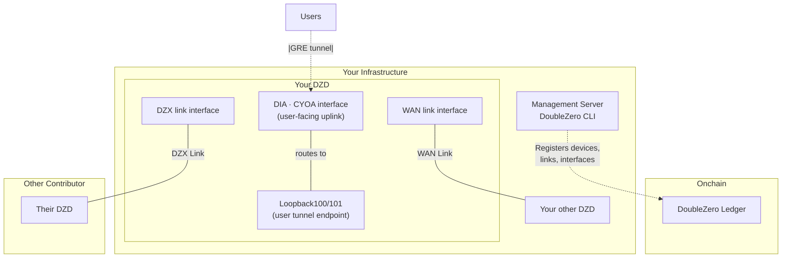
```mermaid
flowchart TB
    subgraph Onchain
        SC[DoubleZero Ledger]
    end

    subgraph Your Infrastructure
        MGMT[Management Server<br/>DoubleZero CLI]
        subgraph DZD[Your DZD]
            CYOA["DIA · CYOA interface<br/>(user-facing uplink)"]
            WAN_INTF["WAN link interface"]
            DZX_INTF["DZX link interface"]
            LO100["Loopback100/101<br/>(user tunnel endpoint)"]
        end
        DZD2[Your other DZD]
    end

    subgraph Other Contributor
        OtherDZD[Their DZD]
    end

    USERS["Users"]

    MGMT -.->|Registers devices,<br/>links, interfaces| SC
    WAN_INTF ---|WAN Link| DZD2
    DZX_INTF ---|DZX Link| OtherDZD
    USERS -.|GRE tunnel|.-> CYOA
    CYOA ---|routes to| LO100
```

---

## Phase 1 : Prérequis

Avant de pouvoir provisionner un appareil, vous devez avoir le matériel physique installé et quelques adresses IP allouées.

### Ce dont vous avez besoin

| Exigence | Pourquoi c'est nécessaire |
|----------|--------------------------|
| **Matériel DZD** | Switch Arista 7280CR3A (voir [spécifications matérielles](contribute.md#hardware-requirements)) |
| **Espace rack** | 4U avec un flux d'air approprié |
| **Alimentation** | Alimentations redondantes, ~4KW recommandé |
| **Accès de gestion** | Accès SSH/console pour configurer le switch |
| **Connectivité Internet** | Pour la publication des métriques et la récupération de la configuration depuis le contrôleur |
| **Bloc IPv4 public** | Minimum /29 pour le pool de préfixes DZ (voir ci-dessous) |

### Installer le CLI DoubleZero

Le CLI DoubleZero (`doublezero`) est utilisé tout au long du provisionnement pour enregistrer les appareils, créer des liens et gérer votre contribution. Il doit être installé sur un **serveur de gestion ou une VM** — pas sur le switch DZD lui-même. Le switch exécute uniquement le Config Agent et le Telemetry Agent (installés lors de la [Phase 4](#phase-4-link-establishment-agent-installation)).

**Ubuntu / Debian :**
```bash
curl -1sLf https://dl.cloudsmith.io/public/malbeclabs/doublezero/setup.deb.sh | sudo -E bash
sudo apt-get install doublezero
```

**Rocky Linux / RHEL :**
```bash
curl -1sLf https://dl.cloudsmith.io/public/malbeclabs/doublezero/setup.rpm.sh | sudo -E bash
sudo yum install doublezero
```

Vérifiez que le daemon est en cours d'exécution :
```bash
sudo systemctl status doublezerod
```

### Comprendre votre préfixe DZ

Votre préfixe DZ est un bloc d'adresses IP publiques que le protocole DoubleZero gère pour l'allocation d'IP.

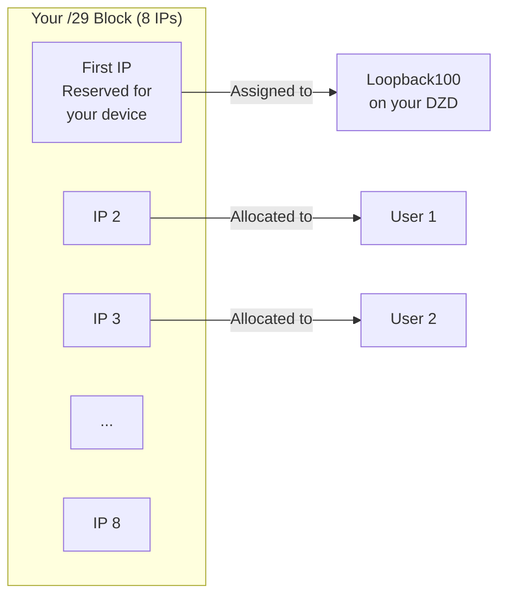
```mermaid
flowchart LR
    subgraph "Your /29 Block (8 IPs)"
        IP1["First IP<br/>Reserved for<br/>your device"]
        IP2["IP 2"]
        IP3["IP 3"]
        IP4["..."]
        IP8["IP 8"]
    end

    IP1 -->|Assigned to| LO[Loopback100<br/>on your DZD]
    IP2 -->|Allocated to| U1[User 1]
    IP3 -->|Allocated to| U2[User 2]
```

**Comment les préfixes DZ sont utilisés :**

- **Première IP** : Réservée pour votre appareil (attribuée à l'interface Loopback100)
- **IPs restantes** : Allouées à des types d'utilisateurs spécifiques se connectant à votre DZD :
    - Utilisateurs `IBRLWithAllocatedIP`
    - Utilisateurs `EdgeFiltering` (cas d'usage futur)
- **Utilisateurs IBRL** : Ne consomment PAS de ce pool (ils utilisent leur propre IP publique)

!!! warning "Règles des préfixes DZ"
    **Vous NE POUVEZ PAS utiliser ces adresses pour :**

    - Votre propre équipement réseau
    - Les liens point-à-point sur les interfaces DIA
    - Les interfaces de gestion
    - Toute infrastructure en dehors du protocole DZ

    **Exigences :**

    - Doivent être des adresses IPv4 **routables globalement (publiques)**
    - Les plages IP privées (10.x, 172.16-31.x, 192.168.x) sont rejetées par le smart contract
    - **Taille minimale : /29** (8 adresses), les préfixes plus grands sont préférés (par ex., /28, /27)
    - Le bloc entier doit être disponible — ne pré-allouez aucune adresse

    Si vous avez besoin d'adresses pour votre propre équipement (IPs d'interface DIA, gestion, etc.), utilisez un **pool d'adresses séparé**.

---

## Phase 2 : Configuration du compte

Dans cette phase, vous créez les clés cryptographiques qui vous identifient, vous et vos appareils, sur le réseau.

### Où exécuter le CLI

!!! warning "N'installez PAS le CLI sur votre switch"
    Le CLI DoubleZero (`doublezero`) doit être installé sur un **serveur de gestion ou une VM**, pas sur votre switch Arista.

    ```mermaid
    flowchart LR
        subgraph "Management Server/VM"
            CLI[DoubleZero CLI]
            KEYS[Your Keypairs]
        end

        subgraph "Your DZD Switch"
            CA[Config Agent]
            TA[Telemetry Agent]
        end

        CLI -->|Creates devices, links| BC[Blockchain]
        CA -->|Pulls config| CTRL[Controller]
        TA -->|Submits metrics| BC
    ```

    | Installer sur le serveur de gestion | Installer sur le switch |
    |-------------------------------------|-------------------------|
    | CLI `doublezero` | Config Agent |
    | Votre paire de clés de service | Telemetry Agent |
    | Votre paire de clés metrics publisher | Paire de clés metrics publisher (copie) |

### Que sont les clés ?

Pensez aux clés comme des identifiants de connexion sécurisés :

- **Clé de service** : Votre identité de contributeur - utilisée pour exécuter les commandes CLI
- **Clé Metrics Publisher** : L'identité de votre appareil pour soumettre les données de télémétrie

Les deux sont des paires de clés cryptographiques (une clé publique que vous partagez, une clé privée que vous gardez secrète).

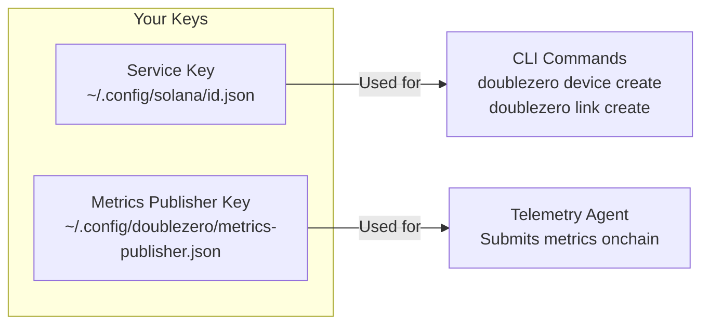
```mermaid
flowchart LR
    subgraph "Your Keys"
        SK[Service Key<br/>~/.config/solana/id.json]
        MK[Metrics Publisher Key<br/>~/.config/doublezero/metrics-publisher.json]
    end

    SK -->|Used for| CLI[CLI Commands<br/>doublezero device create<br/>doublezero link create]
    MK -->|Used for| TEL[Telemetry Agent<br/>Submits metrics onchain]
```

### Étape 2.1 : Générer votre clé de service

C'est votre identité principale pour interagir avec DoubleZero.

```bash
doublezero keygen
```

Cela crée une paire de clés à l'emplacement par défaut. La sortie affiche votre **clé publique** - c'est ce que vous partagerez avec la DZF.

### Étape 2.2 : Générer votre clé Metrics Publisher

Cette clé est utilisée par le Telemetry Agent pour signer les soumissions de métriques.

```bash
doublezero keygen -o ~/.config/doublezero/metrics-publisher.json
```

### Étape 2.3 : Soumettre les clés à la DZF

Contactez la DoubleZero Foundation ou Malbec Labs et fournissez :

1. La **clé publique** de votre clé de service
2. Votre **nom d'utilisateur GitHub** (pour l'accès au dépôt)

Ils vont :

- Créer votre **compte contributeur** on-chain
- Accorder l'accès au **dépôt privé des contributeurs**

### Étape 2.4 : Vérifier votre compte

Une fois confirmé, vérifiez que votre compte contributeur existe :

```bash
doublezero contributor list
```

Vous devriez voir votre code contributeur dans la liste.

### Étape 2.5 : Accéder au dépôt des contributeurs

Le dépôt [malbeclabs/contributors](https://github.com/malbeclabs/contributors) contient :

- Les configurations de base des appareils
- Les profils TCAM
- Les configurations ACL
- Des instructions de configuration supplémentaires

Suivez les instructions qui s'y trouvent pour la configuration spécifique à l'appareil.

---

## Phase 3 : Provisionnement de l'appareil

Vous allez maintenant enregistrer votre appareil physique sur la blockchain et configurer ses interfaces.

### Comprendre les types d'appareils {#understanding-device-types}

**Edge** — accepte uniquement les connexions utilisateurs

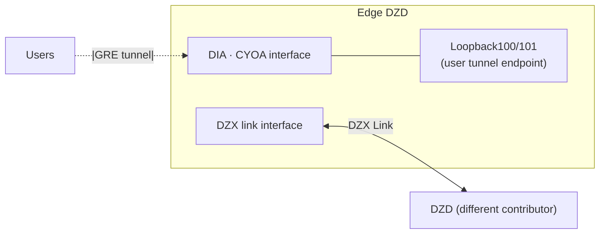
```mermaid
flowchart LR
    subgraph EDZD[Edge DZD]
        E_CYOA["DIA · CYOA interface"]
        E_TUN["Loopback100/101
        (user tunnel endpoint)"]
        E_DZX["DZX link interface"]
        E_CYOA --- E_TUN
    end
    EU["Users"] -.|GRE tunnel|.-> E_CYOA
    E_DZX <-->|DZX Link| ED["DZD (different contributor)"]
```

**Transit** — achemine le trafic entre appareils, pas de connexions utilisateurs

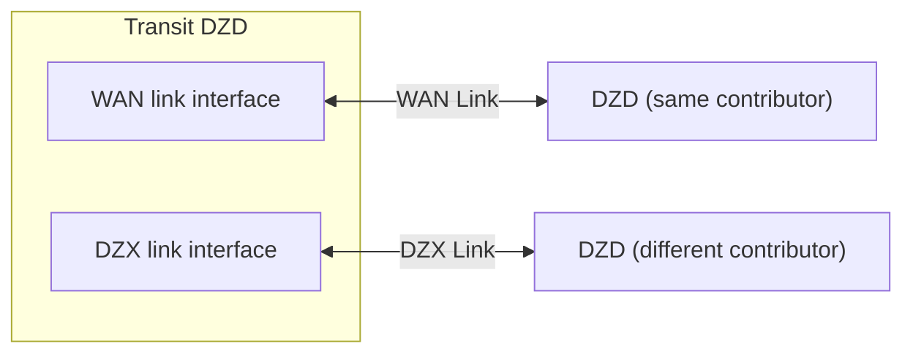
```mermaid
flowchart LR
    subgraph TDZD[Transit DZD]
        T_WAN["WAN link interface"]
        T_DZX["DZX link interface"]
    end
    T_WAN <-->|WAN Link| T2["DZD (same contributor)"]
    T_DZX <-->|DZX Link| TD["DZD (different contributor)"]
```

**Hybride** — connexions utilisateurs et backbone, le plus courant

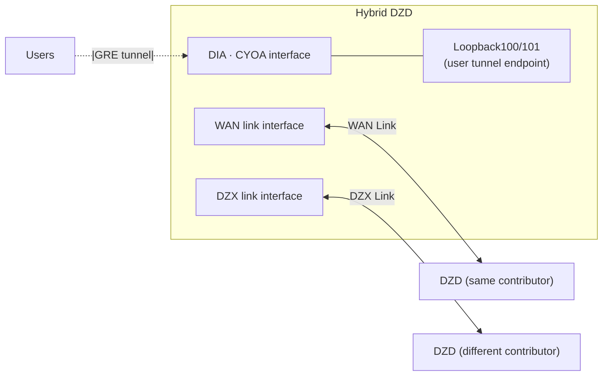
```mermaid
flowchart LR
    subgraph HDZD[Hybrid DZD]
        H_CYOA["DIA · CYOA interface"]
        H_TUN["Loopback100/101
        (user tunnel endpoint)"]
        H_WAN["WAN link interface"]
        H_DZX["DZX link interface"]
        H_CYOA --- H_TUN
    end
    HU["Users"] -.|GRE tunnel|.-> H_CYOA
    H_WAN <-->|WAN Link| H2["DZD (same contributor)"]
    H_DZX <-->|DZX Link| HD["DZD (different contributor)"]
```

| Type | Ce qu'il fait | Quand l'utiliser |
|------|---------------|------------------|
| **Edge** | Accepte uniquement les connexions utilisateurs | Emplacement unique, orienté utilisateur uniquement |
| **Transit** | Achemine le trafic entre appareils | Connectivité backbone, pas d'utilisateurs |
| **Hybride** | Connexions utilisateurs ET backbone | Le plus courant - fait tout |

### Étape 3.1 : Trouver votre emplacement et votre échange

Avant de créer votre appareil, recherchez les codes de votre emplacement de datacenter et de l'échange le plus proche :

```bash
# Lister les emplacements disponibles (datacenters)
doublezero location list

# Lister les échanges disponibles (points d'interconnexion)
doublezero exchange list
```

### Étape 3.2 : Créer votre appareil on-chain {#step-32-create-your-device-onchain}

Enregistrez votre appareil sur la blockchain :

```bash
doublezero device create \
  --code <YOUR_DEVICE_CODE> \
  --contributor <YOUR_CONTRIBUTOR_CODE> \
  --device-type hybrid \
  --location <LOCATION_CODE> \
  --exchange <EXCHANGE_CODE> \
  --public-ip <DEVICE_PUBLIC_IP> \
  --dz-prefixes <YOUR_DZ_PREFIX>
```

**Exemple :**

```bash
doublezero device create \
  --code nyc-dz001 \
  --contributor acme \
  --device-type hybrid \
  --location EQX-NY5 \
  --exchange nyc \
  --public-ip "203.0.113.10" \
  --dz-prefixes "198.51.100.0/28"
```

**Sortie attendue :**

```
Signature: 4vKz8H...truncated...7xPq2
```

Vérifiez que votre appareil a été créé :

```bash
doublezero device list | grep nyc-dz001
```

**Explication des paramètres :**

| Paramètre | Ce que cela signifie |
|-----------|----------------------|
| `--code` | Un nom unique pour votre appareil (par ex., `nyc-dz001`) |
| `--contributor` | Votre code contributeur (fourni par la DZF) |
| `--device-type` | `hybrid`, `transit`, ou `edge` |
| `--location` | Code du datacenter depuis `location list` |
| `--exchange` | Code de l'échange le plus proche depuis `exchange list` |
| `--public-ip` | L'IP publique où les utilisateurs se connectent à votre appareil via internet |
| `--dz-prefixes` | Votre bloc IP alloué pour les utilisateurs |

### Étape 3.3 : Créer les interfaces loopback requises

Chaque appareil a besoin de deux interfaces loopback pour le routage interne :

```bash
# Loopback VPNv4
doublezero device interface create <DEVICE_CODE> Loopback255 --loopback-type vpnv4

# Loopback IPv4
doublezero device interface create <DEVICE_CODE> Loopback256 --loopback-type ipv4
```

**Sortie attendue (pour chaque commande) :**

```
Signature: 3mNx9K...truncated...8wRt5
```

### Étape 3.4 : Créer les interfaces physiques

Enregistrez les interfaces physiques qui seront utilisées pour les liens WAN ou DZX. Ces interfaces doivent exister on-chain avant que vous puissiez créer un lien qui les référence. À cette étape, vous enregistrez uniquement l'interface et sa bande passante, le lien est créé à une étape ultérieure.

```bash
doublezero device interface create <DEVICE_CODE> <INTERFACE_NAME> \
  --bandwidth <PORT_SPEED>
```

**Exemple :**

```bash
doublezero device interface create nyc-dz001 Ethernet1/1 \
  --bandwidth 10Gbps
```

**Sortie attendue :**

```
Signature: 7pQw2R...truncated...4xKm9
```

Répétez cette opération pour chaque interface qui sera utilisée comme point de terminaison de lien WAN ou DZX. Les interfaces CYOA et DIA sont enregistrées séparément à l'étape suivante.

### Étape 3.5 : Créer l'interface CYOA (pour les appareils Edge/Hybride) {#step-35-create-cyoa-interface-for-edgehybrid-devices}

Les DZD hybrides et edge ont besoin de **deux adresses IP publiques** sur lesquelles les utilisateurs terminent leurs tunnels GRE. Les utilisateurs peuvent se connecter en unicast, multicast, ou les deux, et quelle IP sert quel objectif alterne selon l'utilisateur.

Les deux IPs doivent être enregistrées avec `--user-tunnel-endpoint true`, sur une interface physique ou un loopback. Cela inclut l'IP que vous avez fournie lors de la création de l'appareil — cette IP doit tout de même être explicitement enregistrée ici.

Si vous êtes limité en IP, vous pouvez utiliser le premier `/32` de votre préfixe DZ comme l'une des deux IPs.

#### CYOA et DIA

| Type | Flag | Objectif |
|------|------|----------|
| DIA | `--interface-dia dia` | Marque le port comme accès internet direct |
| CYOA | `--interface-cyoa <subtype>` | Déclare comment les utilisateurs connectent les tunnels GRE à votre appareil |

Le flag CYOA est toujours défini sur une **interface physique** (port Ethernet ou port channel). Jamais sur un loopback.

| Sous-type CYOA | Quand l'utiliser |
|----------------|------------------|
| `gre-over-dia` | Les utilisateurs se connectent via l'internet public. Le plus courant. |
| `gre-over-private-peering` | Les utilisateurs se connectent via un cross-connect direct ou un circuit privé |
| `gre-over-public-peering` | Les utilisateurs peerent avec vous à un point d'échange Internet (IX) |
| `gre-over-fabric` | Les utilisateurs sont co-localisés et se connectent via un fabric local |
| `gre-over-cable` | Connexion par câble direct vers un seul utilisateur dédié |

#### Scénario A : Interface physique unique

Un seul lien montant physique vers le FAI. Ethernet1/1 est l'interface CYOA et DIA et porte l'une des deux IPs publiques. Loopback100 porte la seconde IP publique.

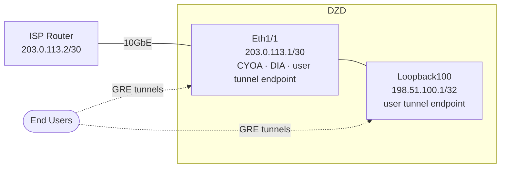
```mermaid
flowchart LR
    USERS(["End Users"])

    subgraph DZD["DZD"]
        E1["Eth1/1
        203.0.113.1/30
        CYOA · DIA · user tunnel endpoint"]
        LO["Loopback100
        198.51.100.1/32\n        user tunnel endpoint"]
        E1 --- LO
    end

    ISP["ISP Router
    203.0.113.2/30"]

    ISP -- "10GbE" --- E1
    USERS -. "GRE tunnels" .-> E1
    USERS -. "GRE tunnels" .-> LO
```

| Interface | `--interface-cyoa` | `--interface-dia` | `--ip-net` | `--bandwidth` | `--cir` | `--routing-mode` | `--user-tunnel-endpoint` |
|-----------|-------------------|------------------|------------|---------------|---------|-----------------|--------------------------|
| Ethernet1/1 | `gre-over-dia` | `dia` | IP/sous-réseau attribué par le contributeur | vitesse du port | débit garanti | `bgp` ou `static` | `true` |
| Loopback100 | — | — | votre /32 public | `0bps` | — | — | `true` |

Exemple de commandes à exécuter pour le Scénario A :
```bash
doublezero device interface create mydzd-nyc01 Ethernet1/1 \
  --interface-cyoa gre-over-dia \
  --interface-dia dia \
  --ip-net 203.0.113.1/30 \
  --bandwidth 10Gbps \
  --cir 1Gbps \
  --routing-mode bgp \
  --user-tunnel-endpoint true

doublezero device interface create mydzd-nyc01 Loopback100 \
  --ip-net 198.51.100.1/32 \
  --bandwidth 0bps \
  --user-tunnel-endpoint true
```

#### Scénario B : Port channel (LAG)

Le DZD se connecte à l'équipement amont via un port channel avec une IP. Le port channel porte une IP publique et est le point de terminaison CYOA. Loopback100 porte la seconde IP publique.

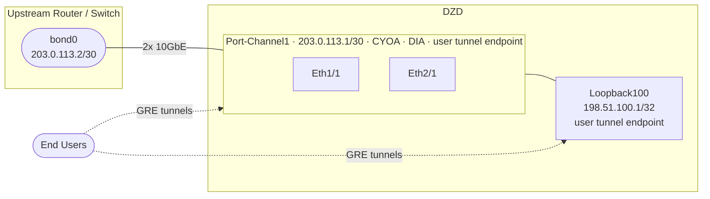
```mermaid
flowchart LR
    USERS(["End Users"])

    subgraph SW["Upstream Router / Switch"]
        SWPC(["bond0
        203.0.113.2/30"])
    end

    subgraph DZD["DZD"]
        subgraph PC["Port-Channel1 · 203.0.113.1/30 · CYOA · DIA · user tunnel endpoint"]
            E1["Eth1/1"]
            E2["Eth2/1"]
        end
        LO["Loopback100
        198.51.100.1/32\n        user tunnel endpoint"]
        PC --- LO
    end

    SWPC -- "2x 10GbE" --- PC
    USERS -. "GRE tunnels" .-> PC
    USERS -. "GRE tunnels" .-> LO
```

| Interface | `--interface-cyoa` | `--interface-dia` | `--ip-net` | `--bandwidth` | `--cir` | `--routing-mode` | `--user-tunnel-endpoint` |
|-----------|-------------------|------------------|------------|---------------|---------|-----------------|--------------------------|
| Port-Channel1 | `gre-over-dia` | `dia` | IP/sous-réseau attribué par le contributeur | vitesse LAG combinée | débit garanti | `bgp` ou `static` | `true` |
| Loopback100 | — | — | votre /32 public | `0bps` | — | — | `true` |

Exemple de commandes à exécuter pour le Scénario B :
```bash
doublezero device interface create mydzd-fra01 Port-Channel1 \
  --interface-cyoa gre-over-dia \
  --interface-dia dia \
  --ip-net 203.0.113.1/30 \
  --bandwidth 20Gbps \
  --cir 2Gbps \
  --routing-mode bgp \
  --user-tunnel-endpoint true

doublezero device interface create mydzd-fra01 Loopback100 \
  --ip-net 198.51.100.1/32 \
  --bandwidth 0bps \
  --user-tunnel-endpoint true
```


#### Scénario C : Double lien montant physique vers des routeurs séparés

Chaque interface physique se connecte à un routeur amont différent. Les deux IPs publiques résident sur Loopback100 et Loopback101, toutes deux enregistrées comme points de terminaison de tunnel utilisateur.

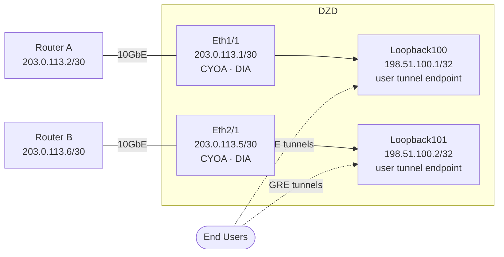
```mermaid
flowchart LR
    USERS(["End Users"])

    RA["Router A
    203.0.113.2/30"]
    RB["Router B
    203.0.113.6/30"]

    subgraph DZD["DZD"]
        E1["Eth1/1
        203.0.113.1/30
        CYOA · DIA"]
        E2["Eth2/1
        203.0.113.5/30
        CYOA · DIA"]
        LO0["Loopback100
        198.51.100.1/32\n        user tunnel endpoint"]
        LO1["Loopback101
        198.51.100.2/32\n        user tunnel endpoint"]
        E1 --> LO0
        E2 --> LO1
    end

    RA -- "10GbE" --- E1
    RB -- "10GbE" --- E2
    USERS -. "GRE tunnels" .-> LO0
    USERS -. "GRE tunnels" .-> LO1
```

| Interface | `--interface-cyoa` | `--interface-dia` | `--ip-net` | `--bandwidth` | `--cir` | `--routing-mode` | `--user-tunnel-endpoint` |
|-----------|-------------------|------------------|------------|---------------|---------|-----------------|--------------------------|
| Ethernet1/1 | `gre-over-dia` | `dia` | IP/sous-réseau attribué par le contributeur | vitesse du port | débit garanti | `bgp` ou `static` | — |
| Ethernet2/1 | `gre-over-dia` | `dia` | IP/sous-réseau attribué par le contributeur | vitesse du port | débit garanti | `bgp` ou `static` | — |
| Loopback100 | — | — | votre /32 public | `0bps` | — | — | `true` |
| Loopback101 | — | — | votre /32 public | `0bps` | — | — | `true` |

Exemple de commandes à exécuter pour le Scénario C :
```bash
doublezero device interface create mydzd-ams01 Ethernet1/1 \
  --interface-cyoa gre-over-dia \
  --interface-dia dia \
  --ip-net 203.0.113.1/30 \
  --bandwidth 10Gbps \
  --cir 1Gbps \
  --routing-mode bgp

doublezero device interface create mydzd-ams01 Ethernet2/1 \
  --interface-cyoa gre-over-dia \
  --interface-dia dia \
  --ip-net 203.0.113.5/30 \
  --bandwidth 10Gbps \
  --cir 1Gbps \
  --routing-mode bgp

doublezero device interface create mydzd-ams01 Loopback100 \
  --ip-net 198.51.100.1/32 \
  --bandwidth 0bps \
  --user-tunnel-endpoint true

doublezero device interface create mydzd-ams01 Loopback101 \
  --ip-net 198.51.100.2/32 \
  --bandwidth 0bps \
  --user-tunnel-endpoint true
```

### Étape 3.6 : Vérifier votre appareil

```bash
doublezero device list
```

**Exemple de sortie :**

```
 account                                      | code      | contributor | location | exchange | device_type | public_ip    | dz_prefixes     | users | max_users | status    | health  | mgmt_vrf | owner
 7xKm9pQw2R4vHt3...                          | nyc-dz001 | acme        | EQX-NY5  | nyc      | hybrid      | 203.0.113.10 | 198.51.100.0/28 | 0     | 14        | activated | pending |          | 5FMtd5Woq5XAAg54...
```

Votre appareil devrait apparaître avec le statut `activated`.

---

## Phase 4 : Établissement des liens et installation des agents {#phase-4-link-establishment-agent-installation}

Les liens connectent votre appareil au reste du réseau DoubleZero.

### Comprendre les liens

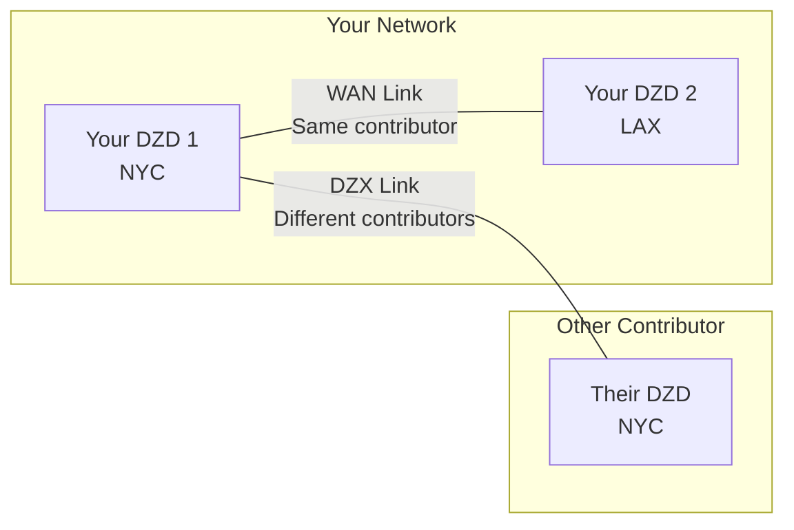
```mermaid
flowchart LR
    subgraph "Your Network"
        D1[Your DZD 1<br/>NYC]
        D2[Your DZD 2<br/>LAX]
    end

    subgraph "Other Contributor"
        O1[Their DZD<br/>NYC]
    end

    D1 ---|WAN Link<br/>Same contributor| D2
    D1 ---|DZX Link<br/>Different contributors| O1
```

| Type de lien | Connecte | Acceptation |
|--------------|----------|-------------|
| **Lien WAN** | Deux de VOS appareils | Automatique (vous possédez les deux) |
| **Lien DZX** | Votre appareil à celui d'un AUTRE contributeur | Nécessite leur acceptation |

### Étape 4.1 : Créer les liens WAN (si vous avez plusieurs appareils)

Les liens WAN connectent vos propres appareils :

```bash
doublezero link create wan \
  --code <LINK_CODE> \
  --contributor <YOUR_CONTRIBUTOR> \
  --side-a <DEVICE_1_CODE> \
  --side-a-interface <INTERFACE_ON_DEVICE_1> \
  --side-z <DEVICE_2_CODE> \
  --side-z-interface <INTERFACE_ON_DEVICE_2> \
  --bandwidth 10000 \
  --mtu 9000 \
  --delay-ms 20 \
  --jitter-ms 1
```

**Exemple :**

```bash
doublezero link create wan \
  --code nyc-lax-wan01 \
  --contributor acme \
  --side-a nyc-dz001 \
  --side-a-interface Ethernet3/1 \
  --side-z lax-dz001 \
  --side-z-interface Ethernet3/1 \
  --bandwidth 10000 \
  --mtu 9000 \
  --delay-ms 65 \
  --jitter-ms 1
```

**Sortie attendue :**

```
Signature: 5tNm7K...truncated...9pRw2
```

### Étape 4.2 : Créer les liens DZX

Les liens DZX connectent votre appareil directement au DZD d'un autre contributeur :

```bash
doublezero link create dzx \
  --code <DEVICE_CODE_A:DEVICE_CODE_Z> \
  --contributor <YOUR_CONTRIBUTOR> \
  --side-a <YOUR_DEVICE_CODE> \
  --side-a-interface <YOUR_INTERFACE> \
  --side-z <OTHER_DEVICE_CODE> \
  --bandwidth <BANDWIDTH in Kbps, Mbps, or Gbps> \
  --mtu <MTU> \
  --delay-ms <DELAY> \
  --jitter-ms <JITTER>
```

**Sortie attendue :**

```
Signature: 8mKp3W...truncated...2nRx7
```

Après avoir créé un lien DZX, l'autre contributeur doit l'accepter :

```bash
# L'AUTRE contributeur exécute cette commande
doublezero link accept \
  --code <LINK_CODE> \
  --side-z-interface <THEIR_INTERFACE>
```

**Sortie attendue (pour le contributeur acceptant) :**

```
Signature: 6vQt9L...truncated...3wPm4
```

### Étape 4.3 : Vérifier les liens

```bash
doublezero link list
```

**Exemple de sortie :**

```
 account                                      | code          | contributor | side_a_name | side_a_iface_name | side_z_name | side_z_iface_name | link_type | bandwidth | mtu  | delay_ms | jitter_ms | delay_override_ms | tunnel_id | tunnel_net      | status    | health  | owner
 8vkYpXaBW8RuknJq...                         | nyc-dz001:lax-dz001 | acme        | nyc-dz001   | Ethernet3/1       | lax-dz001   | Ethernet3/1       | WAN       | 10Gbps    | 9000 | 65.00ms  | 1.00ms    | 0.00ms            | 42        | 172.16.0.84/31  | activated | pending | 5FMtd5Woq5XAAg54...
```

Les liens devraient afficher le statut `activated` une fois les deux côtés configurés.

---

### Installation des agents

Deux agents logiciels s'exécutent sur votre DZD :

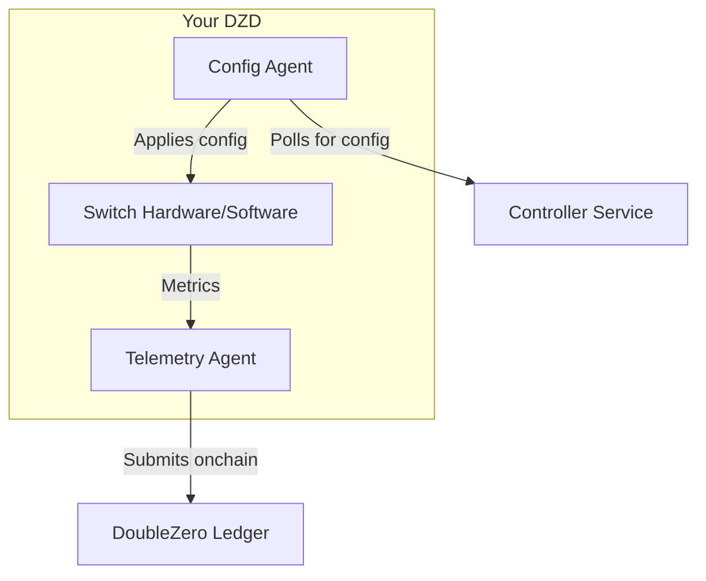
```mermaid
flowchart TB
    subgraph "Your DZD"
        CA[Config Agent]
        TA[Telemetry Agent]
        HW[Switch Hardware/Software]
    end

    CA -->|Polls for config| CTRL[Controller Service]
    CA -->|Applies config| HW

    HW -->|Metrics| TA
    TA -->|Submits onchain| BC[DoubleZero Ledger]
```

| Agent | Ce qu'il fait |
|-------|---------------|
| **Config Agent** | Récupère la configuration depuis le contrôleur et l'applique à votre switch |
| **Telemetry Agent** | Mesure la latence/perte vers les autres appareils, rapporte les métriques on-chain |

### Étape 4.4 : Installer le Config Agent {#step-44-install-config-agent}

#### Activer l'API sur votre switch

Ajoutez à la configuration EOS :

```
management api eos-sdk-rpc
    transport grpc eapilocal
        localhost loopback vrf default
        service all
        no disabled
```

!!! note "Note sur le VRF"
    Remplacez `default` par le nom de votre VRF de gestion s'il est différent (par ex., `management`).

#### Télécharger et installer l'agent

```bash
# Entrer en bash sur le switch
switch# bash
$ sudo bash
# cd /mnt/flash
# wget AGENT_DOWNLOAD_URL
# exit
$ exit

# Installer comme extension EOS
switch# copy flash:AGENT_FILENAME extension:
switch# extension AGENT_FILENAME
switch# copy installed-extensions boot-extensions
```

#### Vérifier l'extension

```bash
switch# show extensions
```

Le statut devrait être « A, I, B » :

```
Name                                        Version/Release     Status     Extension
------------------------------------------- ------------------- ---------- ---------
AGENT_FILENAME    MAINNET_CLIENT_VERSION/1             A, I, B    1

A: available | NA: not available | I: installed | F: forced | B: install at boot
```

#### Configurer et démarrer l'agent

Ajoutez à la configuration EOS :

```
daemon doublezero-agent
    exec /usr/local/bin/doublezero-agent -pubkey <YOUR_DEVICE_PUBKEY> -controller <controller_IP>:<controller_port>
    no shut
```

!!! info "IP et port du contrôleur"
    L'IP et le port du contrôleur se trouvent dans le dépôt des contributeurs auquel vous avez obtenu l'accès à l'Étape 2.5.

!!! note "Note sur le VRF"
    Si votre VRF de gestion n'est pas `default` (c'est-à-dire que le namespace n'est pas `ns-default`), préfixez la commande exec avec `exec /sbin/ip netns exec ns-<VRF>`. Par exemple, si votre VRF est `management` :
    ```
    daemon doublezero-agent
        exec /sbin/ip netns exec ns-management /usr/local/bin/doublezero-agent -pubkey <YOUR_DEVICE_PUBKEY>
        no shut
    ```

Obtenez la pubkey de votre appareil depuis `doublezero device list` (la colonne `account`).

#### Vérifier qu'il est en cours d'exécution

```bash
switch# show agent doublezero-agent logs
```

Vous devriez voir « Starting doublezero-agent » et des connexions réussies au contrôleur.

### Étape 4.5 : Installer le Telemetry Agent {#step-45-install-telemetry-agent}

#### Copier la clé metrics publisher sur votre appareil

```bash
scp ~/.config/doublezero/metrics-publisher.json <SWITCH_IP>:/mnt/flash/metrics-publisher-keypair.json
```

#### Enregistrer le metrics publisher on-chain

```bash
doublezero device update \
  --pubkey <DEVICE_ACCOUNT> \
  --metrics-publisher <METRICS_PUBLISHER_PUBKEY>
```

Obtenez la pubkey depuis votre fichier metrics-publisher.json.

#### Télécharger et installer l'agent

```bash
switch# bash
$ sudo bash
# cd /mnt/flash
# wget TELEMETRY_DOWNLOAD_URL
# exit
$ exit

# Installer comme extension EOS
switch# copy flash:TELEMETRY_FILENAME extension:
switch# extension TELEMETRY_FILENAME
switch# copy installed-extensions boot-extensions
```

#### Vérifier l'extension

```bash
switch# show extensions
```

Le statut devrait être « A, I, B » :

```
Name                                        Version/Release     Status     Extension
------------------------------------------- ------------------- ---------- ---------
TELEMETRY_FILENAME    MAINNET_CLIENT_VERSION/1             A, I, B    1

A: available | NA: not available | I: installed | F: forced | B: install at boot
```

#### Configurer et démarrer l'agent

Ajoutez à la configuration EOS :

```
daemon doublezero-telemetry
    exec /usr/local/bin/doublezero-telemetry --local-device-pubkey <DEVICE_ACCOUNT> --env mainnet --keypair /mnt/flash/metrics-publisher-keypair.json
    no shut
```

!!! note "Note sur le VRF"
    Si votre VRF de gestion n'est pas `default` (c'est-à-dire que le namespace n'est pas `ns-default`), ajoutez `--management-namespace ns-<VRF>` à la commande exec. Par exemple, si votre VRF est `management` :
    ```
    daemon doublezero-telemetry
        exec /usr/local/bin/doublezero-telemetry --management-namespace ns-management --local-device-pubkey <DEVICE_ACCOUNT> --env mainnet --keypair /mnt/flash/metrics-publisher-keypair.json
        no shut
    ```

#### Vérifier qu'il est en cours d'exécution

```bash
switch# show agent doublezero-telemetry logs
```

Vous devriez voir « Starting telemetry collector » et « Starting submission loop ».

---

## Phase 5 : Rodage des liens

!!! warning "Tous les nouveaux liens doivent être rodés avant de transporter du trafic"
    Les nouveaux liens doivent être **drainés pendant au moins 24 heures** avant d'être activés pour le trafic de production. Cette exigence de rodage est définie dans le [RFC12: Network Provisioning](https://github.com/malbeclabs/doublezero/blob/main/rfcs/rfc12-network-provisioning.md), qui spécifie environ 200 000 slots du DZ Ledger (~20 heures) de métriques propres avant qu'un lien soit prêt pour le service.

Avec les agents installés et en fonctionnement, surveillez vos liens sur [metrics.doublezero.xyz](https://metrics.doublezero.xyz) pendant au moins 24 heures consécutives :

- Tableau de bord **« DoubleZero Device-Link Latencies »** — vérifiez **zéro perte de paquets** sur le lien au fil du temps
- Tableau de bord **« DoubleZero Network Metrics »** — vérifiez **zéro erreur** sur vos liens

Ne retirez le drainage du lien qu'une fois que la période de rodage montre un lien propre avec zéro perte et zéro erreur.

---

## Phase 6 : Vérification et activation

Parcourez cette checklist pour confirmer que tout fonctionne.

!!! warning "Votre appareil démarre verrouillé (`max_users = 0`)"
    Lorsqu'un appareil est créé, `max_users` est défini à **0** par défaut. Cela signifie qu'aucun utilisateur ne peut encore s'y connecter. C'est intentionnel — vous devez vérifier que tout fonctionne avant d'accepter du trafic utilisateur.

    **Avant de définir `max_users` au-dessus de 0, vous devez :**

    1. Confirmer que tous les liens ont terminé leur **rodage de 24 heures** avec zéro perte/erreur sur [metrics.doublezero.xyz](https://metrics.doublezero.xyz)
    2. **Coordonner avec DZ/Malbec Labs** pour exécuter un test de connectivité :
        - Un utilisateur test peut-il se connecter à votre appareil ?
        - L'utilisateur reçoit-il les routes via le réseau DZ ?
        - L'utilisateur peut-il acheminer du trafic via le réseau DZ de bout en bout ?
    3. Seulement après confirmation des tests par DZ/ML, définir max_users à 96 :

    ```bash
    doublezero device update --pubkey <DEVICE_ACCOUNT> --max-users 96
    ```

### Vérifications de l'appareil

```bash
# Votre appareil devrait apparaître avec le statut "activated"
doublezero device list | grep <YOUR_DEVICE_CODE>
```

**Sortie attendue :**

```
 7xKm9pQw2R4vHt3... | nyc-dz001 | acme | EQX-NY5 | nyc | hybrid | 203.0.113.10 | 198.51.100.0/28 | 0 | 14 | activated | pending | | 5FMtd5Woq5XAAg54...
```

```bash
# Vos interfaces devraient être listées
doublezero device interface list | grep <YOUR_DEVICE_CODE>
```

**Sortie attendue :**

```
 nyc-dz001 | Loopback255 | loopback | vpnv4 | none | none | 0 | 0 | 1500 | static | 0 | 172.16.1.91/32  | 56 | false | activated
 nyc-dz001 | Loopback256 | loopback | ipv4  | none | none | 0 | 0 | 1500 | static | 0 | 172.16.1.100/32 | 0  | false | activated
 nyc-dz001 | Ethernet1/1 | physical | none  | none | none | 0 | 0 | 1500 | static | 0 |                 | 0  | false | activated
```

### Vérifications des liens

```bash
# Les liens devraient afficher le statut "activated"
doublezero link list | grep <YOUR_DEVICE_CODE>
```

**Sortie attendue :**

```
 8vkYpXaBW8RuknJq... | nyc-lax-wan01 | acme | nyc-dz001 | Ethernet3/1 | lax-dz001 | Ethernet3/1 | WAN | 10Gbps | 9000 | 65.00ms | 1.00ms | 0.00ms | 42 | 172.16.0.84/31 | activated | pending | 5FMtd5Woq5XAAg54...
```

### Vérifications des agents

Sur le switch :

```bash
# Le Config Agent devrait montrer des récupérations de configuration réussies
switch# show agent doublezero-agent logs | tail -20

# Le Telemetry Agent devrait montrer des soumissions réussies
switch# show agent doublezero-telemetry logs | tail -20
```

### Diagramme de vérification finale

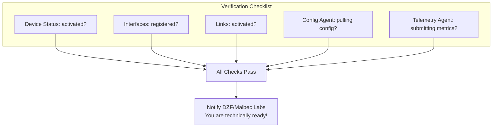
```mermaid
flowchart TB
    subgraph "Verification Checklist"
        D[Device Status: activated?]
        I[Interfaces: registered?]
        L[Links: activated?]
        CA[Config Agent: pulling config?]
        TA[Telemetry Agent: submitting metrics?]
    end

    D --> PASS
    I --> PASS
    L --> PASS
    CA --> PASS
    TA --> PASS

    PASS[All Checks Pass] --> NOTIFY[Notify DZF/Malbec Labs<br/>You are technically ready!]
```

---

## Dépannage

### La création de l'appareil échoue

- Vérifiez que votre clé de service est autorisée (`doublezero contributor list`)
- Vérifiez que les codes d'emplacement et d'échange sont valides
- Assurez-vous que le préfixe DZ est une plage IP publique valide

### Le lien reste bloqué au statut « requested »

- Les liens DZX nécessitent l'acceptation par l'autre contributeur
- Contactez-le pour exécuter `doublezero link accept`

### Le Config Agent ne se connecte pas

- Vérifiez que le réseau de gestion a accès à internet
- Vérifiez que la configuration VRF correspond à votre installation
- Assurez-vous que la pubkey de l'appareil est correcte

### Le Telemetry Agent ne soumet pas

- Vérifiez que la clé metrics publisher est enregistrée on-chain
- Vérifiez que le fichier de paire de clés existe sur le switch
- Assurez-vous que la pubkey du compte de l'appareil est correcte

---

## Prochaines étapes

- Consultez le [Guide des opérations](contribute-operations.md) pour les mises à jour des agents et la gestion des liens
- Consultez le [Glossaire](glossary.md) pour les définitions des termes
- Contactez la DZF/Malbec Labs si vous rencontrez des problèmes