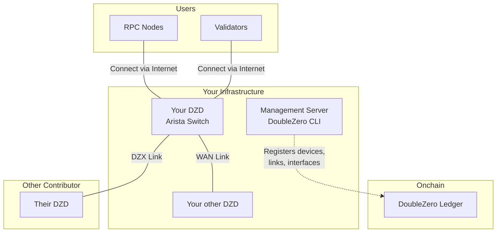
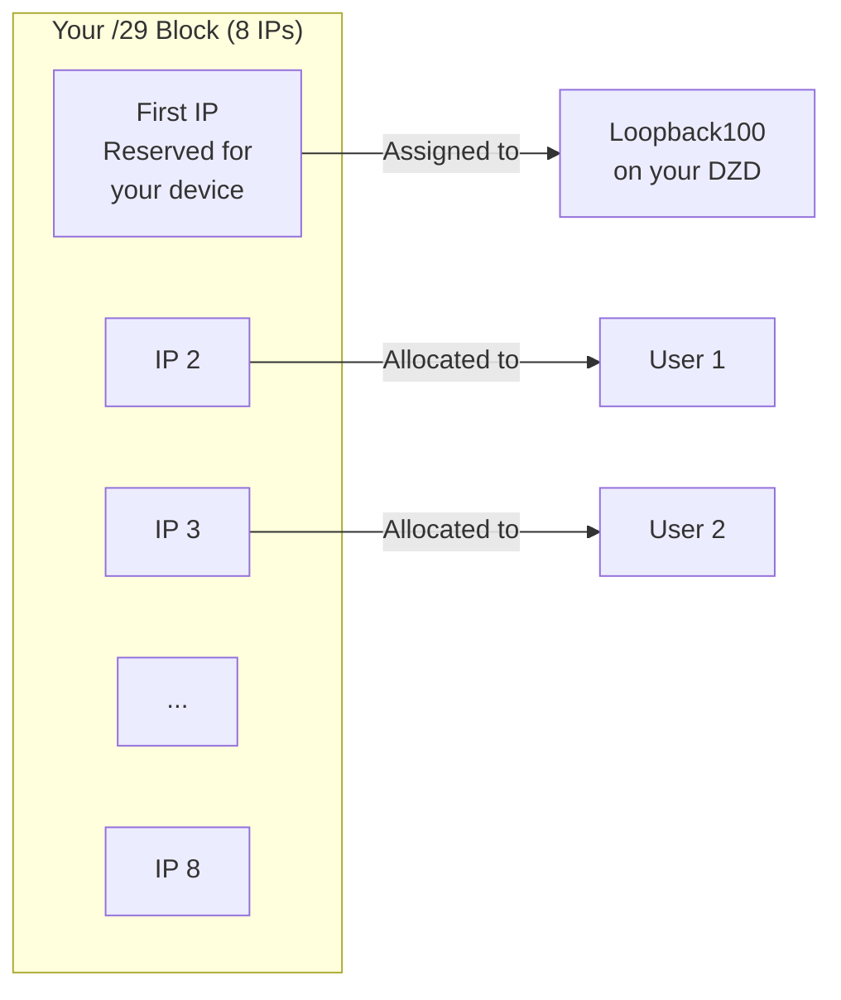
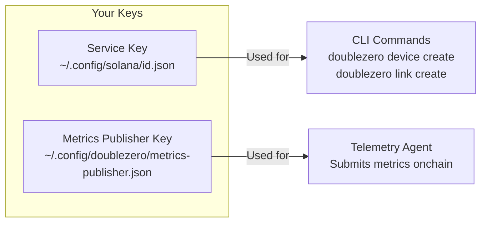
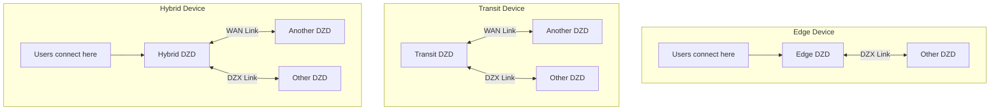
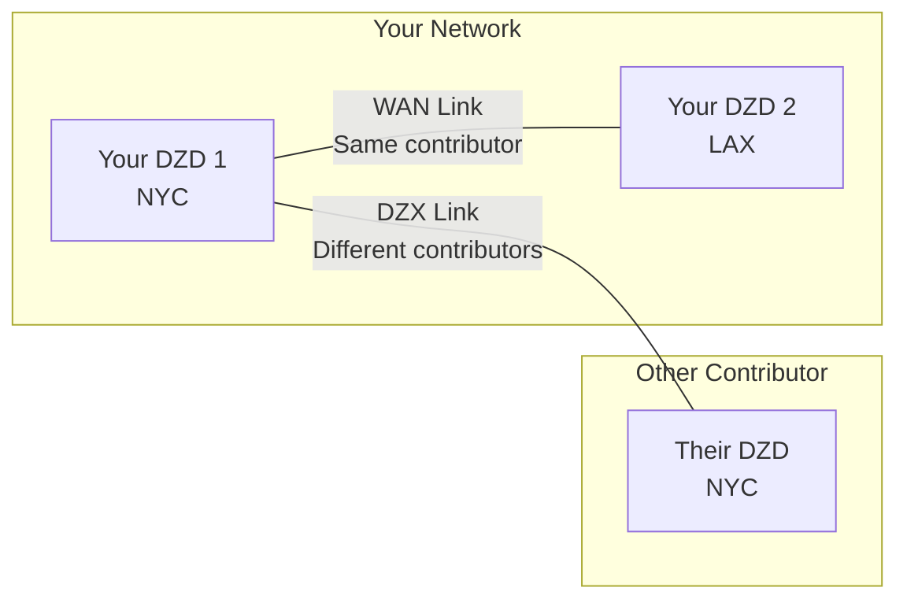
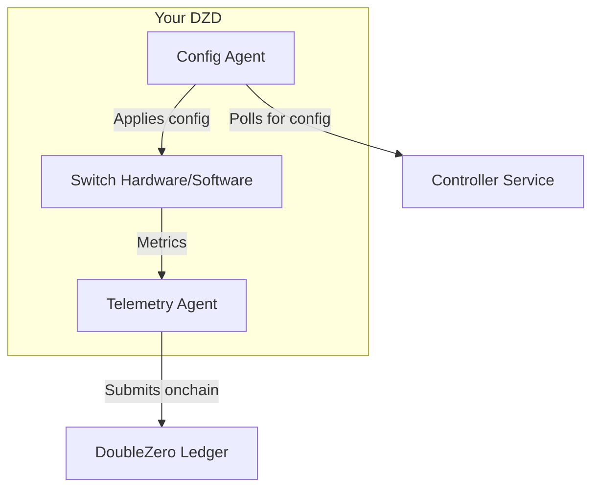
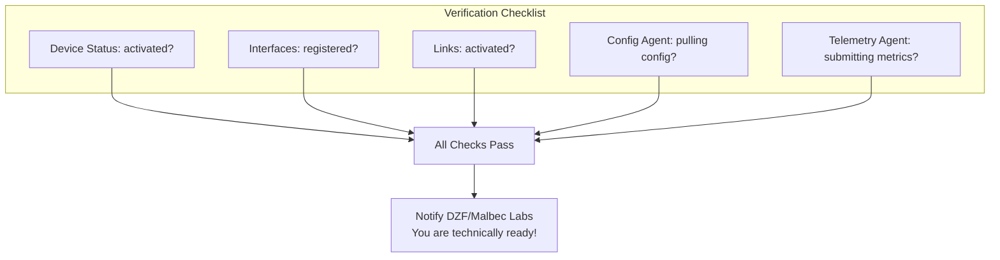

# Guida al Provisioning dei Dispositivi
!!! warning "This translation was generated using artificial intelligence and has not been reviewed by a human translator. It may contain inaccuracies or errors and should not be relied upon."


Questa guida illustra il provisioning di un DoubleZero Device (DZD) dall'inizio alla fine. Ogni fase corrisponde alla [Checklist di Onboarding](contribute-overview.md#onboarding-checklist).

---

## Come Si Incastra Tutto

Prima di entrare nei dettagli, ecco il quadro generale di ciò che stai costruendo:



---

## Fase 1: Prerequisiti

Prima di poter effettuare il provisioning di un dispositivo, è necessario che l'hardware fisico sia configurato e alcuni indirizzi IP allocati.

### Cosa Ti Serve

| Requisito | Perché È Necessario |
|-----------|---------------------|
| **Hardware DZD** | Switch Arista 7280CR3A (vedi [specifiche hardware](contribute.md#hardware-requirements)) |
| **Spazio Rack** | 4U con adeguato flusso d'aria |
| **Alimentazione** | Alimentazioni ridondanti, ~4KW raccomandato |
| **Accesso di Gestione** | Accesso SSH/console per configurare lo switch |
| **Connettività Internet** | Per la pubblicazione di metriche e per recuperare la configurazione dal controller |
| **Blocco IPv4 Pubblico** | Minimo /29 per il pool di prefissi DZ (vedi sotto) |

### Installa la CLI DoubleZero

La CLI DoubleZero (`doublezero`) viene utilizzata durante tutto il provisioning per registrare dispositivi, creare link e gestire il contributo. Deve essere installata su un **server di gestione o VM** — non sullo switch DZD stesso. Lo switch esegue solo il Config Agent e il Telemetry Agent (installati nella [Fase 4](#fase-4-stabilimento-del-link-e-installazione-degli-agent)).

**Ubuntu / Debian:**
```bash
curl -1sLf https://dl.cloudsmith.io/public/malbeclabs/doublezero/setup.deb.sh | sudo -E bash
sudo apt-get install doublezero
```

**Rocky Linux / RHEL:**
```bash
curl -1sLf https://dl.cloudsmith.io/public/malbeclabs/doublezero/setup.rpm.sh | sudo -E bash
sudo yum install doublezero
```

Verifica che il daemon sia in esecuzione:
```bash
sudo systemctl status doublezerod
```

### Comprendere il Tuo Prefisso DZ

Il tuo prefisso DZ è un blocco di indirizzi IP pubblici che il protocollo DoubleZero gestisce per l'allocazione degli IP.



**Come vengono usati i prefissi DZ:**

- **Primo IP**: Riservato per il tuo dispositivo (assegnato all'interfaccia Loopback100)
- **IP Rimanenti**: Allocati a specifici tipi di utenti che si connettono al tuo DZD:
    - Utenti `IBRLWithAllocatedIP`
    - Utenti `EdgeFiltering`
    - Publisher multicast
- **Utenti IBRL**: NON consumano da questo pool (usano il proprio IP pubblico)

!!! warning "Regole del Prefisso DZ"
    **NON PUOI usare questi indirizzi per:**

    - La tua infrastruttura di rete
    - Link point-to-point sulle interfacce DIA
    - Interfacce di gestione
    - Qualsiasi infrastruttura al di fuori del protocollo DZ

    **Requisiti:**

    - Devono essere indirizzi IPv4 **globalmente instradabili (pubblici)**
    - Gli intervalli IP privati (10.x, 172.16-31.x, 192.168.x) vengono rifiutati dallo smart contract
    - **Dimensione minima: /29** (8 indirizzi), prefissi più grandi preferiti (es. /28, /27)
    - L'intero blocco deve essere disponibile — non pre-allocare alcun indirizzo

    Se hai bisogno di indirizzi per la tua infrastruttura (IP di interfaccia DIA, gestione, ecc.), usa un **pool di indirizzi separato**.

---

## Fase 2: Configurazione dell'Account

In questa fase, crei le chiavi crittografiche che identificano te e i tuoi dispositivi sulla rete.

### Dove Eseguire la CLI

!!! warning "NON installare la CLI sul tuo switch"
    La CLI DoubleZero (`doublezero`) deve essere installata su un **server di gestione o VM**, non sullo switch Arista.

    ```mermaid
    flowchart LR
        subgraph "Management Server/VM"
            CLI[DoubleZero CLI]
            KEYS[Your Keypairs]
        end

        subgraph "Your DZD Switch"
            CA[Config Agent]
            TA[Telemetry Agent]
        end

        CLI -->|Creates devices, links| BC[Blockchain]
        CA -->|Pulls config| CTRL[Controller]
        TA -->|Submits metrics| BC
    ```

    | Installare sul Server di Gestione | Installare sullo Switch |
    |----------------------------------|------------------------|
    | CLI `doublezero` | Config Agent |
    | La tua service keypair | Telemetry Agent |
    | La tua metrics publisher keypair | Metrics publisher keypair (copia) |

### Cosa Sono le Chiavi?

Pensa alle chiavi come credenziali di accesso sicure:

- **Service Key**: La tua identità come contributore - usata per eseguire i comandi CLI
- **Metrics Publisher Key**: L'identità del tuo dispositivo per l'invio di dati di telemetria

Entrambe sono keypair crittografiche (una chiave pubblica che condividi, una chiave privata che mantieni segreta).



### Passo 2.1: Genera la Tua Service Key

Questa è la tua identità principale per interagire con DoubleZero.

```bash
doublezero keygen
```

Questo crea una keypair nella posizione predefinita. L'output mostra la tua **chiave pubblica** - questa è quella che condividerai con DZF.

### Passo 2.2: Genera la Tua Metrics Publisher Key

Questa chiave viene utilizzata dal Telemetry Agent per firmare le submission delle metriche.

```bash
doublezero keygen -o ~/.config/doublezero/metrics-publisher.json
```

### Passo 2.3: Invia le Chiavi a DZF

Contatta la DoubleZero Foundation o Malbec Labs e fornisci:

1. La tua **chiave pubblica della service key**
2. Il tuo **username GitHub** (per l'accesso al repository)

Loro provvederanno a:

- Creare il tuo **account contributore** on-chain
- Concedere l'accesso al **repository contributori** privato

### Passo 2.4: Verifica il Tuo Account

Una volta confermato, verifica che il tuo account contributore esista:

```bash
doublezero contributor list
```

Dovresti vedere il tuo codice contributore nell'elenco.

### Passo 2.5: Accedi al Repository Contributori

Il repository [malbeclabs/contributors](https://github.com/malbeclabs/contributors) contiene:

- Configurazioni base dei dispositivi
- Profili TCAM
- Configurazioni ACL
- Istruzioni di configurazione aggiuntive

Segui le istruzioni lì per la configurazione specifica del dispositivo.

---

## Fase 3: Provisioning del Dispositivo

Ora registrerai il tuo dispositivo fisico sulla blockchain e configurerai le sue interfacce.

### Comprendere i Tipi di Dispositivo



| Tipo | Cosa Fa | Quando Usarlo |
|------|---------|---------------|
| **Edge** | Accetta solo connessioni utente | Singola posizione, solo rivolto agli utenti |
| **Transit** | Sposta il traffico tra dispositivi | Connettività backbone, nessun utente |
| **Hybrid** | Connessioni utente E backbone | Il più comune - fa tutto |

### Passo 3.1: Trova la Tua Posizione e l'Exchange

Prima di creare il tuo dispositivo, cerca i codici per la posizione del tuo data center e l'exchange più vicino:

```bash
# List available locations (data centers)
doublezero location list

# List available exchanges (interconnect points)
doublezero exchange list
```

### Passo 3.2: Crea il Tuo Dispositivo On-Chain

Registra il tuo dispositivo sulla blockchain:

```bash
doublezero device create \
  --code <YOUR_DEVICE_CODE> \
  --contributor <YOUR_CONTRIBUTOR_CODE> \
  --device-type hybrid \
  --location <LOCATION_CODE> \
  --exchange <EXCHANGE_CODE> \
  --public-ip <DEVICE_PUBLIC_IP> \
  --dz-prefixes <YOUR_DZ_PREFIX>
```

**Esempio:**

```bash
doublezero device create \
  --code nyc-dz001 \
  --contributor acme \
  --device-type hybrid \
  --location EQX-NY5 \
  --exchange nyc \
  --public-ip "203.0.113.10" \
  --dz-prefixes "198.51.100.0/28"
```

**Output atteso:**

```
Signature: 4vKz8H...truncated...7xPq2
```

Verifica che il tuo dispositivo sia stato creato:

```bash
doublezero device list | grep nyc-dz001
```

**Parametri spiegati:**

| Parametro | Cosa Significa |
|-----------|----------------|
| `--code` | Un nome univoco per il tuo dispositivo (es. `nyc-dz001`) |
| `--contributor` | Il tuo codice contributore (fornito da DZF) |
| `--device-type` | `hybrid`, `transit`, o `edge` |
| `--location` | Codice del data center da `location list` |
| `--exchange` | Codice dell'exchange più vicino da `exchange list` |
| `--public-ip` | L'IP pubblico dove gli utenti si connettono al tuo dispositivo via internet |
| `--dz-prefixes` | Il tuo blocco IP allocato per gli utenti |

### Passo 3.3: Crea le Interfacce Loopback Richieste

Ogni dispositivo ha bisogno di due interfacce loopback per il routing interno:

```bash
# VPNv4 loopback
doublezero device interface create <DEVICE_CODE> Loopback255 --loopback-type vpnv4

# IPv4 loopback
doublezero device interface create <DEVICE_CODE> Loopback256 --loopback-type ipv4
```

**Output atteso (per ogni comando):**

```
Signature: 3mNx9K...truncated...8wRt5
```

### Passo 3.4: Crea Interfacce Fisiche

Registra le porte fisiche che utilizzerai:

```bash
# Basic interface
doublezero device interface create <DEVICE_CODE> Ethernet1/1
```

**Output atteso:**

```
Signature: 7pQw2R...truncated...4xKm9
```

### Passo 3.5: Crea l'Interfaccia CYOA (per dispositivi Edge/Hybrid)

Se il tuo dispositivo accetta connessioni utente, hai bisogno di un'interfaccia CYOA (Choose Your Own Adventure). Questo indica al sistema come gli utenti si connettono a te.

**Tipi CYOA Spiegati:**

| Tipo | In Italiano Semplice | Quando Usarlo |
|------|----------------------|---------------|
| `gre-over-dia` | Gli utenti si connettono tramite internet normale | Il più comune - gli utenti si connettono tramite il DIA al tuo DZD |
| `gre-over-private-peering` | Gli utenti si connettono tramite link privato | Gli utenti hanno una connessione diretta alla tua rete |
| `gre-over-public-peering` | Gli utenti si connettono tramite IX | Gli utenti fanno peering con te a un internet exchange |
| `gre-over-fabric` | Utenti sulla stessa rete locale | Utenti nello stesso data center |
| `gre-over-cable` | Cavo diretto all'utente | Singolo utente dedicato |

**Esempio - Utenti internet standard:**

```bash
doublezero device interface create <DEVICE_CODE> Ethernet1/2 \
  --interface-cyoa gre-over-dia \
  --interface-dia dia \
  --bandwidth 10000 \
  --cir 1000 \
  --user-tunnel-endpoint \
  --wait
```

**Output atteso:**

```
Signature: 2wLp8N...truncated...5vHt3
```

**Parametri spiegati:**

| Parametro | Cosa Significa |
|-----------|----------------|
| `--interface-cyoa` | Come si connettono gli utenti (vedi tabella sopra) |
| `--interface-dia` | `dia` se questa è una porta rivolta a internet |
| `--bandwidth` | Velocità della porta in Mbps (10000 = 10Gbps) |
| `--cir` | Velocità impegnata in Mbps (larghezza di banda garantita) |
| `--user-tunnel-endpoint` | Questa porta accetta tunnel utente |

### Passo 3.6: Verifica il Tuo Dispositivo

```bash
doublezero device list
```

**Output di esempio:**

```
 account                                      | code      | contributor | location | exchange | device_type | public_ip    | dz_prefixes     | users | max_users | status    | health  | mgmt_vrf | owner
 7xKm9pQw2R4vHt3...                          | nyc-dz001 | acme        | EQX-NY5  | nyc      | hybrid      | 203.0.113.10 | 198.51.100.0/28 | 0     | 14        | activated | pending |          | 5FMtd5Woq5XAAg54...
```

Il tuo dispositivo dovrebbe apparire con stato `activated`.

---

## Fase 4: Stabilimento del Link e Installazione degli Agent

I link connettono il tuo dispositivo al resto della rete DoubleZero.

### Comprendere i Link



| Tipo di Link | Connette | Accettazione |
|-------------|---------|--------------|
| **WAN Link** | Due dei TUOI dispositivi | Automatica (possiedi entrambi) |
| **DZX Link** | Il tuo dispositivo a quello di UN ALTRO contributore | Richiede la loro accettazione |

### Passo 4.1: Crea WAN Link (se hai più dispositivi)

I WAN link connettono i tuoi dispositivi:

```bash
doublezero link create wan \
  --code <LINK_CODE> \
  --contributor <YOUR_CONTRIBUTOR> \
  --side-a <DEVICE_1_CODE> \
  --side-a-interface <INTERFACE_ON_DEVICE_1> \
  --side-z <DEVICE_2_CODE> \
  --side-z-interface <INTERFACE_ON_DEVICE_2> \
  --bandwidth 10000 \
  --mtu 9000 \
  --delay-ms 20 \
  --jitter-ms 1
```

**Esempio:**

```bash
doublezero link create wan \
  --code nyc-lax-wan01 \
  --contributor acme \
  --side-a nyc-dz001 \
  --side-a-interface Ethernet3/1 \
  --side-z lax-dz001 \
  --side-z-interface Ethernet3/1 \
  --bandwidth 10000 \
  --mtu 9000 \
  --delay-ms 65 \
  --jitter-ms 1
```

**Output atteso:**

```
Signature: 5tNm7K...truncated...9pRw2
```

### Passo 4.2: Crea DZX Link

I DZX link connettono il tuo dispositivo direttamente al DZD di un altro contributore:

```bash
doublezero link create dzx \
  --code <DEVICE_CODE_A:DEVICE_CODE_Z> \
  --contributor <YOUR_CONTRIBUTOR> \
  --side-a <YOUR_DEVICE_CODE> \
  --side-a-interface <YOUR_INTERFACE> \
  --side-z <OTHER_DEVICE_CODE> \
  --bandwidth <BANDWIDTH in Kbps, Mbps, or Gbps> \
  --mtu <MTU> \
  --delay-ms <DELAY> \
  --jitter-ms <JITTER>
```

**Output atteso:**

```
Signature: 8mKp3W...truncated...2nRx7
```

Dopo aver creato un DZX link, l'altro contributore deve accettarlo:

```bash
# The OTHER contributor runs this
doublezero link accept \
  --code <LINK_CODE> \
  --side-z-interface <THEIR_INTERFACE>
```

**Output atteso (per il contributore che accetta):**

```
Signature: 6vQt9L...truncated...3wPm4
```

### Passo 4.3: Verifica i Link

```bash
doublezero link list
```

**Output di esempio:**

```
 account                                      | code          | contributor | side_a_name | side_a_iface_name | side_z_name | side_z_iface_name | link_type | bandwidth | mtu  | delay_ms | jitter_ms | delay_override_ms | tunnel_id | tunnel_net      | status    | health  | owner
 8vkYpXaBW8RuknJq...                         | nyc-dz001:lax-dz001 | acme        | nyc-dz001   | Ethernet3/1       | lax-dz001   | Ethernet3/1       | WAN       | 10Gbps    | 9000 | 65.00ms  | 1.00ms    | 0.00ms            | 42        | 172.16.0.84/31  | activated | pending | 5FMtd5Woq5XAAg54...
```

I link dovrebbero mostrare lo stato `activated` una volta che entrambi i lati sono configurati.

---

### Installazione degli Agent

Due software agent vengono eseguiti sul tuo DZD:



| Agent | Cosa Fa |
|-------|---------|
| **Config Agent** | Recupera la configurazione dal controller, la applica al tuo switch |
| **Telemetry Agent** | Misura latenza/perdita verso altri dispositivi, riporta le metriche on-chain |

### Passo 4.4: Installa il Config Agent

#### Abilita l'API sul tuo switch

Aggiungi alla configurazione EOS:

```
management api eos-sdk-rpc
    transport grpc eapilocal
        localhost loopback vrf default
        service all
        no disabled
```

!!! note "Nota VRF"
    Sostituisci `default` con il nome del tuo VRF di gestione se diverso (es. `management`).

#### Scarica e installa l'agent

```bash
# Enter bash on the switch
switch# bash
$ sudo bash
# cd /mnt/flash
# wget AGENT_DOWNLOAD_URL
# exit
$ exit

# Install as EOS extension
switch# copy flash:AGENT_FILENAME extension:
switch# extension AGENT_FILENAME
switch# copy installed-extensions boot-extensions
```

#### Verifica l'estensione

```bash
switch# show extensions
```

Lo stato dovrebbe essere "A, I, B":

```
Name                                        Version/Release     Status     Extension
------------------------------------------- ------------------- ---------- ---------
AGENT_FILENAME    MAINNET_CLIENT_VERSION/1             A, I, B    1

A: available | NA: not available | I: installed | F: forced | B: install at boot
```

#### Configura e avvia l'agent

Aggiungi alla configurazione EOS:

```
daemon doublezero-agent
    exec /usr/local/bin/doublezero-agent -pubkey <YOUR_DEVICE_PUBKEY>
    no shut
```

!!! note "Nota VRF"
    Se il tuo VRF di gestione non è `default` (cioè il namespace non è `ns-default`), anteponi al comando exec `exec /sbin/ip netns exec ns-<VRF>`. Ad esempio, se il tuo VRF è `management`:
    ```
    daemon doublezero-agent
        exec /sbin/ip netns exec ns-management /usr/local/bin/doublezero-agent -pubkey <YOUR_DEVICE_PUBKEY>
        no shut
    ```

Ottieni la pubkey del tuo dispositivo da `doublezero device list` (la colonna `account`).

#### Verifica che sia in esecuzione

```bash
switch# show agent doublezero-agent logs
```

Dovresti vedere "Starting doublezero-agent" e connessioni riuscite al controller.

### Passo 4.5: Installa il Telemetry Agent

#### Copia la metrics publisher key sul tuo dispositivo

```bash
scp ~/.config/doublezero/metrics-publisher.json <SWITCH_IP>:/mnt/flash/metrics-publisher-keypair.json
```

#### Registra il metrics publisher on-chain

```bash
doublezero device update \
  --pubkey <DEVICE_ACCOUNT> \
  --metrics-publisher <METRICS_PUBLISHER_PUBKEY>
```

Ottieni la pubkey dal tuo file metrics-publisher.json.

#### Scarica e installa l'agent

```bash
switch# bash
$ sudo bash
# cd /mnt/flash
# wget TELEMETRY_DOWNLOAD_URL
# exit
$ exit

# Install as EOS extension
switch# copy flash:TELEMETRY_FILENAME extension:
switch# extension TELEMETRY_FILENAME
switch# copy installed-extensions boot-extensions
```

#### Verifica l'estensione

```bash
switch# show extensions
```

Lo stato dovrebbe essere "A, I, B":

```
Name                                        Version/Release     Status     Extension
------------------------------------------- ------------------- ---------- ---------
TELEMETRY_FILENAME    MAINNET_CLIENT_VERSION/1             A, I, B    1

A: available | NA: not available | I: installed | F: forced | B: install at boot
```

#### Configura e avvia l'agent

Aggiungi alla configurazione EOS:

```
daemon doublezero-telemetry
    exec /usr/local/bin/doublezero-telemetry --local-device-pubkey <DEVICE_ACCOUNT> --env mainnet --keypair /mnt/flash/metrics-publisher-keypair.json
    no shut
```

!!! note "Nota VRF"
    Se il tuo VRF di gestione non è `default` (cioè il namespace non è `ns-default`), aggiungi `--management-namespace ns-<VRF>` al comando exec. Ad esempio, se il tuo VRF è `management`:
    ```
    daemon doublezero-telemetry
        exec /usr/local/bin/doublezero-telemetry --management-namespace ns-management --local-device-pubkey <DEVICE_ACCOUNT> --env mainnet --keypair /mnt/flash/metrics-publisher-keypair.json
        no shut
    ```

#### Verifica che sia in esecuzione

```bash
switch# show agent doublezero-telemetry logs
```

Dovresti vedere "Starting telemetry collector" e "Starting submission loop".

---

## Fase 5: Burn-in del Link

!!! warning "Tutti i nuovi link devono completare il burn-in prima di trasportare traffico"
    I nuovi link devono essere **drenati per almeno 24 ore** prima di essere attivati per il traffico di produzione. Questo requisito di burn-in è definito in [RFC12: Network Provisioning](https://github.com/malbeclabs/doublezero/blob/main/rfcs/rfc12-network-provisioning.md), che specifica ~200.000 slot del DZ Ledger (~20 ore) di metriche pulite prima che un link sia pronto per il servizio.

Con gli agent installati e in esecuzione, monitora i tuoi link su [metrics.doublezero.xyz](https://metrics.doublezero.xyz) per almeno 24 ore consecutive:

- Dashboard **"DoubleZero Device-Link Latencies"** — verifica **zero perdita di pacchetti** sul link nel tempo
- Dashboard **"DoubleZero Network Metrics"** — verifica **zero errori** sui tuoi link

Sblocca il link solo quando il periodo di burn-in mostra un link pulito con zero perdite e zero errori.

---

## Fase 6: Verifica e Attivazione

Esegui questa checklist per confermare che tutto funzioni.

!!! warning "Il tuo dispositivo inizia bloccato (`max_users = 0`)"
    Quando viene creato un dispositivo, `max_users` è impostato a **0** per impostazione predefinita. Ciò significa che nessun utente può ancora connettersi ad esso. Questo è intenzionale — devi verificare che tutto funzioni prima di accettare traffico utente.

    **Prima di impostare `max_users` sopra 0, devi:**

    1. Confermare che tutti i link abbiano completato il **burn-in di 24 ore** con zero perdite/errori su [metrics.doublezero.xyz](https://metrics.doublezero.xyz)
    2. **Coordinarsi con DZ/Malbec Labs** per eseguire un test di connettività:
        - Un utente di test può connettersi al tuo dispositivo?
        - L'utente riceve route tramite la rete DZ?
        - L'utente può instradare il traffico tramite la rete DZ end-to-end?
    3. Solo dopo che DZ/ML conferma che i test sono passati, imposta max_users a 96:

    ```bash
    doublezero device update --pubkey <DEVICE_ACCOUNT> --max-users 96
    ```

### Controlli del Dispositivo

```bash
# Your device should appear with status "activated"
doublezero device list | grep <YOUR_DEVICE_CODE>
```

**Output atteso:**

```
 7xKm9pQw2R4vHt3... | nyc-dz001 | acme | EQX-NY5 | nyc | hybrid | 203.0.113.10 | 198.51.100.0/28 | 0 | 14 | activated | pending | | 5FMtd5Woq5XAAg54...
```

```bash
# Your interfaces should be listed
doublezero device interface list | grep <YOUR_DEVICE_CODE>
```

**Output atteso:**

```
 nyc-dz001 | Loopback255 | loopback | vpnv4 | none | none | 0 | 0 | 1500 | static | 0 | 172.16.1.91/32  | 56 | false | activated
 nyc-dz001 | Loopback256 | loopback | ipv4  | none | none | 0 | 0 | 1500 | static | 0 | 172.16.1.100/32 | 0  | false | activated
 nyc-dz001 | Ethernet1/1 | physical | none  | none | none | 0 | 0 | 1500 | static | 0 |                 | 0  | false | activated
```

### Controlli dei Link

```bash
# Links should show status "activated"
doublezero link list | grep <YOUR_DEVICE_CODE>
```

**Output atteso:**

```
 8vkYpXaBW8RuknJq... | nyc-lax-wan01 | acme | nyc-dz001 | Ethernet3/1 | lax-dz001 | Ethernet3/1 | WAN | 10Gbps | 9000 | 65.00ms | 1.00ms | 0.00ms | 42 | 172.16.0.84/31 | activated | pending | 5FMtd5Woq5XAAg54...
```

### Controlli degli Agent

Sullo switch:

```bash
# Config agent should show successful config pulls
switch# show agent doublezero-agent logs | tail -20

# Telemetry agent should show successful submissions
switch# show agent doublezero-telemetry logs | tail -20
```

### Diagramma di Verifica Finale



---

## Risoluzione dei Problemi

### Creazione del dispositivo fallisce

- Verifica che la tua service key sia autorizzata (`doublezero contributor list`)
- Controlla che i codici di posizione e exchange siano validi
- Assicurati che il prefisso DZ sia un intervallo IP pubblico valido

### Link bloccato nello stato "requested"

- I DZX link richiedono l'accettazione dall'altro contributore
- Contattali per eseguire `doublezero link accept`

### Config Agent non si connette

- Verifica che la rete di gestione abbia accesso a internet
- Controlla che la configurazione VRF corrisponda alla tua configurazione
- Assicurati che la pubkey del dispositivo sia corretta

### Telemetry Agent non invia

- Verifica che la metrics publisher key sia registrata on-chain
- Controlla che il file keypair esista sullo switch
- Assicurati che la pubkey dell'account del dispositivo sia corretta

---

## Prossimi Passi

- Consulta la [Guida Operativa](contribute-operations.md) per gli aggiornamenti degli agent e la gestione dei link
- Consulta il [Glossario](glossary.md) per le definizioni dei termini
- Contatta DZF/Malbec Labs se riscontri problemi
