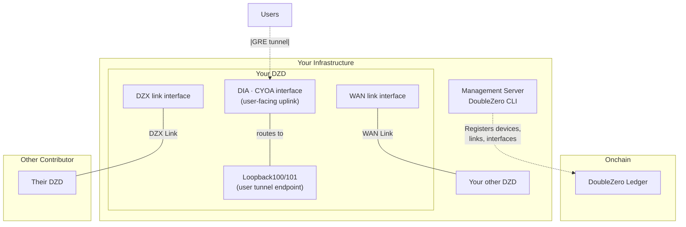
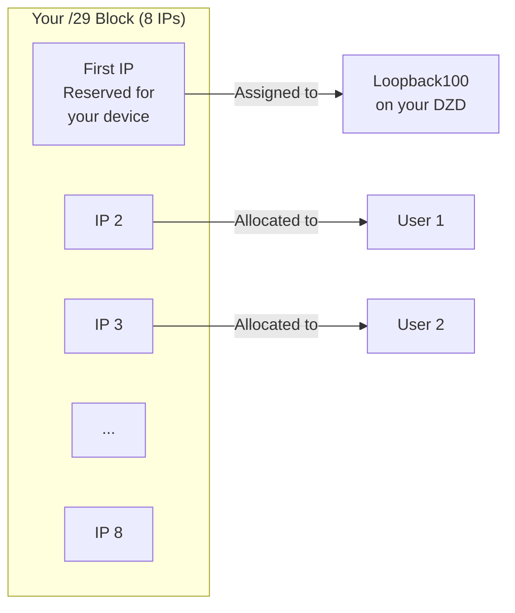
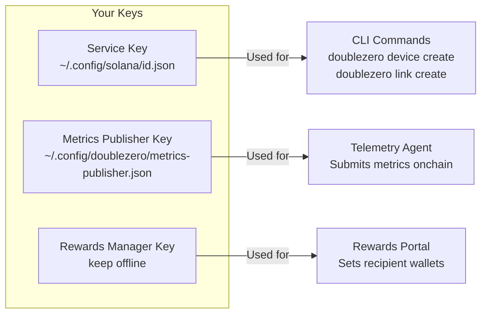
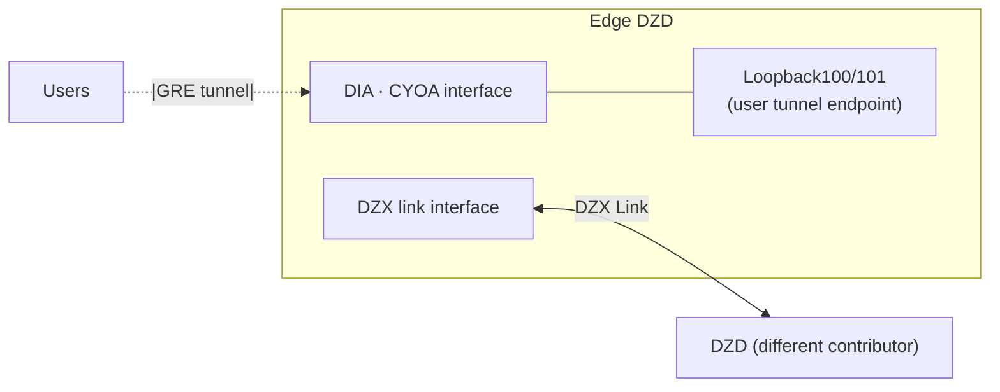
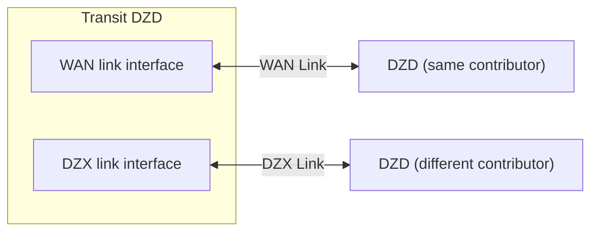
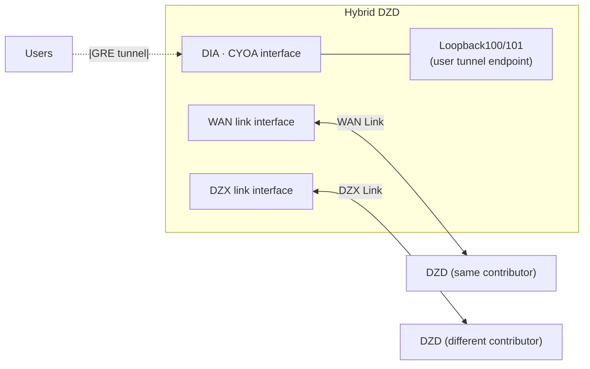
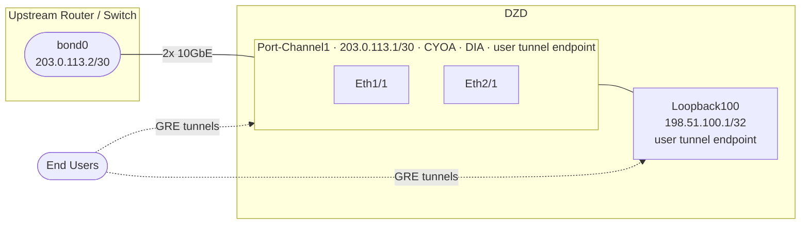
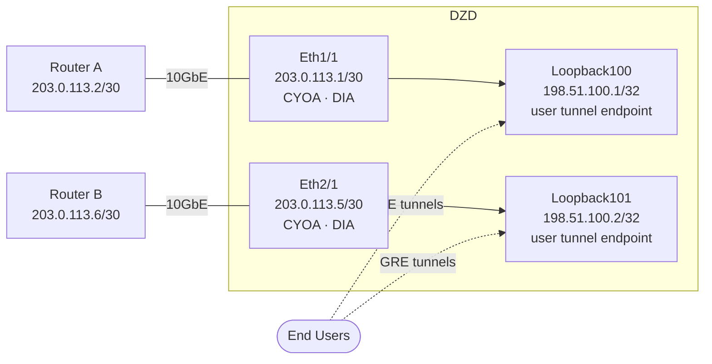

# Guida al Provisioning del Dispositivo

Questa guida ti accompagna nel provisioning di un DoubleZero Device (DZD) dall'inizio alla fine. Ogni fase corrisponde alla [Checklist di Onboarding](contribute-overview.md#onboarding-checklist).

---

## Come si Collega il Tutto

Questa guida ti accompagna nella registrazione della tua infrastruttura on-chain in modo che la rete DoubleZero possa instradare il traffico attraverso di essa. Più la registrazione del tuo dispositivo è completa, più sarà utile alla rete. Una rappresentazione on-chain completa del tuo dispositivo consente un migliore troubleshooting, pianificazione della capacità, e permette al controller di prendere decisioni informate. Nel tempo, l'obiettivo è che il controller assuma sempre più responsabilità nella configurazione.

### Concetti chiave

**Interfacce**

Le interfacce su un DZD si presentano in diverse forme: porte Ethernet, port channel (LAG composti da più porte Ethernet) e loopback. Ogni interfaccia che svolge un ruolo nella rete deve essere registrata on-chain con i flag appropriati affinché il protocollo sappia cosa fa.

Le porte Ethernet e i port channel possono svolgere i seguenti ruoli:

| Flag | Cosa significa |
|------|---------------|
| `--interface-dia dia` | Contrassegna l'interfaccia come uplink di accesso diretto a internet |
| `--interface-cyoa <subtype>` | Dichiara come gli utenti stabiliscono tunnel GRE attraverso questa interfaccia (es. tramite internet pubblico, tramite un link di peering privato) |
| `--user-tunnel-endpoint true` | Questa interfaccia ha un IP pubblico su cui gli utenti terminano i tunnel GRE |

Le interfacce utilizzate per link WAN o DZX non hanno un flag specifico, vengono registrate con la loro larghezza di banda e poi referenziate quando il link viene creato.

Le interfacce loopback servono a diversi scopi:

| Loopback | Cosa significa |
|----------|---------------|
| **Loopback100 / 101** | Hanno IP pubblici su cui gli utenti terminano i tunnel GRE. Registrate con `--user-tunnel-endpoint true`. |
| **Loopback255** (`vpnv4`) | Registrata affinché il controller possa assegnare un IP utilizzato per BGP router ID, peering VPN-IPv4 (unicast), identità IS-IS e segment routing |
| **Loopback256** (`ipv4`) | Registrata affinché il controller possa assegnare un IP utilizzato per peering BGP IPv4 (multicast) e sessioni MSDP |

**Link**

I link sono registrati separatamente dalle interfacce, e le interfacce devono esistere on-chain prima che un link possa referenziarle. Quando crei un link WAN o DZX, specifichi un'interfaccia già registrata come endpoint fisico del link. Non tutte le interfacce sono collegate a un link: le interfacce DIA, CYOA e loopback non sono connesse a un link.

| Termine | Cosa significa |
|---------|---------------|
| **WAN Link** | Un link tra due dei tuoi DZD |
| **DZX Link** | Un link tra il tuo DZD e il DZD di un altro contributore |

### Panoramica dell'architettura


```mermaid
flowchart TB
    subgraph Onchain
        SC[DoubleZero Ledger]
    end

    subgraph Your Infrastructure
        MGMT[Management Server<br/>DoubleZero CLI]
        subgraph DZD[Your DZD]
            CYOA["DIA · CYOA interface<br/>(user-facing uplink)"]
            WAN_INTF["WAN link interface"]
            DZX_INTF["DZX link interface"]
            LO100["Loopback100/101<br/>(user tunnel endpoint)"]
        end
        DZD2[Your other DZD]
    end

    subgraph Other Contributor
        OtherDZD[Their DZD]
    end

    USERS["Users"]

    MGMT -.->|Registers devices,<br/>links, interfaces| SC
    WAN_INTF ---|WAN Link| DZD2
    DZX_INTF ---|DZX Link| OtherDZD
    USERS -.|GRE tunnel|.-> CYOA
    CYOA ---|routes to| LO100
```

---

## Fase 1: Prerequisiti

Prima di poter effettuare il provisioning di un dispositivo, è necessario che l'hardware fisico sia configurato e che alcuni indirizzi IP siano allocati.

### Cosa Ti Serve

| Requisito | Perché È Necessario |
|-----------|---------------------|
| **Hardware DZD** | Switch Arista 7280CR3A (vedi [specifiche hardware](contribute.md#hardware-requirements)) |
| **Spazio Rack** | 2U riservati per DZD (1U in uso oggi), con flusso d'aria adeguato. Vedi [Rack e Alimentazione](contribute.md#rack-power-requirements) |
| **Alimentazione** | Due linee indipendenti, ciascuna in grado di sostenere l'intero carico da sola. Vedi [Rack e Alimentazione](contribute.md#rack-power-requirements) |
| **Accesso di Gestione** | Accesso SSH/console per configurare lo switch |
| **Connettività Internet** | Per la pubblicazione delle metriche e per recuperare la configurazione dal controller |
| **Blocco IPv4 Pubblico** | Minimo /29 per il pool di prefissi DZ (vedi sotto) |

### Installare la CLI DoubleZero

La CLI DoubleZero (`doublezero`) viene utilizzata durante tutto il provisioning per registrare dispositivi, creare link e gestire il tuo contributo. Deve essere installata su un **server di gestione o VM** — non sullo switch DZD stesso. Lo switch esegue solo il Config Agent e il Telemetry Agent (installati nella [Fase 4](#fase-4-creazione-dei-link-e-installazione-degli-agenti)).

**Ubuntu / Debian:**
```bash
curl -1sLf https://dl.cloudsmith.io/public/malbeclabs/doublezero/setup.deb.sh | sudo -E bash
sudo apt-get install doublezero
```

**Rocky Linux / RHEL:**
```bash
curl -1sLf https://dl.cloudsmith.io/public/malbeclabs/doublezero/setup.rpm.sh | sudo -E bash
sudo yum install doublezero
```

Verifica che il daemon sia in esecuzione:
```bash
sudo systemctl status doublezerod
```

### Comprendere il Tuo Prefisso DZ

Il tuo prefisso DZ è un blocco di indirizzi IP pubblici che il protocollo DoubleZero gestisce per l'allocazione IP.


```mermaid
flowchart LR
    subgraph "Your /29 Block (8 IPs)"
        IP1["First IP<br/>Reserved for<br/>your device"]
        IP2["IP 2"]
        IP3["IP 3"]
        IP4["..."]
        IP8["IP 8"]
    end

    IP1 -->|Assigned to| LO[Loopback100<br/>on your DZD]
    IP2 -->|Allocated to| U1[User 1]
    IP3 -->|Allocated to| U2[User 2]
```

**Come vengono utilizzati i prefissi DZ:**

- **Primo IP**: Riservato per il tuo dispositivo (assegnato all'interfaccia Loopback100)
- **IP rimanenti**: Allocati a tipi specifici di utenti che si connettono al tuo DZD:
    - Utenti `IBRLWithAllocatedIP`
    - Utenti `EdgeFiltering` (caso d'uso futuro)
- **Utenti IBRL**: NON consumano da questo pool (utilizzano il proprio IP pubblico)

!!! warning "Regole sui Prefissi DZ"
    **NON PUOI utilizzare questi indirizzi per:**

    - Le tue apparecchiature di rete
    - Link punto-punto sulle interfacce DIA
    - Interfacce di gestione
    - Qualsiasi infrastruttura al di fuori del protocollo DZ

    **Requisiti:**

    - Devono essere indirizzi IPv4 **globalmente instradabili (pubblici)**
    - Gli intervalli IP privati (10.x, 172.16-31.x, 192.168.x) vengono rifiutati dallo smart contract
    - **Dimensione minima: /29** (8 indirizzi), prefissi più grandi sono preferiti (es. /28, /27)
    - L'intero blocco deve essere disponibile — non pre-allocare alcun indirizzo

    Se hai bisogno di indirizzi per le tue apparecchiature (IP per interfacce DIA, gestione, ecc.), utilizza un **pool di indirizzi separato**.

---

## Fase 2: Configurazione dell'Account

In questa fase, crei le chiavi crittografiche che ti identificano, insieme ai tuoi dispositivi, sulla rete, e configuri la gestione dei premi.

I passaggi vengono eseguiti in questo ordine per un motivo: prima l'accesso al repository, perché il repository contiene le istruzioni per i passaggi successivi, poi le tue chiavi, poi i premi. Alcuni passaggi richiedono un intervento di DZF prima che tu possa continuare, e ciascuno di quelli sotto lo specifica.

### Dove Eseguire la CLI

!!! warning "NON installare la CLI sul tuo switch"
    La CLI DoubleZero (`doublezero`) deve essere installata su un **server di gestione o VM**, non sul tuo switch Arista.

    ```mermaid
    flowchart LR
        subgraph "Management Server/VM"
            CLI[DoubleZero CLI]
            KEYS[Your Keypairs]
        end

        subgraph "Your DZD Switch"
            CA[Config Agent]
            TA[Telemetry Agent]
        end

        CLI -->|Creates devices, links| BC[Blockchain]
        CA -->|Pulls config| CTRL[Controller]
        TA -->|Submits metrics| BC
    ```

    | Installare sul Server di Gestione | Installare sullo Switch |
    |-----------------------------------|------------------------|
    | CLI `doublezero` | Config Agent |
    | La tua keypair di servizio | Telemetry Agent |
    | La tua keypair del metrics publisher | Keypair del metrics publisher (copia) |

### Cosa Sono le Chiavi?

Pensa alle chiavi come credenziali di accesso sicure:

- **Service Key**: La tua identità come contributore — utilizzata per eseguire comandi CLI
- **Metrics Publisher Key**: L'identità del tuo dispositivo per l'invio di dati telemetrici
- **Rewards Manager Key**: Controlla quali wallet ricevono i tuoi premi — vedi [Gestione Premi](https://github.com/malbeclabs/contributors#rewards-management) nel repository dei contributori

Tutte e tre sono coppie di chiavi crittografiche (una chiave pubblica che condividi, una chiave privata che mantieni segreta).


```mermaid
flowchart LR
    subgraph "Your Keys"
        SK[Service Key<br/>~/.config/solana/id.json]
        MK[Metrics Publisher Key<br/>~/.config/doublezero/metrics-publisher.json]
        RK[Rewards Manager Key<br/>keep offline]
    end

    SK -->|Used for| CLI[CLI Commands<br/>doublezero device create<br/>doublezero link create]
    MK -->|Used for| TEL[Telemetry Agent<br/>Submits metrics onchain]
    RK -->|Used for| REW[Rewards Portal<br/>Sets recipient wallets]
```

!!! note "Mantieni la chiave del rewards manager separata"
    La service key e la metrics publisher key risiedono sul tuo server di gestione e sullo switch. La rewards manager key controlla dove vanno i tuoi soldi, quindi tienila lontano da quelle macchine. È necessaria solo quando modifichi i tuoi wallet destinatari.

### Passo 2.1: Richiedere l'Accesso al Repository dei Contributori

Contatta la DoubleZero Foundation o Malbec Labs e fornisci il tuo **nome utente GitHub**.

Ti concederanno l'accesso al repository privato [malbeclabs/contributors](https://github.com/malbeclabs/contributors). Fai questo per primo: il repository contiene la configurazione base del dispositivo, i profili TCAM e ACL, e le istruzioni per la gestione dei premi di cui hai bisogno nei passaggi successivi.

### Passo 2.2: Generare la Tua Service Key

Questa è la tua identità principale per interagire con DoubleZero.

```bash
doublezero keygen
```

Questo crea una coppia di chiavi nella posizione predefinita. L'output mostra la tua **chiave pubblica** — questa è ciò che condividerai con DZF.

### Passo 2.3: Generare la Tua Metrics Publisher Key

Questa chiave viene utilizzata dal Telemetry Agent per firmare l'invio delle metriche.

```bash
doublezero keygen -o ~/.config/doublezero/metrics-publisher.json
```

### Passo 2.4: Inviare la Tua Service Key a DZF

Invia a DZF la **chiave pubblica della tua service key**.

Creeranno il tuo **account contributore** on-chain e confermeranno quando sarà completato.

!!! danger "Solo chiavi pubbliche"
    Non inviare mai una chiave privata o un file di coppia di chiavi a nessuno, incluso DZF. Solo la chiave pubblica è necessaria.

### Passo 2.5: Verificare il Tuo Account

Una volta confermato, verifica che il tuo account contributore esista:

```bash
doublezero contributor list
```

Dovresti vedere il tuo codice contributore nell'elenco.

### Passo 2.6: Configurare la Gestione dei Premi

La gestione dei premi decide quali wallet ricevono i [2Z](glossary.md#2z-token) guadagnati dal tuo contributo, e in quali proporzioni.

Segui la [Gestione Premi](https://github.com/malbeclabs/contributors#rewards-management) nel repository dei contributori, a cui ora hai accesso dal Passo 2.1.

!!! note "Questo non blocca il resto della tua configurazione"
    Puoi effettuare il provisioning del tuo dispositivo, creare link e iniziare a trasportare traffico senza che questo sia in atto, quindi considera le fasi successive come indipendenti da esso.

---

## Fase 3: Provisioning del Dispositivo

Ora registrerai il tuo dispositivo fisico sulla blockchain e configurerai le sue interfacce.

### Comprendere i Tipi di Dispositivo

**Edge** — accetta solo connessioni utente


```mermaid
flowchart LR
    subgraph EDZD[Edge DZD]
        E_CYOA["DIA · CYOA interface"]
        E_TUN["Loopback100/101
        (user tunnel endpoint)"]
        E_DZX["DZX link interface"]
        E_CYOA --- E_TUN
    end
    EU["Users"] -.|GRE tunnel|.-> E_CYOA
    E_DZX <-->|DZX Link| ED["DZD (different contributor)"]
```

**Transit** — trasporta traffico tra dispositivi, nessuna connessione utente


```mermaid
flowchart LR
    subgraph TDZD[Transit DZD]
        T_WAN["WAN link interface"]
        T_DZX["DZX link interface"]
    end
    T_WAN <-->|WAN Link| T2["DZD (same contributor)"]
    T_DZX <-->|DZX Link| TD["DZD (different contributor)"]
```

**Hybrid** — connessioni utente e backbone, il più comune


```mermaid
flowchart LR
    subgraph HDZD[Hybrid DZD]
        H_CYOA["DIA · CYOA interface"]
        H_TUN["Loopback100/101
        (user tunnel endpoint)"]
        H_WAN["WAN link interface"]
        H_DZX["DZX link interface"]
        H_CYOA --- H_TUN
    end
    HU["Users"] -.|GRE tunnel|.-> H_CYOA
    H_WAN <-->|WAN Link| H2["DZD (same contributor)"]
    H_DZX <-->|DZX Link| HD["DZD (different contributor)"]
```

| Tipo | Cosa Fa | Quando Usarlo |
|------|---------|---------------|
| **Edge** | Accetta solo connessioni utente | Singola posizione, solo rivolto agli utenti |
| **Transit** | Trasporta traffico tra dispositivi | Connettività backbone, nessun utente |
| **Hybrid** | Sia connessioni utente CHE backbone | Il più comune — fa tutto |

### Passo 3.1: Trovare la Tua Posizione e il Tuo Exchange

Prima di creare il tuo dispositivo, cerca i codici per la posizione del tuo data center e l'exchange più vicino:

```bash
# Elenco delle posizioni disponibili (data center)
doublezero location list

# Elenco degli exchange disponibili (punti di interconnessione)
doublezero exchange list
```

### Passo 3.2: Creare il Tuo Dispositivo On-chain

Registra il tuo dispositivo sulla blockchain:

```bash
doublezero device create \
  --code <YOUR_DEVICE_CODE> \
  --contributor <YOUR_CONTRIBUTOR_CODE> \
  --device-type hybrid \
  --location <LOCATION_CODE> \
  --exchange <EXCHANGE_CODE> \
  --public-ip <DEVICE_PUBLIC_IP> \
  --dz-prefixes <YOUR_DZ_PREFIX>
```

**Esempio:**

```bash
doublezero device create \
  --code nyc-dz001 \
  --contributor acme \
  --device-type hybrid \
  --location EQX-NY5 \
  --exchange nyc \
  --public-ip "203.0.113.10" \
  --dz-prefixes "198.51.100.0/28"
```

**Output atteso:**

```
Signature: 4vKz8H...truncated...7xPq2
```

Verifica che il tuo dispositivo sia stato creato:

```bash
doublezero device list | grep nyc-dz001
```

**Spiegazione dei parametri:**

| Parametro | Cosa Significa |
|-----------|----------------|
| `--code` | Un nome univoco per il tuo dispositivo (es. `nyc-dz001`) |
| `--contributor` | Il tuo codice contributore (fornito da DZF) |
| `--device-type` | `hybrid`, `transit` o `edge` |
| `--location` | Codice del data center da `location list` |
| `--exchange` | Codice dell'exchange più vicino da `exchange list` |
| `--public-ip` | L'IP pubblico dove gli utenti si connettono al tuo dispositivo via internet |
| `--dz-prefixes` | Il tuo blocco IP allocato per gli utenti |

### Passo 3.3: Creare le Interfacce Loopback Richieste

Ogni dispositivo necessita di due interfacce loopback per il routing interno:

```bash
# Loopback VPNv4
doublezero device interface create <DEVICE_CODE> Loopback255 --loopback-type vpnv4

# Loopback IPv4
doublezero device interface create <DEVICE_CODE> Loopback256 --loopback-type ipv4
```

**Output atteso (per ciascun comando):**

```
Signature: 3mNx9K...truncated...8wRt5
```

### Passo 3.4: Creare le Interfacce Fisiche

Registra le interfacce fisiche che saranno utilizzate per link WAN o DZX. Queste interfacce devono esistere on-chain prima di poter creare un link che le referenzi. In questo passaggio registri solo l'interfaccia e la sua larghezza di banda, il link viene creato in un passaggio successivo.

```bash
doublezero device interface create <DEVICE_CODE> <INTERFACE_NAME> \
  --bandwidth <PORT_SPEED>
```

**Esempio:**

```bash
doublezero device interface create nyc-dz001 Ethernet1/1 \
  --bandwidth 10Gbps
```

**Output atteso:**

```
Signature: 7pQw2R...truncated...4xKm9
```

Ripeti questo per ogni interfaccia che sarà utilizzata come endpoint di un link WAN o DZX. Le interfacce CYOA e DIA vengono registrate separatamente nel passaggio successivo.

### Passo 3.5: Creare l'Interfaccia CYOA (per dispositivi Edge/Hybrid)

I DZD hybrid ed edge necessitano di **due indirizzi IP pubblici** su cui gli utenti terminano i loro tunnel GRE. Gli utenti possono connettersi tramite unicast, multicast o entrambi, e quale IP serve quale scopo ruota per utente.

Entrambi gli IP devono essere registrati con `--user-tunnel-endpoint true`, su un'interfaccia fisica o un loopback. Questo include l'IP che hai fornito al momento della creazione del dispositivo, quell'IP deve comunque essere esplicitamente registrato qui.

Se hai vincoli sugli IP, puoi utilizzare il primo `/32` del tuo prefisso DZ come uno dei due IP.

#### CYOA e DIA

| Tipo | Flag | Scopo |
|------|------|-------|
| DIA | `--interface-dia dia` | Contrassegna la porta come accesso diretto a internet |
| CYOA | `--interface-cyoa <subtype>` | Dichiara come gli utenti connettono i tunnel GRE al tuo dispositivo |

Il flag CYOA viene sempre impostato su un'**interfaccia fisica** (porta Ethernet o port channel). Mai su un loopback.

| Sottotipo CYOA | Quando usarlo |
|----------------|---------------|
| `gre-over-dia` | Gli utenti si connettono tramite internet pubblico. Il più comune. |
| `gre-over-private-peering` | Gli utenti si connettono tramite cross-connect diretto o circuito privato |
| `gre-over-public-peering` | Gli utenti fanno peering con te in un Internet Exchange (IX) |
| `gre-over-fabric` | Gli utenti sono co-locati e si connettono tramite un fabric locale |
| `gre-over-cable` | Connessione via cavo diretto a un singolo utente dedicato |

#### Scenario A: Singola interfaccia fisica

Un singolo uplink fisico verso l'ISP. Ethernet1/1 è l'interfaccia CYOA e DIA e porta uno dei due IP pubblici. Loopback100 porta il secondo IP pubblico.


```mermaid
flowchart LR
    USERS(["End Users"])

    subgraph DZD["DZD"]
        E1["Eth1/1
        203.0.113.1/30
        CYOA · DIA · user tunnel endpoint"]
        LO["Loopback100
        198.51.100.1/32\n        user tunnel endpoint"]
        E1 --- LO
    end

    ISP["ISP Router
    203.0.113.2/30"]

    ISP -- "10GbE" --- E1
    USERS -. "GRE tunnels" .-> E1
    USERS -. "GRE tunnels" .-> LO
```

| Interfaccia | `--interface-cyoa` | `--interface-dia` | `--ip-net` | `--bandwidth` | `--cir` | `--routing-mode` | `--user-tunnel-endpoint` |
|-------------|-------------------|------------------|------------|---------------|---------|-----------------|--------------------------|
| Ethernet1/1 | `gre-over-dia` | `dia` | IP/subnet assegnato dal contributore | velocità della porta | rate garantito | `bgp` o `static` | `true` |
| Loopback100 | — | — | il tuo /32 pubblico | `0bps` | — | — | `true` |

Esempio di comandi da eseguire basati sullo Scenario A:
```bash
doublezero device interface create mydzd-nyc01 Ethernet1/1 \
  --interface-cyoa gre-over-dia \
  --interface-dia dia \
  --ip-net 203.0.113.1/30 \
  --bandwidth 10Gbps \
  --cir 1Gbps \
  --routing-mode bgp \
  --user-tunnel-endpoint true

doublezero device interface create mydzd-nyc01 Loopback100 \
  --ip-net 198.51.100.1/32 \
  --bandwidth 0bps \
  --user-tunnel-endpoint true
```

#### Scenario B: Port channel (LAG)

Il DZD si connette al dispositivo upstream tramite un port channel con un IP. Il port channel porta un IP pubblico ed è l'endpoint CYOA. Loopback100 porta il secondo IP pubblico.


```mermaid
flowchart LR
    USERS(["End Users"])

    subgraph SW["Upstream Router / Switch"]
        SWPC(["bond0
        203.0.113.2/30"])
    end

    subgraph DZD["DZD"]
        subgraph PC["Port-Channel1 · 203.0.113.1/30 · CYOA · DIA · user tunnel endpoint"]
            E1["Eth1/1"]
            E2["Eth2/1"]
        end
        LO["Loopback100
        198.51.100.1/32\n        user tunnel endpoint"]
        PC --- LO
    end

    SWPC -- "2x 10GbE" --- PC
    USERS -. "GRE tunnels" .-> PC
    USERS -. "GRE tunnels" .-> LO
```

| Interfaccia | `--interface-cyoa` | `--interface-dia` | `--ip-net` | `--bandwidth` | `--cir` | `--routing-mode` | `--user-tunnel-endpoint` |
|-------------|-------------------|------------------|------------|---------------|---------|-----------------|--------------------------|
| Port-Channel1 | `gre-over-dia` | `dia` | IP/subnet assegnato dal contributore | velocità LAG combinata | rate garantito | `bgp` o `static` | `true` |
| Loopback100 | — | — | il tuo /32 pubblico | `0bps` | — | — | `true` |

Esempio di comandi da eseguire basati sullo Scenario B:
```bash
doublezero device interface create mydzd-fra01 Port-Channel1 \
  --interface-cyoa gre-over-dia \
  --interface-dia dia \
  --ip-net 203.0.113.1/30 \
  --bandwidth 20Gbps \
  --cir 2Gbps \
  --routing-mode bgp \
  --user-tunnel-endpoint true

doublezero device interface create mydzd-fra01 Loopback100 \
  --ip-net 198.51.100.1/32 \
  --bandwidth 0bps \
  --user-tunnel-endpoint true
```


#### Scenario C: Doppi uplink fisici verso router separati

Ogni interfaccia fisica si connette a un router upstream diverso. I due IP pubblici risiedono su Loopback100 e Loopback101, entrambi registrati come user tunnel endpoint.


```mermaid
flowchart LR
    USERS(["End Users"])

    RA["Router A
    203.0.113.2/30"]
    RB["Router B
    203.0.113.6/30"]

    subgraph DZD["DZD"]
        E1["Eth1/1
        203.0.113.1/30
        CYOA · DIA"]
        E2["Eth2/1
        203.0.113.5/30
        CYOA · DIA"]
        LO0["Loopback100
        198.51.100.1/32\n        user tunnel endpoint"]
        LO1["Loopback101
        198.51.100.2/32\n        user tunnel endpoint"]
        E1 --> LO0
        E2 --> LO1
    end

    RA -- "10GbE" --- E1
    RB -- "10GbE" --- E2
    USERS -. "GRE tunnels" .-> LO0
    USERS -. "GRE tunnels" .-> LO1
```

| Interfaccia | `--interface-cyoa` | `--interface-dia` | `--ip-net` | `--bandwidth` | `--cir` | `--routing-mode` | `--user-tunnel-endpoint` |
|-------------|-------------------|------------------|------------|---------------|---------|-----------------|--------------------------|
| Ethernet1/1 | `gre-over-dia` | `dia` | IP/subnet assegnato dal contributore | velocità della porta | rate garantito | `bgp` o `static` | — |
| Ethernet2/1 | `gre-over-dia` | `dia` | IP/subnet assegnato dal contributore | velocità della porta | rate garantito | `bgp` o `static` | — |
| Loopback100 | — | — | il tuo /32 pubblico | `0bps` | — | — | `true` |
| Loopback101 | — | — | il tuo /32 pubblico | `0bps` | — | — | `true` |

Esempio di comandi da eseguire basati sullo Scenario C:
```bash
doublezero device interface create mydzd-ams01 Ethernet1/1 \
  --interface-cyoa gre-over-dia \
  --interface-dia dia \
  --ip-net 203.0.113.1/30 \
  --bandwidth 10Gbps \
  --cir 1Gbps \
  --routing-mode bgp

doublezero device interface create mydzd-ams01 Ethernet2/1 \
  --interface-cyoa gre-over-dia \
  --interface-dia dia \
  --ip-net 203.0.113.5/30 \
  --bandwidth 10Gbps \
  --cir 1Gbps \
  --routing-mode bgp

doublezero device interface create mydzd-