# Guida al Provisioning dei Dispositivi

Questa guida ti accompagna nel provisioning di un DoubleZero Device (DZD) dall'inizio alla fine. Ogni fase corrisponde alla [Checklist di Onboarding](contribute-overview.md#onboarding-checklist).

---

## Come si incastra tutto

Questa guida ti accompagna nella registrazione della tua infrastruttura on-chain, affinché la rete DoubleZero possa instradare il traffico attraverso di essa. Più la registrazione del tuo dispositivo è completa, più è utile per la rete. Una rappresentazione on-chain completa del tuo dispositivo consente un migliore troubleshooting, una migliore pianificazione della capacità e permette al controller di prendere decisioni informate. Nel tempo, l'obiettivo è che il controller assuma una maggiore responsabilità nella configurazione.

### Concetti chiave

**Interfacce**

Le interfacce su un DZD si presentano in forme diverse: porte Ethernet, port channel (LAG composti da più porte Ethernet) e loopback. Ogni interfaccia che svolge un ruolo nella rete deve essere registrata on-chain con i flag appropriati, affinché il protocollo sappia cosa fa.

Le porte Ethernet e i port channel possono svolgere i seguenti ruoli:

| Flag | Significato |
|------|-------------|
| `--interface-dia dia` | Contrassegna l'interfaccia come uplink di accesso diretto a internet |
| `--interface-cyoa <subtype>` | Dichiara come gli utenti stabiliscono i tunnel GRE attraverso questa interfaccia (es. tramite internet pubblico, tramite un link di peering privato) |
| `--user-tunnel-endpoint true` | Questa interfaccia ha un IP pubblico su cui gli utenti terminano i tunnel GRE |

Le interfacce utilizzate per link WAN o DZX non hanno un flag specifico: vengono registrate con la loro larghezza di banda e poi referenziate quando il link viene creato.

Le interfacce loopback servono a diversi scopi:

| Loopback | Significato |
|----------|-------------|
| **Loopback100 / 101** | Hanno IP pubblici su cui gli utenti terminano i tunnel GRE. Registrate con `--user-tunnel-endpoint true`. |
| **Loopback255** (`vpnv4`) | Registrata affinché il controller possa assegnare un IP utilizzato per il router ID BGP, il peering VPN-IPv4 (unicast), l'identità IS-IS e il segment routing |
| **Loopback256** (`ipv4`) | Registrata affinché il controller possa assegnare un IP utilizzato per il peering BGP IPv4 (multicast) e le sessioni MSDP |

**Link**

I link vengono registrati separatamente dalle interfacce, e le interfacce devono esistere on-chain prima che un link possa referenziarle. Quando crei un link WAN o DZX, specifichi un'interfaccia già registrata come endpoint fisico del link. Non tutte le interfacce sono legate a un link: le interfacce DIA, CYOA e loopback non sono connesse a un link.

| Termine | Significato |
|---------|-------------|
| **Link WAN** | Un link tra due dei tuoi DZD |
| **Link DZX** | Un link tra il tuo DZD e il DZD di un altro contributore |

### Panoramica dell'architettura

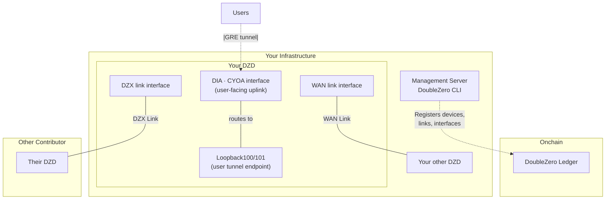
```mermaid
flowchart TB
    subgraph Onchain
        SC[DoubleZero Ledger]
    end

    subgraph Your Infrastructure
        MGMT[Management Server<br/>DoubleZero CLI]
        subgraph DZD[Your DZD]
            CYOA["DIA · CYOA interface<br/>(user-facing uplink)"]
            WAN_INTF["WAN link interface"]
            DZX_INTF["DZX link interface"]
            LO100["Loopback100/101<br/>(user tunnel endpoint)"]
        end
        DZD2[Your other DZD]
    end

    subgraph Other Contributor
        OtherDZD[Their DZD]
    end

    USERS["Users"]

    MGMT -.->|Registers devices,<br/>links, interfaces| SC
    WAN_INTF ---|WAN Link| DZD2
    DZX_INTF ---|DZX Link| OtherDZD
    USERS -.|GRE tunnel|.-> CYOA
    CYOA ---|routes to| LO100
```

---

## Fase 1: Prerequisiti

Prima di poter effettuare il provisioning di un dispositivo, è necessario che l'hardware fisico sia installato e che alcuni indirizzi IP siano allocati.

### Cosa ti serve

| Requisito | Perché è necessario |
|-----------|---------------------|
| **Hardware DZD** | Switch Arista 7280CR3A (vedi [specifiche hardware](contribute.md#hardware-requirements)) |
| **Spazio rack** | 4U con flusso d'aria adeguato |
| **Alimentazione** | Alimentazione ridondante, ~4KW consigliati |
| **Accesso di gestione** | Accesso SSH/console per configurare lo switch |
| **Connettività Internet** | Per la pubblicazione delle metriche e per ottenere la configurazione dal controller |
| **Blocco IPv4 pubblico** | Minimo /29 per il pool di prefissi DZ (vedi sotto) |

### Installare la CLI DoubleZero

La CLI DoubleZero (`doublezero`) viene utilizzata durante tutto il provisioning per registrare dispositivi, creare link e gestire il tuo contributo. Deve essere installata su un **server di gestione o VM** — non sullo switch DZD stesso. Lo switch esegue solo il Config Agent e il Telemetry Agent (installati nella [Fase 4](#fase-4-creazione-dei-link-e-installazione-degli-agent)).

**Ubuntu / Debian:**
```bash
curl -1sLf https://dl.cloudsmith.io/public/malbeclabs/doublezero/setup.deb.sh | sudo -E bash
sudo apt-get install doublezero
```

**Rocky Linux / RHEL:**
```bash
curl -1sLf https://dl.cloudsmith.io/public/malbeclabs/doublezero/setup.rpm.sh | sudo -E bash
sudo yum install doublezero
```

Verifica che il daemon sia in esecuzione:
```bash
sudo systemctl status doublezerod
```

### Comprendere il tuo prefisso DZ

Il tuo prefisso DZ è un blocco di indirizzi IP pubblici che il protocollo DoubleZero gestisce per l'allocazione degli IP.

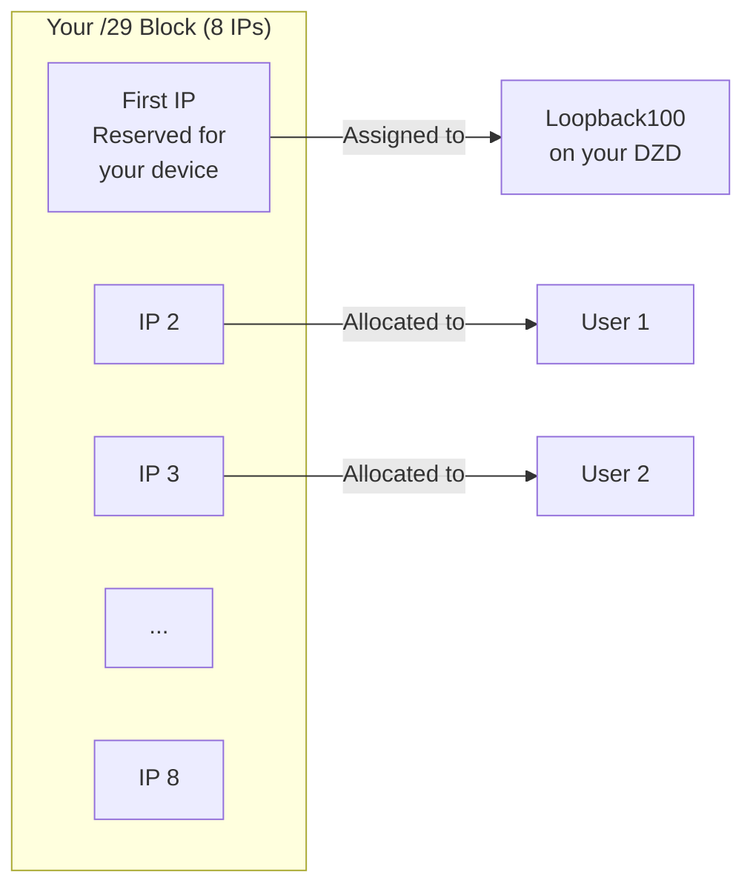
```mermaid
flowchart LR
    subgraph "Your /29 Block (8 IPs)"
        IP1["First IP<br/>Reserved for<br/>your device"]
        IP2["IP 2"]
        IP3["IP 3"]
        IP4["..."]
        IP8["IP 8"]
    end

    IP1 -->|Assigned to| LO[Loopback100<br/>on your DZD]
    IP2 -->|Allocated to| U1[User 1]
    IP3 -->|Allocated to| U2[User 2]
```

**Come vengono utilizzati i prefissi DZ:**

- **Primo IP**: Riservato per il tuo dispositivo (assegnato all'interfaccia Loopback100)
- **IP rimanenti**: Allocati a specifici tipi di utenti che si connettono al tuo DZD:
    - Utenti `IBRLWithAllocatedIP`
    - Utenti `EdgeFiltering` (caso d'uso futuro)
- **Utenti IBRL**: NON consumano da questo pool (utilizzano il proprio IP pubblico)

!!! warning "Regole per i prefissi DZ"
    **NON PUOI utilizzare questi indirizzi per:**

    - Le tue apparecchiature di rete
    - Link punto-punto sulle interfacce DIA
    - Interfacce di gestione
    - Qualsiasi infrastruttura al di fuori del protocollo DZ

    **Requisiti:**

    - Devono essere indirizzi IPv4 **instradabili globalmente (pubblici)**
    - Gli intervalli IP privati (10.x, 172.16-31.x, 192.168.x) vengono rifiutati dallo smart contract
    - **Dimensione minima: /29** (8 indirizzi), prefissi più grandi preferiti (es. /28, /27)
    - L'intero blocco deve essere disponibile — non pre-allocare alcun indirizzo

    Se hai bisogno di indirizzi per le tue apparecchiature (IP delle interfacce DIA, gestione, ecc.), utilizza un **pool di indirizzi separato**.

---

## Fase 2: Configurazione dell'account

In questa fase, crei le chiavi crittografiche che ti identificano, te e i tuoi dispositivi, sulla rete.

### Dove eseguire la CLI

!!! warning "NON installare la CLI sullo switch"
    La CLI DoubleZero (`doublezero`) deve essere installata su un **server di gestione o VM**, non sullo switch Arista.

    ```mermaid
    flowchart LR
        subgraph "Management Server/VM"
            CLI[DoubleZero CLI]
            KEYS[Your Keypairs]
        end

        subgraph "Your DZD Switch"
            CA[Config Agent]
            TA[Telemetry Agent]
        end

        CLI -->|Creates devices, links| BC[Blockchain]
        CA -->|Pulls config| CTRL[Controller]
        TA -->|Submits metrics| BC
    ```

    | Installare sul server di gestione | Installare sullo switch |
    |----------------------------------|------------------------|
    | CLI `doublezero` | Config Agent |
    | La tua keypair di servizio | Telemetry Agent |
    | La tua keypair del metrics publisher | Keypair del metrics publisher (copia) |

### Cosa sono le chiavi?

Pensa alle chiavi come credenziali di accesso sicure:

- **Chiave di servizio**: La tua identità come contributore — usata per eseguire i comandi CLI
- **Chiave del Metrics Publisher**: L'identità del tuo dispositivo per l'invio dei dati di telemetria

Entrambe sono keypair crittografiche (una chiave pubblica che condividi, una chiave privata che tieni segreta).

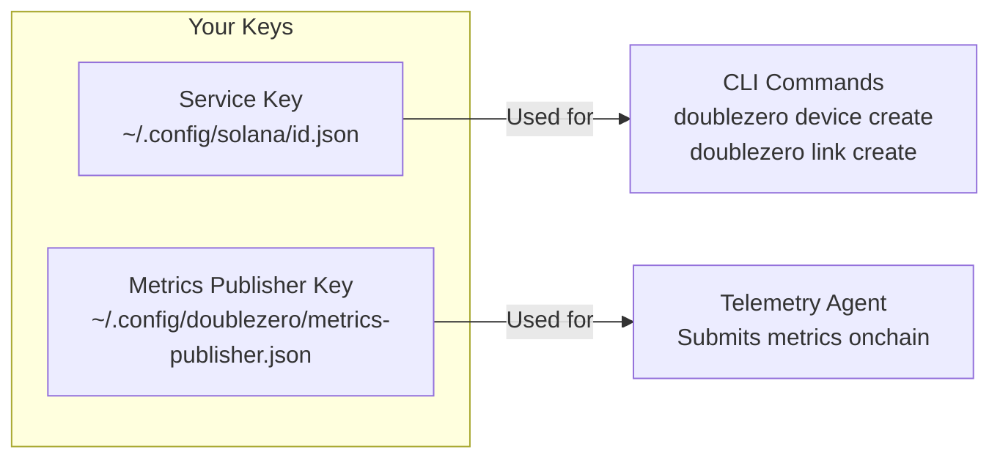
```mermaid
flowchart LR
    subgraph "Your Keys"
        SK[Service Key<br/>~/.config/solana/id.json]
        MK[Metrics Publisher Key<br/>~/.config/doublezero/metrics-publisher.json]
    end

    SK -->|Used for| CLI[CLI Commands<br/>doublezero device create<br/>doublezero link create]
    MK -->|Used for| TEL[Telemetry Agent<br/>Submits metrics onchain]
```

### Step 2.1: Generare la chiave di servizio

Questa è la tua identità principale per interagire con DoubleZero.

```bash
doublezero keygen
```

Questo crea una keypair nella posizione predefinita. L'output mostra la tua **chiave pubblica** — questa è ciò che condividerai con DZF.

### Step 2.2: Generare la chiave del Metrics Publisher

Questa chiave viene utilizzata dal Telemetry Agent per firmare le sottomissioni di metriche.

```bash
doublezero keygen -o ~/.config/doublezero/metrics-publisher.json
```

### Step 2.3: Inviare le chiavi a DZF

Contatta la DoubleZero Foundation o Malbec Labs e fornisci:

1. La **chiave pubblica** della tua chiave di servizio
2. Il tuo **username GitHub** (per l'accesso al repository)

Loro provvederanno a:

- Creare il tuo **account contributore** on-chain
- Concedere l'accesso al **repository privato dei contributori**

### Step 2.4: Verificare il tuo account

Una volta confermato, verifica che il tuo account contributore esista:

```bash
doublezero contributor list
```

Dovresti vedere il tuo codice contributore nella lista.

### Step 2.5: Accedere al repository dei contributori

Il repository [malbeclabs/contributors](https://github.com/malbeclabs/contributors) contiene:

- Configurazioni base dei dispositivi
- Profili TCAM
- Configurazioni ACL
- Istruzioni aggiuntive per la configurazione

Segui le istruzioni presenti per la configurazione specifica del dispositivo.

---

## Fase 3: Provisioning del dispositivo

Ora registrerai il tuo dispositivo fisico sulla blockchain e configurerai le sue interfacce.

### Comprendere i tipi di dispositivo

**Edge** — accetta solo connessioni utente

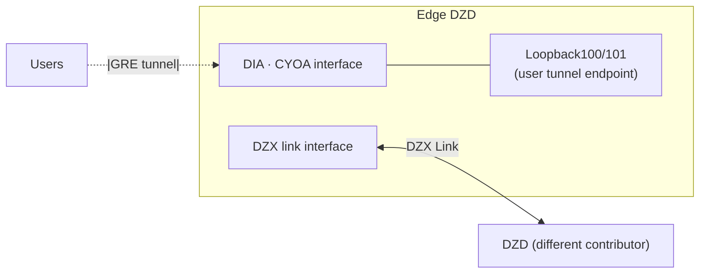
```mermaid
flowchart LR
    subgraph EDZD[Edge DZD]
        E_CYOA["DIA · CYOA interface"]
        E_TUN["Loopback100/101
        (user tunnel endpoint)"]
        E_DZX["DZX link interface"]
        E_CYOA --- E_TUN
    end
    EU["Users"] -.|GRE tunnel|.-> E_CYOA
    E_DZX <-->|DZX Link| ED["DZD (different contributor)"]
```

**Transit** — trasporta il traffico tra dispositivi, nessuna connessione utente

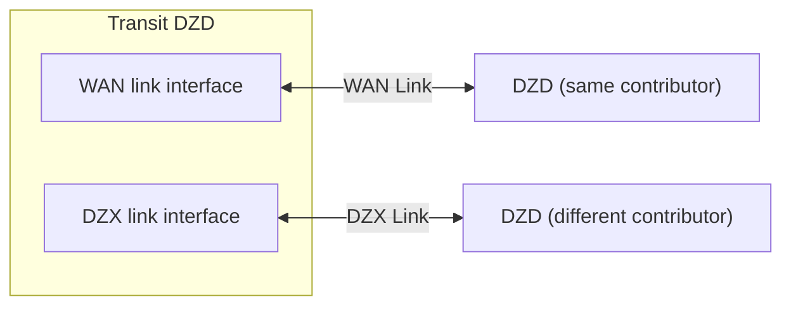
```mermaid
flowchart LR
    subgraph TDZD[Transit DZD]
        T_WAN["WAN link interface"]
        T_DZX["DZX link interface"]
    end
    T_WAN <-->|WAN Link| T2["DZD (same contributor)"]
    T_DZX <-->|DZX Link| TD["DZD (different contributor)"]
```

**Hybrid** — connessioni utente e backbone, il più comune

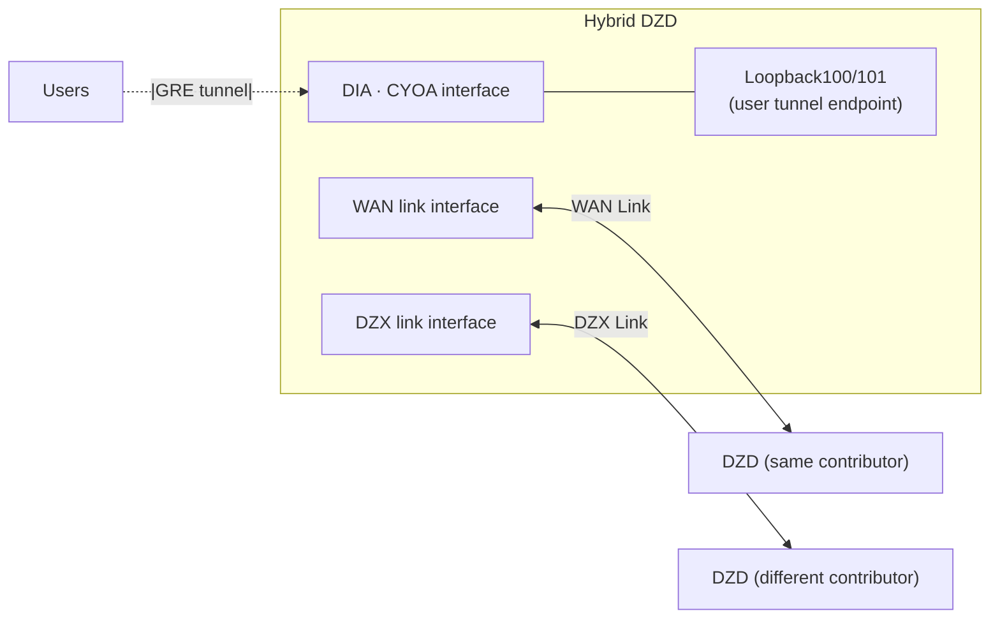
```mermaid
flowchart LR
    subgraph HDZD[Hybrid DZD]
        H_CYOA["DIA · CYOA interface"]
        H_TUN["Loopback100/101
        (user tunnel endpoint)"]
        H_WAN["WAN link interface"]
        H_DZX["DZX link interface"]
        H_CYOA --- H_TUN
    end
    HU["Users"] -.|GRE tunnel|.-> H_CYOA
    H_WAN <-->|WAN Link| H2["DZD (same contributor)"]
    H_DZX <-->|DZX Link| HD["DZD (different contributor)"]
```

| Tipo | Cosa fa | Quando usarlo |
|------|---------|---------------|
| **Edge** | Accetta solo connessioni utente | Singola posizione, solo rivolto agli utenti |
| **Transit** | Trasporta il traffico tra dispositivi | Connettività backbone, nessun utente |
| **Hybrid** | Sia connessioni utente CHE backbone | Il più comune — fa tutto |

### Step 3.1: Trovare la propria location e exchange

Prima di creare il tuo dispositivo, cerca i codici della posizione del tuo data center e dell'exchange più vicino:

```bash
# Elencare le location disponibili (data center)
doublezero location list

# Elencare gli exchange disponibili (punti di interconnessione)
doublezero exchange list
```

### Step 3.2: Creare il dispositivo on-chain

Registra il tuo dispositivo sulla blockchain:

```bash
doublezero device create \
  --code <YOUR_DEVICE_CODE> \
  --contributor <YOUR_CONTRIBUTOR_CODE> \
  --device-type hybrid \
  --location <LOCATION_CODE> \
  --exchange <EXCHANGE_CODE> \
  --public-ip <DEVICE_PUBLIC_IP> \
  --dz-prefixes <YOUR_DZ_PREFIX>
```

**Esempio:**

```bash
doublezero device create \
  --code nyc-dz001 \
  --contributor acme \
  --device-type hybrid \
  --location EQX-NY5 \
  --exchange nyc \
  --public-ip "203.0.113.10" \
  --dz-prefixes "198.51.100.0/28"
```

**Output atteso:**

```
Signature: 4vKz8H...truncated...7xPq2
```

Verifica che il tuo dispositivo sia stato creato:

```bash
doublezero device list | grep nyc-dz001
```

**Spiegazione dei parametri:**

| Parametro | Significato |
|-----------|-------------|
| `--code` | Un nome univoco per il tuo dispositivo (es. `nyc-dz001`) |
| `--contributor` | Il tuo codice contributore (fornito da DZF) |
| `--device-type` | `hybrid`, `transit` o `edge` |
| `--location` | Codice del data center da `location list` |
| `--exchange` | Codice dell'exchange più vicino da `exchange list` |
| `--public-ip` | L'IP pubblico dove gli utenti si connettono al tuo dispositivo via internet |
| `--dz-prefixes` | Il tuo blocco IP allocato per gli utenti |

### Step 3.3: Creare le interfacce loopback necessarie

Ogni dispositivo necessita di due interfacce loopback per il routing interno:

```bash
# Loopback VPNv4
doublezero device interface create <DEVICE_CODE> Loopback255 --loopback-type vpnv4

# Loopback IPv4
doublezero device interface create <DEVICE_CODE> Loopback256 --loopback-type ipv4
```

**Output atteso (per ciascun comando):**

```
Signature: 3mNx9K...truncated...8wRt5
```

### Step 3.4: Creare le interfacce fisiche

Registra le interfacce fisiche che saranno utilizzate per i link WAN o DZX. Queste interfacce devono esistere on-chain prima di poter creare un link che le referenzi. In questo step registri solo l'interfaccia e la sua larghezza di banda; il link viene creato in uno step successivo.

```bash
doublezero device interface create <DEVICE_CODE> <INTERFACE_NAME> \
  --bandwidth <PORT_SPEED>
```

**Esempio:**

```bash
doublezero device interface create nyc-dz001 Ethernet1/1 \
  --bandwidth 10Gbps
```

**Output atteso:**

```
Signature: 7pQw2R...truncated...4xKm9
```

Ripeti per ogni interfaccia che sarà utilizzata come endpoint di un link WAN o DZX. Le interfacce CYOA e DIA vengono registrate separatamente nello step successivo.

### Step 3.5: Creare l'interfaccia CYOA (per dispositivi Edge/Hybrid)

I DZD hybrid e edge necessitano di **due indirizzi IP pubblici** su cui gli utenti terminano i loro tunnel GRE. Gli utenti possono connettersi tramite unicast, multicast o entrambi, e quale IP serve quale scopo cambia per ogni utente.

Entrambi gli IP devono essere registrati con `--user-tunnel-endpoint true`, su un'interfaccia fisica o un loopback. Questo include l'IP che hai fornito al momento della creazione del dispositivo: quell'IP deve comunque essere esplicitamente registrato qui.

Se hai vincoli di IP, puoi utilizzare il primo `/32` del tuo prefisso DZ come uno dei due IP.

#### CYOA e DIA

| Tipo | Flag | Scopo |
|------|------|-------|
| DIA | `--interface-dia dia` | Contrassegna la porta come accesso diretto a internet |
| CYOA | `--interface-cyoa <subtype>` | Dichiara come gli utenti connettono i tunnel GRE al tuo dispositivo |

Il flag CYOA viene sempre impostato su un'**interfaccia fisica** (porta Ethernet o port channel). Mai su un loopback.

| Sottotipo CYOA | Quando usarlo |
|----------------|---------------|
| `gre-over-dia` | Gli utenti si connettono tramite internet pubblico. Il più comune. |
| `gre-over-private-peering` | Gli utenti si connettono tramite cross-connect diretto o circuito privato |
| `gre-over-public-peering` | Gli utenti fanno peering con te presso un Internet Exchange (IX) |
| `gre-over-fabric` | Gli utenti sono co-locati e si connettono tramite un fabric locale |
| `gre-over-cable` | Connessione diretta via cavo a un singolo utente dedicato |

#### Scenario A: Singola interfaccia fisica

Un singolo uplink fisico verso l'ISP. Ethernet1/1 è l'interfaccia CYOA e DIA e ha uno dei due IP pubblici. Loopback100 ha il secondo IP pubblico.

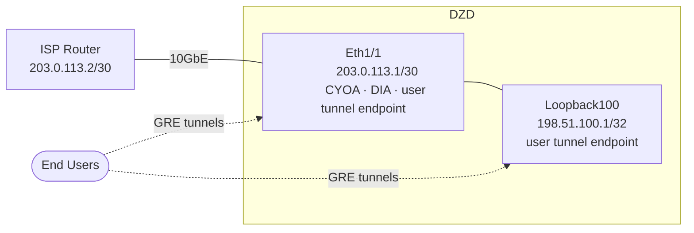
```mermaid
flowchart LR
    USERS(["End Users"])

    subgraph DZD["DZD"]
        E1["Eth1/1
        203.0.113.1/30
        CYOA · DIA · user tunnel endpoint"]
        LO["Loopback100
        198.51.100.1/32\n        user tunnel endpoint"]
        E1 --- LO
    end

    ISP["ISP Router
    203.0.113.2/30"]

    ISP -- "10GbE" --- E1
    USERS -. "GRE tunnels" .-> E1
    USERS -. "GRE tunnels" .-> LO
```

| Interfaccia | `--interface-cyoa` | `--interface-dia` | `--ip-net` | `--bandwidth` | `--cir` | `--routing-mode` | `--user-tunnel-endpoint` |
|-------------|-------------------|------------------|------------|---------------|---------|-----------------|--------------------------|
| Ethernet1/1 | `gre-over-dia` | `dia` | IP/subnet assegnato dal contributore | velocità della porta | tasso garantito | `bgp` o `static` | `true` |
| Loopback100 | — | — | il tuo /32 pubblico | `0bps` | — | — | `true` |

Esempio di comandi da eseguire basato sullo Scenario A:
```bash
doublezero device interface create mydzd-nyc01 Ethernet1/1 \
  --interface-cyoa gre-over-dia \
  --interface-dia dia \
  --ip-net 203.0.113.1/30 \
  --bandwidth 10Gbps \
  --cir 1Gbps \
  --routing-mode bgp \
  --user-tunnel-endpoint true

doublezero device interface create mydzd-nyc01 Loopback100 \
  --ip-net 198.51.100.1/32 \
  --bandwidth 0bps \
  --user-tunnel-endpoint true
```

#### Scenario B: Port channel (LAG)

Il DZD si connette al dispositivo upstream tramite un port channel con un IP. Il port channel ha un IP pubblico ed è l'endpoint CYOA. Loopback100 ha il secondo IP pubblico.

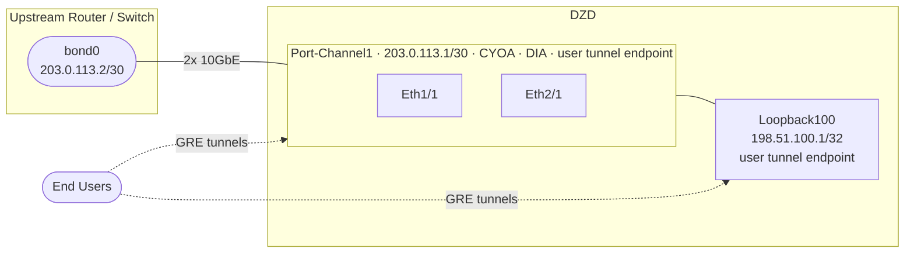
```mermaid
flowchart LR
    USERS(["End Users"])

    subgraph SW["Upstream Router / Switch"]
        SWPC(["bond0
        203.0.113.2/30"])
    end

    subgraph DZD["DZD"]
        subgraph PC["Port-Channel1 · 203.0.113.1/30 · CYOA · DIA · user tunnel endpoint"]
            E1["Eth1/1"]
            E2["Eth2/1"]
        end
        LO["Loopback100
        198.51.100.1/32\n        user tunnel endpoint"]
        PC --- LO
    end

    SWPC -- "2x 10GbE" --- PC
    USERS -. "GRE tunnels" .-> PC
    USERS -. "GRE tunnels" .-> LO
```

| Interfaccia | `--interface-cyoa` | `--interface-dia` | `--ip-net` | `--bandwidth` | `--cir` | `--routing-mode` | `--user-tunnel-endpoint` |
|-------------|-------------------|------------------|------------|---------------|---------|-----------------|--------------------------|
| Port-Channel1 | `gre-over-dia` | `dia` | IP/subnet assegnato dal contributore | velocità LAG combinata | tasso garantito | `bgp` o `static` | `true` |
| Loopback100 | — | — | il tuo /32 pubblico | `0bps` | — | — | `true` |

Esempio di comandi da eseguire basato sullo Scenario B:
```bash
doublezero device interface create mydzd-fra01 Port-Channel1 \
  --interface-cyoa gre-over-dia \
  --interface-dia dia \
  --ip-net 203.0.113.1/30 \
  --bandwidth 20Gbps \
  --cir 2Gbps \
  --routing-mode bgp \
  --user-tunnel-endpoint true

doublezero device interface create mydzd-fra01 Loopback100 \
  --ip-net 198.51.100.1/32 \
  --bandwidth 0bps \
  --user-tunnel-endpoint true
```


#### Scenario C: Doppi uplink fisici verso router separati

Ogni interfaccia fisica si connette a un router upstream diverso. I due IP pubblici risiedono su Loopback100 e Loopback101, entrambi registrati come endpoint per tunnel utente.

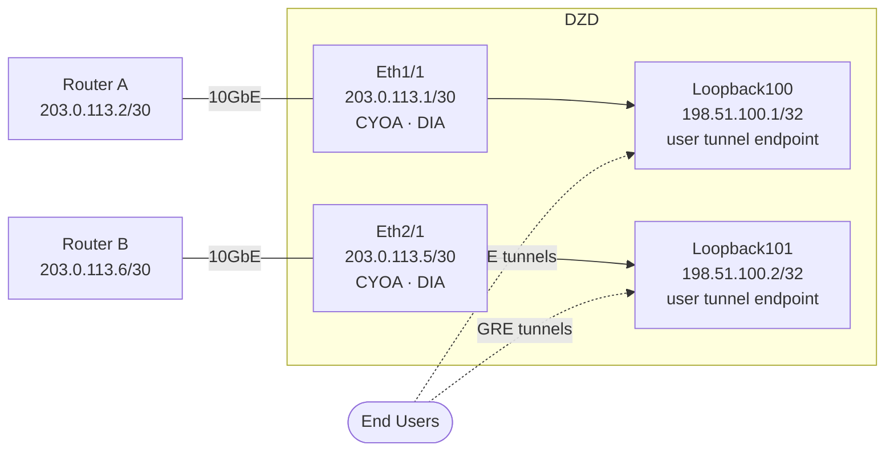
```mermaid
flowchart LR
    USERS(["End Users"])

    RA["Router A
    203.0.113.2/30"]
    RB["Router B
    203.0.113.6/30"]

    subgraph DZD["DZD"]
        E1["Eth1/1
        203.0.113.1/30
        CYOA · DIA"]
        E2["Eth2/1
        203.0.113.5/30
        CYOA · DIA"]
        LO0["Loopback100
        198.51.100.1/32\n        user tunnel endpoint"]
        LO1["Loopback101
        198.51.100.2/32\n        user tunnel endpoint"]
        E1 --> LO0
        E2 --> LO1
    end

    RA -- "10GbE" --- E1
    RB -- "10GbE" --- E2
    USERS -. "GRE tunnels" .-> LO0
    USERS -. "GRE tunnels" .-> LO1
```

| Interfaccia | `--interface-cyoa` | `--interface-dia` | `--ip-net` | `--bandwidth` | `--cir` | `--routing-mode` | `--user-tunnel-endpoint` |
|-------------|-------------------|------------------|------------|---------------|---------|-----------------|--------------------------|
| Ethernet1/1 | `gre-over-dia` | `dia` | IP/subnet assegnato dal contributore | velocità della porta | tasso garantito | `bgp` o `static` | — |
| Ethernet2/1 | `gre-over-dia` | `dia` | IP/subnet assegnato dal contributore | velocità della porta | tasso garantito | `bgp` o `static` | — |
| Loopback100 | — | — | il tuo /32 pubblico | `0bps` | — | — | `true` |
| Loopback101 | — | — | il tuo /32 pubblico | `0bps` | — | — | `true` |

Esempio di comandi da eseguire basato sullo Scenario C:
```bash
doublezero device interface create mydzd-ams01 Ethernet1/1 \
  --interface-cyoa gre-over-dia \
  --interface-dia dia \
  --ip-net 203.0.113.1/30 \
  --bandwidth 10Gbps \
  --cir 1Gbps \
  --routing-mode bgp

doublezero device interface create mydzd-ams01 Ethernet2/1 \
  --interface-cyoa gre-over-dia \
  --interface-dia dia \
  --ip-net 203.0.113.5/30 \
  --bandwidth 10Gbps \
  --cir 1Gbps \
  --routing-mode bgp

doublezero device interface create mydzd-ams01 Loopback100 \
  --ip-net 198.51.100.1/32 \
  --bandwidth 0bps \
  --user-tunnel-endpoint true

doublezero device interface create mydzd-ams01 Loopback101 \
  --ip-net 198.51.100.2/32 \
  --bandwidth 0bps \
  --user-tunnel-endpoint true
```

### Step 3.6: Verificare il dispositivo

```bash
doublezero device list
```

**Output di esempio:**

```
 account                                      | code      | contributor | location | exchange | device_type | public_ip    | dz_prefixes     | users | max_users | status    | health  | mgmt_vrf | owner
 7xKm9pQw2R4vHt3...                          | nyc-dz001 | acme        | EQX-NY5  | nyc      | hybrid      | 203.0.113.10 | 198.51.100.0/28 | 0     | 14        | activated | pending |          | 5FMtd5Woq5XAAg54...
```

Il tuo dispositivo dovrebbe apparire con stato `activated`.

---

## Fase 4: Creazione dei link e installazione degli agent

I link connettono il tuo dispositivo al resto della rete DoubleZero.

### Comprendere i link

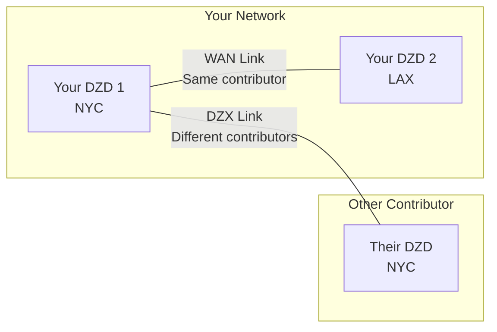
```mermaid
flowchart LR
    subgraph "Your Network"
        D1[Your DZD 1<br/>NYC]
        D2[Your DZD 2<br/>LAX]
    end

    subgraph "Other Contributor"
        O1[Their DZD<br/>NYC]
    end

    D1 ---|WAN Link<br/>Same contributor| D2
    D1 ---|DZX Link<br/>Different contributors| O1
```

| Tipo di link | Connette | Accettazione |
|--------------|----------|--------------|
| **Link WAN** | Due dei TUOI dispositivi | Automatica (possiedi entrambi) |
| **Link DZX** | Il tuo dispositivo a quello di un ALTRO contributore | Richiede la sua accettazione |

### Step 4.1: Creare link WAN (se hai più dispositivi)

I link WAN connettono i tuoi dispositivi:

```bash
doublezero link create wan \
  --code <LINK_CODE> \
  --contributor <YOUR_CONTRIBUTOR> \
  --side-a <DEVICE_1_CODE> \
  --side-a-interface <INTERFACE_ON_DEVICE_1> \
  --side-z <DEVICE_2_CODE> \
  --side-z-interface <INTERFACE_ON_DEVICE_2> \
  --bandwidth 10000 \
  --mtu 9000 \
  --delay-ms 20 \
  --jitter-ms 1
```

**Esempio:**

```bash
doublezero link create wan \
  --code nyc-lax-wan01 \
  --contributor acme \
  --side-a nyc-dz001 \
  --side-a-interface Ethernet3/1 \
  --side-z lax-dz001 \
  --side-z-interface Ethernet3/1 \
  --bandwidth 10000 \
  --mtu 9000 \
  --delay-ms 65 \
  --jitter-ms 1
```

**Output atteso:**

```
Signature: 5tNm7K...truncated...9pRw2
```

### Step 4.2: Creare link DZX

I link DZX connettono il tuo dispositivo direttamente al DZD di un altro contributore:

```bash
doublezero link create dzx \
  --code <DEVICE_CODE_A:DEVICE_CODE_Z> \
  --contributor <YOUR_CONTRIBUTOR> \
  --side-a <YOUR_DEVICE_CODE> \
  --side-a-interface <YOUR_INTERFACE> \
  --side-z <OTHER_DEVICE_CODE> \
  --bandwidth <BANDWIDTH in Kbps, Mbps, or Gbps> \
  --mtu <MTU> \
  --delay-ms <DELAY> \
  --jitter-ms <JITTER>
```

**Output atteso:**

```
Signature: 8mKp3W...truncated...2nRx7
```

Dopo aver creato un link DZX, l'altro contributore deve accettarlo:

```bash
# L'ALTRO contributore esegue questo comando
doublezero link accept \
  --code <LINK_CODE> \
  --side-z-interface <THEIR_INTERFACE>
```

**Output atteso (per il contributore che accetta):**

```
Signature: 6vQt9L...truncated...3wPm4
```

### Step 4.3: Verificare i link

```bash
doublezero link list
```

**Output di esempio:**

```
 account                                      | code          | contributor | side_a_name | side_a_iface_name | side_z_name | side_z_iface_name | link_type | bandwidth | mtu  | delay_ms | jitter_ms | delay_override_ms | tunnel_id | tunnel_net      | status    | health  | owner
 8vkYpXaBW8RuknJq...                         | nyc-dz001:lax-dz001 | acme        | nyc-dz001   | Ethernet3/1       | lax-dz001   | Ethernet3/1       | WAN       | 10Gbps    | 9000 | 65.00ms  | 1.00ms    | 0.00ms            | 42        | 172.16.0.84/31  | activated | pending | 5FMtd5Woq5XAAg54...
```

I link dovrebbero mostrare lo stato `activated` una volta configurati entrambi i lati.

---

### Installazione degli agent

Due agent software vengono eseguiti sul tuo DZD:

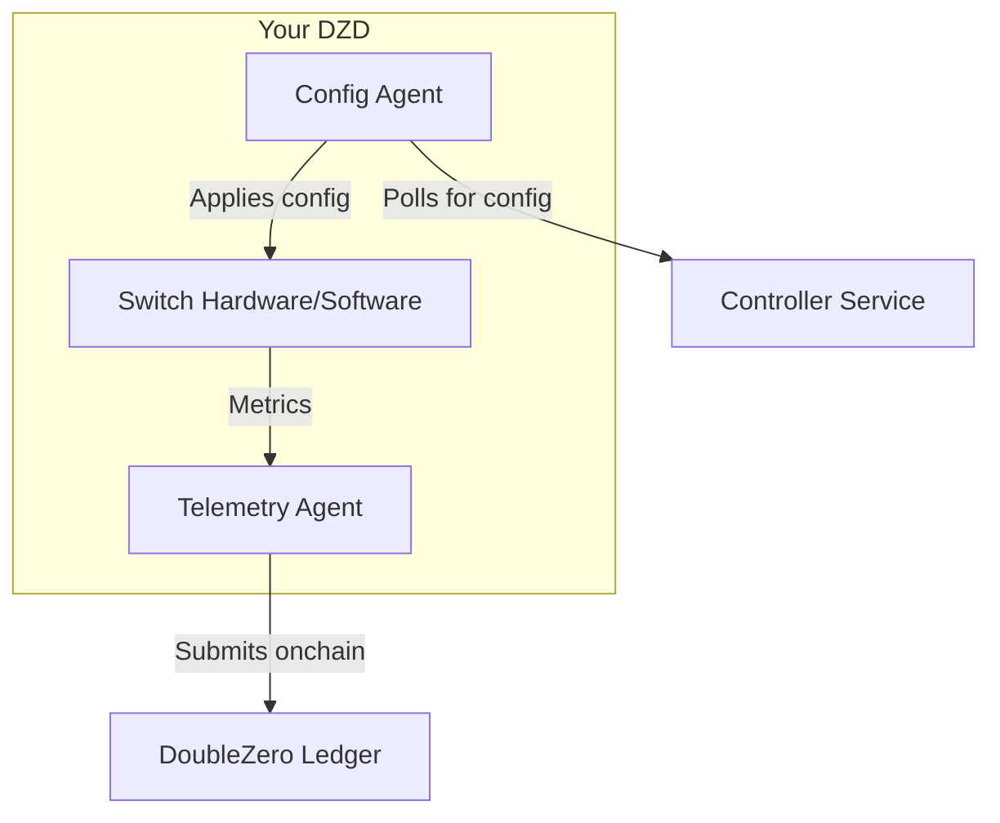
```mermaid
flowchart TB
    subgraph "Your DZD"
        CA[Config Agent]
        TA[Telemetry Agent]
        HW[Switch Hardware/Software]
    end

    CA -->|Polls for config| CTRL[Controller Service]
    CA -->|Applies config| HW

    HW -->|Metrics| TA
    TA -->|Submits onchain| BC[DoubleZero Ledger]
```

| Agent | Cosa fa |
|-------|---------|
| **Config Agent** | Scarica la configurazione dal controller e la applica allo switch |
| **Telemetry Agent** | Misura latenza/perdita verso altri dispositivi, riporta le metriche on-chain |

### Step 4.4: Installare il Config Agent

#### Abilitare l'API sullo switch

Aggiungere alla configurazione EOS:

```
management api eos-sdk-rpc
    transport grpc eapilocal
        localhost loopback vrf default
        service all
        no disabled
```

!!! note "Nota sul VRF"
    Sostituisci `default` con il nome del tuo VRF di gestione se diverso (es. `management`).

#### Scaricare e installare l'agent

```bash
# Entrare in bash sullo switch
switch# bash
$ sudo bash
# cd /mnt/flash
# wget AGENT_DOWNLOAD_URL
# exit
$ exit

# Installare come estensione EOS
switch# copy flash:AGENT_FILENAME extension:
switch# extension AGENT_FILENAME
switch# copy installed-extensions boot-extensions
```

#### Verificare l'estensione

```bash
switch# show extensions
```

Lo stato dovrebbe essere "A, I, B":

```
Name                                        Version/Release     Status     Extension
------------------------------------------- ------------------- ---------- ---------
AGENT_FILENAME    MAINNET_CLIENT_VERSION/1             A, I, B    1

A: available | NA: not available | I: installed | F: forced | B: install at boot
```

#### Configurare e avviare l'agent

Aggiungere alla configurazione EOS:

```
daemon doublezero-agent
    exec /usr/local/bin/doublezero-agent -pubkey <YOUR_DEVICE_PUBKEY> -controller <controller_IP>:<controller_port>
    no shut
```

!!! info "IP e porta del controller"
    L'IP e la porta del controller possono essere trovati nel repository dei contributori a cui hai avuto accesso nello Step 2.5.

!!! note "Nota sul VRF"
    Se il tuo VRF di gestione non è `default` (cioè il namespace non è `ns-default`), prefissa il comando exec con `exec /sbin/ip netns exec ns-<VRF>`. Ad esempio, se il tuo VRF è `management`:
    ```
    daemon doublezero-agent
        exec /sbin/ip netns exec ns-management /usr/local/bin/doublezero-agent -pubkey <YOUR_DEVICE_PUBKEY>
        no shut
    ```

Ottieni la pubkey del tuo dispositivo da `doublezero device list` (la colonna `account`).

#### Verificare che sia in esecuzione

```bash
switch# show agent doublezero-agent logs
```

Dovresti vedere "Starting doublezero-agent" e connessioni al controller riuscite.

### Step 4.5: Installare il Telemetry Agent

#### Copiare la chiave del metrics publisher sul dispositivo

```bash
scp ~/.config/doublezero/metrics-publisher.json <SWITCH_IP>:/mnt/flash/metrics-publisher-keypair.json
```

#### Registrare il metrics publisher on-chain

```bash
doublezero device update \
  --pubkey <DEVICE_ACCOUNT> \
  --metrics-publisher <METRICS_PUBLISHER_PUBKEY>
```

Ottieni la pubkey dal tuo file metrics-publisher.json.

#### Scaricare e installare l'agent

```bash
switch# bash
$ sudo bash
# cd /mnt/flash
# wget TELEMETRY_DOWNLOAD_URL
# exit
$ exit

# Installare come estensione EOS
switch# copy flash:TELEMETRY_FILENAME extension:
switch# extension TELEMETRY_FILENAME
switch# copy installed-extensions boot-extensions
```

#### Verificare l'estensione

```bash
switch# show extensions
```

Lo stato dovrebbe essere "A, I, B":

```
Name                                        Version/Release     Status     Extension
------------------------------------------- ------------------- ---------- ---------
TELEMETRY_FILENAME    MAINNET_CLIENT_VERSION/1             A, I, B    1

A: available | NA: not available | I: installed | F: forced | B: install at boot
```

#### Configurare e avviare l'agent

Aggiungere alla configurazione EOS:

```
daemon doublezero-telemetry
    exec /usr/local/bin/doublezero-telemetry --local-device-pubkey <DEVICE_ACCOUNT> --env mainnet --keypair /mnt/flash/metrics-publisher-keypair.json
    no shut
```

!!! note "Nota sul VRF"
    Se il tuo VRF di gestione non è `default` (cioè il namespace non è `ns-default`), aggiungi `--management-namespace ns-<VRF>` al comando exec. Ad esempio, se il tuo VRF è `management`:
    ```
    daemon doublezero-telemetry
        exec /usr/local/bin/doublezero-telemetry --management-namespace ns-management --local-device-pubkey <DEVICE_ACCOUNT> --env mainnet --keypair /mnt/flash/metrics-publisher-keypair.json
        no shut
    ```

#### Verificare che sia in esecuzione

```bash
switch# show agent doublezero-telemetry logs
```

Dovresti vedere "Starting telemetry collector" e "Starting submission loop".

---

## Fase 5: Burn-in dei link

!!! warning "Tutti i nuovi link devono completare il burn-in prima di trasportare traffico"
    I nuovi link devono essere **drenati per almeno 24 ore** prima di essere attivati per il traffico di produzione. Questo requisito di burn-in è definito in [RFC12: Network Provisioning](https://github.com/malbeclabs/doublezero/blob/main/rfcs/rfc12-network-provisioning.md), che specifica ~200.000 slot del DZ Ledger (~20 ore) di metriche pulite prima che un link sia pronto per il servizio.

Con gli agent installati e in esecuzione, monitora i tuoi link su [metrics.doublezero.xyz](https://metrics.doublezero.xyz) per almeno 24 ore consecutive:

- Dashboard **"DoubleZero Device-Link Latencies"** — verifica **zero perdita di pacchetti** sul link nel tempo
- Dashboard **"DoubleZero Network Metrics"** — verifica **zero errori** sui tuoi link

Rimuovi il drain dal link solo quando il periodo di burn-in mostra un link pulito con zero perdite e zero errori.

---

## Fase 6: Verifica e attivazione

Segui questa checklist per confermare che tutto funzioni correttamente.

!!! warning "Il tuo dispositivo parte bloccato (`max_users = 0`)"
    Quando un dispositivo viene creato, `max_users` è impostato a **0** di default. Questo significa che nessun utente può ancora connettersi ad esso. Questo è intenzionale — devi verificare che tutto funzioni prima di accettare traffico utente.

    **Prima di impostare `max_users` sopra 0, devi:**

    1. Confermare che tutti i link abbiano completato il **burn-in di 24 ore** con zero perdite/errori su [metrics.doublezero.xyz](https://metrics.doublezero.xyz)
    2. **Coordinarsi con DZ/Malbec Labs** per eseguire un test di connettività:
        - Un utente di test riesce a connettersi al tuo dispositivo?
        - L'utente riceve le rotte sulla rete DZ?
        - L'utente riesce a instradare il traffico sulla rete DZ end-to-end?
    3. Solo dopo che DZ/ML conferma che i test sono superati, imposta max_users a 96:

    ```bash
    doublezero device update --pubkey <DEVICE_ACCOUNT> --max-users 96
    ```

### Verifiche del dispositivo

```bash
# Il tuo dispositivo dovrebbe apparire con stato "activated"
doublezero device list | grep <YOUR_DEVICE_CODE>
```

**Output atteso:**

```
 7xKm9pQw2R4vHt3... | nyc-dz001 | acme | EQX-NY5 | nyc | hybrid | 203.0.113.10 | 198.51.100.0/28 | 0 | 14 | activated | pending | | 5FMtd5Woq5XAAg54...
```

```bash
# Le tue interfacce dovrebbero essere elencate
doublezero device interface list | grep <YOUR_DEVICE_CODE>
```

**Output atteso:**

```
 nyc-dz001 | Loopback255 | loopback | vpnv4 | none | none | 0 | 0 | 1500 | static | 0 | 172.16.1.91/32  | 56 | false | activated
 nyc-dz001 | Loopback256 | loopback | ipv4  | none | none | 0 | 0 | 1500 | static | 0 | 172.16.1.100/32 | 0  | false | activated
 nyc-dz001 | Ethernet1/1 | physical | none  | none | none | 0 | 0 | 1500 | static | 0 |                 | 0  | false | activated
```

### Verifiche dei link

```bash
# I link dovrebbero mostrare lo stato "activated"
doublezero link list | grep <YOUR_DEVICE_CODE>
```

**Output atteso:**

```
 8vkYpXaBW8RuknJq... | nyc-lax-wan01 | acme | nyc-dz001 | Ethernet3/1 | lax-dz001 | Ethernet3/1 | WAN | 10Gbps | 9000 | 65.00ms | 1.00ms | 0.00ms | 42 | 172.16.0.84/31 | activated | pending | 5FMtd5Woq5XAAg54...
```

### Verifiche degli agent

Sullo switch:

```bash
# Il config agent dovrebbe mostrare download di configurazione riusciti
switch# show agent doublezero-agent logs | tail -20

# Il telemetry agent dovrebbe mostrare sottomissioni riuscite
switch# show agent doublezero-telemetry logs | tail -20
```

### Diagramma di verifica finale

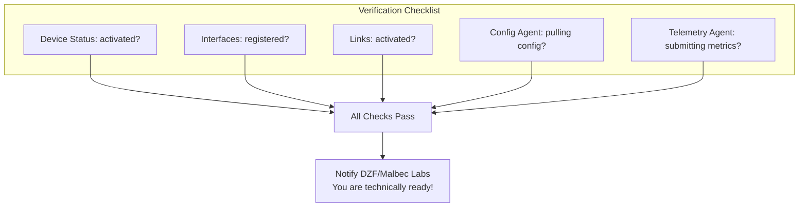
```mermaid
flowchart TB
    subgraph "Verification Checklist"
        D[Device Status: activated?]
        I[Interfaces: registered?]
        L[Links: activated?]
        CA[Config Agent: pulling config?]
        TA[Telemetry Agent: submitting metrics?]
    end

    D --> PASS
    I --> PASS
    L --> PASS
    CA --> PASS
    TA --> PASS

    PASS[All Checks Pass] --> NOTIFY[Notify DZF/Malbec Labs<br/>You are technically ready!]
```

---

## Risoluzione dei problemi

### La creazione del dispositivo fallisce

- Verifica che la tua chiave di servizio sia autorizzata (`doublezero contributor list`)
- Controlla che i codici di location e exchange siano validi
- Assicurati che il prefisso DZ sia un intervallo IP pubblico valido

### Link bloccato nello stato "requested"

- I link DZX richiedono l'accettazione da parte dell'altro contributore
- Contattalo per eseguire `doublezero link accept`

### Il Config Agent non si connette

- Verifica che la rete di gestione abbia accesso a internet
- Controlla che la configurazione VRF corrisponda alla tua configurazione
- Assicurati che la pubkey del dispositivo sia corretta

### Il Telemetry Agent non invia

- Verifica che la chiave del metrics publisher sia registrata on-chain
- Controlla che il file della keypair esista sullo switch
- Assicurati che la pubkey dell'account del dispositivo sia corretta

---

## Passi successivi

- Consulta la [Guida operativa](contribute-operations.md) per gli aggiornamenti degli agent e la gestione dei link
- Controlla il [Glossario](glossary.md) per le definizioni dei termini
- Contatta DZF/Malbec Labs se riscontri problemi