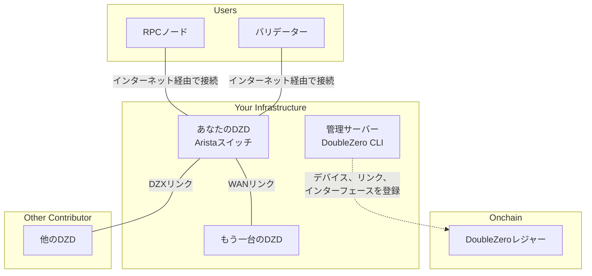
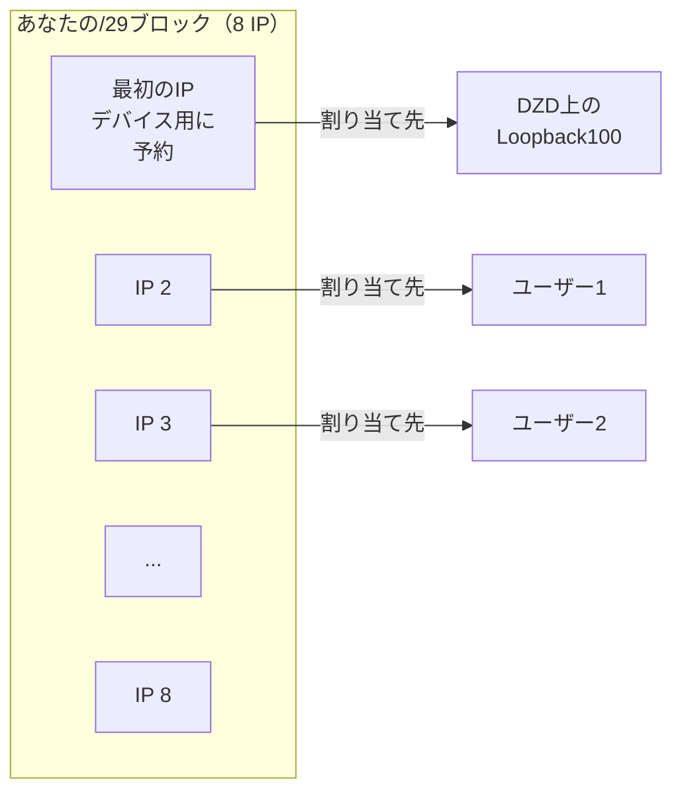
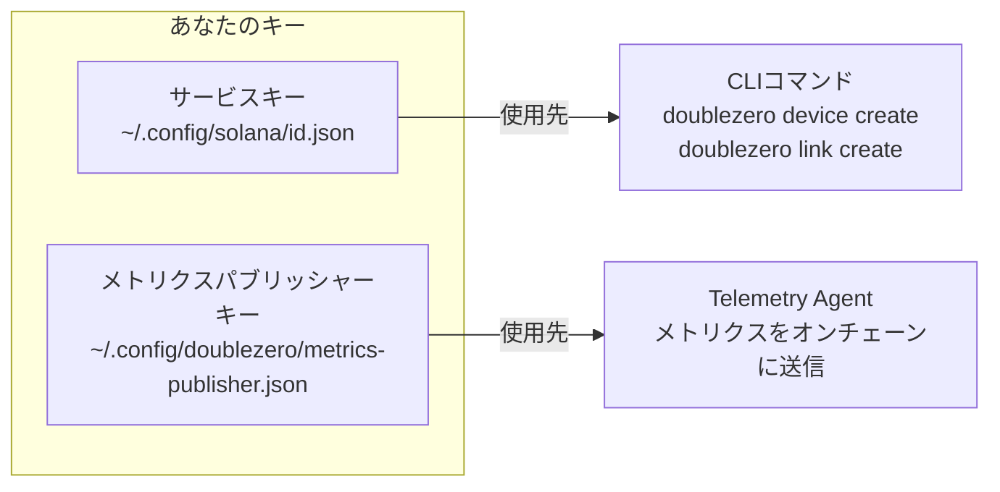
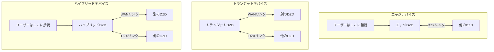
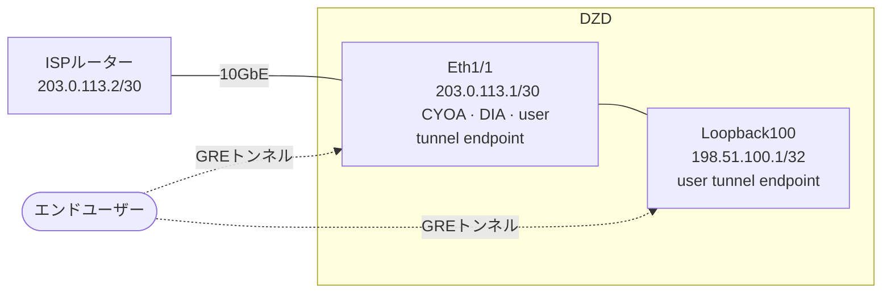
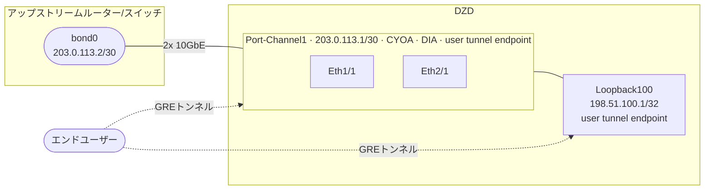
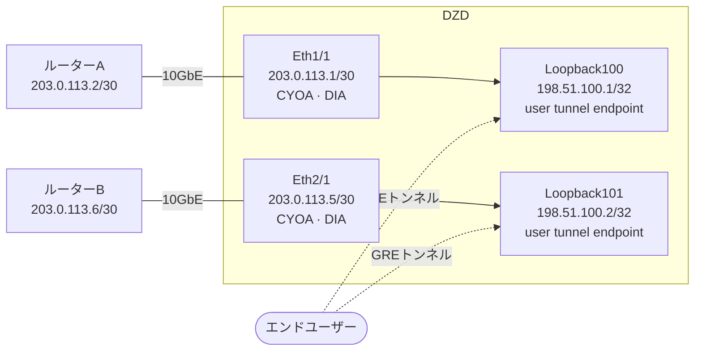
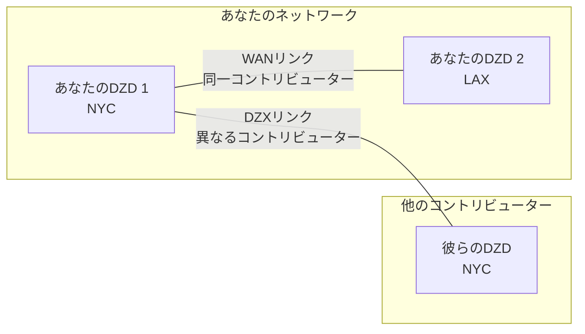
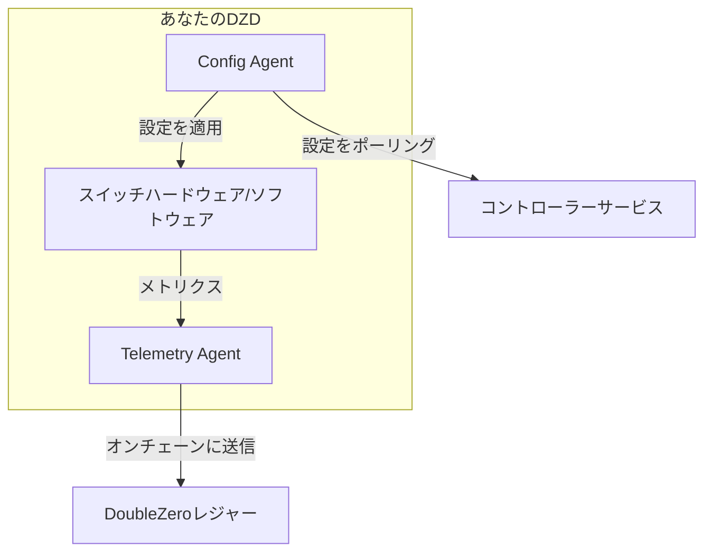
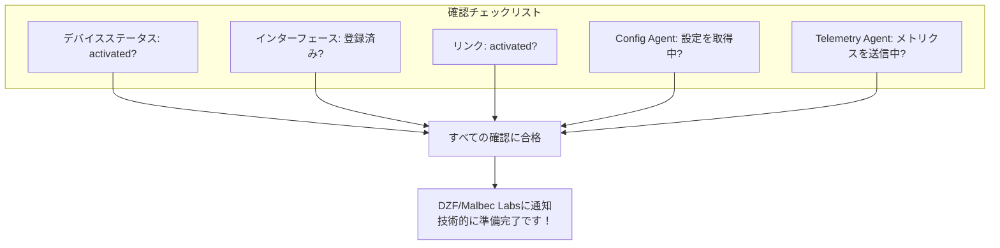

# デバイスプロビジョニングガイド
!!! warning "This translation was generated using artificial intelligence and has not been reviewed by a human translator. It may contain inaccuracies or errors and should not be relied upon."


このガイドでは、DoubleZeroデバイス（DZD）を最初から最後までプロビジョニングする手順を説明します。各フェーズは[オンボーディングチェックリスト](contribute-overview.md#onboarding-checklist)に対応しています。

---

## 全体像

手順に入る前に、構築するものの全体像を確認しましょう：



---

## フェーズ1：前提条件

デバイスをプロビジョニングする前に、物理的なハードウェアをセットアップし、いくつかのIPアドレスを割り当てる必要があります。

### 必要なもの

| 要件 | 必要な理由 |
|-------------|-----------------|
| **DZDハードウェア** | Arista 7280CR3Aスイッチ（[ハードウェア仕様](contribute.md#hardware-requirements)参照） |
| **ラックスペース** | 適切なエアフローを持つ4U |
| **電力** | 冗長フィード、約4KW推奨 |
| **管理アクセス** | スイッチを設定するためのSSH/コンソールアクセス |
| **インターネット接続** | メトリクスのパブリッシュとコントローラーからの設定取得のため |
| **パブリックIPv4ブロック** | DZプレフィックスプール用の最小/29（以下参照） |

### DoubleZero CLIのインストール

DoubleZero CLI（`doublezero`）はプロビジョニング全体でデバイスの登録、リンクの作成、貢献の管理に使用されます。DZDスイッチ自体ではなく、**管理サーバーまたはVM**にインストールする必要があります。スイッチはConfig AgentとTelemetry Agentのみを実行します（[フェーズ4](#phase-4-link-establishment-agent-installation)でインストール）。

**Ubuntu / Debian：**
```bash
curl -1sLf https://dl.cloudsmith.io/public/malbeclabs/doublezero/setup.deb.sh | sudo -E bash
sudo apt-get install doublezero
```

**Rocky Linux / RHEL：**
```bash
curl -1sLf https://dl.cloudsmith.io/public/malbeclabs/doublezero/setup.rpm.sh | sudo -E bash
sudo yum install doublezero
```

デーモンが実行中であることを確認します：
```bash
sudo systemctl status doublezerod
```

### DZプレフィックスについて

DZプレフィックスはDoubleZeroプロトコルがIP割り当てに管理するパブリックIPアドレスのブロックです。



**DZプレフィックスの使用方法：**

- **最初のIP**：デバイス用に予約（Loopback100インターフェースに割り当て）
- **残りのIP**：DZDに接続する特定のユーザータイプに割り当て：
    - `IBRLWithAllocatedIP`ユーザー
    - `EdgeFiltering`ユーザー
    - マルチキャストパブリッシャー
- **IBRLユーザー**：このプールを消費しません（独自のパブリックIPを使用）

!!! warning "DZプレフィックスルール"
    **これらのアドレスは以下に使用できません：**

    - 自社のネットワーク機器
    - DIAインターフェースのポイントツーポイントリンク
    - 管理インターフェース
    - DZプロトコル外のインフラ

    **要件：**

    - **グローバルにルーティング可能（パブリック）**なIPv4アドレスである必要があります
    - プライベートIP範囲（10.x、172.16-31.x、192.168.x）はスマートコントラクトで拒否されます
    - **最小サイズ：/29**（8アドレス）、大きなプレフィックス推奨（例：/28、/27）
    - ブロック全体が利用可能である必要があります — アドレスを事前に割り当てないでください

    自社の機器用にアドレスが必要な場合（DIAインターフェースIP、管理など）は、**別のアドレスプール**を使用してください。

---

## フェーズ2：アカウントのセットアップ

このフェーズでは、ネットワーク上でアカウントとデバイスを識別する暗号鍵を作成します。

### CLIを実行する場所

!!! warning "スイッチにCLIをインストールしないでください"
    DoubleZero CLI（`doublezero`）はAristaスイッチではなく、**管理サーバーまたはVM**にインストールする必要があります。

    ```mermaid
    flowchart LR
        subgraph "管理サーバー/VM"
            CLI[DoubleZero CLI]
            KEYS[キーペア]
        end

        subgraph "DZDスイッチ"
            CA[Config Agent]
            TA[Telemetry Agent]
        end

        CLI -->|デバイス、リンクを作成| BC[ブロックチェーン]
        CA -->|設定を取得| CTRL[コントローラー]
        TA -->|メトリクスを送信| BC
    ```

    | 管理サーバーにインストール | スイッチにインストール |
    |-----------------------------|-------------------|
    | `doublezero` CLI | Config Agent |
    | サービスキーペア | Telemetry Agent |
    | メトリクスパブリッシャーキーペア | メトリクスパブリッシャーキーペア（コピー） |

### キーとは？

キーは安全なログイン認証情報のようなものです：

- **サービスキー**：コントリビューターアイデンティティ - CLIコマンドの実行に使用
- **メトリクスパブリッシャーキー**：テレメトリデータを送信するためのデバイスアイデンティティ

どちらも暗号鍵ペア（共有する公開鍵と秘密に保持する秘密鍵）です。



### ステップ2.1：サービスキーの生成

これはDoubleZeroと対話するためのメインアイデンティティです。

```bash
doublezero keygen
```

これにより、デフォルトの場所にキーペアが作成されます。出力には**公開鍵**が表示されます - これをDZFと共有します。

### ステップ2.2：メトリクスパブリッシャーキーの生成

このキーはTelemetry Agentがメトリクス送信に署名するために使用します。

```bash
doublezero keygen -o ~/.config/doublezero/metrics-publisher.json
```

### ステップ2.3：DZFへのキーの提出

DoubleZero FoundationまたはMalbec Labsに連絡し、以下を提供します：

1. **サービスキーの公開鍵**
2. **GitHubユーザー名**（リポジトリアクセスのため）

DZFは以下を行います：

- **コントリビューターアカウント**をオンチェーンで作成
- プライベートな**contributorsリポジトリ**へのアクセスを付与

### ステップ2.4：アカウントの確認

確認後、コントリビューターアカウントが存在することを確認します：

```bash
doublezero contributor list
```

一覧にコントリビューターコードが表示されるはずです。

### ステップ2.5：Contributorsリポジトリへのアクセス

[malbeclabs/contributors](https://github.com/malbeclabs/contributors)リポジトリには以下が含まれています：

- ベースデバイス設定
- TCAMプロファイル
- ACL設定
- 追加セットアップ手順

デバイス固有の設定については、そこの指示に従ってください。

---

## フェーズ3：デバイスプロビジョニング

ここでは物理的なデバイスをブロックチェーンに登録し、インターフェースを設定します。

### デバイスタイプについて



| タイプ | 機能 | 使用するとき |
|------|--------------|-------------|
| **エッジ** | ユーザー接続のみを受け入れる | 単一ロケーション、ユーザー向けのみ |
| **トランジット** | デバイス間のトラフィックを移動 | バックボーン接続、ユーザーなし |
| **ハイブリッド** | ユーザー接続とバックボーンの両方 | 最も一般的 - すべてを行う |

### ステップ3.1：ロケーションとエクスチェンジを調べる

デバイスを作成する前に、データセンターの場所と最寄りのエクスチェンジのコードを調べます：

```bash
# 利用可能なロケーション（データセンター）を一覧表示
doublezero location list

# 利用可能なエクスチェンジ（相互接続ポイント）を一覧表示
doublezero exchange list
```

### ステップ3.2：デバイスをオンチェーンで作成する

ブロックチェーンにデバイスを登録します：

```bash
doublezero device create \
  --code <デバイスコード> \
  --contributor <コントリビューターコード> \
  --device-type hybrid \
  --location <ロケーションコード> \
  --exchange <エクスチェンジコード> \
  --public-ip <デバイスパブリックIP> \
  --dz-prefixes <DZプレフィックス>
```

**例：**

```bash
doublezero device create \
  --code nyc-dz001 \
  --contributor acme \
  --device-type hybrid \
  --location EQX-NY5 \
  --exchange nyc \
  --public-ip "203.0.113.10" \
  --dz-prefixes "198.51.100.0/28"
```

**期待される出力：**

```
Signature: 4vKz8H...truncated...7xPq2
```

デバイスが作成されたことを確認します：

```bash
doublezero device list | grep nyc-dz001
```

**パラメーターの説明：**

| パラメーター | 意味 |
|-----------|---------------|
| `--code` | デバイスの一意の名前（例：`nyc-dz001`） |
| `--contributor` | コントリビューターコード（DZFから付与） |
| `--device-type` | `hybrid`、`transit`、または`edge` |
| `--location` | `location list`からのデータセンターコード |
| `--exchange` | `exchange list`からの最寄りエクスチェンジコード |
| `--public-ip` | ユーザーがインターネット経由でデバイスに接続するパブリックIP |
| `--dz-prefixes` | ユーザー用の割り当てIPブロック |

### ステップ3.3：必要なループバックインターフェースを作成する

すべてのデバイスには内部ルーティング用の2つのループバックインターフェースが必要です：

```bash
# VPNv4ループバック
doublezero device interface create <デバイスコード> Loopback255 --loopback-type vpnv4

# IPv4ループバック
doublezero device interface create <デバイスコード> Loopback256 --loopback-type ipv4
```

**期待される出力（各コマンド）：**

```
Signature: 3mNx9K...truncated...8wRt5
```

### ステップ3.4：物理インターフェースを作成する

使用する物理ポートを登録します：

```bash
# 基本インターフェース
doublezero device interface create <デバイスコード> Ethernet1/1
```

**期待される出力：**

```
Signature: 7pQw2R...truncated...4xKm9
```

### ステップ3.5：CYOAインターフェースを作成する（エッジ/ハイブリッドデバイスの場合）

ハイブリッドおよびエッジDZDには、ユーザーがGREトンネルを終端する**2つのパブリックIPアドレス**が必要です。ユーザーはユニキャスト、マルチキャスト、またはその両方で接続でき、どのIPがどの目的に使用されるかはユーザーごとにローテーションされます。

両方のIPは、物理インターフェースまたはループバックのいずれかで`--user-tunnel-endpoint true`で登録する必要があります。これには、デバイス作成時に指定したIPも含まれます。そのIPもここで明示的に登録する必要があります。

IP制約がある場合は、DZプレフィックスの最初の`/32`を2つのIPの1つとして使用できます。

#### CYOAとDIA

| タイプ | フラグ | 目的 |
|--------|--------|------|
| DIA | `--interface-dia dia` | ポートをダイレクトインターネットアクセスとしてマーク |
| CYOA | `--interface-cyoa <サブタイプ>` | ユーザーがデバイスにGREトンネルを接続する方法を宣言 |

CYOAフラグは常に**物理インターフェース**（イーサネットポートまたはポートチャネル）に設定されます。ループバックには設定しません。

| CYOAサブタイプ | 使用場面 |
|--------------|---------|
| `gre-over-dia` | ユーザーがパブリックインターネット経由で接続。最も一般的。 |
| `gre-over-private-peering` | ユーザーが直接クロスコネクトまたはプライベート回線で接続 |
| `gre-over-public-peering` | ユーザーがインターネットエクスチェンジ（IX）でピアリング |
| `gre-over-fabric` | ユーザーが同一施設内にありローカルファブリックで接続 |
| `gre-over-cable` | 単一の専用ユーザーへの直接ケーブル接続 |

#### シナリオA：単一物理インターフェース

ISPへの1つの物理アップリンク。Ethernet1/1はCYOAおよびDIAインターフェースで、2つのパブリックIPのうちの1つを持ちます。Loopback100が2番目のパブリックIPを持ちます。



| インターフェース | `--interface-cyoa` | `--interface-dia` | `--ip-net` | `--bandwidth` | `--cir` | `--routing-mode` | `--user-tunnel-endpoint` |
|----------------|-------------------|------------------|------------|---------------|---------|-----------------|--------------------------|
| Ethernet1/1 | `gre-over-dia` | `dia` | コントリビューター割当IP/サブネット | ポート速度 | コミットレート | `bgp`または`static` | `true` |
| Loopback100 | — | — | パブリック/32 | `0bps` | — | — | `true` |

シナリオAに基づくコマンド例：
```bash
doublezero device interface create mydzd-nyc01 Ethernet1/1 \
  --interface-cyoa gre-over-dia \
  --interface-dia dia \
  --ip-net 203.0.113.1/30 \
  --bandwidth 10Gbps \
  --cir 1Gbps \
  --routing-mode bgp \
  --user-tunnel-endpoint true

doublezero device interface create mydzd-nyc01 Loopback100 \
  --ip-net 198.51.100.1/32 \
  --bandwidth 0bps \
  --user-tunnel-endpoint true
```

#### シナリオB：ポートチャネル（LAG）

DZDがIPを持つポートチャネルでアップストリームデバイスに接続します。ポートチャネルが1つのパブリックIPを持ち、CYOAエンドポイントになります。Loopback100が2番目のパブリックIPを持ちます。



| インターフェース | `--interface-cyoa` | `--interface-dia` | `--ip-net` | `--bandwidth` | `--cir` | `--routing-mode` | `--user-tunnel-endpoint` |
|----------------|-------------------|------------------|------------|---------------|---------|-----------------|--------------------------|
| Port-Channel1 | `gre-over-dia` | `dia` | コントリビューター割当IP/サブネット | 組み合わせLAG速度 | コミットレート | `bgp`または`static` | `true` |
| Loopback100 | — | — | パブリック/32 | `0bps` | — | — | `true` |

シナリオBに基づくコマンド例：
```bash
doublezero device interface create mydzd-fra01 Port-Channel1 \
  --interface-cyoa gre-over-dia \
  --interface-dia dia \
  --ip-net 203.0.113.1/30 \
  --bandwidth 20Gbps \
  --cir 2Gbps \
  --routing-mode bgp \
  --user-tunnel-endpoint true

doublezero device interface create mydzd-fra01 Loopback100 \
  --ip-net 198.51.100.1/32 \
  --bandwidth 0bps \
  --user-tunnel-endpoint true
```

#### シナリオC：別々のルーターへのデュアル物理アップリンク

各物理インターフェースが異なるアップストリームルーターに接続します。2つのパブリックIPはLoopback100とLoopback101に存在し、両方ともユーザートンネルエンドポイントとして登録されます。



| インターフェース | `--interface-cyoa` | `--interface-dia` | `--ip-net` | `--bandwidth` | `--cir` | `--routing-mode` | `--user-tunnel-endpoint` |
|----------------|-------------------|------------------|------------|---------------|---------|-----------------|--------------------------|
| Ethernet1/1 | `gre-over-dia` | `dia` | コントリビューター割当IP/サブネット | ポート速度 | コミットレート | `bgp`または`static` | — |
| Ethernet2/1 | `gre-over-dia` | `dia` | コントリビューター割当IP/サブネット | ポート速度 | コミットレート | `bgp`または`static` | — |
| Loopback100 | — | — | パブリック/32 | `0bps` | — | — | `true` |
| Loopback101 | — | — | パブリック/32 | `0bps` | — | — | `true` |

シナリオCに基づくコマンド例：
```bash
doublezero device interface create mydzd-ams01 Ethernet1/1 \
  --interface-cyoa gre-over-dia \
  --interface-dia dia \
  --ip-net 203.0.113.1/30 \
  --bandwidth 10Gbps \
  --cir 1Gbps \
  --routing-mode bgp

doublezero device interface create mydzd-ams01 Ethernet2/1 \
  --interface-cyoa gre-over-dia \
  --interface-dia dia \
  --ip-net 203.0.113.5/30 \
  --bandwidth 10Gbps \
  --cir 1Gbps \
  --routing-mode bgp

doublezero device interface create mydzd-ams01 Loopback100 \
  --ip-net 198.51.100.1/32 \
  --bandwidth 0bps \
  --user-tunnel-endpoint true

doublezero device interface create mydzd-ams01 Loopback101 \
  --ip-net 198.51.100.2/32 \
  --bandwidth 0bps \
  --user-tunnel-endpoint true
```

### ステップ3.6：デバイスを確認する

```bash
doublezero device list
```

**出力例：**

```
 account                                      | code      | contributor | location | exchange | device_type | public_ip    | dz_prefixes     | users | max_users | status    | health  | mgmt_vrf | owner
 7xKm9pQw2R4vHt3...                          | nyc-dz001 | acme        | EQX-NY5  | nyc      | hybrid      | 203.0.113.10 | 198.51.100.0/28 | 0     | 14        | activated | pending |          | 5FMtd5Woq5XAAg54...
```

デバイスはステータス`activated`で表示されるはずです。

---

## フェーズ4：リンク確立とエージェントインストール

リンクはデバイスをDoubleZeroネットワークの残りの部分に接続します。

### リンクについて



| リンクタイプ | 接続先 | 承認 |
|-----------|----------|------------|
| **WANリンク** | あなたの2つのデバイス | 自動（両方を所有） |
| **DZXリンク** | あなたのデバイスと別のコントリビューターのデバイス | 相手の承認が必要 |

### ステップ4.1：WANリンクを作成する（複数のデバイスがある場合）

WANリンクは自分のデバイスを接続します：

```bash
doublezero link create wan \
  --code <リンクコード> \
  --contributor <コントリビューター> \
  --side-a <デバイス1のコード> \
  --side-a-interface <デバイス1のインターフェース> \
  --side-z <デバイス2のコード> \
  --side-z-interface <デバイス2のインターフェース> \
  --bandwidth 10000 \
  --mtu 9000 \
  --delay-ms 20 \
  --jitter-ms 1
```

**例：**

```bash
doublezero link create wan \
  --code nyc-lax-wan01 \
  --contributor acme \
  --side-a nyc-dz001 \
  --side-a-interface Ethernet3/1 \
  --side-z lax-dz001 \
  --side-z-interface Ethernet3/1 \
  --bandwidth 10000 \
  --mtu 9000 \
  --delay-ms 65 \
  --jitter-ms 1
```

**期待される出力：**

```
Signature: 5tNm7K...truncated...9pRw2
```

### ステップ4.2：DZXリンクを作成する

DZXリンクはデバイスを別のコントリビューターのDZDに直接接続します：

```bash
doublezero link create dzx \
  --code <デバイスコードA:デバイスコードZ> \
  --contributor <コントリビューター> \
  --side-a <あなたのデバイスコード> \
  --side-a-interface <あなたのインターフェース> \
  --side-z <他のデバイスコード> \
  --bandwidth <帯域幅 Kbps、Mbps、またはGbps> \
  --mtu <MTU> \
  --delay-ms <遅延> \
  --jitter-ms <ジッター>
```

**期待される出力：**

```
Signature: 8mKp3W...truncated...2nRx7
```

DZXリンクを作成した後、他のコントリビューターがそれを承認する必要があります：

```bash
# 他のコントリビューターがこれを実行する
doublezero link accept \
  --code <リンクコード> \
  --side-z-interface <彼らのインターフェース>
```

**期待される出力（承認するコントリビューター用）：**

```
Signature: 6vQt9L...truncated...3wPm4
```

### ステップ4.3：リンクを確認する

```bash
doublezero link list
```

**出力例：**

```
 account                                      | code          | contributor | side_a_name | side_a_iface_name | side_z_name | side_z_iface_name | link_type | bandwidth | mtu  | delay_ms | jitter_ms | delay_override_ms | tunnel_id | tunnel_net      | status    | health  | owner
 8vkYpXaBW8RuknJq...                         | nyc-dz001:lax-dz001 | acme        | nyc-dz001   | Ethernet3/1       | lax-dz001   | Ethernet3/1       | WAN       | 10Gbps    | 9000 | 65.00ms  | 1.00ms    | 0.00ms            | 42        | 172.16.0.84/31  | activated | pending | 5FMtd5Woq5XAAg54...
```

両側が設定されるとリンクはステータス`activated`を表示するはずです。

---

### エージェントのインストール

2つのソフトウェアエージェントがDZDで実行されます：



| エージェント | 機能 |
|-------|--------------|
| **Config Agent** | コントローラーから設定を取得し、スイッチに適用する |
| **Telemetry Agent** | 他のデバイスへのレイテンシ/ロスを測定し、メトリクスをオンチェーンに報告する |

### ステップ4.4：Config Agentのインストール

#### スイッチでAPIを有効にする

EOS設定に追加します：

```
management api eos-sdk-rpc
    transport grpc eapilocal
        localhost loopback vrf default
        service all
        no disabled
```

!!! note "VRFに関する注意"
    異なる場合（例：`management`）は`default`を管理VRF名に置き換えてください。

#### エージェントのダウンロードとインストール

```bash
# スイッチでbashに入る
switch# bash
$ sudo bash
# cd /mnt/flash
# wget AGENT_DOWNLOAD_URL
# exit
$ exit

# EOS拡張機能としてインストール
switch# copy flash:AGENT_FILENAME extension:
switch# extension AGENT_FILENAME
switch# copy installed-extensions boot-extensions
```

#### 拡張機能を確認する

```bash
switch# show extensions
```

ステータスは"A, I, B"であるべきです：

```
Name                                        Version/Release     Status     Extension
------------------------------------------- ------------------- ---------- ---------
AGENT_FILENAME    MAINNET_CLIENT_VERSION/1             A, I, B    1

A: available | NA: not available | I: installed | F: forced | B: install at boot
```

#### エージェントを設定して起動する

EOS設定に追加します：

```
daemon doublezero-agent
    exec /usr/local/bin/doublezero-agent -pubkey <デバイス公開鍵>
    no shut
```

!!! note "VRFに関する注意"
    管理VRFが`default`でない場合（つまり名前空間が`ns-default`でない場合）、execコマンドに`exec /sbin/ip netns exec ns-<VRF>`をプレフィックスします。例えば、VRFが`management`の場合：
    ```
    daemon doublezero-agent
        exec /sbin/ip netns exec ns-management /usr/local/bin/doublezero-agent -pubkey <デバイス公開鍵>
        no shut
    ```

デバイスの公開鍵は`doublezero device list`（`account`列）から取得します。

#### 実行中であることを確認する

```bash
switch# show agent doublezero-agent logs
```

"Starting doublezero-agent"とコントローラー接続の成功が表示されるはずです。

### ステップ4.5：Telemetry Agentのインストール

#### メトリクスパブリッシャーキーをデバイスにコピーする

```bash
scp ~/.config/doublezero/metrics-publisher.json <スイッチIP>:/mnt/flash/metrics-publisher-keypair.json
```

#### メトリクスパブリッシャーをオンチェーンに登録する

```bash
doublezero device update \
  --pubkey <デバイスアカウント> \
  --metrics-publisher <メトリクスパブリッシャー公開鍵>
```

公開鍵はmetrics-publisher.jsonファイルから取得します。

#### エージェントのダウンロードとインストール

```bash
switch# bash
$ sudo bash
# cd /mnt/flash
# wget TELEMETRY_DOWNLOAD_URL
# exit
$ exit

# EOS拡張機能としてインストール
switch# copy flash:TELEMETRY_FILENAME extension:
switch# extension TELEMETRY_FILENAME
switch# copy installed-extensions boot-extensions
```

#### 拡張機能を確認する

```bash
switch# show extensions
```

ステータスは"A, I, B"であるべきです：

```
Name                                        Version/Release     Status     Extension
------------------------------------------- ------------------- ---------- ---------
TELEMETRY_FILENAME    MAINNET_CLIENT_VERSION/1             A, I, B    1

A: available | NA: not available | I: installed | F: forced | B: install at boot
```

#### エージェントを設定して起動する

EOS設定に追加します：

```
daemon doublezero-telemetry
    exec /usr/local/bin/doublezero-telemetry --local-device-pubkey <デバイスアカウント> --env mainnet --keypair /mnt/flash/metrics-publisher-keypair.json
    no shut
```

!!! note "VRFに関する注意"
    管理VRFが`default`でない場合（つまり名前空間が`ns-default`でない場合）、execコマンドに`--management-namespace ns-<VRF>`を追加します。例えば、VRFが`management`の場合：
    ```
    daemon doublezero-telemetry
        exec /usr/local/bin/doublezero-telemetry --management-namespace ns-management --local-device-pubkey <デバイスアカウント> --env mainnet --keypair /mnt/flash/metrics-publisher-keypair.json
        no shut
    ```

#### 実行中であることを確認する

```bash
switch# show agent doublezero-telemetry logs
```

"Starting telemetry collector"と"Starting submission loop"が表示されるはずです。

---

## フェーズ5：リンクのバーンイン

!!! warning "すべての新しいリンクはトラフィックを運ぶ前にバーンインする必要があります"
    新しいリンクは本番トラフィックのためにアクティベートされる前に、**少なくとも24時間ドレインする必要があります**。このバーンイン要件は[RFC12: Network Provisioning](https://github.com/malbeclabs/doublezero/blob/main/rfcs/rfc12-network-provisioning.md)で定義されており、リンクがサービス準備完了になる前に約200,000 DZ Ledgerスロット（約20時間）のクリーンなメトリクスが必要です。

エージェントがインストールされて実行中になったら、少なくとも24時間連続して[metrics.doublezero.xyz](https://metrics.doublezero.xyz)でリンクを監視します：

- **"DoubleZero Device-Link Latencies"**ダッシュボード — 時間経過によるリンクの**ゼロパケットロス**を確認
- **"DoubleZero Network Metrics"**ダッシュボード — リンクの**ゼロエラー**を確認

バーンイン期間がゼロロスとゼロエラーのクリーンなリンクを示した後にのみ、リンクのドレインを解除してください。

---

## フェーズ6：確認とアクティベーション

すべてが機能していることを確認するために、このチェックリストを実行します。

!!! warning "デバイスはロック状態（`max_users = 0`）で開始します"
    デバイスが作成されると、`max_users`はデフォルトで**0**に設定されます。これはまだユーザーが接続できないことを意味します。これは意図的なものです — ユーザートラフィックを受け入れる前にすべてが機能していることを確認する必要があります。

    **`max_users`を0以上に設定する前に、以下を実行する必要があります：**

    1. すべてのリンクが[metrics.doublezero.xyz](https://metrics.doublezero.xyz)でゼロロス/エラーの**24時間バーンイン**を完了したことを確認
    2. **DZ/Malbec Labsと協力**して接続テストを実行：
        - テストユーザーはデバイスに接続できますか？
        - ユーザーはDZネットワーク上でルートを受信しますか？
        - ユーザーはDZネットワークエンドツーエンドでトラフィックをルーティングできますか？
    3. DZ/MLがテスト合格を確認した後にのみ、max_usersを96に設定します：

    ```bash
    doublezero device update --pubkey <デバイスアカウント> --max-users 96
    ```

### デバイスの確認

```bash
# デバイスはステータス"activated"で表示されるべき
doublezero device list | grep <デバイスコード>
```

**期待される出力：**

```
 7xKm9pQw2R4vHt3... | nyc-dz001 | acme | EQX-NY5 | nyc | hybrid | 203.0.113.10 | 198.51.100.0/28 | 0 | 14 | activated | pending | | 5FMtd5Woq5XAAg54...
```

```bash
# インターフェースが一覧表示されるべき
doublezero device interface list | grep <デバイスコード>
```

**期待される出力：**

```
 nyc-dz001 | Loopback255 | loopback | vpnv4 | none | none | 0 | 0 | 1500 | static | 0 | 172.16.1.91/32  | 56 | false | activated
 nyc-dz001 | Loopback256 | loopback | ipv4  | none | none | 0 | 0 | 1500 | static | 0 | 172.16.1.100/32 | 0  | false | activated
 nyc-dz001 | Ethernet1/1 | physical | none  | none | none | 0 | 0 | 1500 | static | 0 |                 | 0  | false | activated
```

### リンクの確認

```bash
# リンクはステータス"activated"を表示するべき
doublezero link list | grep <デバイスコード>
```

**期待される出力：**

```
 8vkYpXaBW8RuknJq... | nyc-lax-wan01 | acme | nyc-dz001 | Ethernet3/1 | lax-dz001 | Ethernet3/1 | WAN | 10Gbps | 9000 | 65.00ms | 1.00ms | 0.00ms | 42 | 172.16.0.84/31 | activated | pending | 5FMtd5Woq5XAAg54...
```

### エージェントの確認

スイッチ上で：

```bash
# Config Agentは設定プルの成功を表示するべき
switch# show agent doublezero-agent logs | tail -20

# Telemetry Agentは送信の成功を表示するべき
switch# show agent doublezero-telemetry logs | tail -20
```

### 最終確認図



---

## トラブルシューティング

### デバイス作成に失敗する

- サービスキーが承認されていることを確認（`doublezero contributor list`）
- ロケーションとエクスチェンジコードが有効であることを確認
- DZプレフィックスが有効なパブリックIP範囲であることを確認

### リンクが"requested"ステータスから動かない

- DZXリンクは他のコントリビューターの承認が必要
- `doublezero link accept`を実行するよう連絡する

### Config Agentが接続しない

- 管理ネットワークがインターネットアクセスを持っていることを確認
- VRF設定がセットアップに一致していることを確認
- デバイスの公開鍵が正しいことを確認

### Telemetry Agentが送信しない

- メトリクスパブリッシャーキーがオンチェーンに登録されていることを確認
- キーペアファイルがスイッチに存在することを確認
- デバイスアカウントの公開鍵が正しいことを確認

---

## 次のステップ

- エージェントのアップグレードとリンク管理については[オペレーションガイド](contribute-operations.md)を確認する
- 用語の定義については[用語集](glossary.md)を確認する
- 問題が発生した場合はDZF/Malbec Labsに連絡する
