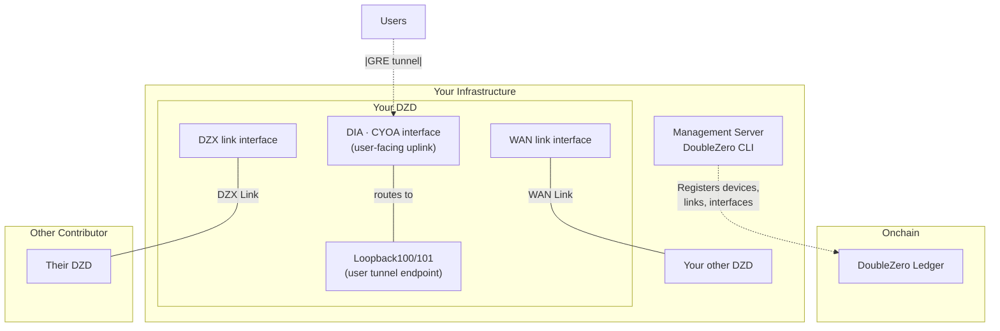
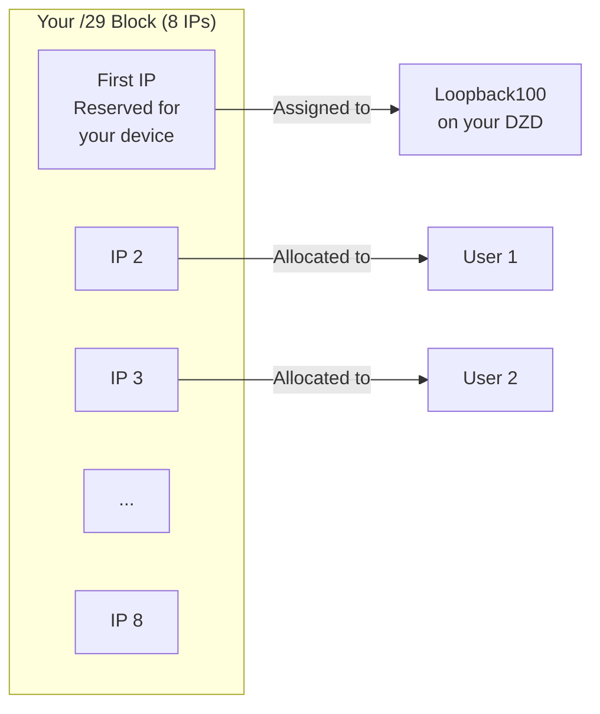
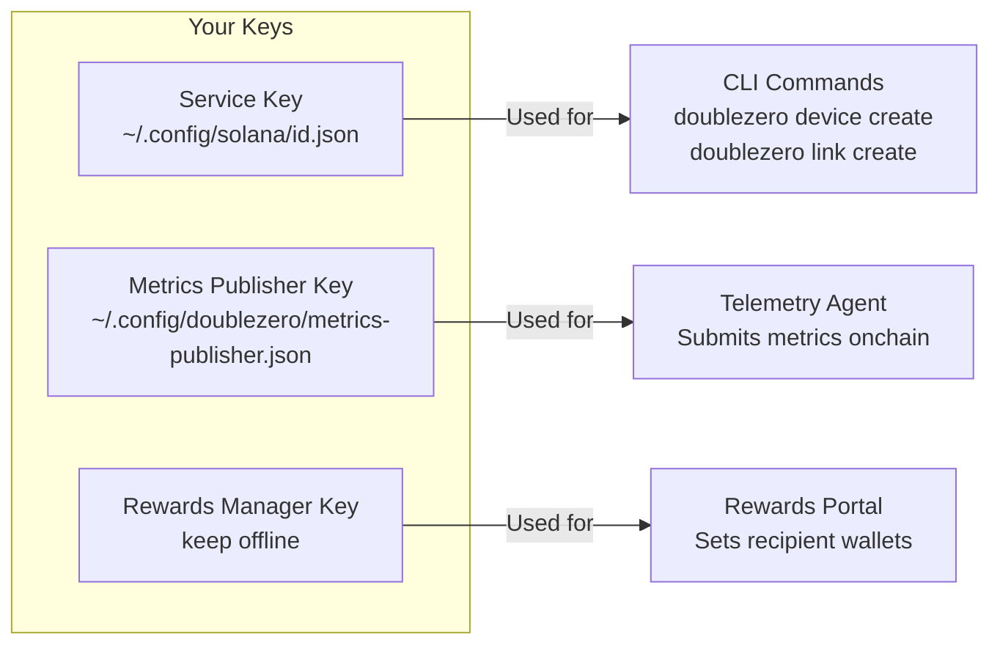
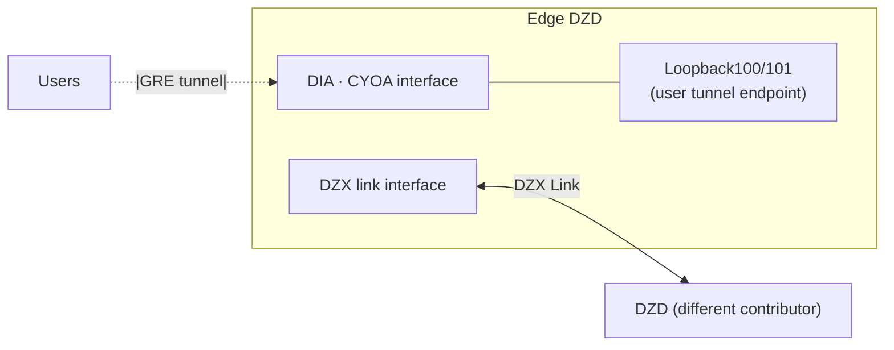
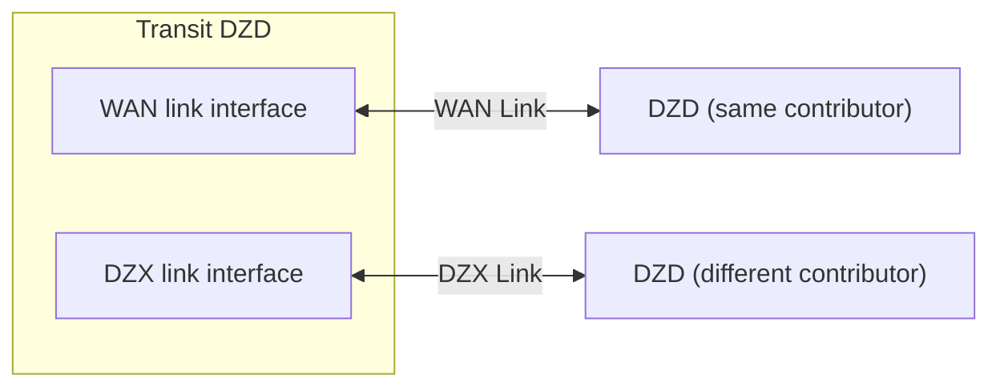
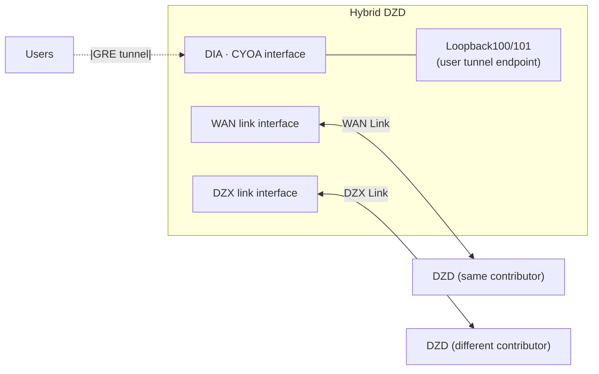
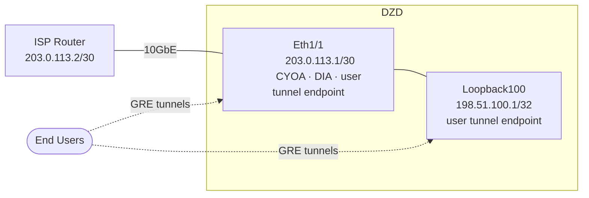

# デバイスプロビジョニングガイド

このガイドでは、DoubleZero Device (DZD) のプロビジョニングを最初から最後まで順を追って説明します。各フェーズは[オンボーディングチェックリスト](contribute-overview.md#onboarding-checklist)に対応しています。

---

## 全体の仕組み

このガイドでは、DoubleZero ネットワークがトラフィックをルーティングできるように、インフラストラクチャをオンチェーンに登録する手順を説明します。デバイスの登録が完全であるほど、ネットワークにとっての有用性が高まります。デバイスの完全なオンチェーン表現により、トラブルシューティングやキャパシティプランニングが改善され、コントローラーが適切な判断を下せるようになります。将来的には、コントローラーが設定の責任をより多く担うことを目指しています。

### 主要な概念

**インターフェース**

DZD のインターフェースにはさまざまな形態があります：イーサネットポート、ポートチャネル（複数のイーサネットポートで構成される LAG）、およびループバックです。ネットワーク上で役割を持つ各インターフェースは、プロトコルがその機能を認識できるよう、適切なフラグを付けてオンチェーンに登録する必要があります。

イーサネットポートとポートチャネルは以下の役割を果たすことができます：

| フラグ | 意味 |
|------|---------------|
| `--interface-dia dia` | インターフェースをダイレクトインターネットアクセスのアップリンクとしてマークします |
| `--interface-cyoa <subtype>` | ユーザーがこのインターフェースを通じて GRE トンネルを確立する方法を宣言します（例：パブリックインターネット経由、プライベートピアリングリンク経由） |
| `--user-tunnel-endpoint true` | このインターフェースはユーザーが GRE トンネルを終端するパブリック IP を持っています |

WAN または DZX リンクに使用されるインターフェースには特定のフラグは付けられず、帯域幅とともに登録され、リンク作成時に参照されます。

ループバックインターフェースはいくつかの目的に使用されます：

| ループバック | 意味 |
|----------|---------------|
| **Loopback100 / 101** | ユーザーが GRE トンネルを終端するパブリック IP を持ちます。`--user-tunnel-endpoint true` で登録します。 |
| **Loopback255** (`vpnv4`) | コントローラーが BGP ルーター ID、VPN-IPv4 ピアリング（ユニキャスト）、IS-IS アイデンティティ、およびセグメントルーティングに使用する IP を割り当てるために登録します |
| **Loopback256** (`ipv4`) | コントローラーが IPv4 BGP ピアリング（マルチキャスト）および MSDP セッションに使用する IP を割り当てるために登録します |

**リンク**

リンクはインターフェースとは別に登録され、リンクがインターフェースを参照するには、インターフェースがオンチェーンに存在している必要があります。WAN または DZX リンクを作成する際には、既に登録済みのインターフェースをリンクの物理エンドポイントとして指定します。すべてのインターフェースがリンクに紐づくわけではありません：DIA、CYOA、およびループバックインターフェースはリンクに接続されません。

| 用語 | 意味 |
|------|---------------|
| **WAN リンク** | 自身の DZD 間のリンク |
| **DZX リンク** | 自身の DZD と別のコントリビューターの DZD 間のリンク |

### アーキテクチャ概要


```mermaid
flowchart TB
    subgraph Onchain
        SC[DoubleZero Ledger]
    end

    subgraph Your Infrastructure
        MGMT[Management Server<br/>DoubleZero CLI]
        subgraph DZD[Your DZD]
            CYOA["DIA · CYOA interface<br/>(user-facing uplink)"]
            WAN_INTF["WAN link interface"]
            DZX_INTF["DZX link interface"]
            LO100["Loopback100/101<br/>(user tunnel endpoint)"]
        end
        DZD2[Your other DZD]
    end

    subgraph Other Contributor
        OtherDZD[Their DZD]
    end

    USERS["Users"]

    MGMT -.->|Registers devices,<br/>links, interfaces| SC
    WAN_INTF ---|WAN Link| DZD2
    DZX_INTF ---|DZX Link| OtherDZD
    USERS -.|GRE tunnel|.-> CYOA
    CYOA ---|routes to| LO100
```

---

## フェーズ 1: 前提条件

デバイスをプロビジョニングする前に、物理ハードウェアのセットアップといくつかの IP アドレスの割り当てが必要です。

### 必要なもの

| 要件 | 必要な理由 |
|-------------|-----------------|
| **DZD ハードウェア** | Arista 7280CR3A スイッチ（[ハードウェア仕様](contribute.md#hardware-requirements)を参照） |
| **ラックスペース** | DZD あたり 2U を確保（現在使用中は 1U）、適切なエアフローが必要。[ラックと電源](contribute.md#rack-power-requirements)を参照 |
| **電源** | 2 系統の独立した電源フィード、各系統が単独で全負荷を支えられること。[ラックと電源](contribute.md#rack-power-requirements)を参照 |
| **管理アクセス** | スイッチを設定するための SSH/コンソールアクセス |
| **インターネット接続** | メトリクスの公開およびコントローラーからの設定取得用 |
| **パブリック IPv4 ブロック** | DZ プレフィックスプール用に最低 /29（下記参照） |

### DoubleZero CLI のインストール

DoubleZero CLI（`doublezero`）は、プロビジョニング全体を通じてデバイスの登録、リンクの作成、コントリビューションの管理に使用されます。**管理サーバーまたは VM** にインストールしてください — DZD スイッチ自体にはインストールしないでください。スイッチには Config Agent と Telemetry Agent のみが実行されます（[フェーズ 4](#phase-4-link-establishment-agent-installation) でインストール）。

**Ubuntu / Debian:**
```bash
curl -1sLf https://dl.cloudsmith.io/public/malbeclabs/doublezero/setup.deb.sh | sudo -E bash
sudo apt-get install doublezero
```

**Rocky Linux / RHEL:**
```bash
curl -1sLf https://dl.cloudsmith.io/public/malbeclabs/doublezero/setup.rpm.sh | sudo -E bash
sudo yum install doublezero
```

デーモンが実行中であることを確認します：
```bash
sudo systemctl status doublezerod
```

### DZ プレフィックスの理解

DZ プレフィックスは、DoubleZero プロトコルが IP 割り当てのために管理するパブリック IP アドレスのブロックです。


```mermaid
flowchart LR
    subgraph "Your /29 Block (8 IPs)"
        IP1["First IP<br/>Reserved for<br/>your device"]
        IP2["IP 2"]
        IP3["IP 3"]
        IP4["..."]
        IP8["IP 8"]
    end

    IP1 -->|Assigned to| LO[Loopback100<br/>on your DZD]
    IP2 -->|Allocated to| U1[User 1]
    IP3 -->|Allocated to| U2[User 2]
```

**DZ プレフィックスの使用方法：**

- **最初の IP**: デバイス用に予約（Loopback100 インターフェースに割り当て）
- **残りの IP**: DZD に接続する特定のユーザータイプに割り当て：
    - `IBRLWithAllocatedIP` ユーザー
    - `EdgeFiltering` ユーザー（将来のユースケース）
- **IBRL ユーザー**: このプールからは消費しません（独自のパブリック IP を使用）

!!! warning "DZ プレフィックスのルール"
    **これらのアドレスを以下の目的で使用することはできません：**

    - 自身のネットワーク機器
    - DIA インターフェースのポイントツーポイントリンク
    - 管理インターフェース
    - DZ プロトコル外のインフラストラクチャ

    **要件：**

    - **グローバルにルーティング可能（パブリック）** な IPv4 アドレスである必要があります
    - プライベート IP レンジ（10.x、172.16-31.x、192.168.x）はスマートコントラクトによって拒否されます
    - **最小サイズ: /29**（8 アドレス）、より大きなプレフィックスが推奨（例：/28、/27）
    - ブロック全体が利用可能である必要があります — アドレスの事前割り当てはしないでください

    自身の機器用のアドレス（DIA インターフェース IP、管理用など）が必要な場合は、**別のアドレスプール**を使用してください。

---

## フェーズ 2: アカウントセットアップ

このフェーズでは、ネットワーク上であなたとデバイスを識別する暗号鍵を作成し、報酬管理を設定します。

手順がこの順序で実行されるのには理由があります：まずリポジトリアクセス（リポジトリには後続のステップの手順が含まれているため）、次に鍵、そして報酬。一部のステップでは DZF の対応を待つ必要があり、以下の各ステップでそれが示されています。

### CLI の実行場所

!!! warning "スイッチに CLI をインストールしないでください"
    DoubleZero CLI（`doublezero`）は、Arista スイッチではなく、**管理サーバーまたは VM** にインストールしてください。

    ```mermaid
    flowchart LR
        subgraph "Management Server/VM"
            CLI[DoubleZero CLI]
            KEYS[Your Keypairs]
        end

        subgraph "Your DZD Switch"
            CA[Config Agent]
            TA[Telemetry Agent]
        end

        CLI -->|Creates devices, links| BC[Blockchain]
        CA -->|Pulls config| CTRL[Controller]
        TA -->|Submits metrics| BC
    ```

    | 管理サーバーにインストール | スイッチにインストール |
    |-----------------------------|-------------------|
    | `doublezero` CLI | Config Agent |
    | サービスキーペア | Telemetry Agent |
    | メトリクスパブリッシャーキーペア | メトリクスパブリッシャーキーペア（コピー） |

### 鍵とは何ですか？

鍵はセキュアなログイン認証情報のようなものです：

- **サービスキー**: コントリビューターとしてのあなたのアイデンティティ — CLI コマンドの実行に使用
- **メトリクスパブリッシャーキー**: テレメトリデータ送信のためのデバイスのアイデンティティ
- **報酬マネージャーキー**: どのウォレットが報酬を受け取るかを制御 — コントリビューターリポジトリの[報酬管理](https://github.com/malbeclabs/contributors#rewards-management)を参照

3 つすべてが暗号キーペア（共有する公開鍵と、秘密にする秘密鍵）です。


```mermaid
flowchart LR
    subgraph "Your Keys"
        SK[Service Key<br/>~/.config/solana/id.json]
        MK[Metrics Publisher Key<br/>~/.config/doublezero/metrics-publisher.json]
        RK[Rewards Manager Key<br/>keep offline]
    end

    SK -->|Used for| CLI[CLI Commands<br/>doublezero device create<br/>doublezero link create]
    MK -->|Used for| TEL[Telemetry Agent<br/>Submits metrics onchain]
    RK -->|Used for| REW[Rewards Portal<br/>Sets recipient wallets]
```

!!! note "報酬マネージャーキーは別に保管してください"
    サービスキーとメトリクスパブリッシャーキーは管理サーバーとスイッチに配置されます。報酬マネージャーキーはお金の送金先を制御するため、それらのマシンとは別に保管してください。受取ウォレットを変更する場合にのみ必要です。

### ステップ 2.1: コントリビューターリポジトリへのアクセスをリクエスト

DoubleZero Foundation または Malbec Labs に連絡し、**GitHub ユーザー名**を伝えてください。

プライベートリポジトリ [malbeclabs/contributors](https://github.com/malbeclabs/contributors) へのアクセスが付与されます。これを最初に行ってください：このリポジトリにはベースデバイス設定、TCAM および ACL プロファイル、および以下のステップで必要な報酬管理の手順が含まれています。

### ステップ 2.2: サービスキーの生成

これは DoubleZero とのやり取りに使用するメインのアイデンティティです。

```bash
doublezero keygen
```

デフォルトの場所にキーペアが作成されます。出力に**公開鍵**が表示されます — これは DZF と共有するものです。

### ステップ 2.3: メトリクスパブリッシャーキーの生成

この鍵は Telemetry Agent がメトリクス送信に署名するために使用されます。

```bash
doublezero keygen -o ~/.config/doublezero/metrics-publisher.json
```

### ステップ 2.4: サービスキーを DZF に提出

DZF に**サービスキーの公開鍵**を送付してください。

DZF がオンチェーンに**コントリビューターアカウント**を作成し、完了後に確認の連絡があります。

!!! danger "公開鍵のみ"
    秘密鍵やキーペアファイルを DZF を含む誰にも送らないでください。必要なのは公開鍵のみです。

### ステップ 2.5: アカウントの確認

確認が取れたら、コントリビューターアカウントの存在を確認します：

```bash
doublezero contributor list
```

リストにあなたのコントリビューターコードが表示されるはずです。

### ステップ 2.6: 報酬管理の設定

報酬管理は、コントリビューションで獲得した [2Z](glossary.md#2z-token) をどのウォレットがどのような比率で受け取るかを決定します。

ステップ 2.1 でアクセスを取得したコントリビューターリポジトリの[報酬管理](https://github.com/malbeclabs/contributors#rewards-management)に従ってください。

!!! note "これは残りのセットアップをブロックしません"
    報酬管理が完了していなくても、デバイスのプロビジョニング、リンクの確立、トラフィックの転送を開始できます。以下のフェーズは報酬管理とは独立して進めてください。

---

## フェーズ 3: デバイスプロビジョニング

ここでは、物理デバイスをブロックチェーンに登録し、インターフェースを設定します。

### デバイスタイプの理解

**Edge** — ユーザー接続のみを受け入れる


```mermaid
flowchart LR
    subgraph EDZD[Edge DZD]
        E_CYOA["DIA · CYOA interface"]
        E_TUN["Loopback100/101
        (user tunnel endpoint)"]
        E_DZX["DZX link interface"]
        E_CYOA --- E_TUN
    end
    EU["Users"] -.|GRE tunnel|.-> E_CYOA
    E_DZX <-->|DZX Link| ED["DZD (different contributor)"]
```

**Transit** — デバイス間のトラフィックを転送、ユーザー接続なし


```mermaid
flowchart LR
    subgraph TDZD[Transit DZD]
        T_WAN["WAN link interface"]
        T_DZX["DZX link interface"]
    end
    T_WAN <-->|WAN Link| T2["DZD (same contributor)"]
    T_DZX <-->|DZX Link| TD["DZD (different contributor)"]
```

**Hybrid** — ユーザー接続とバックボーンの両方、最も一般的


```mermaid
flowchart LR
    subgraph HDZD[Hybrid DZD]
        H_CYOA["DIA · CYOA interface"]
        H_TUN["Loopback100/101
        (user tunnel endpoint)"]
        H_WAN["WAN link interface"]
        H_DZX["DZX link interface"]
        H_CYOA --- H_TUN
    end
    HU["Users"] -.|GRE tunnel|.-> H_CYOA
    H_WAN <-->|WAN Link| H2["DZD (same contributor)"]
    H_DZX <-->|DZX Link| HD["DZD (different contributor)"]
```

| タイプ | 機能 | 使用するケース |
|------|--------------|-------------|
| **Edge** | ユーザー接続のみを受け入れる | 単一ロケーション、ユーザー向けのみ |
| **Transit** | デバイス間のトラフィックを転送 | バックボーン接続、ユーザーなし |
| **Hybrid** | ユーザー接続とバックボーンの両方 | 最も一般的 — すべてに対応 |

### ステップ 3.1: ロケーションとエクスチェンジの検索

デバイスを作成する前に、データセンターのロケーションと最寄りのエクスチェンジのコードを確認します：

```bash
# 利用可能なロケーション（データセンター）の一覧
doublezero location list

# 利用可能なエクスチェンジ（相互接続ポイント）の一覧
doublezero exchange list
```

### ステップ 3.2: デバイスのオンチェーン登録

ブロックチェーンにデバイスを登録します：

```bash
doublezero device create \
  --code <YOUR_DEVICE_CODE> \
  --contributor <YOUR_CONTRIBUTOR_CODE> \
  --device-type hybrid \
  --location <LOCATION_CODE> \
  --exchange <EXCHANGE_CODE> \
  --public-ip <DEVICE_PUBLIC_IP> \
  --dz-prefixes <YOUR_DZ_PREFIX>
```

**例：**

```bash
doublezero device create \
  --code nyc-dz001 \
  --contributor acme \
  --device-type hybrid \
  --location EQX-NY5 \
  --exchange nyc \
  --public-ip "203.0.113.10" \
  --dz-prefixes "198.51.100.0/28"
```

**期待される出力：**

```
Signature: 4vKz8H...truncated...7xPq2
```

デバイスが作成されたことを確認します：

```bash
doublezero device list | grep nyc-dz001
```

**パラメータの説明：**

| パラメータ | 意味 |
|-----------|---------------|
| `--code` | デバイスの一意な名前（例：`nyc-dz001`） |
| `--contributor` | コントリビューターコード（DZF から付与） |
| `--device-type` | `hybrid`、`transit`、または `edge` |
| `--location` | `location list` から取得したデータセンターコード |
| `--exchange` | `exchange list` から取得した最寄りのエクスチェンジコード |
| `--public-ip` | ユーザーがインターネット経由でデバイスに接続するパブリック IP |
| `--dz-prefixes` | ユーザー用に割り当てられた IP ブロック |

### ステップ 3.3: 必須ループバックインターフェースの作成

すべてのデバイスには、内部ルーティング用に 2 つのループバックインターフェースが必要です：

```bash
# VPNv4 ループバック
doublezero device interface create <DEVICE_CODE> Loopback255 --loopback-type vpnv4

# IPv4 ループバック
doublezero device interface create <DEVICE_CODE> Loopback256 --loopback-type ipv4
```

**期待される出力（各コマンドごと）：**

```
Signature: 3mNx9K...truncated...8wRt5
```

### ステップ 3.4: 物理インターフェースの作成

WAN または DZX リンクに使用される物理インターフェースを登録します。これらのインターフェースは、リンクを作成してそれらを参照する前にオンチェーンに存在している必要があります。このステップではインターフェースと帯域幅のみを登録し、リンクは後のステップで作成します。

```bash
doublezero device interface create <DEVICE_CODE> <INTERFACE_NAME> \
  --bandwidth <PORT_SPEED>
```

**例：**

```bash
doublezero device interface create nyc-dz001 Ethernet1/1 \
  --bandwidth 10Gbps
```

**期待される出力：**

```
Signature: 7pQw2R...truncated...4xKm9
```

WAN または DZX リンクのエンドポイントとして使用する各インターフェースについて、これを繰り返します。CYOA および DIA インターフェースは次のステップで別途登録します。

### ステップ 3.5: CYOA インターフェースの作成（Edge/Hybrid デバイス用）

Hybrid および Edge の DZD には、ユーザーが GRE トンネルを終端する **2 つのパブリック IP アドレス**が必要です。ユーザーはユニキャスト、マルチキャスト、またはその両方で接続でき、どの IP がどの目的に使用されるかはユーザーごとにローテーションされます。

両方の IP は、物理インターフェースまたはループバックのいずれかで `--user-tunnel-endpoint true` を付けて登録する必要があります。これにはデバイス作成時に提供した IP も含まれます — その IP もここで明示的に登録する必要があります。

IP が制限されている場合は、DZ プレフィックスの最初の `/32` を 2 つの IP のうちの 1 つとして使用できます。

#### CYOA と DIA

| タイプ | フラグ | 目的 |
|------|------|---------|
| DIA | `--interface-dia dia` | ポートをダイレクトインターネットアクセスとしてマーク |
| CYOA | `--interface-cyoa <subtype>` | ユーザーがデバイスに GRE トンネルで接続する方法を宣言 |

CYOA フラグは常に**物理インターフェース**（イーサネットポートまたはポートチャネル）に設定します。ループバックには設定しないでください。

| CYOA サブタイプ | 使用するケース |
|-------------|-------------|
| `gre-over-dia` | ユーザーがパブリックインターネット経由で接続。最も一般的。 |
| `gre-over-private-peering` | ユーザーがダイレクトクロスコネクトまたはプライベート回線経由で接続 |
| `gre-over-public-peering` | ユーザーがインターネットエクスチェンジ（IX）でピアリング |
| `gre-over-fabric` | ユーザーが同一施設に設置され、ローカルファブリック経由で接続 |
| `gre-over-cable` | 単一の専用ユーザーへの直接ケーブル接続 |

#### シナリオ A: 単一の物理インターフェース

ISP への 1 本の物理アップリンク。Ethernet1/1 が CYOA および DIA インターフェースとして 2 つのパブリック IP のうち 1 つを持ちます。Loopback100 が 2 つ目のパブリック IP を持ちます。


```mermaid
flowchart LR
    USERS(["End Users"])

    subgraph DZD["DZD"]
        E1["Eth1/1
        203.0.113.1/30
        CYOA · DIA · user tunnel endpoint"]
        LO["Loopback100
        198.51.100.1/32\n        user tunnel endpoint"]
        E1 --- LO
    end

    ISP["ISP Router
    203.0.113.2/30"]

    ISP -- "10GbE" --- E1
    USERS -. "GRE tunnels" .-> E1
    USERS -. "GRE tunnels" .-> LO
```

| インターフェース | `--interface-cyoa` | `--interface-dia` | `--ip-net` | `--bandwidth` | `--cir` | `--routing-mode` | `--user-tunnel-endpoint` |
|-----------|-------------------|------------------|------------|---------------|---------|-----------------|--------------------------|
| Ethernet1/1 | `gre-over-dia` | `dia` | コントリビューター割り当て IP/サブネット | ポート速度 | 確約レート | `bgp` または `static` | `true` |
| Loopback100 | — | — | パブリック /32 | `0bps` | — | — | `true` |

シナリオ A に基づくコマンド実行例：
```bash
doublezero device interface create mydzd-nyc01 Ethernet1/1 \
  --interface-cyoa gre-over-dia \
  --interface-dia dia \
  --ip-net 203.0.113.1/30 \
  --bandwidth 10Gbps \
  --cir 1Gbps \
  --routing-mode bgp \
  --user-tunnel-endpoint true

doublezero device interface create mydzd-nyc01 Loopback100 \
  --ip-net 198.51.100.1/32 \
  --bandwidth 0bps \
  --user-tunnel-endpoint true
```

#### シナリオ B: ポートチャネル（LAG）

DZD が IP を持つポートチャネルを介してアップストリームデバイスに接続します。ポートチャネルが 1 つのパブリック IP を持ち、CYOA エンドポイントとなります。Loopback100 が 2 つ目のパブリック IP を持ちます。

```mermaid
flowchart LR
    USERS(["End Users"])

    subgraph SW["Upstream Router / Switch"]
        SWPC(["bond0
        203.0.113.2/30"])
    end

    subgraph DZD["DZD"]
        subgraph PC["Port-Channel1 · 203.0.113.1/30 