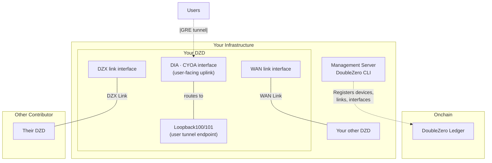
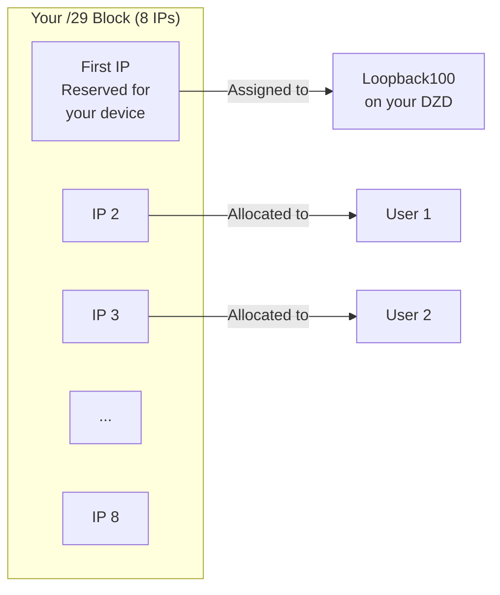
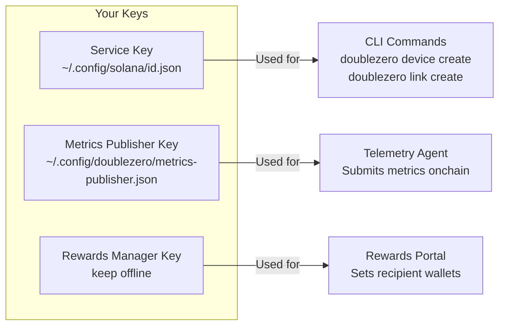
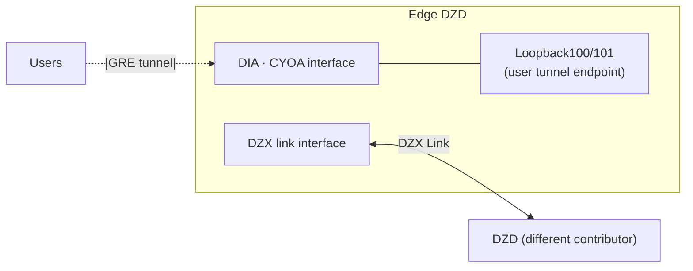
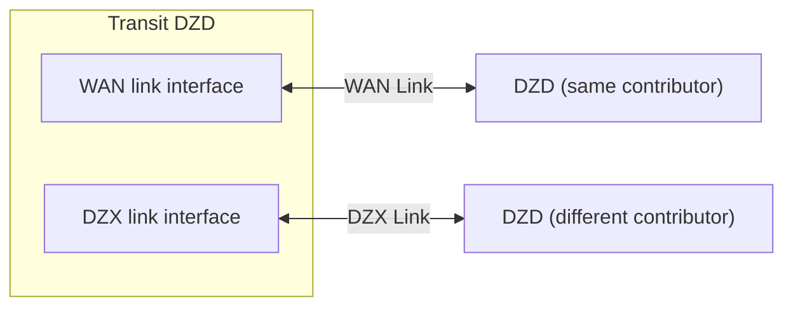
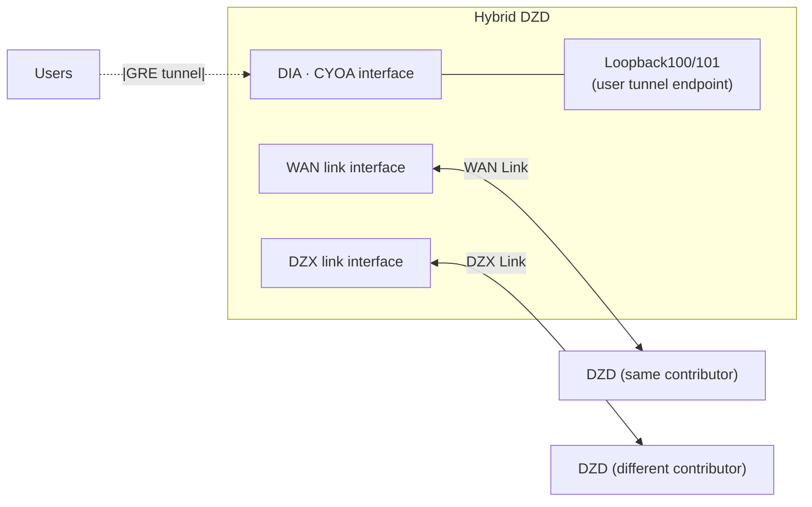

# デバイスプロビジョニングガイド

このガイドでは、DoubleZero デバイス（DZD）のプロビジョニングを最初から最後まで手順を追って説明します。各フェーズは[オンボーディングチェックリスト](contribute-overview.md#onboarding-checklist)に対応しています。

---

## 全体の仕組み

このガイドでは、DoubleZero ネットワークがインフラストラクチャを通じてトラフィックをルーティングできるように、インフラストラクチャをオンチェーンに登録する手順を説明します。デバイスの登録が完全であるほど、ネットワークにとってより有用なものとなります。デバイスの完全なオンチェーン表現により、トラブルシューティング、キャパシティプランニングが改善され、コントローラーが適切な判断を行えるようになります。将来的には、コントローラーがより多くの構成責任を担うことが目標です。

### 主要な概念

**インターフェース**

DZD のインターフェースにはさまざまな形態があります：イーサネットポート、ポートチャネル（複数のイーサネットポートで構成される LAG）、ループバックです。ネットワークで役割を持つ各インターフェースは、プロトコルがその役割を認識できるよう、適切なフラグを付けてオンチェーンに登録する必要があります。

イーサネットポートとポートチャネルは以下の役割を果たすことができます：

| フラグ | 意味 |
|------|---------------|
| `--interface-dia dia` | インターフェースをダイレクトインターネットアクセスのアップリンクとしてマーク |
| `--interface-cyoa <subtype>` | ユーザーがこのインターフェースを通じて GRE トンネルを確立する方法を宣言（例：パブリックインターネット経由、プライベートピアリングリンク経由） |
| `--user-tunnel-endpoint true` | このインターフェースはユーザーが GRE トンネルを終端するパブリック IP を持つ |

WAN または DZX リンクに使用されるインターフェースには特定のフラグは付きません。帯域幅とともに登録され、リンク作成時に参照されます。

ループバックインターフェースにはいくつかの目的があります：

| ループバック | 意味 |
|----------|---------------|
| **Loopback100 / 101** | ユーザーが GRE トンネルを終端するパブリック IP を持つ。`--user-tunnel-endpoint true` で登録。 |
| **Loopback255** (`vpnv4`) | コントローラーが BGP ルーター ID、VPN-IPv4 ピアリング（ユニキャスト）、IS-IS アイデンティティ、セグメントルーティングに使用する IP を割り当てられるよう登録 |
| **Loopback256** (`ipv4`) | コントローラーが IPv4 BGP ピアリング（マルチキャスト）および MSDP セッションに使用する IP を割り当てられるよう登録 |

**リンク**

リンクはインターフェースとは別に登録され、リンクがインターフェースを参照するには、インターフェースが先にオンチェーンに存在している必要があります。WAN または DZX リンクを作成する際、リンクの物理エンドポイントとして既に登録済みのインターフェースを指定します。すべてのインターフェースがリンクに紐づくわけではありません：DIA、CYOA、ループバックインターフェースはリンクに接続されません。

| 用語 | 意味 |
|------|---------------|
| **WAN リンク** | 自分が所有する 2 つの DZD 間のリンク |
| **DZX リンク** | 自分の DZD と他のコントリビューターの DZD 間のリンク |

### アーキテクチャ概要


```mermaid
flowchart TB
    subgraph Onchain
        SC[DoubleZero Ledger]
    end

    subgraph Your Infrastructure
        MGMT[Management Server<br/>DoubleZero CLI]
        subgraph DZD[Your DZD]
            CYOA["DIA · CYOA interface<br/>(user-facing uplink)"]
            WAN_INTF["WAN link interface"]
            DZX_INTF["DZX link interface"]
            LO100["Loopback100/101<br/>(user tunnel endpoint)"]
        end
        DZD2[Your other DZD]
    end

    subgraph Other Contributor
        OtherDZD[Their DZD]
    end

    USERS["Users"]

    MGMT -.->|Registers devices,<br/>links, interfaces| SC
    WAN_INTF ---|WAN Link| DZD2
    DZX_INTF ---|DZX Link| OtherDZD
    USERS -.|GRE tunnel|.-> CYOA
    CYOA ---|routes to| LO100
```

---

## フェーズ 1：前提条件

デバイスをプロビジョニングする前に、物理ハードウェアのセットアップといくつかの IP アドレスの割り当てが必要です。

### 必要なもの

| 要件 | 必要な理由 |
|-------------|-----------------|
| **DZD ハードウェア** | Arista 7280CR3A スイッチ（[ハードウェア仕様](contribute.md#hardware-requirements)を参照） |
| **ラックスペース** | DZD あたり 1U、適切なエアフローを確保。[ラック＆電源](contribute.md#rack-power-requirements)を参照 |
| **電源** | 2 系統の独立した電源フィード、各系統が単独で全負荷を賄えること。[ラック＆電源](contribute.md#rack-power-requirements)を参照 |
| **管理アクセス** | スイッチ設定のための SSH/コンソールアクセス |
| **インターネット接続** | メトリクスの公開およびコントローラーからの設定取得用 |
| **パブリック IPv4 ブロック** | DZ プレフィックスプール用に最低 /29（下記参照） |

### DoubleZero CLI のインストール

DoubleZero CLI（`doublezero`）は、プロビジョニング全体を通じてデバイスの登録、リンクの作成、コントリビューションの管理に使用されます。**管理サーバーまたは VM** にインストールしてください — DZD スイッチ本体にはインストールしないでください。スイッチには Config Agent と Telemetry Agent のみがインストールされます（[フェーズ 4](#phase-4-link-establishment-agent-installation) でインストール）。

**Ubuntu / Debian:**
```bash
curl -1sLf https://dl.cloudsmith.io/public/malbeclabs/doublezero/setup.deb.sh | sudo -E bash
sudo apt-get install doublezero
```

**Rocky Linux / RHEL:**
```bash
curl -1sLf https://dl.cloudsmith.io/public/malbeclabs/doublezero/setup.rpm.sh | sudo -E bash
sudo yum install doublezero
```

デーモンが実行中であることを確認：
```bash
sudo systemctl status doublezerod
```

### DZ プレフィックスについて

DZ プレフィックスは、DoubleZero プロトコルが IP 割り当てを管理するパブリック IP アドレスのブロックです。


```mermaid
flowchart LR
    subgraph "Your /29 Block (8 IPs)"
        IP1["First IP<br/>Reserved for<br/>your device"]
        IP2["IP 2"]
        IP3["IP 3"]
        IP4["..."]
        IP8["IP 8"]
    end

    IP1 -->|Assigned to| LO[Loopback100<br/>on your DZD]
    IP2 -->|Allocated to| U1[User 1]
    IP3 -->|Allocated to| U2[User 2]
```

**DZ プレフィックスの使用方法：**

- **最初の IP**：デバイス用に予約（Loopback100 インターフェースに割り当て）
- **残りの IP**：DZD に接続する特定のユーザータイプに割り当て：
    - `IBRLWithAllocatedIP` ユーザー
    - `EdgeFiltering` ユーザー（将来のユースケース）
- **IBRL ユーザー**：このプールからは消費しません（独自のパブリック IP を使用）

!!! warning "DZ プレフィックスのルール"
    **これらのアドレスを以下の用途に使用することはできません：**

    - 自社のネットワーク機器
    - DIA インターフェースのポイントツーポイントリンク
    - 管理インターフェース
    - DZ プロトコル外のインフラストラクチャ

    **要件：**

    - **グローバルにルーティング可能な（パブリック）** IPv4 アドレスである必要があります
    - プライベート IP レンジ（10.x、172.16-31.x、192.168.x）はスマートコントラクトにより拒否されます
    - **最小サイズ：/29**（8 アドレス）、より大きなプレフィックスが推奨（例：/28、/27）
    - ブロック全体が利用可能である必要があります — アドレスを事前に割り当てないでください

    自社機器用のアドレス（DIA インターフェース IP、管理用など）が必要な場合は、**別のアドレスプール**を使用してください。

---

## フェーズ 2：アカウントセットアップ

このフェーズでは、ネットワーク上であなたとデバイスを識別する暗号鍵を作成し、報酬の送付先を指定します。

このフェーズでは 3 つの鍵が生成されます：サービスキー、メトリクスパブリッシャーキー、報酬マネージャーキーです。3 つすべての公開鍵を[ステップ 2.4](#step-24-submit-keys-to-dzf) でまとめて DZF に提出してください。[報酬管理](contribute-rewards.md)で報酬に関する詳細を説明しています。

### CLI の実行場所

!!! warning "スイッチに CLI をインストールしないでください"
    DoubleZero CLI（`doublezero`）は、Arista スイッチではなく **管理サーバーまたは VM** にインストールしてください。

    ```mermaid
    flowchart LR
        subgraph "Management Server/VM"
            CLI[DoubleZero CLI]
            KEYS[Your Keypairs]
        end

        subgraph "Your DZD Switch"
            CA[Config Agent]
            TA[Telemetry Agent]
        end

        CLI -->|Creates devices, links| BC[Blockchain]
        CA -->|Pulls config| CTRL[Controller]
        TA -->|Submits metrics| BC
    ```

    | 管理サーバーにインストール | スイッチにインストール |
    |-----------------------------|-------------------|
    | `doublezero` CLI | Config Agent |
    | サービスキーペア | Telemetry Agent |
    | メトリクスパブリッシャーキーペア | メトリクスパブリッシャーキーペア（コピー） |

### キーとは何か？

キーは安全なログイン資格情報のようなものです：

- **サービスキー**：コントリビューターとしてのアイデンティティ - CLI コマンドの実行に使用
- **メトリクスパブリッシャーキー**：テレメトリデータ送信時のデバイスのアイデンティティ
- **報酬マネージャーキー**：報酬を受け取るウォレットを制御 - [報酬管理](contribute-rewards.md)を参照

3 つすべてが暗号キーペア（共有する公開鍵と秘密にする秘密鍵）です。


```mermaid
flowchart LR
    subgraph "Your Keys"
        SK[Service Key<br/>~/.config/solana/id.json]
        MK[Metrics Publisher Key<br/>~/.config/doublezero/metrics-publisher.json]
        RK[Rewards Manager Key<br/>keep offline]
    end

    SK -->|Used for| CLI[CLI Commands<br/>doublezero device create<br/>doublezero link create]
    MK -->|Used for| TEL[Telemetry Agent<br/>Submits metrics onchain]
    RK -->|Used for| REW[Rewards Portal<br/>Sets recipient wallets]
```

!!! note "報酬マネージャーキーは分離して保管してください"
    サービスキーとメトリクスパブリッシャーキーは管理サーバーとスイッチに置きます。報酬マネージャーキーはお金の送付先を制御するため、それらのマシンには置かないでください。受取ウォレットを変更するときにのみ必要です。

### ステップ 2.1：サービスキーの生成

これは DoubleZero とのやり取りに使用するメインのアイデンティティです。

```bash
doublezero keygen
```

デフォルトの場所にキーペアが作成されます。出力には **公開鍵** が表示されます — これが DZF と共有するものです。

### ステップ 2.2：メトリクスパブリッシャーキーの生成

このキーは Telemetry Agent がメトリクス送信に署名するために使用します。

```bash
doublezero keygen -o ~/.config/doublezero/metrics-publisher.json
```

### ステップ 2.3：報酬マネージャーウォレットの作成

3 つ目のキーです。報酬を受け取るウォレットを制御しますが、報酬自体を保持しません。

自分で管理し署名できる Solana ウォレットを作成し、トランザクション手数料を賄うために約 0.01 SOL をチャージしてください。ハードウェアウォレットが良い選択です。サービスキーを再利用しないでください。

この時点ではウォレットだけが必要です。実際に報酬を受け取るウォレットの設定は、DZF がこのキーを登録した後の[ステップ 2.7](#step-27-set-your-reward-recipients) で行います。

### ステップ 2.4：DZF へのキー提出

DoubleZero Foundation または Malbec Labs に連絡し、以下を提供してください：

1. **サービスキーの公開鍵**
2. **報酬マネージャーの公開鍵**（ステップ 2.3 で作成したもの）
3. **GitHub ユーザー名**（リポジトリアクセス用）

3 つをまとめて送信してください。DZF はサービスキーと報酬マネージャーキーを別々のオンチェーントランザクションで登録するため、同時に送ることでラウンドトリップを節約できます。

!!! danger "公開鍵のみ"
    秘密鍵やキーペアファイルを DZF を含む誰にも送信しないでください。DZF が必要とするのは公開鍵のみです。

DZF は以下を行います：

- オンチェーンに **コントリビューターアカウント** を作成
- サービスキーに対して **報酬マネージャーキー** を登録
- プライベート **コントリビューターリポジトリ** へのアクセスを付与

### ステップ 2.5：アカウントの確認

確認が取れたら、コントリビューターアカウントが存在することを確認します：

```bash
doublezero contributor list
```

リストにあなたのコントリビューターコードが表示されるはずです。

報酬マネージャーキーも登録されたか確認します：

```bash
doublezero-solana revenue-distribution fetch contributor-rewards \
    --service-key <YourServiceKeyPublicKey> -u mainnet-beta
```

`manager` 列に報酬マネージャーの公開鍵が表示されるはずです。空の場合は、DZF にそのステップの完了を依頼してください。

### ステップ 2.6：コントリビューターリポジトリへのアクセス

[malbeclabs/contributors](https://github.com/malbeclabs/contributors) リポジトリには以下が含まれています：

- 基本デバイス設定
- TCAM プロファイル
- ACL 設定
- 追加のセットアップ手順

デバイス固有の設定については、そこの手順に従ってください。

### ステップ 2.7：報酬受取先の設定

報酬を受け取るウォレットとその比率を指定します。デバイスがトラフィックを処理し始める前にこれを行ってください。報酬はリンクが稼働した瞬間から蓄積されますが、受取ウォレットを指定するまでプロトコルは支払いを行えません。

報酬マネージャーウォレットで [doublezero.xyz/rewards](https://doublezero.xyz/rewards) にサインインし、サービスキーを選択してから、各受取ウォレットとそのパーセンテージを入力します。パーセンテージの合計は 100 にする必要があります。

!!! warning "各受取先には 2Z トークンアカウントが必要です"
    プロトコルはプレーントークン転送で 2Z を送信し、トークンアカウントを自動作成しません。2Z トークンアカウントを持たない受取ウォレットは、そのエポックの支払いが失敗する原因となります。

CLI による代替手段、トークンアカウントの確認方法、結果の検証方法を含む完全なウォークスルーは[報酬管理](contribute-rewards.md)を参照してください。

---

## フェーズ 3：デバイスプロビジョニング

ここでは、物理デバイスをブロックチェーンに登録し、インターフェースを設定します。

### デバイスタイプの理解

**Edge** — ユーザー接続のみを受け付ける


```mermaid
flowchart LR
    subgraph EDZD[Edge DZD]
        E_CYOA["DIA · CYOA interface"]
        E_TUN["Loopback100/101
        (user tunnel endpoint)"]
        E_DZX["DZX link interface"]
        E_CYOA --- E_TUN
    end
    EU["Users"] -.|GRE tunnel|.-> E_CYOA
    E_DZX <-->|DZX Link| ED["DZD (different contributor)"]
```

**Transit** — デバイス間のトラフィックを転送、ユーザー接続なし


```mermaid
flowchart LR
    subgraph TDZD[Transit DZD]
        T_WAN["WAN link interface"]
        T_DZX["DZX link interface"]
    end
    T_WAN <-->|WAN Link| T2["DZD (same contributor)"]
    T_DZX <-->|DZX Link| TD["DZD (different contributor)"]
```

**Hybrid** — ユーザー接続とバックボーンの両方、最も一般的


```mermaid
flowchart LR
    subgraph HDZD[Hybrid DZD]
        H_CYOA["DIA · CYOA interface"]
        H_TUN["Loopback100/101
        (user tunnel endpoint)"]
        H_WAN["WAN link interface"]
        H_DZX["DZX link interface"]
        H_CYOA --- H_TUN
    end
    HU["Users"] -.|GRE tunnel|.-> H_CYOA
    H_WAN <-->|WAN Link| H2["DZD (same contributor)"]
    H_DZX <-->|DZX Link| HD["DZD (different contributor)"]
```

| タイプ | 役割 | 使用する場面 |
|------|--------------|-------------|
| **Edge** | ユーザー接続のみを受け付ける | 単一拠点、ユーザー対応のみ |
| **Transit** | デバイス間のトラフィックを転送 | バックボーン接続、ユーザーなし |
| **Hybrid** | ユーザー接続とバックボーンの両方 | 最も一般的 — すべてを担う |

### ステップ 3.1：ロケーションとエクスチェンジの確認

デバイスを作成する前に、データセンターのロケーションと最寄りのエクスチェンジのコードを調べます：

```bash
# 利用可能なロケーション（データセンター）を一覧表示
doublezero location list

# 利用可能なエクスチェンジ（相互接続ポイント）を一覧表示
doublezero exchange list
```

### ステップ 3.2：デバイスのオンチェーン作成

デバイスをブロックチェーンに登録します：

```bash
doublezero device create \
  --code <YOUR_DEVICE_CODE> \
  --contributor <YOUR_CONTRIBUTOR_CODE> \
  --device-type hybrid \
  --location <LOCATION_CODE> \
  --exchange <EXCHANGE_CODE> \
  --public-ip <DEVICE_PUBLIC_IP> \
  --dz-prefixes <YOUR_DZ_PREFIX>
```

**例：**

```bash
doublezero device create \
  --code nyc-dz001 \
  --contributor acme \
  --device-type hybrid \
  --location EQX-NY5 \
  --exchange nyc \
  --public-ip "203.0.113.10" \
  --dz-prefixes "198.51.100.0/28"
```

**期待される出力：**

```
Signature: 4vKz8H...truncated...7xPq2
```

デバイスが作成されたことを確認します：

```bash
doublezero device list | grep nyc-dz001
```

**パラメータの説明：**

| パラメータ | 意味 |
|-----------|---------------|
| `--code` | デバイスの一意な名前（例：`nyc-dz001`） |
| `--contributor` | コントリビューターコード（DZF より付与） |
| `--device-type` | `hybrid`、`transit`、または `edge` |
| `--location` | `location list` から取得したデータセンターコード |
| `--exchange` | `exchange list` から取得した最寄りのエクスチェンジコード |
| `--public-ip` | ユーザーがインターネット経由でデバイスに接続するパブリック IP |
| `--dz-prefixes` | ユーザー用に割り当てられた IP ブロック |

### ステップ 3.3：必要なループバックインターフェースの作成

すべてのデバイスには内部ルーティング用に 2 つのループバックインターフェースが必要です：

```bash
# VPNv4 ループバック
doublezero device interface create <DEVICE_CODE> Loopback255 --loopback-type vpnv4

# IPv4 ループバック
doublezero device interface create <DEVICE_CODE> Loopback256 --loopback-type ipv4
```

**期待される出力（各コマンド）：**

```
Signature: 3mNx9K...truncated...8wRt5
```

### ステップ 3.4：物理インターフェースの作成

WAN または DZX リンクに使用される物理インターフェースを登録します。これらのインターフェースは、リンクが参照する前にオンチェーンに存在している必要があります。このステップではインターフェースと帯域幅のみを登録し、リンクは後のステップで作成します。

```bash
doublezero device interface create <DEVICE_CODE> <INTERFACE_NAME> \
  --bandwidth <PORT_SPEED>
```

**例：**

```bash
doublezero device interface create nyc-dz001 Ethernet1/1 \
  --bandwidth 10Gbps
```

**期待される出力：**

```
Signature: 7pQw2R...truncated...4xKm9
```

WAN または DZX リンクのエンドポイントとして使用する各インターフェースについてこれを繰り返します。CYOA および DIA インターフェースは次のステップで別途登録します。

### ステップ 3.5：CYOA インターフェースの作成（Edge/Hybrid デバイス用）

Hybrid および Edge の DZD では、ユーザーが GRE トンネルを終端する **2 つのパブリック IP アドレス** が必要です。ユーザーはユニキャスト、マルチキャスト、またはその両方で接続でき、どの IP がどの目的に使われるかはユーザーごとにローテーションします。

両方の IP を `--user-tunnel-endpoint true` で、物理インターフェースまたはループバックに登録する必要があります。これにはデバイス作成時に指定した IP も含まれます — その IP もここで明示的に登録する必要があります。

IP が不足している場合は、DZ プレフィックスの最初の `/32` を 2 つの IP の 1 つとして使用できます。

#### CYOA と DIA

| タイプ | フラグ | 目的 |
|------|------|---------|
| DIA | `--interface-dia dia` | ポートをダイレクトインターネットアクセスとしてマーク |
| CYOA | `--interface-cyoa <subtype>` | ユーザーがデバイスに GRE トンネルを接続する方法を宣言 |

CYOA フラグは常に **物理インターフェース**（イーサネットポートまたはポートチャネル）に設定します。ループバックには設定しません。

| CYOA サブタイプ | 使用する場面 |
|-------------|-------------|
| `gre-over-dia` | ユーザーがパブリックインターネット経由で接続。最も一般的。 |
| `gre-over-private-peering` | ユーザーがダイレクトクロスコネクトまたはプライベート回線経由で接続 |
| `gre-over-public-peering` | ユーザーがインターネットエクスチェンジ（IX）でピアリング |
| `gre-over-fabric` | ユーザーが同一拠点にいてローカルファブリック経由で接続 |
| `gre-over-cable` | 単一の専用ユーザーへの直接ケーブル接続 |

#### シナリオ A：単一物理インターフェース

ISP への物理アップリンクが 1 本。Ethernet1/1 が CYOA および DIA インターフェースで、2 つのパブリック IP の 1 つを持ちます。Loopback100 が 2 つ目のパブリック IP を持ちます。

```mermaid
flowchart LR
    USERS(["End Users"])

    subgraph DZD["DZD"]
        E1["Eth1/1
        203.0.113.1/30
        CYOA · DIA · user tunnel endpoint"]
        LO["Loopback100
        198.51.100.1/32\n        user tunnel endpoint"]
        E1 --- LO
    end

    ISP["ISP Router
    203.0.113.2/30"]

    ISP