# デバイスプロビジョニングガイド

このガイドでは、DoubleZero Device（DZD）のプロビジョニングを最初から最後まで説明します。各フェーズは[オンボーディングチェックリスト](contribute-overview.md#onboarding-checklist)に対応しています。

---

## 全体の仕組み

このガイドでは、DoubleZeroネットワークがトラフィックをルーティングできるようにインフラストラクチャをオンチェーンに登録する手順を説明します。デバイスの登録が完全であるほど、ネットワークにとってより有用になります。デバイスの完全なオンチェーン表現により、トラブルシューティング、キャパシティプランニングが改善され、コントローラーが情報に基づいた意思決定を行えるようになります。将来的には、コントローラーがより多くの設定責任を担うことを目指しています。

### 主要な概念

**インターフェース**

DZDのインターフェースにはさまざまな形態があります：イーサネットポート、ポートチャネル（複数のイーサネットポートで構成されるLAG）、ループバックです。ネットワークで役割を果たす各インターフェースは、プロトコルがその機能を認識できるよう、適切なフラグとともにオンチェーンに登録する必要があります。

イーサネットポートとポートチャネルは以下の役割を果たすことができます：

| フラグ | 意味 |
|------|---------------|
| `--interface-dia dia` | インターフェースをダイレクトインターネットアクセスのアップリンクとしてマークする |
| `--interface-cyoa <subtype>` | ユーザーがこのインターフェースを通じてGREトンネルを確立する方法を宣言する（例：パブリックインターネット経由、プライベートピアリングリンク経由） |
| `--user-tunnel-endpoint true` | このインターフェースはユーザーがGREトンネルを終端するためのパブリックIPを持つ |

WANまたはDZXリンクに使用されるインターフェースには特定のフラグは付与されません。帯域幅とともに登録され、リンク作成時に参照されます。

ループバックインターフェースにはいくつかの目的があります：

| ループバック | 意味 |
|----------|---------------|
| **Loopback100 / 101** | ユーザーがGREトンネルを終端するためのパブリックIPを持つ。`--user-tunnel-endpoint true`で登録。 |
| **Loopback255**（`vpnv4`） | コントローラーがBGPルーターID、VPN-IPv4ピアリング（ユニキャスト）、IS-ISアイデンティティ、セグメントルーティングに使用するIPを割り当てられるよう登録 |
| **Loopback256**（`ipv4`） | コントローラーがIPv4 BGPピアリング（マルチキャスト）およびMSDPセッションに使用するIPを割り当てられるよう登録 |

**リンク**

リンクはインターフェースとは別に登録され、リンクがインターフェースを参照する前にインターフェースがオンチェーンに存在している必要があります。WANまたはDZXリンクを作成する際、すでに登録済みのインターフェースをリンクの物理エンドポイントとして指定します。すべてのインターフェースがリンクに紐づくわけではありません：DIA、CYOA、ループバックインターフェースはリンクに接続されません。

| 用語 | 意味 |
|------|---------------|
| **WANリンク** | 自分のDZD間を接続するリンク |
| **DZXリンク** | 自分のDZDと別のコントリビューターのDZD間を接続するリンク |

### アーキテクチャ概要

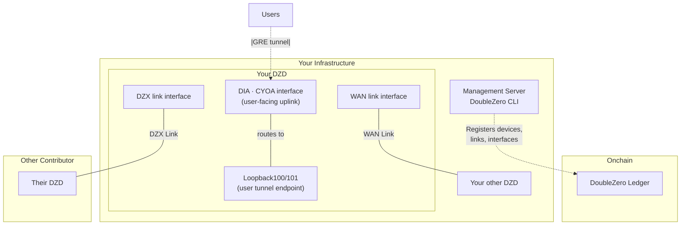
```mermaid
flowchart TB
    subgraph Onchain
        SC[DoubleZero Ledger]
    end

    subgraph Your Infrastructure
        MGMT[Management Server<br/>DoubleZero CLI]
        subgraph DZD[Your DZD]
            CYOA["DIA · CYOA interface<br/>(user-facing uplink)"]
            WAN_INTF["WAN link interface"]
            DZX_INTF["DZX link interface"]
            LO100["Loopback100/101<br/>(user tunnel endpoint)"]
        end
        DZD2[Your other DZD]
    end

    subgraph Other Contributor
        OtherDZD[Their DZD]
    end

    USERS["Users"]

    MGMT -.->|Registers devices,<br/>links, interfaces| SC
    WAN_INTF ---|WAN Link| DZD2
    DZX_INTF ---|DZX Link| OtherDZD
    USERS -.|GRE tunnel|.-> CYOA
    CYOA ---|routes to| LO100
```

---

## フェーズ1：前提条件

デバイスをプロビジョニングする前に、物理ハードウェアのセットアップといくつかのIPアドレスの割り当てが必要です。

### 必要なもの

| 要件 | 必要な理由 |
|-------------|-----------------|
| **DZDハードウェア** | Arista 7280CR3Aスイッチ（[ハードウェア仕様](contribute.md#hardware-requirements)を参照） |
| **ラックスペース** | 適切なエアフローを備えた4U |
| **電源** | 冗長給電、〜4KW推奨 |
| **管理アクセス** | スイッチ設定用のSSH/コンソールアクセス |
| **インターネット接続** | メトリクス公開およびコントローラーからの設定取得用 |
| **パブリックIPv4ブロック** | DZプレフィックスプール用の最小 /29（下記参照） |

### DoubleZero CLIのインストール

DoubleZero CLI（`doublezero`）は、プロビジョニング全体を通じてデバイスの登録、リンクの作成、コントリビューションの管理に使用します。**管理サーバーまたはVM**にインストールする必要があります。DZDスイッチ自体にはインストールしないでください。スイッチではConfig AgentとTelemetry Agentのみが動作します（[フェーズ4](#phase-4-link-establishment-agent-installation)でインストール）。

**Ubuntu / Debian：**
```bash
curl -1sLf https://dl.cloudsmith.io/public/malbeclabs/doublezero/setup.deb.sh | sudo -E bash
sudo apt-get install doublezero
```

**Rocky Linux / RHEL：**
```bash
curl -1sLf https://dl.cloudsmith.io/public/malbeclabs/doublezero/setup.rpm.sh | sudo -E bash
sudo yum install doublezero
```

デーモンが動作していることを確認します：
```bash
sudo systemctl status doublezerod
```

### DZプレフィックスの理解

DZプレフィックスは、DoubleZeroプロトコルがIP割り当てのために管理するパブリックIPアドレスのブロックです。

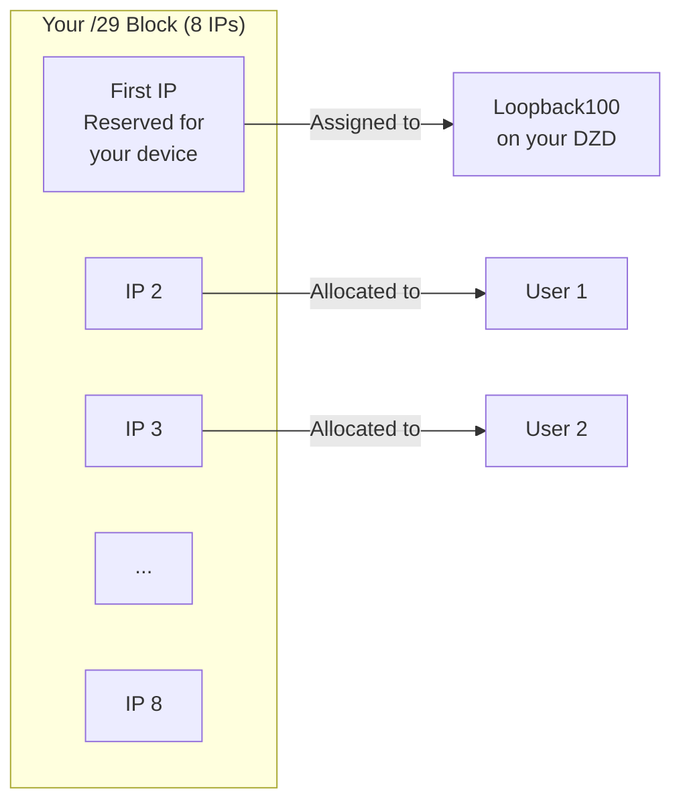
```mermaid
flowchart LR
    subgraph "Your /29 Block (8 IPs)"
        IP1["First IP<br/>Reserved for<br/>your device"]
        IP2["IP 2"]
        IP3["IP 3"]
        IP4["..."]
        IP8["IP 8"]
    end

    IP1 -->|Assigned to| LO[Loopback100<br/>on your DZD]
    IP2 -->|Allocated to| U1[User 1]
    IP3 -->|Allocated to| U2[User 2]
```

**DZプレフィックスの使用方法：**

- **最初のIP**：デバイス用に予約（Loopback100インターフェースに割り当て）
- **残りのIP**：DZDに接続する特定のユーザータイプに割り当て：
    - `IBRLWithAllocatedIP` ユーザー
    - `EdgeFiltering` ユーザー（将来のユースケース）
- **IBRLユーザー**：このプールからは消費しません（独自のパブリックIPを使用）

!!! warning "DZプレフィックスのルール"
    **これらのアドレスを以下の目的に使用することはできません：**

    - 自分のネットワーク機器
    - DIAインターフェースのポイントツーポイントリンク
    - 管理インターフェース
    - DZプロトコル外のインフラストラクチャ

    **要件：**

    - **グローバルにルーティング可能な（パブリック）** IPv4アドレスである必要があります
    - プライベートIPレンジ（10.x、172.16-31.x、192.168.x）はスマートコントラクトにより拒否されます
    - **最小サイズ：/29**（8アドレス）、より大きなプレフィックスが推奨されます（例：/28、/27）
    - ブロック全体が利用可能でなければなりません — アドレスを事前に割り当てないでください

    自分の機器用のアドレス（DIAインターフェースIP、管理用など）が必要な場合は、**別のアドレスプール**を使用してください。

---

## フェーズ2：アカウントセットアップ

このフェーズでは、ネットワーク上であなたとデバイスを識別する暗号鍵を作成します。

### CLIの実行場所

!!! warning "スイッチにCLIをインストールしないでください"
    DoubleZero CLI（`doublezero`）は、Aristaスイッチではなく**管理サーバーまたはVM**にインストールする必要があります。

    ```mermaid
    flowchart LR
        subgraph "Management Server/VM"
            CLI[DoubleZero CLI]
            KEYS[Your Keypairs]
        end

        subgraph "Your DZD Switch"
            CA[Config Agent]
            TA[Telemetry Agent]
        end

        CLI -->|Creates devices, links| BC[Blockchain]
        CA -->|Pulls config| CTRL[Controller]
        TA -->|Submits metrics| BC
    ```

    | 管理サーバーにインストール | スイッチにインストール |
    |-----------------------------|-------------------|
    | `doublezero` CLI | Config Agent |
    | サービスキーペア | Telemetry Agent |
    | メトリクスパブリッシャーキーペア | メトリクスパブリッシャーキーペア（コピー） |

### キーとは何か？

キーは安全なログイン認証情報のようなものです：

- **サービスキー**：コントリビューターとしてのアイデンティティ - CLIコマンドの実行に使用
- **メトリクスパブリッシャーキー**：テレメトリデータの送信に使用するデバイスのアイデンティティ

どちらも暗号キーペア（共有する公開鍵と、秘密にする秘密鍵）です。

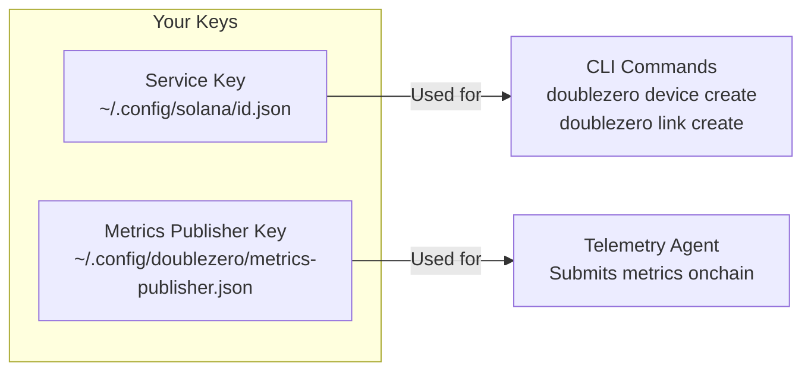
```mermaid
flowchart LR
    subgraph "Your Keys"
        SK[Service Key<br/>~/.config/solana/id.json]
        MK[Metrics Publisher Key<br/>~/.config/doublezero/metrics-publisher.json]
    end

    SK -->|Used for| CLI[CLI Commands<br/>doublezero device create<br/>doublezero link create]
    MK -->|Used for| TEL[Telemetry Agent<br/>Submits metrics onchain]
```

### ステップ2.1：サービスキーの生成

これはDoubleZeroとやり取りするためのメインのアイデンティティです。

```bash
doublezero keygen
```

デフォルトの場所にキーペアが作成されます。出力にはあなたの**公開鍵**が表示されます。これがDZFと共有するものです。

### ステップ2.2：メトリクスパブリッシャーキーの生成

このキーはTelemetry Agentがメトリクス送信に署名するために使用します。

```bash
doublezero keygen -o ~/.config/doublezero/metrics-publisher.json
```

### ステップ2.3：DZFへのキー提出

DoubleZero FoundationまたはMalbec Labsに連絡し、以下を提供します：

1. **サービスキーの公開鍵**
2. **GitHubユーザー名**（リポジトリアクセス用）

先方が以下を行います：

- オンチェーンに**コントリビューターアカウント**を作成
- プライベートな**コントリビューターリポジトリ**へのアクセスを付与

### ステップ2.4：アカウントの確認

確認が完了したら、コントリビューターアカウントが存在することを確認します：

```bash
doublezero contributor list
```

リストにあなたのコントリビューターコードが表示されるはずです。

### ステップ2.5：コントリビューターリポジトリへのアクセス

[malbeclabs/contributors](https://github.com/malbeclabs/contributors)リポジトリには以下が含まれます：

- 基本デバイス設定
- TCAMプロファイル
- ACL設定
- 追加のセットアップ手順

デバイス固有の設定については、そこに記載されている手順に従ってください。

---

## フェーズ3：デバイスプロビジョニング

ここでは物理デバイスをブロックチェーンに登録し、インターフェースを設定します。

### デバイスタイプの理解 {#understanding-device-types}

**Edge** — ユーザー接続のみを受け付ける

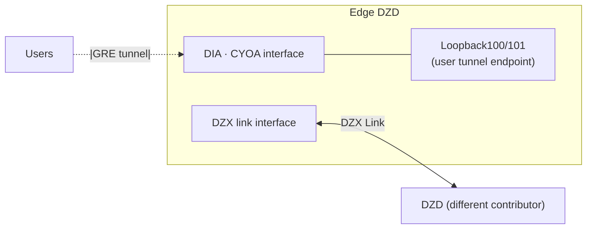
```mermaid
flowchart LR
    subgraph EDZD[Edge DZD]
        E_CYOA["DIA · CYOA interface"]
        E_TUN["Loopback100/101
        (user tunnel endpoint)"]
        E_DZX["DZX link interface"]
        E_CYOA --- E_TUN
    end
    EU["Users"] -.|GRE tunnel|.-> E_CYOA
    E_DZX <-->|DZX Link| ED["DZD (different contributor)"]
```

**Transit** — デバイス間のトラフィックを転送、ユーザー接続なし

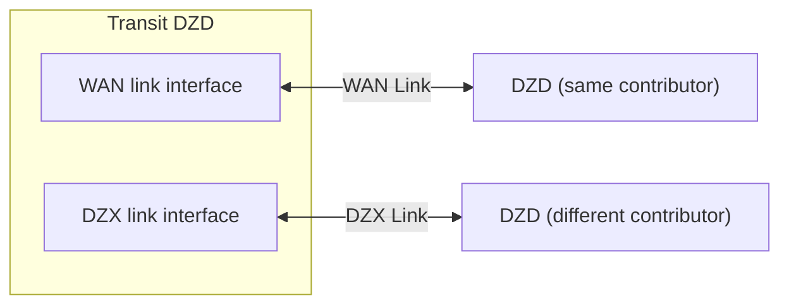
```mermaid
flowchart LR
    subgraph TDZD[Transit DZD]
        T_WAN["WAN link interface"]
        T_DZX["DZX link interface"]
    end
    T_WAN <-->|WAN Link| T2["DZD (same contributor)"]
    T_DZX <-->|DZX Link| TD["DZD (different contributor)"]
```

**Hybrid** — ユーザー接続とバックボーンの両方、最も一般的

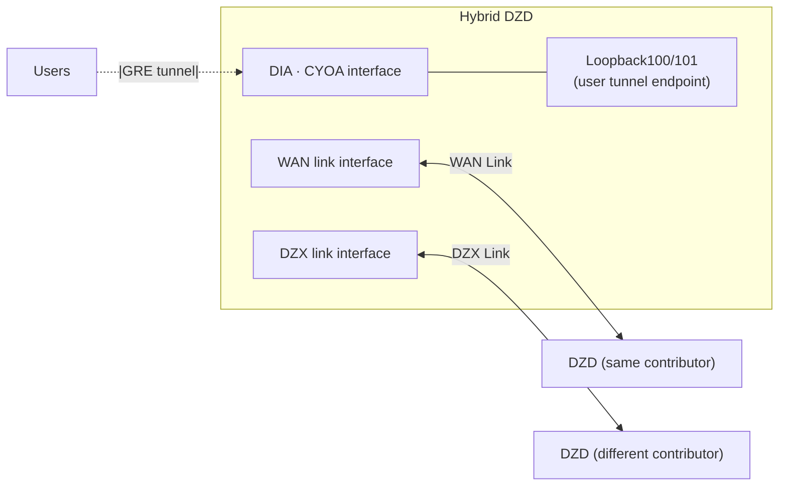
```mermaid
flowchart LR
    subgraph HDZD[Hybrid DZD]
        H_CYOA["DIA · CYOA interface"]
        H_TUN["Loopback100/101
        (user tunnel endpoint)"]
        H_WAN["WAN link interface"]
        H_DZX["DZX link interface"]
        H_CYOA --- H_TUN
    end
    HU["Users"] -.|GRE tunnel|.-> H_CYOA
    H_WAN <-->|WAN Link| H2["DZD (same contributor)"]
    H_DZX <-->|DZX Link| HD["DZD (different contributor)"]
```

| タイプ | 機能 | 使用するケース |
|------|--------------|-------------|
| **Edge** | ユーザー接続のみを受け付ける | 単一拠点、ユーザー向けのみ |
| **Transit** | デバイス間のトラフィックを転送 | バックボーン接続、ユーザーなし |
| **Hybrid** | ユーザー接続とバックボーンの両方 | 最も一般的 — すべてに対応 |

### ステップ3.1：ロケーションとエクスチェンジの確認

デバイスを作成する前に、データセンターのロケーションと最寄りのエクスチェンジのコードを調べます：

```bash
# 利用可能なロケーション（データセンター）の一覧
doublezero location list

# 利用可能なエクスチェンジ（相互接続ポイント）の一覧
doublezero exchange list
```

### ステップ3.2：デバイスのオンチェーン作成 {#step-32-create-your-device-onchain}

デバイスをブロックチェーンに登録します：

```bash
doublezero device create \
  --code <YOUR_DEVICE_CODE> \
  --contributor <YOUR_CONTRIBUTOR_CODE> \
  --device-type hybrid \
  --location <LOCATION_CODE> \
  --exchange <EXCHANGE_CODE> \
  --public-ip <DEVICE_PUBLIC_IP> \
  --dz-prefixes <YOUR_DZ_PREFIX>
```

**例：**

```bash
doublezero device create \
  --code nyc-dz001 \
  --contributor acme \
  --device-type hybrid \
  --location EQX-NY5 \
  --exchange nyc \
  --public-ip "203.0.113.10" \
  --dz-prefixes "198.51.100.0/28"
```

**期待される出力：**

```
Signature: 4vKz8H...truncated...7xPq2
```

デバイスが作成されたことを確認します：

```bash
doublezero device list | grep nyc-dz001
```

**パラメータの説明：**

| パラメータ | 意味 |
|-----------|---------------|
| `--code` | デバイスの一意な名前（例：`nyc-dz001`） |
| `--contributor` | コントリビューターコード（DZFから付与） |
| `--device-type` | `hybrid`、`transit`、または `edge` |
| `--location` | `location list`から取得したデータセンターコード |
| `--exchange` | `exchange list`から取得した最寄りのエクスチェンジコード |
| `--public-ip` | ユーザーがインターネット経由でデバイスに接続するためのパブリックIP |
| `--dz-prefixes` | ユーザー用に割り当てられたIPブロック |

### ステップ3.3：必須ループバックインターフェースの作成

すべてのデバイスには内部ルーティング用の2つのループバックインターフェースが必要です：

```bash
# VPNv4ループバック
doublezero device interface create <DEVICE_CODE> Loopback255 --loopback-type vpnv4

# IPv4ループバック
doublezero device interface create <DEVICE_CODE> Loopback256 --loopback-type ipv4
```

**期待される出力（各コマンド）：**

```
Signature: 3mNx9K...truncated...8wRt5
```

### ステップ3.4：物理インターフェースの作成

WANまたはDZXリンクに使用される物理インターフェースを登録します。これらのインターフェースは、リンクが参照する前にオンチェーンに存在している必要があります。このステップではインターフェースと帯域幅のみを登録し、リンクは後のステップで作成します。

```bash
doublezero device interface create <DEVICE_CODE> <INTERFACE_NAME> \
  --bandwidth <PORT_SPEED>
```

**例：**

```bash
doublezero device interface create nyc-dz001 Ethernet1/1 \
  --bandwidth 10Gbps
```

**期待される出力：**

```
Signature: 7pQw2R...truncated...4xKm9
```

WANまたはDZXリンクのエンドポイントとして使用する各インターフェースに対してこれを繰り返します。CYOAおよびDIAインターフェースは次のステップで別途登録します。

### ステップ3.5：CYOAインターフェースの作成（Edge/Hybridデバイス用） {#step-35-create-cyoa-interface-for-edgehybrid-devices}

HybridおよびEdge DZDには、ユーザーがGREトンネルを終端する**2つのパブリックIPアドレス**が必要です。ユーザーはユニキャスト、マルチキャスト、またはその両方で接続でき、どのIPがどの目的に使用されるかはユーザーごとにローテーションされます。

両方のIPは`--user-tunnel-endpoint true`で登録する必要があり、物理インターフェースまたはループバックのいずれかに設定します。これには、デバイス作成時に提供したIPも含まれます。そのIPもここで明示的に登録する必要があります。

IPが制約される場合は、DZプレフィックスの最初の`/32`を2つのIPの1つとして使用できます。

#### CYOAとDIA

| タイプ | フラグ | 目的 |
|------|------|---------|
| DIA | `--interface-dia dia` | ポートをダイレクトインターネットアクセスとしてマーク |
| CYOA | `--interface-cyoa <subtype>` | ユーザーがデバイスにGREトンネルを接続する方法を宣言 |

CYOAフラグは常に**物理インターフェース**（イーサネットポートまたはポートチャネル）に設定します。ループバックには設定しません。

| CYOAサブタイプ | 使用するケース |
|-------------|-------------|
| `gre-over-dia` | ユーザーがパブリックインターネット経由で接続。最も一般的。 |
| `gre-over-private-peering` | ユーザーがダイレクトクロスコネクトまたはプライベート回線経由で接続 |
| `gre-over-public-peering` | ユーザーがインターネットエクスチェンジ（IX）でピアリング |
| `gre-over-fabric` | ユーザーが同一施設内でローカルファブリック経由で接続 |
| `gre-over-cable` | 単一の専用ユーザーへのダイレクトケーブル接続 |

#### シナリオA：単一の物理インターフェース

ISPへの1つの物理アップリンク。Ethernet1/1がCYOAおよびDIAインターフェースで、2つのパブリックIPのうち1つを持ちます。Loopback100が2つ目のパブリックIPを持ちます。

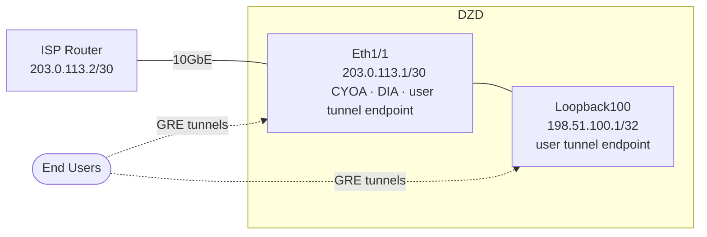
```mermaid
flowchart LR
    USERS(["End Users"])

    subgraph DZD["DZD"]
        E1["Eth1/1
        203.0.113.1/30
        CYOA · DIA · user tunnel endpoint"]
        LO["Loopback100
        198.51.100.1/32\n        user tunnel endpoint"]
        E1 --- LO
    end

    ISP["ISP Router
    203.0.113.2/30"]

    ISP -- "10GbE" --- E1
    USERS -. "GRE tunnels" .-> E1
    USERS -. "GRE tunnels" .-> LO
```

| インターフェース | `--interface-cyoa` | `--interface-dia` | `--ip-net` | `--bandwidth` | `--cir` | `--routing-mode` | `--user-tunnel-endpoint` |
|-----------|-------------------|------------------|------------|---------------|---------|-----------------|--------------------------|
| Ethernet1/1 | `gre-over-dia` | `dia` | コントリビューター割り当てIP/サブネット | ポート速度 | コミットレート | `bgp` または `static` | `true` |
| Loopback100 | — | — | パブリック /32 | `0bps` | — | — | `true` |

シナリオAに基づくコマンド実行例：
```bash
doublezero device interface create mydzd-nyc01 Ethernet1/1 \
  --interface-cyoa gre-over-dia \
  --interface-dia dia \
  --ip-net 203.0.113.1/30 \
  --bandwidth 10Gbps \
  --cir 1Gbps \
  --routing-mode bgp \
  --user-tunnel-endpoint true

doublezero device interface create mydzd-nyc01 Loopback100 \
  --ip-net 198.51.100.1/32 \
  --bandwidth 0bps \
  --user-tunnel-endpoint true
```

#### シナリオB：ポートチャネル（LAG）

DZDはIPを持つポートチャネルでアップストリームデバイスに接続します。ポートチャネルが1つのパブリックIPを持ち、CYOAエンドポイントとなります。Loopback100が2つ目のパブリックIPを持ちます。

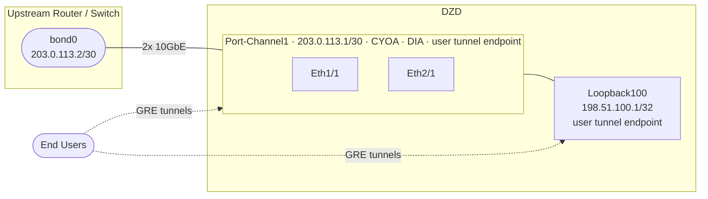
```mermaid
flowchart LR
    USERS(["End Users"])

    subgraph SW["Upstream Router / Switch"]
        SWPC(["bond0
        203.0.113.2/30"])
    end

    subgraph DZD["DZD"]
        subgraph PC["Port-Channel1 · 203.0.113.1/30 · CYOA · DIA · user tunnel endpoint"]
            E1["Eth1/1"]
            E2["Eth2/1"]
        end
        LO["Loopback100
        198.51.100.1/32\n        user tunnel endpoint"]
        PC --- LO
    end

    SWPC -- "2x 10GbE" --- PC
    USERS -. "GRE tunnels" .-> PC
    USERS -. "GRE tunnels" .-> LO
```

| インターフェース | `--interface-cyoa` | `--interface-dia` | `--ip-net` | `--bandwidth` | `--cir` | `--routing-mode` | `--user-tunnel-endpoint` |
|-----------|-------------------|------------------|------------|---------------|---------|-----------------|--------------------------|
| Port-Channel1 | `gre-over-dia` | `dia` | コントリビューター割り当てIP/サブネット | LAG合計速度 | コミットレート | `bgp` または `static` | `true` |
| Loopback100 | — | — | パブリック /32 | `0bps` | — | — | `true` |

シナリオBに基づくコマンド実行例：
```bash
doublezero device interface create mydzd-fra01 Port-Channel1 \
  --interface-cyoa gre-over-dia \
  --interface-dia dia \
  --ip-net 203.0.113.1/30 \
  --bandwidth 20Gbps \
  --cir 2Gbps \
  --routing-mode bgp \
  --user-tunnel-endpoint true

doublezero device interface create mydzd-fra01 Loopback100 \
  --ip-net 198.51.100.1/32 \
  --bandwidth 0bps \
  --user-tunnel-endpoint true
```


#### シナリオC：別々のルーターへのデュアル物理アップリンク

各物理インターフェースが異なるアップストリームルーターに接続します。2つのパブリックIPはLoopback100とLoopback101に設定され、両方ともユーザートンネルエンドポイントとして登録されます。

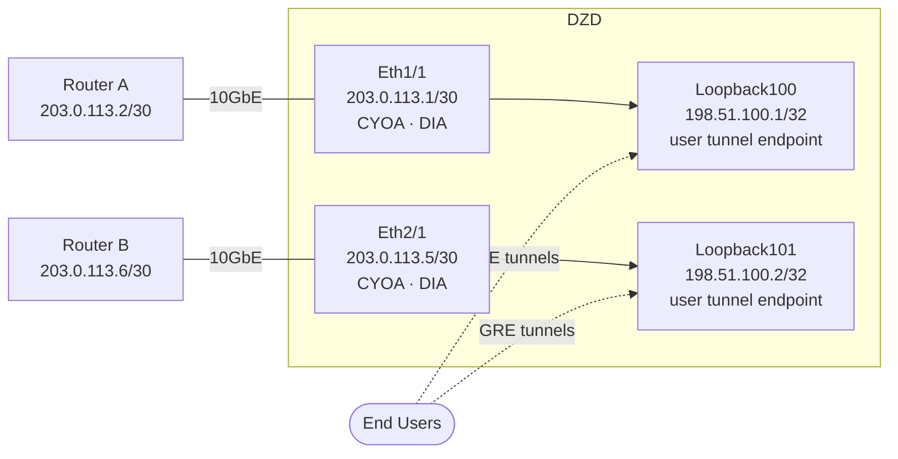
```mermaid
flowchart LR
    USERS(["End Users"])

    RA["Router A
    203.0.113.2/30"]
    RB["Router B
    203.0.113.6/30"]

    subgraph DZD["DZD"]
        E1["Eth1/1
        203.0.113.1/30
        CYOA · DIA"]
        E2["Eth2/1
        203.0.113.5/30
        CYOA · DIA"]
        LO0["Loopback100
        198.51.100.1/32\n        user tunnel endpoint"]
        LO1["Loopback101
        198.51.100.2/32\n        user tunnel endpoint"]
        E1 --> LO0
        E2 --> LO1
    end

    RA -- "10GbE" --- E1
    RB -- "10GbE" --- E2
    USERS -. "GRE tunnels" .-> LO0
    USERS -. "GRE tunnels" .-> LO1
```

| インターフェース | `--interface-cyoa` | `--interface-dia` | `--ip-net` | `--bandwidth` | `--cir` | `--routing-mode` | `--user-tunnel-endpoint` |
|-----------|-------------------|------------------|------------|---------------|---------|-----------------|--------------------------|
| Ethernet1/1 | `gre-over-dia` | `dia` | コントリビューター割り当てIP/サブネット | ポート速度 | コミットレート | `bgp` または `static` | — |
| Ethernet2/1 | `gre-over-dia` | `dia` | コントリビューター割り当てIP/サブネット | ポート速度 | コミットレート | `bgp` または `static` | — |
| Loopback100 | — | — | パブリック /32 | `0bps` | — | — | `true` |
| Loopback101 | — | — | パブリック /32 | `0bps` | — | — | `true` |

シナリオCに基づくコマンド実行例：
```bash
doublezero device interface create mydzd-ams01 Ethernet1/1 \
  --interface-cyoa gre-over-dia \
  --interface-dia dia \
  --ip-net 203.0.113.1/30 \
  --bandwidth 10Gbps \
  --cir 1Gbps \
  --routing-mode bgp

doublezero device interface create mydzd-ams01 Ethernet2/1 \
  --interface-cyoa gre-over-dia \
  --interface-dia dia \
  --ip-net 203.0.113.5/30 \
  --bandwidth 10Gbps \
  --cir 1Gbps \
  --routing-mode bgp

doublezero device interface create mydzd-ams01 Loopback100 \
  --ip-net 198.51.100.1/32 \
  --bandwidth 0bps \
  --user-tunnel-endpoint true

doublezero device interface create mydzd-ams01 Loopback101 \
  --ip-net 198.51.100.2/32 \
  --bandwidth 0bps \
  --user-tunnel-endpoint true
```

### ステップ3.6：デバイスの確認

```bash
doublezero device list
```

**出力例：**

```
 account                                      | code      | contributor | location | exchange | device_type | public_ip    | dz_prefixes     | users | max_users | status    | health  | mgmt_vrf | owner
 7xKm9pQw2R4vHt3...                          | nyc-dz001 | acme        | EQX-NY5  | nyc      | hybrid      | 203.0.113.10 | 198.51.100.0/28 | 0     | 14        | activated | pending |          | 5FMtd5Woq5XAAg54...
```

デバイスのステータスが`activated`で表示されるはずです。

---

## フェーズ4：リンク確立とエージェントインストール {#phase-4-link-establishment-agent-installation}

リンクはデバイスをDoubleZeroネットワークの他の部分に接続します。

### リンクの理解

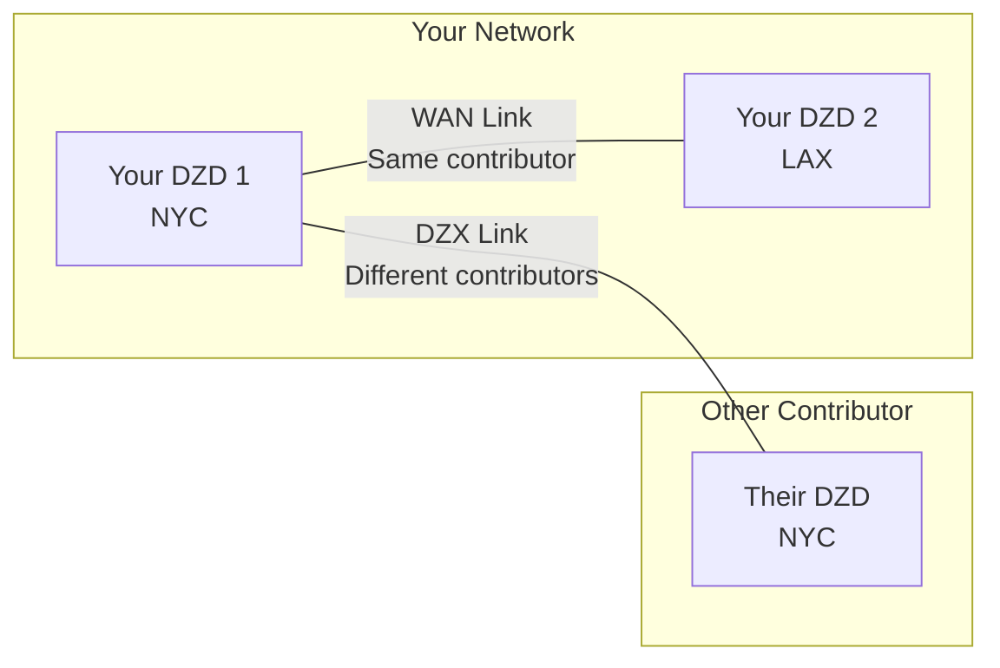
```mermaid
flowchart LR
    subgraph "Your Network"
        D1[Your DZD 1<br/>NYC]
        D2[Your DZD 2<br/>LAX]
    end

    subgraph "Other Contributor"
        O1[Their DZD<br/>NYC]
    end

    D1 ---|WAN Link<br/>Same contributor| D2
    D1 ---|DZX Link<br/>Different contributors| O1
```

| リンクタイプ | 接続先 | 承認 |
|-----------|----------|------------|
| **WANリンク** | 自分のデバイス同士 | 自動（両方を所有） |
| **DZXリンク** | 自分のデバイスと別のコントリビューター | 相手の承認が必要 |

### ステップ4.1：WANリンクの作成（複数デバイスがある場合）

WANリンクは自分のデバイス同士を接続します：

```bash
doublezero link create wan \
  --code <LINK_CODE> \
  --contributor <YOUR_CONTRIBUTOR> \
  --side-a <DEVICE_1_CODE> \
  --side-a-interface <INTERFACE_ON_DEVICE_1> \
  --side-z <DEVICE_2_CODE> \
  --side-z-interface <INTERFACE_ON_DEVICE_2> \
  --bandwidth 10000 \
  --mtu 9000 \
  --delay-ms 20 \
  --jitter-ms 1
```

**例：**

```bash
doublezero link create wan \
  --code nyc-lax-wan01 \
  --contributor acme \
  --side-a nyc-dz001 \
  --side-a-interface Ethernet3/1 \
  --side-z lax-dz001 \
  --side-z-interface Ethernet3/1 \
  --bandwidth 10000 \
  --mtu 9000 \
  --delay-ms 65 \
  --jitter-ms 1
```

**期待される出力：**

```
Signature: 5tNm7K...truncated...9pRw2
```

### ステップ4.2：DZXリンクの作成

DZXリンクはデバイスを別のコントリビューターのDZDに直接接続します：

```bash
doublezero link create dzx \
  --code <DEVICE_CODE_A:DEVICE_CODE_Z> \
  --contributor <YOUR_CONTRIBUTOR> \
  --side-a <YOUR_DEVICE_CODE> \
  --side-a-interface <YOUR_INTERFACE> \
  --side-z <OTHER_DEVICE_CODE> \
  --bandwidth <BANDWIDTH in Kbps, Mbps, or Gbps> \
  --mtu <MTU> \
  --delay-ms <DELAY> \
  --jitter-ms <JITTER>
```

**期待される出力：**

```
Signature: 8mKp3W...truncated...2nRx7
```

DZXリンクを作成した後、相手のコントリビューターが承認する必要があります：

```bash
# 相手のコントリビューターがこれを実行
doublezero link accept \
  --code <LINK_CODE> \
  --side-z-interface <THEIR_INTERFACE>
```

**期待される出力（承認側コントリビューター）：**

```
Signature: 6vQt9L...truncated...3wPm4
```

### ステップ4.3：リンクの確認

```bash
doublezero link list
```

**出力例：**

```
 account                                      | code          | contributor | side_a_name | side_a_iface_name | side_z_name | side_z_iface_name | link_type | bandwidth | mtu  | delay_ms | jitter_ms | delay_override_ms | tunnel_id | tunnel_net      | status    | health  | owner
 8vkYpXaBW8RuknJq...                         | nyc-dz001:lax-dz001 | acme        | nyc-dz001   | Ethernet3/1       | lax-dz001   | Ethernet3/1       | WAN       | 10Gbps    | 9000 | 65.00ms  | 1.00ms    | 0.00ms            | 42        | 172.16.0.84/31  | activated | pending | 5FMtd5Woq5XAAg54...
```

両側が設定されると、リンクのステータスが`activated`と表示されるはずです。

---

### エージェントインストール

DZDでは2つのソフトウェアエージェントが動作します：

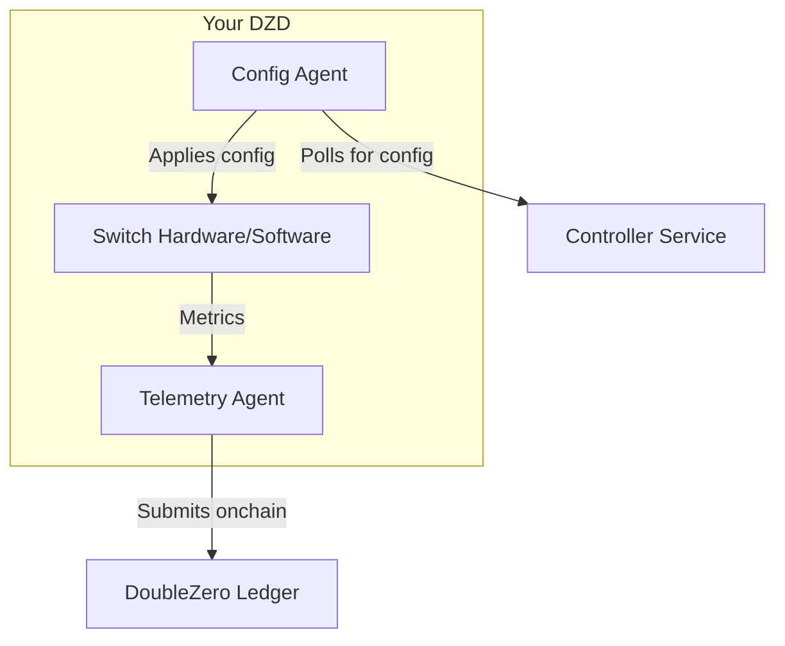
```mermaid
flowchart TB
    subgraph "Your DZD"
        CA[Config Agent]
        TA[Telemetry Agent]
        HW[Switch Hardware/Software]
    end

    CA -->|Polls for config| CTRL[Controller Service]
    CA -->|Applies config| HW

    HW -->|Metrics| TA
    TA -->|Submits onchain| BC[DoubleZero Ledger]
```

| エージェント | 機能 |
|-------|--------------|
| **Config Agent** | コントローラーから設定を取得し、スイッチに適用 |
| **Telemetry Agent** | 他のデバイスへのレイテンシ/ロスを測定し、メトリクスをオンチェーンに報告 |

### ステップ4.4：Config Agentのインストール {#step-44-install-config-agent}

#### スイッチでAPIを有効化

EOS設定に追加：

```
management api eos-sdk-rpc
    transport grpc eapilocal
        localhost loopback vrf default
        service all
        no disabled
```

!!! note "VRFに関する注意"
    管理VRF名が異なる場合は`default`を置き換えてください（例：`management`）。

#### エージェントのダウンロードとインストール

```bash
# スイッチでbashに入る
switch# bash
$ sudo bash
# cd /mnt/flash
# wget AGENT_DOWNLOAD_URL
# exit
$ exit

# EOS拡張としてインストール
switch# copy flash:AGENT_FILENAME extension:
switch# extension AGENT_FILENAME
switch# copy installed-extensions boot-extensions
```

#### 拡張の確認

```bash
switch# show extensions
```

ステータスが "A, I, B" であること：

```
Name                                        Version/Release     Status     Extension
------------------------------------------- ------------------- ---------- ---------
AGENT_FILENAME    MAINNET_CLIENT_VERSION/1             A, I, B    1

A: available | NA: not available | I: installed | F: forced | B: install at boot
```

#### エージェントの設定と起動

EOS設定に追加：

```
daemon doublezero-agent
    exec /usr/local/bin/doublezero-agent -pubkey <YOUR_DEVICE_PUBKEY> -controller <controller_IP>:<controller_port>
    no shut
```

!!! info "コントローラーのIPとポート"
    コントローラーのIPとポートは、ステップ2.5でアクセス権を付与されたコントリビューターリポジトリに記載されています。

!!! note "VRFに関する注意"
    管理VRFが`default`でない場合（つまりネームスペースが`ns-default`でない場合）、execコマンドの前に`exec /sbin/ip netns exec ns-<VRF>`を付加してください。例えば、VRFが`management`の場合：
    ```
    daemon doublezero-agent
        exec /sbin/ip netns exec ns-management /usr/local/bin/doublezero-agent -pubkey <YOUR_DEVICE_PUBKEY>
        no shut
    ```

デバイスのpubkeyは`doublezero device list`（`account`列）から取得します。

#### 動作確認

```bash
switch# show agent doublezero-agent logs
```

"Starting doublezero-agent" とコントローラーへの接続成功が表示されるはずです。

### ステップ4.5：Telemetry Agentのインストール {#step-45-install-telemetry-agent}

#### メトリクスパブリッシャーキーをデバイスにコピー

```bash
scp ~/.config/doublezero/metrics-publisher.json <SWITCH_IP>:/mnt/flash/metrics-publisher-keypair.json
```

#### メトリクスパブリッシャーのオンチェーン登録

```bash
doublezero device update \
  --pubkey <DEVICE_ACCOUNT> \
  --metrics-publisher <METRICS_PUBLISHER_PUBKEY>
```

metrics-publisher.jsonファイルからpubkeyを取得します。

#### エージェントのダウンロードとインストール

```bash
switch# bash
$ sudo bash
# cd /mnt/flash
# wget TELEMETRY_DOWNLOAD_URL
# exit
$ exit

# EOS拡張としてインストール
switch# copy flash:TELEMETRY_FILENAME extension:
switch# extension TELEMETRY_FILENAME
switch# copy installed-extensions boot-extensions
```

#### 拡張の確認

```bash
switch# show extensions
```

ステータスが "A, I, B" であること：

```
Name                                        Version/Release     Status     Extension
------------------------------------------- ------------------- ---------- ---------
TELEMETRY_FILENAME    MAINNET_CLIENT_VERSION/1             A, I, B    1

A: available | NA: not available | I: installed | F: forced | B: install at boot
```

#### エージェントの設定と起動

EOS設定に追加：

```
daemon doublezero-telemetry
    exec /usr/local/bin/doublezero-telemetry --local-device-pubkey <DEVICE_ACCOUNT> --env mainnet --keypair /mnt/flash/metrics-publisher-keypair.json
    no shut
```

!!! note "VRFに関する注意"
    管理VRFが`default`でない場合（つまりネームスペースが`ns-default`でない場合）、execコマンドに`--management-namespace ns-<VRF>`を追加してください。例えば、VRFが`management`の場合：
    ```
    daemon doublezero-telemetry
        exec /usr/local/bin/doublezero-telemetry --management-namespace ns-management --local-device-pubkey <DEVICE_ACCOUNT> --env mainnet --keypair /mnt/flash/metrics-publisher-keypair.json
        no shut
    ```

#### 動作確認

```bash
switch# show agent doublezero-telemetry logs
```

"Starting telemetry collector" と "Starting submission loop" が表示されるはずです。

---

## フェーズ5：リンクバーンイン

!!! warning "すべての新規リンクはトラフィックを流す前にバーンインが必要です"
    新規リンクは本番トラフィックをアクティブにする前に、**少なくとも24時間ドレイン状態**にする必要があります。このバーンイン要件は[RFC12: Network Provisioning](https://github.com/malbeclabs/doublezero/blob/main/rfcs/rfc12-network-provisioning.md)で定義されており、リンクがサービス可能になる前に約200,000 DZ Ledgerスロット（約20時間）のクリーンなメトリクスが必要と規定されています。

エージェントのインストールと動作後、[metrics.doublezero.xyz](https://metrics.doublezero.xyz)で少なくとも24時間連続してリンクを監視します：

- **"DoubleZero Device-Link Latencies"** ダッシュボード — 経時的にリンクの**パケットロスがゼロ**であることを確認
- **"DoubleZero Network Metrics"** ダッシュボード — リンクの**エラーがゼロ**であることを確認

バーンイン期間でロスゼロ、エラーゼロのクリーンなリンクが確認できた後にのみ、リンクのドレインを解除してください。

---

## フェーズ6：検証とアクティベーション

このチェックリストを実行して、すべてが正常に動作していることを確認します。

!!! warning "デバイスはロック状態（`max_users = 0`）で開始されます"
    デバイスが作成されると、`max_users`はデフォルトで**0**に設定されます。これはまだユーザーが接続できないことを意味します。これは意図的なもので、ユーザートラフィックを受け入れる前にすべてが正常に動作することを確認する必要があります。

    **`max_users`を0より大きく設定する前に、以下を行う必要があります：**

    1. すべてのリンクが[metrics.doublezero.xyz](https://metrics.doublezero.xyz)でロス/エラーゼロの**24時間バーンイン**を完了していることを確認
    2. **DZ/Malbec Labsと調整**して接続テストを実施：
        - テストユーザーがデバイスに接続できるか？
        - ユーザーがDZネットワーク経由でルートを受信できるか？
        - ユーザーがDZネットワーク経由でエンドツーエンドのトラフィックルーティングができるか？
    3. DZ/MLがテストに合格したことを確認した後にのみ、max_usersを96に設定：

    ```bash
    doublezero device update --pubkey <DEVICE_ACCOUNT> --max-users 96
    ```

### デバイスチェック

```bash
# デバイスのステータスが "activated" で表示されるはずです
doublezero device list | grep <YOUR_DEVICE_CODE>
```

**期待される出力：**

```
 7xKm9pQw2R4vHt3... | nyc-dz001 | acme | EQX-NY5 | nyc | hybrid | 203.0.113.10 | 198.51.100.0/28 | 0 | 14 | activated | pending | | 5FMtd5Woq5XAAg54...
```

```bash
# インターフェースが一覧表示されるはずです
doublezero device interface list | grep <YOUR_DEVICE_CODE>
```

**期待される出力：**

```
 nyc-dz001 | Loopback255 | loopback | vpnv4 | none | none | 0 | 0 | 1500 | static | 0 | 172.16.1.91/32  | 56 | false | activated
 nyc-dz001 | Loopback256 | loopback | ipv4  | none | none | 0 | 0 | 1500 | static | 0 | 172.16.1.100/32 | 0  | false | activated
 nyc-dz001 | Ethernet1/1 | physical | none  | none | none | 0 | 0 | 1500 | static | 0 |                 | 0  | false | activated
```

### リンクチェック

```bash
# リンクのステータスが "activated" で表示されるはずです
doublezero link list | grep <YOUR_DEVICE_CODE>
```

**期待される出力：**

```
 8vkYpXaBW8RuknJq... | nyc-lax-wan01 | acme | nyc-dz001 | Ethernet3/1 | lax-dz001 | Ethernet3/1 | WAN | 10Gbps | 9000 | 65.00ms | 1.00ms | 0.00ms | 42 | 172.16.0.84/31 | activated | pending | 5FMtd5Woq5XAAg54...
```

### エージェントチェック

スイッチ上で：

```bash
# Config Agentが設定の取得に成功していることを確認
switch# show agent doublezero-agent logs | tail -20

# Telemetry Agentが送信に成功していることを確認
switch# show agent doublezero-telemetry logs | tail -20
```

### 最終確認ダイアグラム

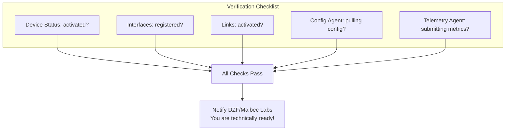
```mermaid
flowchart TB
    subgraph "Verification Checklist"
        D[Device Status: activated?]
        I[Interfaces: registered?]
        L[Links: activated?]
        CA[Config Agent: pulling config?]
        TA[Telemetry Agent: submitting metrics?]
    end

    D --> PASS
    I --> PASS
    L --> PASS
    CA --> PASS
    TA --> PASS

    PASS[All Checks Pass] --> NOTIFY[Notify DZF/Malbec Labs<br/>You are technically ready!]
```

---

## トラブルシューティング

### デバイス作成に失敗する

- サービスキーが認証されていることを確認（`doublezero contributor list`）
- ロケーションとエクスチェンジのコードが有効であることを確認
- DZプレフィックスが有効なパブリックIPレンジであることを確認

### リンクが "requested" ステータスのまま

- DZXリンクは相手のコントリビューターによる承認が必要
- 相手に`doublezero link accept`の実行を依頼

### Config Agentが接続しない

- 管理ネットワークにインターネットアクセスがあることを確認
- VRF設定が環境と一致していることを確認
- デバイスのpubkeyが正しいことを確認

### Telemetry Agentが送信しない

- メトリクスパブリッシャーキーがオンチェーンに登録されていることを確認
- キーペアファイルがスイッチ上に存在することを確認
- デバイスアカウントのpubkeyが正しいことを確認

---

## 次のステップ

- エージェントのアップグレードとリンク管理については[運用ガイド](contribute-operations.md)を参照
- 用語の定義については[用語集](glossary.md)を確認
- 問題が発生した場合はDZF/Malbec Labsに連絡