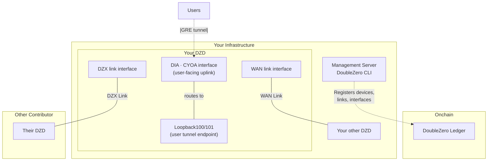
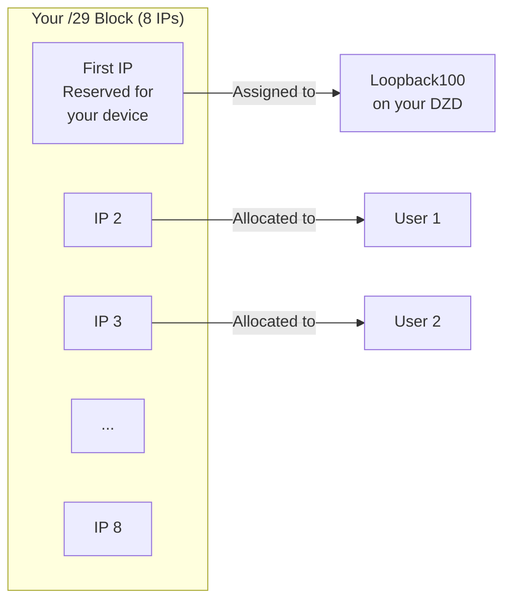
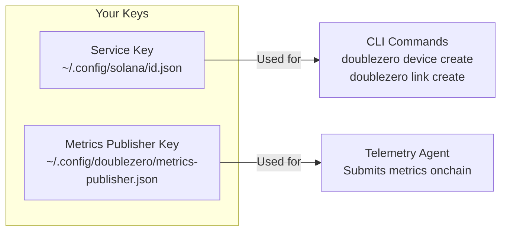
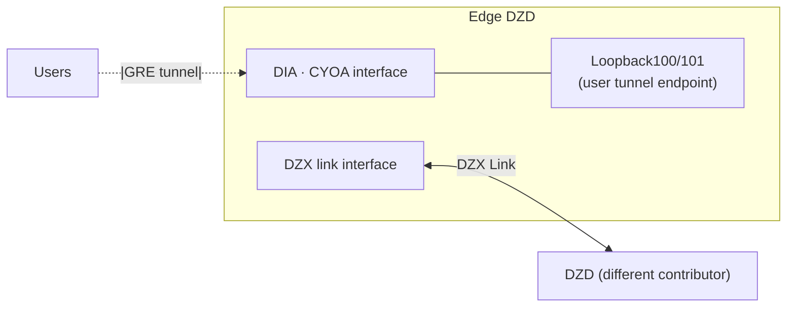
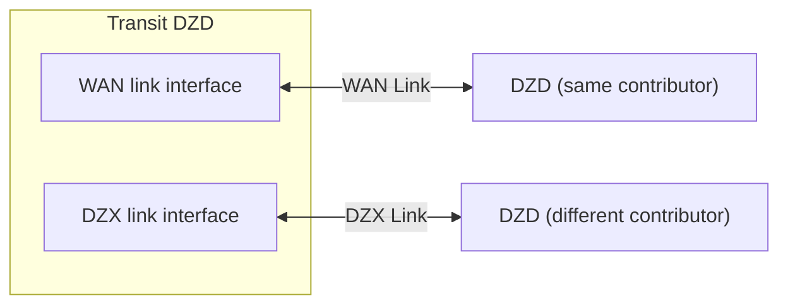
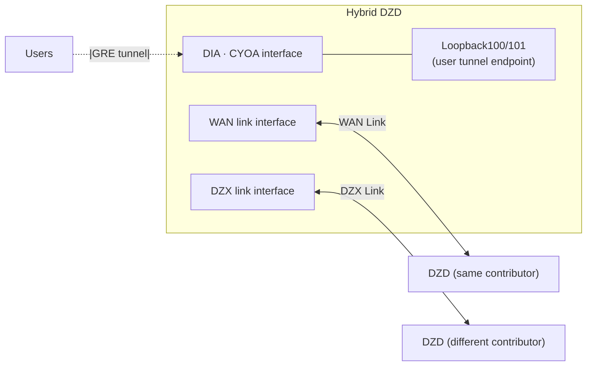
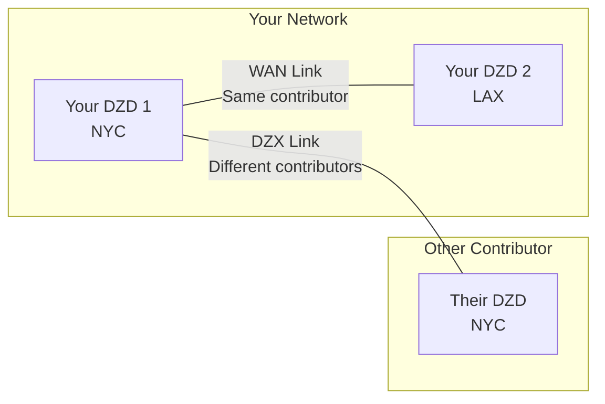
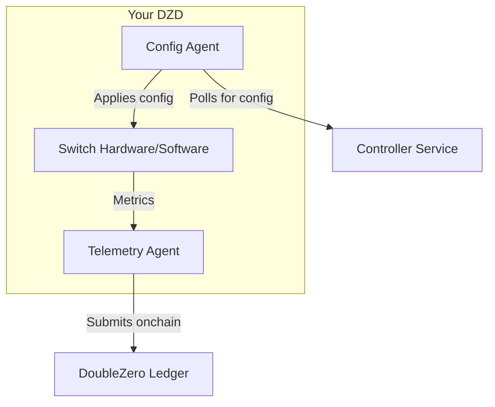
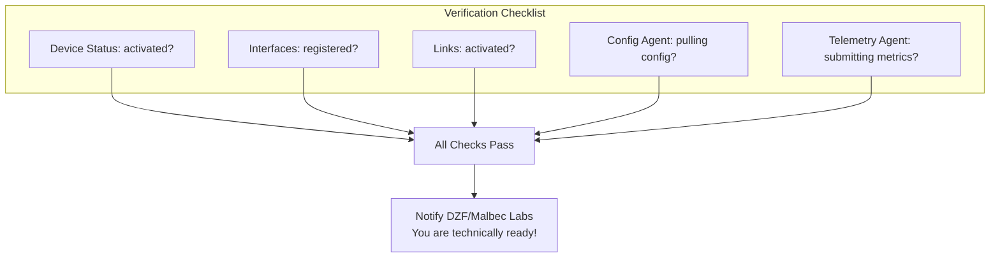

# デバイスプロビジョニングガイド

このガイドでは、DoubleZero デバイス（DZD）のプロビジョニングを最初から最後まで説明します。各フェーズは[オンボーディングチェックリスト](contribute-overview.md#onboarding-checklist)に対応しています。

---

## 全体の仕組み

このガイドでは、DoubleZero ネットワークがトラフィックをルーティングできるように、インフラストラクチャをオンチェーンに登録する手順を説明します。デバイスの登録が完全であるほど、ネットワークにとってより有用になります。デバイスの完全なオンチェーン表現により、トラブルシューティング、キャパシティプランニングが改善され、コントローラーがより適切な判断を下せるようになります。将来的には、コントローラーがより多くの設定の責務を担うことを目指しています。

### 主要な概念

**インターフェース**

DZD のインターフェースにはさまざまな形態があります：イーサネットポート、ポートチャネル（複数のイーサネットポートで構成される LAG）、およびループバックです。ネットワークで役割を果たす各インターフェースは、プロトコルがその機能を把握できるよう、適切なフラグとともにオンチェーンに登録する必要があります。

イーサネットポートとポートチャネルは以下の役割を果たすことができます：

| フラグ | 意味 |
|------|---------------|
| `--interface-dia dia` | インターフェースをダイレクトインターネットアクセスのアップリンクとしてマークする |
| `--interface-cyoa <subtype>` | ユーザーがこのインターフェースを通じて GRE トンネルを確立する方法を宣言する（例：パブリックインターネット経由、プライベートピアリングリンク経由） |
| `--user-tunnel-endpoint true` | このインターフェースはユーザーが GRE トンネルを終端するパブリック IP を保持する |

WAN または DZX リンクに使用されるインターフェースには特定のフラグはなく、帯域幅とともに登録され、リンク作成時に参照されます。

ループバックインターフェースにはいくつかの用途があります：

| ループバック | 意味 |
|----------|---------------|
| **Loopback100 / 101** | ユーザーが GRE トンネルを終端するパブリック IP を保持する。`--user-tunnel-endpoint true` で登録される。 |
| **Loopback255** (`vpnv4`) | コントローラーが BGP ルーター ID、VPN-IPv4 ピアリング（ユニキャスト）、IS-IS アイデンティティ、およびセグメントルーティングに使用する IP を割り当てられるよう登録される |
| **Loopback256** (`ipv4`) | コントローラーが IPv4 BGP ピアリング（マルチキャスト）および MSDP セッションに使用する IP を割り当てられるよう登録される |

**リンク**

リンクはインターフェースとは別に登録され、リンクがインターフェースを参照する前にインターフェースがオンチェーンに存在している必要があります。WAN または DZX リンクを作成する際、すでに登録済みのインターフェースをリンクの物理エンドポイントとして指定します。すべてのインターフェースがリンクに紐づいているわけではありません：DIA、CYOA、およびループバックインターフェースはリンクに接続されません。

| 用語 | 意味 |
|------|---------------|
| **WAN リンク** | 自分が所有する 2 つの DZD 間のリンク |
| **DZX リンク** | 自分の DZD と別のコントリビューターの DZD 間のリンク |

### アーキテクチャ概要


```mermaid
flowchart TB
    subgraph Onchain
        SC[DoubleZero Ledger]
    end

    subgraph Your Infrastructure
        MGMT[Management Server<br/>DoubleZero CLI]
        subgraph DZD[Your DZD]
            CYOA["DIA · CYOA interface<br/>(user-facing uplink)"]
            WAN_INTF["WAN link interface"]
            DZX_INTF["DZX link interface"]
            LO100["Loopback100/101<br/>(user tunnel endpoint)"]
        end
        DZD2[Your other DZD]
    end

    subgraph Other Contributor
        OtherDZD[Their DZD]
    end

    USERS["Users"]

    MGMT -.->|Registers devices,<br/>links, interfaces| SC
    WAN_INTF ---|WAN Link| DZD2
    DZX_INTF ---|DZX Link| OtherDZD
    USERS -.|GRE tunnel|.-> CYOA
    CYOA ---|routes to| LO100
```

---

## フェーズ 1：前提条件

デバイスをプロビジョニングする前に、物理ハードウェアのセットアップといくつかの IP アドレスの割り当てが必要です。

### 必要なもの

| 要件 | 必要な理由 |
|-------------|-----------------|
| **DZD ハードウェア** | Arista 7280CR3A スイッチ（[ハードウェア仕様](contribute.md#hardware-requirements)を参照） |
| **ラックスペース** | 適切なエアフローを備えた 4U |
| **電源** | 冗長フィード、推奨 ~4KW |
| **管理アクセス** | スイッチを設定するための SSH/コンソールアクセス |
| **インターネット接続** | メトリクス公開およびコントローラーからの設定取得用 |
| **パブリック IPv4 ブロック** | DZ プレフィックスプール用に最低 /29（下記参照） |

### DoubleZero CLI のインストール

DoubleZero CLI（`doublezero`）は、プロビジョニング全体を通じてデバイスの登録、リンクの作成、コントリビューションの管理に使用されます。**管理サーバーまたは VM** にインストールする必要があります — DZD スイッチ本体にはインストールしないでください。スイッチでは Config Agent と Telemetry Agent のみが実行されます（[フェーズ 4](#phase-4-link-establishment-agent-installation) でインストール）。

**Ubuntu / Debian：**
```bash
curl -1sLf https://dl.cloudsmith.io/public/malbeclabs/doublezero/setup.deb.sh | sudo -E bash
sudo apt-get install doublezero
```

**Rocky Linux / RHEL：**
```bash
curl -1sLf https://dl.cloudsmith.io/public/malbeclabs/doublezero/setup.rpm.sh | sudo -E bash
sudo yum install doublezero
```

デーモンが実行中であることを確認します：
```bash
sudo systemctl status doublezerod
```

### DZ プレフィックスについて

DZ プレフィックスは、DoubleZero プロトコルが IP 割り当てのために管理するパブリック IP アドレスのブロックです。


```mermaid
flowchart LR
    subgraph "Your /29 Block (8 IPs)"
        IP1["First IP<br/>Reserved for<br/>your device"]
        IP2["IP 2"]
        IP3["IP 3"]
        IP4["..."]
        IP8["IP 8"]
    end

    IP1 -->|Assigned to| LO[Loopback100<br/>on your DZD]
    IP2 -->|Allocated to| U1[User 1]
    IP3 -->|Allocated to| U2[User 2]
```

**DZ プレフィックスの使用方法：**

- **最初の IP**：デバイス用に予約される（Loopback100 インターフェースに割り当て）
- **残りの IP**：DZD に接続する特定のユーザータイプに割り当てられる：
    - `IBRLWithAllocatedIP` ユーザー
    - `EdgeFiltering` ユーザー（将来のユースケース）
- **IBRL ユーザー**：このプールからは消費しない（独自のパブリック IP を使用）

!!! warning "DZ プレフィックスのルール"
    **以下の用途にはこれらのアドレスを使用できません：**

    - 自社のネットワーク機器
    - DIA インターフェース上のポイントツーポイントリンク
    - 管理インターフェース
    - DZ プロトコル外のあらゆるインフラストラクチャ

    **要件：**

    - **グローバルにルーティング可能な（パブリック）** IPv4 アドレスである必要がある
    - プライベート IP 範囲（10.x、172.16-31.x、192.168.x）はスマートコントラクトによって拒否される
    - **最小サイズ：/29**（8 アドレス）、より大きなプレフィックスが推奨（例：/28、/27）
    - ブロック全体が利用可能である必要がある — アドレスを事前に割り当てないこと

    自社機器用のアドレス（DIA インターフェース IP、管理用など）が必要な場合は、**別のアドレスプール**を使用してください。

---

## フェーズ 2：アカウントセットアップ

このフェーズでは、ネットワーク上であなたとデバイスを識別する暗号鍵を作成します。

### CLI の実行場所

!!! warning "スイッチに CLI をインストールしないでください"
    DoubleZero CLI（`doublezero`）は、Arista スイッチではなく、**管理サーバーまたは VM** にインストールする必要があります。

    ```mermaid
    flowchart LR
        subgraph "Management Server/VM"
            CLI[DoubleZero CLI]
            KEYS[Your Keypairs]
        end

        subgraph "Your DZD Switch"
            CA[Config Agent]
            TA[Telemetry Agent]
        end

        CLI -->|Creates devices, links| BC[Blockchain]
        CA -->|Pulls config| CTRL[Controller]
        TA -->|Submits metrics| BC
    ```

    | 管理サーバーにインストール | スイッチにインストール |
    |-----------------------------|-------------------|
    | `doublezero` CLI | Config Agent |
    | サービスキーペア | Telemetry Agent |
    | メトリクスパブリッシャーキーペア | メトリクスパブリッシャーキーペア（コピー） |

### 鍵とは？

鍵はセキュアなログイン資格情報のようなものです：

- **サービスキー**：コントリビューターのアイデンティティ - CLI コマンドの実行に使用
- **メトリクスパブリッシャーキー**：テレメトリデータの送信に使用するデバイスのアイデンティティ

どちらも暗号キーペア（共有するパブリックキーと、秘密にしておくプライベートキー）です。


```mermaid
flowchart LR
    subgraph "Your Keys"
        SK[Service Key<br/>~/.config/solana/id.json]
        MK[Metrics Publisher Key<br/>~/.config/doublezero/metrics-publisher.json]
    end

    SK -->|Used for| CLI[CLI Commands<br/>doublezero device create<br/>doublezero link create]
    MK -->|Used for| TEL[Telemetry Agent<br/>Submits metrics onchain]
```

### ステップ 2.1：サービスキーの生成

これは DoubleZero とやり取りするためのメインのアイデンティティです。

```bash
doublezero keygen
```

デフォルトの場所にキーペアが作成されます。出力には**パブリックキー**が表示されます - これが DZF と共有するものです。

### ステップ 2.2：メトリクスパブリッシャーキーの生成

この鍵は Telemetry Agent がメトリクス送信に署名するために使用されます。

```bash
doublezero keygen -o ~/.config/doublezero/metrics-publisher.json
```

### ステップ 2.3：DZF への鍵の提出

DoubleZero Foundation または Malbec Labs に連絡し、以下を提供してください：

1. **サービスキーのパブリックキー**
2. **GitHub ユーザー名**（リポジトリアクセス用）

先方が以下を行います：

- オンチェーンに**コントリビューターアカウント**を作成
- プライベートな**コントリビューターリポジトリ**へのアクセスを付与

### ステップ 2.4：アカウントの確認

確認が取れたら、コントリビューターアカウントが存在することを確認します：

```bash
doublezero contributor list
```

リストにあなたのコントリビューターコードが表示されるはずです。

### ステップ 2.5：コントリビューターリポジトリへのアクセス

[malbeclabs/contributors](https://github.com/malbeclabs/contributors) リポジトリには以下が含まれています：

- 基本デバイス設定
- TCAM プロファイル
- ACL 設定
- 追加のセットアップ手順

デバイス固有の設定については、そちらの手順に従ってください。

---

## フェーズ 3：デバイスプロビジョニング

ここでは、物理デバイスをブロックチェーンに登録し、インターフェースを設定します。

### デバイスタイプの理解

**Edge** — ユーザー接続のみを受け付ける


```mermaid
flowchart LR
    subgraph EDZD[Edge DZD]
        E_CYOA["DIA · CYOA interface"]
        E_TUN["Loopback100/101
        (user tunnel endpoint)"]
        E_DZX["DZX link interface"]
        E_CYOA --- E_TUN
    end
    EU["Users"] -.|GRE tunnel|.-> E_CYOA
    E_DZX <-->|DZX Link| ED["DZD (different contributor)"]
```

**Transit** — デバイス間のトラフィックを転送する、ユーザー接続なし


```mermaid
flowchart LR
    subgraph TDZD[Transit DZD]
        T_WAN["WAN link interface"]
        T_DZX["DZX link interface"]
    end
    T_WAN <-->|WAN Link| T2["DZD (same contributor)"]
    T_DZX <-->|DZX Link| TD["DZD (different contributor)"]
```

**Hybrid** — ユーザー接続とバックボーンの両方、最も一般的


```mermaid
flowchart LR
    subgraph HDZD[Hybrid DZD]
        H_CYOA["DIA · CYOA interface"]
        H_TUN["Loopback100/101
        (user tunnel endpoint)"]
        H_WAN["WAN link interface"]
        H_DZX["DZX link interface"]
        H_CYOA --- H_TUN
    end
    HU["Users"] -.|GRE tunnel|.-> H_CYOA
    H_WAN <-->|WAN Link| H2["DZD (same contributor)"]
    H_DZX <-->|DZX Link| HD["DZD (different contributor)"]
```

| タイプ | 機能 | 使用するケース |
|------|--------------|-------------|
| **Edge** | ユーザー接続のみを受け付ける | 単一拠点、ユーザー向けのみ |
| **Transit** | デバイス間のトラフィックを転送する | バックボーン接続、ユーザーなし |
| **Hybrid** | ユーザー接続とバックボーンの両方 | 最も一般的 - すべてを行う |

### ステップ 3.1：ロケーションとエクスチェンジの検索

デバイスを作成する前に、データセンターの場所と最寄りのエクスチェンジのコードを調べます：

```bash
# 利用可能なロケーション（データセンター）を一覧表示
doublezero location list

# 利用可能なエクスチェンジ（相互接続ポイント）を一覧表示
doublezero exchange list
```

### ステップ 3.2：デバイスをオンチェーンに作成

ブロックチェーンにデバイスを登録します：

```bash
doublezero device create \
  --code <YOUR_DEVICE_CODE> \
  --contributor <YOUR_CONTRIBUTOR_CODE> \
  --device-type hybrid \
  --location <LOCATION_CODE> \
  --exchange <EXCHANGE_CODE> \
  --public-ip <DEVICE_PUBLIC_IP> \
  --dz-prefixes <YOUR_DZ_PREFIX>
```

**例：**

```bash
doublezero device create \
  --code nyc-dz001 \
  --contributor acme \
  --device-type hybrid \
  --location EQX-NY5 \
  --exchange nyc \
  --public-ip "203.0.113.10" \
  --dz-prefixes "198.51.100.0/28"
```

**期待される出力：**

```
Signature: 4vKz8H...truncated...7xPq2
```

デバイスが作成されたことを確認します：

```bash
doublezero device list | grep nyc-dz001
```

**パラメータの説明：**

| パラメータ | 意味 |
|-----------|---------------|
| `--code` | デバイスの一意の名前（例：`nyc-dz001`） |
| `--contributor` | コントリビューターコード（DZF から付与） |
| `--device-type` | `hybrid`、`transit`、または `edge` |
| `--location` | `location list` から取得したデータセンターコード |
| `--exchange` | `exchange list` から取得した最寄りのエクスチェンジコード |
| `--public-ip` | ユーザーがインターネット経由でデバイスに接続するパブリック IP |
| `--dz-prefixes` | ユーザー用に割り当てられた IP ブロック |

### ステップ 3.3：必須ループバックインターフェースの作成

すべてのデバイスには、内部ルーティング用に 2 つのループバックインターフェースが必要です：

```bash
# VPNv4 ループバック
doublezero device interface create <DEVICE_CODE> Loopback255 --loopback-type vpnv4

# IPv4 ループバック
doublezero device interface create <DEVICE_CODE> Loopback256 --loopback-type ipv4
```

**期待される出力（各コマンド）：**

```
Signature: 3mNx9K...truncated...8wRt5
```

### ステップ 3.4：物理インターフェースの作成

WAN または DZX リンクに使用される物理インターフェースを登録します。これらのインターフェースは、それらを参照するリンクを作成する前にオンチェーンに存在している必要があります。このステップではインターフェースとその帯域幅のみを登録し、リンクは後のステップで作成されます。

```bash
doublezero device interface create <DEVICE_CODE> <INTERFACE_NAME> \
  --bandwidth <PORT_SPEED>
```

**例：**

```bash
doublezero device interface create nyc-dz001 Ethernet1/1 \
  --bandwidth 10Gbps
```

**期待される出力：**

```
Signature: 7pQw2R...truncated...4xKm9
```

WAN または DZX リンクのエンドポイントとして使用される各インターフェースについて、これを繰り返します。CYOA および DIA インターフェースは次のステップで別途登録されます。

### ステップ 3.5：CYOA インターフェースの作成（Edge/Hybrid デバイス用）

Hybrid および Edge の DZD には、ユーザーが GRE トンネルを終端する **2 つのパブリック IP アドレス**が必要です。ユーザーはユニキャスト、マルチキャスト、または両方で接続でき、どの IP がどの目的で使用されるかはユーザーごとにローテーションされます。

両方の IP は、物理インターフェースまたはループバックのいずれかで `--user-tunnel-endpoint true` として登録する必要があります。これには、デバイス作成時に提供した IP も含まれます — その IP もここで明示的に登録する必要があります。

IP が制限されている場合は、DZ プレフィックスの最初の `/32` を 2 つの IP のうちの 1 つとして使用できます。

#### CYOA と DIA

| タイプ | フラグ | 用途 |
|------|------|---------|
| DIA | `--interface-dia dia` | ポートをダイレクトインターネットアクセスとしてマークする |
| CYOA | `--interface-cyoa <subtype>` | ユーザーがデバイスに GRE トンネルを接続する方法を宣言する |

CYOA フラグは常に**物理インターフェース**（イーサネットポートまたはポートチャネル）に設定されます。ループバックには設定しません。

| CYOA サブタイプ | 使用するケース |
|-------------|-------------|
| `gre-over-dia` | ユーザーがパブリックインターネット経由で接続する。最も一般的。 |
| `gre-over-private-peering` | ユーザーがダイレクトクロスコネクトまたはプライベート回線経由で接続する |
| `gre-over-public-peering` | ユーザーがインターネットエクスチェンジ（IX）でピアリングする |
| `gre-over-fabric` | ユーザーがコロケーションされ、ローカルファブリック経由で接続する |
| `gre-over-cable` | 単一の専用ユーザーへの直接ケーブル接続 |

#### シナリオ A：単一物理インターフェース

ISP への物理アップリンクが 1 つ。Ethernet1/1 が CYOA および DIA インターフェースであり、2 つのパブリック IP のうち 1 つを保持します。Loopback100 が 2 番目のパブリック IP を保持します。


```mermaid
flowchart LR
    USERS(["End Users"])

    subgraph DZD["DZD"]
        E1["Eth1/1
        203.0.113.1/30
        CYOA · DIA · user tunnel endpoint"]
        LO["Loopback100
        198.51.100.1/32\n        user tunnel endpoint"]
        E1 --- LO
    end

    ISP["ISP Router
    203.0.113.2/30"]

    ISP -- "10GbE" --- E1
    USERS -. "GRE tunnels" .-> E1
    USERS -. "GRE tunnels" .-> LO
```

| インターフェース | `--interface-cyoa` | `--interface-dia` | `--ip-net` | `--bandwidth` | `--cir` | `--routing-mode` | `--user-tunnel-endpoint` |
|-----------|-------------------|------------------|------------|---------------|---------|-----------------|--------------------------|
| Ethernet1/1 | `gre-over-dia` | `dia` | コントリビューター割り当て IP/サブネット | ポート速度 | コミットレート | `bgp` または `static` | `true` |
| Loopback100 | — | — | パブリック /32 | `0bps` | — | — | `true` |

シナリオ A に基づいて実行するコマンドの例：
```bash
doublezero device interface create mydzd-nyc01 Ethernet1/1 \
  --interface-cyoa gre-over-dia \
  --interface-dia dia \
  --ip-net 203.0.113.1/30 \
  --bandwidth 10Gbps \
  --cir 1Gbps \
  --routing-mode bgp \
  --user-tunnel-endpoint true

doublezero device interface create mydzd-nyc01 Loopback100 \
  --ip-net 198.51.100.1/32 \
  --bandwidth 0bps \
  --user-tunnel-endpoint true
```

#### シナリオ B：ポートチャネル（LAG）

DZD が IP 付きのポートチャネルを介して上流デバイスに接続します。ポートチャネルが 1 つのパブリック IP を保持し、CYOA エンドポイントとなります。Loopback100 が 2 番目のパブリック IP を保持します。


```mermaid
flowchart LR
    USERS(["End Users"])

    subgraph SW["Upstream Router / Switch"]
        SWPC(["bond0
        203.0.113.2/30"])
    end

    subgraph DZD["DZD"]
        subgraph PC["Port-Channel1 · 203.0.113.1/30 · CYOA · DIA · user tunnel endpoint"]
            E1["Eth1/1"]
            E2["Eth2/1"]
        end
        LO["Loopback100
        198.51.100.1/32\n        user tunnel endpoint"]
        PC --- LO
    end

    SWPC -- "2x 10GbE" --- PC
    USERS -. "GRE tunnels" .-> PC
    USERS -. "GRE tunnels" .-> LO
```

| インターフェース | `--interface-cyoa` | `--interface-dia` | `--ip-net` | `--bandwidth` | `--cir` | `--routing-mode` | `--user-tunnel-endpoint` |
|-----------|-------------------|------------------|------------|---------------|---------|-----------------|--------------------------|
| Port-Channel1 | `gre-over-dia` | `dia` | コントリビューター割り当て IP/サブネット | LAG 合計速度 | コミットレート | `bgp` または `static` | `true` |
| Loopback100 | — | — | パブリック /32 | `0bps` | — | — | `true` |

シナリオ B に基づいて実行するコマンドの例：
```bash
doublezero device interface create mydzd-fra01 Port-Channel1 \
  --interface-cyoa gre-over-dia \
  --interface-dia dia \
  --ip-net 203.0.113.1/30 \
  --bandwidth 20Gbps \
  --cir 2Gbps \
  --routing-mode bgp \
  --user-tunnel-endpoint true

doublezero device interface create mydzd-fra01 Loopback100 \
  --ip-net 198.51.100.1/32 \
  --bandwidth 0bps \
  --user-tunnel-endpoint true
```


#### シナリオ C：別々のルーターへのデュアル物理アップリンク

各物理インターフェースが異なる上流ルーターに接続します。2 つのパブリック IP は Loopback100 と Loopback101 に配置され、両方ともユーザートンネルエンドポイントとして登録されます。


```mermaid
flowchart LR
    USERS(["End Users"])

    RA["Router A
    203.0.113.2/30"]
    RB["Router B
    203.0.113.6/30"]

    subgraph DZD["DZD"]
        E1["Eth1/1
        203.0.113.1/30
        CYOA · DIA"]
        E2["Eth2/1
        203.0.113.5/30
        CYOA · DIA"]
        LO0["Loopback100
        198.51.100.1/32\n        user tunnel endpoint"]
        LO1["Loopback101
        198.51.100.2/32\n        user tunnel endpoint"]
        E1 --> LO0
        E2 --> LO1
    end

    RA -- "10GbE" --- E1
    RB -- "10GbE" --- E2
    USERS -. "GRE tunnels" .-> LO0
    USERS -. "GRE tunnels" .-> LO1
```

| インターフェース | `--interface-cyoa` | `--interface-dia` | `--ip-net` | `--bandwidth` | `--cir` | `--routing-mode` | `--user-tunnel-endpoint` |
|-----------|-------------------|------------------|------------|---------------|---------|-----------------|--------------------------|
| Ethernet1/1 | `gre-over-dia` | `dia` | コントリビューター割り当て IP/サブネット | ポート速度 | コミットレート | `bgp` または `static` | — |
| Ethernet2/1 | `gre-over-dia` | `dia` | コントリビューター割り当て IP/サブネット | ポート速度 | コミットレート | `bgp` または `static` | — |
| Loopback100 | — | — | パブリック /32 | `0bps` | — | — | `true` |
| Loopback101 | — | — | パブリック /32 | `0bps` | — | — | `true` |

シナリオ C に基づいて実行するコマンドの例：
```bash
doublezero device interface create mydzd-ams01 Ethernet1/1 \
  --interface-cyoa gre-over-dia \
  --interface-dia dia \
  --ip-net 203.0.113.1/30 \
  --bandwidth 10Gbps \
  --cir 1Gbps \
  --routing-mode bgp

doublezero device interface create mydzd-ams01 Ethernet2/1 \
  --interface-cyoa gre-over-dia \
  --interface-dia dia \
  --ip-net 203.0.113.5/30 \
  --bandwidth 10Gbps \
  --cir 1Gbps \
  --routing-mode bgp

doublezero device interface create mydzd-ams01 Loopback100 \
  --ip-net 198.51.100.1/32 \
  --bandwidth 0bps \
  --user-tunnel-endpoint true

doublezero device interface create mydzd-ams01 Loopback101 \
  --ip-net 198.51.100.2/32 \
  --bandwidth 0bps \
  --user-tunnel-endpoint true
```

### ステップ 3.6：デバイスの確認

```bash
doublezero device list
```

**出力例：**

```
 account                                      | code      | contributor | location | exchange | device_type | public_ip    | dz_prefixes     | users | max_users | status    | health  | mgmt_vrf | owner
 7xKm9pQw2R4vHt3...                          | nyc-dz001 | acme        | EQX-NY5  | nyc      | hybrid      | 203.0.113.10 | 198.51.100.0/28 | 0     | 14        | activated | pending |          | 5FMtd5Woq5XAAg54...
```

デバイスのステータスが `activated` と表示されるはずです。

---

## フェーズ 4：リンク確立とエージェントインストール

リンクはデバイスを DoubleZero ネットワークの残りの部分に接続します。

### リンクの理解


```mermaid
flowchart LR
    subgraph "Your Network"
        D1[Your DZD 1<br/>NYC]
        D2[Your DZD 2<br/>LAX]
    end

    subgraph "Other Contributor"
        O1[Their DZD<br/>NYC]
    end

    D1 ---|WAN Link<br/>Same contributor| D2
    D1 ---|DZX Link<br/>Different contributors| O1
```

| リンクタイプ | 接続先 | 承認 |
|-----------|----------|------------|
| **WAN リンク** | 自分が所有する 2 つのデバイス | 自動（両方のデバイスを所有しているため） |
| **DZX リンク** | 自分のデバイスと別のコントリビューターのデバイス | 相手の承認が必要 |

### ステップ 4.1：WAN リンクの作成（複数デバイスがある場合）

WAN リンクは自分のデバイス同士を接続します：

```bash
doublezero link create wan \
  --code <LINK_CODE> \
  --contributor <YOUR_CONTRIBUTOR> \
  --side-a <DEVICE_1_CODE> \
  --side-a-interface <INTERFACE_ON_DEVICE_1> \
  --side-z <DEVICE_2_CODE> \
  --side-z-interface <INTERFACE_ON_DEVICE_2> \
  --bandwidth 10000 \
  --mtu 9000 \
  --delay-ms 20 \
  --jitter-ms 1
```

**例：**

```bash
doublezero link create wan \
  --code nyc-lax-wan01 \
  --contributor acme \
  --side-a nyc-dz001 \
  --side-a-interface Ethernet3/1 \
  --side-z lax-dz001 \
  --side-z-interface Ethernet3/1 \
  --bandwidth 10000 \
  --mtu 9000 \
  --delay-ms 65 \
  --jitter-ms 1
```

**期待される出力：**

```
Signature: 5tNm7K...truncated...9pRw2
```

### ステップ 4.2：DZX リンクの作成

DZX リンクは自分のデバイスを別のコントリビューターの DZD に直接接続します：

```bash
doublezero link create dzx \
  --code <DEVICE_CODE_A:DEVICE_CODE_Z> \
  --contributor <YOUR_CONTRIBUTOR> \
  --side-a <YOUR_DEVICE_CODE> \
  --side-a-interface <YOUR_INTERFACE> \
  --side-z <OTHER_DEVICE_CODE> \
  --bandwidth <BANDWIDTH in Kbps, Mbps, or Gbps> \
  --mtu <MTU> \
  --delay-ms <DELAY> \
  --jitter-ms <JITTER>
```

**期待される出力：**

```
Signature: 8mKp3W...truncated...2nRx7
```

DZX リンクを作成した後、相手のコントリビューターが承認する必要があります：

```bash
# 相手のコントリビューターがこれを実行する
doublezero link accept \
  --code <LINK_CODE> \
  --side-z-interface <THEIR_INTERFACE>
```

**期待される出力（承認するコントリビューター側）：**

```
Signature: 6vQt9L...truncated...3wPm4
```

### ステップ 4.3：リンクの確認

```bash
doublezero link list
```

**出力例：**

```
 account                                      | code          | contributor | side_a_name | side_a_iface_name | side_z_name | side_z_iface_name | link_type | bandwidth | mtu  | delay_ms | jitter_ms | delay_override_ms | tunnel_id | tunnel_net      | status    | health  | owner
 8vkYpXaBW8RuknJq...                         | nyc-dz001:lax-dz001 | acme        | nyc-dz001   | Ethernet3/1       | lax-dz001   | Ethernet3/1       | WAN       | 10Gbps    | 9000 | 65.00ms  | 1.00ms    | 0.00ms            | 42        | 172.16.0.84/31  | activated | pending | 5FMtd5Woq5XAAg54...
```

両側が設定されると、リンクのステータスが `activated` と表示されるはずです。

---

### エージェントのインストール

DZD 上で 2 つのソフトウェアエージェントが動作します：


```mermaid
flowchart TB
    subgraph "Your DZD"
        CA[Config Agent]
        TA[Telemetry Agent]
        HW[Switch Hardware/Software]
    end

    CA -->|Polls for config| CTRL[Controller Service]
    CA -->|Applies config| HW

    HW -->|Metrics| TA
    TA -->|Submits onchain| BC[DoubleZero Ledger]
```

| エージェント | 機能 |
|-------|--------------|
| **Config Agent** | コントローラーから設定を取得し、スイッチに適用する |
| **Telemetry Agent** | 他のデバイスへのレイテンシ/パケットロスを測定し、メトリクスをオンチェーンに報告する |

### ステップ 4.4：Config Agent のインストール

#### スイッチで API を有効化する

EOS 設定に追加します：

```
management api eos-sdk-rpc
    transport grpc eapilocal
        localhost loopback vrf default
        service all
        no disabled
```

!!! note "VRF に関する注意"
    管理 VRF 名が異なる場合（例：`management`）は、`default` をその VRF 名に置き換えてください。

#### エージェントのダウンロードとインストール

```bash
# スイッチで bash に入る
switch# bash
$ sudo bash
# cd /mnt/flash
# wget AGENT_DOWNLOAD_URL
# exit
$ exit

# EOS エクステンションとしてインストール
switch# copy flash:AGENT_FILENAME extension:
switch# extension AGENT_FILENAME
switch# copy installed-extensions boot-extensions
```

#### エクステンションの確認

```bash
switch# show extensions
```

ステータスが "A, I, B" であること：

```
Name                                        Version/Release     Status     Extension
------------------------------------------- ------------------- ---------- ---------
AGENT_FILENAME    MAINNET_CLIENT_VERSION/1             A, I, B    1

A: available | NA: not available | I: installed | F: forced | B: install at boot
```

#### エージェントの設定と起動

EOS 設定に追加します：

```
daemon doublezero-agent
    exec /usr/local/bin/doublezero-agent -pubkey <YOUR_DEVICE_PUBKEY> -controller <controller_IP>:<controller_port>
    no shut
```

!!! info "コントローラーの IP とポート"
    コントローラーの IP とポートは、ステップ 2.5 でアクセス権を付与されたコントリビューターリポジトリで確認できます。

!!! note "VRF に関する注意"
    管理 VRF が `default` でない場合（つまり名前空間が `ns-default` でない場合）、exec コマンドの前に `exec /sbin/ip netns exec ns-<VRF>` を付けてください。例えば、VRF が `management` の場合：
    ```
    daemon doublezero-agent
        exec /sbin/ip netns exec ns-management /usr/local/bin/doublezero-agent -pubkey <YOUR_DEVICE_PUBKEY>
        no shut
    ```

デバイスの pubkey は `doublezero device list`（`account` カラム）から取得できます。

#### 動作確認

```bash
switch# show agent doublezero-agent logs
```

"Starting doublezero-agent" とコントローラーへの接続成功のログが表示されるはずです。

### ステップ 4.5：Telemetry Agent のインストール

#### メトリクスパブリッシャーキーをデバイスにコピーする

```bash
scp ~/.config/doublezero/metrics-publisher.json <SWITCH_IP>:/mnt/flash/metrics-publisher-keypair.json
```

#### メトリクスパブリッシャーをオンチェーンに登録する

```bash
doublezero device update \
  --pubkey <DEVICE_ACCOUNT> \
  --metrics-publisher <METRICS_PUBLISHER_PUBKEY>
```

pubkey は metrics-publisher.json ファイルから取得できます。

#### エージェントのダウンロードとインストール

```bash
switch# bash
$ sudo bash
# cd /mnt/flash
# wget TELEMETRY_DOWNLOAD_URL
# exit
$ exit

# EOS エクステンションとしてインストール
switch# copy flash:TELEMETRY_FILENAME extension:
switch# extension TELEMETRY_FILENAME
switch# copy installed-extensions boot-extensions
```

#### エクステンションの確認

```bash
switch# show extensions
```

ステータスが "A, I, B" であること：

```
Name                                        Version/Release     Status     Extension
------------------------------------------- ------------------- ---------- ---------
TELEMETRY_FILENAME    MAINNET_CLIENT_VERSION/1             A, I, B    1

A: available | NA: not available | I: installed | F: forced | B: install at boot
```

#### エージェントの設定と起動

EOS 設定に追加します：

```
daemon doublezero-telemetry
    exec /usr/local/bin/doublezero-telemetry --local-device-pubkey <DEVICE_ACCOUNT> --env mainnet --keypair /mnt/flash/metrics-publisher-keypair.json
    no shut
```

!!! note "VRF に関する注意"
    管理 VRF が `default` でない場合（つまり名前空間が `ns-default` でない場合）、exec コマンドに `--management-namespace ns-<VRF>` を追加してください。例えば、VRF が `management` の場合：
    ```
    daemon doublezero-telemetry
        exec /usr/local/bin/doublezero-telemetry --management-namespace ns-management --local-device-pubkey <DEVICE_ACCOUNT> --env mainnet --keypair /mnt/flash/metrics-publisher-keypair.json
        no shut
    ```

#### 動作確認

```bash
switch# show agent doublezero-telemetry logs
```

"Starting telemetry collector" と "Starting submission loop" のログが表示されるはずです。

---

## フェーズ 5：リンクバーンイン

!!! warning "すべての新しいリンクは、トラフィックを通す前にバーンインが必要です"
    新しいリンクは、本番トラフィック用に有効化される前に、**少なくとも 24 時間ドレイン状態**にする必要があります。このバーンイン要件は [RFC12: Network Provisioning](https://github.com/malbeclabs/doublezero/blob/main/rfcs/rfc12-network-provisioning.md) で定義されており、リンクがサービス可能になるまでに約 200,000 DZ Ledger スロット（約 20 時間）のクリーンなメトリクスが必要と規定されています。

エージェントがインストールされて稼働した状態で、[metrics.doublezero.xyz](https://metrics.doublezero.xyz) で少なくとも 24 時間連続してリンクを監視します：

- **"DoubleZero Device-Link Latencies"** ダッシュボード — リンクの**パケットロスがゼロ**であることを経時的に確認
- **"DoubleZero Network Metrics"** ダッシュボード — リンクの**エラーがゼロ**であることを確認

バーンイン期間がパケットロスゼロ、エラーゼロのクリーンなリンクを示した後にのみ、リンクのドレインを解除してください。

---

## フェーズ 6：検証と有効化

すべてが正常に動作していることを確認するため、以下のチェックリストを実行します。

!!! warning "デバイスはロック状態（`max_users = 0`）で開始されます"
    デバイスが作成されると、`max_users` はデフォルトで **0** に設定されます。これは、まだユーザーが接続できないことを意味します。これは意図的なもので、ユーザートラフィックを受け入れる前にすべてが正常に動作していることを確認する必要があります。

    **`max_users` を 0 より大きくする前に、以下を行う必要があります：**

    1. すべてのリンクが [metrics.doublezero.xyz](https://metrics.doublezero.xyz) でパケットロス/エラーゼロの **24 時間バーンイン**を完了したことを確認
    2. **DZ/Malbec Labs と連携**して接続テストを実施：
        - テストユーザーがデバイスに接続できるか？
        - ユーザーが DZ ネットワーク経由でルートを受信できるか？
        - ユーザーが DZ ネットワーク経由でエンドツーエンドのトラフィックをルーティングできるか？
    3. DZ/ML がテスト合格を確認した後にのみ、max_users を 96 に設定：

    ```bash
    doublezero device update --pubkey <DEVICE_ACCOUNT> --max-users 96
    ```

### デバイスチェック

```bash
# デバイスのステータスが "activated" と表示されること
doublezero device list | grep <YOUR_DEVICE_CODE>
```

**期待される出力：**

```
 7xKm9pQw2R4vHt3... | nyc-dz001 | acme | EQX-NY5 | nyc | hybrid | 203.0.113.10 | 198.51.100.0/28 | 0 | 14 | activated | pending | | 5FMtd5Woq5XAAg54...
```

```bash
# インターフェースがリストに表示されること
doublezero device interface list | grep <YOUR_DEVICE_CODE>
```

**期待される出力：**

```
 nyc-dz001 | Loopback255 | loopback | vpnv4 | none | none | 0 | 0 | 1500 | static | 0 | 172.16.1.91/32  | 56 | false | activated
 nyc-dz001 | Loopback256 | loopback | ipv4  | none | none | 0 | 0 | 1500 | static | 0 | 172.16.1.100/32 | 0  | false | activated
 nyc-dz001 | Ethernet1/1 | physical | none  | none | none | 0 | 0 | 1500 | static | 0 |                 | 0  | false | activated
```

### リンクチェック

```bash
# リンクのステータスが "activated" と表示されること
doublezero link list | grep <YOUR_DEVICE_CODE>
```

**期待される出力：**

```
 8vkYpXaBW8RuknJq... | nyc-lax-wan01 | acme | nyc-dz001 | Ethernet3/1 | lax-dz001 | Ethernet3/1 | WAN | 10Gbps | 9000 | 65.00ms | 1.00ms | 0.00ms | 42 | 172.16.0.84/31 | activated | pending | 5FMtd5Woq5XAAg54...
```

### エージェントチェック

スイッチ上で：

```bash
# Config Agent が設定の取得に成功していること
switch# show agent doublezero-agent logs | tail -20

# Telemetry Agent がメトリクスの送信に成功していること
switch# show agent doublezero-telemetry logs | tail -20
```

### 最終検証ダイアグラム


```mermaid
flowchart TB
    subgraph "Verification Checklist"
        D[Device Status: activated?]
        I[Interfaces: registered?]
        L[Links: activated?]
        CA[Config Agent: pulling config?]
        TA[Telemetry Agent: submitting metrics?]
    end

    D --> PASS
    I --> PASS
    L --> PASS
    CA --> PASS
    TA --> PASS

    PASS[All Checks Pass] --> NOTIFY[Notify DZF/Malbec Labs<br/>You are technically ready!]
```

---

## トラブルシューティング

### デバイス作成が失敗する

- サービスキーが認可されていることを確認（`doublezero contributor list`）
- ロケーションとエクスチェンジのコードが有効であることを確認
- DZ プレフィックスが有効なパブリック IP 範囲であることを確認

### リンクが "requested" ステータスのまま

- DZX リンクは相手のコントリビューターによる承認が必要
- 相手に連絡して `doublezero link accept` を実行してもらう

### Config Agent が接続できない

- 管理ネットワークがインターネットアクセスを持っていることを確認
- VRF 設定がセットアップと一致していることを確認
- デバイスの pubkey が正しいことを確認

### Telemetry Agent がメトリクスを送信しない

- メトリクスパブリッシャーキーがオンチェーンに登録されていることを確認
- スイッチ上にキーペアファイルが存在することを確認
- デバイスアカウントの pubkey が正しいことを確認

---

## 次のステップ

- エージェントのアップグレードとリンク管理については[運用ガイド](contribute-operations.md)を参照
- 用語の定義については[用語集](glossary.md)を確認
- 問題が発生した場合は DZF/Malbec Labs に連絡