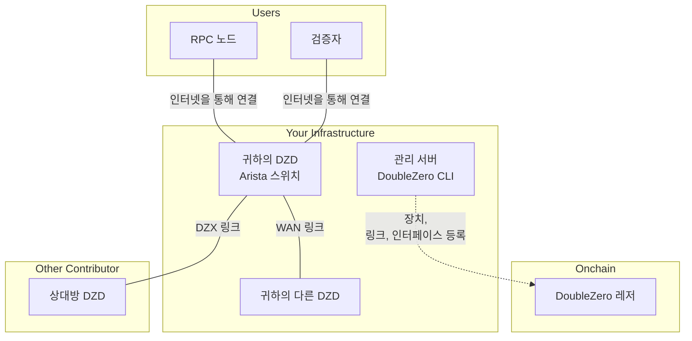
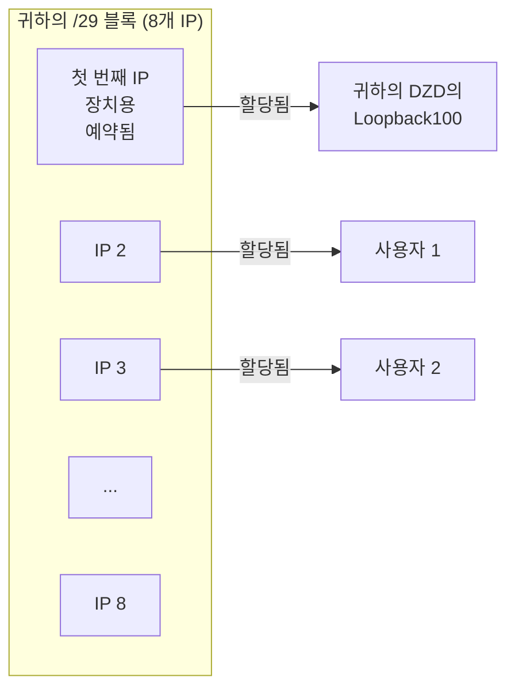
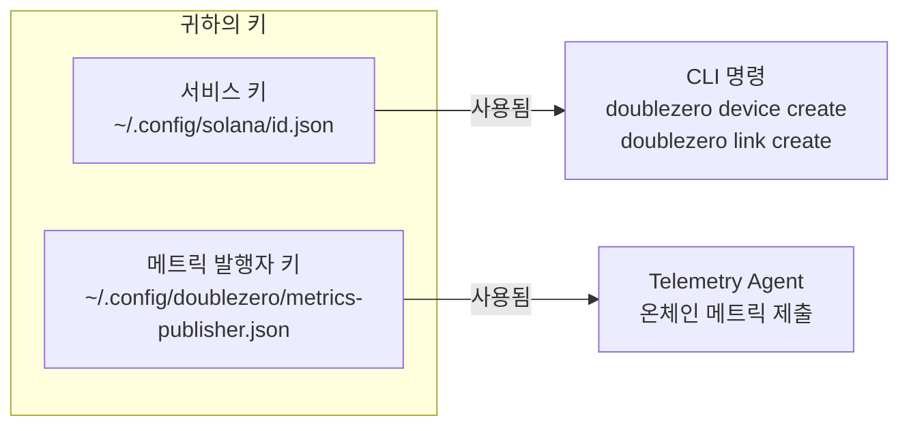
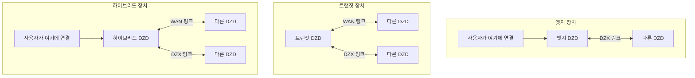
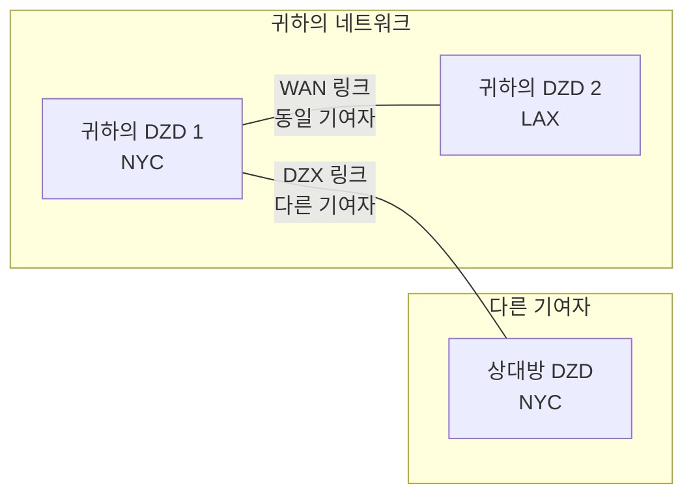
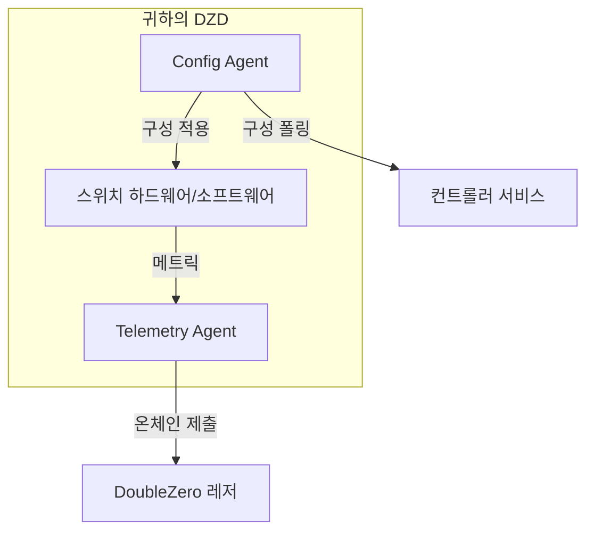
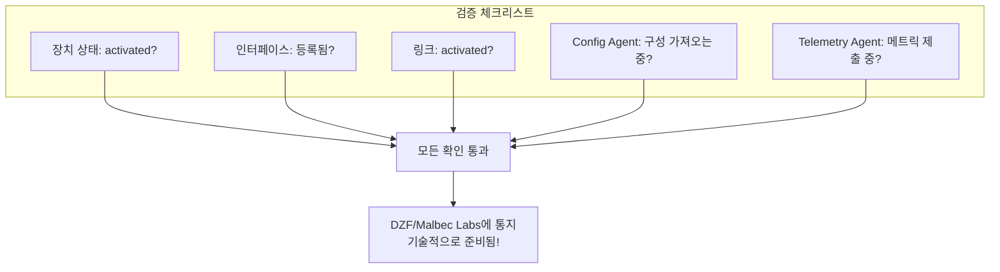

# 장치 프로비저닝 가이드
!!! warning "This translation was generated using artificial intelligence and has not been reviewed by a human translator. It may contain inaccuracies or errors and should not be relied upon."


이 가이드는 처음부터 끝까지 DoubleZero 장치(DZD) 프로비저닝을 안내합니다. 각 단계는 [온보딩 체크리스트](contribute-overview.md#onboarding-checklist)와 일치합니다.

---

## 전체 구성 이해

단계를 시작하기 전에 구축하는 것의 큰 그림을 살펴봅니다:



---

## 1단계: 사전 요구사항

장치를 프로비저닝하기 전에 물리적 하드웨어 설정과 일부 IP 주소 할당이 필요합니다.

### 필요한 사항

| 요구사항 | 필요한 이유 |
|-------------|-----------------|
| **DZD 하드웨어** | Arista 7280CR3A 스위치 ([하드웨어 사양](contribute.md#hardware-requirements) 참조) |
| **랙 공간** | 적절한 공기 흐름을 갖춘 4U |
| **전원** | 이중 피드, ~4KW 권장 |
| **관리 액세스** | 스위치 구성을 위한 SSH/콘솔 액세스 |
| **인터넷 연결** | 메트릭 발행 및 컨트롤러에서 구성 가져오기 |
| **공개 IPv4 블록** | DZ 프리픽스 풀을 위한 최소 /29 (아래 참조) |

### DoubleZero CLI 설치

DoubleZero CLI(`doublezero`)는 프로비저닝 전반에 걸쳐 장치 등록, 링크 생성 및 기여 관리에 사용됩니다. DZD 스위치가 아닌 **관리 서버 또는 VM**에 설치해야 합니다. 스위치는 Config Agent와 Telemetry Agent([4단계](#phase-4-link-establishment-agent-installation)에서 설치됨)만 실행합니다.

**Ubuntu / Debian:**
```bash
curl -1sLf https://dl.cloudsmith.io/public/malbeclabs/doublezero/setup.deb.sh | sudo -E bash
sudo apt-get install doublezero
```

**Rocky Linux / RHEL:**
```bash
curl -1sLf https://dl.cloudsmith.io/public/malbeclabs/doublezero/setup.rpm.sh | sudo -E bash
sudo yum install doublezero
```

데몬이 실행 중인지 확인합니다:
```bash
sudo systemctl status doublezerod
```

### DZ 프리픽스 이해

DZ 프리픽스는 DoubleZero 프로토콜이 IP 할당을 위해 관리하는 공개 IP 주소 블록입니다.



**DZ 프리픽스 사용 방법:**

- **첫 번째 IP**: 장치용으로 예약됨 (Loopback100 인터페이스에 할당)
- **나머지 IP**: DZD에 연결하는 특정 유형의 사용자에게 할당됨:
    - `IBRLWithAllocatedIP` 사용자
    - `EdgeFiltering` 사용자
    - 멀티캐스트 발행자
- **IBRL 사용자**: 이 풀을 소비하지 않음 (자신의 공개 IP 사용)

!!! warning "DZ 프리픽스 규칙"
    **다음 용도로 사용할 수 없습니다:**

    - 자신의 네트워크 장비
    - DIA 인터페이스의 점대점 링크
    - 관리 인터페이스
    - DZ 프로토콜 외부의 모든 인프라

    **요구사항:**

    - **전 세계적으로 라우팅 가능한(공개)** IPv4 주소여야 합니다
    - 사설 IP 범위(10.x, 172.16-31.x, 192.168.x)는 스마트 계약에서 거부됩니다
    - **최소 크기: /29** (8개 주소), 더 큰 프리픽스 권장 (예: /28, /27)
    - 전체 블록이 사용 가능해야 합니다 — 어떤 주소도 사전 할당하지 마세요

    자신의 장비(DIA 인터페이스 IP, 관리 등)를 위한 주소가 필요한 경우 **별도의 주소 풀**을 사용하세요.

---

## 2단계: 계정 설정

이 단계에서는 네트워크에서 귀하와 장치를 식별하는 암호화 키를 생성합니다.

### CLI 실행 위치

!!! warning "스위치에 CLI를 설치하지 마세요"
    DoubleZero CLI(`doublezero`)는 Arista 스위치가 아닌 **관리 서버 또는 VM**에 설치해야 합니다.

    ```mermaid
    flowchart LR
        subgraph "관리 서버/VM"
            CLI[DoubleZero CLI]
            KEYS[귀하의 키쌍]
        end

        subgraph "귀하의 DZD 스위치"
            CA[Config Agent]
            TA[Telemetry Agent]
        end

        CLI -->|장치, 링크 생성| BC[블록체인]
        CA -->|구성 가져오기| CTRL[컨트롤러]
        TA -->|메트릭 제출| BC
    ```

    | 관리 서버에 설치 | 스위치에 설치 |
    |-----------------------------|-------------------|
    | `doublezero` CLI | Config Agent |
    | 서비스 키쌍 | Telemetry Agent |
    | 메트릭 발행자 키쌍 | 메트릭 발행자 키쌍 (복사) |

### 키란 무엇인가?

키를 안전한 로그인 자격 증명으로 생각하세요:

- **서비스 키**: 기여자 신원 - CLI 명령 실행에 사용
- **메트릭 발행자 키**: 텔레메트리 데이터 제출을 위한 장치 신원

둘 다 암호화 키쌍입니다(공유하는 공개 키와 비밀로 유지하는 개인 키).



### 2.1단계: 서비스 키 생성

이것이 DoubleZero와 상호 작용하기 위한 주요 신원입니다.

```bash
doublezero keygen
```

이는 기본 위치에 키쌍을 생성합니다. 출력은 **공개 키**를 보여줍니다 — 이것이 DZF와 공유할 것입니다.

### 2.2단계: 메트릭 발행자 키 생성

이 키는 Telemetry Agent가 메트릭 제출에 서명하는 데 사용됩니다.

```bash
doublezero keygen -o ~/.config/doublezero/metrics-publisher.json
```

### 2.3단계: DZF에 키 제출

DoubleZero Foundation 또는 Malbec Labs에 연락하여 다음을 제공합니다:

1. **서비스 키 공개 키**
2. **GitHub 사용자 이름** (저장소 액세스용)

그들은:

- 온체인에서 **기여자 계정**을 생성합니다
- 비공개 **기여자 저장소**에 대한 액세스를 부여합니다

### 2.4단계: 계정 확인

확인이 완료되면 기여자 계정이 존재하는지 확인합니다:

```bash
doublezero contributor list
```

목록에 기여자 코드가 표시되어야 합니다.

### 2.5단계: 기여자 저장소 액세스

[malbeclabs/contributors](https://github.com/malbeclabs/contributors) 저장소에는 다음이 포함됩니다:

- 기본 장치 구성
- TCAM 프로필
- ACL 구성
- 추가 설정 지침

장치별 구성을 위해 해당 지침을 따르세요.

---

## 3단계: 장치 프로비저닝

이제 블록체인에 물리적 장치를 등록하고 인터페이스를 구성합니다.

### 장치 유형 이해



| 유형 | 기능 | 사용 시기 |
|------|--------------|-------------|
| **엣지** | 사용자 연결만 허용 | 단일 위치, 사용자 대면만 |
| **트랜짓** | 장치 간 트래픽 이동 | 백본 연결, 사용자 없음 |
| **하이브리드** | 사용자 연결 및 백본 모두 | 가장 일반적 - 모든 것 수행 |

### 3.1단계: 위치 및 Exchange 찾기

장치를 생성하기 전에 데이터 센터 위치와 가장 가까운 exchange의 코드를 조회합니다:

```bash
# 사용 가능한 위치(데이터 센터) 목록
doublezero location list

# 사용 가능한 exchange(상호 연결 지점) 목록
doublezero exchange list
```

### 3.2단계: 온체인에서 장치 생성

블록체인에 장치를 등록합니다:

```bash
doublezero device create \
  --code <YOUR_DEVICE_CODE> \
  --contributor <YOUR_CONTRIBUTOR_CODE> \
  --device-type hybrid \
  --location <LOCATION_CODE> \
  --exchange <EXCHANGE_CODE> \
  --public-ip <DEVICE_PUBLIC_IP> \
  --dz-prefixes <YOUR_DZ_PREFIX>
```

**예시:**

```bash
doublezero device create \
  --code nyc-dz001 \
  --contributor acme \
  --device-type hybrid \
  --location EQX-NY5 \
  --exchange nyc \
  --public-ip "203.0.113.10" \
  --dz-prefixes "198.51.100.0/28"
```

**예상 출력:**

```
Signature: 4vKz8H...truncated...7xPq2
```

장치가 생성되었는지 확인합니다:

```bash
doublezero device list | grep nyc-dz001
```

**파라미터 설명:**

| 파라미터 | 의미 |
|-----------|---------------|
| `--code` | 장치의 고유 이름 (예: `nyc-dz001`) |
| `--contributor` | 기여자 코드 (DZF가 제공) |
| `--device-type` | `hybrid`, `transit` 또는 `edge` |
| `--location` | `location list`의 데이터 센터 코드 |
| `--exchange` | `exchange list`의 가장 가까운 exchange 코드 |
| `--public-ip` | 사용자가 인터넷을 통해 장치에 연결하는 공개 IP |
| `--dz-prefixes` | 사용자를 위해 할당된 IP 블록 |

### 3.3단계: 필요한 루프백 인터페이스 생성

모든 장치에는 내부 라우팅을 위해 두 개의 루프백 인터페이스가 필요합니다:

```bash
# VPNv4 루프백
doublezero device interface create <DEVICE_CODE> Loopback255 --loopback-type vpnv4

# IPv4 루프백
doublezero device interface create <DEVICE_CODE> Loopback256 --loopback-type ipv4
```

**예상 출력 (각 명령):**

```
Signature: 3mNx9K...truncated...8wRt5
```

### 3.4단계: 물리적 인터페이스 생성

사용할 물리적 포트를 등록합니다:

```bash
# 기본 인터페이스
doublezero device interface create <DEVICE_CODE> Ethernet1/1
```

**예상 출력:**

```
Signature: 7pQw2R...truncated...4xKm9
```

### 3.5단계: CYOA 인터페이스 생성 (엣지/하이브리드 장치의 경우)

장치가 사용자 연결을 허용하는 경우 CYOA(Choose Your Own Adventure) 인터페이스가 필요합니다. 이는 사용자가 귀하에게 연결하는 방법을 시스템에 알립니다.

**CYOA 유형 설명:**

| 유형 | 쉬운 설명 | 사용 시기 |
|------|--------------|----------|
| `gre-over-dia` | 사용자가 일반 인터넷을 통해 연결 | 가장 일반적 - 사용자가 DIA를 통해 DZD에 연결 |
| `gre-over-private-peering` | 사용자가 전용 링크를 통해 연결 | 사용자가 귀하의 네트워크에 직접 연결 |
| `gre-over-public-peering` | 사용자가 IX를 통해 연결 | 사용자가 인터넷 exchange에서 귀하와 피어링 |
| `gre-over-fabric` | 사용자가 동일한 로컬 네트워크에 있음 | 사용자가 동일한 데이터 센터에 있음 |
| `gre-over-cable` | 사용자에 대한 직접 케이블 | 단일 전용 사용자 |

**예시 - 표준 인터넷 사용자:**

```bash
doublezero device interface create <DEVICE_CODE> Ethernet1/2 \
  --interface-cyoa gre-over-dia \
  --interface-dia dia \
  --bandwidth 10000 \
  --cir 1000 \
  --user-tunnel-endpoint \
  --wait
```

**예상 출력:**

```
Signature: 2wLp8N...truncated...5vHt3
```

**파라미터 설명:**

| 파라미터 | 의미 |
|-----------|---------------|
| `--interface-cyoa` | 사용자 연결 방법 (위 표 참조) |
| `--interface-dia` | 이것이 인터넷 대면 포트인 경우 `dia` |
| `--bandwidth` | Mbps 단위 포트 속도 (10000 = 10Gbps) |
| `--cir` | Mbps 단위 확약 요금 (보장된 대역폭) |
| `--user-tunnel-endpoint` | 이 포트가 사용자 터널을 허용함 |

### 3.6단계: 장치 확인

```bash
doublezero device list
```

**예시 출력:**

```
 account                                      | code      | contributor | location | exchange | device_type | public_ip    | dz_prefixes     | users | max_users | status    | health  | mgmt_vrf | owner
 7xKm9pQw2R4vHt3...                          | nyc-dz001 | acme        | EQX-NY5  | nyc      | hybrid      | 203.0.113.10 | 198.51.100.0/28 | 0     | 14        | activated | pending |          | 5FMtd5Woq5XAAg54...
```

장치가 `activated` 상태로 표시되어야 합니다.

---

## 4단계: 링크 설정 및 에이전트 설치

링크는 장치를 나머지 DoubleZero 네트워크에 연결합니다.

### 링크 이해



| 링크 유형 | 연결 | 수락 |
|-----------|----------|------------|
| **WAN 링크** | 귀하의 두 장치 | 자동 (둘 다 소유) |
| **DZX 링크** | 귀하의 장치 대 다른 기여자 | 상대방 수락 필요 |

### 4.1단계: WAN 링크 생성 (여러 장치가 있는 경우)

WAN 링크는 귀하의 자체 장치를 연결합니다:

```bash
doublezero link create wan \
  --code <LINK_CODE> \
  --contributor <YOUR_CONTRIBUTOR> \
  --side-a <DEVICE_1_CODE> \
  --side-a-interface <INTERFACE_ON_DEVICE_1> \
  --side-z <DEVICE_2_CODE> \
  --side-z-interface <INTERFACE_ON_DEVICE_2> \
  --bandwidth 10000 \
  --mtu 9000 \
  --delay-ms 20 \
  --jitter-ms 1
```

**예시:**

```bash
doublezero link create wan \
  --code nyc-lax-wan01 \
  --contributor acme \
  --side-a nyc-dz001 \
  --side-a-interface Ethernet3/1 \
  --side-z lax-dz001 \
  --side-z-interface Ethernet3/1 \
  --bandwidth 10000 \
  --mtu 9000 \
  --delay-ms 65 \
  --jitter-ms 1
```

**예상 출력:**

```
Signature: 5tNm7K...truncated...9pRw2
```

### 4.2단계: DZX 링크 생성

DZX 링크는 장치를 다른 기여자의 DZD에 직접 연결합니다:

```bash
doublezero link create dzx \
  --code <DEVICE_CODE_A:DEVICE_CODE_Z> \
  --contributor <YOUR_CONTRIBUTOR> \
  --side-a <YOUR_DEVICE_CODE> \
  --side-a-interface <YOUR_INTERFACE> \
  --side-z <OTHER_DEVICE_CODE> \
  --bandwidth <BANDWIDTH in Kbps, Mbps, or Gbps> \
  --mtu <MTU> \
  --delay-ms <DELAY> \
  --jitter-ms <JITTER>
```

**예상 출력:**

```
Signature: 8mKp3W...truncated...2nRx7
```

DZX 링크를 생성한 후 다른 기여자가 이를 수락해야 합니다:

```bash
# 다른 기여자가 이것을 실행합니다
doublezero link accept \
  --code <LINK_CODE> \
  --side-z-interface <THEIR_INTERFACE>
```

**예상 출력 (수락하는 기여자):**

```
Signature: 6vQt9L...truncated...3wPm4
```

### 4.3단계: 링크 확인

```bash
doublezero link list
```

**예시 출력:**

```
 account                                      | code          | contributor | side_a_name | side_a_iface_name | side_z_name | side_z_iface_name | link_type | bandwidth | mtu  | delay_ms | jitter_ms | delay_override_ms | tunnel_id | tunnel_net      | status    | health  | owner
 8vkYpXaBW8RuknJq...                         | nyc-dz001:lax-dz001 | acme        | nyc-dz001   | Ethernet3/1       | lax-dz001   | Ethernet3/1       | WAN       | 10Gbps    | 9000 | 65.00ms  | 1.00ms    | 0.00ms            | 42        | 172.16.0.84/31  | activated | pending | 5FMtd5Woq5XAAg54...
```

양쪽이 구성되면 링크는 `activated` 상태를 표시해야 합니다.

---

### 에이전트 설치

두 개의 소프트웨어 에이전트가 DZD에서 실행됩니다:



| 에이전트 | 기능 |
|-------|--------------|
| **Config Agent** | 컨트롤러에서 구성을 가져와 스위치에 적용 |
| **Telemetry Agent** | 다른 장치에 대한 대기 시간/손실 측정, 온체인으로 메트릭 보고 |

### 4.4단계: Config Agent 설치

#### 스위치에서 API 활성화

EOS 구성에 추가:

```
management api eos-sdk-rpc
    transport grpc eapilocal
        localhost loopback vrf default
        service all
        no disabled
```

!!! note "VRF 참고"
    관리 VRF 이름이 다른 경우(예: `management`) `default`를 해당 이름으로 교체하세요.

#### 에이전트 다운로드 및 설치

```bash
# 스위치에서 bash 입력
switch# bash
$ sudo bash
# cd /mnt/flash
# wget AGENT_DOWNLOAD_URL
# exit
$ exit

# EOS 확장으로 설치
switch# copy flash:AGENT_FILENAME extension:
switch# extension AGENT_FILENAME
switch# copy installed-extensions boot-extensions
```

#### 확장 확인

```bash
switch# show extensions
```

상태는 "A, I, B"여야 합니다:

```
Name                                        Version/Release     Status     Extension
------------------------------------------- ------------------- ---------- ---------
AGENT_FILENAME    MAINNET_CLIENT_VERSION/1             A, I, B    1

A: available | NA: not available | I: installed | F: forced | B: install at boot
```

#### 에이전트 구성 및 시작

EOS 구성에 추가:

```
daemon doublezero-agent
    exec /usr/local/bin/doublezero-agent -pubkey <YOUR_DEVICE_PUBKEY>
    no shut
```

!!! note "VRF 참고"
    관리 VRF가 `default`가 아닌 경우(즉, 네임스페이스가 `ns-default`가 아닌 경우) exec 명령 앞에 `exec /sbin/ip netns exec ns-<VRF>`를 붙입니다. 예를 들어 VRF가 `management`인 경우:
    ```
    daemon doublezero-agent
        exec /sbin/ip netns exec ns-management /usr/local/bin/doublezero-agent -pubkey <YOUR_DEVICE_PUBKEY>
        no shut
    ```

장치 공개 키를 `doublezero device list`의 `account` 열에서 가져옵니다.

#### 실행 확인

```bash
switch# show agent doublezero-agent logs
```

"Starting doublezero-agent" 및 성공적인 컨트롤러 연결이 표시되어야 합니다.

### 4.5단계: Telemetry Agent 설치

#### 메트릭 발행자 키를 장치에 복사

```bash
scp ~/.config/doublezero/metrics-publisher.json <SWITCH_IP>:/mnt/flash/metrics-publisher-keypair.json
```

#### 온체인에 메트릭 발행자 등록

```bash
doublezero device update \
  --pubkey <DEVICE_ACCOUNT> \
  --metrics-publisher <METRICS_PUBLISHER_PUBKEY>
```

metrics-publisher.json 파일에서 공개 키를 가져옵니다.

#### 에이전트 다운로드 및 설치

```bash
switch# bash
$ sudo bash
# cd /mnt/flash
# wget TELEMETRY_DOWNLOAD_URL
# exit
$ exit

# EOS 확장으로 설치
switch# copy flash:TELEMETRY_FILENAME extension:
switch# extension TELEMETRY_FILENAME
switch# copy installed-extensions boot-extensions
```

#### 확장 확인

```bash
switch# show extensions
```

상태는 "A, I, B"여야 합니다:

```
Name                                        Version/Release     Status     Extension
------------------------------------------- ------------------- ---------- ---------
TELEMETRY_FILENAME    MAINNET_CLIENT_VERSION/1             A, I, B    1

A: available | NA: not available | I: installed | F: forced | B: install at boot
```

#### 에이전트 구성 및 시작

EOS 구성에 추가:

```
daemon doublezero-telemetry
    exec /usr/local/bin/doublezero-telemetry --local-device-pubkey <DEVICE_ACCOUNT> --env mainnet --keypair /mnt/flash/metrics-publisher-keypair.json
    no shut
```

!!! note "VRF 참고"
    관리 VRF가 `default`가 아닌 경우(즉, 네임스페이스가 `ns-default`가 아닌 경우) exec 명령에 `--management-namespace ns-<VRF>`를 추가합니다. 예를 들어 VRF가 `management`인 경우:
    ```
    daemon doublezero-telemetry
        exec /usr/local/bin/doublezero-telemetry --management-namespace ns-management --local-device-pubkey <DEVICE_ACCOUNT> --env mainnet --keypair /mnt/flash/metrics-publisher-keypair.json
        no shut
    ```

#### 실행 확인

```bash
switch# show agent doublezero-telemetry logs
```

"Starting telemetry collector" 및 "Starting submission loop"가 표시되어야 합니다.

---

## 5단계: 링크 번인

!!! warning "모든 새 링크는 트래픽을 전달하기 전에 번인해야 합니다"
    새 링크는 프로덕션 트래픽을 활성화하기 전에 **최소 24시간 동안 드레인되어야 합니다**. 이 번인 요구사항은 링크가 서비스 준비가 되기 전에 약 20만 DZ 레저 슬롯(~20시간)의 클린 메트릭을 지정하는 [RFC12: 네트워크 프로비저닝](https://github.com/malbeclabs/doublezero/blob/main/rfcs/rfc12-network-provisioning.md)에 정의되어 있습니다.

에이전트가 설치 및 실행되면 최소 24시간 연속으로 [metrics.doublezero.xyz](https://metrics.doublezero.xyz)에서 링크를 모니터링합니다:

- **"DoubleZero Device-Link Latencies"** 대시보드 — 시간에 따른 링크의 **제로 패킷 손실** 확인
- **"DoubleZero Network Metrics"** 대시보드 — 링크의 **제로 오류** 확인

번인 기간이 제로 손실 및 제로 오류의 클린 링크를 보여준 후에만 링크의 드레인을 해제합니다.

---

## 6단계: 검증 및 활성화

모든 것이 작동하는지 확인하기 위해 이 체크리스트를 실행합니다.

!!! warning "장치는 잠금 상태로 시작됩니다 (`max_users = 0`)"
    장치가 생성되면 `max_users`가 기본적으로 **0**으로 설정됩니다. 즉, 아직 사용자가 연결할 수 없습니다. 이는 의도적인 것입니다 — 사용자 트래픽을 허용하기 전에 모든 것이 작동하는지 확인해야 합니다.

    **`max_users`를 0 이상으로 설정하기 전에 다음을 완료해야 합니다:**

    1. 모든 링크가 [metrics.doublezero.xyz](https://metrics.doublezero.xyz)에서 제로 손실/오류로 **24시간 번인**을 완료했는지 확인
    2. **DZ/Malbec Labs와 조율**하여 연결 테스트 실행:
        - 테스트 사용자가 장치에 연결할 수 있는가?
        - 사용자가 DZ 네트워크를 통해 경로를 수신하는가?
        - 사용자가 DZ 네트워크를 통해 엔드-투-엔드로 트래픽을 라우팅할 수 있는가?
    3. DZ/ML이 테스트 통과를 확인한 후에만 max_users를 96으로 설정합니다:

    ```bash
    doublezero device update --pubkey <DEVICE_ACCOUNT> --max-users 96
    ```

### 장치 확인

```bash
# 장치가 "activated" 상태로 표시되어야 합니다
doublezero device list | grep <YOUR_DEVICE_CODE>
```

**예상 출력:**

```
 7xKm9pQw2R4vHt3... | nyc-dz001 | acme | EQX-NY5 | nyc | hybrid | 203.0.113.10 | 198.51.100.0/28 | 0 | 14 | activated | pending | | 5FMtd5Woq5XAAg54...
```

```bash
# 인터페이스가 나열되어야 합니다
doublezero device interface list | grep <YOUR_DEVICE_CODE>
```

**예상 출력:**

```
 nyc-dz001 | Loopback255 | loopback | vpnv4 | none | none | 0 | 0 | 1500 | static | 0 | 172.16.1.91/32  | 56 | false | activated
 nyc-dz001 | Loopback256 | loopback | ipv4  | none | none | 0 | 0 | 1500 | static | 0 | 172.16.1.100/32 | 0  | false | activated
 nyc-dz001 | Ethernet1/1 | physical | none  | none | none | 0 | 0 | 1500 | static | 0 |                 | 0  | false | activated
```

### 링크 확인

```bash
# 링크가 "activated" 상태를 표시해야 합니다
doublezero link list | grep <YOUR_DEVICE_CODE>
```

**예상 출력:**

```
 8vkYpXaBW8RuknJq... | nyc-lax-wan01 | acme | nyc-dz001 | Ethernet3/1 | lax-dz001 | Ethernet3/1 | WAN | 10Gbps | 9000 | 65.00ms | 1.00ms | 0.00ms | 42 | 172.16.0.84/31 | activated | pending | 5FMtd5Woq5XAAg54...
```

### 에이전트 확인

스위치에서:

```bash
# Config Agent가 성공적인 구성 가져오기를 표시해야 합니다
switch# show agent doublezero-agent logs | tail -20

# Telemetry Agent가 성공적인 제출을 표시해야 합니다
switch# show agent doublezero-telemetry logs | tail -20
```

### 최종 검증 다이어그램



---

## 문제 해결

### 장치 생성 실패

- 서비스 키가 승인되었는지 확인합니다 (`doublezero contributor list`)
- 위치 및 exchange 코드가 유효한지 확인합니다
- DZ 프리픽스가 유효한 공개 IP 범위인지 확인합니다

### "requested" 상태에서 멈춘 링크

- DZX 링크는 다른 기여자의 수락이 필요합니다
- 상대방에게 `doublezero link accept` 실행 요청

### Config Agent가 연결되지 않음

- 관리 네트워크에 인터넷 액세스가 있는지 확인합니다
- VRF 구성이 설정과 일치하는지 확인합니다
- 장치 공개 키가 올바른지 확인합니다

### Telemetry Agent가 제출하지 않음

- 메트릭 발행자 키가 온체인에 등록되었는지 확인합니다
- 스위치에 키쌍 파일이 존재하는지 확인합니다
- 장치 계정 공개 키가 올바른지 확인합니다

---

## 다음 단계

- 에이전트 업그레이드 및 링크 관리에 대한 [운영 가이드](contribute-operations.md) 검토
- 용어 정의는 [용어집](glossary.md) 확인
- 문제가 발생하면 DZF/Malbec Labs에 문의
