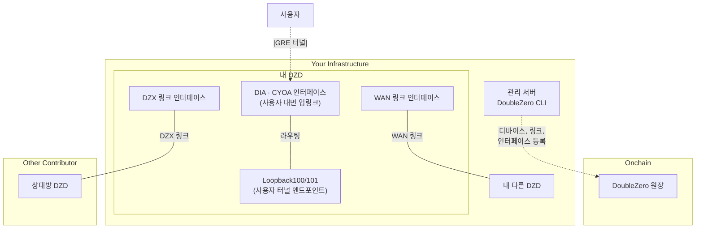
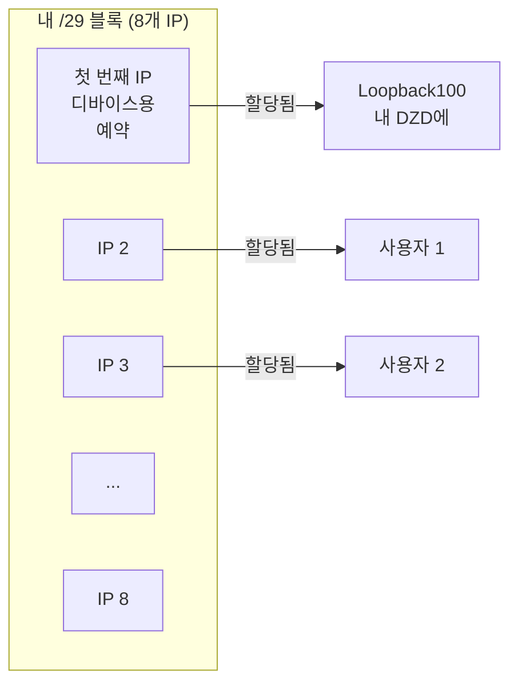
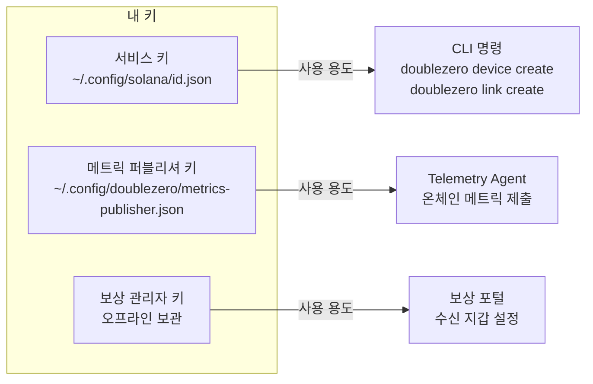
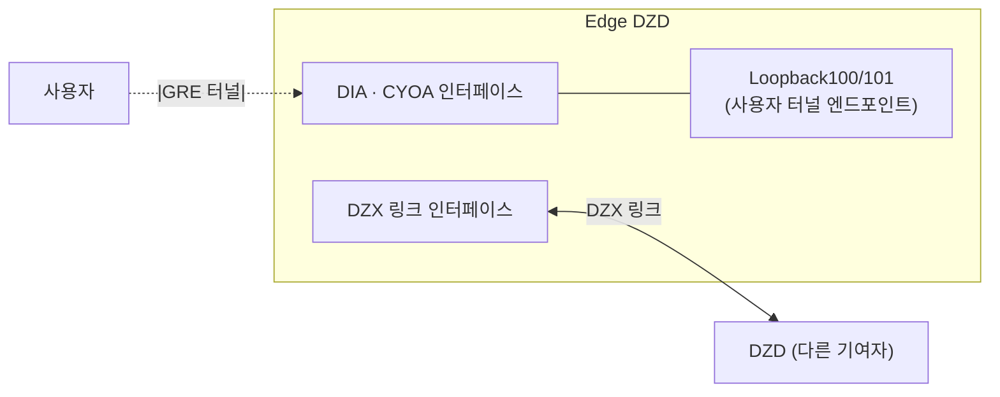
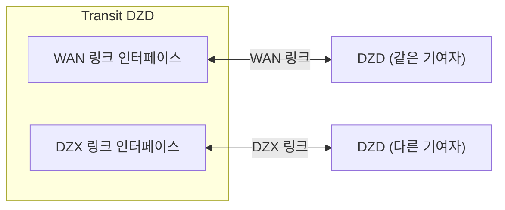
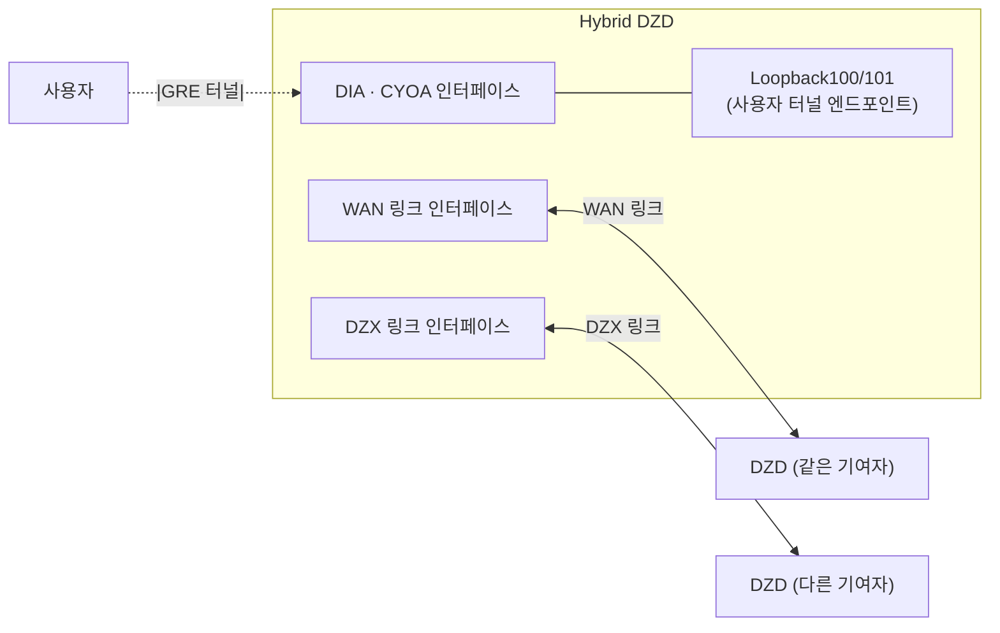

# 디바이스 프로비저닝 가이드

이 가이드는 DoubleZero 디바이스(DZD)를 처음부터 끝까지 프로비저닝하는 과정을 안내합니다. 각 단계는 [온보딩 체크리스트](contribute-overview.md#onboarding-checklist)에 대응됩니다.

---

## 전체 구조 이해하기

이 가이드는 DoubleZero 네트워크가 트래픽을 라우팅할 수 있도록 인프라를 온체인에 등록하는 과정을 안내합니다. 디바이스가 더 완전하게 등록될수록 네트워크에 더 유용합니다. 디바이스의 완전한 온체인 표현은 더 나은 문제 해결, 용량 계획을 가능하게 하며, 컨트롤러가 정보에 기반한 결정을 내릴 수 있게 합니다. 시간이 지남에 따라 컨트롤러가 더 많은 설정 책임을 맡는 것이 목표입니다.

### 핵심 개념

**인터페이스**

DZD의 인터페이스는 다양한 형태로 제공됩니다: 이더넷 포트, 포트 채널(여러 이더넷 포트로 구성된 LAG), 그리고 루프백. 네트워크에서 역할을 하는 각 인터페이스는 프로토콜이 그 기능을 인식할 수 있도록 적절한 플래그와 함께 온체인에 등록되어야 합니다.

이더넷 포트와 포트 채널은 다음 역할을 수행할 수 있습니다:

| 플래그 | 의미 |
|------|---------------|
| `--interface-dia dia` | 인터페이스를 직접 인터넷 접속 업링크로 표시 |
| `--interface-cyoa <subtype>` | 사용자가 이 인터페이스를 통해 GRE 터널을 설정하는 방법 선언 (예: 공용 인터넷을 통해, 프라이빗 피어링 링크를 통해) |
| `--user-tunnel-endpoint true` | 이 인터페이스가 사용자가 GRE 터널을 종단하는 공용 IP를 보유 |

WAN 또는 DZX 링크에 사용되는 인터페이스는 특정 플래그를 갖지 않으며, 대역폭과 함께 등록된 후 링크 생성 시 참조됩니다.

루프백 인터페이스는 여러 목적으로 사용됩니다:

| 루프백 | 의미 |
|----------|---------------|
| **Loopback100 / 101** | 사용자가 GRE 터널을 종단하는 공용 IP를 보유. `--user-tunnel-endpoint true`로 등록됨. |
| **Loopback255** (`vpnv4`) | 컨트롤러가 BGP 라우터 ID, VPN-IPv4 피어링(유니캐스트), IS-IS ID, 세그먼트 라우팅에 사용되는 IP를 할당할 수 있도록 등록됨 |
| **Loopback256** (`ipv4`) | 컨트롤러가 IPv4 BGP 피어링(멀티캐스트) 및 MSDP 세션에 사용되는 IP를 할당할 수 있도록 등록됨 |

**링크**

링크는 인터페이스와 별도로 등록되며, 링크가 참조하려면 먼저 인터페이스가 온체인에 존재해야 합니다. WAN 또는 DZX 링크를 생성할 때 이미 등록된 인터페이스를 링크의 물리적 엔드포인트로 지정합니다. 모든 인터페이스가 링크에 연결되는 것은 아닙니다: DIA, CYOA, 루프백 인터페이스는 링크에 연결되지 않습니다.

| 용어 | 의미 |
|------|---------------|
| **WAN 링크** | 자신이 소유한 두 DZD 간의 링크 |
| **DZX 링크** | 자신의 DZD와 다른 기여자의 DZD 간의 링크 |

### 아키텍처 개요


```mermaid
flowchart TB
    subgraph Onchain
        SC[DoubleZero 원장]
    end

    subgraph Your Infrastructure
        MGMT[관리 서버<br/>DoubleZero CLI]
        subgraph DZD[내 DZD]
            CYOA["DIA · CYOA 인터페이스<br/>(사용자 대면 업링크)"]
            WAN_INTF["WAN 링크 인터페이스"]
            DZX_INTF["DZX 링크 인터페이스"]
            LO100["Loopback100/101<br/>(사용자 터널 엔드포인트)"]
        end
        DZD2[내 다른 DZD]
    end

    subgraph Other Contributor
        OtherDZD[상대방 DZD]
    end

    USERS["사용자"]

    MGMT -.->|디바이스, 링크,<br/>인터페이스 등록| SC
    WAN_INTF ---|WAN 링크| DZD2
    DZX_INTF ---|DZX 링크| OtherDZD
    USERS -.|GRE 터널|.-> CYOA
    CYOA ---|라우팅| LO100
```

---

## 1단계: 사전 준비

디바이스를 프로비저닝하기 전에 물리적 하드웨어 설치와 일부 IP 주소 할당이 필요합니다.

### 필요 사항

| 요구 사항 | 필요한 이유 |
|-------------|-----------------|
| **DZD 하드웨어** | Arista 7280CR3A 스위치 ([하드웨어 사양](contribute.md#hardware-requirements) 참조) |
| **랙 공간** | DZD당 2U 예약 (현재 1U 사용), 적절한 공기 흐름 필요. [랙 및 전원](contribute.md#rack-power-requirements) 참조 |
| **전원** | 각각 전체 부하를 단독으로 감당할 수 있는 두 개의 독립 전원 공급. [랙 및 전원](contribute.md#rack-power-requirements) 참조 |
| **관리 접근** | 스위치 설정을 위한 SSH/콘솔 접근 |
| **인터넷 연결** | 메트릭 게시 및 컨트롤러에서 설정을 가져오기 위해 필요 |
| **공용 IPv4 블록** | DZ 프리픽스 풀을 위한 최소 /29 (아래 참조) |

### DoubleZero CLI 설치

DoubleZero CLI (`doublezero`)는 프로비저닝 과정 전반에서 디바이스 등록, 링크 생성, 기여 관리에 사용됩니다. **관리 서버 또는 VM**에 설치해야 하며, DZD 스위치 자체에는 설치하지 마세요. 스위치에는 Config Agent와 Telemetry Agent만 실행됩니다([4단계](#phase-4-link-establishment-agent-installation)에서 설치).

**Ubuntu / Debian:**
```bash
curl -1sLf https://dl.cloudsmith.io/public/malbeclabs/doublezero/setup.deb.sh | sudo -E bash
sudo apt-get install doublezero
```

**Rocky Linux / RHEL:**
```bash
curl -1sLf https://dl.cloudsmith.io/public/malbeclabs/doublezero/setup.rpm.sh | sudo -E bash
sudo yum install doublezero
```

데몬이 실행 중인지 확인:
```bash
sudo systemctl status doublezerod
```

### DZ 프리픽스 이해하기

DZ 프리픽스는 DoubleZero 프로토콜이 IP 할당을 위해 관리하는 공용 IP 주소 블록입니다.


```mermaid
flowchart LR
    subgraph "내 /29 블록 (8개 IP)"
        IP1["첫 번째 IP<br/>디바이스용<br/>예약"]
        IP2["IP 2"]
        IP3["IP 3"]
        IP4["..."]
        IP8["IP 8"]
    end

    IP1 -->|할당됨| LO[Loopback100<br/>내 DZD에]
    IP2 -->|할당됨| U1[사용자 1]
    IP3 -->|할당됨| U2[사용자 2]
```

**DZ 프리픽스 사용 방법:**

- **첫 번째 IP**: 디바이스용으로 예약됨 (Loopback100 인터페이스에 할당)
- **나머지 IP**: DZD에 연결하는 특정 사용자 유형에 할당:
    - `IBRLWithAllocatedIP` 사용자
    - `EdgeFiltering` 사용자 (향후 사용 사례)
- **IBRL 사용자**: 이 풀에서 소비하지 않음 (자체 공용 IP 사용)

!!! warning "DZ 프리픽스 규칙"
    **다음 용도로 사용할 수 없습니다:**

    - 자체 네트워크 장비
    - DIA 인터페이스의 Point-to-Point 링크
    - 관리 인터페이스
    - DZ 프로토콜 외부의 모든 인프라

    **요구 사항:**

    - **전역적으로 라우팅 가능한(공용)** IPv4 주소여야 합니다
    - 사설 IP 범위(10.x, 172.16-31.x, 192.168.x)는 스마트 컨트랙트에서 거부됩니다
    - **최소 크기: /29** (8개 주소), 더 큰 프리픽스 권장 (예: /28, /27)
    - 전체 블록이 사용 가능해야 합니다 — 주소를 미리 할당하지 마세요

    자체 장비용 주소(DIA 인터페이스 IP, 관리 등)가 필요한 경우 **별도의 주소 풀**을 사용하세요.

---

## 2단계: 계정 설정

이 단계에서는 네트워크에서 자신과 디바이스를 식별하는 암호화 키를 생성하고 보상 관리를 설정합니다.

다음 순서로 진행하는 이유가 있습니다: 먼저 리포지토리 접근 권한 — 리포지토리에 이후 단계에 필요한 지침이 있기 때문이며, 그 다음 키, 그리고 보상 순입니다. 일부 단계에서는 DZF가 조치를 취해야 계속할 수 있으며, 아래 각 항목에 해당 여부가 표시되어 있습니다.

### CLI 실행 위치

!!! warning "스위치에 CLI를 설치하지 마세요"
    DoubleZero CLI (`doublezero`)는 Arista 스위치가 아닌 **관리 서버 또는 VM**에 설치해야 합니다.

    ```mermaid
    flowchart LR
        subgraph "관리 서버/VM"
            CLI[DoubleZero CLI]
            KEYS[내 키 쌍]
        end

        subgraph "내 DZD 스위치"
            CA[Config Agent]
            TA[Telemetry Agent]
        end

        CLI -->|디바이스, 링크 생성| BC[블록체인]
        CA -->|설정 가져오기| CTRL[컨트롤러]
        TA -->|메트릭 제출| BC
    ```

    | 관리 서버에 설치 | 스위치에 설치 |
    |-----------------------------|-------------------|
    | `doublezero` CLI | Config Agent |
    | 서비스 키 쌍 | Telemetry Agent |
    | 메트릭 퍼블리셔 키 쌍 | 메트릭 퍼블리셔 키 쌍 (복사본) |

### 키란 무엇인가?

키는 안전한 로그인 자격 증명과 같습니다:

- **서비스 키**: 기여자 신원 - CLI 명령 실행에 사용
- **메트릭 퍼블리셔 키**: 텔레메트리 데이터 제출을 위한 디바이스 신원
- **보상 관리자 키**: 보상을 받을 지갑을 제어 - 기여자 리포지토리의 [보상 관리](https://github.com/malbeclabs/contributors#rewards-management) 참조

세 가지 모두 암호화 키 쌍입니다 (공유하는 공개 키와 비밀로 유지하는 개인 키).


```mermaid
flowchart LR
    subgraph "내 키"
        SK[서비스 키<br/>~/.config/solana/id.json]
        MK[메트릭 퍼블리셔 키<br/>~/.config/doublezero/metrics-publisher.json]
        RK[보상 관리자 키<br/>오프라인 보관]
    end

    SK -->|사용 용도| CLI[CLI 명령<br/>doublezero device create<br/>doublezero link create]
    MK -->|사용 용도| TEL[Telemetry Agent<br/>온체인 메트릭 제출]
    RK -->|사용 용도| REW[보상 포털<br/>수신 지갑 설정]
```

!!! note "보상 관리자 키는 별도로 보관하세요"
    서비스 키와 메트릭 퍼블리셔 키는 관리 서버와 스위치에 보관됩니다. 보상 관리자 키는 자금이 어디로 가는지를 제어하므로, 해당 장비에서 분리하여 보관하세요. 수신 지갑을 변경할 때만 필요합니다.

### 2.1단계: 기여자 리포지토리 접근 요청

DoubleZero Foundation 또는 Malbec Labs에 연락하여 **GitHub 사용자 이름**을 제공하세요.

비공개 [malbeclabs/contributors](https://github.com/malbeclabs/contributors) 리포지토리에 대한 접근 권한이 부여됩니다. 이것을 먼저 하세요: 리포지토리에 기본 디바이스 설정, TCAM 및 ACL 프로파일, 그리고 아래 단계에서 필요한 보상 관리 지침이 있습니다.

### 2.2단계: 서비스 키 생성

이것은 DoubleZero와 상호작용하기 위한 주요 신원입니다.

```bash
doublezero keygen
```

이 명령은 기본 위치에 키 쌍을 생성합니다. 출력에 **공개 키**가 표시됩니다 — 이것이 DZF와 공유할 키입니다.

### 2.3단계: 메트릭 퍼블리셔 키 생성

이 키는 Telemetry Agent가 메트릭 제출에 서명할 때 사용됩니다.

```bash
doublezero keygen -o ~/.config/doublezero/metrics-publisher.json
```

### 2.4단계: 서비스 키를 DZF에 제출

DZF에 **서비스 키 공개 키**를 보내세요.

DZF가 온체인에 **기여자 계정**을 생성하고 완료 시 확인합니다.

!!! danger "공개 키만 제공하세요"
    개인 키나 키 쌍 파일을 DZF를 포함하여 누구에게도 보내지 마세요. 공개 키만 필요합니다.

### 2.5단계: 계정 확인

확인을 받으면 기여자 계정이 존재하는지 확인합니다:

```bash
doublezero contributor list
```

목록에서 자신의 기여자 코드를 확인할 수 있어야 합니다.

### 2.6단계: 보상 관리 설정

보상 관리는 기여가 획득한 [2Z](glossary.md#2z-token)를 어떤 지갑이 어떤 비율로 받을지를 결정합니다.

2.1단계에서 접근 권한을 얻은 기여자 리포지토리의 [보상 관리](https://github.com/malbeclabs/contributors#rewards-management)를 따르세요.

!!! note "나머지 설정을 차단하지 않습니다"
    이것이 완료되지 않아도 디바이스 프로비저닝, 링크 설정 및 트래픽 전달을 시작할 수 있으므로, 아래 단계들은 이것과 독립적으로 진행하세요.

---

## 3단계: 디바이스 프로비저닝

이제 물리적 디바이스를 블록체인에 등록하고 인터페이스를 설정합니다.

### 디바이스 유형 이해하기

**Edge** — 사용자 연결만 수락


```mermaid
flowchart LR
    subgraph EDZD[Edge DZD]
        E_CYOA["DIA · CYOA 인터페이스"]
        E_TUN["Loopback100/101
        (사용자 터널 엔드포인트)"]
        E_DZX["DZX 링크 인터페이스"]
        E_CYOA --- E_TUN
    end
    EU["사용자"] -.|GRE 터널|.-> E_CYOA
    E_DZX <-->|DZX 링크| ED["DZD (다른 기여자)"]
```

**Transit** — 디바이스 간 트래픽 이동, 사용자 연결 없음


```mermaid
flowchart LR
    subgraph TDZD[Transit DZD]
        T_WAN["WAN 링크 인터페이스"]
        T_DZX["DZX 링크 인터페이스"]
    end
    T_WAN <-->|WAN 링크| T2["DZD (같은 기여자)"]
    T_DZX <-->|DZX 링크| TD["DZD (다른 기여자)"]
```

**Hybrid** — 사용자 연결과 백본, 가장 일반적


```mermaid
flowchart LR
    subgraph HDZD[Hybrid DZD]
        H_CYOA["DIA · CYOA 인터페이스"]
        H_TUN["Loopback100/101
        (사용자 터널 엔드포인트)"]
        H_WAN["WAN 링크 인터페이스"]
        H_DZX["DZX 링크 인터페이스"]
        H_CYOA --- H_TUN
    end
    HU["사용자"] -.|GRE 터널|.-> H_CYOA
    H_WAN <-->|WAN 링크| H2["DZD (같은 기여자)"]
    H_DZX <-->|DZX 링크| HD["DZD (다른 기여자)"]
```

| 유형 | 기능 | 사용 시기 |
|------|--------------|-------------|
| **Edge** | 사용자 연결만 수락 | 단일 위치, 사용자 대면 전용 |
| **Transit** | 디바이스 간 트래픽 이동 | 백본 연결, 사용자 없음 |
| **Hybrid** | 사용자 연결과 백본 모두 | 가장 일반적 — 모든 기능 수행 |

### 3.1단계: 위치와 교환소 찾기

디바이스를 생성하기 전에 데이터센터 위치와 가장 가까운 교환소 코드를 조회하세요:

```bash
# 사용 가능한 위치(데이터센터) 목록
doublezero location list

# 사용 가능한 교환소(상호연결 지점) 목록
doublezero exchange list
```

### 3.2단계: 디바이스 온체인 생성

블록체인에 디바이스를 등록합니다:

```bash
doublezero device create \
  --code <YOUR_DEVICE_CODE> \
  --contributor <YOUR_CONTRIBUTOR_CODE> \
  --device-type hybrid \
  --location <LOCATION_CODE> \
  --exchange <EXCHANGE_CODE> \
  --public-ip <DEVICE_PUBLIC_IP> \
  --dz-prefixes <YOUR_DZ_PREFIX>
```

**예시:**

```bash
doublezero device create \
  --code nyc-dz001 \
  --contributor acme \
  --device-type hybrid \
  --location EQX-NY5 \
  --exchange nyc \
  --public-ip "203.0.113.10" \
  --dz-prefixes "198.51.100.0/28"
```

**예상 출력:**

```
Signature: 4vKz8H...truncated...7xPq2
```

디바이스가 생성되었는지 확인:

```bash
doublezero device list | grep nyc-dz001
```

**파라미터 설명:**

| 파라미터 | 의미 |
|-----------|---------------|
| `--code` | 디바이스의 고유 이름 (예: `nyc-dz001`) |
| `--contributor` | 기여자 코드 (DZF에서 제공) |
| `--device-type` | `hybrid`, `transit`, 또는 `edge` |
| `--location` | `location list`에서 가져온 데이터센터 코드 |
| `--exchange` | `exchange list`에서 가져온 가장 가까운 교환소 코드 |
| `--public-ip` | 사용자가 인터넷을 통해 디바이스에 연결하는 공용 IP |
| `--dz-prefixes` | 사용자를 위해 할당된 IP 블록 |

### 3.3단계: 필수 루프백 인터페이스 생성

모든 디바이스에는 내부 라우팅을 위한 두 개의 루프백 인터페이스가 필요합니다:

```bash
# VPNv4 루프백
doublezero device interface create <DEVICE_CODE> Loopback255 --loopback-type vpnv4

# IPv4 루프백
doublezero device interface create <DEVICE_CODE> Loopback256 --loopback-type ipv4
```

**예상 출력 (각 명령별):**

```
Signature: 3mNx9K...truncated...8wRt5
```

### 3.4단계: 물리적 인터페이스 생성

WAN 또는 DZX 링크에 사용될 물리적 인터페이스를 등록합니다. 이 인터페이스들은 링크를 참조하는 링크를 생성하기 전에 온체인에 존재해야 합니다. 이 단계에서는 인터페이스와 대역폭만 등록하며, 링크는 이후 단계에서 생성됩니다.

```bash
doublezero device interface create <DEVICE_CODE> <INTERFACE_NAME> \
  --bandwidth <PORT_SPEED>
```

**예시:**

```bash
doublezero device interface create nyc-dz001 Ethernet1/1 \
  --bandwidth 10Gbps
```

**예상 출력:**

```
Signature: 7pQw2R...truncated...4xKm9
```

WAN 또는 DZX 링크 엔드포인트로 사용될 각 인터페이스에 대해 이 과정을 반복합니다. CYOA 및 DIA 인터페이스는 다음 단계에서 별도로 등록됩니다.

### 3.5단계: CYOA 인터페이스 생성 (Edge/Hybrid 디바이스용)

Hybrid 및 Edge DZD에는 사용자가 GRE 터널을 종단하는 **두 개의 공용 IP 주소**가 필요합니다. 사용자는 유니캐스트, 멀티캐스트, 또는 둘 다를 통해 연결할 수 있으며, 어떤 IP가 어떤 용도로 사용되는지는 사용자별로 순환됩니다.

두 IP 모두 `--user-tunnel-endpoint true`로 등록해야 하며, 물리적 인터페이스 또는 루프백에 등록할 수 있습니다. 디바이스 생성 시 제공한 IP도 포함되며, 해당 IP는 여기서 명시적으로 등록해야 합니다.

IP가 부족한 경우, DZ 프리픽스의 첫 번째 `/32`를 두 IP 중 하나로 사용할 수 있습니다.

#### CYOA와 DIA

| 유형 | 플래그 | 목적 |
|------|------|---------|
| DIA | `--interface-dia dia` | 포트를 직접 인터넷 접속으로 표시 |
| CYOA | `--interface-cyoa <subtype>` | 사용자가 디바이스에 GRE 터널을 연결하는 방법 선언 |

CYOA 플래그는 항상 **물리적 인터페이스**(이더넷 포트 또는 포트 채널)에 설정됩니다. 루프백에는 절대 설정하지 마세요.

| CYOA 서브타입 | 사용 시기 |
|-------------|-------------|
| `gre-over-dia` | 사용자가 공용 인터넷을 통해 연결. 가장 일반적. |
| `gre-over-private-peering` | 사용자가 직접 크로스 커넥트 또는 전용 회선을 통해 연결 |
| `gre-over-public-peering` | 사용자가 인터넷 교환(IX)에서 피어링 |
| `gre-over-fabric` | 사용자가 같은 위치에서 로컬 패브릭을 통해 연결 |
| `gre-over-cable` | 단일 전용 사용자에 대한 직접 케이블 연결 |

#### 시나리오 A: 단일 물리적 인터페이스

ISP로의 단일 물리적 업링크. Ethernet1/1이 CYOA 및 DIA 인터페이스이며 두 공