# 장치 프로비저닝 가이드

이 가이드는 DoubleZero 장치(DZD)를 처음부터 끝까지 프로비저닝하는 과정을 안내합니다. 각 단계는 [온보딩 체크리스트](contribute-overview.md#onboarding-checklist)에 해당합니다.

---

## 전체 구조 이해

이 가이드는 DoubleZero 네트워크가 인프라를 통해 트래픽을 라우팅할 수 있도록 온체인에 인프라를 등록하는 과정을 안내합니다. 장치가 더 완전하게 등록될수록 네트워크에 더 유용합니다. 장치의 온체인 표현이 완전하면 더 나은 문제 해결, 용량 계획이 가능하며, 컨트롤러가 정보에 기반한 결정을 내릴 수 있습니다. 장기적으로 컨트롤러가 더 많은 구성 책임을 맡는 것이 목표입니다.

### 핵심 개념

**인터페이스**

DZD의 인터페이스는 다양한 형태가 있습니다: 이더넷 포트, 포트 채널(여러 이더넷 포트로 구성된 LAG), 루프백. 네트워크에서 역할을 하는 각 인터페이스는 프로토콜이 그 기능을 알 수 있도록 적절한 플래그와 함께 온체인에 등록되어야 합니다.

이더넷 포트와 포트 채널은 다음 역할을 수행할 수 있습니다:

| 플래그 | 의미 |
|------|---------------|
| `--interface-dia dia` | 인터페이스를 직접 인터넷 액세스 업링크로 표시 |
| `--interface-cyoa <subtype>` | 사용자가 이 인터페이스를 통해 GRE 터널을 설정하는 방법을 선언 (예: 공용 인터넷 경유, 프라이빗 피어링 링크 경유) |
| `--user-tunnel-endpoint true` | 이 인터페이스는 사용자가 GRE 터널을 종단하는 공용 IP를 보유 |

WAN 또는 DZX 링크에 사용되는 인터페이스는 특정 플래그를 갖지 않으며, 대역폭과 함께 등록된 후 링크 생성 시 참조됩니다.

루프백 인터페이스는 여러 목적으로 사용됩니다:

| 루프백 | 의미 |
|----------|---------------|
| **Loopback100 / 101** | 사용자가 GRE 터널을 종단하는 공용 IP를 보유. `--user-tunnel-endpoint true`로 등록. |
| **Loopback255** (`vpnv4`) | 컨트롤러가 BGP 라우터 ID, VPN-IPv4 피어링(유니캐스트), IS-IS 식별, 세그먼트 라우팅에 사용할 IP를 할당할 수 있도록 등록 |
| **Loopback256** (`ipv4`) | 컨트롤러가 IPv4 BGP 피어링(멀티캐스트) 및 MSDP 세션에 사용할 IP를 할당할 수 있도록 등록 |

**링크**

링크는 인터페이스와 별도로 등록되며, 링크가 인터페이스를 참조하려면 먼저 인터페이스가 온체인에 존재해야 합니다. WAN 또는 DZX 링크를 생성할 때, 이미 등록된 인터페이스를 링크의 물리적 엔드포인트로 지정합니다. 모든 인터페이스가 링크에 연결되는 것은 아닙니다: DIA, CYOA, 루프백 인터페이스는 링크에 연결되지 않습니다.

| 용어 | 의미 |
|------|---------------|
| **WAN 링크** | 자신의 DZD 두 대 사이의 링크 |
| **DZX 링크** | 자신의 DZD와 다른 기여자의 DZD 사이의 링크 |

### 아키텍처 개요

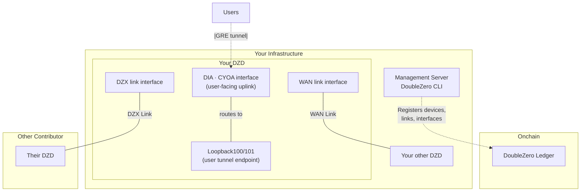
```mermaid
flowchart TB
    subgraph Onchain
        SC[DoubleZero Ledger]
    end

    subgraph Your Infrastructure
        MGMT[Management Server<br/>DoubleZero CLI]
        subgraph DZD[Your DZD]
            CYOA["DIA · CYOA interface<br/>(user-facing uplink)"]
            WAN_INTF["WAN link interface"]
            DZX_INTF["DZX link interface"]
            LO100["Loopback100/101<br/>(user tunnel endpoint)"]
        end
        DZD2[Your other DZD]
    end

    subgraph Other Contributor
        OtherDZD[Their DZD]
    end

    USERS["Users"]

    MGMT -.->|Registers devices,<br/>links, interfaces| SC
    WAN_INTF ---|WAN Link| DZD2
    DZX_INTF ---|DZX Link| OtherDZD
    USERS -.|GRE tunnel|.-> CYOA
    CYOA ---|routes to| LO100
```

---

## 1단계: 사전 요구 사항

장치를 프로비저닝하기 전에 물리적 하드웨어를 설치하고 일부 IP 주소를 할당해야 합니다.

### 필요 사항

| 요구 사항 | 필요한 이유 |
|-------------|-----------------|
| **DZD 하드웨어** | Arista 7280CR3A 스위치 ([하드웨어 사양](contribute.md#hardware-requirements) 참조) |
| **랙 공간** | 적절한 공기 흐름이 확보된 4U |
| **전원** | 이중화 전원, ~4KW 권장 |
| **관리 접근** | 스위치 구성을 위한 SSH/콘솔 접근 |
| **인터넷 연결** | 메트릭 게시 및 컨트롤러로부터 구성 가져오기 |
| **공용 IPv4 블록** | DZ 프리픽스 풀을 위한 최소 /29 (아래 참조) |

### DoubleZero CLI 설치

DoubleZero CLI(`doublezero`)는 프로비저닝 전반에 걸쳐 장치 등록, 링크 생성 및 기여 관리에 사용됩니다. DZD 스위치 자체가 아닌 **관리 서버 또는 VM**에 설치해야 합니다. 스위치에는 Config Agent와 Telemetry Agent만 실행됩니다([4단계](#phase-4-link-establishment-agent-installation)에서 설치).

**Ubuntu / Debian:**
```bash
curl -1sLf https://dl.cloudsmith.io/public/malbeclabs/doublezero/setup.deb.sh | sudo -E bash
sudo apt-get install doublezero
```

**Rocky Linux / RHEL:**
```bash
curl -1sLf https://dl.cloudsmith.io/public/malbeclabs/doublezero/setup.rpm.sh | sudo -E bash
sudo yum install doublezero
```

데몬이 실행 중인지 확인:
```bash
sudo systemctl status doublezerod
```

### DZ 프리픽스 이해

DZ 프리픽스는 DoubleZero 프로토콜이 IP 할당을 위해 관리하는 공용 IP 주소 블록입니다.

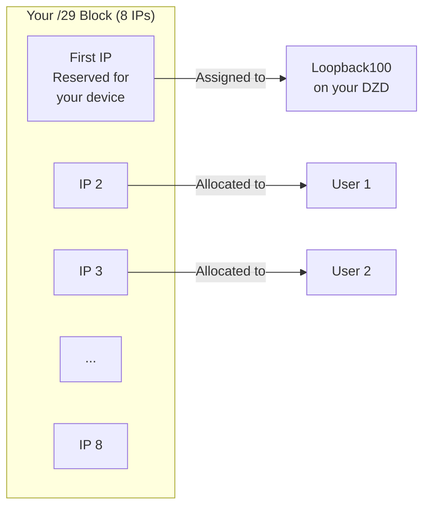
```mermaid
flowchart LR
    subgraph "Your /29 Block (8 IPs)"
        IP1["First IP<br/>Reserved for<br/>your device"]
        IP2["IP 2"]
        IP3["IP 3"]
        IP4["..."]
        IP8["IP 8"]
    end

    IP1 -->|Assigned to| LO[Loopback100<br/>on your DZD]
    IP2 -->|Allocated to| U1[User 1]
    IP3 -->|Allocated to| U2[User 2]
```

**DZ 프리픽스 사용 방법:**

- **첫 번째 IP**: 장치 전용 (Loopback100 인터페이스에 할당)
- **나머지 IP**: DZD에 연결하는 특정 사용자 유형에 할당:
    - `IBRLWithAllocatedIP` 사용자
    - `EdgeFiltering` 사용자 (향후 사용 사례)
- **IBRL 사용자**: 이 풀에서 소비하지 않음 (자체 공용 IP 사용)

!!! warning "DZ 프리픽스 규칙"
    **다음 용도로 이 주소를 사용할 수 없습니다:**

    - 자체 네트워크 장비
    - DIA 인터페이스의 점대점 링크
    - 관리 인터페이스
    - DZ 프로토콜 외부의 모든 인프라

    **요구 사항:**

    - **전역 라우팅 가능한(공용)** IPv4 주소여야 함
    - 사설 IP 범위 (10.x, 172.16-31.x, 192.168.x)는 스마트 컨트랙트에서 거부됨
    - **최소 크기: /29** (8개 주소), 더 큰 프리픽스 권장 (예: /28, /27)
    - 전체 블록이 사용 가능해야 함 — 주소를 미리 할당하지 마세요

    자체 장비(DIA 인터페이스 IP, 관리 등)에 주소가 필요한 경우 **별도의 주소 풀**을 사용하세요.

---

## 2단계: 계정 설정

이 단계에서는 네트워크에서 귀하와 장치를 식별하는 암호화 키를 생성합니다.

### CLI 실행 위치

!!! warning "스위치에 CLI를 설치하지 마세요"
    DoubleZero CLI(`doublezero`)는 Arista 스위치가 아닌 **관리 서버 또는 VM**에 설치해야 합니다.

    ```mermaid
    flowchart LR
        subgraph "Management Server/VM"
            CLI[DoubleZero CLI]
            KEYS[Your Keypairs]
        end

        subgraph "Your DZD Switch"
            CA[Config Agent]
            TA[Telemetry Agent]
        end

        CLI -->|Creates devices, links| BC[Blockchain]
        CA -->|Pulls config| CTRL[Controller]
        TA -->|Submits metrics| BC
    ```

    | 관리 서버에 설치 | 스위치에 설치 |
    |-----------------------------|-------------------|
    | `doublezero` CLI | Config Agent |
    | 서비스 키페어 | Telemetry Agent |
    | 메트릭 퍼블리셔 키페어 | 메트릭 퍼블리셔 키페어 (복사본) |

### 키란 무엇인가?

키는 보안 로그인 자격 증명과 같습니다:

- **서비스 키**: 기여자 ID - CLI 명령 실행에 사용
- **메트릭 퍼블리셔 키**: 텔레메트리 데이터 제출을 위한 장치 ID

둘 다 암호화 키페어입니다 (공유하는 공개 키와 비밀로 유지하는 개인 키).

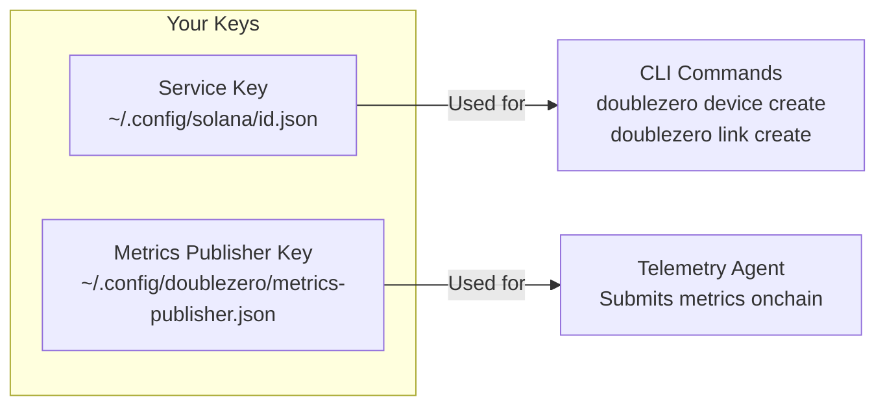
```mermaid
flowchart LR
    subgraph "Your Keys"
        SK[Service Key<br/>~/.config/solana/id.json]
        MK[Metrics Publisher Key<br/>~/.config/doublezero/metrics-publisher.json]
    end

    SK -->|Used for| CLI[CLI Commands<br/>doublezero device create<br/>doublezero link create]
    MK -->|Used for| TEL[Telemetry Agent<br/>Submits metrics onchain]
```

### 단계 2.1: 서비스 키 생성

DoubleZero와 상호 작용하기 위한 주요 ID입니다.

```bash
doublezero keygen
```

기본 위치에 키페어가 생성됩니다. 출력에 **공개 키**가 표시됩니다 - 이것을 DZF와 공유합니다.

### 단계 2.2: 메트릭 퍼블리셔 키 생성

이 키는 Telemetry Agent가 메트릭 제출에 서명하는 데 사용됩니다.

```bash
doublezero keygen -o ~/.config/doublezero/metrics-publisher.json
```

### 단계 2.3: DZF에 키 제출

DoubleZero Foundation 또는 Malbec Labs에 연락하여 다음을 제공하세요:

1. **서비스 키 공개 키**
2. **GitHub 사용자 이름** (저장소 접근용)

그들이 수행할 작업:

- 온체인에 **기여자 계정** 생성
- 비공개 **기여자 저장소**에 대한 접근 권한 부여

### 단계 2.4: 계정 확인

확인되면 기여자 계정이 존재하는지 확인하세요:

```bash
doublezero contributor list
```

목록에서 귀하의 기여자 코드를 확인할 수 있어야 합니다.

### 단계 2.5: 기여자 저장소 접근

[malbeclabs/contributors](https://github.com/malbeclabs/contributors) 저장소에는 다음이 포함되어 있습니다:

- 기본 장치 구성
- TCAM 프로파일
- ACL 구성
- 추가 설정 지침

장치별 구성에 대해서는 해당 저장소의 지침을 따르세요.

---

## 3단계: 장치 프로비저닝

이제 물리적 장치를 블록체인에 등록하고 인터페이스를 구성합니다.

### 장치 유형 이해 {#understanding-device-types}

**Edge** — 사용자 연결만 수락

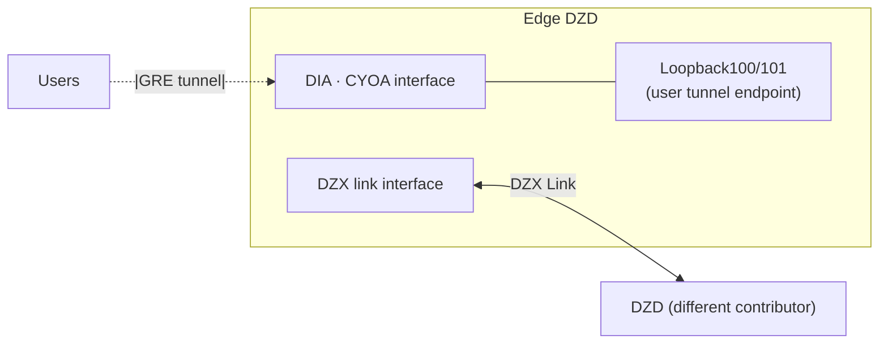
```mermaid
flowchart LR
    subgraph EDZD[Edge DZD]
        E_CYOA["DIA · CYOA interface"]
        E_TUN["Loopback100/101
        (user tunnel endpoint)"]
        E_DZX["DZX link interface"]
        E_CYOA --- E_TUN
    end
    EU["Users"] -.|GRE tunnel|.-> E_CYOA
    E_DZX <-->|DZX Link| ED["DZD (different contributor)"]
```

**Transit** — 장치 간 트래픽 전달, 사용자 연결 없음

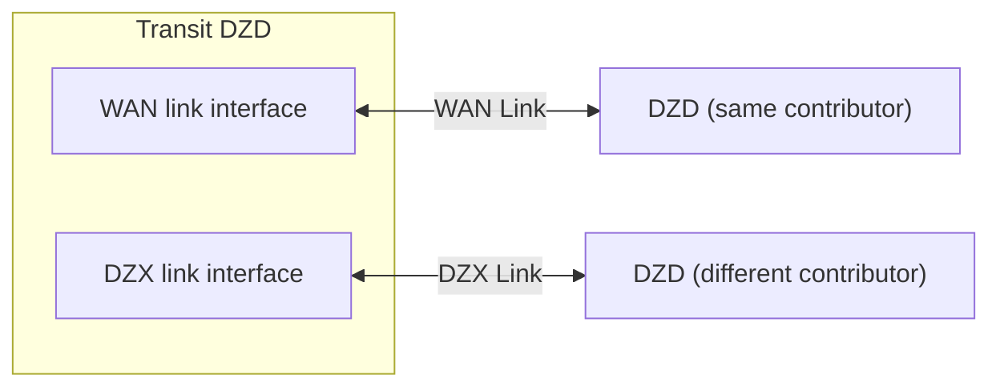
```mermaid
flowchart LR
    subgraph TDZD[Transit DZD]
        T_WAN["WAN link interface"]
        T_DZX["DZX link interface"]
    end
    T_WAN <-->|WAN Link| T2["DZD (same contributor)"]
    T_DZX <-->|DZX Link| TD["DZD (different contributor)"]
```

**Hybrid** — 사용자 연결과 백본 모두, 가장 일반적

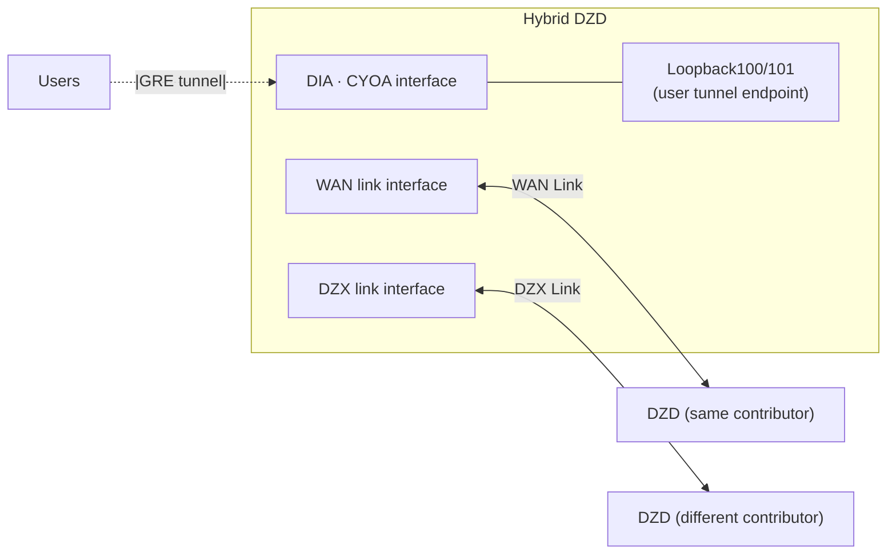
```mermaid
flowchart LR
    subgraph HDZD[Hybrid DZD]
        H_CYOA["DIA · CYOA interface"]
        H_TUN["Loopback100/101
        (user tunnel endpoint)"]
        H_WAN["WAN link interface"]
        H_DZX["DZX link interface"]
        H_CYOA --- H_TUN
    end
    HU["Users"] -.|GRE tunnel|.-> H_CYOA
    H_WAN <-->|WAN Link| H2["DZD (same contributor)"]
    H_DZX <-->|DZX Link| HD["DZD (different contributor)"]
```

| 유형 | 기능 | 사용 시기 |
|------|--------------|-------------|
| **Edge** | 사용자 연결만 수락 | 단일 위치, 사용자 대면 전용 |
| **Transit** | 장치 간 트래픽 전달 | 백본 연결, 사용자 없음 |
| **Hybrid** | 사용자 연결과 백본 모두 | 가장 일반적 - 모든 기능 수행 |

### 단계 3.1: 위치 및 익스체인지 찾기

장치를 생성하기 전에 데이터센터 위치와 가장 가까운 익스체인지 코드를 조회하세요:

```bash
# 사용 가능한 위치(데이터센터) 목록
doublezero location list

# 사용 가능한 익스체인지(인터커넥트 포인트) 목록
doublezero exchange list
```

### 단계 3.2: 온체인에 장치 생성 {#step-32-create-your-device-onchain}

블록체인에 장치를 등록합니다:

```bash
doublezero device create \
  --code <YOUR_DEVICE_CODE> \
  --contributor <YOUR_CONTRIBUTOR_CODE> \
  --device-type hybrid \
  --location <LOCATION_CODE> \
  --exchange <EXCHANGE_CODE> \
  --public-ip <DEVICE_PUBLIC_IP> \
  --dz-prefixes <YOUR_DZ_PREFIX>
```

**예시:**

```bash
doublezero device create \
  --code nyc-dz001 \
  --contributor acme \
  --device-type hybrid \
  --location EQX-NY5 \
  --exchange nyc \
  --public-ip "203.0.113.10" \
  --dz-prefixes "198.51.100.0/28"
```

**예상 출력:**

```
Signature: 4vKz8H...truncated...7xPq2
```

장치가 생성되었는지 확인:

```bash
doublezero device list | grep nyc-dz001
```

**파라미터 설명:**

| 파라미터 | 의미 |
|-----------|---------------|
| `--code` | 장치의 고유 이름 (예: `nyc-dz001`) |
| `--contributor` | 기여자 코드 (DZF에서 부여) |
| `--device-type` | `hybrid`, `transit`, 또는 `edge` |
| `--location` | `location list`에서 확인한 데이터센터 코드 |
| `--exchange` | `exchange list`에서 확인한 가장 가까운 익스체인지 코드 |
| `--public-ip` | 사용자가 인터넷을 통해 장치에 연결하는 공용 IP |
| `--dz-prefixes` | 사용자를 위해 할당된 IP 블록 |

### 단계 3.3: 필수 루프백 인터페이스 생성

모든 장치에는 내부 라우팅을 위한 두 개의 루프백 인터페이스가 필요합니다:

```bash
# VPNv4 루프백
doublezero device interface create <DEVICE_CODE> Loopback255 --loopback-type vpnv4

# IPv4 루프백
doublezero device interface create <DEVICE_CODE> Loopback256 --loopback-type ipv4
```

**예상 출력 (각 명령에 대해):**

```
Signature: 3mNx9K...truncated...8wRt5
```

### 단계 3.4: 물리적 인터페이스 생성

WAN 또는 DZX 링크에 사용될 물리적 인터페이스를 등록합니다. 이 인터페이스는 링크를 참조하는 링크를 생성하기 전에 온체인에 존재해야 합니다. 이 단계에서는 인터페이스와 대역폭만 등록하며, 링크는 이후 단계에서 생성됩니다.

```bash
doublezero device interface create <DEVICE_CODE> <INTERFACE_NAME> \
  --bandwidth <PORT_SPEED>
```

**예시:**

```bash
doublezero device interface create nyc-dz001 Ethernet1/1 \
  --bandwidth 10Gbps
```

**예상 출력:**

```
Signature: 7pQw2R...truncated...4xKm9
```

WAN 또는 DZX 링크 엔드포인트로 사용될 각 인터페이스에 대해 이 작업을 반복합니다. CYOA 및 DIA 인터페이스는 다음 단계에서 별도로 등록됩니다.

### 단계 3.5: CYOA 인터페이스 생성 (Edge/Hybrid 장치용) {#step-35-create-cyoa-interface-for-edgehybrid-devices}

Hybrid 및 Edge DZD에는 사용자가 GRE 터널을 종단하는 **두 개의 공용 IP 주소**가 필요합니다. 사용자는 유니캐스트, 멀티캐스트 또는 둘 다를 통해 연결할 수 있으며, 어떤 IP가 어떤 용도로 사용되는지는 사용자별로 순환됩니다.

두 IP 모두 물리적 인터페이스 또는 루프백에 `--user-tunnel-endpoint true`로 등록되어야 합니다. 여기에는 장치 생성 시 제공한 IP도 포함됩니다 — 해당 IP도 여기에서 명시적으로 등록해야 합니다.

IP가 부족한 경우 DZ 프리픽스의 첫 번째 `/32`를 두 IP 중 하나로 사용할 수 있습니다.

#### CYOA와 DIA

| 유형 | 플래그 | 목적 |
|------|------|---------|
| DIA | `--interface-dia dia` | 포트를 직접 인터넷 액세스로 표시 |
| CYOA | `--interface-cyoa <subtype>` | 사용자가 장치에 GRE 터널을 연결하는 방법을 선언 |

CYOA 플래그는 항상 **물리적 인터페이스** (이더넷 포트 또는 포트 채널)에 설정됩니다. 루프백에는 절대 설정하지 않습니다.

| CYOA 하위 유형 | 사용 시기 |
|-------------|-------------|
| `gre-over-dia` | 사용자가 공용 인터넷을 통해 연결. 가장 일반적. |
| `gre-over-private-peering` | 사용자가 직접 크로스커넥트 또는 프라이빗 회선을 통해 연결 |
| `gre-over-public-peering` | 사용자가 인터넷 익스체인지(IX)에서 피어링 |
| `gre-over-fabric` | 사용자가 동일 위치에서 로컬 패브릭을 통해 연결 |
| `gre-over-cable` | 단일 전용 사용자에 대한 직접 케이블 연결 |

#### 시나리오 A: 단일 물리적 인터페이스

ISP에 대한 하나의 물리적 업링크. Ethernet1/1이 CYOA 및 DIA 인터페이스이며 두 공용 IP 중 하나를 보유합니다. Loopback100이 두 번째 공용 IP를 보유합니다.

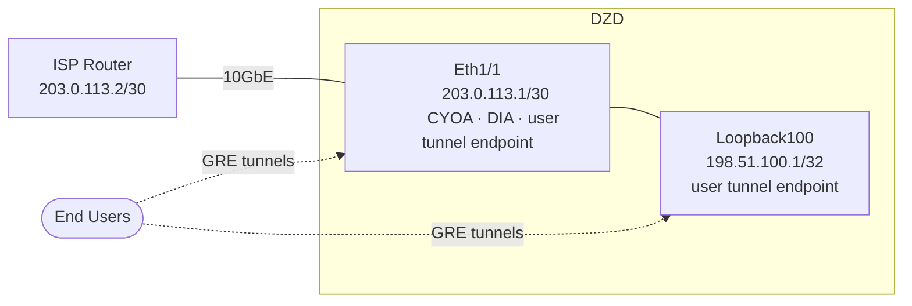
```mermaid
flowchart LR
    USERS(["End Users"])

    subgraph DZD["DZD"]
        E1["Eth1/1
        203.0.113.1/30
        CYOA · DIA · user tunnel endpoint"]
        LO["Loopback100
        198.51.100.1/32\n        user tunnel endpoint"]
        E1 --- LO
    end

    ISP["ISP Router
    203.0.113.2/30"]

    ISP -- "10GbE" --- E1
    USERS -. "GRE tunnels" .-> E1
    USERS -. "GRE tunnels" .-> LO
```

| 인터페이스 | `--interface-cyoa` | `--interface-dia` | `--ip-net` | `--bandwidth` | `--cir` | `--routing-mode` | `--user-tunnel-endpoint` |
|-----------|-------------------|------------------|------------|---------------|---------|-----------------|--------------------------|
| Ethernet1/1 | `gre-over-dia` | `dia` | 기여자 할당 IP/서브넷 | 포트 속도 | 보장 속도 | `bgp` 또는 `static` | `true` |
| Loopback100 | — | — | 공용 /32 | `0bps` | — | — | `true` |

시나리오 A 기반 실행 명령 예시:
```bash
doublezero device interface create mydzd-nyc01 Ethernet1/1 \
  --interface-cyoa gre-over-dia \
  --interface-dia dia \
  --ip-net 203.0.113.1/30 \
  --bandwidth 10Gbps \
  --cir 1Gbps \
  --routing-mode bgp \
  --user-tunnel-endpoint true

doublezero device interface create mydzd-nyc01 Loopback100 \
  --ip-net 198.51.100.1/32 \
  --bandwidth 0bps \
  --user-tunnel-endpoint true
```

#### 시나리오 B: 포트 채널 (LAG)

DZD가 IP가 있는 포트 채널을 통해 업스트림 장치에 연결됩니다. 포트 채널이 하나의 공용 IP를 보유하며 CYOA 엔드포인트입니다. Loopback100이 두 번째 공용 IP를 보유합니다.

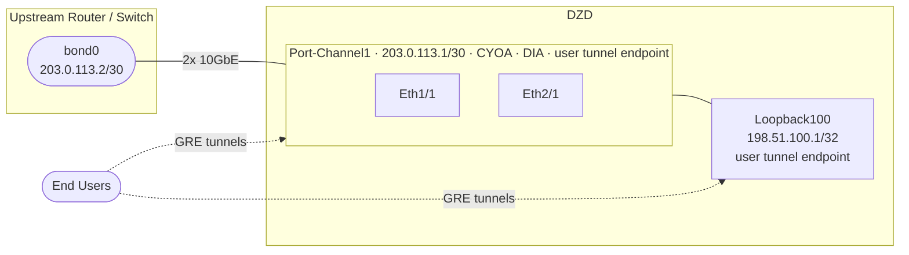
```mermaid
flowchart LR
    USERS(["End Users"])

    subgraph SW["Upstream Router / Switch"]
        SWPC(["bond0
        203.0.113.2/30"])
    end

    subgraph DZD["DZD"]
        subgraph PC["Port-Channel1 · 203.0.113.1/30 · CYOA · DIA · user tunnel endpoint"]
            E1["Eth1/1"]
            E2["Eth2/1"]
        end
        LO["Loopback100
        198.51.100.1/32\n        user tunnel endpoint"]
        PC --- LO
    end

    SWPC -- "2x 10GbE" --- PC
    USERS -. "GRE tunnels" .-> PC
    USERS -. "GRE tunnels" .-> LO
```

| 인터페이스 | `--interface-cyoa` | `--interface-dia` | `--ip-net` | `--bandwidth` | `--cir` | `--routing-mode` | `--user-tunnel-endpoint` |
|-----------|-------------------|------------------|------------|---------------|---------|-----------------|--------------------------|
| Port-Channel1 | `gre-over-dia` | `dia` | 기여자 할당 IP/서브넷 | 결합된 LAG 속도 | 보장 속도 | `bgp` 또는 `static` | `true` |
| Loopback100 | — | — | 공용 /32 | `0bps` | — | — | `true` |

시나리오 B 기반 실행 명령 예시:
```bash
doublezero device interface create mydzd-fra01 Port-Channel1 \
  --interface-cyoa gre-over-dia \
  --interface-dia dia \
  --ip-net 203.0.113.1/30 \
  --bandwidth 20Gbps \
  --cir 2Gbps \
  --routing-mode bgp \
  --user-tunnel-endpoint true

doublezero device interface create mydzd-fra01 Loopback100 \
  --ip-net 198.51.100.1/32 \
  --bandwidth 0bps \
  --user-tunnel-endpoint true
```


#### 시나리오 C: 별도 라우터에 대한 이중 물리적 업링크

각 물리적 인터페이스가 서로 다른 업스트림 라우터에 연결됩니다. 두 공용 IP는 Loopback100과 Loopback101에 위치하며, 둘 다 사용자 터널 엔드포인트로 등록됩니다.

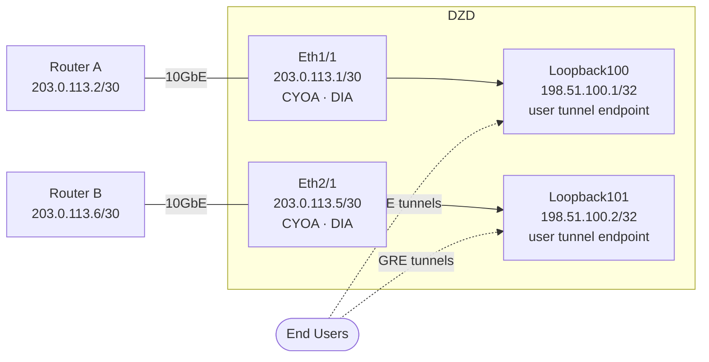
```mermaid
flowchart LR
    USERS(["End Users"])

    RA["Router A
    203.0.113.2/30"]
    RB["Router B
    203.0.113.6/30"]

    subgraph DZD["DZD"]
        E1["Eth1/1
        203.0.113.1/30
        CYOA · DIA"]
        E2["Eth2/1
        203.0.113.5/30
        CYOA · DIA"]
        LO0["Loopback100
        198.51.100.1/32\n        user tunnel endpoint"]
        LO1["Loopback101
        198.51.100.2/32\n        user tunnel endpoint"]
        E1 --> LO0
        E2 --> LO1
    end

    RA -- "10GbE" --- E1
    RB -- "10GbE" --- E2
    USERS -. "GRE tunnels" .-> LO0
    USERS -. "GRE tunnels" .-> LO1
```

| 인터페이스 | `--interface-cyoa` | `--interface-dia` | `--ip-net` | `--bandwidth` | `--cir` | `--routing-mode` | `--user-tunnel-endpoint` |
|-----------|-------------------|------------------|------------|---------------|---------|-----------------|--------------------------|
| Ethernet1/1 | `gre-over-dia` | `dia` | 기여자 할당 IP/서브넷 | 포트 속도 | 보장 속도 | `bgp` 또는 `static` | — |
| Ethernet2/1 | `gre-over-dia` | `dia` | 기여자 할당 IP/서브넷 | 포트 속도 | 보장 속도 | `bgp` 또는 `static` | — |
| Loopback100 | — | — | 공용 /32 | `0bps` | — | — | `true` |
| Loopback101 | — | — | 공용 /32 | `0bps` | — | — | `true` |

시나리오 C 기반 실행 명령 예시:
```bash
doublezero device interface create mydzd-ams01 Ethernet1/1 \
  --interface-cyoa gre-over-dia \
  --interface-dia dia \
  --ip-net 203.0.113.1/30 \
  --bandwidth 10Gbps \
  --cir 1Gbps \
  --routing-mode bgp

doublezero device interface create mydzd-ams01 Ethernet2/1 \
  --interface-cyoa gre-over-dia \
  --interface-dia dia \
  --ip-net 203.0.113.5/30 \
  --bandwidth 10Gbps \
  --cir 1Gbps \
  --routing-mode bgp

doublezero device interface create mydzd-ams01 Loopback100 \
  --ip-net 198.51.100.1/32 \
  --bandwidth 0bps \
  --user-tunnel-endpoint true

doublezero device interface create mydzd-ams01 Loopback101 \
  --ip-net 198.51.100.2/32 \
  --bandwidth 0bps \
  --user-tunnel-endpoint true
```

### 단계 3.6: 장치 확인

```bash
doublezero device list
```

**예시 출력:**

```
 account                                      | code      | contributor | location | exchange | device_type | public_ip    | dz_prefixes     | users | max_users | status    | health  | mgmt_vrf | owner
 7xKm9pQw2R4vHt3...                          | nyc-dz001 | acme        | EQX-NY5  | nyc      | hybrid      | 203.0.113.10 | 198.51.100.0/28 | 0     | 14        | activated | pending |          | 5FMtd5Woq5XAAg54...
```

장치가 `activated` 상태로 표시되어야 합니다.

---

## 4단계: 링크 설정 및 에이전트 설치 {#phase-4-link-establishment-agent-installation}

링크는 장치를 나머지 DoubleZero 네트워크에 연결합니다.

### 링크 이해

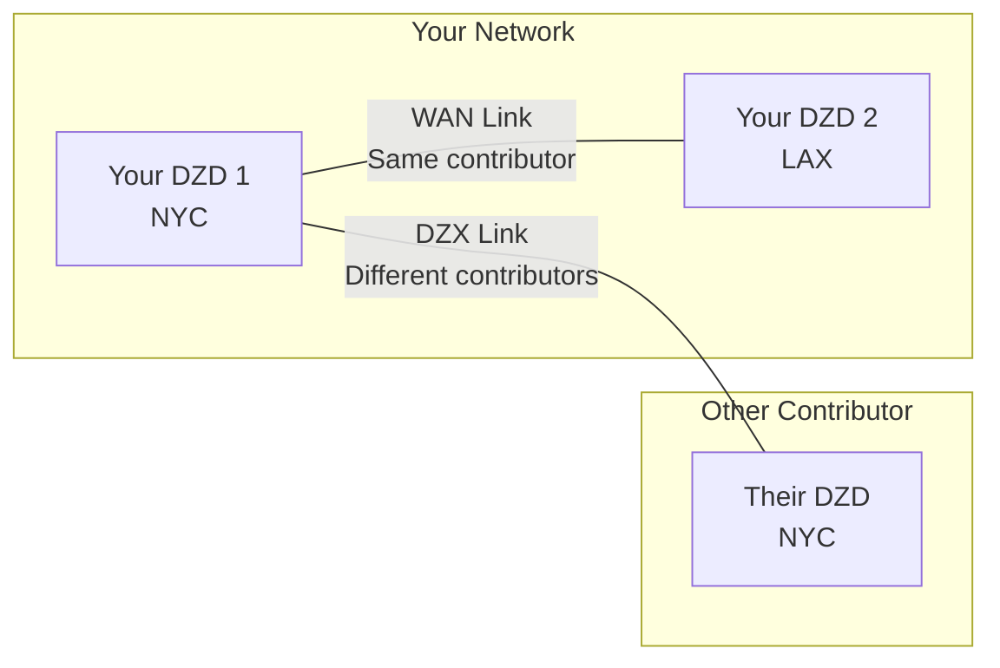
```mermaid
flowchart LR
    subgraph "Your Network"
        D1[Your DZD 1<br/>NYC]
        D2[Your DZD 2<br/>LAX]
    end

    subgraph "Other Contributor"
        O1[Their DZD<br/>NYC]
    end

    D1 ---|WAN Link<br/>Same contributor| D2
    D1 ---|DZX Link<br/>Different contributors| O1
```

| 링크 유형 | 연결 대상 | 수락 방식 |
|-----------|----------|------------|
| **WAN 링크** | 자신의 장치 두 대 | 자동 (양쪽 모두 소유) |
| **DZX 링크** | 자신의 장치와 다른 기여자의 장치 | 상대방의 수락 필요 |

### 단계 4.1: WAN 링크 생성 (다수 장치 보유 시)

WAN 링크는 자신의 장치를 연결합니다:

```bash
doublezero link create wan \
  --code <LINK_CODE> \
  --contributor <YOUR_CONTRIBUTOR> \
  --side-a <DEVICE_1_CODE> \
  --side-a-interface <INTERFACE_ON_DEVICE_1> \
  --side-z <DEVICE_2_CODE> \
  --side-z-interface <INTERFACE_ON_DEVICE_2> \
  --bandwidth 10000 \
  --mtu 9000 \
  --delay-ms 20 \
  --jitter-ms 1
```

**예시:**

```bash
doublezero link create wan \
  --code nyc-lax-wan01 \
  --contributor acme \
  --side-a nyc-dz001 \
  --side-a-interface Ethernet3/1 \
  --side-z lax-dz001 \
  --side-z-interface Ethernet3/1 \
  --bandwidth 10000 \
  --mtu 9000 \
  --delay-ms 65 \
  --jitter-ms 1
```

**예상 출력:**

```
Signature: 5tNm7K...truncated...9pRw2
```

### 단계 4.2: DZX 링크 생성

DZX 링크는 자신의 장치를 다른 기여자의 DZD에 직접 연결합니다:

```bash
doublezero link create dzx \
  --code <DEVICE_CODE_A:DEVICE_CODE_Z> \
  --contributor <YOUR_CONTRIBUTOR> \
  --side-a <YOUR_DEVICE_CODE> \
  --side-a-interface <YOUR_INTERFACE> \
  --side-z <OTHER_DEVICE_CODE> \
  --bandwidth <BANDWIDTH in Kbps, Mbps, or Gbps> \
  --mtu <MTU> \
  --delay-ms <DELAY> \
  --jitter-ms <JITTER>
```

**예상 출력:**

```
Signature: 8mKp3W...truncated...2nRx7
```

DZX 링크를 생성한 후 상대 기여자가 수락해야 합니다:

```bash
# 상대 기여자가 이 명령을 실행
doublezero link accept \
  --code <LINK_CODE> \
  --side-z-interface <THEIR_INTERFACE>
```

**예상 출력 (수락하는 기여자 측):**

```
Signature: 6vQt9L...truncated...3wPm4
```

### 단계 4.3: 링크 확인

```bash
doublezero link list
```

**예시 출력:**

```
 account                                      | code          | contributor | side_a_name | side_a_iface_name | side_z_name | side_z_iface_name | link_type | bandwidth | mtu  | delay_ms | jitter_ms | delay_override_ms | tunnel_id | tunnel_net      | status    | health  | owner
 8vkYpXaBW8RuknJq...                         | nyc-dz001:lax-dz001 | acme        | nyc-dz001   | Ethernet3/1       | lax-dz001   | Ethernet3/1       | WAN       | 10Gbps    | 9000 | 65.00ms  | 1.00ms    | 0.00ms            | 42        | 172.16.0.84/31  | activated | pending | 5FMtd5Woq5XAAg54...
```

양쪽이 모두 구성되면 링크는 `activated` 상태로 표시되어야 합니다.

---

### 에이전트 설치

DZD에서 두 개의 소프트웨어 에이전트가 실행됩니다:

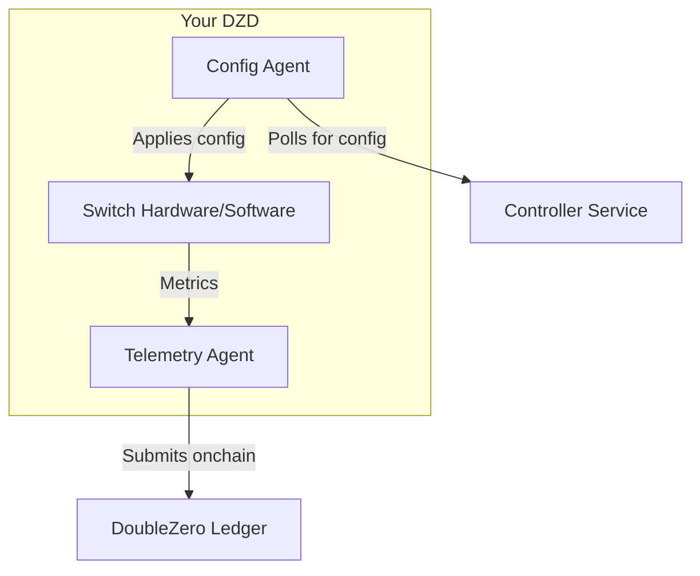
```mermaid
flowchart TB
    subgraph "Your DZD"
        CA[Config Agent]
        TA[Telemetry Agent]
        HW[Switch Hardware/Software]
    end

    CA -->|Polls for config| CTRL[Controller Service]
    CA -->|Applies config| HW

    HW -->|Metrics| TA
    TA -->|Submits onchain| BC[DoubleZero Ledger]
```

| 에이전트 | 기능 |
|-------|--------------|
| **Config Agent** | 컨트롤러에서 구성을 가져와 스위치에 적용 |
| **Telemetry Agent** | 다른 장치와의 레이턴시/손실을 측정하고 온체인에 메트릭 보고 |

### 단계 4.4: Config Agent 설치 {#step-44-install-config-agent}

#### 스위치에서 API 활성화

EOS 구성에 추가:

```
management api eos-sdk-rpc
    transport grpc eapilocal
        localhost loopback vrf default
        service all
        no disabled
```

!!! note "VRF 참고"
    관리 VRF 이름이 다른 경우 `default`를 해당 이름으로 변경하세요 (예: `management`).

#### 에이전트 다운로드 및 설치

```bash
# 스위치에서 bash 진입
switch# bash
$ sudo bash
# cd /mnt/flash
# wget AGENT_DOWNLOAD_URL
# exit
$ exit

# EOS 확장으로 설치
switch# copy flash:AGENT_FILENAME extension:
switch# extension AGENT_FILENAME
switch# copy installed-extensions boot-extensions
```

#### 확장 확인

```bash
switch# show extensions
```

상태가 "A, I, B"여야 합니다:

```
Name                                        Version/Release     Status     Extension
------------------------------------------- ------------------- ---------- ---------
AGENT_FILENAME    MAINNET_CLIENT_VERSION/1             A, I, B    1

A: available | NA: not available | I: installed | F: forced | B: install at boot
```

#### 에이전트 구성 및 시작

EOS 구성에 추가:

```
daemon doublezero-agent
    exec /usr/local/bin/doublezero-agent -pubkey <YOUR_DEVICE_PUBKEY> -controller <controller_IP>:<controller_port>
    no shut
```

!!! info "컨트롤러 IP 및 포트"
    컨트롤러 IP와 포트는 단계 2.5에서 접근 권한을 받은 기여자 저장소에서 확인할 수 있습니다.

!!! note "VRF 참고"
    관리 VRF가 `default`가 아닌 경우 (즉, 네임스페이스가 `ns-default`가 아닌 경우), exec 명령 앞에 `exec /sbin/ip netns exec ns-<VRF>`를 추가하세요. 예를 들어 VRF가 `management`인 경우:
    ```
    daemon doublezero-agent
        exec /sbin/ip netns exec ns-management /usr/local/bin/doublezero-agent -pubkey <YOUR_DEVICE_PUBKEY>
        no shut
    ```

장치 공개 키는 `doublezero device list`의 `account` 열에서 확인하세요.

#### 실행 확인

```bash
switch# show agent doublezero-agent logs
```

"Starting doublezero-agent"와 성공적인 컨트롤러 연결이 표시되어야 합니다.

### 단계 4.5: Telemetry Agent 설치 {#step-45-install-telemetry-agent}

#### 메트릭 퍼블리셔 키를 장치에 복사

```bash
scp ~/.config/doublezero/metrics-publisher.json <SWITCH_IP>:/mnt/flash/metrics-publisher-keypair.json
```

#### 메트릭 퍼블리셔를 온체인에 등록

```bash
doublezero device update \
  --pubkey <DEVICE_ACCOUNT> \
  --metrics-publisher <METRICS_PUBLISHER_PUBKEY>
```

metrics-publisher.json 파일에서 공개 키를 확인하세요.

#### 에이전트 다운로드 및 설치

```bash
switch# bash
$ sudo bash
# cd /mnt/flash
# wget TELEMETRY_DOWNLOAD_URL
# exit
$ exit

# EOS 확장으로 설치
switch# copy flash:TELEMETRY_FILENAME extension:
switch# extension TELEMETRY_FILENAME
switch# copy installed-extensions boot-extensions
```

#### 확장 확인

```bash
switch# show extensions
```

상태가 "A, I, B"여야 합니다:

```
Name                                        Version/Release     Status     Extension
------------------------------------------- ------------------- ---------- ---------
TELEMETRY_FILENAME    MAINNET_CLIENT_VERSION/1             A, I, B    1

A: available | NA: not available | I: installed | F: forced | B: install at boot
```

#### 에이전트 구성 및 시작

EOS 구성에 추가:

```
daemon doublezero-telemetry
    exec /usr/local/bin/doublezero-telemetry --local-device-pubkey <DEVICE_ACCOUNT> --env mainnet --keypair /mnt/flash/metrics-publisher-keypair.json
    no shut
```

!!! note "VRF 참고"
    관리 VRF가 `default`가 아닌 경우 (즉, 네임스페이스가 `ns-default`가 아닌 경우), exec 명령에 `--management-namespace ns-<VRF>`를 추가하세요. 예를 들어 VRF가 `management`인 경우:
    ```
    daemon doublezero-telemetry
        exec /usr/local/bin/doublezero-telemetry --management-namespace ns-management --local-device-pubkey <DEVICE_ACCOUNT> --env mainnet --keypair /mnt/flash/metrics-publisher-keypair.json
        no shut
    ```

#### 실행 확인

```bash
switch# show agent doublezero-telemetry logs
```

"Starting telemetry collector"와 "Starting submission loop"가 표시되어야 합니다.

---

## 5단계: 링크 번인

!!! warning "모든 새 링크는 트래픽을 전달하기 전에 번인을 거쳐야 합니다"
    새 링크는 프로덕션 트래픽에 활성화되기 전에 **최소 24시간 동안 드레인 상태**를 유지해야 합니다. 이 번인 요구 사항은 [RFC12: Network Provisioning](https://github.com/malbeclabs/doublezero/blob/main/rfcs/rfc12-network-provisioning.md)에 정의되어 있으며, 링크가 서비스에 투입되기 전에 ~200,000 DZ Ledger 슬롯(~20시간)의 깨끗한 메트릭이 필요합니다.

에이전트가 설치되고 실행 중인 상태에서, [metrics.doublezero.xyz](https://metrics.doublezero.xyz)에서 최소 24시간 연속으로 링크를 모니터링하세요:

- **"DoubleZero Device-Link Latencies"** 대시보드 — 시간 경과에 따라 링크에서 **패킷 손실 제로**를 확인
- **"DoubleZero Network Metrics"** 대시보드 — 링크에서 **오류 제로**를 확인

번인 기간 동안 손실 제로, 오류 제로의 깨끗한 링크가 확인된 후에만 링크의 드레인을 해제하세요.

---

## 6단계: 검증 및 활성화

모든 것이 정상 작동하는지 확인하기 위해 이 체크리스트를 실행하세요.

!!! warning "장치는 잠금 상태(`max_users = 0`)로 시작됩니다"
    장치가 생성되면 `max_users`는 기본적으로 **0**으로 설정됩니다. 이는 아직 사용자가 연결할 수 없음을 의미합니다. 이것은 의도된 것입니다 — 사용자 트래픽을 수락하기 전에 모든 것이 작동하는지 확인해야 합니다.

    **`max_users`를 0 이상으로 설정하기 전에 반드시:**

    1. 모든 링크가 [metrics.doublezero.xyz](https://metrics.doublezero.xyz)에서 손실/오류 제로로 **24시간 번인**을 완료했는지 확인
    2. **DZ/Malbec Labs와 조율**하여 연결 테스트 실행:
        - 테스트 사용자가 장치에 연결할 수 있는가?
        - 사용자가 DZ 네트워크를 통해 라우트를 수신하는가?
        - 사용자가 DZ 네트워크를 통해 종단 간 트래픽을 라우팅할 수 있는가?
    3. DZ/ML이 테스트 통과를 확인한 후에만 max_users를 96으로 설정:

    ```bash
    doublezero device update --pubkey <DEVICE_ACCOUNT> --max-users 96
    ```

### 장치 확인

```bash
# 장치가 "activated" 상태로 표시되어야 합니다
doublezero device list | grep <YOUR_DEVICE_CODE>
```

**예상 출력:**

```
 7xKm9pQw2R4vHt3... | nyc-dz001 | acme | EQX-NY5 | nyc | hybrid | 203.0.113.10 | 198.51.100.0/28 | 0 | 14 | activated | pending | | 5FMtd5Woq5XAAg54...
```

```bash
# 인터페이스가 나열되어야 합니다
doublezero device interface list | grep <YOUR_DEVICE_CODE>
```

**예상 출력:**

```
 nyc-dz001 | Loopback255 | loopback | vpnv4 | none | none | 0 | 0 | 1500 | static | 0 | 172.16.1.91/32  | 56 | false | activated
 nyc-dz001 | Loopback256 | loopback | ipv4  | none | none | 0 | 0 | 1500 | static | 0 | 172.16.1.100/32 | 0  | false | activated
 nyc-dz001 | Ethernet1/1 | physical | none  | none | none | 0 | 0 | 1500 | static | 0 |                 | 0  | false | activated
```

### 링크 확인

```bash
# 링크가 "activated" 상태로 표시되어야 합니다
doublezero link list | grep <YOUR_DEVICE_CODE>
```

**예상 출력:**

```
 8vkYpXaBW8RuknJq... | nyc-lax-wan01 | acme | nyc-dz001 | Ethernet3/1 | lax-dz001 | Ethernet3/1 | WAN | 10Gbps | 9000 | 65.00ms | 1.00ms | 0.00ms | 42 | 172.16.0.84/31 | activated | pending | 5FMtd5Woq5XAAg54...
```

### 에이전트 확인

스위치에서:

```bash
# Config Agent가 성공적인 구성 가져오기를 보여야 합니다
switch# show agent doublezero-agent logs | tail -20

# Telemetry Agent가 성공적인 제출을 보여야 합니다
switch# show agent doublezero-telemetry logs | tail -20
```

### 최종 검증 다이어그램

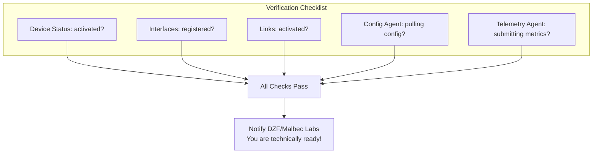
```mermaid
flowchart TB
    subgraph "Verification Checklist"
        D[Device Status: activated?]
        I[Interfaces: registered?]
        L[Links: activated?]
        CA[Config Agent: pulling config?]
        TA[Telemetry Agent: submitting metrics?]
    end

    D --> PASS
    I --> PASS
    L --> PASS
    CA --> PASS
    TA --> PASS

    PASS[All Checks Pass] --> NOTIFY[Notify DZF/Malbec Labs<br/>You are technically ready!]
```

---

## 문제 해결

### 장치 생성 실패

- 서비스 키가 인가되었는지 확인 (`doublezero contributor list`)
- 위치 및 익스체인지 코드가 유효한지 확인
- DZ 프리픽스가 유효한 공용 IP 범위인지 확인

### 링크가 "requested" 상태에서 멈춤

- DZX 링크는 상대 기여자의 수락이 필요합니다
- 상대방에게 `doublezero link accept` 실행을 요청하세요

### Config Agent 연결 안 됨

- 관리 네트워크에 인터넷 접근이 가능한지 확인
- VRF 구성이 설정과 일치하는지 확인
- 장치 공개 키가 올바른지 확인

### Telemetry Agent 제출 안 됨

- 메트릭 퍼블리셔 키가 온체인에 등록되었는지 확인
- 스위치에 키페어 파일이 존재하는지 확인
- 장치 계정 공개 키가 올바른지 확인

---

## 다음 단계

- 에이전트 업그레이드 및 링크 관리에 대한 [운영 가이드](contribute-operations.md) 검토
- 용어 정의에 대한 [용어집](glossary.md) 확인
- 문제가 발생하면 DZF/Malbec Labs에 문의