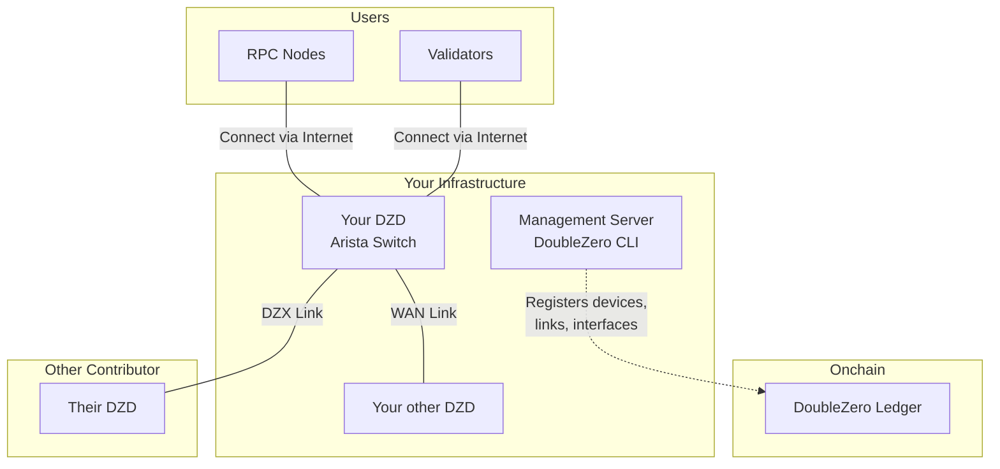
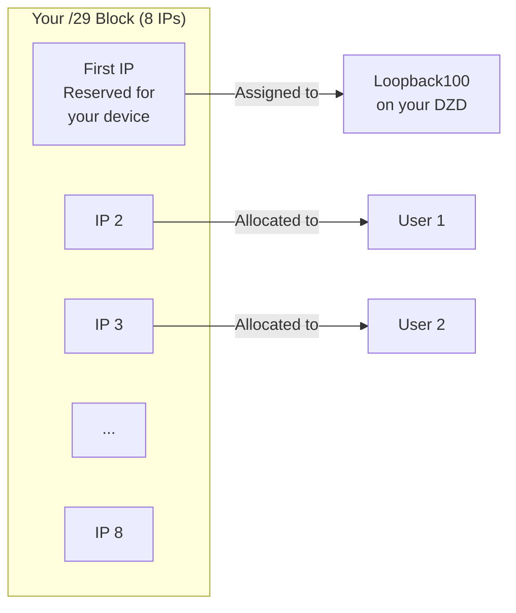
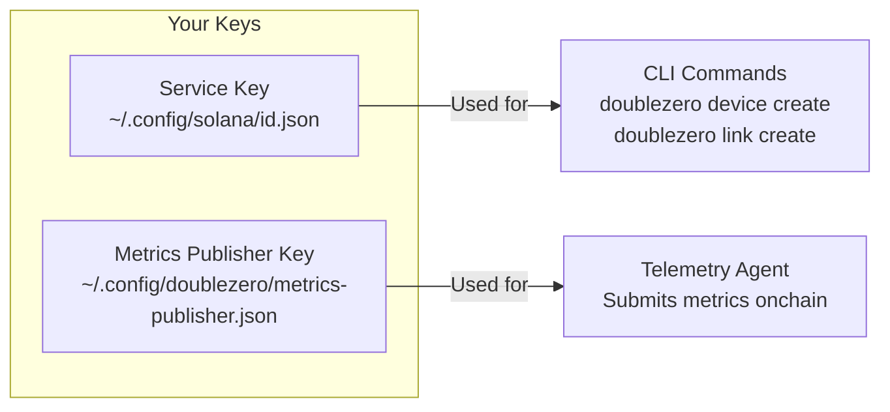
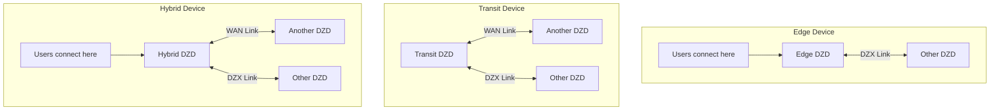
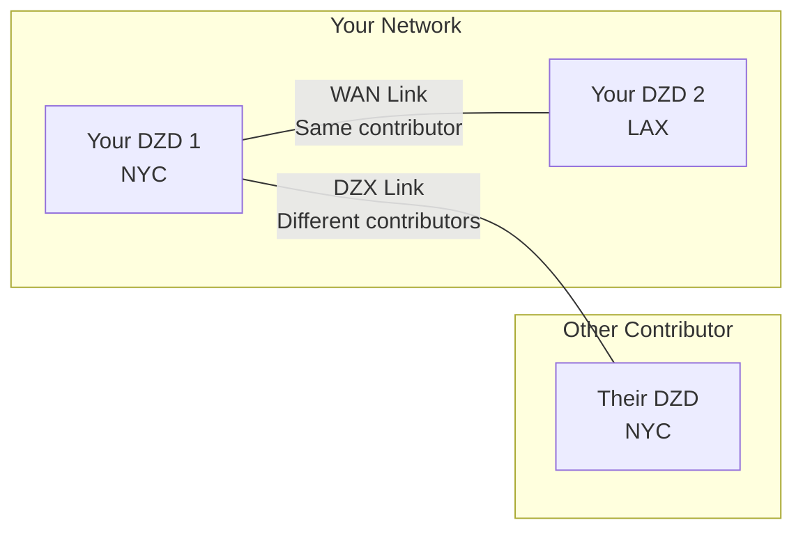
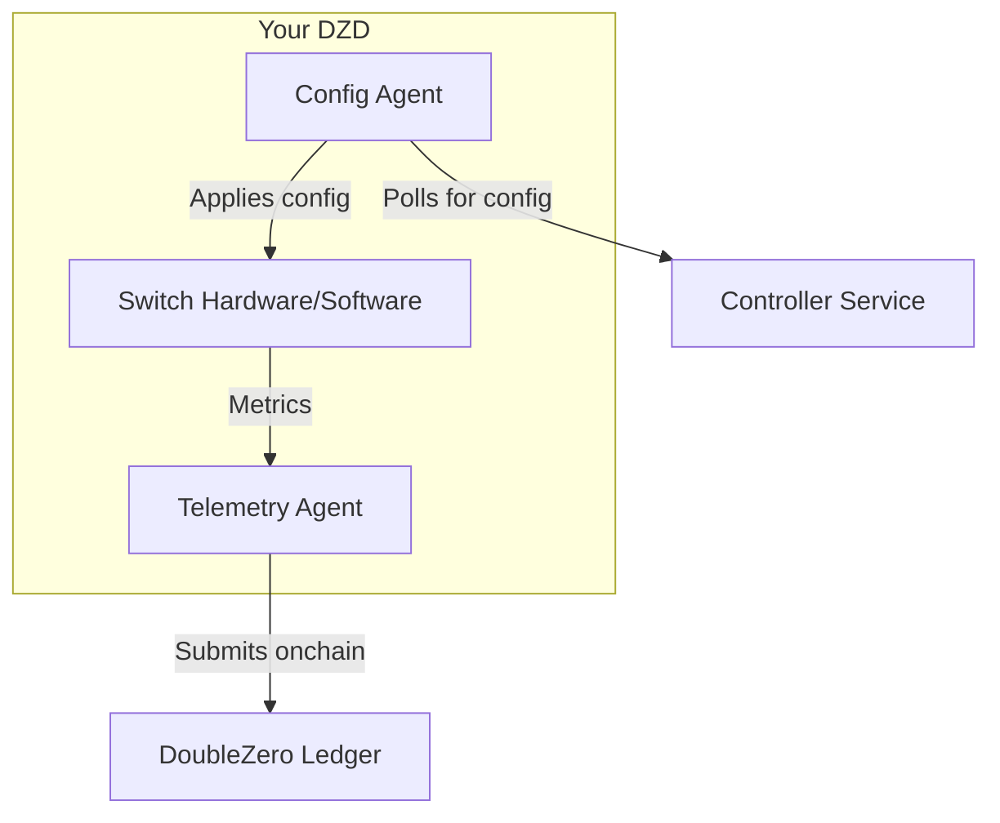
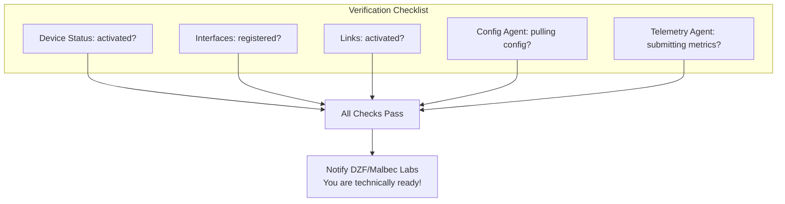

# Device Provisioning Guide

This guide walks you through provisioning a DoubleZero Device (DZD) from start to finish. Each phase matches the [Onboarding Checklist](contribute-overview.md#onboarding-checklist).

---

## How It All Fits Together

Before diving into the steps, here's the big picture of what you're building:



---

## Phase 1: Prerequisites

Before you can provision a device, you need the physical hardware set up and some IP addresses allocated.

### What You Need

| Requirement | Why It's Needed |
|-------------|-----------------|
| **DZD Hardware** | Arista 7280CR3A switch (see [hardware specs](contribute.md#hardware-requirements)) |
| **Rack Space** | 4U with proper airflow |
| **Power** | Redundant feeds, ~4KW recommended |
| **Management Access** | SSH/console access to configure the switch |
| **Internet Connectivity** | For metrics publishing and to fetch configuration from the controller |
| **Public IPv4 Block** | Minimum /29 for the DZ prefix pool (see below) |

### Install the DoubleZero CLI

The DoubleZero CLI (`doublezero`) is used throughout provisioning to register devices, create links, and manage your contribution. It should be installed on a **management server or VM** — not on the DZD switch itself. The switch only runs the Config Agent and Telemetry Agent (installed in [Phase 4](#phase-4-link-establishment-agent-installation)).

**Ubuntu / Debian:**
```bash
curl -1sLf https://dl.cloudsmith.io/public/malbeclabs/doublezero/setup.deb.sh | sudo -E bash
sudo apt-get install doublezero
```

**Rocky Linux / RHEL:**
```bash
curl -1sLf https://dl.cloudsmith.io/public/malbeclabs/doublezero/setup.rpm.sh | sudo -E bash
sudo yum install doublezero
```

Verify the daemon is running:
```bash
sudo systemctl status doublezerod
```

### Understanding Your DZ Prefix

Your DZ prefix is a block of public IP addresses that the DoubleZero protocol manages for IP allocation.



**How DZ prefixes are used:**

- **First IP**: Reserved for your device (assigned to Loopback100 interface)
- **Remaining IPs**: Allocated to specific user types connecting to your DZD:
    - `IBRLWithAllocatedIP` users
    - `EdgeFiltering` users
    - Multicast publishers
- **IBRL users**: Do NOT consume from this pool (they use their own public IP)

!!! warning "DZ Prefix Rules"
    **You CANNOT use these addresses for:**

    - Your own network equipment
    - Point-to-point links on DIA interfaces
    - Management interfaces
    - Any infrastructure outside the DZ protocol

    **Requirements:**

    - Must be **globally routable (public)** IPv4 addresses
    - Private IP ranges (10.x, 172.16-31.x, 192.168.x) are rejected by the smart contract
    - **Minimum size: /29** (8 addresses), larger prefixes preferred (e.g., /28, /27)
    - The entire block must be available — do not pre-allocate any addresses

    If you need addresses for your own equipment (DIA interface IPs, management, etc.), use a **separate address pool**.

---

## Phase 2: Account Setup

In this phase, you create the cryptographic keys that identify you and your devices on the network.

### Where to Run the CLI

!!! warning "Do NOT install the CLI on your switch"
    The DoubleZero CLI (`doublezero`) should be installed on a **management server or VM**, not on your Arista switch.

    ```mermaid
    flowchart LR
        subgraph "Management Server/VM"
            CLI[DoubleZero CLI]
            KEYS[Your Keypairs]
        end

        subgraph "Your DZD Switch"
            CA[Config Agent]
            TA[Telemetry Agent]
        end

        CLI -->|Creates devices, links| BC[Blockchain]
        CA -->|Pulls config| CTRL[Controller]
        TA -->|Submits metrics| BC
    ```

    | Install on Management Server | Install on Switch |
    |-----------------------------|-------------------|
    | `doublezero` CLI | Config Agent |
    | Your service keypair | Telemetry Agent |
    | Your metrics publisher keypair | Metrics publisher keypair (copy) |

### What Are Keys?

Think of keys like secure login credentials:

- **Service Key**: Your contributor identity - used to run CLI commands
- **Metrics Publisher Key**: Your device's identity for submitting telemetry data

Both are cryptographic keypairs (a public key you share, a private key you keep secret).



### Step 2.1: Generate Your Service Key

This is your main identity for interacting with DoubleZero.

```bash
doublezero keygen
```

This creates a keypair at the default location. The output shows your **public key** - this is what you'll share with DZF.

### Step 2.2: Generate Your Metrics Publisher Key

This key is used by the Telemetry Agent to sign metric submissions.

```bash
doublezero keygen -o ~/.config/doublezero/metrics-publisher.json
```

### Step 2.3: Submit Keys to DZF

Contact the DoubleZero Foundation or Malbec Labs and provide:

1. Your **service key public key**
2. Your **GitHub username** (for repo access)

They will:

- Create your **contributor account** onchain
- Grant access to the private **contributors repository**

### Step 2.4: Verify Your Account

Once confirmed, verify your contributor account exists:

```bash
doublezero contributor list
```

You should see your contributor code in the list.

### Step 2.5: Access the Contributors Repository

The [malbeclabs/contributors](https://github.com/malbeclabs/contributors) repository contains:

- Base device configurations
- TCAM profiles
- ACL configurations
- Additional setup instructions

Follow the instructions there for device-specific configuration.

---

## Phase 3: Device Provisioning

Now you'll register your physical device on the blockchain and configure its interfaces.

### Understanding Device Types



| Type | What It Does | When to Use |
|------|--------------|-------------|
| **Edge** | Accepts user connections only | Single location, user-facing only |
| **Transit** | Moves traffic between devices | Backbone connectivity, no users |
| **Hybrid** | Both user connections AND backbone | Most common - does everything |

### Step 3.1: Find Your Location and Exchange

Before creating your device, look up the codes for your data center location and nearest exchange:

```bash
# List available locations (data centers)
doublezero location list

# List available exchanges (interconnect points)
doublezero exchange list
```

### Step 3.2: Create Your Device Onchain

Register your device on the blockchain:

```bash
doublezero device create \
  --code <YOUR_DEVICE_CODE> \
  --contributor <YOUR_CONTRIBUTOR_CODE> \
  --device-type hybrid \
  --location <LOCATION_CODE> \
  --exchange <EXCHANGE_CODE> \
  --public-ip <DEVICE_PUBLIC_IP> \
  --dz-prefixes <YOUR_DZ_PREFIX>
```

**Example:**

```bash
doublezero device create \
  --code nyc-dz001 \
  --contributor acme \
  --device-type hybrid \
  --location EQX-NY5 \
  --exchange nyc \
  --public-ip "203.0.113.10" \
  --dz-prefixes "198.51.100.0/28"
```

**Expected output:**

```
Signature: 4vKz8H...truncated...7xPq2
```

Verify your device was created:

```bash
doublezero device list | grep nyc-dz001
```

**Parameters explained:**

| Parameter | What It Means |
|-----------|---------------|
| `--code` | A unique name for your device (e.g., `nyc-dz001`) |
| `--contributor` | Your contributor code (given by DZF) |
| `--device-type` | `hybrid`, `transit`, or `edge` |
| `--location` | Data center code from `location list` |
| `--exchange` | Nearest exchange code from `exchange list` |
| `--public-ip` | The public IP where users connect to your device via internet |
| `--dz-prefixes` | Your allocated IP block for users |

### Step 3.3: Create Required Loopback Interfaces

Every device needs two loopback interfaces for internal routing:

```bash
# VPNv4 loopback
doublezero device interface create <DEVICE_CODE> Loopback255 --loopback-type vpnv4

# IPv4 loopback
doublezero device interface create <DEVICE_CODE> Loopback256 --loopback-type ipv4
```

**Expected output (for each command):**

```
Signature: 3mNx9K...truncated...8wRt5
```

### Step 3.4: Create Physical Interfaces

Register the physical ports you'll use:

```bash
# Basic interface
doublezero device interface create <DEVICE_CODE> Ethernet1/1
```

**Expected output:**

```
Signature: 7pQw2R...truncated...4xKm9
```

### Step 3.5: Create CYOA Interface (for Edge/Hybrid devices)

If your device accepts user connections, you need a CYOA (Choose Your Own Adventure) interface. This tells the system how users connect to you.

**CYOA Types Explained:**

| Type | Plain English | Use When |
|------|--------------|----------|
| `gre-over-dia` | Users connect via regular internet | Most common - users connect via the dia to your DZD |
| `gre-over-private-peering` | Users connect via private link | Users have direct connection to your network |
| `gre-over-public-peering` | Users connect via IX | Users peer with you at an internet exchange |
| `gre-over-fabric` | Users on same local network | Users in same data center |
| `gre-over-cable` | Direct cable to user | Single dedicated user |

**Example - Standard internet users:**

```bash
doublezero device interface create <DEVICE_CODE> Ethernet1/2 \
  --interface-cyoa gre-over-dia \
  --interface-dia dia \
  --bandwidth 10000 \
  --cir 1000 \
  --user-tunnel-endpoint \
  --wait
```

**Expected output:**

```
Signature: 2wLp8N...truncated...5vHt3
```

**Parameters explained:**

| Parameter | What It Means |
|-----------|---------------|
| `--interface-cyoa` | How users connect (see table above) |
| `--interface-dia` | `dia` if this is an internet-facing port |
| `--bandwidth` | Port speed in Mbps (10000 = 10Gbps) |
| `--cir` | Committed rate in Mbps (guaranteed bandwidth) |
| `--user-tunnel-endpoint` | This port accepts user tunnels |

### Step 3.6: Verify Your Device

```bash
doublezero device list
```

**Example output:**

```
 account                                      | code      | contributor | location | exchange | device_type | public_ip    | dz_prefixes     | users | max_users | status    | health  | mgmt_vrf | owner
 7xKm9pQw2R4vHt3...                          | nyc-dz001 | acme        | EQX-NY5  | nyc      | hybrid      | 203.0.113.10 | 198.51.100.0/28 | 0     | 14        | activated | pending |          | 5FMtd5Woq5XAAg54...
```

Your device should appear with status `activated`.

---

## Phase 4: Link Establishment & Agent Installation

Links connect your device to the rest of the DoubleZero network.

### Understanding Links



| Link Type | Connects | Acceptance |
|-----------|----------|------------|
| **WAN Link** | Two of YOUR devices | Automatic (you own both) |
| **DZX Link** | Your device to ANOTHER contributor | Requires their acceptance |

### Step 4.1: Create WAN Links (if you have multiple devices)

WAN links connect your own devices:

```bash
doublezero link create wan \
  --code <LINK_CODE> \
  --contributor <YOUR_CONTRIBUTOR> \
  --side-a <DEVICE_1_CODE> \
  --side-a-interface <INTERFACE_ON_DEVICE_1> \
  --side-z <DEVICE_2_CODE> \
  --side-z-interface <INTERFACE_ON_DEVICE_2> \
  --bandwidth 10000 \
  --mtu 9000 \
  --delay-ms 20 \
  --jitter-ms 1
```

**Example:**

```bash
doublezero link create wan \
  --code nyc-lax-wan01 \
  --contributor acme \
  --side-a nyc-dz001 \
  --side-a-interface Ethernet3/1 \
  --side-z lax-dz001 \
  --side-z-interface Ethernet3/1 \
  --bandwidth 10000 \
  --mtu 9000 \
  --delay-ms 65 \
  --jitter-ms 1
```

**Expected output:**

```
Signature: 5tNm7K...truncated...9pRw2
```

### Step 4.2: Create DZX Links

DZX links connect your device directly to another contributor's DZD:

```bash
doublezero link create dzx \
  --code <DEVICE_CODE_A:DEVICE_CODE_Z> \
  --contributor <YOUR_CONTRIBUTOR> \
  --side-a <YOUR_DEVICE_CODE> \
  --side-a-interface <YOUR_INTERFACE> \
  --side-z <OTHER_DEVICE_CODE> \
  --bandwidth <BANDWIDTH in Kbps, Mbps, or Gbps> \
  --mtu <MTU> \
  --delay-ms <DELAY> \
  --jitter-ms <JITTER>
```

**Expected output:**

```
Signature: 8mKp3W...truncated...2nRx7
```

After creating a DZX link, the other contributor must accept it:

```bash
# The OTHER contributor runs this
doublezero link accept \
  --code <LINK_CODE> \
  --side-z-interface <THEIR_INTERFACE>
```

**Expected output (for the accepting contributor):**

```
Signature: 6vQt9L...truncated...3wPm4
```

### Step 4.3: Verify Links

```bash
doublezero link list
```

**Example output:**

```
 account                                      | code          | contributor | side_a_name | side_a_iface_name | side_z_name | side_z_iface_name | link_type | bandwidth | mtu  | delay_ms | jitter_ms | delay_override_ms | tunnel_id | tunnel_net      | status    | health  | owner
 8vkYpXaBW8RuknJq...                         | nyc-dz001:lax-dz001 | acme        | nyc-dz001   | Ethernet3/1       | lax-dz001   | Ethernet3/1       | WAN       | 10Gbps    | 9000 | 65.00ms  | 1.00ms    | 0.00ms            | 42        | 172.16.0.84/31  | activated | pending | 5FMtd5Woq5XAAg54...
```

Links should show status `activated` once both sides are configured.

---

### Agent Installation

Two software agents run on your DZD:



| Agent | What It Does |
|-------|--------------|
| **Config Agent** | Pulls configuration from controller, applies it to your switch |
| **Telemetry Agent** | Measures latency/loss to other devices, reports metrics onchain |

### Step 4.4: Install Config Agent

#### Enable the API on your switch

Add to EOS configuration:

```
management api eos-sdk-rpc
    transport grpc eapilocal
        localhost loopback vrf default
        service all
        no disabled
```

!!! note "VRF Note"
    Replace `default` with your management VRF name if different (e.g., `management`).

#### Download and install the agent

```bash
# Enter bash on the switch
switch# bash
$ sudo bash
# cd /mnt/flash
# wget AGENT_DOWNLOAD_URL
# exit
$ exit

# Install as EOS extension
switch# copy flash:AGENT_FILENAME extension:
switch# extension AGENT_FILENAME
switch# copy installed-extensions boot-extensions
```

#### Verify the extension

```bash
switch# show extensions
```

The Status should be "A, I, B":

```
Name                                        Version/Release     Status     Extension
------------------------------------------- ------------------- ---------- ---------
AGENT_FILENAME    MAINNET_CLIENT_VERSION/1             A, I, B    1

A: available | NA: not available | I: installed | F: forced | B: install at boot
```

#### Configure and start the agent

Add to EOS configuration:

```
daemon doublezero-agent
    exec /usr/local/bin/doublezero-agent -pubkey <YOUR_DEVICE_PUBKEY>
    no shut
```

!!! note "VRF Note"
    If your management VRF is not `default` (i.e. the namespace is not `ns-default`), prefix the exec command with `exec /sbin/ip netns exec ns-<VRF>`. For example, if your VRF is `management`:
    ```
    daemon doublezero-agent
        exec /sbin/ip netns exec ns-management /usr/local/bin/doublezero-agent -pubkey <YOUR_DEVICE_PUBKEY>
        no shut
    ```

Get your device pubkey from `doublezero device list` (the `account` column).

#### Verify it's running

```bash
switch# show agent doublezero-agent logs
```

You should see "Starting doublezero-agent" and successful controller connections.

### Step 4.5: Install Telemetry Agent

#### Copy the metrics publisher key to your device

```bash
scp ~/.config/doublezero/metrics-publisher.json <SWITCH_IP>:/mnt/flash/metrics-publisher-keypair.json
```

#### Register the metrics publisher onchain

```bash
doublezero device update \
  --pubkey <DEVICE_ACCOUNT> \
  --metrics-publisher <METRICS_PUBLISHER_PUBKEY>
```

Get the pubkey from your metrics-publisher.json file.

#### Download and install the agent

```bash
switch# bash
$ sudo bash
# cd /mnt/flash
# wget TELEMETRY_DOWNLOAD_URL
# exit
$ exit

# Install as EOS extension
switch# copy flash:TELEMETRY_FILENAME extension:
switch# extension TELEMETRY_FILENAME
switch# copy installed-extensions boot-extensions
```

#### Verify the extension

```bash
switch# show extensions
```

The Status should be "A, I, B":

```
Name                                        Version/Release     Status     Extension
------------------------------------------- ------------------- ---------- ---------
TELEMETRY_FILENAME    MAINNET_CLIENT_VERSION/1             A, I, B    1

A: available | NA: not available | I: installed | F: forced | B: install at boot
```

#### Configure and start the agent

Add to EOS configuration:

```
daemon doublezero-telemetry
    exec /usr/local/bin/doublezero-telemetry --local-device-pubkey <DEVICE_ACCOUNT> --env mainnet --keypair /mnt/flash/metrics-publisher-keypair.json
    no shut
```

!!! note "VRF Note"
    If your management VRF is not `default` (i.e. the namespace is not `ns-default`), add `--management-namespace ns-<VRF>` to the exec command. For example, if your VRF is `management`:
    ```
    daemon doublezero-telemetry
        exec /usr/local/bin/doublezero-telemetry --management-namespace ns-management --local-device-pubkey <DEVICE_ACCOUNT> --env mainnet --keypair /mnt/flash/metrics-publisher-keypair.json
        no shut
    ```

#### Verify it's running

```bash
switch# show agent doublezero-telemetry logs
```

You should see "Starting telemetry collector" and "Starting submission loop".

---

## Phase 5: Link Burn-in

!!! warning "All new links must burn in before carrying traffic"
    New links must be **drained for at least 24 hours** before being activated for production traffic. This burn-in requirement is defined in [RFC12: Network Provisioning](https://github.com/malbeclabs/doublezero/blob/main/rfcs/rfc12-network-provisioning.md), which specifies ~200,000 DZ Ledger slots (~20 hours) of clean metrics before a link is ready for service.

With agents installed and running, monitor your links on [metrics.doublezero.xyz](https://metrics.doublezero.xyz) for at least 24 consecutive hours:

- **"DoubleZero Device-Link Latencies"** dashboard — verify **zero packet loss** on the link over time
- **"DoubleZero Network Metrics"** dashboard — verify **zero errors** on your links

Only undrain the link once the burn-in period shows a clean link with zero loss and zero errors.

---

## Phase 6: Verification & Activation

Run through this checklist to confirm everything is working.

!!! warning "Your device starts locked (`max_users = 0`)"
    When a device is created, `max_users` is set to **0** by default. This means no users can connect to it yet. This is intentional — you must verify everything works before accepting user traffic.

    **Before setting `max_users` above 0, you must:**

    1. Confirm all links have completed their **24-hour burn-in** with zero loss/errors on [metrics.doublezero.xyz](https://metrics.doublezero.xyz)
    2. **Coordinate with DZ/Malbec Labs** to run a connectivity test:
        - Can a test user connect to your device?
        - Does the user receive routes over the DZ network?
        - Can the user route traffic over the DZ network end-to-end?
    3. Only after DZ/ML confirms the tests pass, set max_users to 96:

    ```bash
    doublezero device update --pubkey <DEVICE_ACCOUNT> --max-users 96
    ```

### Device Checks

```bash
# Your device should appear with status "activated"
doublezero device list | grep <YOUR_DEVICE_CODE>
```

**Expected output:**

```
 7xKm9pQw2R4vHt3... | nyc-dz001 | acme | EQX-NY5 | nyc | hybrid | 203.0.113.10 | 198.51.100.0/28 | 0 | 14 | activated | pending | | 5FMtd5Woq5XAAg54...
```

```bash
# Your interfaces should be listed
doublezero device interface list | grep <YOUR_DEVICE_CODE>
```

**Expected output:**

```
 nyc-dz001 | Loopback255 | loopback | vpnv4 | none | none | 0 | 0 | 1500 | static | 0 | 172.16.1.91/32  | 56 | false | activated
 nyc-dz001 | Loopback256 | loopback | ipv4  | none | none | 0 | 0 | 1500 | static | 0 | 172.16.1.100/32 | 0  | false | activated
 nyc-dz001 | Ethernet1/1 | physical | none  | none | none | 0 | 0 | 1500 | static | 0 |                 | 0  | false | activated
```

### Link Checks

```bash
# Links should show status "activated"
doublezero link list | grep <YOUR_DEVICE_CODE>
```

**Expected output:**

```
 8vkYpXaBW8RuknJq... | nyc-lax-wan01 | acme | nyc-dz001 | Ethernet3/1 | lax-dz001 | Ethernet3/1 | WAN | 10Gbps | 9000 | 65.00ms | 1.00ms | 0.00ms | 42 | 172.16.0.84/31 | activated | pending | 5FMtd5Woq5XAAg54...
```

### Agent Checks

On the switch:

```bash
# Config agent should show successful config pulls
switch# show agent doublezero-agent logs | tail -20

# Telemetry agent should show successful submissions
switch# show agent doublezero-telemetry logs | tail -20
```

### Final Verification Diagram



---

## Troubleshooting

### Device creation fails

- Verify your service key is authorized (`doublezero contributor list`)
- Check location and exchange codes are valid
- Ensure DZ prefix is a valid public IP range

### Link stuck in "requested" status

- DZX links require acceptance by the other contributor
- Contact them to run `doublezero link accept`

### Config Agent not connecting

- Verify management network has internet access
- Check VRF configuration matches your setup
- Ensure device pubkey is correct

### Telemetry Agent not submitting

- Verify metrics publisher key is registered onchain
- Check the keypair file exists on the switch
- Ensure device account pubkey is correct

---

## Next Steps

- Review the [Operations Guide](contribute-operations.md) for agent upgrades and link management
- Check the [Glossary](glossary.md) for term definitions
- Contact DZF/Malbec Labs if you encounter issues
