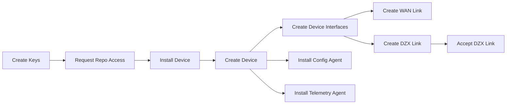

# Device Provisioning Guide for Contributors

This is the complete A-Z guide for provisioning a DoubleZero Device (DZD) from initial setup to full operation.

**Prerequisites**: Before starting this guide, ensure you have:

- Reviewed the [Contribute to DoubleZero](contribute.md) overview
- Confirmed your hardware meets the [requirements](contribute.md#hardware-requirements)
- Physically installed your DZD hardware in your data centers
- Established management connectivity to your devices

**What you'll accomplish**:

1. Generate keypairs for service and telemetry operations
2. Request access to private configuration repository
3. Apply base device configuration
4. Create device records onchain
5. Configure device interfaces
6. Establish WAN and DZX links
7. Install Config and Telemetry agents
8. Verify full device operation

---

## Provisioning Workflow



---

## Step 1: Onboarding Process

During the onboarding process, each contributor must provide a public key called the **service key** that will be used to interact with the DoubleZero CLI. This key will serve as the primary identity for executing network operations such as:

- **Creating devices**
- **Establishing links between devices and contributors**

The **service key** must be generated and securely stored by the contributor before it is submitted to the DoubleZero Foundation for authorization. This ensures that all CLI interactions can be cryptographically verified and associated with the correct contributor account.

Contributors are responsible for safeguarding the private key associated with the provided service key.

---

## Step 2: Create Keys

Each contributor has a private key used to send commands to DoubleZero. They also have a keypair that the agent uses to send metrics to the smart contracts, which store them and later process them to execute the rewards process.

### Generate the service key (one-time, not per device)

Use your preferred tool **or** the CLI:

```bash
doublezero keygen
```

### Generate the metrics (telemetry) key (one-time, not per device)

```bash
doublezero keygen -o ~/.config/doublezero/metrics-publisher.json
```

---

## Step 3: Request Access to Private Configuration Repository

> ⚠️ **Note:**
> Contributor managed configuration and additional steps for DZD provisioning is available within a dedicated GitHub repository. Please complete these tasks during new DZD and link onboarding.

The [malbeclabs/contributors](https://github.com/malbeclabs/contributors) repository contains:

- TCAM profile configurations
- Access control lists (ACLs)
- Security-sensitive documentation

**To request access:**

1. Contact the DoubleZero Foundation or Malbec Labs
2. Provide your GitHub username
3. Confirm your service key has been registered
4. Wait for access confirmation

Once granted access, follow the instructions in this repository.

---

## Step 4: Device Installation – Physical and Logical Setup

This section describes the steps for installing and configuring a device for operation within the DoubleZero network.

### 4.1 Recommended Physical Installation

- Install the device in the data center rack, ensuring correct airflow.
- Connect with redundant power feeds to ensure uptime.

### 4.2 Initial Network Access

- Establish management connectivity to the device.
- Configure Internet access.

### 4.3 Apply Recommended Configuration

- Follow the configuration guides in the private contributors repository
- Discuss any questions with DoubleZero Foundation / Malbec Labs

---

## Step 5: Device Creation

### Device Types

Before creating a device, determine which type best fits your deployment:

| Device Type | Description | Requirements |
|-------------|-------------|--------------|
| **Edge** | Provides user connectivity to the DoubleZero network. Edge devices terminate CYOA connections from users (validators, RPC operators) and connect them to the fabric. | At least 1 CYOA connection and 1 DZX connection |
| **Transit** | Provides backbone connectivity within the DoubleZero network. Transit devices move traffic between locations but do not terminate user connections directly. | At least 2 WAN links and at least 1 DZX connection |
| **Hybrid** | Combines both edge and transit functionality. Hybrid devices can terminate user connections while also providing backbone transit. | At least 1 CYOA connection and at least 1 WAN link |

### Create Command

An authorized contributor can create their devices using the following command:

```bash
doublezero device create [OPTIONS] --code <CODE> --contributor <CONTRIBUTOR> --location <LOCATION> --exchange <EXCHANGE> --public-ip <PUBLIC_IP> --dz-prefixes <DZ_PREFIXES>
```

**Options:**

```
--code <CODE>                            Unique device code
--contributor <CONTRIBUTOR>              Contributor (pubkey or code)
--device-type <DEVICE_TYPE>              Device type: hybrid (default), transit, edge
--location <LOCATION>                    Location (pubkey or code)
--exchange <EXCHANGE>                    Exchange (pubkey or code)
--public-ip <PUBLIC_IP>                  Device public IPv4 address
--dz-prefixes <DZ_PREFIXES>              List of DZ prefixes in CIDR format
--metrics-publisher <METRICS_PUBLISHER>  Metrics publisher public key (optional)
--mgmt-vrf <MGMT_VRF>                    Management VRF name (optional)
```

When running this command, the contributor must provide detailed information about the device to be connected to the DoubleZero Network.

### Viewing Available Locations

```bash
doublezero location list
```

### Viewing Available Exchanges

```bash
doublezero exchange list
```

### Example: Creating a Hybrid Device

```bash
doublezero device create \
  --code lax-dz001 \
  --contributor co01 \
  --device-type hybrid \
  --location lax \
  --exchange xlax \
  --public-ip "1.2.3.4" \
  --dz-prefixes "100.0.0.0/16" \
  --metrics-publisher <PUBKEY>
```

---

## Step 6: Creating Interfaces on a Device

```bash
doublezero device interface create [OPTIONS] <DEVICE> <NAME>
```

**Options:**

```
<DEVICE>                Device pubkey or code
<NAME>                  Interface name
--loopback-type         Loopback type: vpnv4, ipv4, pim-rp-addr
--cir                   Committed Information Rate in Mbps (default: 0)
--vlan-id               VLAN ID (default: 0, range: 0-4094)
--user-tunnel-endpoint  Interface can terminate user tunnels
-w, --wait              Wait for on-chain confirmation before returning
```

**Example:**

```bash
doublezero device interface create \
  lax-dz001 Ethernet1/1
```

> ⚠️ **Note:**
> There is a current requirement to create two loopback interfaces to support internal DZ routing protocols:
```bash
doublezero device interface create lax-dz001 Loopback255 --loopback-type vpnv4
doublezero device interface create lax-dz001 Loopback256 --loopback-type ipv4
```

### Creating CYOA Interfaces

CYOA (Choose Your Own Adventure) interfaces allow contributors to register connectivity options for users to connect to the DoubleZero network. This includes DIA (Direct Internet Access) interfaces.

**Additional CYOA/DIA Options:**

```
--interface-cyoa        CYOA type (see table below)
--interface-dia         DIA type: none, dia
--bandwidth             Bandwidth in Mbps (default: 0)
--mtu                   MTU (default: 1500)
--routing-mode          Routing mode: static (default), bgp
```

**CYOA Interface Types:**

| Type | Description |
|------|-------------|
| `gre-over-dia` | GRE tunnel over Direct Internet Access |
| `gre-over-fabric` | GRE tunnel over fabric |
| `gre-over-private-peering` | GRE tunnel over private peering |
| `gre-over-public-peering` | GRE tunnel over public peering |
| `gre-over-cable` | GRE tunnel over cable |

**DIA Interface Types:**

| Type | Description |
|------|-------------|
| `none` | Not a DIA interface (default) |
| `dia` | Direct Internet Access interface |

**Example - Create a CYOA interface with GRE over DIA:**

```bash
doublezero device interface create lax-dz001 Ethernet1/2 \
  --interface-cyoa gre-over-dia \
  --interface-dia dia \
  --bandwidth 10000 \
  --cir 1000 \
  --vlan-id 100 \
  --user-tunnel-endpoint \
  --wait
```

**Example - Create a DIA interface:**

```bash
doublezero device interface create lax-dz001 Ethernet1/3 \
  --interface-dia dia \
  --bandwidth 10000 \
  --cir 1000 \
  --user-tunnel-endpoint \
  --wait
```

**Example - Create a CYOA interface for private peering:**

```bash
doublezero device interface create lax-dz001 Ethernet1/4 \
  --interface-cyoa gre-over-private-peering \
  --bandwidth 10000 \
  --cir 5000 \
  --routing-mode bgp \
  --user-tunnel-endpoint \
  --wait
```

> ⚠️ **Note:**
> When registering CYOA/DIA interfaces, ensure you specify accurate bandwidth and CIR values as these are used for capacity planning and user onboarding.

### Listing Device Interfaces

```bash
doublezero device interface list <DEVICE>
```

### Deleting a Device Interface

```bash
doublezero device interface delete [OPTIONS] <DEVICE> <NAME>
```

> ⚠️ **Note:**
> Deleting an interface that is currently in use may cause service disruption.

---

## Step 7: Links Between Devices

Links are used to interconnect devices:

- **WAN Links** – Between devices of the same contributor.
- **DZX Links** – Between devices from different contributors.

> ⚠️ DZX links must be explicitly accepted by the second contributor.

### Creating a WAN Link

```bash
doublezero link create wan [OPTIONS] \
  --code <CODE> \
  --contributor <CONTRIBUTOR> \
  --side-a <SIDE_A> \
  --side-a-interface <SIDE_A_INTERFACE> \
  --side-z <SIDE_Z> \
  --side-z-interface <SIDE_Z_INTERFACE> \
  --bandwidth <BANDWIDTH> \
  --mtu <MTU> \
  --delay-ms <DELAY_MS> \
  --jitter-ms <JITTER_MS>
```

### Listing Links

```bash
doublezero link list
```

### Creating a DZX Link

```bash
doublezero link create dzx [OPTIONS] \
  --code <CODE> \
  --contributor <CONTRIBUTOR> \
  --side-a <SIDE_A> \
  --side-a-interface <SIDE_A_INTERFACE> \
  --side-z <SIDE_Z> \
  --bandwidth <BANDWIDTH> \
  --mtu <MTU> \
  --delay-ms <DELAY_MS> \
  --jitter-ms <JITTER_MS>
```

### Accepting a DZX Link

```bash
doublezero link accept [OPTIONS] \
  --code <CODE> \
  --side-z-interface <SIDE_Z_INTERFACE>
```

### Deleting a Link

```bash
doublezero link delete --pubkey <PUBKEY>
```

> ⚠️ **Important:**
> - Please discuss with either DZF and/or Malbec Labs before deleting an existing production link.

---

## Step 8: Install Config Agent

The Config Agent manages device configuration, applying changes from the DoubleZero controller to your DZD.

### Prerequisites

1. Supported network hardware: Arista Networks 7130LBR and 7280CR3A switches (see [hardware requirements](contribute.md#hardware-requirements)).
2. Admin access to the Arista switch(es) that will be joining the DoubleZero network.
3. Each device's DoubleZero public key, generated by running the command `doublezero device create`.
4. Determine which Arista routing instance the agent will use to connect to the DoubleZero Controller. If you can ping the controller with `ping <W.X.Y.Z>` where W.X.Y.Z is the IP address of the DoubleZero Controller, you will use the default routing instance, named `default`. If you need to specify a VRF, for example with `ping vrf management <W.X.Y.Z>`, then your routing instance would be `management`.

### Installation

Use these steps if your DoubleZero Agent will connect to the DoubleZero Controller using Arista's default routing instance.

1. To allow agents running on the local devices, including doublezero-agent, to call the local device's API, enter the following into the EOS configuration:
    ```
    !
    ! Replace the word "default" with the VRF name identified in prerequisites step 4
    !
    management api eos-sdk-rpc
        transport grpc eapilocal
            localhost loopback vrf default
            service all
            no disabled
    ```

2. Download and install the current stable doublezero-agent binary package

    a. As admin on the EOS CLI, run the `bash` shell command and then enter the following commands:
    ```
        switch# bash
        $ sudo bash
        # cd /mnt/flash
        # wget https://dl.cloudsmith.io/public/malbeclabs/doublezero/rpm/any-distro/any-version/x86_64/doublezero-agent_<X.Y.Z>_linux_amd64.rpm
        # exit
        $ exit
    ```

    !!! note
        You can find more info about Arista EOS extensions [here](https://www.arista.com/en/um-eos/eos-managing-eos-extensions)

    b. Back on the EOS CLI, set up the agent
    ```
        switch# copy flash:doublezero-agent_<X.Y.Z>_linux_amd64.rpm extension:
        switch# extension doublezero-agent_<X.Y.Z>_linux_amd64.rpm
        switch# copy installed-extensions boot-extensions
    ```
    c. Verify the extension

    The Status should be "A, I, B".
    ```
        switch# show extensions
        Name                                        Version/Release     Status     Extension
        ------------------------------------------- ------------------- ---------- ---------
        doublezero-agent_<X.Y.Z>_linux_amd64.rpm    X.Y.Z/1             A, I, B    1

        A: available | NA: not available | I: installed | F: forced | B: install at boot
    ```

3. To set up and start the agent, go back to EOS command line, add the following to the Arista EOS configuration:
    a. Configure the doublezero-agent
    ```
    !
    ! If the VRF name identified in prerequisites step 4 is not "ns-default", prefix the following
    ! exec command with `exec /sbin/ip netns exec <vrf>`
    ! For example:
    ! exec /sbin/ip netns exec ns-management /usr/local/bin/doublezero-agent -pubkey <PUBKEY>
    !
    daemon doublezero-agent
    exec /usr/local/bin/doublezero-agent -pubkey <PUBKEY>
    no shut
    ```
    b. Verify that the agent is working
    When the agent is up and running you should see the following log entries:
    ```
    switch# ceos2#show agent doublezero-agent logs
    2025/01/21 18:17:52 main.go:71: Starting doublezero-agent
    2025/01/21 18:17:52 main.go:72: doublezero-agent controller: 18.116.166.35:7000
    2025/01/21 18:17:52 main.go:73: doublezero-agent sleep-interval-in-seconds: 5.000000
    2025/01/21 18:17:52 main.go:74: doublezero-agent controller-timeout-in-seconds: 2.000000
    2025/01/21 18:17:52 main.go:75: doublezero-agent pubkey: 111111G5zfGFHe9aek69vLPkXTZnkozyBm468PhitD7U
    2025/01/21 18:17:52 main.go:76: doublezero-agent device: 127.0.0.1:9543
    2025/01/21 18:17:52 dzclient.go:32: controllerAddressAndPort 18.116.166.35:7000
    ```

### Verify Config Agent Log Output

```
show agent doublezero-agent log
```

---

## Step 9: Install Telemetry Agent

The Telemetry Agent collects and submits performance metrics from your DZD to the DoubleZero ledger.

### Prerequisites

1. Supported network hardware: Arista Networks 7130 and 7280 switches (see [hardware requirements](contribute.md#hardware-requirements)).
2. Admin access to the Arista switch(es) that will be joining the DoubleZero network.
3. Each device's DoubleZero account. This is visible in `doublezero device list` following the device's creation.
4. Determine which Arista routing instance the agent will use to connect to the DoubleZero Ledger. If you can ping the ledger with `ping doublezero-mainnet-beta.rpcpool.com`, you will use the default routing instance, named `default`. If you need to specify a VRF, for example with `ping vrf management doublezero-mainnet-beta.rpcpool.com`, then your routing instance would be `management`.

### Installation

Use these steps if your DoubleZero Agent will connect to the DoubleZero Controller using Arista's default routing instance.

1. Install a metrics publisher keypair

    a. Outside of the device, generate a keypair:

      ```sh
      doublezero keygen -o ~/.config/doublezero/metrics-publisher.json
      ```

    b. Save the keypair on the device at `/mnt/flash/metrics-publisher-keypair.json`

      ```sh
      scp ~/.config/doublezero/metrics-publisher.json <DZD>:/mnt/flash/metrics-publisher-keypair.json
      ```

    c. Register it onchain on the DoubleZero ledger:

      ```sh
      doublezero device update --pubkey <DEVICE_ACCOUNT> --metrics-publisher <METRICS_PUBLISHER_PUBKEY>
      ```

2. Download and install the current stable doublezero-telemetry binary package

    a. As admin on the EOS CLI, run the `bash` shell command and then enter the following commands:

      ```
      switch# bash
      $ sudo bash
      # cd /mnt/flash
      # wget https://dl.cloudsmith.io/public/malbeclabs/doublezero/rpm/any-distro/any-version/x86_64/doublezero-device-telemetry-agent_<X.Y.Z>_linux_amd64.rpm
      # exit
      $ exit
      ```

    !!! note
        You can find more info about Arista EOS extensions [here](https://www.arista.com/en/um-eos/eos-managing-eos-extensions)

    b. Back on the EOS CLI, set up the agent

      ```
      switch# copy flash:doublezero-device-telemetry-agent_<X.Y.Z>_linux_amd64.rpm extension:
      switch# extension doublezero-device-telemetry-agent_<X.Y.Z>_linux_amd64.rpm
      switch# copy installed-extensions boot-extensions
      ```

    c. Verify the extension

    The Status should be "A, I, B".

      ```
      switch# show extensions
      Name                                                      Version/Release     Status     Extension
      --------------------------------------------------------- ------------------- ---------- ---------
      doublezero-device-telemetry-agent_<X.Y.Z>_linux_amd64.rpm    X.Y.Z/1             A, I, B    1

      A: available | NA: not available | I: installed | F: forced | B: install at boot
      ```

3. To set up and start the agent, go back to EOS command line, add the following to the Arista EOS configuration:
    a. Configure the doublezero-telemetry

    ```
    !
    ! If the VRF name identified in prerequisites step 4 is not "ns-default", include a CLI arg of
    ! `--management-namespace <vrf>` on the following `exec` command.
    ! For example:
    ! exec /usr/local/bin/doublezero-telemetry --management-namespace ns-management ...
    !
    daemon doublezero-telemetry
    exec /usr/local/bin/doublezero-telemetry --local-device-pubkey <DEVICE_ACCOUNT> --env mainnet --keypair /mnt/flash/metrics-publisher-keypair.json
    no shut
    ```
    b. Verify that the agent is working
    When the agent is up and running you should see the following log entries:
    ```
    switch# ceos2#show agent doublezero-telemetry logs
    time=2025-08-18T18:54:04.341Z level=INFO msg="Starting telemetry collector" twampReflector=0.0.0.0:862 localDevicePK=<DEVICE_ACCOUNT> probeInterval=10s submissionInterval=1m0s
    time=2025-08-18T18:54:04.342Z level=INFO msg="Starting peer discovery" refreshInterval=10s
    time=2025-08-18T18:54:04.342Z level=INFO msg="Starting submission loop" interval=1m0s maxRetries=5 metricsPublisherPK=<METRICS_PUBLISHER_PUBKEY>
    time=2025-08-18T18:54:04.342Z level=INFO msg="Starting probe loop"
    time=2025-08-18T18:54:14.363Z level=DEBUG msg="Refreshed peers" devic
    ```

### Verify Telemetry Agent Log Output

```
show agent doublezero-telemetry log
```

---

## Provisioning Complete

Once you have completed all steps above, your DZD is fully provisioned and operational on the DoubleZero network.

**Next Steps:**

- Review the [Operations Guide](contribute-operations.md) for agent upgrades and monitoring
- Contact DoubleZero Foundation / Malbec Labs if you encounter any issues
