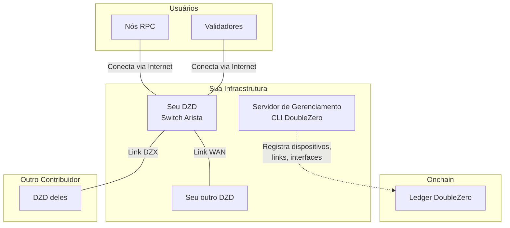
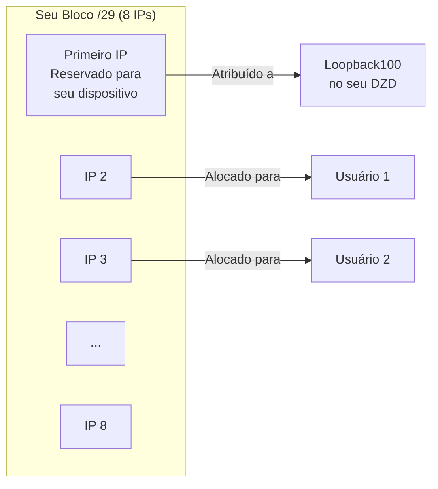
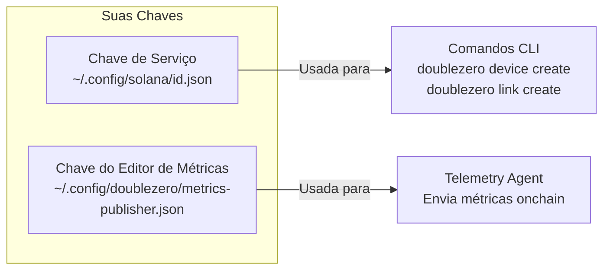
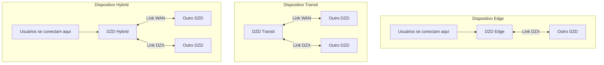
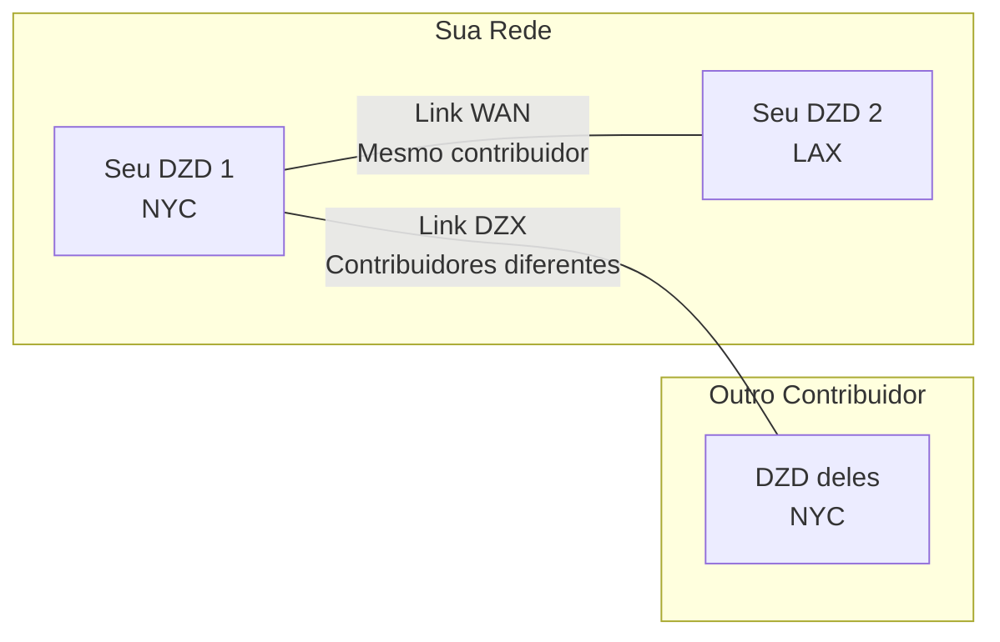
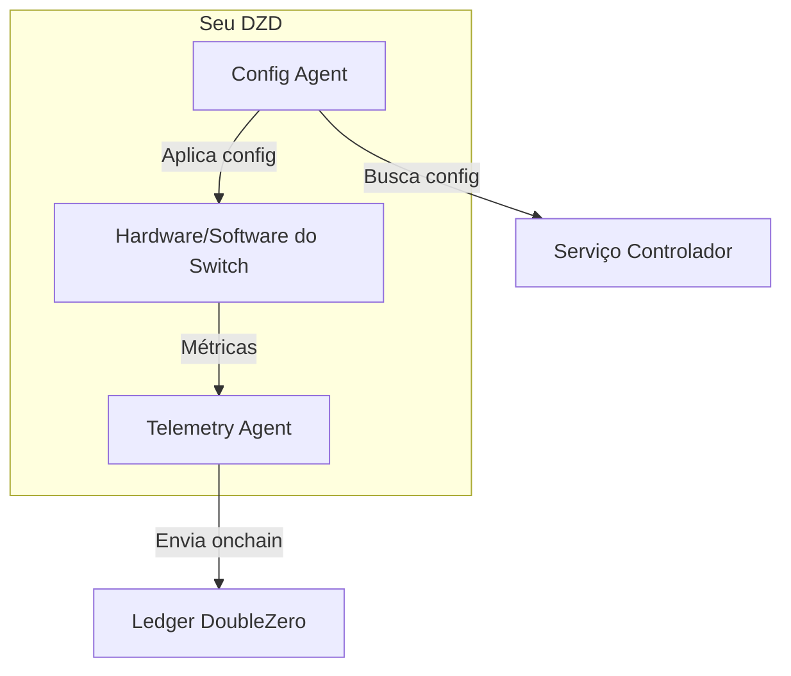
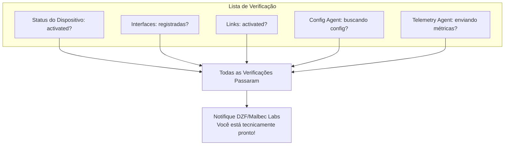

# Guia de Provisionamento de Dispositivos

Este guia orienta você no provisionamento de um Dispositivo DoubleZero (DZD) do início ao fim. Cada fase corresponde à [Lista de Verificação de Integração](contribute-overview.md#onboarding-checklist).

---

## Como Tudo Se Encaixa

Antes de mergulhar nas etapas, aqui está a visão geral do que você está construindo:



---

## Fase 1: Pré-requisitos

Antes de poder provisionar um dispositivo, você precisa do hardware físico configurado e alguns endereços IP alocados.

### O Que Você Precisa

| Requisito | Por Que É Necessário |
|-------------|-----------------|
| **Hardware DZD** | Switch Arista 7280CR3A (consulte [especificações de hardware](contribute.md#hardware-requirements)) |
| **Espaço em Rack** | 4U com fluxo de ar adequado |
| **Energia** | Alimentações redundantes, ~4KW recomendado |
| **Acesso de Gerenciamento** | Acesso SSH/console para configurar o switch |
| **Conectividade à Internet** | Para publicação de métricas e busca de configuração do controlador |
| **Bloco IPv4 Público** | Mínimo /29 para o pool de prefixos DZ (veja abaixo) |

### Instalar o CLI do DoubleZero

O CLI do DoubleZero (`doublezero`) é usado ao longo do provisionamento para registrar dispositivos, criar links e gerenciar sua contribuição. Deve ser instalado em um **servidor ou VM de gerenciamento** — não no próprio switch DZD. O switch executa apenas o Config Agent e o Telemetry Agent (instalados na [Fase 4](#fase-4-estabelecimento-de-link-instalação-de-agentes)).

**Ubuntu / Debian:**
```bash
curl -1sLf https://dl.cloudsmith.io/public/malbeclabs/doublezero/setup.deb.sh | sudo -E bash
sudo apt-get install doublezero
```

**Rocky Linux / RHEL:**
```bash
curl -1sLf https://dl.cloudsmith.io/public/malbeclabs/doublezero/setup.rpm.sh | sudo -E bash
sudo yum install doublezero
```

Verificar se o daemon está em execução:
```bash
sudo systemctl status doublezerod
```

### Entendendo seu Prefixo DZ

Seu prefixo DZ é um bloco de endereços IP públicos que o protocolo DoubleZero gerencia para alocação de IP.



**Como os prefixos DZ são usados:**

- **Primeiro IP**: Reservado para seu dispositivo (atribuído à interface Loopback100)
- **IPs restantes**: Alocados para tipos específicos de usuários que se conectam ao seu DZD:
    - Usuários `IBRLWithAllocatedIP`
    - Usuários `EdgeFiltering`
    - Publicadores multicast
- **Usuários IBRL**: NÃO consomem deste pool (usam seu próprio IP público)

!!! warning "Regras de Prefixo DZ"
    **Você NÃO PODE usar esses endereços para:**

    - Seu próprio equipamento de rede
    - Links ponto a ponto em interfaces DIA
    - Interfaces de gerenciamento
    - Qualquer infraestrutura fora do protocolo DZ

    **Requisitos:**

    - Devem ser endereços IPv4 **globalmente roteáveis (públicos)**
    - Intervalos de IP privados (10.x, 172.16-31.x, 192.168.x) são rejeitados pelo contrato inteligente
    - **Tamanho mínimo: /29** (8 endereços), prefixos maiores são preferidos (por exemplo, /28, /27)
    - Todo o bloco deve estar disponível — não pré-aloque nenhum endereço

    Se você precisar de endereços para seu próprio equipamento (IPs de interface DIA, gerenciamento, etc.), use um **pool de endereços separado**.

---

## Fase 2: Configuração de Conta

Nesta fase, você cria as chaves criptográficas que identificam você e seus dispositivos na rede.

### Onde Executar o CLI

!!! warning "NÃO instale o CLI no seu switch"
    O CLI do DoubleZero (`doublezero`) deve ser instalado em um **servidor ou VM de gerenciamento**, não no seu switch Arista.

    ```mermaid
    flowchart LR
        subgraph "Servidor/VM de Gerenciamento"
            CLI[CLI DoubleZero]
            KEYS[Seus Keypairs]
        end

        subgraph "Seu Switch DZD"
            CA[Config Agent]
            TA[Telemetry Agent]
        end

        CLI -->|Cria dispositivos, links| BC[Blockchain]
        CA -->|Busca config| CTRL[Controlador]
        TA -->|Envia métricas| BC
    ```

    | Instalar no Servidor de Gerenciamento | Instalar no Switch |
    |-----------------------------|-------------------|
    | CLI `doublezero` | Config Agent |
    | Seu keypair de serviço | Telemetry Agent |
    | Seu keypair do editor de métricas | Keypair do editor de métricas (cópia) |

### O Que São Chaves?

Pense nas chaves como credenciais de login seguras:

- **Chave de Serviço**: Sua identidade de contribuidor — usada para executar comandos CLI
- **Chave do Editor de Métricas**: A identidade do seu dispositivo para enviar dados de telemetria

Ambas são keypairs criptográficos (uma chave pública que você compartilha, uma chave privada que você mantém em segredo).



### Passo 2.1: Gerar Sua Chave de Serviço

Esta é sua identidade principal para interagir com o DoubleZero.

```bash
doublezero keygen
```

Isso cria um keypair no local padrão. A saída mostra sua **chave pública** — isso é o que você compartilhará com a DZF.

### Passo 2.2: Gerar Sua Chave do Editor de Métricas

Esta chave é usada pelo Telemetry Agent para assinar envios de métricas.

```bash
doublezero keygen -o ~/.config/doublezero/metrics-publisher.json
```

### Passo 2.3: Enviar Chaves para a DZF

Entre em contato com a DoubleZero Foundation ou Malbec Labs e forneça:

1. Sua **chave pública de serviço**
2. Seu **nome de usuário GitHub** (para acesso ao repositório)

Eles irão:

- Criar sua **conta de contribuidor** onchain
- Conceder acesso ao **repositório de contribuidores** privado

### Passo 2.4: Verificar Sua Conta

Uma vez confirmado, verifique se sua conta de contribuidor existe:

```bash
doublezero contributor list
```

Você deve ver seu código de contribuidor na lista.

### Passo 2.5: Acessar o Repositório de Contribuidores

O repositório [malbeclabs/contributors](https://github.com/malbeclabs/contributors) contém:

- Configurações base do dispositivo
- Perfis TCAM
- Configurações ACL
- Instruções de configuração adicionais

Siga as instruções lá para configuração específica do dispositivo.

---

## Fase 3: Provisionamento de Dispositivos

Agora você registrará seu dispositivo físico no blockchain e configurará suas interfaces.

### Entendendo os Tipos de Dispositivos



| Tipo | O Que Faz | Quando Usar |
|------|--------------|-------------|
| **Edge** | Aceita conexões de usuários apenas | Localização única, voltado apenas para usuários |
| **Transit** | Move tráfego entre dispositivos | Conectividade de backbone, sem usuários |
| **Hybrid** | Conexões de usuários E backbone | Mais comum — faz tudo |

### Passo 3.1: Encontrar Sua Localização e Exchange

Antes de criar seu dispositivo, consulte os códigos para sua localização de data center e exchange mais próxima:

```bash
# Listar localizações disponíveis (data centers)
doublezero location list

# Listar exchanges disponíveis (pontos de interconexão)
doublezero exchange list
```

### Passo 3.2: Criar Seu Dispositivo Onchain

Registrar seu dispositivo no blockchain:

```bash
doublezero device create \
  --code <SEU_CODIGO_DE_DISPOSITIVO> \
  --contributor <SEU_CODIGO_DE_CONTRIBUIDOR> \
  --device-type hybrid \
  --location <CODIGO_DE_LOCALIZACAO> \
  --exchange <CODIGO_DE_EXCHANGE> \
  --public-ip <IP_PUBLICO_DO_DISPOSITIVO> \
  --dz-prefixes <SEU_PREFIXO_DZ>
```

**Exemplo:**

```bash
doublezero device create \
  --code nyc-dz001 \
  --contributor acme \
  --device-type hybrid \
  --location EQX-NY5 \
  --exchange nyc \
  --public-ip "203.0.113.10" \
  --dz-prefixes "198.51.100.0/28"
```

**Saída esperada:**

```
Signature: 4vKz8H...truncated...7xPq2
```

Verificar se seu dispositivo foi criado:

```bash
doublezero device list | grep nyc-dz001
```

**Parâmetros explicados:**

| Parâmetro | O Que Significa |
|-----------|---------------|
| `--code` | Um nome único para seu dispositivo (por exemplo, `nyc-dz001`) |
| `--contributor` | Seu código de contribuidor (fornecido pela DZF) |
| `--device-type` | `hybrid`, `transit` ou `edge` |
| `--location` | Código do data center em `location list` |
| `--exchange` | Código da exchange mais próxima em `exchange list` |
| `--public-ip` | O IP público onde os usuários se conectam ao seu dispositivo via internet |
| `--dz-prefixes` | Seu bloco de IP alocado para usuários |

### Passo 3.3: Criar Interfaces Loopback Necessárias

Todo dispositivo precisa de duas interfaces loopback para roteamento interno:

```bash
# Loopback VPNv4
doublezero device interface create <CODIGO_DO_DISPOSITIVO> Loopback255 --loopback-type vpnv4

# Loopback IPv4
doublezero device interface create <CODIGO_DO_DISPOSITIVO> Loopback256 --loopback-type ipv4
```

**Saída esperada (para cada comando):**

```
Signature: 3mNx9K...truncated...8wRt5
```

### Passo 3.4: Criar Interfaces Físicas

Registrar as portas físicas que você usará:

```bash
# Interface básica
doublezero device interface create <CODIGO_DO_DISPOSITIVO> Ethernet1/1
```

**Saída esperada:**

```
Signature: 7pQw2R...truncated...4xKm9
```

### Passo 3.5: Criar Interface CYOA (para dispositivos Edge/Hybrid)

Se seu dispositivo aceita conexões de usuários, você precisa de uma interface CYOA (Choose Your Own Adventure). Isso informa ao sistema como os usuários se conectam a você.

**Tipos CYOA Explicados:**

| Tipo | Em Português Claro | Usar Quando |
|------|--------------|----------|
| `gre-over-dia` | Usuários se conectam via internet regular | Mais comum — usuários se conectam via DIA ao seu DZD |
| `gre-over-private-peering` | Usuários se conectam via link privado | Usuários têm conexão direta com sua rede |
| `gre-over-public-peering` | Usuários se conectam via IX | Usuários fazem peering com você em uma internet exchange |
| `gre-over-fabric` | Usuários na mesma rede local | Usuários no mesmo data center |
| `gre-over-cable` | Cabo direto ao usuário | Único usuário dedicado |

**Exemplo — Usuários padrão de internet:**

```bash
doublezero device interface create <CODIGO_DO_DISPOSITIVO> Ethernet1/2 \
  --interface-cyoa gre-over-dia \
  --interface-dia dia \
  --bandwidth 10000 \
  --cir 1000 \
  --user-tunnel-endpoint \
  --wait
```

**Saída esperada:**

```
Signature: 2wLp8N...truncated...5vHt3
```

**Parâmetros explicados:**

| Parâmetro | O Que Significa |
|-----------|---------------|
| `--interface-cyoa` | Como os usuários se conectam (consulte a tabela acima) |
| `--interface-dia` | `dia` se esta é uma porta voltada para a internet |
| `--bandwidth` | Velocidade da porta em Mbps (10000 = 10Gbps) |
| `--cir` | Taxa comprometida em Mbps (largura de banda garantida) |
| `--user-tunnel-endpoint` | Esta porta aceita túneis de usuários |

### Passo 3.6: Verificar Seu Dispositivo

```bash
doublezero device list
```

**Exemplo de saída:**

```
 account                                      | code      | contributor | location | exchange | device_type | public_ip    | dz_prefixes     | users | max_users | status    | health  | mgmt_vrf | owner
 7xKm9pQw2R4vHt3...                          | nyc-dz001 | acme        | EQX-NY5  | nyc      | hybrid      | 203.0.113.10 | 198.51.100.0/28 | 0     | 14        | activated | pending |          | 5FMtd5Woq5XAAg54...
```

Seu dispositivo deve aparecer com status `activated`.

---

## Fase 4: Estabelecimento de Link & Instalação de Agentes

Os links conectam seu dispositivo ao restante da rede DoubleZero.

### Entendendo os Links



| Tipo de Link | Conecta | Aceitação |
|-----------|----------|------------|
| **Link WAN** | Dois dos SEUS dispositivos | Automática (você é dono de ambos) |
| **Link DZX** | Seu dispositivo com OUTRO contribuidor | Requer aceitação deles |

### Passo 4.1: Criar Links WAN (se você tiver múltiplos dispositivos)

Links WAN conectam seus próprios dispositivos:

```bash
doublezero link create wan \
  --code <CODIGO_DO_LINK> \
  --contributor <SEU_CONTRIBUIDOR> \
  --side-a <CODIGO_DISPOSITIVO_1> \
  --side-a-interface <INTERFACE_NO_DISPOSITIVO_1> \
  --side-z <CODIGO_DISPOSITIVO_2> \
  --side-z-interface <INTERFACE_NO_DISPOSITIVO_2> \
  --bandwidth 10000 \
  --mtu 9000 \
  --delay-ms 20 \
  --jitter-ms 1
```

**Exemplo:**

```bash
doublezero link create wan \
  --code nyc-lax-wan01 \
  --contributor acme \
  --side-a nyc-dz001 \
  --side-a-interface Ethernet3/1 \
  --side-z lax-dz001 \
  --side-z-interface Ethernet3/1 \
  --bandwidth 10000 \
  --mtu 9000 \
  --delay-ms 65 \
  --jitter-ms 1
```

**Saída esperada:**

```
Signature: 5tNm7K...truncated...9pRw2
```

### Passo 4.2: Criar Links DZX

Os links DZX conectam seu dispositivo diretamente ao DZD de outro contribuidor:

```bash
doublezero link create dzx \
  --code <CODIGO_DISPOSITIVO_A:CODIGO_DISPOSITIVO_Z> \
  --contributor <SEU_CONTRIBUIDOR> \
  --side-a <SEU_CODIGO_DE_DISPOSITIVO> \
  --side-a-interface <SUA_INTERFACE> \
  --side-z <CODIGO_DISPOSITIVO_OUTRO> \
  --bandwidth <LARGURA_DE_BANDA em Kbps, Mbps ou Gbps> \
  --mtu <MTU> \
  --delay-ms <ATRASO> \
  --jitter-ms <JITTER>
```

**Saída esperada:**

```
Signature: 8mKp3W...truncated...2nRx7
```

Após criar um link DZX, o outro contribuidor deve aceitá-lo:

```bash
# O OUTRO contribuidor executa isso
doublezero link accept \
  --code <CODIGO_DO_LINK> \
  --side-z-interface <INTERFACE_DELES>
```

**Saída esperada (para o contribuidor que aceita):**

```
Signature: 6vQt9L...truncated...3wPm4
```

### Passo 4.3: Verificar Links

```bash
doublezero link list
```

**Exemplo de saída:**

```
 account                                      | code          | contributor | side_a_name | side_a_iface_name | side_z_name | side_z_iface_name | link_type | bandwidth | mtu  | delay_ms | jitter_ms | delay_override_ms | tunnel_id | tunnel_net      | status    | health  | owner
 8vkYpXaBW8RuknJq...                         | nyc-dz001:lax-dz001 | acme        | nyc-dz001   | Ethernet3/1       | lax-dz001   | Ethernet3/1       | WAN       | 10Gbps    | 9000 | 65.00ms  | 1.00ms    | 0.00ms            | 42        | 172.16.0.84/31  | activated | pending | 5FMtd5Woq5XAAg54...
```

Os links devem mostrar status `activated` uma vez que ambos os lados estejam configurados.

---

### Instalação de Agentes

Dois agentes de software são executados no seu DZD:



| Agente | O Que Faz |
|-------|--------------|
| **Config Agent** | Busca configuração do controlador, aplica ao seu switch |
| **Telemetry Agent** | Mede latência/perda para outros dispositivos, reporta métricas onchain |

### Passo 4.4: Instalar Config Agent

#### Habilitar a API no seu switch

Adicionar à configuração EOS:

```
management api eos-sdk-rpc
    transport grpc eapilocal
        localhost loopback vrf default
        service all
        no disabled
```

!!! note "Nota sobre VRF"
    Substitua `default` pelo nome do seu VRF de gerenciamento se for diferente (por exemplo, `management`).

#### Baixar e instalar o agente

```bash
# Entrar no bash no switch
switch# bash
$ sudo bash
# cd /mnt/flash
# wget AGENT_DOWNLOAD_URL
# exit
$ exit

# Instalar como extensão EOS
switch# copy flash:AGENT_FILENAME extension:
switch# extension AGENT_FILENAME
switch# copy installed-extensions boot-extensions
```

#### Verificar a extensão

```bash
switch# show extensions
```

O Status deve ser "A, I, B":

```
Name                                        Version/Release     Status     Extension
------------------------------------------- ------------------- ---------- ---------
AGENT_FILENAME    MAINNET_CLIENT_VERSION/1             A, I, B    1

A: available | NA: not available | I: installed | F: forced | B: install at boot
```

#### Configurar e iniciar o agente

Adicionar à configuração EOS:

```
daemon doublezero-agent
    exec /usr/local/bin/doublezero-agent -pubkey <SUA_CHAVE_PUBLICA_DO_DISPOSITIVO>
    no shut
```

!!! note "Nota sobre VRF"
    Se seu VRF de gerenciamento não for `default` (ou seja, o namespace não é `ns-default`), prefixe o comando exec com `exec /sbin/ip netns exec ns-<VRF>`. Por exemplo, se seu VRF for `management`:
    ```
    daemon doublezero-agent
        exec /sbin/ip netns exec ns-management /usr/local/bin/doublezero-agent -pubkey <SUA_CHAVE_PUBLICA_DO_DISPOSITIVO>
        no shut
    ```

Obtenha a pubkey do seu dispositivo com `doublezero device list` (coluna `account`).

#### Verificar se está em execução

```bash
switch# show agent doublezero-agent logs
```

Você deve ver "Starting doublezero-agent" e conexões bem-sucedidas ao controlador.

### Passo 4.5: Instalar Telemetry Agent

#### Copiar a chave do editor de métricas para o seu dispositivo

```bash
scp ~/.config/doublezero/metrics-publisher.json <IP_DO_SWITCH>:/mnt/flash/metrics-publisher-keypair.json
```

#### Registrar o editor de métricas onchain

```bash
doublezero device update \
  --pubkey <CONTA_DO_DISPOSITIVO> \
  --metrics-publisher <CHAVE_PUBLICA_DO_EDITOR_DE_METRICAS>
```

Obtenha a pubkey do seu arquivo metrics-publisher.json.

#### Baixar e instalar o agente

```bash
switch# bash
$ sudo bash
# cd /mnt/flash
# wget TELEMETRY_DOWNLOAD_URL
# exit
$ exit

# Instalar como extensão EOS
switch# copy flash:TELEMETRY_FILENAME extension:
switch# extension TELEMETRY_FILENAME
switch# copy installed-extensions boot-extensions
```

#### Verificar a extensão

```bash
switch# show extensions
```

O Status deve ser "A, I, B":

```
Name                                        Version/Release     Status     Extension
------------------------------------------- ------------------- ---------- ---------
TELEMETRY_FILENAME    MAINNET_CLIENT_VERSION/1             A, I, B    1

A: available | NA: not available | I: installed | F: forced | B: install at boot
```

#### Configurar e iniciar o agente

Adicionar à configuração EOS:

```
daemon doublezero-telemetry
    exec /usr/local/bin/doublezero-telemetry --local-device-pubkey <CONTA_DO_DISPOSITIVO> --env mainnet --keypair /mnt/flash/metrics-publisher-keypair.json
    no shut
```

!!! note "Nota sobre VRF"
    Se seu VRF de gerenciamento não for `default` (ou seja, o namespace não é `ns-default`), adicione `--management-namespace ns-<VRF>` ao comando exec. Por exemplo, se seu VRF for `management`:
    ```
    daemon doublezero-telemetry
        exec /usr/local/bin/doublezero-telemetry --management-namespace ns-management --local-device-pubkey <CONTA_DO_DISPOSITIVO> --env mainnet --keypair /mnt/flash/metrics-publisher-keypair.json
        no shut
    ```

#### Verificar se está em execução

```bash
switch# show agent doublezero-telemetry logs
```

Você deve ver "Starting telemetry collector" e "Starting submission loop".

---

## Fase 5: Rodagem do Link

!!! warning "Todos os novos links devem passar por rodagem antes de transportar tráfego"
    Novos links devem ser **drenados por pelo menos 24 horas** antes de serem ativados para tráfego de produção. Este requisito de rodagem é definido no [RFC12: Provisionamento de Rede](https://github.com/malbeclabs/doublezero/blob/main/rfcs/rfc12-network-provisioning.md), que especifica ~200.000 slots do DZ Ledger (~20 horas) de métricas limpas antes que um link esteja pronto para serviço.

Com os agentes instalados e em execução, monitore seus links em [metrics.doublezero.xyz](https://metrics.doublezero.xyz) por pelo menos 24 horas consecutivas:

- Dashboard **"DoubleZero Device-Link Latencies"** — verifique **zero perda de pacotes** no link ao longo do tempo
- Dashboard **"DoubleZero Network Metrics"** — verifique **zero erros** nos seus links

Remova o dreno do link apenas depois que o período de rodagem mostrar um link limpo com zero perda e zero erros.

---

## Fase 6: Verificação & Ativação

Percorra esta lista de verificação para confirmar que tudo está funcionando.

!!! warning "Seu dispositivo começa bloqueado (`max_users = 0`)"
    Quando um dispositivo é criado, `max_users` é definido como **0** por padrão. Isso significa que nenhum usuário pode se conectar a ele ainda. Isso é intencional — você deve verificar se tudo funciona antes de aceitar tráfego de usuários.

    **Antes de definir `max_users` acima de 0, você deve:**

    1. Confirmar que todos os links completaram sua **rodagem de 24 horas** com zero perda/erros em [metrics.doublezero.xyz](https://metrics.doublezero.xyz)
    2. **Coordenar com DZ/Malbec Labs** para executar um teste de conectividade:
        - Um usuário de teste pode se conectar ao seu dispositivo?
        - O usuário recebe rotas pela rede DZ?
        - O usuário pode rotear tráfego pela rede DZ de ponta a ponta?
    3. Somente após o DZ/ML confirmar que os testes passaram, defina max_users como 96:

    ```bash
    doublezero device update --pubkey <CONTA_DO_DISPOSITIVO> --max-users 96
    ```

### Verificações do Dispositivo

```bash
# Seu dispositivo deve aparecer com status "activated"
doublezero device list | grep <SEU_CODIGO_DE_DISPOSITIVO>
```

**Saída esperada:**

```
 7xKm9pQw2R4vHt3... | nyc-dz001 | acme | EQX-NY5 | nyc | hybrid | 203.0.113.10 | 198.51.100.0/28 | 0 | 14 | activated | pending | | 5FMtd5Woq5XAAg54...
```

```bash
# Suas interfaces devem estar listadas
doublezero device interface list | grep <SEU_CODIGO_DE_DISPOSITIVO>
```

**Saída esperada:**

```
 nyc-dz001 | Loopback255 | loopback | vpnv4 | none | none | 0 | 0 | 1500 | static | 0 | 172.16.1.91/32  | 56 | false | activated
 nyc-dz001 | Loopback256 | loopback | ipv4  | none | none | 0 | 0 | 1500 | static | 0 | 172.16.1.100/32 | 0  | false | activated
 nyc-dz001 | Ethernet1/1 | physical | none  | none | none | 0 | 0 | 1500 | static | 0 |                 | 0  | false | activated
```

### Verificações de Link

```bash
# Os links devem mostrar status "activated"
doublezero link list | grep <SEU_CODIGO_DE_DISPOSITIVO>
```

**Saída esperada:**

```
 8vkYpXaBW8RuknJq... | nyc-lax-wan01 | acme | nyc-dz001 | Ethernet3/1 | lax-dz001 | Ethernet3/1 | WAN | 10Gbps | 9000 | 65.00ms | 1.00ms | 0.00ms | 42 | 172.16.0.84/31 | activated | pending | 5FMtd5Woq5XAAg54...
```

### Verificações de Agente

No switch:

```bash
# O config agent deve mostrar extrações de configuração bem-sucedidas
switch# show agent doublezero-agent logs | tail -20

# O telemetry agent deve mostrar envios bem-sucedidos
switch# show agent doublezero-telemetry logs | tail -20
```

### Diagrama de Verificação Final



---

## Resolução de Problemas

### Criação de dispositivo falha

- Verifique se sua chave de serviço está autorizada (`doublezero contributor list`)
- Verifique se os códigos de localização e exchange são válidos
- Certifique-se de que o prefixo DZ é um intervalo de IP público válido

### Link preso em status "requested"

- Links DZX requerem aceitação do outro contribuidor
- Entre em contato com eles para executar `doublezero link accept`

### Config Agent não se conecta

- Verifique se a rede de gerenciamento tem acesso à internet
- Verifique se a configuração do VRF corresponde à sua configuração
- Certifique-se de que a pubkey do dispositivo está correta

### Telemetry Agent não envia

- Verifique se a chave do editor de métricas está registrada onchain
- Verifique se o arquivo de keypair existe no switch
- Certifique-se de que a pubkey da conta do dispositivo está correta

---

## Próximas Etapas

- Revise o [Guia de Operações](contribute-operations.md) para atualizações de agentes e gerenciamento de links
- Consulte o [Glossário](glossary.md) para definições de termos
- Entre em contato com DZF/Malbec Labs se encontrar problemas
