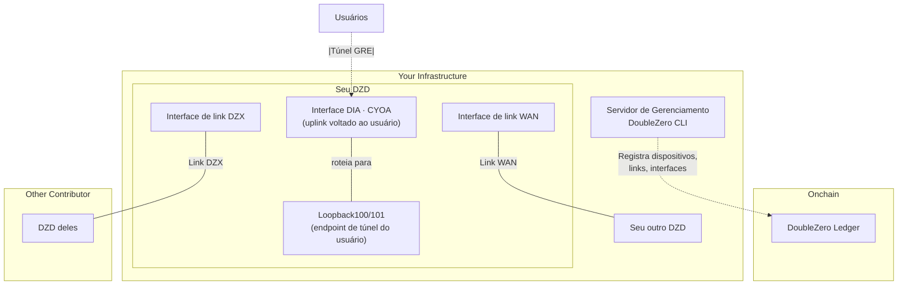
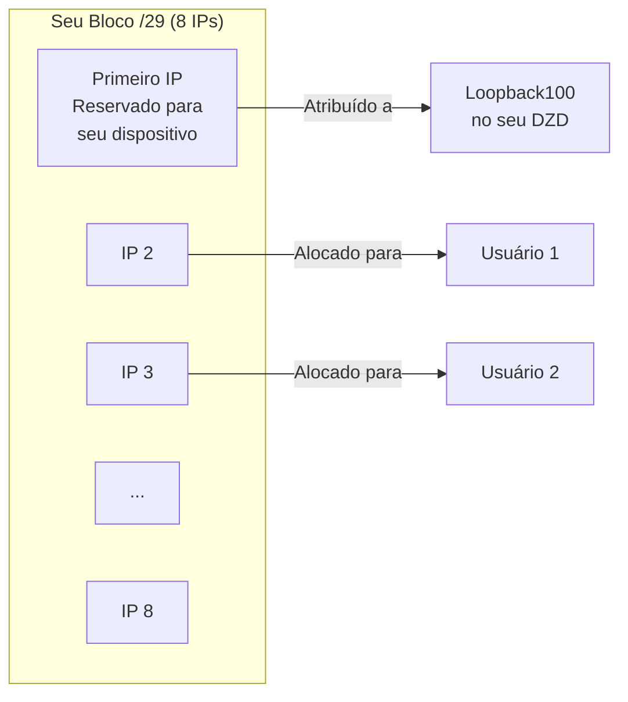
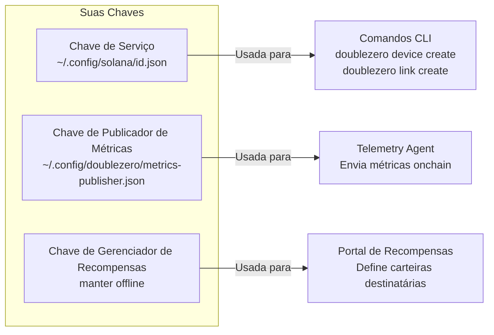
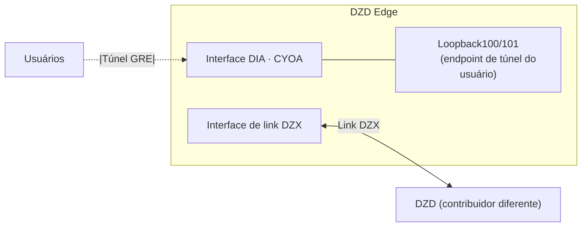
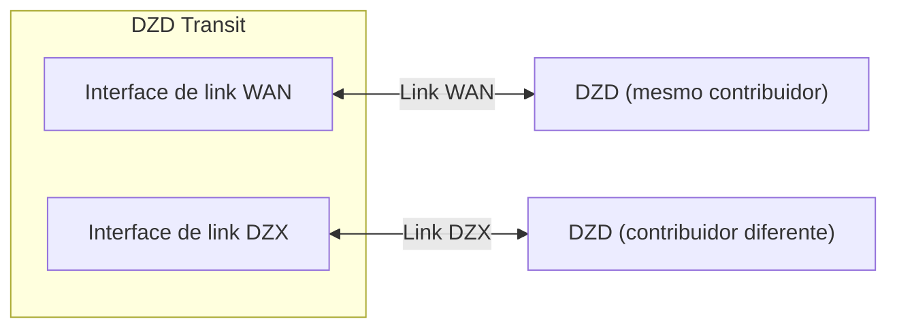
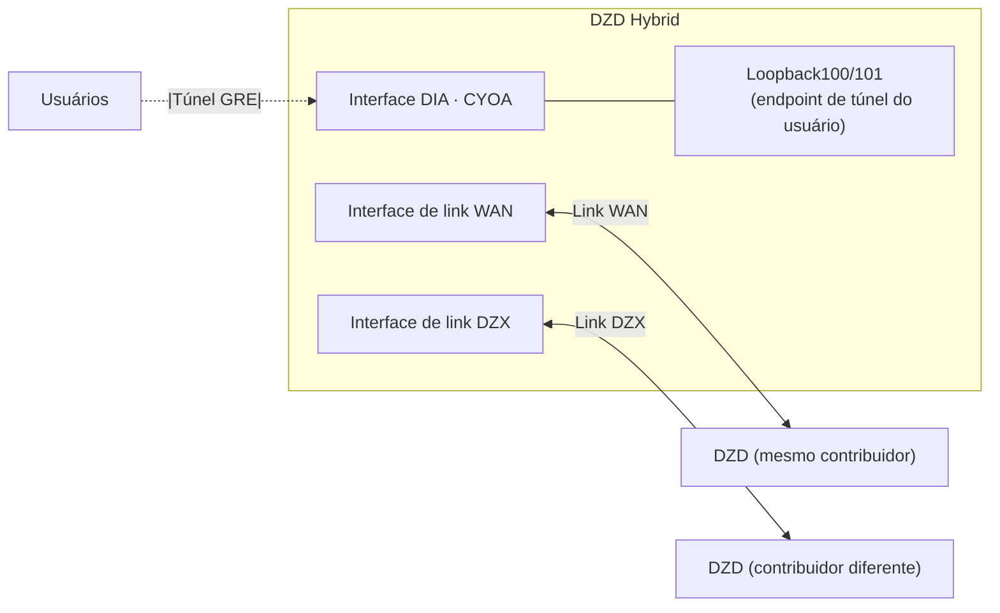
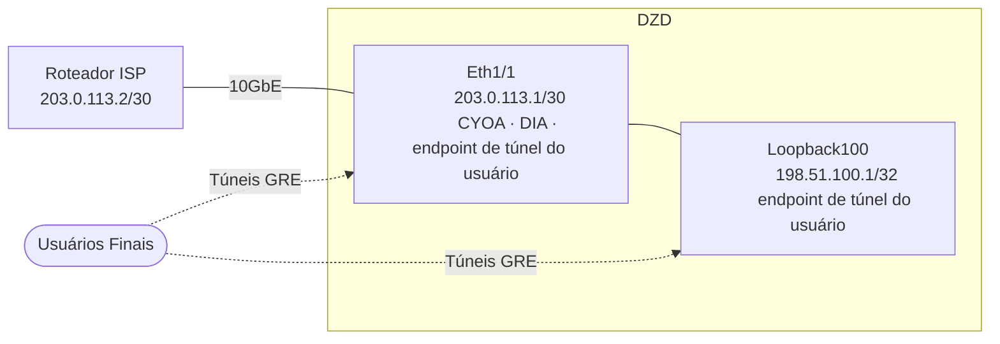
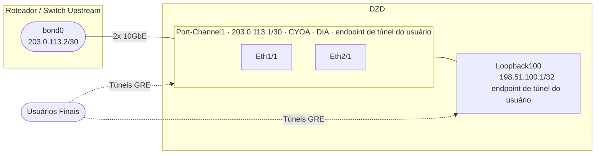

# Guia de Provisionamento de Dispositivos

Este guia orienta você no provisionamento de um Dispositivo DoubleZero (DZD) do início ao fim. Cada fase corresponde ao [Checklist de Integração](contribute-overview.md#onboarding-checklist).

---

## Como Tudo Se Encaixa

Este guia orienta você no registro da sua infraestrutura on-chain para que a rede DoubleZero possa rotear tráfego através dela. Quanto mais completamente seu dispositivo estiver registrado, mais útil ele será para a rede. Uma representação on-chain completa do seu dispositivo permite melhor resolução de problemas, planejamento de capacidade e permite que o controlador tome decisões informadas. Com o tempo, o objetivo é que o controlador assuma mais responsabilidade de configuração.

### Conceitos-chave

**Interfaces**

As interfaces em um DZD vêm em diferentes formas: portas Ethernet, port channels (LAGs compostos por múltiplas portas Ethernet) e loopbacks. Cada interface que desempenha um papel na rede precisa ser registrada on-chain com as flags apropriadas para que o protocolo saiba o que ela faz.

Portas Ethernet e port channels podem desempenhar as seguintes funções:

| Flag | O que significa |
|------|-----------------|
| `--interface-dia dia` | Marca a interface como uplink de acesso direto à internet |
| `--interface-cyoa <subtype>` | Declara como os usuários estabelecem túneis GRE através desta interface (ex: pela internet pública, via link de peering privado) |
| `--user-tunnel-endpoint true` | Esta interface possui um IP público no qual os usuários terminam túneis GRE |

Interfaces usadas para links WAN ou DZX não possuem uma flag específica — elas são registradas com sua largura de banda e então referenciadas quando o link é criado.

Interfaces loopback servem a diversos propósitos:

| Loopback | O que significa |
|----------|-----------------|
| **Loopback100 / 101** | Possuem IPs públicos nos quais os usuários terminam túneis GRE. Registrados com `--user-tunnel-endpoint true`. |
| **Loopback255** (`vpnv4`) | Registrado para que o controlador possa atribuir um IP usado para router ID BGP, peering VPN-IPv4 (unicast), identidade IS-IS e segment routing |
| **Loopback256** (`ipv4`) | Registrado para que o controlador possa atribuir um IP usado para peering BGP IPv4 (multicast) e sessões MSDP |

**Links**

Links são registrados separadamente das interfaces, e as interfaces devem existir on-chain antes que um link possa referenciá-las. Quando você cria um link WAN ou DZX, você especifica uma interface já registrada como o endpoint físico do link. Nem todas as interfaces estão vinculadas a um link: interfaces DIA, CYOA e loopback não são conectadas a um link.

| Termo | O que significa |
|-------|-----------------|
| **Link WAN** | Um link entre dois dos seus próprios DZDs |
| **Link DZX** | Um link entre seu DZD e o DZD de outro contribuidor |

### Visão geral da arquitetura


```mermaid
flowchart TB
    subgraph Onchain
        SC[DoubleZero Ledger]
    end

    subgraph Your Infrastructure
        MGMT[Servidor de Gerenciamento<br/>DoubleZero CLI]
        subgraph DZD[Seu DZD]
            CYOA["Interface DIA · CYOA<br/>(uplink voltado ao usuário)"]
            WAN_INTF["Interface de link WAN"]
            DZX_INTF["Interface de link DZX"]
            LO100["Loopback100/101<br/>(endpoint de túnel do usuário)"]
        end
        DZD2[Seu outro DZD]
    end

    subgraph Other Contributor
        OtherDZD[DZD deles]
    end

    USERS["Usuários"]

    MGMT -.->|Registra dispositivos,<br/>links, interfaces| SC
    WAN_INTF ---|Link WAN| DZD2
    DZX_INTF ---|Link DZX| OtherDZD
    USERS -.|Túnel GRE|.-> CYOA
    CYOA ---|roteia para| LO100
```

---

## Fase 1: Pré-requisitos

Antes de provisionar um dispositivo, você precisa ter o hardware físico configurado e alguns endereços IP alocados.

### O Que Você Precisa

| Requisito | Por Que É Necessário |
|-----------|----------------------|
| **Hardware DZD** | Switch Arista 7280CR3A (veja [especificações de hardware](contribute.md#hardware-requirements)) |
| **Espaço em Rack** | 1U por DZD, com fluxo de ar adequado. Veja [Rack e Energia](contribute.md#rack-power-requirements) |
| **Energia** | Duas alimentações independentes, cada uma capaz de suportar toda a carga sozinha. Veja [Rack e Energia](contribute.md#rack-power-requirements) |
| **Acesso de Gerenciamento** | Acesso SSH/console para configurar o switch |
| **Conectividade com a Internet** | Para publicação de métricas e para buscar configuração do controlador |
| **Bloco IPv4 Público** | Mínimo /29 para o pool de prefixos DZ (veja abaixo) |

### Instalar o CLI DoubleZero

O CLI DoubleZero (`doublezero`) é usado durante todo o provisionamento para registrar dispositivos, criar links e gerenciar sua contribuição. Ele deve ser instalado em um **servidor de gerenciamento ou VM** — não no switch DZD em si. O switch executa apenas o Config Agent e o Telemetry Agent (instalados na [Fase 4](#fase-4-estabelecimento-de-links-instalação-de-agentes)).

**Ubuntu / Debian:**
```bash
curl -1sLf https://dl.cloudsmith.io/public/malbeclabs/doublezero/setup.deb.sh | sudo -E bash
sudo apt-get install doublezero
```

**Rocky Linux / RHEL:**
```bash
curl -1sLf https://dl.cloudsmith.io/public/malbeclabs/doublezero/setup.rpm.sh | sudo -E bash
sudo yum install doublezero
```

Verifique se o daemon está em execução:
```bash
sudo systemctl status doublezerod
```

### Entendendo Seu Prefixo DZ

Seu prefixo DZ é um bloco de endereços IP públicos que o protocolo DoubleZero gerencia para alocação de IPs.


```mermaid
flowchart LR
    subgraph "Seu Bloco /29 (8 IPs)"
        IP1["Primeiro IP<br/>Reservado para<br/>seu dispositivo"]
        IP2["IP 2"]
        IP3["IP 3"]
        IP4["..."]
        IP8["IP 8"]
    end

    IP1 -->|Atribuído a| LO[Loopback100<br/>no seu DZD]
    IP2 -->|Alocado para| U1[Usuário 1]
    IP3 -->|Alocado para| U2[Usuário 2]
```

**Como os prefixos DZ são usados:**

- **Primeiro IP**: Reservado para seu dispositivo (atribuído à interface Loopback100)
- **IPs restantes**: Alocados para tipos específicos de usuários conectando ao seu DZD:
    - Usuários `IBRLWithAllocatedIP`
    - Usuários `EdgeFiltering` (caso de uso futuro)
- **Usuários IBRL**: NÃO consomem deste pool (eles usam seu próprio IP público)

!!! warning "Regras do Prefixo DZ"
    **Você NÃO PODE usar estes endereços para:**

    - Seus próprios equipamentos de rede
    - Links ponto a ponto em interfaces DIA
    - Interfaces de gerenciamento
    - Qualquer infraestrutura fora do protocolo DZ

    **Requisitos:**

    - Devem ser endereços IPv4 **globalmente roteáveis (públicos)**
    - Faixas de IP privado (10.x, 172.16-31.x, 192.168.x) são rejeitadas pelo smart contract
    - **Tamanho mínimo: /29** (8 endereços), prefixos maiores são preferíveis (ex: /28, /27)
    - O bloco inteiro deve estar disponível — não pré-aloque nenhum endereço

    Se você precisar de endereços para seus próprios equipamentos (IPs de interface DIA, gerenciamento, etc.), use um **pool de endereços separado**.

---

## Fase 2: Configuração da Conta

Nesta fase, você cria as chaves criptográficas que identificam você e seus dispositivos na rede, e define onde suas recompensas devem ser pagas.

Três chaves resultam desta fase: uma chave de serviço, uma chave de publicador de métricas e uma chave de gerenciador de recompensas. Envie as chaves públicas de todas as três para a DZF juntas no [Passo 2.4](#passo-24-enviar-chaves-para-a-dzf). [Gerenciamento de Recompensas](contribute-rewards.md) cobre o lado das recompensas em detalhes.

### Onde Executar o CLI

!!! warning "NÃO instale o CLI no seu switch"
    O CLI DoubleZero (`doublezero`) deve ser instalado em um **servidor de gerenciamento ou VM**, não no seu switch Arista.

    ```mermaid
    flowchart LR
        subgraph "Servidor de Gerenciamento/VM"
            CLI[DoubleZero CLI]
            KEYS[Seus Pares de Chaves]
        end

        subgraph "Seu Switch DZD"
            CA[Config Agent]
            TA[Telemetry Agent]
        end

        CLI -->|Cria dispositivos, links| BC[Blockchain]
        CA -->|Busca configuração| CTRL[Controlador]
        TA -->|Envia métricas| BC
    ```

    | Instalar no Servidor de Gerenciamento | Instalar no Switch |
    |---------------------------------------|---------------------|
    | CLI `doublezero` | Config Agent |
    | Seu par de chaves de serviço | Telemetry Agent |
    | Seu par de chaves de publicador de métricas | Par de chaves de publicador de métricas (cópia) |

### O Que São Chaves?

Pense nas chaves como credenciais seguras de login:

- **Chave de Serviço**: Sua identidade de contribuidor - usada para executar comandos do CLI
- **Chave de Publicador de Métricas**: A identidade do seu dispositivo para enviar dados de telemetria
- **Chave de Gerenciador de Recompensas**: Controla quais carteiras recebem suas recompensas - veja [Gerenciamento de Recompensas](contribute-rewards.md)

Todas as três são pares de chaves criptográficas (uma chave pública que você compartilha, uma chave privada que você mantém em segredo).


```mermaid
flowchart LR
    subgraph "Suas Chaves"
        SK[Chave de Serviço<br/>~/.config/solana/id.json]
        MK[Chave de Publicador de Métricas<br/>~/.config/doublezero/metrics-publisher.json]
        RK[Chave de Gerenciador de Recompensas<br/>manter offline]
    end

    SK -->|Usada para| CLI[Comandos CLI<br/>doublezero device create<br/>doublezero link create]
    MK -->|Usada para| TEL[Telemetry Agent<br/>Envia métricas onchain]
    RK -->|Usada para| REW[Portal de Recompensas<br/>Define carteiras destinatárias]
```

!!! note "Mantenha a chave de gerenciador de recompensas separada"
    A chave de serviço e a chave de publicador de métricas ficam no seu servidor de gerenciamento e no switch. A chave de gerenciador de recompensas controla para onde seu dinheiro vai, então mantenha-a fora dessas máquinas. Ela só é necessária quando você altera suas carteiras destinatárias.

### Passo 2.1: Gerar Sua Chave de Serviço

Esta é sua identidade principal para interagir com o DoubleZero.

```bash
doublezero keygen
```

Isso cria um par de chaves no local padrão. A saída mostra sua **chave pública** - é isso que você compartilhará com a DZF.

### Passo 2.2: Gerar Sua Chave de Publicador de Métricas

Esta chave é usada pelo Telemetry Agent para assinar envios de métricas.

```bash
doublezero keygen -o ~/.config/doublezero/metrics-publisher.json
```

### Passo 2.3: Criar Sua Carteira de Gerenciador de Recompensas

Esta é a terceira chave. Ela controla quais carteiras recebem suas recompensas, e nunca as retém.

Crie uma carteira Solana que você controle e possa assinar, depois financie-a com cerca de 0,01 SOL para cobrir taxas de transação. Uma carteira de hardware é uma boa escolha. Não reutilize sua chave de serviço.

Você só precisa da carteira neste momento. Você definirá as carteiras que realmente recebem suas recompensas no [Passo 2.7](#passo-27-definir-seus-destinatários-de-recompensa), depois que a DZF tiver registrado esta chave.

### Passo 2.4: Enviar Chaves para a DZF

Entre em contato com a DoubleZero Foundation ou Malbec Labs e forneça:

1. Sua **chave pública de serviço**
2. Sua **chave pública de gerenciador de recompensas** (do Passo 2.3)
3. Seu **nome de usuário do GitHub** (para acesso ao repositório)

Envie as três juntas. A DZF registra a chave de serviço e a chave de gerenciador de recompensas em transações onchain separadas, então enviá-las ao mesmo tempo economiza uma ida e volta.

!!! danger "Apenas chaves públicas"
    Nunca envie uma chave privada ou um arquivo de par de chaves para ninguém, incluindo a DZF. A DZF só precisa das suas chaves públicas.

Eles irão:

- Criar sua **conta de contribuidor** onchain
- Registrar sua **chave de gerenciador de recompensas** associada à sua chave de serviço
- Conceder acesso ao **repositório privado de contribuidores**

### Passo 2.5: Verificar Sua Conta

Uma vez confirmado, verifique se sua conta de contribuidor existe:

```bash
doublezero contributor list
```

Você deve ver seu código de contribuidor na lista.

Verifique se sua chave de gerenciador de recompensas também foi registrada:

```bash
doublezero-solana revenue-distribution fetch contributor-rewards \
    --service-key <SuaChavePublicaDeServico> -u mainnet-beta
```

A coluna `manager` deve mostrar sua chave pública de gerenciador de recompensas. Se estiver vazia, peça à DZF para completar essa etapa.

### Passo 2.6: Acessar o Repositório de Contribuidores

O repositório [malbeclabs/contributors](https://github.com/malbeclabs/contributors) contém:

- Configurações base de dispositivos
- Perfis TCAM
- Configurações de ACL
- Instruções adicionais de configuração

Siga as instruções lá para configuração específica do dispositivo.

### Passo 2.7: Definir Seus Destinatários de Recompensa

Agora defina quais carteiras recebem suas recompensas, e em quais proporções. Faça isso antes que seu dispositivo comece a transportar tráfego. As recompensas se acumulam a partir do momento em que seus links estão ativos, mas o protocolo não pode pagá-las até que você tenha indicado carteiras destinatárias.

Acesse [doublezero.xyz/rewards](https://doublezero.xyz/rewards) com sua carteira de gerenciador de recompensas, selecione sua chave de serviço e insira cada carteira destinatária e sua porcentagem. As porcentagens devem somar 100.

!!! warning "Cada destinatário precisa de uma conta de token 2Z"
    O protocolo envia 2Z com uma transferência de token simples e não cria a conta de token para você. Uma carteira destinatária sem conta de token 2Z faz com que o pagamento daquela época falhe.

Veja [Gerenciamento de Recompensas](contribute-rewards.md) para o passo a passo completo, incluindo a alternativa via CLI, como verificar a conta de token e como verificar o resultado.

---

## Fase 3: Provisionamento do Dispositivo

Agora você registrará seu dispositivo físico na blockchain e configurará suas interfaces.

### Entendendo os Tipos de Dispositivo

**Edge** — aceita apenas conexões de usuários


```mermaid
flowchart LR
    subgraph EDZD[DZD Edge]
        E_CYOA["Interface DIA · CYOA"]
        E_TUN["Loopback100/101
        (endpoint de túnel do usuário)"]
        E_DZX["Interface de link DZX"]
        E_CYOA --- E_TUN
    end
    EU["Usuários"] -.|Túnel GRE|.-> E_CYOA
    E_DZX <-->|Link DZX| ED["DZD (contribuidor diferente)"]
```

**Transit** — move tráfego entre dispositivos, sem conexões de usuários


```mermaid
flowchart LR
    subgraph TDZD[DZD Transit]
        T_WAN["Interface de link WAN"]
        T_DZX["Interface de link DZX"]
    end
    T_WAN <-->|Link WAN| T2["DZD (mesmo contribuidor)"]
    T_DZX <-->|Link DZX| TD["DZD (contribuidor diferente)"]
```

**Hybrid** — conexões de usuários e backbone, mais comum


```mermaid
flowchart LR
    subgraph HDZD[DZD Hybrid]
        H_CYOA["Interface DIA · CYOA"]
        H_TUN["Loopback100/101
        (endpoint de túnel do usuário)"]
        H_WAN["Interface de link WAN"]
        H_DZX["Interface de link DZX"]
        H_CYOA --- H_TUN
    end
    HU["Usuários"] -.|Túnel GRE|.-> H_CYOA
    H_WAN <-->|Link WAN| H2["DZD (mesmo contribuidor)"]
    H_DZX <-->|Link DZX| HD["DZD (contribuidor diferente)"]
```

| Tipo | O Que Faz | Quando Usar |
|------|-----------|-------------|
| **Edge** | Aceita apenas conexões de usuários | Localização única, apenas voltado ao usuário |
| **Transit** | Move tráfego entre dispositivos | Conectividade de backbone, sem usuários |
| **Hybrid** | Conexões de usuários E backbone | Mais comum - faz tudo |

### Passo 3.1: Encontrar Sua Localização e Exchange

Antes de criar seu dispositivo, consulte os códigos da localização do seu data center e do exchange mais próximo:

```bash
# Listar localizações disponíveis (data centers)
doublezero location list

# Listar exchanges disponíveis (pontos de interconexão)
doublezero exchange list
```

### Passo 3.2: Criar Seu Dispositivo Onchain

Registre seu dispositivo na blockchain:

```bash
doublezero device create \
  --code <SEU_CODIGO_DE_DISPOSITIVO> \
  --contributor <SEU_CODIGO_DE_CONTRIBUIDOR> \
  --device-type hybrid \
  --location <CODIGO_DA_LOCALIZACAO> \
  --exchange <CODIGO_DO_EXCHANGE> \
  --public-ip <IP_PUBLICO_DO_DISPOSITIVO> \
  --dz-prefixes <SEU_PREFIXO_DZ>
```

**Exemplo:**

```bash
doublezero device create \
  --code nyc-dz001 \
  --contributor acme \
  --device-type hybrid \
  --location EQX-NY5 \
  --exchange nyc \
  --public-ip "203.0.113.10" \
  --dz-prefixes "198.51.100.0/28"
```

**Saída esperada:**

```
Signature: 4vKz8H...truncated...7xPq2
```

Verifique se seu dispositivo foi criado:

```bash
doublezero device list | grep nyc-dz001
```

**Explicação dos parâmetros:**

| Parâmetro | O Que Significa |
|-----------|-----------------|
| `--code` | Um nome único para seu dispositivo (ex: `nyc-dz001`) |
| `--contributor` | Seu código de contribuidor (fornecido pela DZF) |
| `--device-type` | `hybrid`, `transit` ou `edge` |
| `--location` | Código do data center obtido de `location list` |
| `--exchange` | Código do exchange mais próximo obtido de `exchange list` |
| `--public-ip` | O IP público onde os usuários se conectam ao seu dispositivo pela internet |
| `--dz-prefixes` | Seu bloco de IPs alocado para usuários |

### Passo 3.3: Criar Interfaces Loopback Obrigatórias

Todo dispositivo precisa de duas interfaces loopback para roteamento interno:

```bash
# Loopback VPNv4
doublezero device interface create <CODIGO_DO_DISPOSITIVO> Loopback255 --loopback-type vpnv4

# Loopback IPv4
doublezero device interface create <CODIGO_DO_DISPOSITIVO> Loopback256 --loopback-type ipv4
```

**Saída esperada (para cada comando):**

```
Signature: 3mNx9K...truncated...8wRt5
```

### Passo 3.4: Criar Interfaces Físicas

Registre as interfaces físicas que serão usadas para links WAN ou DZX. Estas interfaces devem existir on-chain antes que você possa criar um link que as referencie. Neste passo você apenas registra a interface e sua largura de banda — o link é criado em um passo posterior.

```bash
doublezero device interface create <CODIGO_DO_DISPOSITIVO> <NOME_DA_INTERFACE> \
  --bandwidth <VELOCIDADE_DA_PORTA>
```

**Exemplo:**

```bash
doublezero device interface create nyc-dz001 Ethernet1/1 \
  --bandwidth 10Gbps
```

**Saída esperada:**

```
Signature: 7pQw2R...truncated...4xKm9
```

Repita isso para cada interface que será usada como endpoint de link WAN ou DZX. Interfaces CYOA e DIA são registradas separadamente no próximo passo.

### Passo 3.5: Criar Interface CYOA (para dispositivos Edge/Hybrid)

DZDs hybrid e edge precisam de **dois endereços IP públicos** nos quais os usuários terminam seus túneis GRE. Os usuários podem se conectar via unicast, multicast ou ambos, e qual IP serve a qual propósito rotaciona por usuário.

Ambos os IPs devem ser registrados com `--user-tunnel-endpoint true`, em uma interface física ou em um loopback. Isso inclui o IP que você forneceu no momento da criação do dispositivo — esse IP ainda precisa ser explicitamente registrado aqui.

Se você tem restrição de IPs, pode usar o primeiro `/32` do seu prefixo DZ como um dos dois IPs.

#### CYOA e DIA

| Tipo | Flag | Propósito |
|------|------|-----------|
| DIA | `--interface-dia dia` | Marca a porta como acesso direto à internet |
| CYOA | `--interface-cyoa <subtype>` | Declara como os usuários conectam túneis GRE ao seu dispositivo |

A flag CYOA é sempre definida em uma **interface física** (porta Ethernet ou port channel). Nunca em um loopback.

| Subtipo CYOA | Quando usar |
|--------------|-------------|
| `gre-over-dia` | Usuários se conectam pela internet pública. Mais comum. |
| `gre-over-private-peering` | Usuários se conectam via cross-connect direto ou circuito privado |
| `gre-over-public-peering` | Usuários fazem peering com você em um Internet Exchange (IX) |
| `gre-over-fabric` | Usuários estão co-localizados e se conectam via fabric local |
| `gre-over-cable` | Conexão por cabo direto a um único usuário dedicado |

#### Cenário A: Interface física única

Um único uplink físico para o ISP. Ethernet1/1 é a interface CYOA e DIA e possui um dos dois IPs públicos. Loopback100 possui o segundo IP público.


```mermaid
flowchart LR
    USERS(["Usuários Finais"])

    subgraph DZD["DZD"]
        E1["Eth1/1
        203.0.113.1/30
        CYOA · DIA · endpoint de túnel do usuário"]
        LO["Loopback100
        198.51.100.1/32\n        endpoint de túnel do usuário"]
        E1 --- LO
    end

    ISP["Roteador ISP
    203.0.113.2/30"]

    ISP -- "10GbE" --- E1
    USERS -. "Túneis GRE" .-> E1
    USERS -. "Túneis GRE" .-> LO
```

| Interface | `--interface-cyoa` | `--interface-dia` | `--ip-net` | `--bandwidth` | `--cir` | `--routing-mode` | `--user-tunnel-endpoint` |
|-----------|-------------------|------------------|------------|---------------|---------|-----------------|--------------------------|
| Ethernet1/1 | `gre-over-dia` | `dia` | IP/sub-rede atribuído pelo contribuidor | velocidade da porta | taxa garantida | `bgp` ou `static` | `true` |
| Loopback100 | — | — | seu /32 público | `0bps` | — | — | `true` |

Exemplo de comandos a executar baseados no Cenário A:
```bash
doublezero device interface create mydzd-nyc01 Ethernet1/1 \
  --interface-cyoa gre-over-dia \
  --interface-dia dia \
  --ip-net 203.0.113.1/30 \
  --bandwidth 10Gbps \
  --cir 1Gbps \
  --routing-mode bgp \
  --user-tunnel-endpoint true

doublezero device interface create mydzd-nyc01 Loopback100 \
  --ip-net 198.51.100.1/32 \
  --bandwidth 0bps \
  --user-tunnel-endpoint true
```

#### Cenário B: Port channel (LAG)

O DZD se conecta ao dispositivo upstream via um port channel com um IP. O port channel possui um IP público e é o endpoint CYOA. Loopback100 possui o segundo IP público.


```mermaid
flowchart LR
    USERS(["Usuários Finais"])

    subgraph SW["Roteador / Switch Upstream"]
        SWPC(["bond0
        203.0.113.2/30"])
    end

    subgraph DZD["DZD"]
        subgraph PC["Port-Channel1 · 203.0.113.1/30 · CYOA · DIA · endpoint de túnel do usuário"]
            E1["Eth1/1"]
            E2["Eth2/1"]
        end
        LO["Loopback100
        198.51.100.1/32\n        endpoint de túnel do usuário"]
        PC --- LO
    end

    SWPC -- "2x 10GbE" --- PC
    USERS -. "Túneis GRE" .-> PC
    USERS -. "Túneis GRE" .-> LO
```

| Interface | `--interface-cyoa` | `--interface-dia` | `--ip-net` | `--bandwidth` | `--cir` | `--routing-mode` | `--user-tunnel-endpoint` |
|-----------|-------------------|------------------|------------|---------------|---------|-----------------|--------------------------|
| Port-Channel1 | `gre-over-dia` | `dia` | IP/sub-rede atribuído pelo contribuidor | velocidade combinada do LAG | taxa garantida | `bgp` ou `static` | `true` |
| Loopback100 | — | — | seu /32 público | `0bps` | — | — | `true` |

Exemplo de comandos a executar baseados no Cenário B:
```bash
doublezero device interface create mydzd-fra01 Port-Channel1 \
  --interface-cyoa gre-over-dia \
  --interface-dia dia \
  --ip-net 203.0.113.1/30 \
  --bandwidth 20Gbps \
  --cir 2Gbps \
  --routing-mode bgp \
  --user-tunnel-endpoint true

doublezero device interface create mydzd-fra01 Loopback100 \
  --ip-net 198.51.100.1/32 \
  --bandwidth 0bps \
  --user-tunnel-endpoint true
```


#### Cenário C: Uplinks físicos duplos para roteadores separados

Cada interface física se conecta a um roteador upstream diferente. Os dois IPs públicos ficam em Loopback100 e Loopback101, ambos registrados como endpoints de túnel do usuário.

```mermaid
flowchart LR
    USERS(["Usuários Finais"])

    RA["Roteador A
    203.0.113.2