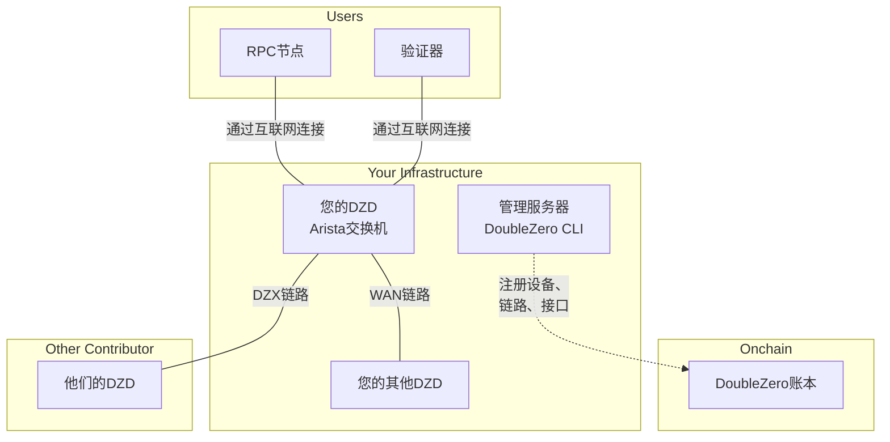
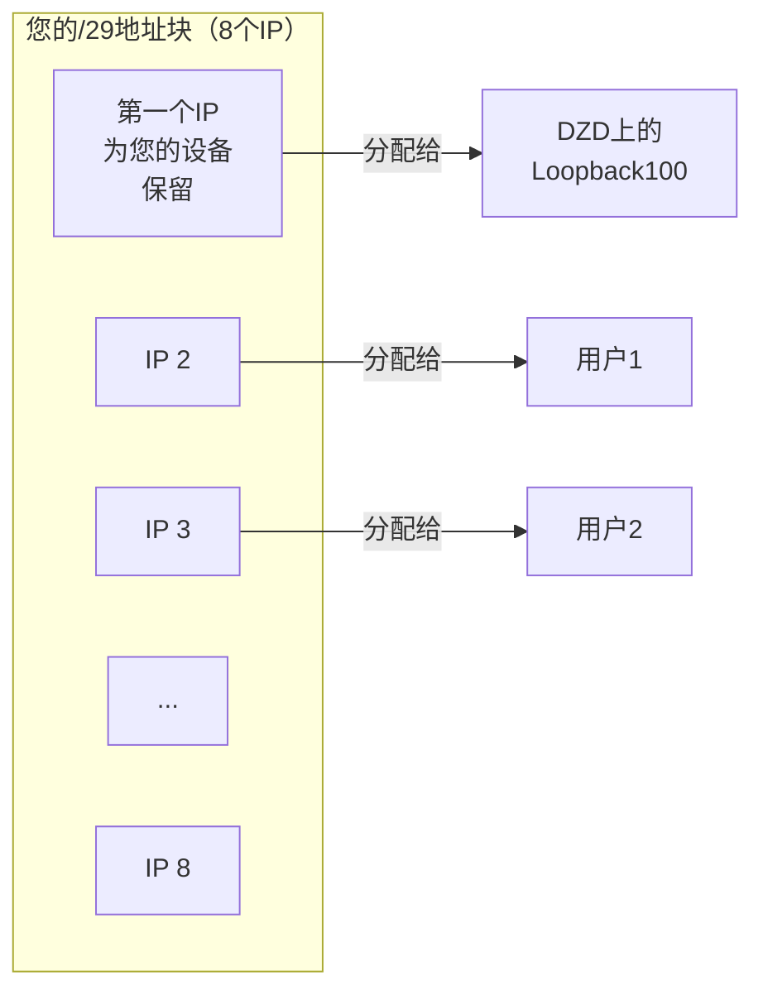
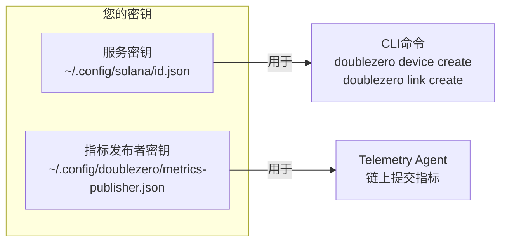
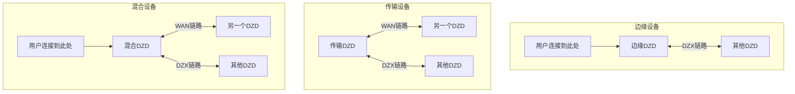
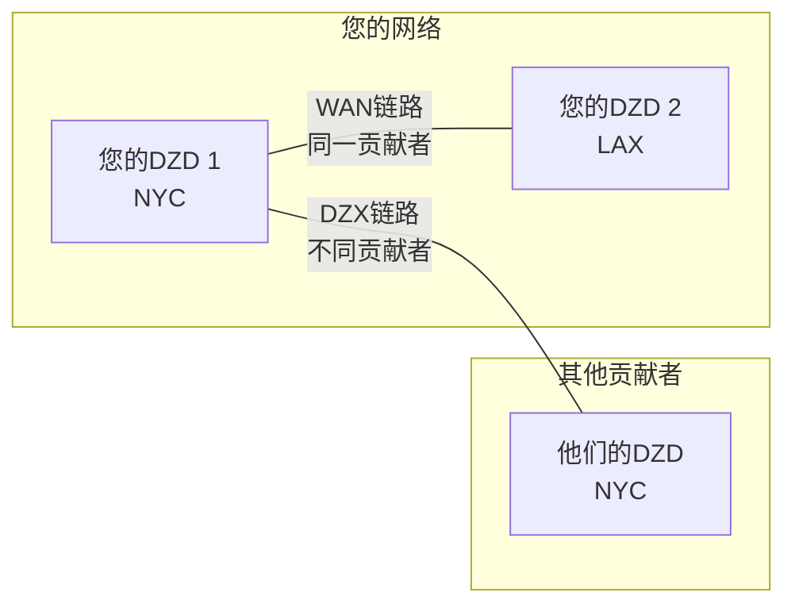
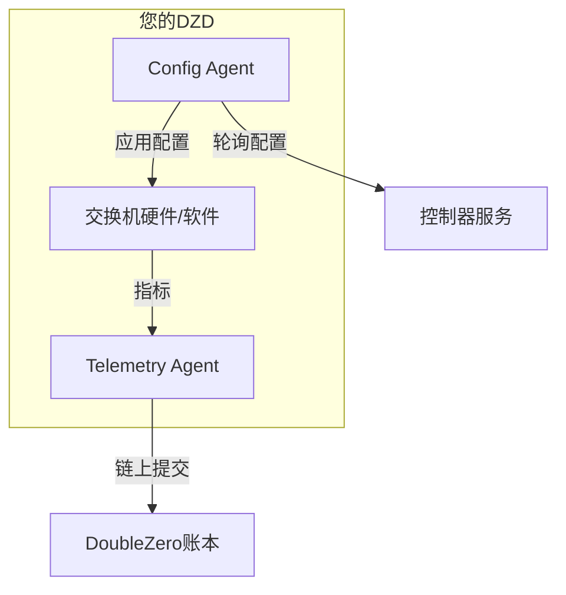
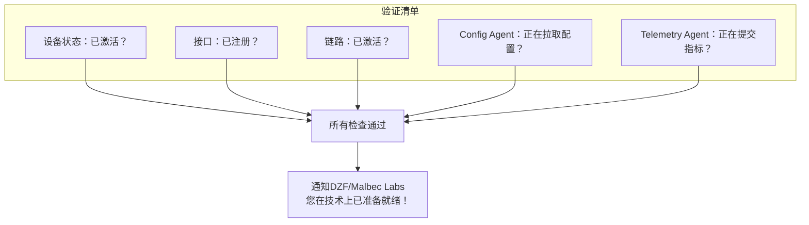

# 设备配置指南

本指南将引导您从头到尾完成DoubleZero设备（DZD）的配置。每个阶段与[入驻清单](contribute-overview.md#onboarding-checklist)相对应。

---

## 整体架构概览

在深入步骤之前，先了解您正在构建的整体架构：



---

## 阶段1：前提条件

在配置设备之前，您需要完成物理硬件的安装并分配一些IP地址。

### 所需条件

| 要求 | 用途 |
|------|------|
| **DZD硬件** | Arista 7280CR3A交换机（参见[硬件规格](contribute.md#hardware-requirements)） |
| **机架空间** | 4U，需要适当的气流 |
| **电源** | 冗余供电，建议约4KW |
| **管理访问** | SSH/控制台访问以配置交换机 |
| **互联网连接** | 用于发布指标和从控制器获取配置 |
| **公共IPv4地址块** | DZ前缀池至少需要/29（参见下方） |

### 安装DoubleZero CLI

DoubleZero CLI（`doublezero`）在整个配置过程中用于注册设备、创建链路和管理您的贡献。应将其安装在**管理服务器或虚拟机**上——而不是DZD交换机本身。交换机只运行Config Agent和Telemetry Agent（在[阶段4](#phase-4-link-establishment-agent-installation)中安装）。

**Ubuntu / Debian：**
```bash
curl -1sLf https://dl.cloudsmith.io/public/malbeclabs/doublezero/setup.deb.sh | sudo -E bash
sudo apt-get install doublezero
```

**Rocky Linux / RHEL：**
```bash
curl -1sLf https://dl.cloudsmith.io/public/malbeclabs/doublezero/setup.rpm.sh | sudo -E bash
sudo yum install doublezero
```

验证守护进程正在运行：
```bash
sudo systemctl status doublezerod
```

### 了解您的DZ前缀

您的DZ前缀是DoubleZero协议管理用于IP分配的公共IP地址块。



**DZ前缀的使用方式：**

- **第一个IP**：为您的设备保留（分配给Loopback100接口）
- **剩余IP**：分配给连接到您DZD的特定用户类型：
    - `IBRLWithAllocatedIP`用户
    - `EdgeFiltering`用户
    - 多播发布者
- **IBRL用户**：不消耗此池中的IP（他们使用自己的公共IP）

!!! warning "DZ前缀规则"
    **您不能将这些地址用于：**

    - 您自己的网络设备
    - DIA接口上的点对点链路
    - 管理接口
    - DZ协议之外的任何基础设施

    **要求：**

    - 必须是**全球可路由（公共）**IPv4地址
    - 私有IP范围（10.x、172.16-31.x、192.168.x）会被智能合约拒绝
    - **最小大小：/29**（8个地址），建议使用更大的前缀（例如/28、/27）
    - 整个地址块必须可用——不要预先分配任何地址

    如果您需要为自己的设备（DIA接口IP、管理等）分配地址，请使用**单独的地址池**。

---

## 阶段2：账户设置

在此阶段，您将创建在网络上标识您和您设备的加密密钥。

### 在哪里运行CLI

!!! warning "请勿在交换机上安装CLI"
    DoubleZero CLI（`doublezero`）应安装在**管理服务器或虚拟机**上，而不是您的Arista交换机上。

    ```mermaid
    flowchart LR
        subgraph "管理服务器/虚拟机"
            CLI[DoubleZero CLI]
            KEYS[您的密钥对]
        end

        subgraph "您的DZD交换机"
            CA[Config Agent]
            TA[Telemetry Agent]
        end

        CLI -->|创建设备、链路| BC[区块链]
        CA -->|拉取配置| CTRL[控制器]
        TA -->|提交指标| BC
    ```

    | 安装在管理服务器上 | 安装在交换机上 |
    |-------------------|--------------|
    | `doublezero` CLI | Config Agent |
    | 您的服务密钥 | Telemetry Agent |
    | 您的指标发布者密钥 | 指标发布者密钥（副本） |

### 什么是密钥？

可以将密钥理解为安全登录凭据：

- **服务密钥**：您的贡献者身份——用于运行CLI命令
- **指标发布者密钥**：您设备用于提交遥测数据的身份

两者都是加密密钥对（您共享的公钥，您保密的私钥）。



### 步骤2.1：生成服务密钥

这是您与DoubleZero交互的主要身份。

```bash
doublezero keygen
```

这将在默认位置创建一个密钥对。输出显示您的**公钥**——这是您将与DZF共享的内容。

### 步骤2.2：生成指标发布者密钥

此密钥由Telemetry Agent用于签署指标提交。

```bash
doublezero keygen -o ~/.config/doublezero/metrics-publisher.json
```

### 步骤2.3：向DZF提交密钥

联系DoubleZero基金会或Malbec Labs并提供：

1. 您的**服务密钥公钥**
2. 您的**GitHub用户名**（用于仓库访问）

他们将：

- 在链上创建您的**贡献者账户**
- 授予对私有**贡献者仓库**的访问权限

### 步骤2.4：验证您的账户

确认后，验证您的贡献者账户是否存在：

```bash
doublezero contributor list
```

您应该在列表中看到您的贡献者代码。

### 步骤2.5：访问贡献者仓库

[malbeclabs/contributors](https://github.com/malbeclabs/contributors) 仓库包含：

- 基础设备配置
- TCAM配置文件
- ACL配置
- 额外的安装说明

请按照其中的说明进行设备特定配置。

---

## 阶段3：设备配置

现在您将在区块链上注册物理设备并配置其接口。

### 了解设备类型



| 类型 | 功能 | 使用时机 |
|------|------|---------|
| **边缘** | 仅接受用户连接 | 单一位置，仅面向用户 |
| **传输** | 在设备之间传输流量 | 骨干连接，无用户 |
| **混合** | 同时支持用户连接和骨干 | 最常见——功能全面 |

### 步骤3.1：查找您的位置和交换中心

在创建设备之前，查找您的数据中心位置和最近交换中心的代码：

```bash
# 列出可用位置（数据中心）
doublezero location list

# 列出可用交换中心（互连点）
doublezero exchange list
```

### 步骤3.2：在链上创建您的设备

在区块链上注册您的设备：

```bash
doublezero device create \
  --code <YOUR_DEVICE_CODE> \
  --contributor <YOUR_CONTRIBUTOR_CODE> \
  --device-type hybrid \
  --location <LOCATION_CODE> \
  --exchange <EXCHANGE_CODE> \
  --public-ip <DEVICE_PUBLIC_IP> \
  --dz-prefixes <YOUR_DZ_PREFIX>
```

**示例：**

```bash
doublezero device create \
  --code nyc-dz001 \
  --contributor acme \
  --device-type hybrid \
  --location EQX-NY5 \
  --exchange nyc \
  --public-ip "203.0.113.10" \
  --dz-prefixes "198.51.100.0/28"
```

**预期输出：**

```
Signature: 4vKz8H...truncated...7xPq2
```

验证您的设备是否已创建：

```bash
doublezero device list | grep nyc-dz001
```

**参数说明：**

| 参数 | 含义 |
|------|------|
| `--code` | 您设备的唯一名称（例如，`nyc-dz001`） |
| `--contributor` | 您的贡献者代码（由DZF提供） |
| `--device-type` | `hybrid`、`transit`或`edge` |
| `--location` | 来自`location list`的数据中心代码 |
| `--exchange` | 来自`exchange list`的最近交换中心代码 |
| `--public-ip` | 用户通过互联网连接到您设备的公共IP |
| `--dz-prefixes` | 分配给用户的IP地址块 |

### 步骤3.3：创建必需的环回接口

每个设备需要两个环回接口用于内部路由：

```bash
# VPNv4环回
doublezero device interface create <DEVICE_CODE> Loopback255 --loopback-type vpnv4

# IPv4环回
doublezero device interface create <DEVICE_CODE> Loopback256 --loopback-type ipv4
```

**预期输出（每个命令）：**

```
Signature: 3mNx9K...truncated...8wRt5
```

### 步骤3.4：创建物理接口

注册您将使用的物理端口：

```bash
# 基础接口
doublezero device interface create <DEVICE_CODE> Ethernet1/1
```

**预期输出：**

```
Signature: 7pQw2R...truncated...4xKm9
```

### 步骤3.5：创建CYOA接口（用于边缘/混合设备）

如果您的设备接受用户连接，您需要一个CYOA（Choose Your Own Adventure）接口。这告诉系统用户如何连接到您。

**CYOA类型说明：**

| 类型 | 通俗解释 | 使用时机 |
|------|---------|---------|
| `gre-over-dia` | 用户通过普通互联网连接 | 最常见——用户通过DIA连接到您的DZD |
| `gre-over-private-peering` | 用户通过私有链路连接 | 用户与您的网络有直接连接 |
| `gre-over-public-peering` | 用户通过IX连接 | 用户在互联网交换中心与您对等 |
| `gre-over-fabric` | 用户在同一本地网络 | 用户在同一数据中心 |
| `gre-over-cable` | 直接电缆连接到用户 | 单个专用用户 |

**示例——标准互联网用户：**

```bash
doublezero device interface create <DEVICE_CODE> Ethernet1/2 \
  --interface-cyoa gre-over-dia \
  --interface-dia dia \
  --bandwidth 10000 \
  --cir 1000 \
  --user-tunnel-endpoint \
  --wait
```

**预期输出：**

```
Signature: 2wLp8N...truncated...5vHt3
```

**参数说明：**

| 参数 | 含义 |
|------|------|
| `--interface-cyoa` | 用户如何连接（参见上表） |
| `--interface-dia` | 如果这是面向互联网的端口，则为`dia` |
| `--bandwidth` | 端口速度（Mbps），10000 = 10Gbps |
| `--cir` | 承诺速率（Mbps），保证带宽 |
| `--user-tunnel-endpoint` | 此端口接受用户隧道 |

### 步骤3.6：验证您的设备

```bash
doublezero device list
```

**示例输出：**

```
 account                                      | code      | contributor | location | exchange | device_type | public_ip    | dz_prefixes     | users | max_users | status    | health  | mgmt_vrf | owner
 7xKm9pQw2R4vHt3...                          | nyc-dz001 | acme        | EQX-NY5  | nyc      | hybrid      | 203.0.113.10 | 198.51.100.0/28 | 0     | 14        | activated | pending |          | 5FMtd5Woq5XAAg54...
```

您的设备应显示状态`activated`。

---

## 阶段4：链路建立与代理安装

链路将您的设备连接到DoubleZero网络的其余部分。

### 了解链路



| 链路类型 | 连接对象 | 接受方式 |
|---------|---------|---------|
| **WAN链路** | 您的两个设备 | 自动（您拥有两端） |
| **DZX链路** | 您的设备与另一个贡献者 | 需要对方接受 |

### 步骤4.1：创建WAN链路（如果您有多个设备）

WAN链路连接您自己的设备：

```bash
doublezero link create wan \
  --code <LINK_CODE> \
  --contributor <YOUR_CONTRIBUTOR> \
  --side-a <DEVICE_1_CODE> \
  --side-a-interface <INTERFACE_ON_DEVICE_1> \
  --side-z <DEVICE_2_CODE> \
  --side-z-interface <INTERFACE_ON_DEVICE_2> \
  --bandwidth 10000 \
  --mtu 9000 \
  --delay-ms 20 \
  --jitter-ms 1
```

**示例：**

```bash
doublezero link create wan \
  --code nyc-lax-wan01 \
  --contributor acme \
  --side-a nyc-dz001 \
  --side-a-interface Ethernet3/1 \
  --side-z lax-dz001 \
  --side-z-interface Ethernet3/1 \
  --bandwidth 10000 \
  --mtu 9000 \
  --delay-ms 65 \
  --jitter-ms 1
```

**预期输出：**

```
Signature: 5tNm7K...truncated...9pRw2
```

### 步骤4.2：创建DZX链路

DZX链路将您的设备直接连接到另一个贡献者的DZD：

```bash
doublezero link create dzx \
  --code <DEVICE_CODE_A:DEVICE_CODE_Z> \
  --contributor <YOUR_CONTRIBUTOR> \
  --side-a <YOUR_DEVICE_CODE> \
  --side-a-interface <YOUR_INTERFACE> \
  --side-z <OTHER_DEVICE_CODE> \
  --bandwidth <BANDWIDTH in Kbps, Mbps, or Gbps> \
  --mtu <MTU> \
  --delay-ms <DELAY> \
  --jitter-ms <JITTER>
```

**预期输出：**

```
Signature: 8mKp3W...truncated...2nRx7
```

创建DZX链路后，另一个贡献者必须接受它：

```bash
# 另一个贡献者运行此命令
doublezero link accept \
  --code <LINK_CODE> \
  --side-z-interface <THEIR_INTERFACE>
```

**预期输出（接受方贡献者）：**

```
Signature: 6vQt9L...truncated...3wPm4
```

### 步骤4.3：验证链路

```bash
doublezero link list
```

**示例输出：**

```
 account                                      | code          | contributor | side_a_name | side_a_iface_name | side_z_name | side_z_iface_name | link_type | bandwidth | mtu  | delay_ms | jitter_ms | delay_override_ms | tunnel_id | tunnel_net      | status    | health  | owner
 8vkYpXaBW8RuknJq...                         | nyc-dz001:lax-dz001 | acme        | nyc-dz001   | Ethernet3/1       | lax-dz001   | Ethernet3/1       | WAN       | 10Gbps    | 9000 | 65.00ms  | 1.00ms    | 0.00ms            | 42        | 172.16.0.84/31  | activated | pending | 5FMtd5Woq5XAAg54...
```

一旦两端都配置完成，链路应显示状态`activated`。

---

### 代理安装

两个软件代理在您的DZD上运行：



| 代理 | 功能 |
|------|------|
| **Config Agent** | 从控制器拉取配置，应用到您的交换机 |
| **Telemetry Agent** | 测量到其他设备的延迟/丢包，链上报告指标 |

### 步骤4.4：安装Config Agent

#### 在交换机上启用API

添加到EOS配置：

```
management api eos-sdk-rpc
    transport grpc eapilocal
        localhost loopback vrf default
        service all
        no disabled
```

!!! note "VRF注意事项"
    如果您的管理VRF名称不同（例如`management`），请将`default`替换为您的管理VRF名称。

#### 下载并安装代理

```bash
# 在交换机上进入bash
switch# bash
$ sudo bash
# cd /mnt/flash
# wget AGENT_DOWNLOAD_URL
# exit
$ exit

# 安装为EOS扩展
switch# copy flash:AGENT_FILENAME extension:
switch# extension AGENT_FILENAME
switch# copy installed-extensions boot-extensions
```

#### 验证扩展

```bash
switch# show extensions
```

状态应为"A, I, B"：

```
Name                                        Version/Release     Status     Extension
------------------------------------------- ------------------- ---------- ---------
AGENT_FILENAME    MAINNET_CLIENT_VERSION/1             A, I, B    1

A: available | NA: not available | I: installed | F: forced | B: install at boot
```

#### 配置并启动代理

添加到EOS配置：

```
daemon doublezero-agent
    exec /usr/local/bin/doublezero-agent -pubkey <YOUR_DEVICE_PUBKEY>
    no shut
```

!!! note "VRF注意事项"
    如果您的管理VRF不是`default`（即命名空间不是`ns-default`），请在exec命令前加上`exec /sbin/ip netns exec ns-<VRF>`。例如，如果您的VRF是`management`：
    ```
    daemon doublezero-agent
        exec /sbin/ip netns exec ns-management /usr/local/bin/doublezero-agent -pubkey <YOUR_DEVICE_PUBKEY>
        no shut
    ```

从`doublezero device list`获取您的设备公钥（`account`列）。

#### 验证是否正在运行

```bash
switch# show agent doublezero-agent logs
```

您应该看到"Starting doublezero-agent"以及成功的控制器连接。

### 步骤4.5：安装Telemetry Agent

#### 将指标发布者密钥复制到设备

```bash
scp ~/.config/doublezero/metrics-publisher.json <SWITCH_IP>:/mnt/flash/metrics-publisher-keypair.json
```

#### 在链上注册指标发布者

```bash
doublezero device update \
  --pubkey <DEVICE_ACCOUNT> \
  --metrics-publisher <METRICS_PUBLISHER_PUBKEY>
```

从您的metrics-publisher.json文件获取公钥。

#### 下载并安装代理

```bash
switch# bash
$ sudo bash
# cd /mnt/flash
# wget TELEMETRY_DOWNLOAD_URL
# exit
$ exit

# 安装为EOS扩展
switch# copy flash:TELEMETRY_FILENAME extension:
switch# extension TELEMETRY_FILENAME
switch# copy installed-extensions boot-extensions
```

#### 验证扩展

```bash
switch# show extensions
```

状态应为"A, I, B"：

```
Name                                        Version/Release     Status     Extension
------------------------------------------- ------------------- ---------- ---------
TELEMETRY_FILENAME    MAINNET_CLIENT_VERSION/1             A, I, B    1

A: available | NA: not available | I: installed | F: forced | B: install at boot
```

#### 配置并启动代理

添加到EOS配置：

```
daemon doublezero-telemetry
    exec /usr/local/bin/doublezero-telemetry --local-device-pubkey <DEVICE_ACCOUNT> --env mainnet --keypair /mnt/flash/metrics-publisher-keypair.json
    no shut
```

!!! note "VRF注意事项"
    如果您的管理VRF不是`default`（即命名空间不是`ns-default`），请在exec命令中添加`--management-namespace ns-<VRF>`。例如，如果您的VRF是`management`：
    ```
    daemon doublezero-telemetry
        exec /usr/local/bin/doublezero-telemetry --management-namespace ns-management --local-device-pubkey <DEVICE_ACCOUNT> --env mainnet --keypair /mnt/flash/metrics-publisher-keypair.json
        no shut
    ```

#### 验证是否正在运行

```bash
switch# show agent doublezero-telemetry logs
```

您应该看到"Starting telemetry collector"和"Starting submission loop"。

---

## 阶段5：链路磨合

!!! warning "所有新链路在承载流量前必须完成磨合"
    新链路必须**至少排水24小时**，然后才能激活用于生产流量。此磨合要求在[RFC12：网络配置](https://github.com/malbeclabs/doublezero/blob/main/rfcs/rfc12-network-provisioning.md)中定义，规定链路就绪前需要约200,000个DZ账本槽位（约20小时）的干净指标。

在代理安装并运行后，在[metrics.doublezero.xyz](https://metrics.doublezero.xyz)上监控您的链路至少连续24小时：

- **"DoubleZero Device-Link Latencies"**仪表板——验证链路上随时间**零丢包**
- **"DoubleZero Network Metrics"**仪表板——验证链路上**零错误**

只有当磨合期显示干净的链路（零丢包和零错误）时，才能解除排水状态。

---

## 阶段6：验证与激活

通过此清单确认一切正常工作。

!!! warning "您的设备初始锁定（`max_users = 0`）"
    创建设备时，`max_users`默认设置为**0**。这意味着还没有用户可以连接到它。这是有意为之——您必须在接受用户流量之前验证一切正常。

    **在将`max_users`设置为0以上之前，您必须：**

    1. 确认所有链路已在[metrics.doublezero.xyz](https://metrics.doublezero.xyz)上完成**24小时磨合**，零丢包/错误
    2. **与DZ/Malbec Labs协调**进行连接测试：
        - 测试用户能否连接到您的设备？
        - 用户是否通过DZ网络接收路由？
        - 用户是否能端到端通过DZ网络路由流量？
    3. 仅在DZ/ML确认测试通过后，将max_users设置为96：

    ```bash
    doublezero device update --pubkey <DEVICE_ACCOUNT> --max-users 96
    ```

### 设备检查

```bash
# 您的设备应显示状态"activated"
doublezero device list | grep <YOUR_DEVICE_CODE>
```

**预期输出：**

```
 7xKm9pQw2R4vHt3... | nyc-dz001 | acme | EQX-NY5 | nyc | hybrid | 203.0.113.10 | 198.51.100.0/28 | 0 | 14 | activated | pending | | 5FMtd5Woq5XAAg54...
```

```bash
# 您的接口应被列出
doublezero device interface list | grep <YOUR_DEVICE_CODE>
```

**预期输出：**

```
 nyc-dz001 | Loopback255 | loopback | vpnv4 | none | none | 0 | 0 | 1500 | static | 0 | 172.16.1.91/32  | 56 | false | activated
 nyc-dz001 | Loopback256 | loopback | ipv4  | none | none | 0 | 0 | 1500 | static | 0 | 172.16.1.100/32 | 0  | false | activated
 nyc-dz001 | Ethernet1/1 | physical | none  | none | none | 0 | 0 | 1500 | static | 0 |                 | 0  | false | activated
```

### 链路检查

```bash
# 链路应显示状态"activated"
doublezero link list | grep <YOUR_DEVICE_CODE>
```

**预期输出：**

```
 8vkYpXaBW8RuknJq... | nyc-lax-wan01 | acme | nyc-dz001 | Ethernet3/1 | lax-dz001 | Ethernet3/1 | WAN | 10Gbps | 9000 | 65.00ms | 1.00ms | 0.00ms | 42 | 172.16.0.84/31 | activated | pending | 5FMtd5Woq5XAAg54...
```

### 代理检查

在交换机上：

```bash
# Config Agent应显示成功的配置拉取
switch# show agent doublezero-agent logs | tail -20

# Telemetry Agent应显示成功的提交
switch# show agent doublezero-telemetry logs | tail -20
```

### 最终验证图



---

## 故障排除

### 设备创建失败

- 验证您的服务密钥已获授权（`doublezero contributor list`）
- 检查位置和交换中心代码是否有效
- 确保DZ前缀是有效的公共IP范围

### 链路卡在"requested"状态

- DZX链路需要另一个贡献者的接受
- 联系他们运行`doublezero link accept`

### Config Agent无法连接

- 验证管理网络有互联网访问
- 检查VRF配置是否与您的设置匹配
- 确保设备公钥正确

### Telemetry Agent未提交

- 验证指标发布者密钥已在链上注册
- 检查密钥文件是否存在于交换机上
- 确保设备账户公钥正确

---

## 后续步骤

- 查阅[运营指南](contribute-operations.md)了解代理升级和链路管理
- 在[词汇表](glossary.md)中查看术语定义
- 如遇问题，请联系DZF/Malbec Labs
