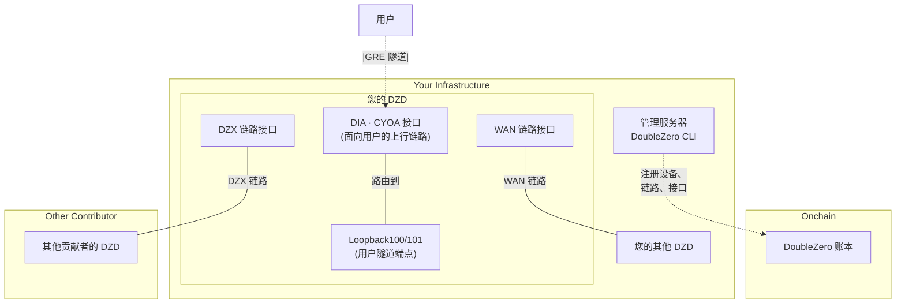
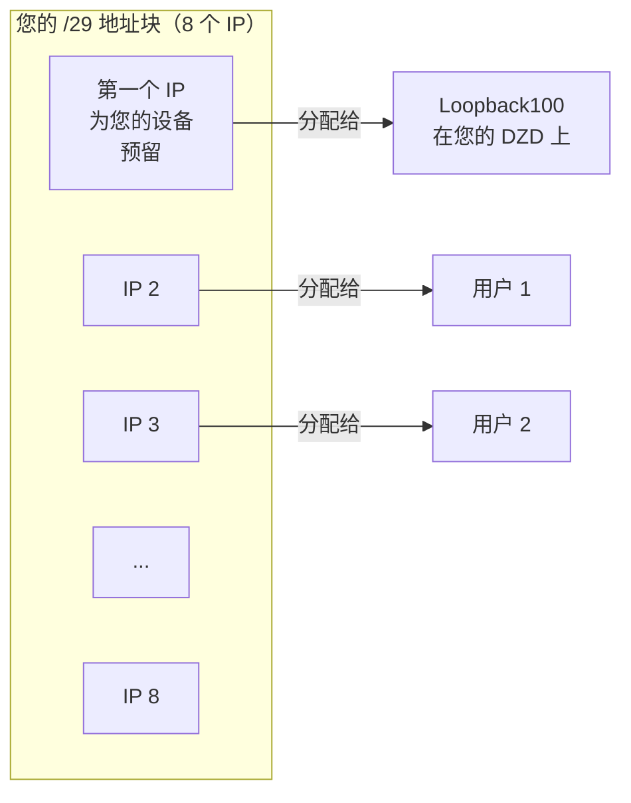
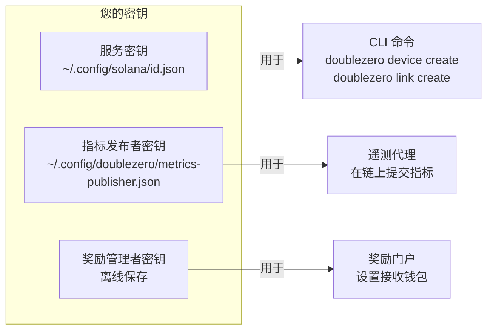
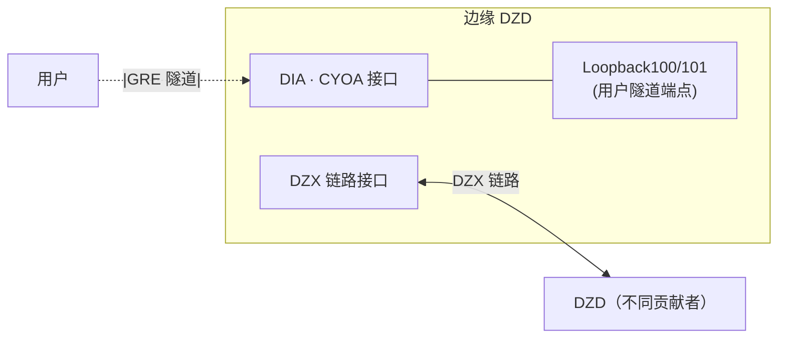
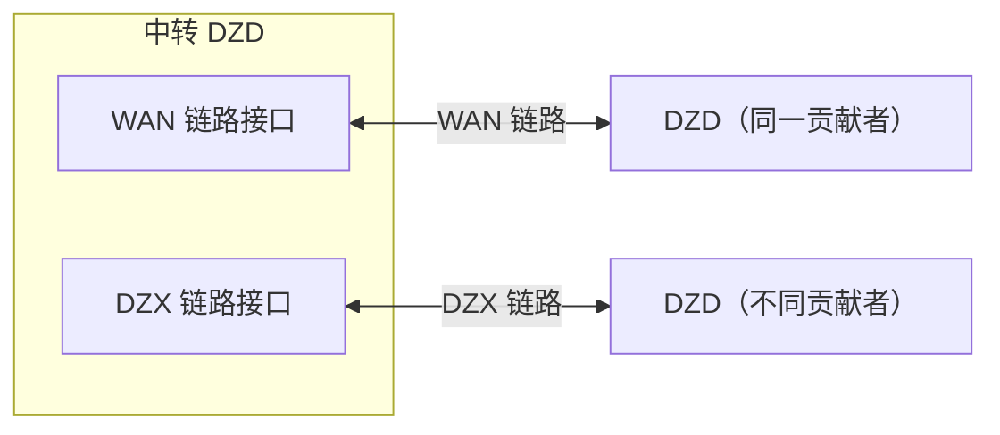
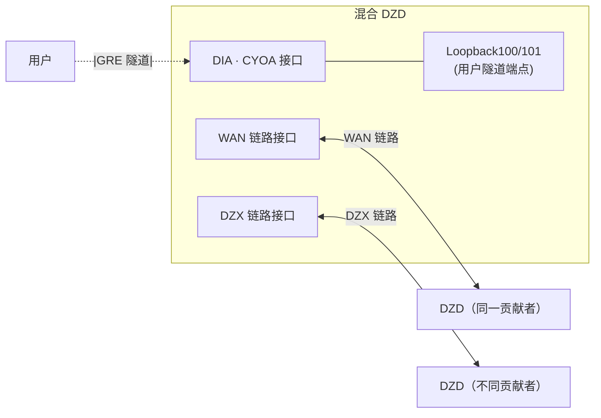

# 设备配置指南

本指南将引导您从头到尾完成 DoubleZero 设备 (DZD) 的配置。每个阶段对应[上线清单](contribute-overview.md#onboarding-checklist)中的步骤。

---

## 整体架构

本指南将引导您在链上注册基础设施，以便 DoubleZero 网络能够通过其路由流量。您的设备注册得越完整，对网络的价值就越大。设备在链上的完整表示有助于更好地进行故障排除、容量规划，并允许控制器做出明智的决策。随着时间推移，目标是让控制器承担更多的配置职责。

### 关键概念

**接口**

DZD 上的接口有多种形式：以太网端口、端口通道（由多个以太网端口组成的 LAG）和环回接口。每个在网络中发挥作用的接口都需要在链上注册并附上适当的标志，以便协议了解其功能。

以太网端口和端口通道可以承担以下角色：

| 标志 | 含义 |
|------|------|
| `--interface-dia dia` | 将该接口标记为直接互联网接入上行链路 |
| `--interface-cyoa <subtype>` | 声明用户通过此接口建立 GRE 隧道的方式（例如通过公共互联网、通过私有对等链路） |
| `--user-tunnel-endpoint true` | 此接口携带用户终止 GRE 隧道的公共 IP |

用于 WAN 或 DZX 链路的接口不需要特定标志，它们仅注册带宽，然后在创建链路时被引用。

环回接口有多种用途：

| 环回接口 | 含义 |
|----------|------|
| **Loopback100 / 101** | 携带用户终止 GRE 隧道的公共 IP。使用 `--user-tunnel-endpoint true` 注册。 |
| **Loopback255** (`vpnv4`) | 注册后控制器可分配 IP，用于 BGP 路由器 ID、VPN-IPv4 对等（单播）、IS-IS 标识和段路由 |
| **Loopback256** (`ipv4`) | 注册后控制器可分配 IP，用于 IPv4 BGP 对等（组播）和 MSDP 会话 |

**链路**

链路与接口分开注册，且接口必须先在链上存在，链路才能引用它们。当您创建 WAN 或 DZX 链路时，需要指定一个已注册的接口作为链路的物理端点。并非所有接口都关联到链路：DIA、CYOA 和环回接口不连接到链路。

| 术语 | 含义 |
|------|------|
| **WAN 链路** | 您自己的两个 DZD 之间的链路 |
| **DZX 链路** | 您的 DZD 与另一个贡献者的 DZD 之间的链路 |

### 架构概览


```mermaid
flowchart TB
    subgraph Onchain
        SC[DoubleZero 账本]
    end

    subgraph Your Infrastructure
        MGMT[管理服务器<br/>DoubleZero CLI]
        subgraph DZD[您的 DZD]
            CYOA["DIA · CYOA 接口<br/>(面向用户的上行链路)"]
            WAN_INTF["WAN 链路接口"]
            DZX_INTF["DZX 链路接口"]
            LO100["Loopback100/101<br/>(用户隧道端点)"]
        end
        DZD2[您的其他 DZD]
    end

    subgraph Other Contributor
        OtherDZD[其他贡献者的 DZD]
    end

    USERS["用户"]

    MGMT -.->|注册设备、<br/>链路、接口| SC
    WAN_INTF ---|WAN 链路| DZD2
    DZX_INTF ---|DZX 链路| OtherDZD
    USERS -.|GRE 隧道|.-> CYOA
    CYOA ---|路由到| LO100
```

---

## 阶段 1：前提条件

在配置设备之前，您需要完成物理硬件的安装并分配一些 IP 地址。

### 所需条件

| 要求 | 原因 |
|------|------|
| **DZD 硬件** | Arista 7280CR3A 交换机（参见[硬件规格](contribute.md#hardware-requirements)） |
| **机架空间** | 每个 DZD 预留 2U（目前使用 1U），需确保良好的气流。参见[机架与电源](contribute.md#rack-power-requirements) |
| **电源** | 两路独立供电，每路均能独立承担全部负载。参见[机架与电源](contribute.md#rack-power-requirements) |
| **管理访问** | 通过 SSH/控制台访问以配置交换机 |
| **互联网连接** | 用于发布指标和从控制器获取配置 |
| **公共 IPv4 地址块** | DZ 前缀池最少需要 /29（见下文） |

### 安装 DoubleZero CLI

DoubleZero CLI (`doublezero`) 在整个配置过程中用于注册设备、创建链路和管理您的贡献。它应安装在**管理服务器或虚拟机**上 — 而非 DZD 交换机本身。交换机仅运行配置代理和遥测代理（在[阶段 4](#phase-4-link-establishment-agent-installation) 中安装）。

**Ubuntu / Debian：**
```bash
curl -1sLf https://dl.cloudsmith.io/public/malbeclabs/doublezero/setup.deb.sh | sudo -E bash
sudo apt-get install doublezero
```

**Rocky Linux / RHEL：**
```bash
curl -1sLf https://dl.cloudsmith.io/public/malbeclabs/doublezero/setup.rpm.sh | sudo -E bash
sudo yum install doublezero
```

验证守护进程是否正在运行：
```bash
sudo systemctl status doublezerod
```

### 了解您的 DZ 前缀

您的 DZ 前缀是一组由 DoubleZero 协议管理的公共 IP 地址块，用于 IP 分配。


```mermaid
flowchart LR
    subgraph "您的 /29 地址块（8 个 IP）"
        IP1["第一个 IP<br/>为您的设备<br/>预留"]
        IP2["IP 2"]
        IP3["IP 3"]
        IP4["..."]
        IP8["IP 8"]
    end

    IP1 -->|分配给| LO[Loopback100<br/>在您的 DZD 上]
    IP2 -->|分配给| U1[用户 1]
    IP3 -->|分配给| U2[用户 2]
```

**DZ 前缀的使用方式：**

- **第一个 IP**：为您的设备预留（分配给 Loopback100 接口）
- **剩余 IP**：分配给连接到您 DZD 的特定用户类型：
    - `IBRLWithAllocatedIP` 用户
    - `EdgeFiltering` 用户（未来用例）
- **IBRL 用户**：不消耗此池中的地址（他们使用自己的公共 IP）

!!! warning "DZ 前缀规则"
    **您不能将这些地址用于：**

    - 您自己的网络设备
    - DIA 接口上的点对点链路
    - 管理接口
    - DZ 协议之外的任何基础设施

    **要求：**

    - 必须是**全局可路由（公共）**的 IPv4 地址
    - 私有 IP 范围（10.x、172.16-31.x、192.168.x）将被智能合约拒绝
    - **最小大小：/29**（8 个地址），建议使用更大的前缀（如 /28、/27）
    - 整个地址块必须可用 — 不要预先分配任何地址

    如果您需要为自己的设备分配地址（DIA 接口 IP、管理等），请使用**单独的地址池**。

---

## 阶段 2：账户设置

在此阶段，您将创建用于在网络上标识您和您设备的加密密钥，并设置奖励管理。

这些步骤按特定顺序执行是有原因的：首先获取仓库访问权限，因为仓库包含后续步骤的说明，然后是密钥，再是奖励。某些步骤需要 DZF 先行操作才能继续，以下每个步骤都会说明这一点。

### CLI 运行位置

!!! warning "不要在交换机上安装 CLI"
    DoubleZero CLI (`doublezero`) 应安装在**管理服务器或虚拟机**上，而非 Arista 交换机上。

    ```mermaid
    flowchart LR
        subgraph "管理服务器/虚拟机"
            CLI[DoubleZero CLI]
            KEYS[您的密钥对]
        end

        subgraph "您的 DZD 交换机"
            CA[配置代理]
            TA[遥测代理]
        end

        CLI -->|创建设备、链路| BC[区块链]
        CA -->|拉取配置| CTRL[控制器]
        TA -->|提交指标| BC
    ```

    | 安装在管理服务器上 | 安装在交换机上 |
    |--------------------|----------------|
    | `doublezero` CLI | 配置代理 |
    | 您的服务密钥对 | 遥测代理 |
    | 您的指标发布者密钥对 | 指标发布者密钥对（副本） |

### 什么是密钥？

可以将密钥理解为安全登录凭据：

- **服务密钥**：您的贡献者身份 - 用于运行 CLI 命令
- **指标发布者密钥**：您设备提交遥测数据的身份标识
- **奖励管理者密钥**：控制哪些钱包接收您的奖励 - 参见贡献者仓库中的[奖励管理](https://github.com/malbeclabs/contributors#rewards-management)

这三个都是加密密钥对（一个公开共享的公钥和一个保密的私钥）。


```mermaid
flowchart LR
    subgraph "您的密钥"
        SK[服务密钥<br/>~/.config/solana/id.json]
        MK[指标发布者密钥<br/>~/.config/doublezero/metrics-publisher.json]
        RK[奖励管理者密钥<br/>离线保存]
    end

    SK -->|用于| CLI[CLI 命令<br/>doublezero device create<br/>doublezero link create]
    MK -->|用于| TEL[遥测代理<br/>在链上提交指标]
    RK -->|用于| REW[奖励门户<br/>设置接收钱包]
```

!!! note "将奖励管理者密钥单独保存"
    服务密钥和指标发布者密钥存储在您的管理服务器和交换机上。奖励管理者密钥控制您的资金流向，因此请将其保存在这些机器之外。仅在更改接收钱包时才需要使用它。

### 步骤 2.1：申请贡献者仓库访问权限

联系 DoubleZero Foundation 或 Malbec Labs，并提供您的 **GitHub 用户名**。

他们会授予您访问私有 [malbeclabs/contributors](https://github.com/malbeclabs/contributors) 仓库的权限。请首先完成此步骤：该仓库包含基础设备配置、TCAM 和 ACL 配置文件，以及您在后续步骤中需要的奖励管理说明。

### 步骤 2.2：生成您的服务密钥

这是您与 DoubleZero 交互的主要身份标识。

```bash
doublezero keygen
```

这将在默认位置创建一个密钥对。输出会显示您的**公钥** - 这是您将与 DZF 共享的内容。

### 步骤 2.3：生成您的指标发布者密钥

此密钥由遥测代理用于签署指标提交。

```bash
doublezero keygen -o ~/.config/doublezero/metrics-publisher.json
```

### 步骤 2.4：向 DZF 提交您的服务密钥

将您的**服务密钥公钥**发送给 DZF。

他们会在链上创建您的**贡献者账户**，并在完成后确认。

!!! danger "仅限公钥"
    切勿向任何人（包括 DZF）发送私钥或密钥对文件。只需要公钥即可。

### 步骤 2.5：验证您的账户

确认后，验证您的贡献者账户是否存在：

```bash
doublezero contributor list
```

您应该在列表中看到您的贡献者代码。

### 步骤 2.6：设置奖励管理

奖励管理决定哪些钱包接收您的贡献所赚取的 [2Z](glossary.md#2z-token)，以及各自的比例。

请按照贡献者仓库中的[奖励管理](https://github.com/malbeclabs/contributors#rewards-management)说明操作，您在步骤 2.1 中已获得了该仓库的访问权限。

!!! note "这不会阻碍您的其余设置"
    您可以在未完成此步骤的情况下配置设备、建立链路并开始承载流量，因此请将以下阶段视为独立于此步骤。

---

## 阶段 3：设备配置

现在您将在区块链上注册您的物理设备并配置其接口。

### 了解设备类型

**边缘（Edge）** — 仅接受用户连接


```mermaid
flowchart LR
    subgraph EDZD[边缘 DZD]
        E_CYOA["DIA · CYOA 接口"]
        E_TUN["Loopback100/101
        (用户隧道端点)"]
        E_DZX["DZX 链路接口"]
        E_CYOA --- E_TUN
    end
    EU["用户"] -.|GRE 隧道|.-> E_CYOA
    E_DZX <-->|DZX 链路| ED["DZD（不同贡献者）"]
```

**中转（Transit）** — 在设备之间传输流量，无用户连接


```mermaid
flowchart LR
    subgraph TDZD[中转 DZD]
        T_WAN["WAN 链路接口"]
        T_DZX["DZX 链路接口"]
    end
    T_WAN <-->|WAN 链路| T2["DZD（同一贡献者）"]
    T_DZX <-->|DZX 链路| TD["DZD（不同贡献者）"]
```

**混合（Hybrid）** — 用户连接和骨干网，最常见


```mermaid
flowchart LR
    subgraph HDZD[混合 DZD]
        H_CYOA["DIA · CYOA 接口"]
        H_TUN["Loopback100/101
        (用户隧道端点)"]
        H_WAN["WAN 链路接口"]
        H_DZX["DZX 链路接口"]
        H_CYOA --- H_TUN
    end
    HU["用户"] -.|GRE 隧道|.-> H_CYOA
    H_WAN <-->|WAN 链路| H2["DZD（同一贡献者）"]
    H_DZX <-->|DZX 链路| HD["DZD（不同贡献者）"]
```

| 类型 | 功能 | 使用场景 |
|------|------|----------|
| **边缘** | 仅接受用户连接 | 单一位置，仅面向用户 |
| **中转** | 在设备之间传输流量 | 骨干网连接，无用户 |
| **混合** | 用户连接和骨干网兼备 | 最常见 - 功能全面 |

### 步骤 3.1：查找您的位置和交换节点

在创建设备之前，查找您数据中心位置和最近交换节点的代码：

```bash
# 列出可用位置（数据中心）
doublezero location list

# 列出可用交换节点（互联点）
doublezero exchange list
```

### 步骤 3.2：在链上创建您的设备

在区块链上注册您的设备：

```bash
doublezero device create \
  --code <YOUR_DEVICE_CODE> \
  --contributor <YOUR_CONTRIBUTOR_CODE> \
  --device-type hybrid \
  --location <LOCATION_CODE> \
  --exchange <EXCHANGE_CODE> \
  --public-ip <DEVICE_PUBLIC_IP> \
  --dz-prefixes <YOUR_DZ_PREFIX>
```

**示例：**

```bash
doublezero device create \
  --code nyc-dz001 \
  --contributor acme \
  --device-type hybrid \
  --location EQX-NY5 \
  --exchange nyc \
  --public-ip "203.0.113.10" \
  --dz-prefixes "198.51.100.0/28"
```

**预期输出：**

```
Signature: 4vKz8H...truncated...7xPq2
```

验证您的设备是否已创建：

```bash
doublezero device list | grep nyc-dz001
```

**参数说明：**

| 参数 | 含义 |
|------|------|
| `--code` | 设备的唯一名称（例如 `nyc-dz001`） |
| `--contributor` | 您的贡献者代码（由 DZF 提供） |
| `--device-type` | `hybrid`、`transit` 或 `edge` |
| `--location` | 从 `location list` 获取的数据中心代码 |
| `--exchange` | 从 `exchange list` 获取的最近交换节点代码 |
| `--public-ip` | 用户通过互联网连接到您设备的公共 IP |
| `--dz-prefixes` | 为用户分配的 IP 地址块 |

### 步骤 3.3：创建必需的环回接口

每个设备需要两个用于内部路由的环回接口：

```bash
# VPNv4 环回
doublezero device interface create <DEVICE_CODE> Loopback255 --loopback-type vpnv4

# IPv4 环回
doublezero device interface create <DEVICE_CODE> Loopback256 --loopback-type ipv4
```

**预期输出（每条命令）：**

```
Signature: 3mNx9K...truncated...8wRt5
```

### 步骤 3.4：创建物理接口

注册将用于 WAN 或 DZX 链路的物理接口。这些接口必须先在链上存在，然后才能创建引用它们的链路。在此步骤中，您只需注册接口及其带宽，链路将在后续步骤中创建。

```bash
doublezero device interface create <DEVICE_CODE> <INTERFACE_NAME> \
  --bandwidth <PORT_SPEED>
```

**示例：**

```bash
doublezero device interface create nyc-dz001 Ethernet1/1 \
  --bandwidth 10Gbps
```

**预期输出：**

```
Signature: 7pQw2R...truncated...4xKm9
```

对每个将用作 WAN 或 DZX 链路端点的接口重复此操作。CYOA 和 DIA 接口将在下一步骤中单独注册。

### 步骤 3.5：创建 CYOA 接口（适用于边缘/混合设备）

混合和边缘 DZD 需要**两个公共 IP 地址**，供用户终止其 GRE 隧道。用户可能通过单播、组播或两者同时连接，哪个 IP 用于哪个用途会按用户轮换。

两个 IP 都必须使用 `--user-tunnel-endpoint true` 注册，可以在物理接口或环回接口上。这包括您在创建设备时提供的 IP，该 IP 仍需在此处显式注册。

如果您的 IP 资源有限，可以使用 DZ 前缀的第一个 `/32` 作为两个 IP 之一。

#### CYOA 和 DIA

| 类型 | 标志 | 用途 |
|------|------|------|
| DIA | `--interface-dia dia` | 将端口标记为直接互联网接入 |
| CYOA | `--interface-cyoa <subtype>` | 声明用户如何通过 GRE 隧道连接到您的设备 |

CYOA 标志始终设置在**物理接口**（以太网端口或端口通道）上。绝不在环回接口上设置。

| CYOA 子类型 | 使用场景 |
|-------------|----------|
| `gre-over-dia` | 用户通过公共互联网连接。最常见。 |
| `gre-over-private-peering` | 用户通过直连交叉连接或私有线路连接 |
| `gre-over-public-peering` | 用户在互联网交换点 (IX) 与您对等 |
| `gre-over-fabric` | 用户在同一机房，通过本地交换网络连接 |
| `gre-over-cable` | 直接电缆连接到单个专用用户 |

#### 场景 A：单物理接口

一条到 ISP 的物理上行链路。Ethernet1/1 是 CYOA 和 DIA 接口，携带两个公共 IP 中的一个。Loopback100 携带第二个公共 IP。


```mermaid
flowchart LR
    USERS(["终端用户"])

    subgraph DZD["DZD"]
        E1["Eth1/1
        203.0.113.1/30
        CYOA · DIA · 用户隧道端点"]
        LO["Loopback100
        198.51.100.1/32\n        用户隧道端点"]
        E1 --- LO
    end

    ISP["ISP 路由器
    203.0.113.2/30"]

    ISP -- "10GbE" --- E1
    USERS -. "GRE 隧道" .-> E1
    USERS -. "GRE 隧道" .-> LO
```

| 接口 | `--interface-cyoa` | `--interface-dia` | `--ip-net` | `--bandwidth` | `--cir` | `--routing-mode` | `--user-tunnel-endpoint` |
|------|-------------------|------------------|------------|---------------|---------|-----------------|--------------------------|
| Ethernet1/1 | `gre-over-dia` | `dia` | 贡献者分配的 IP/子网 | 端口速率 | 承诺速率 | `bgp` 或 `static` | `true` |
| Loopback100 | — | — | 您的公共 /32 | `0bps` | — | — | `true` |

基于场景 A 执行的命令示例：
```bash
doublezero device interface create mydzd-nyc01 Ethernet1/1 \
  --interface-cyoa gre-over-dia \
  --interface-dia dia \
  --ip-net 203.0.113.1/30 \
  --bandwidth 10Gbps \
  --cir 1Gbps \
  --routing-mode bgp \
  --user-tunnel-endpoint true

doublezero device interface create mydzd-nyc01 Loopback100 \
  --ip-net 198.51.100.1/32 \
  --bandwidth 0bps \
  --user-tunnel-endpoint true
```

#### 场景 B：端口通道（LAG）

DZD 通过带有 IP 的端口通道连接到上游设备。端口通道携带一个公共 IP，是 CYOA 端点。Loopback100 携带第二个公共 IP。


```mermaid
flowchart LR
    USERS(["终端用户"])

    subgraph SW["上游路由器 / 交换机"]
        SWPC(["bond0
        203.0.113.2/30"])
    end

    subgraph DZD["DZD"]
        subgraph PC["Port-Channel1 · 203.0.113.1/30 · CYOA · DIA · 用户隧道端点"]
            E1["Eth1/1"]
            E2["Eth2/1"]
        end
        LO["Loopback100
        198.51.100.1/32\n        用户隧道端点"]
        PC --- LO
    end

    SWPC -- "2x 10GbE" --- PC
    USERS -. "GRE 隧道" .-> PC
    USERS -. "GRE 隧道" .-> LO
```

| 接口 | `--interface-cyoa` | `--interface-dia` | `--ip-net` | `--bandwidth` | `--cir` | `--routing-mode` | `--user-tunnel-endpoint` |
|------|-------------------|------------------|------------|---------------|---------|-----------------|--------------------------|
| Port-Channel1 | `gre-over-dia` | `dia` | 贡献者分配的 IP/子网 | LAG 组合速率 | 承诺速率 | `bgp` 或 `static` | `true` |
| Loopback100 | — | — | 您的公共 /32 | `0bps` | — | — | `true` |

基于场景 B 执行的命令示例：
```bash
doublezero device interface create mydzd-fra01 Port-Channel1 \
  --interface-cyoa gre-over-dia \
  --interface-dia dia \
  --ip-net 203.0.113.1/30 \
  --bandwidth 20Gbps \
  --cir 2Gbps \
  --routing-mode bgp \
  --user-tunnel-endpoint true

doublezero device interface create mydzd-fra01 Loopback100 \
  --ip-net 198.51.100.1/32 \
  --bandwidth 0bps \
  --user-tunnel-endpoint true
```


#### 场景 C：双物理上行链路连接到不同路由器

每个物理接口连接到不同的上游路由器。两个公共 IP 分别位于 Loopback100 和 Loopback101 上，均注册为用户隧道端点。

```mermaid
flowchart LR
    USERS(["终端用户"])

    RA["路由器 A
    203.0.113.2/30"]
    RB["路由器 B
    203.0.113.6/30"]

    subgraph DZD["DZD"]
        E1["Eth1/1
        203.0.113.1/30
        CYOA · DIA"]
        E2["Eth2/1
        203.0.113.5/30
        CYOA · DIA"]
        LO0["Loopback100
        198.51.100.1/32\n        用户隧道端点"]
        LO1["Loopback101
        198.51.100.2/32\n        用户隧道端点"]
        E1 --> LO0
        E2 --> LO1
    end

    RA -- "10Gb