# 设备配置指南

本指南将引导您从头到尾完成 DoubleZero 设备 (DZD) 的配置。每个阶段对应[上线检查清单](contribute-overview.md#onboarding-checklist)中的相应步骤。

---

## 整体架构概览

本指南将引导您在链上注册基础设施，使 DoubleZero 网络能够通过它路由流量。设备注册得越完整，对网络的价值就越大。完整的链上设备表示有助于更好地进行故障排除、容量规划，并使控制器能够做出明智的决策。随着时间推移，目标是让控制器承担更多的配置职责。

### 核心概念

**接口**

DZD 上的接口有多种形式：以太网端口、端口通道（由多个以太网端口组成的 LAG）和环回接口。每个在网络中发挥作用的接口都需要在链上注册并设置适当的标志，以便协议了解其功能。

以太网端口和端口通道可以承担以下角色：

| 标志 | 含义 |
|------|------|
| `--interface-dia dia` | 将接口标记为直接互联网接入上行链路 |
| `--interface-cyoa <subtype>` | 声明用户如何通过此接口建立 GRE 隧道（例如通过公共互联网、通过私有对等链路） |
| `--user-tunnel-endpoint true` | 此接口携带用户终止 GRE 隧道的公共 IP |

用于 WAN 或 DZX 链路的接口不携带特定标志，它们仅注册带宽，然后在创建链路时被引用。

环回接口有多种用途：

| 环回接口 | 含义 |
|----------|------|
| **Loopback100 / 101** | 携带用户终止 GRE 隧道的公共 IP。使用 `--user-tunnel-endpoint true` 注册。 |
| **Loopback255** (`vpnv4`) | 注册后，控制器可以分配用于 BGP 路由器 ID、VPN-IPv4 对等（单播）、IS-IS 标识和段路由的 IP |
| **Loopback256** (`ipv4`) | 注册后，控制器可以分配用于 IPv4 BGP 对等（组播）和 MSDP 会话的 IP |

**链路**

链路与接口分开注册，接口必须先在链上存在，链路才能引用它们。创建 WAN 或 DZX 链路时，需要指定一个已注册的接口作为链路的物理端点。并非所有接口都绑定到链路：DIA、CYOA 和环回接口不连接到链路。

| 术语 | 含义 |
|------|------|
| **WAN 链路** | 您自己的两个 DZD 之间的链路 |
| **DZX 链路** | 您的 DZD 与另一个贡献者的 DZD 之间的链路 |

### 架构概览

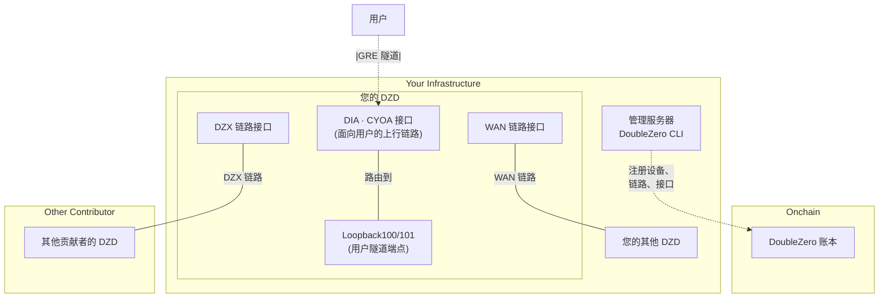
```mermaid
flowchart TB
    subgraph Onchain
        SC[DoubleZero 账本]
    end

    subgraph Your Infrastructure
        MGMT[管理服务器<br/>DoubleZero CLI]
        subgraph DZD[您的 DZD]
            CYOA["DIA · CYOA 接口<br/>(面向用户的上行链路)"]
            WAN_INTF["WAN 链路接口"]
            DZX_INTF["DZX 链路接口"]
            LO100["Loopback100/101<br/>(用户隧道端点)"]
        end
        DZD2[您的其他 DZD]
    end

    subgraph Other Contributor
        OtherDZD[其他贡献者的 DZD]
    end

    USERS["用户"]

    MGMT -.->|注册设备、<br/>链路、接口| SC
    WAN_INTF ---|WAN 链路| DZD2
    DZX_INTF ---|DZX 链路| OtherDZD
    USERS -.|GRE 隧道|.-> CYOA
    CYOA ---|路由到| LO100
```

---

## 阶段 1：前提条件

在配置设备之前，您需要完成物理硬件的设置和一些 IP 地址的分配。

### 所需条件

| 需求 | 原因 |
|------|------|
| **DZD 硬件** | Arista 7280CR3A 交换机（参见[硬件规格](contribute.md#hardware-requirements)） |
| **机架空间** | 4U，具有适当的气流 |
| **电源** | 冗余供电，建议约 4KW |
| **管理访问** | SSH/控制台访问以配置交换机 |
| **互联网连接** | 用于发布指标和从控制器获取配置 |
| **公共 IPv4 地址块** | DZ 前缀池最少需要 /29（见下文） |

### 安装 DoubleZero CLI

DoubleZero CLI (`doublezero`) 在整个配置过程中用于注册设备、创建链路和管理您的贡献。它应安装在**管理服务器或虚拟机**上——而非 DZD 交换机本身。交换机仅运行配置代理和遥测代理（在[阶段 4](#phase-4-link-establishment-agent-installation)中安装）。

**Ubuntu / Debian：**
```bash
curl -1sLf https://dl.cloudsmith.io/public/malbeclabs/doublezero/setup.deb.sh | sudo -E bash
sudo apt-get install doublezero
```

**Rocky Linux / RHEL：**
```bash
curl -1sLf https://dl.cloudsmith.io/public/malbeclabs/doublezero/setup.rpm.sh | sudo -E bash
sudo yum install doublezero
```

验证守护进程是否正在运行：
```bash
sudo systemctl status doublezerod
```

### 了解您的 DZ 前缀

您的 DZ 前缀是 DoubleZero 协议管理的一组公共 IP 地址块，用于 IP 分配。

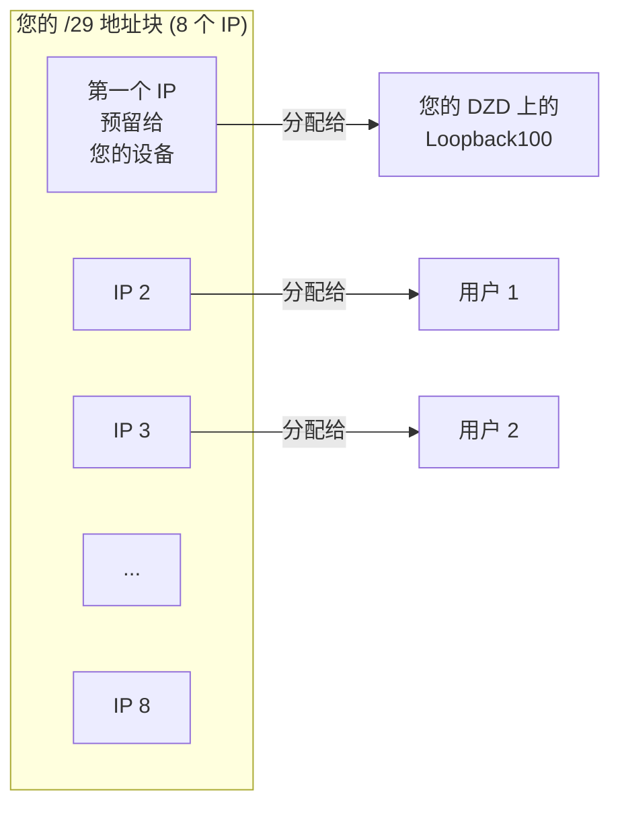
```mermaid
flowchart LR
    subgraph "您的 /29 地址块 (8 个 IP)"
        IP1["第一个 IP<br/>预留给<br/>您的设备"]
        IP2["IP 2"]
        IP3["IP 3"]
        IP4["..."]
        IP8["IP 8"]
    end

    IP1 -->|分配给| LO[您的 DZD 上的<br/>Loopback100]
    IP2 -->|分配给| U1[用户 1]
    IP3 -->|分配给| U2[用户 2]
```

**DZ 前缀的使用方式：**

- **第一个 IP**：预留给您的设备（分配给 Loopback100 接口）
- **剩余 IP**：分配给连接到您的 DZD 的特定用户类型：
    - `IBRLWithAllocatedIP` 用户
    - `EdgeFiltering` 用户（未来用例）
- **IBRL 用户**：不会消耗此地址池中的地址（他们使用自己的公共 IP）

!!! warning "DZ 前缀规则"
    **您不能将这些地址用于：**

    - 您自己的网络设备
    - DIA 接口上的点对点链路
    - 管理接口
    - DZ 协议之外的任何基础设施

    **要求：**

    - 必须是**全球可路由的（公共）** IPv4 地址
    - 私有 IP 范围（10.x、172.16-31.x、192.168.x）将被智能合约拒绝
    - **最小大小：/29**（8 个地址），建议使用更大的前缀（例如 /28、/27）
    - 整个地址块必须可用——不要预先分配任何地址

    如果您需要为自己的设备使用地址（DIA 接口 IP、管理等），请使用**单独的地址池**。

---

## 阶段 2：账户设置

在此阶段，您将创建用于在网络上识别您和您的设备的加密密钥。

### CLI 运行位置

!!! warning "不要在交换机上安装 CLI"
    DoubleZero CLI (`doublezero`) 应安装在**管理服务器或虚拟机**上，而不是您的 Arista 交换机上。

    ```mermaid
    flowchart LR
        subgraph "管理服务器/虚拟机"
            CLI[DoubleZero CLI]
            KEYS[您的密钥对]
        end

        subgraph "您的 DZD 交换机"
            CA[配置代理]
            TA[遥测代理]
        end

        CLI -->|创建设备、链路| BC[区块链]
        CA -->|拉取配置| CTRL[控制器]
        TA -->|提交指标| BC
    ```

    | 安装在管理服务器上 | 安装在交换机上 |
    |--------------------|----------------|
    | `doublezero` CLI | 配置代理 |
    | 您的服务密钥对 | 遥测代理 |
    | 您的指标发布者密钥对 | 指标发布者密钥对（副本） |

### 什么是密钥？

将密钥视为安全的登录凭据：

- **服务密钥**：您的贡献者身份——用于运行 CLI 命令
- **指标发布者密钥**：您的设备提交遥测数据的身份

两者都是加密密钥对（一个您分享的公钥和一个您保密的私钥）。

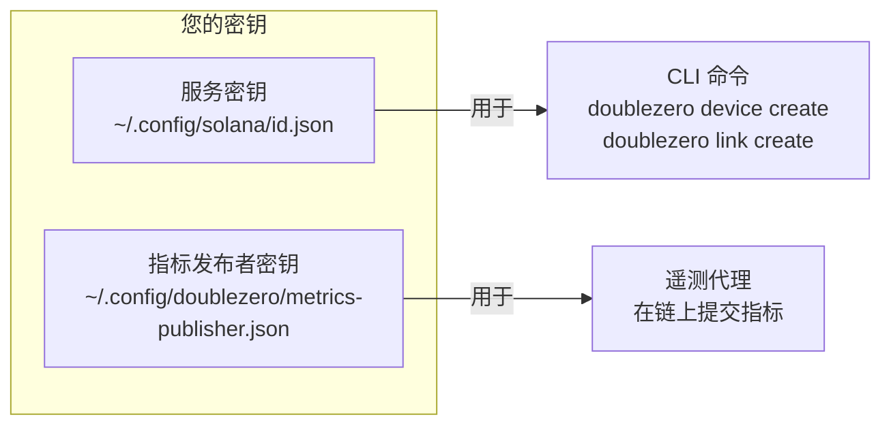
```mermaid
flowchart LR
    subgraph "您的密钥"
        SK[服务密钥<br/>~/.config/solana/id.json]
        MK[指标发布者密钥<br/>~/.config/doublezero/metrics-publisher.json]
    end

    SK -->|用于| CLI[CLI 命令<br/>doublezero device create<br/>doublezero link create]
    MK -->|用于| TEL[遥测代理<br/>在链上提交指标]
```

### 步骤 2.1：生成服务密钥

这是您与 DoubleZero 交互的主要身份。

```bash
doublezero keygen
```

此命令在默认位置创建一个密钥对。输出显示您的**公钥**——这是您将与 DZF 分享的内容。

### 步骤 2.2：生成指标发布者密钥

此密钥由遥测代理用于签署指标提交。

```bash
doublezero keygen -o ~/.config/doublezero/metrics-publisher.json
```

### 步骤 2.3：向 DZF 提交密钥

联系 DoubleZero 基金会或 Malbec Labs 并提供：

1. 您的**服务密钥公钥**
2. 您的 **GitHub 用户名**（用于仓库访问权限）

他们将：

- 在链上创建您的**贡献者账户**
- 授予对私有**贡献者仓库**的访问权限

### 步骤 2.4：验证您的账户

确认后，验证您的贡献者账户是否存在：

```bash
doublezero contributor list
```

您应该在列表中看到您的贡献者代码。

### 步骤 2.5：访问贡献者仓库

[malbeclabs/contributors](https://github.com/malbeclabs/contributors) 仓库包含：

- 基础设备配置
- TCAM 配置文件
- ACL 配置
- 其他设置说明

请按照其中的说明进行设备特定的配置。

---

## 阶段 3：设备配置

现在您将在区块链上注册物理设备并配置其接口。

### 了解设备类型

**边缘（Edge）** — 仅接受用户连接

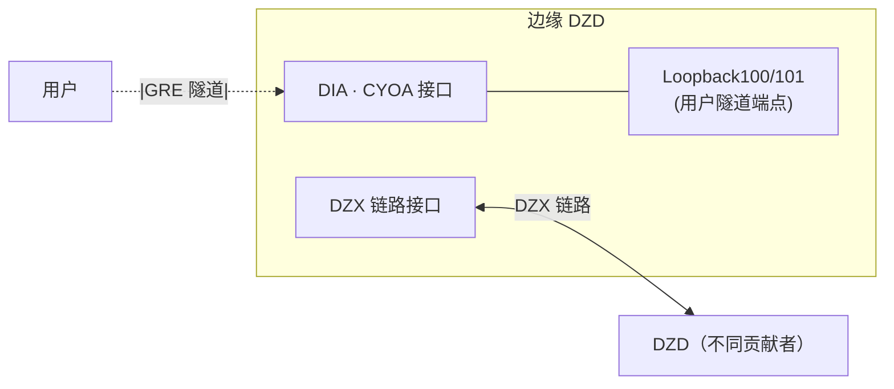
```mermaid
flowchart LR
    subgraph EDZD[边缘 DZD]
        E_CYOA["DIA · CYOA 接口"]
        E_TUN["Loopback100/101
        (用户隧道端点)"]
        E_DZX["DZX 链路接口"]
        E_CYOA --- E_TUN
    end
    EU["用户"] -.|GRE 隧道|.-> E_CYOA
    E_DZX <-->|DZX 链路| ED["DZD（不同贡献者）"]
```

**中转（Transit）** — 在设备之间转发流量，无用户连接

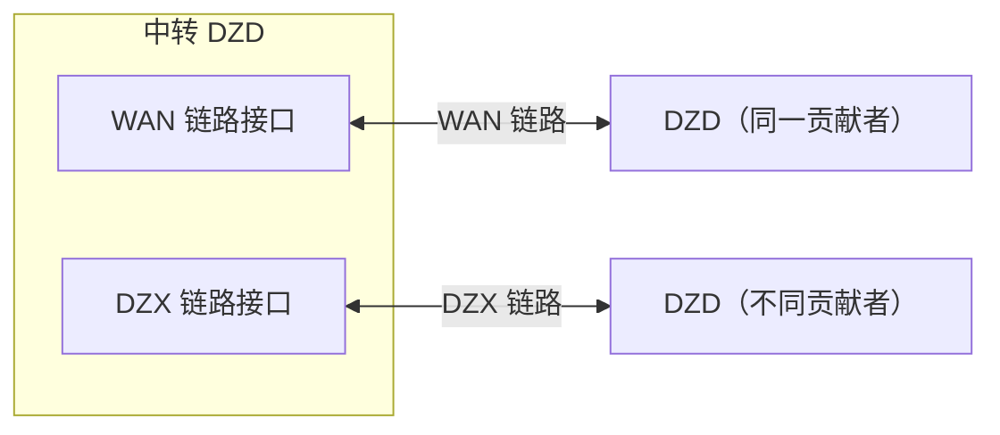
```mermaid
flowchart LR
    subgraph TDZD[中转 DZD]
        T_WAN["WAN 链路接口"]
        T_DZX["DZX 链路接口"]
    end
    T_WAN <-->|WAN 链路| T2["DZD（同一贡献者）"]
    T_DZX <-->|DZX 链路| TD["DZD（不同贡献者）"]
```

**混合（Hybrid）** — 用户连接和骨干传输兼备，最常见

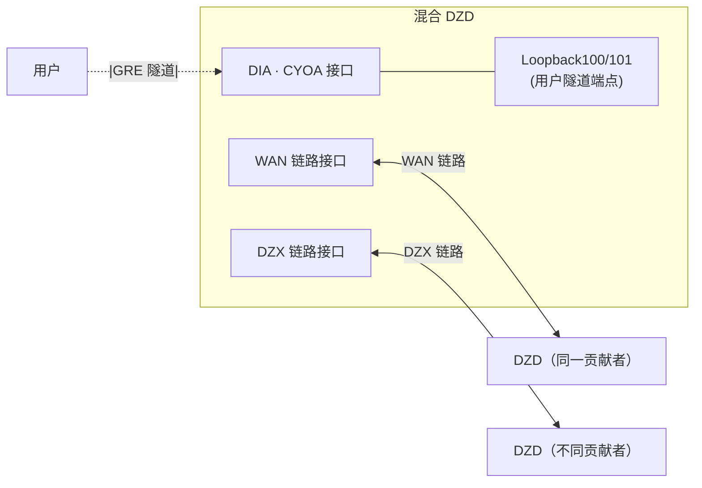
```mermaid
flowchart LR
    subgraph HDZD[混合 DZD]
        H_CYOA["DIA · CYOA 接口"]
        H_TUN["Loopback100/101
        (用户隧道端点)"]
        H_WAN["WAN 链路接口"]
        H_DZX["DZX 链路接口"]
        H_CYOA --- H_TUN
    end
    HU["用户"] -.|GRE 隧道|.-> H_CYOA
    H_WAN <-->|WAN 链路| H2["DZD（同一贡献者）"]
    H_DZX <-->|DZX 链路| HD["DZD（不同贡献者）"]
```

| 类型 | 功能 | 适用场景 |
|------|------|----------|
| **边缘（Edge）** | 仅接受用户连接 | 单一位置，仅面向用户 |
| **中转（Transit）** | 在设备之间转发流量 | 骨干连接，无用户 |
| **混合（Hybrid）** | 用户连接和骨干传输兼备 | 最常见——兼具所有功能 |

### 步骤 3.1：查找您的位置和交换点

在创建设备之前，查找您的数据中心位置和最近交换点的代码：

```bash
# 列出可用位置（数据中心）
doublezero location list

# 列出可用交换点（互联节点）
doublezero exchange list
```

### 步骤 3.2：在链上创建设备

在区块链上注册您的设备：

```bash
doublezero device create \
  --code <YOUR_DEVICE_CODE> \
  --contributor <YOUR_CONTRIBUTOR_CODE> \
  --device-type hybrid \
  --location <LOCATION_CODE> \
  --exchange <EXCHANGE_CODE> \
  --public-ip <DEVICE_PUBLIC_IP> \
  --dz-prefixes <YOUR_DZ_PREFIX>
```

**示例：**

```bash
doublezero device create \
  --code nyc-dz001 \
  --contributor acme \
  --device-type hybrid \
  --location EQX-NY5 \
  --exchange nyc \
  --public-ip "203.0.113.10" \
  --dz-prefixes "198.51.100.0/28"
```

**预期输出：**

```
Signature: 4vKz8H...truncated...7xPq2
```

验证设备是否已创建：

```bash
doublezero device list | grep nyc-dz001
```

**参数说明：**

| 参数 | 含义 |
|------|------|
| `--code` | 设备的唯一名称（例如 `nyc-dz001`） |
| `--contributor` | 您的贡献者代码（由 DZF 分配） |
| `--device-type` | `hybrid`、`transit` 或 `edge` |
| `--location` | 从 `location list` 获取的数据中心代码 |
| `--exchange` | 从 `exchange list` 获取的最近交换点代码 |
| `--public-ip` | 用户通过互联网连接到您设备的公共 IP |
| `--dz-prefixes` | 为用户分配的 IP 地址块 |

### 步骤 3.3：创建必需的环回接口

每个设备都需要两个用于内部路由的环回接口：

```bash
# VPNv4 环回
doublezero device interface create <DEVICE_CODE> Loopback255 --loopback-type vpnv4

# IPv4 环回
doublezero device interface create <DEVICE_CODE> Loopback256 --loopback-type ipv4
```

**预期输出（每条命令）：**

```
Signature: 3mNx9K...truncated...8wRt5
```

### 步骤 3.4：创建物理接口

注册将用于 WAN 或 DZX 链路的物理接口。这些接口必须先在链上存在，才能创建引用它们的链路。在此步骤中，您只需注册接口及其带宽，链路将在后续步骤中创建。

```bash
doublezero device interface create <DEVICE_CODE> <INTERFACE_NAME> \
  --bandwidth <PORT_SPEED>
```

**示例：**

```bash
doublezero device interface create nyc-dz001 Ethernet1/1 \
  --bandwidth 10Gbps
```

**预期输出：**

```
Signature: 7pQw2R...truncated...4xKm9
```

对每个将用作 WAN 或 DZX 链路端点的接口重复此操作。CYOA 和 DIA 接口将在下一步单独注册。

### 步骤 3.5：创建 CYOA 接口（适用于边缘/混合设备）

混合和边缘 DZD 需要**两个公共 IP 地址**供用户终止其 GRE 隧道。用户可以通过单播、组播或两者同时连接，哪个 IP 服务于哪个用途会因用户而异轮换。

两个 IP 都必须使用 `--user-tunnel-endpoint true` 注册，可以在物理接口或环回接口上。这包括您在创建设备时提供的 IP，该 IP 仍需要在此处显式注册。

如果您的 IP 资源有限，可以使用 DZ 前缀的第一个 `/32` 作为两个 IP 之一。

#### CYOA 和 DIA

| 类型 | 标志 | 用途 |
|------|------|------|
| DIA | `--interface-dia dia` | 将端口标记为直接互联网接入 |
| CYOA | `--interface-cyoa <subtype>` | 声明用户如何通过 GRE 隧道连接到您的设备 |

CYOA 标志始终设置在**物理接口**（以太网端口或端口通道）上。绝不在环回接口上。

| CYOA 子类型 | 适用场景 |
|-------------|----------|
| `gre-over-dia` | 用户通过公共互联网连接。最常见。 |
| `gre-over-private-peering` | 用户通过直连交叉连接或专线连接 |
| `gre-over-public-peering` | 用户在互联网交换点 (IX) 与您对等 |
| `gre-over-fabric` | 用户在同一机房并通过本地 Fabric 连接 |
| `gre-over-cable` | 与单个专用用户的直连电缆连接 |

#### 场景 A：单个物理接口

到 ISP 的单个物理上行链路。Ethernet1/1 是 CYOA 和 DIA 接口，携带两个公共 IP 中的一个。Loopback100 携带第二个公共 IP。

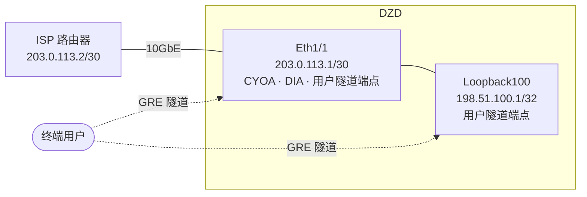
```mermaid
flowchart LR
    USERS(["终端用户"])

    subgraph DZD["DZD"]
        E1["Eth1/1
        203.0.113.1/30
        CYOA · DIA · 用户隧道端点"]
        LO["Loopback100
        198.51.100.1/32\n        用户隧道端点"]
        E1 --- LO
    end

    ISP["ISP 路由器
    203.0.113.2/30"]

    ISP -- "10GbE" --- E1
    USERS -. "GRE 隧道" .-> E1
    USERS -. "GRE 隧道" .-> LO
```

| 接口 | `--interface-cyoa` | `--interface-dia` | `--ip-net` | `--bandwidth` | `--cir` | `--routing-mode` | `--user-tunnel-endpoint` |
|------|-------------------|------------------|------------|---------------|---------|-----------------|--------------------------|
| Ethernet1/1 | `gre-over-dia` | `dia` | 贡献者分配的 IP/子网 | 端口速率 | 承诺速率 | `bgp` 或 `static` | `true` |
| Loopback100 | — | — | 您的公共 /32 | `0bps` | — | — | `true` |

基于场景 A 执行的命令示例：
```bash
doublezero device interface create mydzd-nyc01 Ethernet1/1 \
  --interface-cyoa gre-over-dia \
  --interface-dia dia \
  --ip-net 203.0.113.1/30 \
  --bandwidth 10Gbps \
  --cir 1Gbps \
  --routing-mode bgp \
  --user-tunnel-endpoint true

doublezero device interface create mydzd-nyc01 Loopback100 \
  --ip-net 198.51.100.1/32 \
  --bandwidth 0bps \
  --user-tunnel-endpoint true
```

#### 场景 B：端口通道 (LAG)

DZD 通过带有 IP 的端口通道连接到上游设备。端口通道携带一个公共 IP 并作为 CYOA 端点。Loopback100 携带第二个公共 IP。

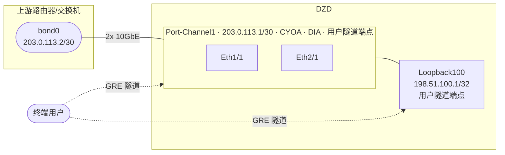
```mermaid
flowchart LR
    USERS(["终端用户"])

    subgraph SW["上游路由器/交换机"]
        SWPC(["bond0
        203.0.113.2/30"])
    end

    subgraph DZD["DZD"]
        subgraph PC["Port-Channel1 · 203.0.113.1/30 · CYOA · DIA · 用户隧道端点"]
            E1["Eth1/1"]
            E2["Eth2/1"]
        end
        LO["Loopback100
        198.51.100.1/32\n        用户隧道端点"]
        PC --- LO
    end

    SWPC -- "2x 10GbE" --- PC
    USERS -. "GRE 隧道" .-> PC
    USERS -. "GRE 隧道" .-> LO
```

| 接口 | `--interface-cyoa` | `--interface-dia` | `--ip-net` | `--bandwidth` | `--cir` | `--routing-mode` | `--user-tunnel-endpoint` |
|------|-------------------|------------------|------------|---------------|---------|-----------------|--------------------------|
| Port-Channel1 | `gre-over-dia` | `dia` | 贡献者分配的 IP/子网 | LAG 总带宽 | 承诺速率 | `bgp` 或 `static` | `true` |
| Loopback100 | — | — | 您的公共 /32 | `0bps` | — | — | `true` |

基于场景 B 执行的命令示例：
```bash
doublezero device interface create mydzd-fra01 Port-Channel1 \
  --interface-cyoa gre-over-dia \
  --interface-dia dia \
  --ip-net 203.0.113.1/30 \
  --bandwidth 20Gbps \
  --cir 2Gbps \
  --routing-mode bgp \
  --user-tunnel-endpoint true

doublezero device interface create mydzd-fra01 Loopback100 \
  --ip-net 198.51.100.1/32 \
  --bandwidth 0bps \
  --user-tunnel-endpoint true
```


#### 场景 C：双物理上行链路连接到不同路由器

每个物理接口连接到不同的上游路由器。两个公共 IP 分别位于 Loopback100 和 Loopback101 上，都注册为用户隧道端点。

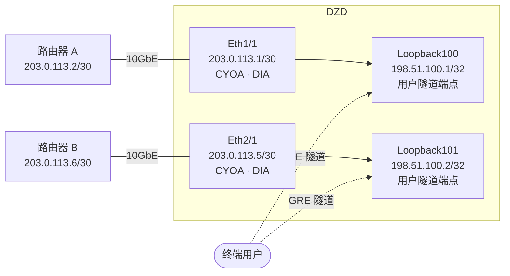
```mermaid
flowchart LR
    USERS(["终端用户"])

    RA["路由器 A
    203.0.113.2/30"]
    RB["路由器 B
    203.0.113.6/30"]

    subgraph DZD["DZD"]
        E1["Eth1/1
        203.0.113.1/30
        CYOA · DIA"]
        E2["Eth2/1
        203.0.113.5/30
        CYOA · DIA"]
        LO0["Loopback100
        198.51.100.1/32\n        用户隧道端点"]
        LO1["Loopback101
        198.51.100.2/32\n        用户隧道端点"]
        E1 --> LO0
        E2 --> LO1
    end

    RA -- "10GbE" --- E1
    RB -- "10GbE" --- E2
    USERS -. "GRE 隧道" .-> LO0
    USERS -. "GRE 隧道" .-> LO1
```

| 接口 | `--interface-cyoa` | `--interface-dia` | `--ip-net` | `--bandwidth` | `--cir` | `--routing-mode` | `--user-tunnel-endpoint` |
|------|-------------------|------------------|------------|---------------|---------|-----------------|--------------------------|
| Ethernet1/1 | `gre-over-dia` | `dia` | 贡献者分配的 IP/子网 | 端口速率 | 承诺速率 | `bgp` 或 `static` | — |
| Ethernet2/1 | `gre-over-dia` | `dia` | 贡献者分配的 IP/子网 | 端口速率 | 承诺速率 | `bgp` 或 `static` | — |
| Loopback100 | — | — | 您的公共 /32 | `0bps` | — | — | `true` |
| Loopback101 | — | — | 您的公共 /32 | `0bps` | — | — | `true` |

基于场景 C 执行的命令示例：
```bash
doublezero device interface create mydzd-ams01 Ethernet1/1 \
  --interface-cyoa gre-over-dia \
  --interface-dia dia \
  --ip-net 203.0.113.1/30 \
  --bandwidth 10Gbps \
  --cir 1Gbps \
  --routing-mode bgp

doublezero device interface create mydzd-ams01 Ethernet2/1 \
  --interface-cyoa gre-over-dia \
  --interface-dia dia \
  --ip-net 203.0.113.5/30 \
  --bandwidth 10Gbps \
  --cir 1Gbps \
  --routing-mode bgp

doublezero device interface create mydzd-ams01 Loopback100 \
  --ip-net 198.51.100.1/32 \
  --bandwidth 0bps \
  --user-tunnel-endpoint true

doublezero device interface create mydzd-ams01 Loopback101 \
  --ip-net 198.51.100.2/32 \
  --bandwidth 0bps \
  --user-tunnel-endpoint true
```

### 步骤 3.6：验证您的设备

```bash
doublezero device list
```

**示例输出：**

```
 account                                      | code      | contributor | location | exchange | device_type | public_ip    | dz_prefixes     | users | max_users | status    | health  | mgmt_vrf | owner
 7xKm9pQw2R4vHt3...                          | nyc-dz001 | acme        | EQX-NY5  | nyc      | hybrid      | 203.0.113.10 | 198.51.100.0/28 | 0     | 14        | activated | pending |          | 5FMtd5Woq5XAAg54...
```

您的设备应显示状态为 `activated`。

---

## 阶段 4：链路建立与代理安装

链路将您的设备连接到 DoubleZero 网络的其余部分。

### 了解链路

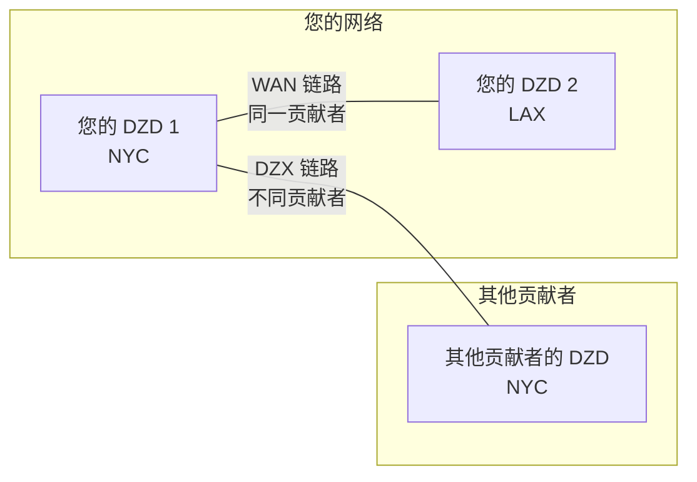
```mermaid
flowchart LR
    subgraph "您的网络"
        D1[您的 DZD 1<br/>NYC]
        D2[您的 DZD 2<br/>LAX]
    end

    subgraph "其他贡献者"
        O1[其他贡献者的 DZD<br/>NYC]
    end

    D1 ---|WAN 链路<br/>同一贡献者| D2
    D1 ---|DZX 链路<br/>不同贡献者| O1
```

| 链路类型 | 连接对象 | 接受方式 |
|----------|----------|----------|
| **WAN 链路** | 您自己的两个设备 | 自动（您拥有两端） |
| **DZX 链路** | 您的设备与另一个贡献者的设备 | 需要对方接受 |

### 步骤 4.1：创建 WAN 链路（如果您有多个设备）

WAN 链路连接您自己的设备：

```bash
doublezero link create wan \
  --code <LINK_CODE> \
  --contributor <YOUR_CONTRIBUTOR> \
  --side-a <DEVICE_1_CODE> \
  --side-a-interface <INTERFACE_ON_DEVICE_1> \
  --side-z <DEVICE_2_CODE> \
  --side-z-interface <INTERFACE_ON_DEVICE_2> \
  --bandwidth 10000 \
  --mtu 9000 \
  --delay-ms 20 \
  --jitter-ms 1
```

**示例：**

```bash
doublezero link create wan \
  --code nyc-lax-wan01 \
  --contributor acme \
  --side-a nyc-dz001 \
  --side-a-interface Ethernet3/1 \
  --side-z lax-dz001 \
  --side-z-interface Ethernet3/1 \
  --bandwidth 10000 \
  --mtu 9000 \
  --delay-ms 65 \
  --jitter-ms 1
```

**预期输出：**

```
Signature: 5tNm7K...truncated...9pRw2
```

### 步骤 4.2：创建 DZX 链路

DZX 链路将您的设备直接连接到另一个贡献者的 DZD：

```bash
doublezero link create dzx \
  --code <DEVICE_CODE_A:DEVICE_CODE_Z> \
  --contributor <YOUR_CONTRIBUTOR> \
  --side-a <YOUR_DEVICE_CODE> \
  --side-a-interface <YOUR_INTERFACE> \
  --side-z <OTHER_DEVICE_CODE> \
  --bandwidth <BANDWIDTH in Kbps, Mbps, or Gbps> \
  --mtu <MTU> \
  --delay-ms <DELAY> \
  --jitter-ms <JITTER>
```

**预期输出：**

```
Signature: 8mKp3W...truncated...2nRx7
```

创建 DZX 链路后，另一个贡献者必须接受它：

```bash
# 另一个贡献者运行此命令
doublezero link accept \
  --code <LINK_CODE> \
  --side-z-interface <THEIR_INTERFACE>
```

**预期输出（接受方）：**

```
Signature: 6vQt9L...truncated...3wPm4
```

### 步骤 4.3：验证链路

```bash
doublezero link list
```

**示例输出：**

```
 account                                      | code          | contributor | side_a_name | side_a_iface_name | side_z_name | side_z_iface_name | link_type | bandwidth | mtu  | delay_ms | jitter_ms | delay_override_ms | tunnel_id | tunnel_net      | status    | health  | owner
 8vkYpXaBW8RuknJq...                         | nyc-dz001:lax-dz001 | acme        | nyc-dz001   | Ethernet3/1       | lax-dz001   | Ethernet3/1       | WAN       | 10Gbps    | 9000 | 65.00ms  | 1.00ms    | 0.00ms            | 42        | 172.16.0.84/31  | activated | pending | 5FMtd5Woq5XAAg54...
```

链路在两端都配置完成后应显示状态为 `activated`。

---

### 代理安装

两个软件代理运行在您的 DZD 上：

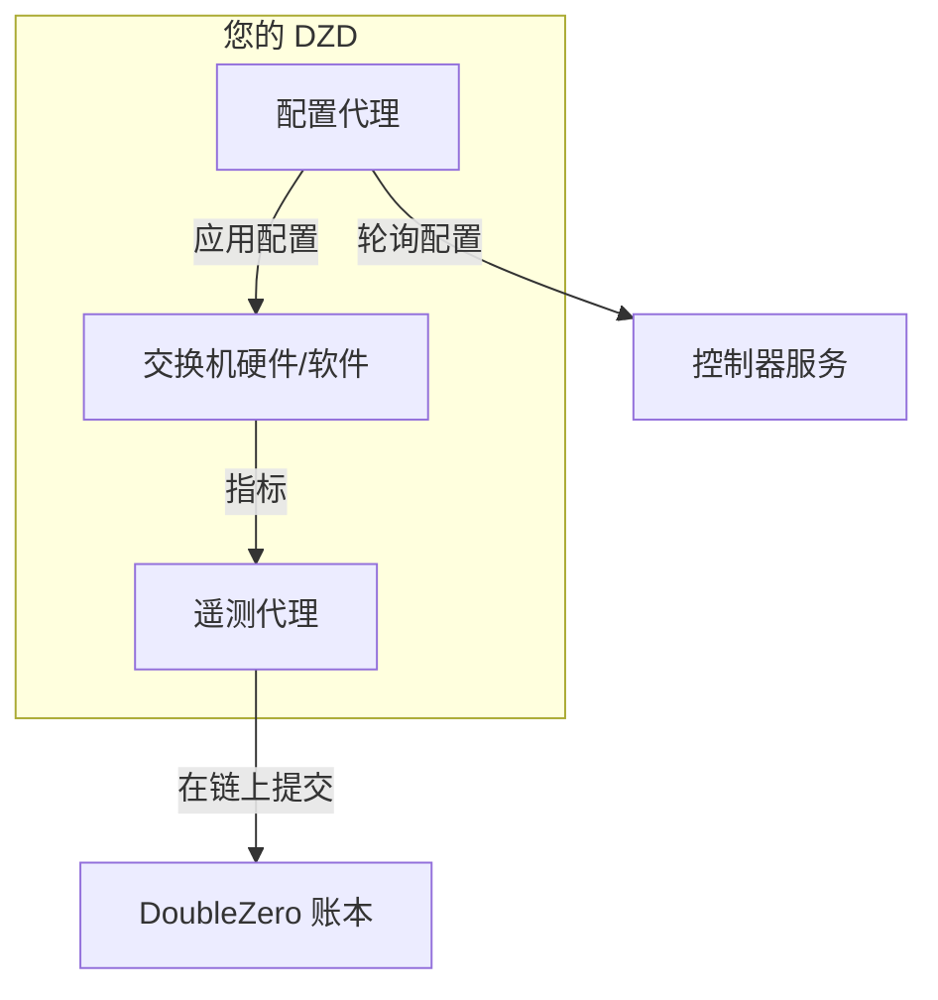
```mermaid
flowchart TB
    subgraph "您的 DZD"
        CA[配置代理]
        TA[遥测代理]
        HW[交换机硬件/软件]
    end

    CA -->|轮询配置| CTRL[控制器服务]
    CA -->|应用配置| HW

    HW -->|指标| TA
    TA -->|在链上提交| BC[DoubleZero 账本]
```

| 代理 | 功能 |
|------|------|
| **配置代理** | 从控制器拉取配置，应用到您的交换机 |
| **遥测代理** | 测量与其他设备之间的延迟/丢包，在链上报告指标 |

### 步骤 4.4：安装配置代理

#### 在交换机上启用 API

添加到 EOS 配置中：

```
management api eos-sdk-rpc
    transport grpc eapilocal
        localhost loopback vrf default
        service all
        no disabled
```

!!! note "VRF 说明"
    如果管理 VRF 名称不同（例如 `management`），请将 `default` 替换为您的管理 VRF 名称。

#### 下载并安装代理

```bash
# 在交换机上进入 bash
switch# bash
$ sudo bash
# cd /mnt/flash
# wget AGENT_DOWNLOAD_URL
# exit
$ exit

# 作为 EOS 扩展安装
switch# copy flash:AGENT_FILENAME extension:
switch# extension AGENT_FILENAME
switch# copy installed-extensions boot-extensions
```

#### 验证扩展

```bash
switch# show extensions
```

状态应为 "A, I, B"：

```
Name                                        Version/Release     Status     Extension
------------------------------------------- ------------------- ---------- ---------
AGENT_FILENAME    MAINNET_CLIENT_VERSION/1             A, I, B    1

A: available | NA: not available | I: installed | F: forced | B: install at boot
```

#### 配置并启动代理

添加到 EOS 配置中：

```
daemon doublezero-agent
    exec /usr/local/bin/doublezero-agent -pubkey <YOUR_DEVICE_PUBKEY> -controller <controller_IP>:<controller_port>
    no shut
```

!!! info "控制器 IP 和端口"
    控制器 IP 和端口可以在步骤 2.5 中获得访问权限的贡献者仓库中找到。

!!! note "VRF 说明"
    如果您的管理 VRF 不是 `default`（即命名空间不是 `ns-default`），请在 exec 命令前加上 `exec /sbin/ip netns exec ns-<VRF>`。例如，如果您的 VRF 是 `management`：
    ```
    daemon doublezero-agent
        exec /sbin/ip netns exec ns-management /usr/local/bin/doublezero-agent -pubkey <YOUR_DEVICE_PUBKEY>
        no shut
    ```

从 `doublezero device list` 中获取您的设备公钥（`account` 列）。

#### 验证代理是否运行

```bash
switch# show agent doublezero-agent logs
```

您应该看到 "Starting doublezero-agent" 和成功的控制器连接信息。

### 步骤 4.5：安装遥测代理

#### 将指标发布者密钥复制到您的设备

```bash
scp ~/.config/doublezero/metrics-publisher.json <SWITCH_IP>:/mnt/flash/metrics-publisher-keypair.json
```

#### 在链上注册指标发布者

```bash
doublezero device update \
  --pubkey <DEVICE_ACCOUNT> \
  --metrics-publisher <METRICS_PUBLISHER_PUBKEY>
```

从您的 metrics-publisher.json 文件中获取公钥。

#### 下载并安装代理

```bash
switch# bash
$ sudo bash
# cd /mnt/flash
# wget TELEMETRY_DOWNLOAD_URL
# exit
$ exit

# 作为 EOS 扩展安装
switch# copy flash:TELEMETRY_FILENAME extension:
switch# extension TELEMETRY_FILENAME
switch# copy installed-extensions boot-extensions
```

#### 验证扩展

```bash
switch# show extensions
```

状态应为 "A, I, B"：

```
Name                                        Version/Release     Status     Extension
------------------------------------------- ------------------- ---------- ---------
TELEMETRY_FILENAME    MAINNET_CLIENT_VERSION/1             A, I, B    1

A: available | NA: not available | I: installed | F: forced | B: install at boot
```

#### 配置并启动代理

添加到 EOS 配置中：

```
daemon doublezero-telemetry
    exec /usr/local/bin/doublezero-telemetry --local-device-pubkey <DEVICE_ACCOUNT> --env mainnet --keypair /mnt/flash/metrics-publisher-keypair.json
    no shut
```

!!! note "VRF 说明"
    如果您的管理 VRF 不是 `default`（即命名空间不是 `ns-default`），请在 exec 命令中添加 `--management-namespace ns-<VRF>`。例如，如果您的 VRF 是 `management`：
    ```
    daemon doublezero-telemetry
        exec /usr/local/bin/doublezero-telemetry --management-namespace ns-management --local-device-pubkey <DEVICE_ACCOUNT> --env mainnet --keypair /mnt/flash/metrics-publisher-keypair.json
        no shut
    ```

#### 验证代理是否运行

```bash
switch# show agent doublezero-telemetry logs
```

您应该看到 "Starting telemetry collector" 和 "Starting submission loop"。

---

## 阶段 5：链路老化测试

!!! warning "所有新链路在承载流量前必须进行老化测试"
    新链路必须**排空至少 24 小时**才能激活用于生产流量。此老化测试要求在 [RFC12: Network Provisioning](https://github.com/malbeclabs/doublezero/blob/main/rfcs/rfc12-network-provisioning.md) 中定义，该规范要求约 200,000 个 DZ 账本时隙（约 20 小时）的干净指标，链路才能投入使用。

安装并运行代理后，在 [metrics.doublezero.xyz](https://metrics.doublezero.xyz) 上监控您的链路至少连续 24 小时：

- **"DoubleZero Device-Link Latencies"** 仪表板 — 验证链路上随时间**零丢包**
- **"DoubleZero Network Metrics"** 仪表板 — 验证您的链路上**零错误**

只有在老化测试期间显示链路零丢包、零错误后，才能解除链路排空状态。

---

## 阶段 6：验证与激活

逐项检查此清单以确认一切正常工作。

!!! warning "您的设备初始状态为锁定（`max_users = 0`）"
    创建设备时，`max_users` 默认设置为 **0**。这意味着还没有用户可以连接到它。这是有意为之的——您必须在接受用户流量之前验证一切正常。

    **在将 `max_users` 设置为大于 0 之前，您必须：**

    1. 确认所有链路已完成 **24 小时老化测试**，在 [metrics.doublezero.xyz](https://metrics.doublezero.xyz) 上显示零丢包/零错误
    2. **与 DZ/Malbec Labs 协调**进行连接测试：
        - 测试用户能否连接到您的设备？
        - 用户是否通过 DZ 网络接收到路由？
        - 用户是否能通过 DZ 网络进行端到端流量路由？
    3. 仅在 DZ/ML 确认测试通过后，将 max_users 设置为 96：

    ```bash
    doublezero device update --pubkey <DEVICE_ACCOUNT> --max-users 96
    ```

### 设备检查

```bash
# 您的设备应显示状态为 "activated"
doublezero device list | grep <YOUR_DEVICE_CODE>
```

**预期输出：**

```
 7xKm9pQw2R4vHt3... | nyc-dz001 | acme | EQX-NY5 | nyc | hybrid | 203.0.113.10 | 198.51.100.0/28 | 0 | 14 | activated | pending | | 5FMtd5Woq5XAAg54...
```

```bash
# 您的接口应在列表中显示
doublezero device interface list | grep <YOUR_DEVICE_CODE>
```

**预期输出：**

```
 nyc-dz001 | Loopback255 | loopback | vpnv4 | none | none | 0 | 0 | 1500 | static | 0 | 172.16.1.91/32  | 56 | false | activated
 nyc-dz001 | Loopback256 | loopback | ipv4  | none | none | 0 | 0 | 1500 | static | 0 | 172.16.1.100/32 | 0  | false | activated
 nyc-dz001 | Ethernet1/1 | physical | none  | none | none | 0 | 0 | 1500 | static | 0 |                 | 0  | false | activated
```

### 链路检查

```bash
# 链路应显示状态为 "activated"
doublezero link list | grep <YOUR_DEVICE_CODE>
```

**预期输出：**

```
 8vkYpXaBW8RuknJq... | nyc-lax-wan01 | acme | nyc-dz001 | Ethernet3/1 | lax-dz001 | Ethernet3/1 | WAN | 10Gbps | 9000 | 65.00ms | 1.00ms | 0.00ms | 42 | 172.16.0.84/31 | activated | pending | 5FMtd5Woq5XAAg54...
```

### 代理检查

在交换机上：

```bash
# 配置代理应显示成功的配置拉取
switch# show agent doublezero-agent logs | tail -20

# 遥测代理应显示成功的提交
switch# show agent doublezero-telemetry logs | tail -20
```

### 最终验证图

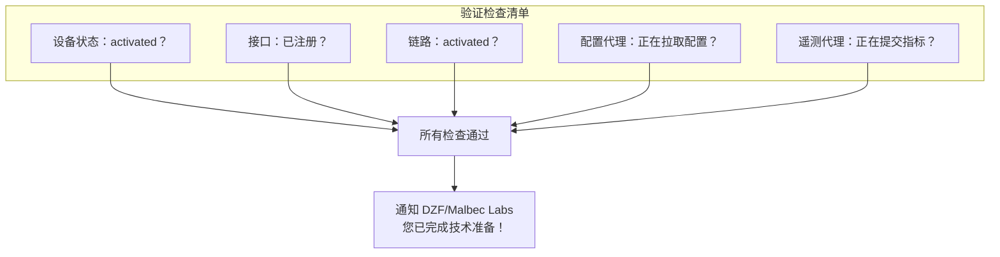
```mermaid
flowchart TB
    subgraph "验证检查清单"
        D[设备状态：activated？]
        I[接口：已注册？]
        L[链路：activated？]
        CA[配置代理：正在拉取配置？]
        TA[遥测代理：正在提交指标？]
    end

    D --> PASS
    I --> PASS
    L --> PASS
    CA --> PASS
    TA --> PASS

    PASS[所有检查通过] --> NOTIFY[通知 DZF/Malbec Labs<br/>您已完成技术准备！]
```

---

## 故障排除

### 设备创建失败

- 验证您的服务密钥已获授权（`doublezero contributor list`）
- 检查位置和交换点代码是否有效
- 确保 DZ 前缀是有效的公共 IP 范围

### 链路停留在 "requested" 状态

- DZX 链路需要另一个贡献者接受
- 联系对方运行 `doublezero link accept`

### 配置代理无法连接

- 验证管理网络有互联网访问
- 检查 VRF 配置是否与您的设置匹配
- 确保设备公钥正确

### 遥测代理未提交

- 验证指标发布者密钥已在链上注册
- 检查密钥对文件是否存在于交换机上
- 确保设备账户公钥正确

---

## 后续步骤

- 查阅[运维指南](contribute-operations.md)了解代理升级和链路管理
- 查看[术语表](glossary.md)了解术语定义
- 如遇到问题，请联系 DZF/Malbec Labs