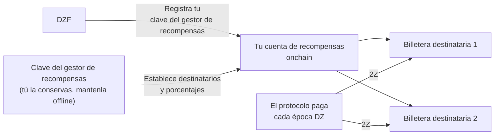

# Gestión de Recompensas

Ganas recompensas en [2Z](glossary.md#2z-token) por el ancho de banda y los dispositivos que contribuyes. El protocolo paga esas recompensas por sí mismo, directamente a las billeteras que tú designes. Hasta que las designes, no se puede realizar ningún pago.

!!! warning "Haz esto durante la configuración de la cuenta"
    Configura la gestión de recompensas en la [Fase 2: Configuración de la Cuenta](contribute-provisioning.md#phase-2-account-setup), antes de que tu dispositivo transporte tráfico.

    Tus recompensas siguen acumulándose si dejas esto para después. El protocolo no las quema y no expiran. Lo que pierdes es el pago automático: el proceso de pago rutinario trabaja con las épocas recientes, por lo que cualquier época que pase mientras no tengas destinatarios configurados tiene que pagarse manualmente después. Consulta [Si Configuras Esto Tarde](#si-configuras-esto-tarde).

---

## Cómo Funciona

Están involucradas tres claves. Cada una hace un trabajo diferente, y es más seguro mantenerlas separadas.

| Clave | Qué hace | ¿Recibe recompensas? |
|-------|----------|----------------------|
| **Clave de servicio** | Te identifica como contribuidor y firma tus comandos CLI. También nombra tu cuenta de recompensas onchain. | No |
| **Clave del gestor de recompensas** | Firma los cambios en la lista de billeteras que reciben recompensas. | No |
| **Billetera(s) destinataria(s)** | Almacena los 2Z que el protocolo te envía. Hasta 8 billeteras. | Sí |

La DoubleZero Foundation registra tu clave del gestor de recompensas contra tu clave de servicio. Solo DZF puede hacer eso. Después de eso, solo tu clave del gestor de recompensas puede cambiar la lista de destinatarios, y DZF no puede redirigir tus recompensas.



---

## Qué Necesitas Primero

- Una cuenta de contribuidor onchain. Verifica con `doublezero contributor list`.
- Una billetera Solana para actuar como tu gestor de recompensas, con aproximadamente 0.01 SOL para pagar las comisiones de transacción.
- Una o más billeteras para recibir los 2Z.
- El CLI `doublezero-solana`, si quieres usar la línea de comandos en lugar del portal. Instálalo con `sudo apt update && sudo apt install doublezero-solana`.

!!! tip "Usa una billetera de hardware para la clave del gestor de recompensas"
    La clave del gestor de recompensas controla hacia dónde va tu dinero. Mantenla en una billetera de hardware o de otro modo offline. Nunca necesita estar en un servidor, y nunca almacena tus recompensas.

---

## Paso 1: Crea Tu Billetera del Gestor de Recompensas

Crea una billetera Solana que controles y con la que puedas firmar. Puede ser una billetera de hardware, una billetera de navegador o un archivo de par de claves.

Fondéala con una pequeña cantidad de SOL, aproximadamente 0.01 SOL. Esto solo paga las comisiones de red cuando cambias tu lista de destinatarios.

No reutilices tu clave de servicio para esto. Si la clave de servicio está en un servidor de gestión, cualquiera que acceda a ese servidor podría redirigir tus recompensas.

---

## Paso 2: Envía la Clave Pública a DZF

Entrega a DZF la **clave pública** de tu billetera del gestor de recompensas. Nunca compartas la clave privada.

DZF la registra contra tu clave de servicio onchain y confirma cuando está hecho. No puedes hacer este paso tú mismo.

!!! tip "Envíala junto con tu clave de servicio"
    Si estás siguiendo la [Guía de Aprovisionamiento de Dispositivos](contribute-provisioning.md), envía esta clave pública al mismo tiempo que tu clave de servicio y nombre de usuario de GitHub, en el [Paso 2.4](contribute-provisioning.md#step-24-submit-keys-to-dzf). DZF registra las dos claves en transacciones separadas, así que enviarlas juntas ahorra un ida y vuelta.

Puedes verificar que se registró:

```bash
doublezero-solana revenue-distribution fetch contributor-rewards \
    --service-key <YourServiceKey1111111111111111111111111111> \
    -u mainnet-beta
```

La columna `manager` muestra tu clave del gestor de recompensas. Si está vacía, DZF aún no la ha registrado.

---

## Paso 3: Configura Tus Billeteras Destinatarias

Ahora indica a dónde deben ir las recompensas. Puedes usar el portal web o el CLI. Ambos escriben lo mismo onchain.

Reglas que aplican en cualquier caso:

- Como máximo 8 billeteras destinatarias.
- Los porcentajes deben ser números enteros y deben sumar exactamente 100.
- Un destinatario no puede tener una participación del 0%. Elimínalo en su lugar.

!!! info "Si tu acuerdo con DZF incluye una distribución de ingresos"
    Algunos contribuidores tienen un acuerdo que divide las recompensas con la fundación, por ejemplo cuando DZF proporcionó el hardware. Si eso aplica para ti, DZF te da la dirección y el porcentaje que debes ingresar aquí. Pregunta a DZF si no estás seguro.

=== "Portal web"

    1. Ve a [doublezero.xyz/rewards](https://doublezero.xyz/rewards). La dirección anterior, `rewards.doublezero.xyz`, redirige aquí.
    2. Conecta tu billetera del gestor de recompensas con el botón de billetera en la esquina superior derecha.
    3. Selecciona tu clave de servicio de la lista en la siguiente página.
    4. Ingresa cada dirección de billetera destinataria y su porcentaje. El total debe ser 100%.
    5. Haz clic en **Submit** y aprueba la transacción en tu billetera.

=== "CLI"

    Ejecuta esto con tu par de claves del gestor de recompensas como `-k`. Repite `--recipient` para cada billetera.

    ```bash
    doublezero-solana revenue-distribution configure-contributor-rewards \
        --service-key <YourServiceKey1111111111111111111111111111> \
        --recipient <Recipient1111111111111111111111111111111111>:70 \
        --recipient <Recipient2222222222222222222222222222222222>:30 \
        -k /path/to/rewards-manager-keypair.json \
        -u mainnet-beta
    ```

    | Flag | Descripción |
    |------|-------------|
    | `--service-key` | Tu clave de servicio de contribuidor. Nombra la cuenta de recompensas onchain. |
    | `--recipient` | Un destinatario en el formato `PUBKEY:PERCENT`. Números enteros, de 1 a 100, que sumen 100. Máximo 8. |
    | `-k` | Tu par de claves del gestor de recompensas. La transacción falla si este no es el gestor de recompensas registrado. |
    | `-u` | `mainnet-beta`. |

    Agrega `--dry-run` primero si quieres simular la transacción sin enviarla.

---

## Paso 4: Verifica Que Cada Destinatario Pueda Recibir 2Z

El protocolo envía 2Z con una transferencia de tokens simple. **No** crea la cuenta de tokens por ti. Si una billetera destinataria no tiene una cuenta de tokens 2Z, el pago de esa época falla.

El mint de 2Z en mainnet es:

```
J6pQQ3FAcJQeWPPGppWRb4nM8jU3wLyYbRrLh7feMfvd
```

Lista las cuentas de tokens que una billetera ya tiene:

```bash
spl-token accounts --owner <Recipient1111111111111111111111111111111111> -u m
```

Si `J6pQQ3FAcJQeWPPGppWRb4nM8jU3wLyYbRrLh7feMfvd` no aparece en esa lista, crea la cuenta una vez:

```bash
spl-token create-account J6pQQ3FAcJQeWPPGppWRb4nM8jU3wLyYbRrLh7feMfvd \
    --owner <Recipient1111111111111111111111111111111111> \
    --fee-payer /path/to/any-funded-keypair.json \
    -u m
```

Cualquier billetera con fondos puede pagar esto. Cuesta una pequeña cantidad de SOL y solo necesita hacerse una vez por billetera destinataria.

!!! note "Las billeteras que ya tienen 2Z están bien"
    Si la billetera ha recibido 2Z alguna vez, la cuenta de tokens existe y puedes omitir este paso.

---

## Paso 5: Verificar

Comprueba lo que ahora está registrado onchain:

```bash
doublezero-solana revenue-distribution fetch contributor-rewards \
    --service-key <YourServiceKey1111111111111111111111111111> \
    --view recipients \
    -u mainnet-beta
```

Ejemplo de salida:

```
| index | recipient                                    | ata                                          | proportion |
|-------|----------------------------------------------|----------------------------------------------|------------|
|     0 | Recipient1111111111111111111111111111111111  | Ata11111111111111111111111111111111111111111 |     70.00% |
|     1 | Recipient2222222222222222222222222222222222  | Ata22222222222222222222222222222222222222222 |     30.00% |
```

La columna `ata` es la cuenta de tokens 2Z en la que se pagará a cada destinatario. Verifica que la columna `proportion` sume 100%.

---

## Cuándo Llegan las Recompensas

- Las recompensas se calculan por **época DZ**, que es la época del DoubleZero Ledger. Una época DZ dura aproximadamente dos días.
- El pago de una época ocurre alrededor de 10 épocas DZ después de que esa época termina, es decir, aproximadamente 20 días después. Este retraso cubre la contabilidad de la época.
- Los pagos son automáticos. No necesitas reclamarlos y no necesitas ejecutar nada.
- Una vez que tus destinatarios están configurados, los pagos comienzan a llegar en un par de días a medida que se procesan las siguientes épocas. Las épocas que pasaron antes de que configuraras tus destinatarios son un asunto separado, consulta [Si Configuras Esto Tarde](#si-configuras-esto-tarde).
- Una época DZ y una época de Solana no tienen la misma duración. Esa diferencia se acumula con el tiempo, por lo que de vez en cuando una época DZ muestra cero recompensas. Esto es esperado.

---

## Dónde Ver Tus Recompensas

**Vista agregada.** El [Economic Hub](https://doublezero.xyz/economic-hub) muestra las recompensas de los contribuidores a nivel de red.

**Por época.** Consulta al protocolo lo que pagó una época DZ determinada:

```bash
doublezero-solana revenue-distribution fetch distribution \
    -e <DZ_EPOCH> --view rewards -u mainnet-beta
```

La salida lista cada contribuidor con su participación, su recompensa en 2Z, y si el pago ha sido realizado. Busca tu código de contribuidor en la columna `contributor`.

Para ver en qué época DZ está la red ahora, omite `-e`:

```bash
doublezero-solana revenue-distribution fetch distribution -u mainnet-beta
```

!!! note "Las épocas recientes aún no son definitivas"
    Consultar una época cuyas recompensas aún no se han calculado devuelve `Rewards calculation is not finalized yet`. Prueba con una época más antigua.

---

## Si Configuras Esto Tarde

Las recompensas se calculan para cada época en la que contribuiste, tengas o no destinatarios configurados en ese momento. Esas recompensas no se queman y no expiran. Permanecen en la cuenta de distribución de esa época hasta que alguien envíe el pago.

El inconveniente es que nada las envía por ti después del hecho. El proceso de pago rutinario trabaja con las épocas recientes, por lo que una época que pasó mientras tu lista de destinatarios estaba vacía permanece sin pagar hasta que se envíe manualmente.

Para encontrar qué épocas están afectadas, busca filas con tu código de contribuidor donde `distributed` sea `no` y la recompensa sea mayor que cero:

```bash
doublezero-solana revenue-distribution fetch distribution \
    -e <DZ_EPOCH> --view rewards -u mainnet-beta
```

Enviar el pago es sin permisos (permissionless), así que una vez que tus destinatarios estén configurados, cualquier billetera con fondos puede hacerlo, incluyendo la tuya:

```bash
doublezero-solana revenue-distribution relay distribute-rewards \
    -e <DZ_EPOCH> -k /path/to/funded-keypair.json -u mainnet-beta
```

Agrega `--dry-run` primero para simularlo sin enviar nada. El comando procesa cada contribuidor en esa época y omite los que ya fueron pagados, así que es seguro ejecutarlo.

Si prefieres no hacer esto tú mismo, pide a DZF que envíe las épocas por ti.

---

## Cambiar Destinatarios Después

Repite el [Paso 3](#paso-3-configura-tus-billeteras-destinatarias) en cualquier momento. La nueva lista reemplaza la anterior por completo, así que incluye todos los destinatarios que aún deseas, no solo los que estás agregando. Los porcentajes deben sumar 100 nuevamente.

Recuerda el [Paso 4](#paso-4-verifica-que-cada-destinatario-pueda-recibir-2z) para cualquier billetera que agregues.

---

## Bloquear la Clave del Gestor de Recompensas

Por defecto, DZF puede cambiar tu clave del gestor de recompensas, lo cual es útil si pierdes acceso a ella. Si prefieres descartar esa posibilidad, puedes bloquearla:

```bash
doublezero-solana revenue-distribution configure-contributor-rewards \
    --service-key <YourServiceKey1111111111111111111111111111> \
    --block-protocol-management \
    -k /path/to/rewards-manager-keypair.json \
    -u mainnet-beta
```

!!! danger "No bloquees una clave que podrías perder"
    Una vez que la gestión está bloqueada, nadie puede reemplazar tu clave del gestor de recompensas, incluyendo DZF. Si luego pierdes esa clave, ya no podrás cambiar a dónde van tus recompensas. Solo bloquéala si la clave está respaldada y segura.

Para permitirlo nuevamente, ejecuta el mismo comando con `--allow-protocol-management`.

---

## Solución de Problemas

**La columna `manager` está vacía.**
DZF aún no ha registrado tu clave del gestor de recompensas. Envíales la clave pública y pídeles que confirmen.

**`Invalid rewards manager`.**
El par de claves con el que firmaste no es el gestor de recompensas registrado. Verifica que pasaste el archivo correcto a `-k`, o la billetera correcta en el portal.

**`Invalid recipients`.**
Tus porcentajes no suman exactamente 100, listaste más de 8 destinatarios, o uno de ellos tiene una participación del 0%.

**Las recompensas aparecen como ganadas pero nada llega.**
Dos causas comunes. O no hay destinatarios configurados, por lo que no hay a dónde enviarlas, o una billetera destinataria no tiene cuenta de tokens 2Z. Revisa el [Paso 4](#paso-4-verifica-que-cada-destinatario-pueda-recibir-2z) y el [Paso 5](#paso-5-verificar). Una vez corregido, las épocas futuras se pagan solas. Las épocas que ya pasaron necesitan [un pago manual](#si-configuras-esto-tarde).

**Tus recompensas para una época reciente son 0.**
Las recompensas tienen un retraso de aproximadamente 10 épocas DZ. Consulta una época que tenga al menos esa antigüedad. Las épocas con cero ocasionales también son normales, consulta [Cuándo Llegan las Recompensas](#cuándo-llegan-las-recompensas).

---

## Próximos Pasos

Vuelve a la [Lista de Verificación de Incorporación](contribute-overview.md#onboarding-checklist), o continúa con [Operaciones](contribute-operations.md).