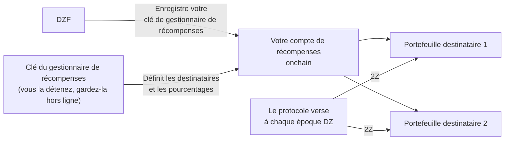

# Gestion des récompenses

Vous gagnez des récompenses en [2Z](glossary.md#2z-token) pour la bande passante et les appareils que vous contribuez. Le protocole verse ces récompenses de lui-même, directement aux portefeuilles que vous désignez. Tant que vous ne les avez pas désignés, aucun versement ne peut être effectué.

!!! warning "Faites ceci lors de la configuration du compte"
    Configurez la gestion des récompenses lors de la [Phase 2 : Configuration du compte](contribute-provisioning.md#phase-2-account-setup), avant que votre appareil ne transporte du trafic.

    Vos récompenses continuent de s'accumuler si vous reportez cette étape. Le protocole ne les détruit pas et elles n'expirent pas. Ce que vous perdez, c'est le versement automatique : le processus de versement de routine traite les époques récentes, donc toute époque passée alors que vous n'avez pas de destinataires configurés devra être versée manuellement par la suite. Voir [Si vous configurez ceci tardivement](#si-vous-configurez-ceci-tardivement).

---

## Comment ça fonctionne

Trois clés sont impliquées. Chacune remplit un rôle différent, et il est plus sûr de les garder séparées.

| Clé | Ce qu'elle fait | Reçoit des récompenses ? |
|-----|-----------------|--------------------------|
| **Clé de service** | Vous identifie en tant que contributeur et signe vos commandes CLI. Désigne également votre compte de récompenses onchain. | Non |
| **Clé du gestionnaire de récompenses** | Signe les modifications de la liste des portefeuilles recevant les récompenses. | Non |
| **Portefeuille(s) destinataire(s)** | Détient les 2Z que le protocole vous envoie. Jusqu'à 8 portefeuilles. | Oui |

La DoubleZero Foundation enregistre votre clé de gestionnaire de récompenses en lien avec votre clé de service. Seule la DZF peut le faire. Ensuite, seule votre clé de gestionnaire de récompenses peut modifier la liste des destinataires, et la DZF ne peut pas rediriger vos récompenses.



---

## Ce dont vous avez besoin au préalable

- Un compte contributeur onchain. Vérifiez avec `doublezero contributor list`.
- Un portefeuille Solana pour servir de gestionnaire de récompenses, détenant environ 0,01 SOL pour payer les frais de transaction.
- Un ou plusieurs portefeuilles pour recevoir les 2Z.
- Le CLI `doublezero-solana`, si vous souhaitez utiliser la ligne de commande plutôt que le portail. Installez-le avec `sudo apt update && sudo apt install doublezero-solana`.

!!! tip "Utilisez un portefeuille matériel pour la clé du gestionnaire de récompenses"
    La clé du gestionnaire de récompenses contrôle où va votre argent. Conservez-la sur un portefeuille matériel ou hors ligne. Elle n'a jamais besoin de se trouver sur un serveur, et elle ne détient jamais vos récompenses.

---

## Étape 1 : Créez votre portefeuille de gestionnaire de récompenses

Créez un portefeuille Solana que vous contrôlez et avec lequel vous pouvez signer. Il peut s'agir d'un portefeuille matériel, d'un portefeuille de navigateur ou d'un fichier de paire de clés.

Approvisionnez-le avec une petite quantité de SOL, environ 0,01 SOL. Cela sert uniquement à payer les frais réseau lorsque vous modifiez votre liste de destinataires.

Ne réutilisez pas votre clé de service pour cela. Si la clé de service se trouve sur un serveur de gestion, toute personne ayant accès à ce serveur pourrait rediriger vos récompenses.

---

## Étape 2 : Envoyez la clé publique à la DZF

Transmettez à la DZF la **clé publique** de votre portefeuille de gestionnaire de récompenses. Ne partagez jamais la clé privée.

La DZF l'enregistre en lien avec votre clé de service onchain et confirme lorsque c'est fait. Vous ne pouvez pas effectuer cette étape vous-même.

!!! tip "Envoyez-la en même temps que votre clé de service"
    Si vous suivez le [Guide de provisionnement des appareils](contribute-provisioning.md), envoyez cette clé publique en même temps que votre clé de service et votre nom d'utilisateur GitHub, à l'[Étape 2.4](contribute-provisioning.md#step-24-submit-keys-to-dzf). La DZF enregistre les deux clés dans des transactions séparées, donc les envoyer ensemble permet d'économiser un aller-retour.

Vous pouvez vérifier qu'elle a bien été enregistrée :

```bash
doublezero-solana revenue-distribution fetch contributor-rewards \
    --service-key <YourServiceKey1111111111111111111111111111> \
    -u mainnet-beta
```

La colonne `manager` affiche votre clé de gestionnaire de récompenses. Si elle est vide, la DZF ne l'a pas encore enregistrée.

---

## Étape 3 : Définissez vos portefeuilles destinataires

Indiquez maintenant où les récompenses doivent être envoyées. Vous pouvez utiliser le portail web ou le CLI. Les deux écrivent la même chose onchain.

Règles applicables dans les deux cas :

- Au maximum 8 portefeuilles destinataires.
- Les pourcentages doivent être des nombres entiers et doivent totaliser exactement 100.
- Un destinataire ne peut pas avoir une part de 0 %. Supprimez-le à la place.

!!! info "Si votre accord avec la DZF inclut un partage de revenus"
    Certains contributeurs ont un accord qui partage les récompenses avec la fondation, par exemple lorsque la DZF a fourni le matériel. Si c'est votre cas, la DZF vous fournit l'adresse et le pourcentage à saisir ici. Demandez à la DZF si vous n'êtes pas sûr.

=== "Portail web"

    1. Rendez-vous sur [doublezero.xyz/rewards](https://doublezero.xyz/rewards). L'ancienne adresse, `rewards.doublezero.xyz`, redirige ici.
    2. Connectez votre portefeuille de gestionnaire de récompenses avec le bouton de portefeuille en haut à droite.
    3. Sélectionnez votre clé de service dans la liste sur la page suivante.
    4. Saisissez chaque adresse de portefeuille destinataire et son pourcentage. Le total doit être de 100 %.
    5. Cliquez sur **Submit** et approuvez la transaction dans votre portefeuille.

=== "CLI"

    Exécutez ceci avec votre paire de clés du gestionnaire de récompenses en tant que `-k`. Répétez `--recipient` pour chaque portefeuille.

    ```bash
    doublezero-solana revenue-distribution configure-contributor-rewards \
        --service-key <YourServiceKey1111111111111111111111111111> \
        --recipient <Recipient1111111111111111111111111111111111>:70 \
        --recipient <Recipient2222222222222222222222222222222222>:30 \
        -k /path/to/rewards-manager-keypair.json \
        -u mainnet-beta
    ```

    | Drapeau | Description |
    |---------|-------------|
    | `--service-key` | Votre clé de service contributeur. Elle désigne le compte de récompenses onchain. |
    | `--recipient` | Un destinataire sous la forme `PUBKEY:PERCENT`. Nombres entiers, de 1 à 100, totalisant 100. Maximum 8. |
    | `-k` | Votre paire de clés du gestionnaire de récompenses. La transaction échoue si ce n'est pas le gestionnaire de récompenses enregistré. |
    | `-u` | `mainnet-beta`. |

    Ajoutez d'abord `--dry-run` si vous souhaitez simuler la transaction sans l'envoyer.

---

## Étape 4 : Vérifiez que chaque destinataire peut détenir des 2Z

Le protocole envoie des 2Z par un simple transfert de jetons. Il ne crée **pas** le compte de jetons pour vous. Si un portefeuille destinataire n'a pas de compte de jetons 2Z, le versement pour cette époque échoue.

L'adresse de mint du 2Z sur mainnet est :

```
J6pQQ3FAcJQeWPPGppWRb4nM8jU3wLyYbRrLh7feMfvd
```

Listez les comptes de jetons qu'un portefeuille possède déjà :

```bash
spl-token accounts --owner <Recipient1111111111111111111111111111111111> -u m
```

Si `J6pQQ3FAcJQeWPPGppWRb4nM8jU3wLyYbRrLh7feMfvd` est absent de cette liste, créez le compte une seule fois :

```bash
spl-token create-account J6pQQ3FAcJQeWPPGppWRb4nM8jU3wLyYbRrLh7feMfvd \
    --owner <Recipient1111111111111111111111111111111111> \
    --fee-payer /path/to/any-funded-keypair.json \
    -u m
```

N'importe quel portefeuille approvisionné peut payer cela. Cela coûte une petite quantité de SOL et ne doit être fait qu'une seule fois par portefeuille destinataire.

!!! note "Les portefeuilles qui détiennent déjà des 2Z sont OK"
    Si le portefeuille a déjà reçu des 2Z, le compte de jetons existe et vous pouvez ignorer cette étape.

---

## Étape 5 : Vérification

Vérifiez ce qui est désormais enregistré onchain :

```bash
doublezero-solana revenue-distribution fetch contributor-rewards \
    --service-key <YourServiceKey1111111111111111111111111111> \
    --view recipients \
    -u mainnet-beta
```

Exemple de sortie :

```
| index | recipient                                    | ata                                          | proportion |
|-------|----------------------------------------------|----------------------------------------------|------------|
|     0 | Recipient1111111111111111111111111111111111  | Ata11111111111111111111111111111111111111111 |     70.00% |
|     1 | Recipient2222222222222222222222222222222222  | Ata22222222222222222222222222222222222222222 |     30.00% |
```

La colonne `ata` est le compte de jetons 2Z dans lequel chaque destinataire sera payé. Vérifiez que la colonne `proportion` totalise 100 %.

---

## Quand les récompenses arrivent

- Les récompenses sont calculées par **époque DZ**, qui est l'époque du DoubleZero Ledger. Une époque DZ dure environ deux jours.
- Le versement pour une époque a lieu environ 10 époques DZ après la fin de cette époque, soit environ 20 jours plus tard. Ce délai couvre la comptabilisation de l'époque.
- Les versements sont automatiques. Vous n'avez pas à les réclamer, et vous n'avez rien à exécuter.
- Une fois vos destinataires définis, les versements commencent à arriver sous quelques jours à mesure que les prochaines époques sont traitées. Les époques passées avant que vous ne définissiez vos destinataires sont un cas à part, voir [Si vous configurez ceci tardivement](#si-vous-configurez-ceci-tardivement).
- Une époque DZ et une époque Solana n'ont pas la même durée. Cette différence s'accumule au fil du temps, si bien que de temps en temps une époque DZ affiche zéro récompense. C'est normal.

---

## Où consulter vos récompenses

**Vue agrégée.** Le [Economic Hub](https://doublezero.xyz/economic-hub) affiche les récompenses des contributeurs au niveau du réseau.

**Par époque.** Interrogez le protocole sur ce qu'une époque DZ donnée a versé :

```bash
doublezero-solana revenue-distribution fetch distribution \
    -e <DZ_EPOCH> --view rewards -u mainnet-beta
```

La sortie liste chaque contributeur avec sa part, sa récompense en 2Z, et si le versement a été effectué. Retrouvez votre code contributeur dans la colonne `contributor`.

Pour voir à quelle époque DZ le réseau en est actuellement, omettez `-e` :

```bash
doublezero-solana revenue-distribution fetch distribution -u mainnet-beta
```

!!! note "Les époques récentes ne sont pas encore finalisées"
    Interroger une époque dont les récompenses n'ont pas encore été calculées renvoie `Rewards calculation is not finalized yet`. Essayez une époque plus ancienne.

---

## Si vous configurez ceci tardivement

Les récompenses sont calculées pour chaque époque à laquelle vous avez contribué, que vous ayez eu ou non des destinataires configurés à ce moment-là. Ces récompenses ne sont pas détruites et n'expirent pas. Elles restent dans le compte de distribution de cette époque jusqu'à ce que quelqu'un soumette le versement.

Le problème est que rien ne les soumet pour vous après coup. Le processus de versement de routine traite les époques récentes, donc une époque passée alors que votre liste de destinataires était vide reste impayée jusqu'à ce qu'elle soit soumise manuellement.

Pour trouver quelles époques sont concernées, cherchez les lignes avec votre code contributeur où `distributed` est `no` et la récompense est supérieure à zéro :

```bash
doublezero-solana revenue-distribution fetch distribution \
    -e <DZ_EPOCH> --view rewards -u mainnet-beta
```

Soumettre le versement est sans permission, donc une fois vos destinataires configurés, n'importe quel portefeuille approvisionné peut le faire, y compris le vôtre :

```bash
doublezero-solana revenue-distribution relay distribute-rewards \
    -e <DZ_EPOCH> -k /path/to/funded-keypair.json -u mainnet-beta
```

Ajoutez d'abord `--dry-run` pour simuler sans rien envoyer. La commande traite chaque contributeur de cette époque et ignore ceux déjà payés, donc elle est sûre à exécuter.

Si vous préférez ne pas le faire vous-même, demandez à la DZF de soumettre les époques pour vous.

---

## Modifier les destinataires ultérieurement

Répétez l'[Étape 3](#etape-3-definissez-vos-portefeuilles-destinataires) à tout moment. La nouvelle liste remplace entièrement l'ancienne, donc incluez chaque destinataire que vous souhaitez toujours, pas seulement ceux que vous ajoutez. Les pourcentages doivent à nouveau totaliser 100.

N'oubliez pas l'[Étape 4](#etape-4-verifiez-que-chaque-destinataire-peut-detenir-des-2z) pour tout portefeuille que vous ajoutez.

---

## Verrouiller la clé du gestionnaire de récompenses

Par défaut, la DZF peut modifier votre clé de gestionnaire de récompenses, ce qui est utile si vous en perdez l'accès. Si vous préférez exclure cette possibilité, vous pouvez la bloquer :

```bash
doublezero-solana revenue-distribution configure-contributor-rewards \
    --service-key <YourServiceKey1111111111111111111111111111> \
    --block-protocol-management \
    -k /path/to/rewards-manager-keypair.json \
    -u mainnet-beta
```

!!! danger "Ne verrouillez pas une clé que vous pourriez perdre"
    Une fois la gestion bloquée, personne ne peut remplacer votre clé de gestionnaire de récompenses, y compris la DZF. Si vous perdez ensuite cette clé, vous ne pourrez plus modifier la destination de vos récompenses. Ne bloquez que si la clé est sauvegardée et en sécurité.

Pour autoriser à nouveau la gestion, exécutez la même commande avec `--allow-protocol-management`.

---

## Dépannage

**La colonne `manager` est vide.**
La DZF n'a pas encore enregistré votre clé de gestionnaire de récompenses. Envoyez-leur la clé publique et demandez-leur de confirmer.

**`Invalid rewards manager`.**
La paire de clés avec laquelle vous avez signé n'est pas le gestionnaire de récompenses enregistré. Vérifiez que vous avez passé le bon fichier à `-k`, ou le bon portefeuille dans le portail.

**`Invalid recipients`.**
Vos pourcentages ne totalisent pas exactement 100, vous avez listé plus de 8 destinataires, ou l'un d'eux a une part de 0 %.

**Les récompenses apparaissent comme gagnées mais rien n'arrive.**
Deux causes fréquentes. Soit aucun destinataire n'est configuré, donc il n'y a nulle part où les envoyer, soit un portefeuille destinataire n'a pas de compte de jetons 2Z. Suivez l'[Étape 4](#etape-4-verifiez-que-chaque-destinataire-peut-detenir-des-2z) et l'[Étape 5](#etape-5-verification). Une fois cela corrigé, les époques futures seront versées automatiquement. Les époques déjà passées nécessitent [un versement manuel](#si-vous-configurez-ceci-tardivement).

**Vos récompenses pour une époque récente sont de 0.**
Les récompenses ont un décalage d'environ 10 époques DZ. Vérifiez une époque qui a au moins cet âge. Des époques occasionnelles à zéro sont également normales, voir [Quand les récompenses arrivent](#quand-les-recompenses-arrivent).

---

## Prochaines étapes

Retour à la [Liste de contrôle d'intégration](contribute-overview.md#onboarding-checklist), ou passez à [Opérations](contribute-operations.md).