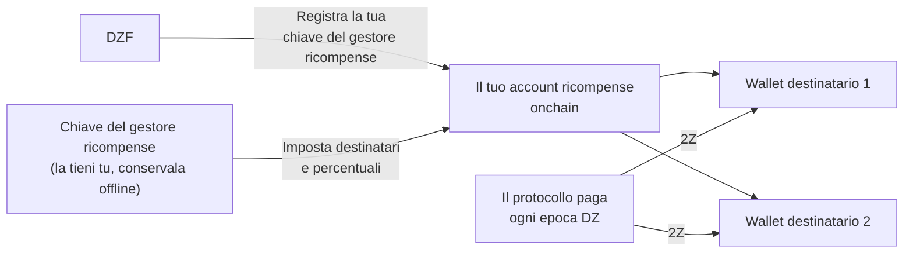

# Gestione delle Ricompense

Guadagni ricompense in [2Z](glossary.md#2z-token) per la larghezza di banda e i dispositivi che contribuisci. Il protocollo paga queste ricompense autonomamente, direttamente ai wallet che designi. Finché non li designi, nessun pagamento può essere effettuato.

!!! warning "Fai questo durante la configurazione dell'account"
    Configura la gestione delle ricompense nella [Fase 2: Configurazione dell'Account](contribute-provisioning.md#phase-2-account-setup), prima che il tuo dispositivo trasporti traffico.

    Le tue ricompense continuano a maturare anche se rimandi questa operazione. Il protocollo non le brucia e non scadono. Ciò che perdi è il pagamento automatico: il processo di pagamento di routine elabora le epoche recenti, quindi qualsiasi epoca trascorsa mentre non hai destinatari configurati dovrà essere pagata manualmente in seguito. Vedi [Se Configuri Questo in Ritardo](#se-configuri-questo-in-ritardo).

---

## Come Funziona

Sono coinvolte tre chiavi. Ognuna svolge un compito diverso, ed è più sicuro tenerle separate.

| Chiave | Cosa fa | Riceve ricompense? |
|--------|---------|-------------------|
| **Chiave di servizio** | Ti identifica come contributore e firma i tuoi comandi CLI. Inoltre nomina il tuo account ricompense onchain. | No |
| **Chiave del gestore ricompense** | Firma le modifiche alla lista dei wallet che ricevono le ricompense. | No |
| **Wallet destinatari** | Contiene i 2Z che il protocollo ti invia. Fino a 8 wallet. | Sì |

La DoubleZero Foundation registra la tua chiave del gestore ricompense associandola alla tua chiave di servizio. Solo DZF può farlo. Dopodiché, solo la tua chiave del gestore ricompense può modificare la lista dei destinatari, e DZF non può reindirizzare le tue ricompense.



---

## Cosa Ti Serve Prima

- Un account contributore onchain. Verifica con `doublezero contributor list`.
- Un wallet Solana da usare come gestore ricompense, con circa 0,01 SOL per pagare le commissioni di transazione.
- Uno o più wallet per ricevere i 2Z.
- La CLI `doublezero-solana`, se vuoi usare la riga di comando invece del portale. Installala con `sudo apt update && sudo apt install doublezero-solana`.

!!! tip "Usa un hardware wallet per la chiave del gestore ricompense"
    La chiave del gestore ricompense controlla dove vanno i tuoi fondi. Conservala su un hardware wallet o comunque offline. Non ha mai bisogno di risiedere su un server e non detiene mai le tue ricompense.

---

## Passo 1: Crea il Tuo Wallet del Gestore Ricompense

Crea un wallet Solana che controlli e con cui puoi firmare. Può essere un hardware wallet, un wallet del browser o un file keypair.

Caricalo con una piccola quantità di SOL, circa 0,01 SOL. Questo serve solo a pagare le commissioni di rete quando modifichi la lista dei destinatari.

Non riutilizzare la tua chiave di servizio per questo. Se la chiave di servizio risiede su un server di gestione, chiunque raggiunga quel server potrebbe reindirizzare le tue ricompense.

---

## Passo 2: Invia la Chiave Pubblica a DZF

Fornisci a DZF la **chiave pubblica** del tuo wallet del gestore ricompense. Non condividere mai la chiave privata.

DZF la registra associandola alla tua chiave di servizio onchain e conferma quando è completato. Non puoi eseguire questo passaggio autonomamente.

!!! tip "Inviala insieme alla tua chiave di servizio"
    Se stai seguendo la [Guida al Provisioning del Dispositivo](contribute-provisioning.md), invia questa chiave pubblica contemporaneamente alla tua chiave di servizio e al nome utente GitHub, nel [Passo 2.4](contribute-provisioning.md#step-24-submit-keys-to-dzf). DZF registra le due chiavi in transazioni separate, quindi inviarle insieme fa risparmiare un passaggio.

Puoi verificare che sia stata registrata:

```bash
doublezero-solana revenue-distribution fetch contributor-rewards \
    --service-key <YourServiceKey1111111111111111111111111111> \
    -u mainnet-beta
```

La colonna `manager` mostra la tua chiave del gestore ricompense. Se è vuota, DZF non l'ha ancora registrata.

---

## Passo 3: Imposta i Tuoi Wallet Destinatari

Ora indica dove devono andare le ricompense. Puoi usare il portale web o la CLI. Entrambi scrivono la stessa cosa onchain.

Regole valide in entrambi i casi:

- Al massimo 8 wallet destinatari.
- Le percentuali devono essere numeri interi e devono sommare esattamente a 100.
- Un destinatario non può avere una quota dello 0%. Rimuovilo invece.

!!! info "Se il tuo accordo con DZF include una condivisione dei ricavi"
    Alcuni contributori hanno un accordo che divide le ricompense con la fondazione, ad esempio quando DZF ha fornito l'hardware. Se questo si applica a te, DZF ti fornisce l'indirizzo e la percentuale da inserire qui. Chiedi a DZF se non sei sicuro.

=== "Portale web"

    1. Vai su [doublezero.xyz/rewards](https://doublezero.xyz/rewards). Il vecchio indirizzo, `rewards.doublezero.xyz`, reindirizza qui.
    2. Collega il tuo wallet del gestore ricompense con il pulsante wallet in alto a destra.
    3. Seleziona la tua chiave di servizio dalla lista nella pagina successiva.
    4. Inserisci l'indirizzo di ogni wallet destinatario e la sua percentuale. Il totale deve essere 100%.
    5. Clicca **Submit** e approva la transazione nel tuo wallet.

=== "CLI"

    Esegui questo comando con il keypair del tuo gestore ricompense come `-k`. Ripeti `--recipient` per ogni wallet.

    ```bash
    doublezero-solana revenue-distribution configure-contributor-rewards \
        --service-key <YourServiceKey1111111111111111111111111111> \
        --recipient <Recipient1111111111111111111111111111111111>:70 \
        --recipient <Recipient2222222222222222222222222222222222>:30 \
        -k /path/to/rewards-manager-keypair.json \
        -u mainnet-beta
    ```

    | Flag | Descrizione |
    |------|-------------|
    | `--service-key` | La tua chiave di servizio come contributore. Questa nomina l'account ricompense onchain. |
    | `--recipient` | Un destinatario nel formato `PUBKEY:PERCENT`. Numeri interi, da 1 a 100, che sommano a 100. Massimo 8. |
    | `-k` | Il keypair del tuo gestore ricompense. La transazione fallisce se questo non è il gestore ricompense registrato. |
    | `-u` | `mainnet-beta`. |

    Aggiungi `--dry-run` prima se vuoi simulare la transazione senza inviarla.

---

## Passo 4: Verifica che Ogni Destinatario Possa Detenere 2Z

Il protocollo invia 2Z con un semplice trasferimento di token. **Non** crea l'account token per te. Se un wallet destinatario non ha un account token 2Z, il pagamento per quell'epoca fallisce.

Il mint 2Z su mainnet è:

```
J6pQQ3FAcJQeWPPGppWRb4nM8jU3wLyYbRrLh7feMfvd
```

Elenca gli account token che un wallet già possiede:

```bash
spl-token accounts --owner <Recipient1111111111111111111111111111111111> -u m
```

Se `J6pQQ3FAcJQeWPPGppWRb4nM8jU3wLyYbRrLh7feMfvd` manca da quella lista, crea l'account una volta:

```bash
spl-token create-account J6pQQ3FAcJQeWPPGppWRb4nM8jU3wLyYbRrLh7feMfvd \
    --owner <Recipient1111111111111111111111111111111111> \
    --fee-payer /path/to/any-funded-keypair.json \
    -u m
```

Qualsiasi wallet con fondi può pagare per questo. Costa una piccola quantità di SOL e deve essere fatto solo una volta per wallet destinatario.

!!! note "I wallet che già detengono 2Z vanno bene"
    Se il wallet ha già ricevuto 2Z in precedenza, l'account token esiste e puoi saltare questo passaggio.

---

## Passo 5: Verifica

Controlla cosa è ora registrato onchain:

```bash
doublezero-solana revenue-distribution fetch contributor-rewards \
    --service-key <YourServiceKey1111111111111111111111111111> \
    --view recipients \
    -u mainnet-beta
```

Output di esempio:

```
| index | recipient                                    | ata                                          | proportion |
|-------|----------------------------------------------|----------------------------------------------|------------|
|     0 | Recipient1111111111111111111111111111111111  | Ata11111111111111111111111111111111111111111 |     70.00% |
|     1 | Recipient2222222222222222222222222222222222  | Ata22222222222222222222222222222222222222222 |     30.00% |
```

La colonna `ata` è l'account token 2Z in cui ogni destinatario riceverà il pagamento. Verifica che la colonna `proportion` sommi al 100%.

---

## Quando Arrivano le Ricompense

- Le ricompense vengono calcolate per **epoca DZ**, che è l'epoca del DoubleZero Ledger. Un'epoca DZ dura circa due giorni.
- Il pagamento per un'epoca avviene circa 10 epoche DZ dopo la fine di quell'epoca, quindi circa 20 giorni dopo. Questo ritardo copre la contabilità dell'epoca.
- I pagamenti sono automatici. Non devi reclamarli e non devi eseguire nulla.
- Una volta configurati i destinatari, i pagamenti iniziano ad arrivare entro un paio di giorni man mano che le epoche successive vengono elaborate. Le epoche trascorse prima della configurazione dei destinatari sono una questione separata, vedi [Se Configuri Questo in Ritardo](#se-configuri-questo-in-ritardo).
- Un'epoca DZ e un'epoca Solana non hanno la stessa durata. Questa differenza si accumula nel tempo, quindi di tanto in tanto un'epoca DZ mostra zero ricompense. Questo è normale.

---

## Dove Vedere le Tue Ricompense

**Vista aggregata.** L'[Economic Hub](https://doublezero.xyz/economic-hub) mostra le ricompense dei contributori a livello di rete.

**Per epoca.** Chiedi al protocollo cosa ha pagato una determinata epoca DZ:

```bash
doublezero-solana revenue-distribution fetch distribution \
    -e <DZ_EPOCH> --view rewards -u mainnet-beta
```

L'output elenca ogni contributore con la sua quota, la sua ricompensa in 2Z e se il pagamento è stato effettuato. Cerca il tuo codice contributore nella colonna `contributor`.

Per vedere in quale epoca DZ si trova attualmente la rete, ometti `-e`:

```bash
doublezero-solana revenue-distribution fetch distribution -u mainnet-beta
```

!!! note "Le epoche recenti non sono ancora finalizzate"
    Richiedere un'epoca le cui ricompense non sono ancora state calcolate restituisce `Rewards calculation is not finalized yet`. Prova con un'epoca più vecchia.

---

## Se Configuri Questo in Ritardo

Le ricompense vengono calcolate per ogni epoca in cui hai contribuito, indipendentemente dal fatto che avessi o meno dei destinatari configurati in quel momento. Queste ricompense non vengono bruciate e non scadono. Restano nell'account di distribuzione di quell'epoca finché qualcuno non invia il pagamento.

Il problema è che nessuno le invia per te a posteriori. Il processo di pagamento di routine elabora le epoche recenti, quindi un'epoca trascorsa mentre la tua lista destinatari era vuota resta non pagata finché non viene inviata manualmente.

Per trovare quali epoche sono interessate, cerca le righe con il tuo codice contributore dove `distributed` è `no` e la ricompensa è superiore a zero:

```bash
doublezero-solana revenue-distribution fetch distribution \
    -e <DZ_EPOCH> --view rewards -u mainnet-beta
```

L'invio del pagamento è permissionless, quindi una volta configurati i destinatari, qualsiasi wallet con fondi può farlo, incluso il tuo:

```bash
doublezero-solana revenue-distribution relay distribute-rewards \
    -e <DZ_EPOCH> -k /path/to/funded-keypair.json -u mainnet-beta
```

Aggiungi `--dry-run` prima per simulare senza inviare nulla. Il comando elabora ogni contributore in quell'epoca e salta quelli già pagati, quindi è sicuro da eseguire.

Se preferisci non farlo tu stesso, chiedi a DZF di inviare le epoche per te.

---

## Modificare i Destinatari Successivamente

Ripeti il [Passo 3](#passo-3-imposta-i-tuoi-wallet-destinatari) in qualsiasi momento. La nuova lista sostituisce completamente quella vecchia, quindi includi ogni destinatario che desideri ancora, non solo quelli che stai aggiungendo. Le percentuali devono sommare di nuovo a 100.

Ricordati del [Passo 4](#passo-4-verifica-che-ogni-destinatario-possa-detenere-2z) per ogni wallet che aggiungi.

---

## Bloccare la Chiave del Gestore Ricompense

Per impostazione predefinita DZF può cambiare la tua chiave del gestore ricompense, il che è utile se perdi l'accesso ad essa. Se preferisci escludere questa possibilità, puoi bloccarla:

```bash
doublezero-solana revenue-distribution configure-contributor-rewards \
    --service-key <YourServiceKey1111111111111111111111111111> \
    --block-protocol-management \
    -k /path/to/rewards-manager-keypair.json \
    -u mainnet-beta
```

!!! danger "Non bloccare una chiave che potresti perdere"
    Una volta bloccata la gestione, nessuno può sostituire la tua chiave del gestore ricompense, inclusa DZF. Se poi perdi quella chiave non potrai più cambiare dove vanno le tue ricompense. Blocca solo se la chiave è salvata in backup e al sicuro.

Per consentirla di nuovo, esegui lo stesso comando con `--allow-protocol-management`.

---

## Risoluzione dei Problemi

**La colonna `manager` è vuota.**
DZF non ha ancora registrato la tua chiave del gestore ricompense. Invia loro la chiave pubblica e chiedi conferma.

**`Invalid rewards manager`.**
Il keypair con cui hai firmato non è il gestore ricompense registrato. Verifica di aver passato il file corretto a `-k`, o il wallet corretto nel portale.

**`Invalid recipients`.**
Le tue percentuali non sommano esattamente a 100, hai elencato più di 8 destinatari, oppure uno di essi ha una quota dello 0%.

**Le ricompense risultano guadagnate ma non arriva nulla.**
Due cause comuni. O non sono configurati destinatari, quindi non c'è dove inviarle, oppure un wallet destinatario non ha un account token 2Z. Segui il [Passo 4](#passo-4-verifica-che-ogni-destinatario-possa-detenere-2z) e il [Passo 5](#passo-5-verifica). Una volta risolto, le epoche future vengono pagate automaticamente. Le epoche già trascorse necessitano di [un pagamento manuale](#se-configuri-questo-in-ritardo).

**Le tue ricompense per un'epoca recente sono 0.**
Le ricompense hanno un ritardo di circa 10 epoche DZ. Controlla un'epoca che sia almeno così vecchia. Epoche occasionali con zero sono anche normali, vedi [Quando Arrivano le Ricompense](#quando-arrivano-le-ricompense).

---

## Prossimi Passi

Torna alla [Checklist di Onboarding](contribute-overview.md#onboarding-checklist), oppure prosegui con [Operazioni](contribute-operations.md).