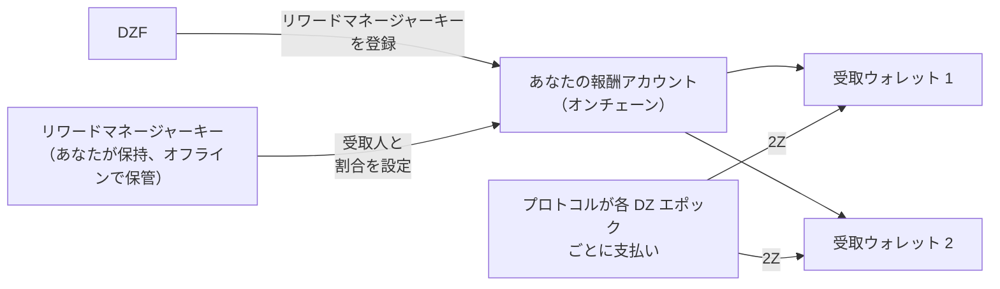

# リワード管理

あなたが提供する帯域幅やデバイスに対して、[2Z](glossary.md#2z-token) で報酬を獲得できます。プロトコルはこれらの報酬を、あなたが指定したウォレットに直接自動的に支払います。ウォレットを指定するまで、報酬は支払われません。

!!! warning "アカウントセットアップ時に行ってください"
    リワード管理は、デバイスがトラフィックを処理する前に [フェーズ 2: アカウントセットアップ](contribute-provisioning.md#phase-2-account-setup) で設定してください。

    この設定を後回しにしても報酬は引き続き蓄積されます。プロトコルは報酬をバーンせず、有効期限もありません。失われるのは自動支払いです。定期的な支払いプロセスは直近のエポックを処理するため、受取人が設定されていない間に過ぎたエポックの報酬は、後から手動で支払う必要があります。[設定が遅れた場合](#if-you-set-this-up-late)を参照してください。

---

## 仕組み

3 つの鍵が関係しています。それぞれ異なる役割を持ち、分離して管理する方が安全です。

| 鍵 | 役割 | 報酬を受け取る？ |
|-----|--------------|-------------------|
| **サービスキー** | コントリビューターとしてあなたを識別し、CLI コマンドに署名します。また、オンチェーンの報酬アカウントの名前にもなります。 | いいえ |
| **リワードマネージャーキー** | 報酬を受け取るウォレットリストの変更に署名します。 | いいえ |
| **受取ウォレット** | プロトコルから送られる 2Z を保持します。最大 8 ウォレット。 | はい |

DoubleZero Foundation（DZF）がサービスキーに対してリワードマネージャーキーを登録します。この操作は DZF のみが行えます。登録後は、受取人リストを変更できるのはリワードマネージャーキーだけとなり、DZF があなたの報酬をリダイレクトすることはできません。



---

## 事前に必要なもの

- オンチェーンのコントリビューターアカウント。`doublezero contributor list` で確認できます。
- リワードマネージャーとして使用する Solana ウォレット。トランザクション手数料を支払うために約 0.01 SOL を保持してください。
- 2Z を受け取るための 1 つ以上のウォレット。
- ポータルではなくコマンドラインを使用する場合は `doublezero-solana` CLI。`sudo apt update && sudo apt install doublezero-solana` でインストールできます。

!!! tip "リワードマネージャーキーにはハードウェアウォレットを使用してください"
    リワードマネージャーキーはあなたの資金の送付先を管理します。ハードウェアウォレットまたはその他のオフライン手段で保管してください。サーバー上に置く必要はなく、報酬を保持することもありません。

---

## ステップ 1: リワードマネージャーウォレットの作成

あなたが管理し、署名できる Solana ウォレットを作成します。ハードウェアウォレット、ブラウザウォレット、またはキーペアファイルのいずれでも構いません。

少額の SOL（約 0.01 SOL）をチャージしてください。これは受取人リストを変更する際のネットワーク手数料の支払いにのみ使用されます。

サービスキーをこの用途で再利用しないでください。サービスキーが管理サーバー上にある場合、そのサーバーにアクセスできる者が報酬の送付先を変更できてしまいます。

---

## ステップ 2: 公開鍵を DZF に送信

リワードマネージャーウォレットの**公開鍵**を DZF に送ります。秘密鍵は絶対に共有しないでください。

DZF がオンチェーンであなたのサービスキーに対してそれを登録し、完了を確認します。このステップを自分で行うことはできません。

!!! tip "サービスキーと一緒に送信してください"
    [デバイスプロビジョニングガイド](contribute-provisioning.md)に沿って作業している場合は、[ステップ 2.4](contribute-provisioning.md#step-24-submit-keys-to-dzf) でサービスキーと GitHub ユーザー名と一緒にこの公開鍵を送信してください。DZF は 2 つの鍵を別々のトランザクションで登録するため、同時に送ることでやり取りの往復を節約できます。

登録が完了したか確認できます：

```bash
doublezero-solana revenue-distribution fetch contributor-rewards \
    --service-key <YourServiceKey1111111111111111111111111111> \
    -u mainnet-beta
```

`manager` 列にリワードマネージャーキーが表示されます。空の場合、DZF がまだ登録していません。

---

## ステップ 3: 受取ウォレットの設定

報酬の送付先を指定します。Web ポータルまたは CLI を使用できます。どちらもオンチェーンに同じ内容を書き込みます。

どちらの方法でも適用されるルール：

- 受取ウォレットは最大 8 つ。
- 割合は整数で、合計がちょうど 100 になる必要があります。
- 受取人に 0% のシェアを設定することはできません。代わりに削除してください。

!!! info "DZF との契約にレベニューシェアが含まれている場合"
    一部のコントリビューターは、DZF がハードウェアを提供した場合など、報酬をファウンデーションと分配する契約を結んでいます。該当する場合、DZF がここに入力するアドレスと割合を提供します。不明な場合は DZF にお問い合わせください。

=== "Web ポータル"

    1. [doublezero.xyz/rewards](https://doublezero.xyz/rewards) にアクセスします。旧アドレス `rewards.doublezero.xyz` はここにリダイレクトされます。
    2. 右上のウォレットボタンでリワードマネージャーウォレットを接続します。
    3. 次のページのリストからサービスキーを選択します。
    4. 各受取ウォレットのアドレスと割合を入力します。合計は 100% にする必要があります。
    5. **Submit** をクリックし、ウォレットでトランザクションを承認します。

=== "CLI"

    リワードマネージャーのキーペアを `-k` として指定して実行します。ウォレットごとに `--recipient` を繰り返します。

    ```bash
    doublezero-solana revenue-distribution configure-contributor-rewards \
        --service-key <YourServiceKey1111111111111111111111111111> \
        --recipient <Recipient1111111111111111111111111111111111>:70 \
        --recipient <Recipient2222222222222222222222222222222222>:30 \
        -k /path/to/rewards-manager-keypair.json \
        -u mainnet-beta
    ```

    | フラグ | 説明 |
    |------|-------------|
    | `--service-key` | コントリビューターのサービスキー。オンチェーンの報酬アカウントの名前になります。 |
    | `--recipient` | `PUBKEY:PERCENT` 形式の受取人。整数、1 から 100、合計 100。最大 8 つ。 |
    | `-k` | リワードマネージャーのキーペア。登録されたリワードマネージャーでない場合、トランザクションは失敗します。 |
    | `-u` | `mainnet-beta`。 |

    送信せずにトランザクションをシミュレーションしたい場合は、先に `--dry-run` を追加してください。

---

## ステップ 4: 各受取人が 2Z を保持できるか確認

プロトコルはプレーンなトークン転送で 2Z を送信します。トークンアカウントを自動で作成することは**ありません**。受取ウォレットに 2Z トークンアカウントがない場合、そのエポックの支払いは失敗します。

メインネットの 2Z ミントアドレスは：

```
J6pQQ3FAcJQeWPPGppWRb4nM8jU3wLyYbRrLh7feMfvd
```

ウォレットが既に持っているトークンアカウントを一覧表示します：

```bash
spl-token accounts --owner <Recipient1111111111111111111111111111111111> -u m
```

`J6pQQ3FAcJQeWPPGppWRb4nM8jU3wLyYbRrLh7feMfvd` がリストにない場合、一度だけアカウントを作成します：

```bash
spl-token create-account J6pQQ3FAcJQeWPPGppWRb4nM8jU3wLyYbRrLh7feMfvd \
    --owner <Recipient1111111111111111111111111111111111> \
    --fee-payer /path/to/any-funded-keypair.json \
    -u m
```

任意の資金が入ったウォレットで支払えます。少額の SOL がかかり、受取ウォレットごとに一度だけ行う必要があります。

!!! note "既に 2Z を保持しているウォレットは問題ありません"
    そのウォレットが 2Z を受け取ったことがある場合、トークンアカウントは既に存在しているため、このステップはスキップできます。

---

## ステップ 5: 確認

オンチェーンに記録されている内容を確認します：

```bash
doublezero-solana revenue-distribution fetch contributor-rewards \
    --service-key <YourServiceKey1111111111111111111111111111> \
    --view recipients \
    -u mainnet-beta
```

出力例：

```
| index | recipient                                    | ata                                          | proportion |
|-------|----------------------------------------------|----------------------------------------------|------------|
|     0 | Recipient1111111111111111111111111111111111  | Ata11111111111111111111111111111111111111111 |     70.00% |
|     1 | Recipient2222222222222222222222222222222222  | Ata22222222222222222222222222222222222222222 |     30.00% |
```

`ata` 列は各受取人に支払われる 2Z トークンアカウントです。`proportion` 列の合計が 100% になっていることを確認してください。

---

## 報酬が届くタイミング

- 報酬は **DZ エポック**（DoubleZero Ledger のエポック）ごとに計算されます。DZ エポックはおよそ 2 日間です。
- エポックの支払いは、そのエポック終了後約 10 DZ エポック（約 20 日後）に行われます。この遅延はエポックの会計処理をカバーするためです。
- 支払いは自動的に行われます。請求する必要はなく、何かを実行する必要もありません。
- 受取人を設定すると、次のエポックが処理されるにつれて数日以内に支払いが届き始めます。受取人を設定する前に過ぎたエポックについては別の問題です。[設定が遅れた場合](#if-you-set-this-up-late)を参照してください。
- DZ エポックと Solana エポックは長さが異なります。この差は時間とともに蓄積されるため、時折 DZ エポックの報酬がゼロになることがあります。これは正常です。

---

## 報酬の確認方法

**集計ビュー。** [Economic Hub](https://doublezero.xyz/economic-hub) でネットワークレベルのコントリビューター報酬を確認できます。

**エポックごと。** 特定の DZ エポックの支払い内容をプロトコルに問い合わせます：

```bash
doublezero-solana revenue-distribution fetch distribution \
    -e <DZ_EPOCH> --view rewards -u mainnet-beta
```

出力には、各コントリビューターのシェア、2Z での報酬額、および支払いが行われたかどうかが一覧表示されます。`contributor` 列であなたのコントリビューターコードを見つけてください。

現在のネットワークの DZ エポックを確認するには、`-e` を省略します：

```bash
doublezero-solana revenue-distribution fetch distribution -u mainnet-beta
```

!!! note "直近のエポックはまだ確定していません"
    報酬がまだ計算されていないエポックを問い合わせると `Rewards calculation is not finalized yet` と返されます。もっと古いエポックを試してください。

---

## 設定が遅れた場合

報酬は、受取人が設定されていたかどうかに関わらず、あなたが貢献したすべてのエポックについて計算されます。これらの報酬はバーンされず、有効期限もありません。誰かが支払いを送信するまで、そのエポックの分配アカウントに残り続けます。

問題は、事後に自動で送信してくれるものがないことです。定期的な支払いプロセスは直近のエポックを処理するため、受取人リストが空の間に過ぎたエポックは、手動で送信されるまで未払いのままです。

影響を受けるエポックを見つけるには、あなたのコントリビューターコードで `distributed` が `no` かつ報酬がゼロ以上の行を探します：

```bash
doublezero-solana revenue-distribution fetch distribution \
    -e <DZ_EPOCH> --view rewards -u mainnet-beta
```

支払いの送信はパーミッションレスなので、受取人が設定された後は、あなた自身を含む任意の資金が入ったウォレットで実行できます：

```bash
doublezero-solana revenue-distribution relay distribute-rewards \
    -e <DZ_EPOCH> -k /path/to/funded-keypair.json -u mainnet-beta
```

送信せずにシミュレーションするには、先に `--dry-run` を追加してください。このコマンドはそのエポックのすべてのコントリビューターを処理し、既に支払い済みのものはスキップするため、安全に実行できます。

自分で行いたくない場合は、DZF にエポックの送信を依頼してください。

---

## 受取人の変更

いつでも[ステップ 3](#step-3-set-your-recipient-wallets) を繰り返すことができます。新しいリストは古いリストを完全に置き換えるため、追加するものだけでなく、引き続き必要なすべての受取人を含めてください。割合は再び合計 100 にする必要があります。

追加するウォレットについては[ステップ 4](#step-4-check-each-recipient-can-hold-2z) を忘れないでください。

---

## リワードマネージャーキーのロック

デフォルトでは、DZF はリワードマネージャーキーを変更できます。これはキーへのアクセスを失った場合に便利です。この可能性を排除したい場合は、ブロックできます：

```bash
doublezero-solana revenue-distribution configure-contributor-rewards \
    --service-key <YourServiceKey1111111111111111111111111111> \
    --block-protocol-management \
    -k /path/to/rewards-manager-keypair.json \
    -u mainnet-beta
```

!!! danger "失う可能性のあるキーをロックしないでください"
    管理がブロックされると、DZF を含め誰もリワードマネージャーキーを置き換えることができなくなります。そのキーを紛失した場合、報酬の送付先を変更できなくなります。キーがバックアップされ安全に保管されている場合にのみブロックしてください。

再び許可するには、同じコマンドを `--allow-protocol-management` で実行します。

---

## トラブルシューティング

**`manager` 列が空。**
DZF がまだリワードマネージャーキーを登録していません。公開鍵を送信し、確認を依頼してください。

**`Invalid rewards manager`。**
署名に使用したキーペアが登録されたリワードマネージャーではありません。`-k` に正しいファイルを渡したか、ポータルで正しいウォレットを使用しているか確認してください。

**`Invalid recipients`。**
割合の合計がちょうど 100 になっていないか、受取人が 8 つを超えているか、いずれかの受取人が 0% のシェアになっています。

**報酬は獲得済みと表示されるが届かない。**
一般的な原因が 2 つあります。受取人が設定されていないため送付先がないか、受取ウォレットに 2Z トークンアカウントがないかのいずれかです。[ステップ 4](#step-4-check-each-recipient-can-hold-2z) と[ステップ 5](#step-5-verify) を確認してください。修正後、将来のエポックは自動的に支払われます。既に過ぎたエポックには[手動での支払い](#if-you-set-this-up-late)が必要です。

**直近のエポックの報酬が 0。**
報酬には約 10 DZ エポックの遅延があります。少なくともそれだけ古いエポックを確認してください。時折ゼロのエポックが発生するのも正常です。[報酬が届くタイミング](#when-rewards-arrive)を参照してください。

---

## 次のステップ

[オンボーディングチェックリスト](contribute-overview.md#onboarding-checklist)に戻るか、[運用](contribute-operations.md)に進んでください。