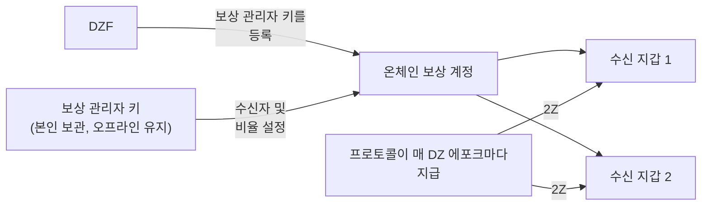

# 보상 관리

기여한 대역폭과 장치에 대해 [2Z](glossary.md#2z-token)로 보상을 받습니다. 프로토콜은 지정한 지갑으로 직접 보상을 자동 지급합니다. 지갑을 지정하기 전까지는 어떤 보상도 지급되지 않습니다.

!!! warning "계정 설정 시 이 작업을 수행하세요"
    [2단계: 계정 설정](contribute-provisioning.md#phase-2-account-setup)에서 장치가 트래픽을 처리하기 전에 보상 관리를 설정하세요.

    나중에 설정하더라도 보상은 계속 적립됩니다. 프로토콜은 보상을 소각하지 않으며 만료되지도 않습니다. 잃게 되는 것은 자동 지급입니다: 정기 지급 프로세스는 최근 에포크를 순차적으로 처리하므로, 수신자가 설정되지 않은 상태에서 지나간 에포크의 보상은 이후 수동으로 지급해야 합니다. [늦게 설정한 경우](#if-you-set-this-up-late)를 참조하세요.

---

## 작동 방식

세 가지 키가 관련됩니다. 각 키는 서로 다른 역할을 하며, 분리하여 보관하는 것이 더 안전합니다.

| 키 | 역할 | 보상 수신 여부 |
|-----|--------------|-------------------|
| **서비스 키** | 기여자로서의 신원을 확인하고 CLI 명령에 서명합니다. 또한 온체인에서 보상 계정의 이름이 됩니다. | 아니오 |
| **보상 관리자 키** | 보상을 수신하는 지갑 목록의 변경 사항에 서명합니다. | 아니오 |
| **수신 지갑** | 프로토콜이 보내는 2Z를 보관합니다. 최대 8개 지갑. | 예 |

DoubleZero Foundation(DZF)이 서비스 키에 보상 관리자 키를 등록합니다. DZF만 이 작업을 수행할 수 있습니다. 등록 이후에는 보상 관리자 키만 수신자 목록을 변경할 수 있으며, DZF는 보상을 다른 곳으로 돌릴 수 없습니다.



---

## 사전 준비 사항

- 온체인 기여자 계정. `doublezero contributor list`로 확인하세요.
- 보상 관리자로 사용할 Solana 지갑. 트랜잭션 수수료 지불을 위해 약 0.01 SOL이 필요합니다.
- 2Z를 수신할 하나 이상의 지갑.
- 포털 대신 명령줄을 사용하려면 `doublezero-solana` CLI가 필요합니다. `sudo apt update && sudo apt install doublezero-solana`로 설치하세요.

!!! tip "보상 관리자 키에는 하드웨어 지갑을 사용하세요"
    보상 관리자 키는 보상이 어디로 전송되는지를 제어합니다. 하드웨어 지갑에 보관하거나 오프라인으로 유지하세요. 서버에 놓아둘 필요가 없으며, 보상을 직접 보관하지도 않습니다.

---

## 1단계: 보상 관리자 지갑 생성

본인이 관리하고 서명할 수 있는 Solana 지갑을 생성하세요. 하드웨어 지갑, 브라우저 지갑 또는 키페어 파일이 될 수 있습니다.

약 0.01 SOL 정도의 소량의 SOL을 충전하세요. 이는 수신자 목록을 변경할 때 네트워크 수수료를 지불하는 데만 사용됩니다.

이 용도로 서비스 키를 재사용하지 마세요. 서비스 키가 관리 서버에 있는 경우, 해당 서버에 접근하는 누구든 보상을 다른 곳으로 돌릴 수 있습니다.

---

## 2단계: 공개 키를 DZF에 전송

보상 관리자 지갑의 **공개 키**를 DZF에 전달하세요. 개인 키는 절대 공유하지 마세요.

DZF가 서비스 키에 대해 온체인으로 등록하고 완료되면 확인해 줍니다. 이 단계는 직접 수행할 수 없습니다.

!!! tip "서비스 키와 함께 전송하세요"
    [장치 프로비저닝 가이드](contribute-provisioning.md)를 따라 진행 중이라면, [2.4단계](contribute-provisioning.md#step-24-submit-keys-to-dzf)에서 서비스 키 및 GitHub 사용자명과 함께 이 공개 키를 전송하세요. DZF는 두 키를 별도의 트랜잭션으로 등록하므로, 함께 보내면 왕복 과정을 줄일 수 있습니다.

등록 확인 방법:

```bash
doublezero-solana revenue-distribution fetch contributor-rewards \
    --service-key <YourServiceKey1111111111111111111111111111> \
    -u mainnet-beta
```

`manager` 열에 보상 관리자 키가 표시됩니다. 비어 있다면 DZF가 아직 등록하지 않은 것입니다.

---

## 3단계: 수신 지갑 설정

보상이 어디로 전송되어야 하는지 지정합니다. 웹 포털 또는 CLI를 사용할 수 있습니다. 둘 다 동일한 내용을 온체인에 기록합니다.

두 방법 모두에 적용되는 규칙:

- 수신 지갑은 최대 8개.
- 비율은 정수여야 하며 합계가 정확히 100이어야 합니다.
- 수신자의 비율을 0%로 설정할 수 없습니다. 대신 제거하세요.

!!! info "DZF와의 계약에 수익 분배가 포함된 경우"
    일부 기여자는 재단과 보상을 분배하는 계약을 맺고 있습니다. 예를 들어 DZF가 하드웨어를 제공한 경우입니다. 해당되는 경우 DZF가 여기에 입력할 주소와 비율을 알려줍니다. 확실하지 않으면 DZF에 문의하세요.

=== "웹 포털"

    1. [doublezero.xyz/rewards](https://doublezero.xyz/rewards)로 이동하세요. 이전 주소인 `rewards.doublezero.xyz`는 여기로 리디렉션됩니다.
    2. 오른쪽 상단의 지갑 버튼으로 보상 관리자 지갑을 연결하세요.
    3. 다음 페이지의 목록에서 서비스 키를 선택하세요.
    4. 각 수신 지갑 주소와 비율을 입력하세요. 합계는 100%여야 합니다.
    5. **Submit**을 클릭하고 지갑에서 트랜잭션을 승인하세요.

=== "CLI"

    보상 관리자 키페어를 `-k`로 지정하여 실행하세요. 각 지갑마다 `--recipient`를 반복하세요.

    ```bash
    doublezero-solana revenue-distribution configure-contributor-rewards \
        --service-key <YourServiceKey1111111111111111111111111111> \
        --recipient <Recipient1111111111111111111111111111111111>:70 \
        --recipient <Recipient2222222222222222222222222222222222>:30 \
        -k /path/to/rewards-manager-keypair.json \
        -u mainnet-beta
    ```

    | 플래그 | 설명 |
    |------|-------------|
    | `--service-key` | 기여자 서비스 키. 온체인에서 보상 계정의 이름이 됩니다. |
    | `--recipient` | `PUBKEY:PERCENT` 형식의 수신자. 정수, 1~100, 합계 100. 최대 8개. |
    | `-k` | 보상 관리자 키페어. 등록된 보상 관리자가 아니면 트랜잭션이 실패합니다. |
    | `-u` | `mainnet-beta`. |

    트랜잭션을 전송하지 않고 시뮬레이션하려면 먼저 `--dry-run`을 추가하세요.

---

## 4단계: 각 수신 지갑이 2Z를 보관할 수 있는지 확인

프로토콜은 일반 토큰 전송으로 2Z를 보냅니다. 토큰 계정을 대신 생성해 주지 **않습니다**. 수신 지갑에 2Z 토큰 계정이 없으면 해당 에포크의 지급이 실패합니다.

메인넷의 2Z 민트 주소:

```
J6pQQ3FAcJQeWPPGppWRb4nM8jU3wLyYbRrLh7feMfvd
```

지갑이 이미 보유한 토큰 계정 목록 확인:

```bash
spl-token accounts --owner <Recipient1111111111111111111111111111111111> -u m
```

`J6pQQ3FAcJQeWPPGppWRb4nM8jU3wLyYbRrLh7feMfvd`가 목록에 없으면 한 번만 계정을 생성하세요:

```bash
spl-token create-account J6pQQ3FAcJQeWPPGppWRb4nM8jU3wLyYbRrLh7feMfvd \
    --owner <Recipient1111111111111111111111111111111111> \
    --fee-payer /path/to/any-funded-keypair.json \
    -u m
```

잔액이 있는 아무 지갑이나 이 비용을 지불할 수 있습니다. 소량의 SOL이 필요하며 수신 지갑당 한 번만 수행하면 됩니다.

!!! note "이미 2Z를 보유한 지갑은 괜찮습니다"
    지갑이 이전에 2Z를 수신한 적이 있다면 토큰 계정이 이미 존재하므로 이 단계를 건너뛸 수 있습니다.

---

## 5단계: 확인

온체인에 기록된 내용을 확인하세요:

```bash
doublezero-solana revenue-distribution fetch contributor-rewards \
    --service-key <YourServiceKey1111111111111111111111111111> \
    --view recipients \
    -u mainnet-beta
```

출력 예시:

```
| index | recipient                                    | ata                                          | proportion |
|-------|----------------------------------------------|----------------------------------------------|------------|
|     0 | Recipient1111111111111111111111111111111111  | Ata11111111111111111111111111111111111111111 |     70.00% |
|     1 | Recipient2222222222222222222222222222222222  | Ata22222222222222222222222222222222222222222 |     30.00% |
```

`ata` 열은 각 수신자가 보상을 받을 2Z 토큰 계정입니다. `proportion` 열의 합계가 100%인지 확인하세요.

---

## 보상 도착 시점

- 보상은 **DZ 에포크**(DoubleZero Ledger의 에포크) 단위로 산정됩니다. DZ 에포크는 약 2일 주기입니다.
- 에포크에 대한 지급은 해당 에포크 종료 후 약 10 DZ 에포크(약 20일 후)에 이루어집니다. 이 지연은 에포크에 대한 정산 기간입니다.
- 지급은 자동입니다. 청구할 필요도, 별도로 실행할 것도 없습니다.
- 수신자가 설정되면 다음 에포크가 처리되면서 며칠 내에 지급이 시작됩니다. 수신자를 설정하기 전에 지나간 에포크는 별도의 문제입니다. [늦게 설정한 경우](#if-you-set-this-up-late)를 참조하세요.
- DZ 에포크와 Solana 에포크는 길이가 같지 않습니다. 이 차이가 시간이 지남에 따라 누적되므로 가끔 DZ 에포크의 보상이 0으로 표시됩니다. 이는 정상입니다.

---

## 보상 확인 방법

**종합 뷰.** [Economic Hub](https://doublezero.xyz/economic-hub)에서 네트워크 수준의 기여자 보상을 확인할 수 있습니다.

**에포크별.** 특정 DZ 에포크의 지급 내역을 프로토콜에 조회합니다:

```bash
doublezero-solana revenue-distribution fetch distribution \
    -e <DZ_EPOCH> --view rewards -u mainnet-beta
```

출력에는 모든 기여자의 지분, 2Z 보상 금액, 지급 완료 여부가 나열됩니다. `contributor` 열에서 본인의 기여자 코드를 찾으세요.

현재 네트워크의 DZ 에포크를 확인하려면 `-e`를 생략하세요:

```bash
doublezero-solana revenue-distribution fetch distribution -u mainnet-beta
```

!!! note "최근 에포크는 아직 확정되지 않았습니다"
    보상이 아직 산정되지 않은 에포크를 조회하면 `Rewards calculation is not finalized yet`이 반환됩니다. 더 오래된 에포크를 조회하세요.

---

## 늦게 설정한 경우

보상은 수신자 설정 여부와 관계없이 기여한 모든 에포크에 대해 산정됩니다. 이 보상은 소각되지 않으며 만료되지도 않습니다. 누군가가 지급을 제출할 때까지 해당 에포크의 분배 계정에 남아 있습니다.

문제는 사후에 자동으로 제출해 주는 것이 없다는 점입니다. 정기 지급 프로세스는 최근 에포크를 처리하므로, 수신자 목록이 비어 있는 동안 지나간 에포크는 수동으로 제출하기 전까지 미지급 상태로 남습니다.

영향을 받는 에포크를 찾으려면 기여자 코드가 있는 행 중 `distributed`가 `no`이고 보상이 0보다 큰 행을 찾으세요:

```bash
doublezero-solana revenue-distribution fetch distribution \
    -e <DZ_EPOCH> --view rewards -u mainnet-beta
```

지급 제출은 권한 없이 누구나 할 수 있으므로, 수신자가 설정된 후에는 잔액이 있는 아무 지갑이나(본인 지갑 포함) 수행할 수 있습니다:

```bash
doublezero-solana revenue-distribution relay distribute-rewards \
    -e <DZ_EPOCH> -k /path/to/funded-keypair.json -u mainnet-beta
```

전송하지 않고 시뮬레이션하려면 먼저 `--dry-run`을 추가하세요. 이 명령은 해당 에포크의 모든 기여자를 처리하고 이미 지급된 것은 건너뛰므로 안전하게 실행할 수 있습니다.

직접 하고 싶지 않다면 DZF에 해당 에포크의 제출을 요청하세요.

---

## 수신자 나중에 변경하기

언제든지 [3단계](#step-3-set-your-recipient-wallets)를 반복하세요. 새 목록이 기존 목록을 완전히 대체하므로, 추가하는 수신자뿐만 아니라 유지하려는 모든 수신자를 포함하세요. 비율은 다시 합계가 100이어야 합니다.

추가하는 모든 지갑에 대해 [4단계](#step-4-check-each-recipient-can-hold-2z)를 확인하세요.

---

## 보상 관리자 키 잠금

기본적으로 DZF는 보상 관리자 키를 변경할 수 있으며, 이는 키에 대한 접근 권한을 잃었을 때 유용합니다. 이를 차단하고 싶다면 다음과 같이 잠글 수 있습니다:

```bash
doublezero-solana revenue-distribution configure-contributor-rewards \
    --service-key <YourServiceKey1111111111111111111111111111> \
    --block-protocol-management \
    -k /path/to/rewards-manager-keypair.json \
    -u mainnet-beta
```

!!! danger "분실할 수 있는 키를 잠그지 마세요"
    관리가 차단되면 DZF를 포함하여 아무도 보상 관리자 키를 교체할 수 없습니다. 이후 해당 키를 분실하면 보상 전송 대상을 더 이상 변경할 수 없습니다. 키가 백업되어 있고 안전한 경우에만 잠그세요.

다시 허용하려면 동일한 명령에 `--allow-protocol-management`을 사용하세요.

---

## 문제 해결

**`manager` 열이 비어 있음.**
DZF가 아직 보상 관리자 키를 등록하지 않았습니다. 공개 키를 보내고 확인을 요청하세요.

**`Invalid rewards manager`.**
서명에 사용한 키페어가 등록된 보상 관리자가 아닙니다. `-k`에 올바른 파일을 전달했는지, 또는 포털에서 올바른 지갑을 사용했는지 확인하세요.

**`Invalid recipients`.**
비율의 합계가 정확히 100이 아니거나, 수신자가 8개를 초과했거나, 수신자 중 0% 지분이 있습니다.

**보상이 적립되었으나 아무것도 도착하지 않음.**
두 가지 일반적인 원인이 있습니다. 수신자가 설정되지 않아 보낼 곳이 없거나, 수신 지갑에 2Z 토큰 계정이 없는 경우입니다. [4단계](#step-4-check-each-recipient-can-hold-2z)와 [5단계](#step-5-verify)를 확인하세요. 문제가 해결되면 이후 에포크는 자동으로 지급됩니다. 이미 지나간 에포크는 [수동 지급](#if-you-set-this-up-late)이 필요합니다.

**최근 에포크의 보상이 0임.**
보상에는 약 10 DZ 에포크의 지연이 있습니다. 최소 그 이상 경과한 에포크를 확인하세요. 간헐적인 0 에포크도 정상입니다. [보상 도착 시점](#when-rewards-arrive)을 참조하세요.

---

## 다음 단계

[온보딩 체크리스트](contribute-overview.md#onboarding-checklist)로 돌아가거나, [운영](contribute-operations.md)으로 진행하세요.