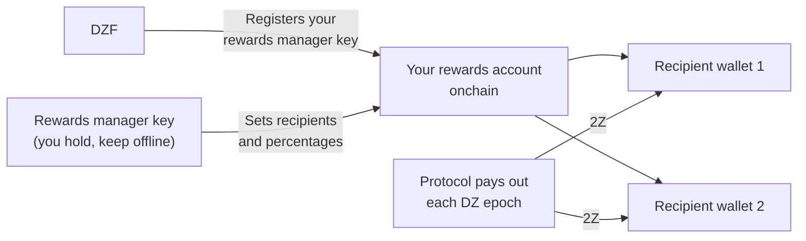

# Rewards Management

You earn rewards in [2Z](glossary.md#2z-token) for the bandwidth and devices you contribute. The protocol pays those rewards out on its own, straight to wallets you nominate. Until you nominate them, nothing can be paid out.

!!! warning "Do this during account setup"
    Set up rewards management in [Phase 2: Account Setup](contribute-provisioning.md#phase-2-account-setup), before your device carries traffic.

    Your rewards still accrue if you leave this until later. The protocol does not burn them and they do not expire. What you lose is the automatic payout: the routine payout process works through recent epochs, so any epoch that passes while you have no recipients set has to be paid out by hand afterwards. See [If You Set This Up Late](#if-you-set-this-up-late).

---

## How It Works

Three keys are involved. Each does a different job, and it is safer to keep them separate.

| Key | What it does | Receives rewards? |
|-----|--------------|-------------------|
| **Service key** | Identifies you as a contributor and signs your CLI commands. Also names your rewards account onchain. | No |
| **Rewards manager key** | Signs changes to the list of wallets that receive rewards. | No |
| **Recipient wallet(s)** | Holds the 2Z the protocol sends you. Up to 8 wallets. | Yes |

The DoubleZero Foundation registers your rewards manager key against your service key. Only DZF can do that. After that, only your rewards manager key can change the recipient list, and DZF cannot redirect your rewards.



---

## What You Need First

- A contributor account onchain. Check with `doublezero contributor list`.
- A Solana wallet to act as your rewards manager, holding about 0.01 SOL to pay transaction fees.
- One or more wallets to receive the 2Z.
- The `doublezero-solana` CLI, if you want to use the command line instead of the portal. Install it with `sudo apt update && sudo apt install doublezero-solana`.

!!! tip "Use a hardware wallet for the rewards manager key"
    The rewards manager key controls where your money goes. Keep it on a hardware wallet or otherwise offline. It never needs to sit on a server, and it never holds your rewards.

---

## Step 1: Create Your Rewards Manager Wallet

Create a Solana wallet you control and can sign with. This can be a hardware wallet, a browser wallet, or a keypair file.

Fund it with a small amount of SOL, around 0.01 SOL. This only pays network fees when you change your recipient list.

Do not reuse your service key for this. If the service key sits on a management server, anyone who reaches that server could redirect your rewards.

---

## Step 2: Send the Public Key to DZF

Give DZF the **public key** of your rewards manager wallet. Never share the private key.

DZF registers it against your service key onchain and confirms when it is done. You cannot do this step yourself.

!!! tip "Send it with your service key"
    If you are working through the [Device Provisioning Guide](contribute-provisioning.md), send this public key at the same time as your service key and GitHub username, in [Step 2.4](contribute-provisioning.md#step-24-submit-keys-to-dzf). DZF registers the two keys in separate transactions, so sending them together saves a round trip.

You can check it landed:

```bash
doublezero-solana revenue-distribution fetch contributor-rewards \
    --service-key <YourServiceKey1111111111111111111111111111> \
    -u mainnet-beta
```

The `manager` column shows your rewards manager key. If it is empty, DZF has not registered it yet.

---

## Step 3: Set Your Recipient Wallets

Now say where the rewards should go. You can use the web portal or the CLI. Both write the same thing onchain.

Rules that apply either way:

- At most 8 recipient wallets.
- Percentages must be whole numbers and must add up to exactly 100.
- A recipient cannot have a 0% share. Remove it instead.

!!! info "If your agreement with DZF includes a revenue share"
    Some contributors have an agreement that splits rewards with the foundation, for example where DZF supplied the hardware. If that applies to you, DZF gives you the address and the percentage to enter here. Ask DZF if you are unsure.

=== "Web portal"

    1. Go to [doublezero.xyz/rewards](https://doublezero.xyz/rewards). The old address, `rewards.doublezero.xyz`, redirects here.
    2. Connect your rewards manager wallet with the wallet button in the top right.
    3. Select your service key from the list on the next page.
    4. Enter each recipient wallet address and its percentage. The total must be 100%.
    5. Click **Submit** and approve the transaction in your wallet.

=== "CLI"

    Run this with your rewards manager keypair as `-k`. Repeat `--recipient` for each wallet.

    ```bash
    doublezero-solana revenue-distribution configure-contributor-rewards \
        --service-key <YourServiceKey1111111111111111111111111111> \
        --recipient <Recipient1111111111111111111111111111111111>:70 \
        --recipient <Recipient2222222222222222222222222222222222>:30 \
        -k /path/to/rewards-manager-keypair.json \
        -u mainnet-beta
    ```

    | Flag | Description |
    |------|-------------|
    | `--service-key` | Your contributor service key. This names the rewards account onchain. |
    | `--recipient` | A recipient in the form `PUBKEY:PERCENT`. Whole numbers, 1 to 100, adding up to 100. Maximum 8. |
    | `-k` | Your rewards manager keypair. The transaction fails if this is not the registered rewards manager. |
    | `-u` | `mainnet-beta`. |

    Add `--dry-run` first if you want to simulate the transaction without sending it.

---

## Step 4: Check Each Recipient Can Hold 2Z

The protocol sends 2Z with a plain token transfer. It does **not** create the token account for you. If a recipient wallet has no 2Z token account, the payout for that epoch fails.

The 2Z mint on mainnet is:

```
J6pQQ3FAcJQeWPPGppWRb4nM8jU3wLyYbRrLh7feMfvd
```

List the token accounts a wallet already has:

```bash
spl-token accounts --owner <Recipient1111111111111111111111111111111111> -u m
```

If `J6pQQ3FAcJQeWPPGppWRb4nM8jU3wLyYbRrLh7feMfvd` is missing from that list, create the account once:

```bash
spl-token create-account J6pQQ3FAcJQeWPPGppWRb4nM8jU3wLyYbRrLh7feMfvd \
    --owner <Recipient1111111111111111111111111111111111> \
    --fee-payer /path/to/any-funded-keypair.json \
    -u m
```

Any funded wallet can pay for this. It costs a small amount of SOL and only has to be done once per recipient wallet.

!!! note "Wallets that already hold 2Z are fine"
    If the wallet has ever received 2Z, the token account exists and you can skip this step.

---

## Step 5: Verify

Check what is now recorded onchain:

```bash
doublezero-solana revenue-distribution fetch contributor-rewards \
    --service-key <YourServiceKey1111111111111111111111111111> \
    --view recipients \
    -u mainnet-beta
```

Example output:

```
| index | recipient                                    | ata                                          | proportion |
|-------|----------------------------------------------|----------------------------------------------|------------|
|     0 | Recipient1111111111111111111111111111111111  | Ata11111111111111111111111111111111111111111 |     70.00% |
|     1 | Recipient2222222222222222222222222222222222  | Ata22222222222222222222222222222222222222222 |     30.00% |
```

The `ata` column is the 2Z token account each recipient will be paid into. Check the `proportion` column adds up to 100%.

---

## When Rewards Arrive

- Rewards are worked out per **DZ epoch**, which is the epoch of the DoubleZero Ledger. A DZ epoch runs roughly two days.
- Payout for an epoch happens around 10 DZ epochs after that epoch ends, so about 20 days later. This lag covers the accounting for the epoch.
- Payouts are automatic. You do not claim them, and you do not need to run anything.
- Once your recipients are set, payouts start arriving within a couple of days as the next epochs are worked through. Epochs that passed before you set your recipients are a separate matter, see [If You Set This Up Late](#if-you-set-this-up-late).
- A DZ epoch and a Solana epoch are not the same length. That difference adds up over time, so now and then a DZ epoch shows zero rewards. This is expected.

---

## Where to See Your Rewards

**Aggregate view.** The [Economic Hub](https://doublezero.xyz/economic-hub) shows contributor rewards at a network level.

**Per epoch.** Ask the protocol what a given DZ epoch paid out:

```bash
doublezero-solana revenue-distribution fetch distribution \
    -e <DZ_EPOCH> --view rewards -u mainnet-beta
```

The output lists every contributor with its share, its reward in 2Z, and whether the payout has been made. Find your contributor code in the `contributor` column.

To see which DZ epoch the network is on now, leave `-e` off:

```bash
doublezero-solana revenue-distribution fetch distribution -u mainnet-beta
```

!!! note "Recent epochs are not final yet"
    Asking for an epoch whose rewards have not been worked out yet returns `Rewards calculation is not finalized yet`. Try an older epoch.

---

## If You Set This Up Late

Rewards are worked out for every epoch you contributed, whether or not you had recipients configured at the time. Those rewards are not burned and they do not expire. They sit in that epoch's distribution account until someone submits the payout.

The catch is that nothing submits them for you after the fact. The routine payout process works through recent epochs, so an epoch that passed while your recipient list was empty stays unpaid until it is submitted by hand.

To find which epochs are affected, look for rows with your contributor code where `distributed` is `no` and the reward is above zero:

```bash
doublezero-solana revenue-distribution fetch distribution \
    -e <DZ_EPOCH> --view rewards -u mainnet-beta
```

Submitting the payout is permissionless, so once your recipients are configured, any funded wallet can do it, including your own:

```bash
doublezero-solana revenue-distribution relay distribute-rewards \
    -e <DZ_EPOCH> -k /path/to/funded-keypair.json -u mainnet-beta
```

Add `--dry-run` first to simulate it without sending anything. The command works through every contributor in that epoch and skips the ones already paid, so it is safe to run.

If you would rather not do this yourself, ask DZF to submit the epochs for you.

---

## Changing Recipients Later

Repeat [Step 3](#step-3-set-your-recipient-wallets) at any time. The new list replaces the old one in full, so include every recipient you still want, not just the ones you are adding. Percentages must add up to 100 again.

Remember [Step 4](#step-4-check-each-recipient-can-hold-2z) for any wallet you add.

---

## Locking the Rewards Manager Key

By default DZF can change your rewards manager key, which is useful if you lose access to it. If you would rather rule that out, you can block it:

```bash
doublezero-solana revenue-distribution configure-contributor-rewards \
    --service-key <YourServiceKey1111111111111111111111111111> \
    --block-protocol-management \
    -k /path/to/rewards-manager-keypair.json \
    -u mainnet-beta
```

!!! danger "Do not lock a key you might lose"
    Once management is blocked, nobody can replace your rewards manager key, including DZF. If you then lose that key you can no longer change where your rewards go. Only block it if the key is backed up and safe.

To allow it again, run the same command with `--allow-protocol-management`.

---

## Troubleshooting

**The `manager` column is empty.**
DZF has not registered your rewards manager key yet. Send them the public key and ask them to confirm.

**`Invalid rewards manager`.**
The keypair you signed with is not the registered rewards manager. Check you passed the right file to `-k`, or the right wallet in the portal.

**`Invalid recipients`.**
Your percentages do not add up to exactly 100, you listed more than 8 recipients, or one of them has a 0% share.

**Rewards show as earned but nothing arrives.**
Two common causes. Either no recipients are configured, so there is nowhere to send them, or a recipient wallet has no 2Z token account. Work through [Step 4](#step-4-check-each-recipient-can-hold-2z) and [Step 5](#step-5-verify). Once that is fixed, future epochs pay out on their own. Epochs that already passed need [a manual payout](#if-you-set-this-up-late).

**Your rewards for a recent epoch are 0.**
Rewards lag by about 10 DZ epochs. Check an epoch that is at least that old. Occasional zero epochs are also normal, see [When Rewards Arrive](#when-rewards-arrive).

---

## Next Steps

Back to the [Onboarding Checklist](contribute-overview.md#onboarding-checklist), or on to [Operations](contribute-operations.md).
