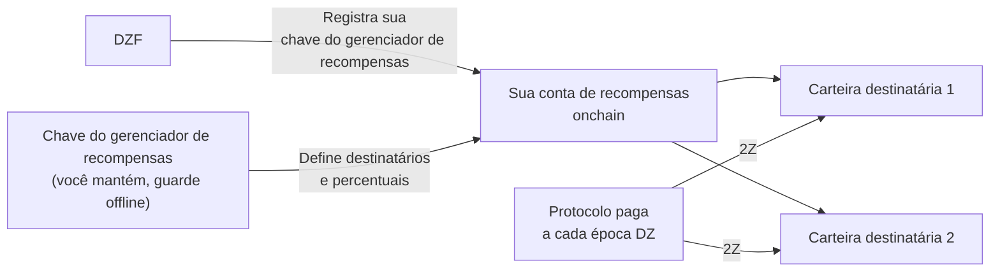

# Gestão de Recompensas

Você ganha recompensas em [2Z](glossary.md#2z-token) pela largura de banda e dispositivos que contribui. O protocolo paga essas recompensas por conta própria, diretamente nas carteiras que você indicar. Até que você as indique, nada poderá ser pago.

!!! warning "Faça isso durante a configuração da conta"
    Configure a gestão de recompensas na [Fase 2: Configuração da Conta](contribute-provisioning.md#phase-2-account-setup), antes que seu dispositivo transporte tráfego.

    Suas recompensas ainda acumulam se você deixar isso para depois. O protocolo não as queima e elas não expiram. O que você perde é o pagamento automático: o processo de pagamento rotineiro percorre as épocas recentes, então qualquer época que passe enquanto você não tiver destinatários configurados terá que ser paga manualmente depois. Veja [Se Você Configurar Isso com Atraso](#se-voce-configurar-isso-com-atraso).

---

## Como Funciona

Três chaves estão envolvidas. Cada uma tem uma função diferente, e é mais seguro mantê-las separadas.

| Chave | O que faz | Recebe recompensas? |
|-------|-----------|---------------------|
| **Chave de serviço** | Identifica você como contribuidor e assina seus comandos CLI. Também nomeia sua conta de recompensas onchain. | Não |
| **Chave do gerenciador de recompensas** | Assina alterações na lista de carteiras que recebem recompensas. | Não |
| **Carteira(s) destinatária(s)** | Mantém os 2Z que o protocolo envia a você. Até 8 carteiras. | Sim |

A DoubleZero Foundation registra sua chave do gerenciador de recompensas vinculada à sua chave de serviço. Apenas a DZF pode fazer isso. Depois disso, apenas sua chave do gerenciador de recompensas pode alterar a lista de destinatários, e a DZF não pode redirecionar suas recompensas.



---

## O Que Você Precisa Primeiro

- Uma conta de contribuidor onchain. Verifique com `doublezero contributor list`.
- Uma carteira Solana para atuar como seu gerenciador de recompensas, com cerca de 0,01 SOL para pagar taxas de transação.
- Uma ou mais carteiras para receber os 2Z.
- O CLI `doublezero-solana`, se você quiser usar a linha de comando em vez do portal. Instale com `sudo apt update && sudo apt install doublezero-solana`.

!!! tip "Use uma carteira de hardware para a chave do gerenciador de recompensas"
    A chave do gerenciador de recompensas controla para onde seu dinheiro vai. Mantenha-a em uma carteira de hardware ou de outra forma offline. Ela nunca precisa ficar em um servidor, e nunca mantém suas recompensas.

---

## Passo 1: Crie Sua Carteira do Gerenciador de Recompensas

Crie uma carteira Solana que você controle e com a qual possa assinar. Pode ser uma carteira de hardware, uma carteira de navegador ou um arquivo de par de chaves.

Financie-a com uma pequena quantidade de SOL, cerca de 0,01 SOL. Isso serve apenas para pagar taxas de rede quando você alterar sua lista de destinatários.

Não reutilize sua chave de serviço para isso. Se a chave de serviço estiver em um servidor de gerenciamento, qualquer pessoa que acessar esse servidor poderá redirecionar suas recompensas.

---

## Passo 2: Envie a Chave Pública para a DZF

Forneça à DZF a **chave pública** da sua carteira do gerenciador de recompensas. Nunca compartilhe a chave privada.

A DZF a registra vinculada à sua chave de serviço onchain e confirma quando estiver concluído. Você não pode fazer este passo sozinho.

!!! tip "Envie junto com sua chave de serviço"
    Se você está seguindo o [Guia de Provisionamento de Dispositivos](contribute-provisioning.md), envie esta chave pública ao mesmo tempo que sua chave de serviço e nome de usuário do GitHub, no [Passo 2.4](contribute-provisioning.md#step-24-submit-keys-to-dzf). A DZF registra as duas chaves em transações separadas, então enviá-las juntas economiza uma ida e volta.

Você pode verificar se foi registrada:

```bash
doublezero-solana revenue-distribution fetch contributor-rewards \
    --service-key <YourServiceKey1111111111111111111111111111> \
    -u mainnet-beta
```

A coluna `manager` mostra sua chave do gerenciador de recompensas. Se estiver vazia, a DZF ainda não a registrou.

---

## Passo 3: Defina Suas Carteiras Destinatárias

Agora indique para onde as recompensas devem ir. Você pode usar o portal web ou o CLI. Ambos gravam a mesma coisa onchain.

Regras que se aplicam em ambos os casos:

- No máximo 8 carteiras destinatárias.
- Os percentuais devem ser números inteiros e devem somar exatamente 100.
- Um destinatário não pode ter uma participação de 0%. Remova-o em vez disso.

!!! info "Se seu acordo com a DZF inclui compartilhamento de receita"
    Alguns contribuidores têm um acordo que divide as recompensas com a fundação, por exemplo quando a DZF forneceu o hardware. Se isso se aplica a você, a DZF fornece o endereço e o percentual a inserir aqui. Pergunte à DZF se não tiver certeza.

=== "Portal web"

    1. Acesse [doublezero.xyz/rewards](https://doublezero.xyz/rewards). O endereço antigo, `rewards.doublezero.xyz`, redireciona para cá.
    2. Conecte sua carteira do gerenciador de recompensas com o botão de carteira no canto superior direito.
    3. Selecione sua chave de serviço na lista da página seguinte.
    4. Insira cada endereço de carteira destinatária e seu percentual. O total deve ser 100%.
    5. Clique em **Submit** e aprove a transação na sua carteira.

=== "CLI"

    Execute isso com seu par de chaves do gerenciador de recompensas como `-k`. Repita `--recipient` para cada carteira.

    ```bash
    doublezero-solana revenue-distribution configure-contributor-rewards \
        --service-key <YourServiceKey1111111111111111111111111111> \
        --recipient <Recipient1111111111111111111111111111111111>:70 \
        --recipient <Recipient2222222222222222222222222222222222>:30 \
        -k /path/to/rewards-manager-keypair.json \
        -u mainnet-beta
    ```

    | Flag | Descrição |
    |------|-----------|
    | `--service-key` | Sua chave de serviço de contribuidor. Ela nomeia a conta de recompensas onchain. |
    | `--recipient` | Um destinatário no formato `PUBKEY:PERCENT`. Números inteiros, de 1 a 100, somando 100. Máximo de 8. |
    | `-k` | Seu par de chaves do gerenciador de recompensas. A transação falha se este não for o gerenciador de recompensas registrado. |
    | `-u` | `mainnet-beta`. |

    Adicione `--dry-run` primeiro se quiser simular a transação sem enviá-la.

---

## Passo 4: Verifique Se Cada Destinatário Pode Manter 2Z

O protocolo envia 2Z com uma transferência de token simples. Ele **não** cria a conta de token para você. Se uma carteira destinatária não tiver uma conta de token 2Z, o pagamento daquela época falha.

O mint do 2Z na mainnet é:

```
J6pQQ3FAcJQeWPPGppWRb4nM8jU3wLyYbRrLh7feMfvd
```

Liste as contas de token que uma carteira já possui:

```bash
spl-token accounts --owner <Recipient1111111111111111111111111111111111> -u m
```

Se `J6pQQ3FAcJQeWPPGppWRb4nM8jU3wLyYbRrLh7feMfvd` não estiver nessa lista, crie a conta uma vez:

```bash
spl-token create-account J6pQQ3FAcJQeWPPGppWRb4nM8jU3wLyYbRrLh7feMfvd \
    --owner <Recipient1111111111111111111111111111111111> \
    --fee-payer /path/to/any-funded-keypair.json \
    -u m
```

Qualquer carteira financiada pode pagar por isso. Custa uma pequena quantidade de SOL e só precisa ser feito uma vez por carteira destinatária.

!!! note "Carteiras que já possuem 2Z estão ok"
    Se a carteira já recebeu 2Z alguma vez, a conta de token existe e você pode pular este passo.

---

## Passo 5: Verifique

Confira o que está agora registrado onchain:

```bash
doublezero-solana revenue-distribution fetch contributor-rewards \
    --service-key <YourServiceKey1111111111111111111111111111> \
    --view recipients \
    -u mainnet-beta
```

Exemplo de saída:

```
| index | recipient                                    | ata                                          | proportion |
|-------|----------------------------------------------|----------------------------------------------|------------|
|     0 | Recipient1111111111111111111111111111111111  | Ata11111111111111111111111111111111111111111 |     70.00% |
|     1 | Recipient2222222222222222222222222222222222  | Ata22222222222222222222222222222222222222222 |     30.00% |
```

A coluna `ata` é a conta de token 2Z na qual cada destinatário será pago. Verifique se a coluna `proportion` soma 100%.

---

## Quando as Recompensas Chegam

- As recompensas são calculadas por **época DZ**, que é a época do DoubleZero Ledger. Uma época DZ dura aproximadamente dois dias.
- O pagamento de uma época acontece cerca de 10 épocas DZ após o término daquela época, ou seja, aproximadamente 20 dias depois. Esse atraso cobre a contabilidade da época.
- Os pagamentos são automáticos. Você não precisa reivindicá-los e não precisa executar nada.
- Uma vez que seus destinatários estejam configurados, os pagamentos começam a chegar dentro de alguns dias conforme as próximas épocas são processadas. Épocas que passaram antes de você configurar seus destinatários são um assunto separado, veja [Se Você Configurar Isso com Atraso](#se-voce-configurar-isso-com-atraso).
- Uma época DZ e uma época Solana não têm a mesma duração. Essa diferença se acumula ao longo do tempo, então de vez em quando uma época DZ mostra zero recompensas. Isso é esperado.

---

## Onde Ver Suas Recompensas

**Visão agregada.** O [Economic Hub](https://doublezero.xyz/economic-hub) mostra as recompensas dos contribuidores em nível de rede.

**Por época.** Pergunte ao protocolo o que uma determinada época DZ pagou:

```bash
doublezero-solana revenue-distribution fetch distribution \
    -e <DZ_EPOCH> --view rewards -u mainnet-beta
```

A saída lista cada contribuidor com sua participação, sua recompensa em 2Z e se o pagamento foi realizado. Encontre seu código de contribuidor na coluna `contributor`.

Para ver em qual época DZ a rede está agora, omita `-e`:

```bash
doublezero-solana revenue-distribution fetch distribution -u mainnet-beta
```

!!! note "Épocas recentes ainda não estão finalizadas"
    Consultar uma época cujas recompensas ainda não foram calculadas retorna `Rewards calculation is not finalized yet`. Tente uma época mais antiga.

---

## Se Você Configurar Isso com Atraso

As recompensas são calculadas para cada época em que você contribuiu, independentemente de ter destinatários configurados no momento. Essas recompensas não são queimadas e não expiram. Elas ficam na conta de distribuição daquela época até que alguém submeta o pagamento.

O problema é que nada as submete por você depois do fato. O processo de pagamento rotineiro percorre épocas recentes, então uma época que passou enquanto sua lista de destinatários estava vazia permanece sem pagamento até ser submetida manualmente.

Para descobrir quais épocas foram afetadas, procure linhas com seu código de contribuidor onde `distributed` é `no` e a recompensa é maior que zero:

```bash
doublezero-solana revenue-distribution fetch distribution \
    -e <DZ_EPOCH> --view rewards -u mainnet-beta
```

Submeter o pagamento é permissionless, então uma vez que seus destinatários estejam configurados, qualquer carteira financiada pode fazer isso, incluindo a sua:

```bash
doublezero-solana revenue-distribution relay distribute-rewards \
    -e <DZ_EPOCH> -k /path/to/funded-keypair.json -u mainnet-beta
```

Adicione `--dry-run` primeiro para simular sem enviar nada. O comando percorre todos os contribuidores daquela época e pula os que já foram pagos, então é seguro executá-lo.

Se você preferir não fazer isso sozinho, peça à DZF para submeter as épocas por você.

---

## Alterando Destinatários Posteriormente

Repita o [Passo 3](#passo-3-defina-suas-carteiras-destinatarias) a qualquer momento. A nova lista substitui a antiga completamente, então inclua todos os destinatários que você ainda deseja, não apenas os que está adicionando. Os percentuais devem somar 100 novamente.

Lembre-se do [Passo 4](#passo-4-verifique-se-cada-destinatario-pode-manter-2z) para qualquer carteira que adicionar.

---

## Bloqueando a Chave do Gerenciador de Recompensas

Por padrão, a DZF pode alterar sua chave do gerenciador de recompensas, o que é útil caso você perca o acesso a ela. Se você preferir descartar essa possibilidade, pode bloqueá-la:

```bash
doublezero-solana revenue-distribution configure-contributor-rewards \
    --service-key <YourServiceKey1111111111111111111111111111> \
    --block-protocol-management \
    -k /path/to/rewards-manager-keypair.json \
    -u mainnet-beta
```

!!! danger "Não bloqueie uma chave que você pode perder"
    Uma vez que o gerenciamento é bloqueado, ninguém pode substituir sua chave do gerenciador de recompensas, incluindo a DZF. Se você então perder essa chave, não poderá mais alterar para onde suas recompensas vão. Só bloqueie se a chave estiver com backup e segura.

Para permitir novamente, execute o mesmo comando com `--allow-protocol-management`.

---

## Solução de Problemas

**A coluna `manager` está vazia.**
A DZF ainda não registrou sua chave do gerenciador de recompensas. Envie a chave pública e peça confirmação.

**`Invalid rewards manager`.**
O par de chaves com o qual você assinou não é o gerenciador de recompensas registrado. Verifique se passou o arquivo correto para `-k`, ou a carteira correta no portal.

**`Invalid recipients`.**
Seus percentuais não somam exatamente 100, você listou mais de 8 destinatários, ou um deles tem participação de 0%.

**As recompensas aparecem como ganhas, mas nada chega.**
Duas causas comuns. Ou nenhum destinatário está configurado, então não há para onde enviá-las, ou uma carteira destinatária não possui conta de token 2Z. Siga o [Passo 4](#passo-4-verifique-se-cada-destinatario-pode-manter-2z) e o [Passo 5](#passo-5-verifique). Uma vez corrigido, épocas futuras serão pagas automaticamente. Épocas que já passaram precisam de [pagamento manual](#se-voce-configurar-isso-com-atraso).

**Suas recompensas para uma época recente são 0.**
As recompensas têm um atraso de cerca de 10 épocas DZ. Verifique uma época que tenha pelo menos essa idade. Épocas ocasionais com zero também são normais, veja [Quando as Recompensas Chegam](#quando-as-recompensas-chegam).

---

## Próximos Passos

Volte para a [Lista de Verificação de Integração](contribute-overview.md#onboarding-checklist), ou prossiga para [Operações](contribute-operations.md).