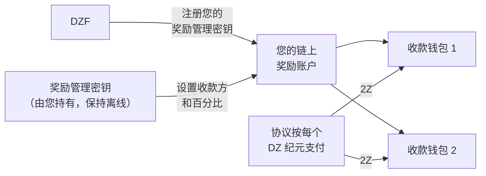

# 奖励管理

您通过贡献带宽和设备赚取 [2Z](glossary.md#2z-token) 奖励。协议会自动将这些奖励直接支付到您指定的钱包。在您指定钱包之前，奖励无法支付。

!!! warning "请在账户设置期间完成此操作"
    请在 [阶段 2：账户设置](contribute-provisioning.md#phase-2-account-setup) 中设置奖励管理，在您的设备开始承载流量之前完成。

    如果您推迟此操作，奖励仍会累积。协议不会销毁它们，它们也不会过期。您损失的是自动支付：常规支付流程只处理近期的纪元，因此在您未设置收款方期间经过的任何纪元都需要事后手动支付。请参阅 [如果您设置较晚](#if-you-set-this-up-late)。

---

## 工作原理

涉及三个密钥。每个密钥执行不同的功能，将它们分开保管更为安全。

| 密钥 | 功能 | 是否接收奖励？ |
|-----|------|---------------|
| **服务密钥** | 标识您的贡献者身份并签署您的 CLI 命令。同时在链上命名您的奖励账户。 | 否 |
| **奖励管理密钥** | 签署对接收奖励的钱包列表的更改。 | 否 |
| **收款钱包** | 持有协议发送给您的 2Z。最多 8 个钱包。 | 是 |

DoubleZero 基金会将您的奖励管理密钥注册到您的服务密钥上。只有 DZF 能执行此操作。此后，只有您的奖励管理密钥可以更改收款方列表，DZF 无法重定向您的奖励。



---

## 前置条件

- 链上贡献者账户。使用 `doublezero contributor list` 检查。
- 一个 Solana 钱包作为您的奖励管理器，持有约 0.01 SOL 用于支付交易费用。
- 一个或多个用于接收 2Z 的钱包。
- `doublezero-solana` CLI，如果您想使用命令行而非门户网站。使用 `sudo apt update && sudo apt install doublezero-solana` 安装。

!!! tip "为奖励管理密钥使用硬件钱包"
    奖励管理密钥控制着您的资金流向。请将其保存在硬件钱包上或以其他方式保持离线。它无需存放在服务器上，也不持有您的奖励。

---

## 步骤 1：创建您的奖励管理钱包

创建一个您控制且可以签名的 Solana 钱包。可以是硬件钱包、浏览器钱包或密钥对文件。

充入少量 SOL，约 0.01 SOL。这仅用于在您更改收款方列表时支付网络费用。

不要复用您的服务密钥。如果服务密钥存放在管理服务器上，任何能访问该服务器的人都可能重定向您的奖励。

---

## 步骤 2：将公钥发送给 DZF

将您奖励管理钱包的**公钥**提供给 DZF。切勿分享私钥。

DZF 会将其注册到您的链上服务密钥，并在完成后确认。您无法自行完成此步骤。

!!! tip "与服务密钥一起发送"
    如果您正在按照 [设备配置指南](contribute-provisioning.md) 操作，请在 [步骤 2.4](contribute-provisioning.md#step-24-submit-keys-to-dzf) 中将此公钥与您的服务密钥和 GitHub 用户名一起发送。DZF 在不同的交易中注册这两个密钥，因此一起发送可以减少一次往返。

您可以检查是否已注册成功：

```bash
doublezero-solana revenue-distribution fetch contributor-rewards \
    --service-key <YourServiceKey1111111111111111111111111111> \
    -u mainnet-beta
```

`manager` 列显示您的奖励管理密钥。如果为空，说明 DZF 尚未注册。

---

## 步骤 3：设置您的收款钱包

现在指定奖励的发送目标。您可以使用网页门户或 CLI。两者在链上写入的内容相同。

无论哪种方式都适用的规则：

- 最多 8 个收款钱包。
- 百分比必须为整数，且总和必须恰好为 100。
- 收款方不能有 0% 的份额。请改为移除它。

!!! info "如果您与 DZF 的协议包含收入分成"
    部分贡献者的协议中约定与基金会分成奖励，例如 DZF 提供了硬件的情况。如果这适用于您，DZF 会提供需要在此处输入的地址和百分比。如果不确定，请咨询 DZF。

=== "网页门户"

    1. 前往 [doublezero.xyz/rewards](https://doublezero.xyz/rewards)。旧地址 `rewards.doublezero.xyz` 会重定向到此处。
    2. 使用右上角的钱包按钮连接您的奖励管理钱包。
    3. 在下一页面的列表中选择您的服务密钥。
    4. 输入每个收款钱包地址及其百分比。总计必须为 100%。
    5. 点击 **Submit** 并在钱包中批准交易。

=== "CLI"

    使用您的奖励管理密钥对作为 `-k` 运行此命令。为每个钱包重复 `--recipient`。

    ```bash
    doublezero-solana revenue-distribution configure-contributor-rewards \
        --service-key <YourServiceKey1111111111111111111111111111> \
        --recipient <Recipient1111111111111111111111111111111111>:70 \
        --recipient <Recipient2222222222222222222222222222222222>:30 \
        -k /path/to/rewards-manager-keypair.json \
        -u mainnet-beta
    ```

    | 标志 | 说明 |
    |------|------|
    | `--service-key` | 您的贡献者服务密钥。它在链上命名奖励账户。 |
    | `--recipient` | 格式为 `PUBKEY:PERCENT` 的收款方。整数，1 到 100，总和为 100。最多 8 个。 |
    | `-k` | 您的奖励管理密钥对。如果这不是已注册的奖励管理器，交易将失败。 |
    | `-u` | `mainnet-beta`。 |

    如果您想在不发送交易的情况下模拟，请先添加 `--dry-run`。

---

## 步骤 4：检查每个收款方是否可以持有 2Z

协议通过普通代币转账发送 2Z。它**不会**为您创建代币账户。如果收款钱包没有 2Z 代币账户，该纪元的支付将失败。

主网上的 2Z 铸造地址为：

```
J6pQQ3FAcJQeWPPGppWRb4nM8jU3wLyYbRrLh7feMfvd
```

列出钱包已有的代币账户：

```bash
spl-token accounts --owner <Recipient1111111111111111111111111111111111> -u m
```

如果 `J6pQQ3FAcJQeWPPGppWRb4nM8jU3wLyYbRrLh7feMfvd` 不在列表中，创建一次该账户：

```bash
spl-token create-account J6pQQ3FAcJQeWPPGppWRb4nM8jU3wLyYbRrLh7feMfvd \
    --owner <Recipient1111111111111111111111111111111111> \
    --fee-payer /path/to/any-funded-keypair.json \
    -u m
```

任何有资金的钱包都可以为此付费。费用为少量 SOL，每个收款钱包只需执行一次。

!!! note "已持有 2Z 的钱包无需操作"
    如果该钱包曾经接收过 2Z，代币账户已存在，您可以跳过此步骤。

---

## 步骤 5：验证

检查链上当前记录的内容：

```bash
doublezero-solana revenue-distribution fetch contributor-rewards \
    --service-key <YourServiceKey1111111111111111111111111111> \
    --view recipients \
    -u mainnet-beta
```

示例输出：

```
| index | recipient                                    | ata                                          | proportion |
|-------|----------------------------------------------|----------------------------------------------|------------|
|     0 | Recipient1111111111111111111111111111111111  | Ata11111111111111111111111111111111111111111 |     70.00% |
|     1 | Recipient2222222222222222222222222222222222  | Ata22222222222222222222222222222222222222222 |     30.00% |
```

`ata` 列是每个收款方将收到支付的 2Z 代币账户。检查 `proportion` 列的总和是否为 100%。

---

## 奖励何时到账

- 奖励按 **DZ 纪元** 计算，即 DoubleZero 账本的纪元。一个 DZ 纪元大约运行两天。
- 某个纪元的支付大约在该纪元结束后 10 个 DZ 纪元发生，即大约 20 天后。此延迟用于完成该纪元的核算。
- 支付是自动的。您无需领取，也无需运行任何程序。
- 一旦设置了收款方，支付将在几天内开始到账，随着下一批纪元被处理。在您设置收款方之前已经过去的纪元属于另一种情况，请参阅 [如果您设置较晚](#if-you-set-this-up-late)。
- DZ 纪元和 Solana 纪元的长度不同。这种差异会随时间累积，因此偶尔某个 DZ 纪元会显示零奖励。这是正常现象。

---

## 在哪里查看您的奖励

**汇总视图。** [Economic Hub](https://doublezero.xyz/economic-hub) 在网络层面显示贡献者奖励。

**按纪元查看。** 查询协议在某个 DZ 纪元的支付情况：

```bash
doublezero-solana revenue-distribution fetch distribution \
    -e <DZ_EPOCH> --view rewards -u mainnet-beta
```

输出列出每个贡献者及其份额、2Z 奖励金额以及是否已支付。在 `contributor` 列中找到您的贡献者代码。

要查看网络当前所在的 DZ 纪元，省略 `-e`：

```bash
doublezero-solana revenue-distribution fetch distribution -u mainnet-beta
```

!!! note "近期纪元尚未最终确定"
    查询奖励尚未计算完成的纪元会返回 `Rewards calculation is not finalized yet`。请尝试查询更早的纪元。

---

## 如果您设置较晚

无论您在当时是否配置了收款方，您贡献的每个纪元的奖励都会被计算。这些奖励不会被销毁，也不会过期。它们保存在该纪元的分配账户中，直到有人提交支付。

问题在于事后没有人会自动为您提交。常规支付流程只处理近期纪元，因此在您的收款方列表为空时经过的纪元将保持未支付状态，直到手动提交。

要查找受影响的纪元，查找您的贡献者代码对应的行，其中 `distributed` 为 `no` 且奖励大于零：

```bash
doublezero-solana revenue-distribution fetch distribution \
    -e <DZ_EPOCH> --view rewards -u mainnet-beta
```

提交支付是无需许可的，因此一旦您配置了收款方，任何有资金的钱包都可以执行此操作，包括您自己的：

```bash
doublezero-solana revenue-distribution relay distribute-rewards \
    -e <DZ_EPOCH> -k /path/to/funded-keypair.json -u mainnet-beta
```

先添加 `--dry-run` 可以在不发送任何内容的情况下模拟。该命令会处理该纪元中的每个贡献者并跳过已支付的，因此运行是安全的。

如果您不想自己操作，可以请 DZF 为您提交这些纪元。

---

## 稍后更改收款方

随时重复 [步骤 3](#step-3-set-your-recipient-wallets)。新列表会完全替换旧列表，因此请包含您仍然需要的所有收款方，而不仅仅是新增的。百分比必须再次总和为 100。

对于您添加的任何钱包，请记得执行 [步骤 4](#step-4-check-each-recipient-can-hold-2z)。

---

## 锁定奖励管理密钥

默认情况下，DZF 可以更改您的奖励管理密钥，这在您丢失访问权限时很有用。如果您希望排除这种可能性，可以阻止它：

```bash
doublezero-solana revenue-distribution configure-contributor-rewards \
    --service-key <YourServiceKey1111111111111111111111111111> \
    --block-protocol-management \
    -k /path/to/rewards-manager-keypair.json \
    -u mainnet-beta
```

!!! danger "不要锁定可能丢失的密钥"
    一旦管理被阻止，任何人都无法替换您的奖励管理密钥，包括 DZF。如果您随后丢失该密钥，您将无法再更改奖励的发送目标。仅在密钥已备份且安全的情况下才执行锁定。

要重新允许，请使用 `--allow-protocol-management` 运行相同的命令。

---

## 故障排除

**`manager` 列为空。**
DZF 尚未注册您的奖励管理密钥。将公钥发送给他们并请求确认。

**`Invalid rewards manager`。**
您用于签名的密钥对不是已注册的奖励管理器。检查您是否向 `-k` 传递了正确的文件，或在门户中使用了正确的钱包。

**`Invalid recipients`。**
您的百分比总和不恰好为 100，您列出了超过 8 个收款方，或者其中一个的份额为 0%。

**奖励显示已赚取但未收到。**
两个常见原因。要么未配置收款方，因此没有发送目标；要么收款钱包没有 2Z 代币账户。请按照 [步骤 4](#step-4-check-each-recipient-can-hold-2z) 和 [步骤 5](#step-5-verify) 进行排查。修复后，未来的纪元会自动支付。已经过去的纪元需要 [手动支付](#if-you-set-this-up-late)。

**您近期纪元的奖励为 0。**
奖励有大约 10 个 DZ 纪元的延迟。请检查至少那么久之前的纪元。偶尔出现零奖励纪元也是正常的，请参阅 [奖励何时到账](#when-rewards-arrive)。

---

## 后续步骤

返回 [入门检查清单](contribute-overview.md#onboarding-checklist)，或继续前往 [运维](contribute-operations.md)。