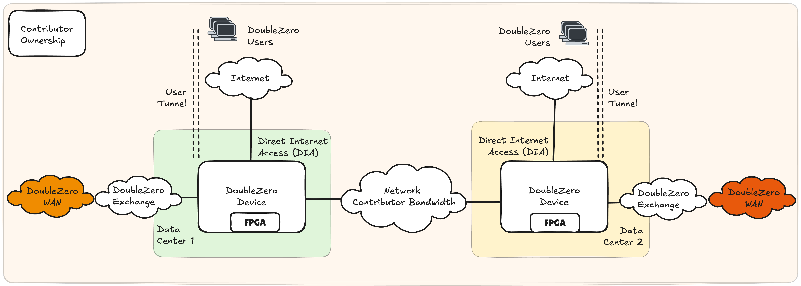
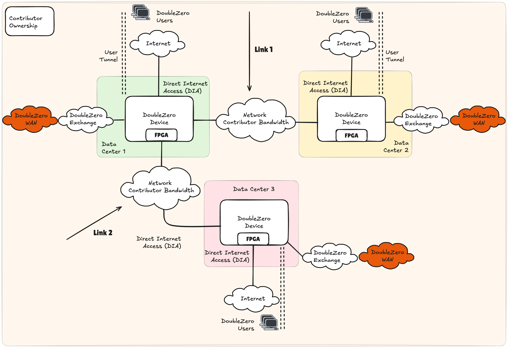
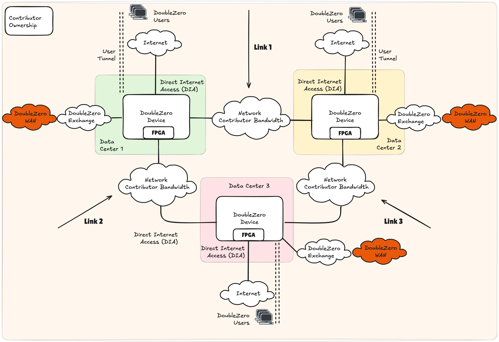
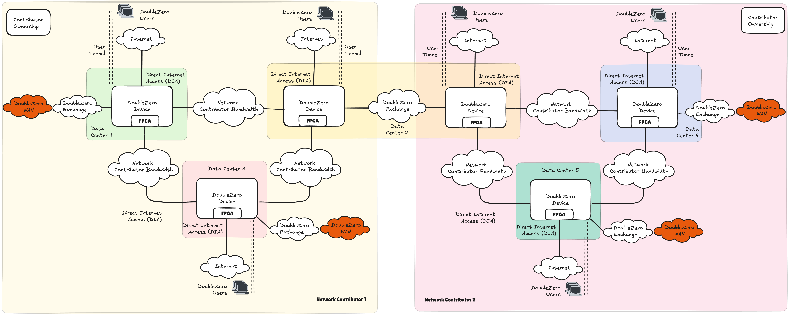
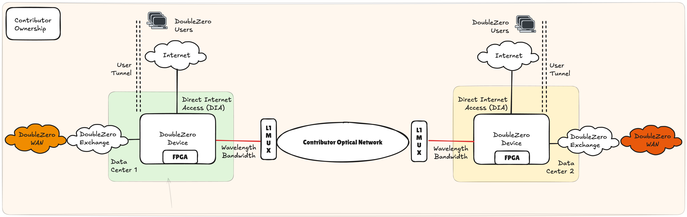
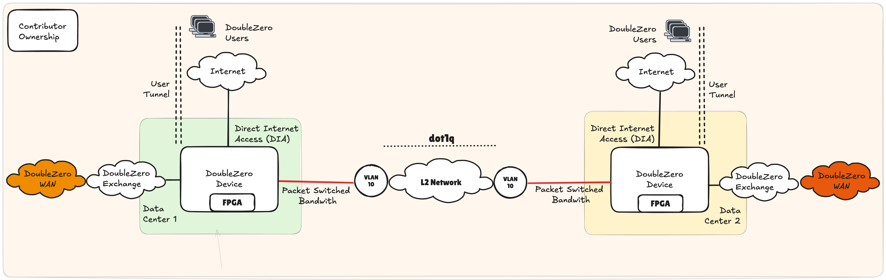
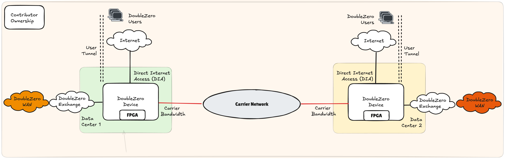

# Exigences et architecture des contributeurs

## Résumé

Toute personne souhaitant monétiser ses câbles à fibre optique et son matériel réseau sous-utilisés peut contribuer au réseau DoubleZero. Les contributeurs réseau doivent fournir une bande passante dédiée entre deux points, exploiter des appareils compatibles DoubleZero (DZD) à chaque extrémité, ainsi qu'une connexion à l'internet public à chaque extrémité. Les contributeurs réseau doivent également exécuter le logiciel DoubleZero sur chaque DZD pour fournir des services tels que le multicast, la recherche d'utilisateurs et le filtrage en périphérie.

Le contrat intelligent DoubleZero est la pierre angulaire garantissant que le réseau maintient des liens de haute qualité pouvant être mesurés et intégrés dans la topologie, permettant à nos contrôleurs réseau de développer le chemin de bout en bout le plus efficace entre nos différents utilisateurs et points de terminaison. Lors de l'exécution du contrat intelligent et du déploiement de l'équipement réseau et de la bande passante, une entité est classée comme contributeur réseau. Consultez [DoubleZero Economics](https://economics.doublezero.xyz/overview) pour mieux comprendre les aspects économiques de la participation à DoubleZero en tant que contributeur réseau.

---

## Exigences pour devenir contributeur au réseau DoubleZero

- Bande passante dédiée pouvant fournir une connectivité IPv4 et un MTU de 2048 octets entre deux centres de données
- Matériel DoubleZero Device (DZD) compatible avec le protocole DoubleZero
- Connectivité à Internet et aux autres contributeurs du réseau DoubleZero
- Installation du logiciel DoubleZero sur le DZD

## Guide de démarrage rapide

En tant que contributeur réseau, la manière la plus simple de commencer avec DoubleZero est d'identifier la capacité de votre réseau pouvant être dédiée à DoubleZero. Une fois identifiée, les DZD doivent être déployés, facilitant le réseau overlay DoubleZero qui ne nécessite que l'accessibilité IPv4 et un MTU minimum de 2048 octets comme dépendances du réseau du contributeur.

La figure 1 illustre le modèle le plus simple pour la contribution en bande passante et les services d'envoi et de traitement de paquets. Un DZD est déployé dans chaque centre de données, s'interfaçant avec le réseau interne du contributeur réseau pour fournir la connectivité WAN DoubleZero. Cela est complété par un accès Internet local, généralement une solution d'accès Internet direct (DIA), utilisée comme points d'entrée pour les utilisateurs de DoubleZero. Bien que le DIA soit l'option privilégiée pour faciliter l'accès aux utilisateurs de DoubleZero, de nombreux modèles de connectivité sont possibles, par exemple : câblage physique vers les serveurs, extension de la fabric réseau, etc. Nous désignons ces options sous le nom de Choose Your Own Adventure (CYOA), offrant au contributeur la flexibilité de connecter des utilisateurs locaux ou distants de la manière la mieux adaptée à leurs politiques réseau internes.

Comme pour tout réseau, l'accessibilité est une partie fondamentale de l'architecture, car les contributeurs réseau ne peuvent pas vivre de manière isolée. À ce titre, le DZD *doit* disposer d'un lien vers un DoubleZero Exchange (DZX) pour créer un réseau contigu entre les participants.

<figure markdown="span">
  { width="800" }
  <figcaption>Figure 1 : Contribution en bande passante au réseau DoubleZero entre 2 centres de données - Contributeur unique</figcaption>
</figure>

### Exemples de contributions

Les moyens par lesquels un contributeur réseau peut accroître ses contributions à DoubleZero sont nombreux, notamment :

- Améliorer les caractéristiques de performance de ses contributions existantes : augmenter la bande passante, réduire la latence
- Ajouter plusieurs liens entre les mêmes centres de données
- Ajouter un nouveau lien d'un centre de données existant vers un nouveau centre de données
- Ajouter un nouveau lien indépendant entre deux nouveaux centres de données

#### Exemple 1 : Contributeur unique, 3 centres de données, deux liens
<figure markdown="span">
  { width="800" }
  <figcaption>Figure 2 : Contribution en bande passante au réseau DoubleZero entre 3 centres de données - Contributeur unique</figcaption>
</figure>

Un seul DZD peut prendre en charge plusieurs liens contribués à DoubleZero. La figure 2 illustre une topologie potentielle si un seul centre de données, désigné comme 1, termine la bande passante vers deux centres de données distants différents, 2 et 3. Dans ce scénario, chaque centre de données contient un seul DZD. Tous les DZD utilisent le DIA comme points d'entrée utilisateurs pour leur interface CYOA.

#### Exemple 2 : Contributeur unique, 3 centres de données, trois liens

La figure 3 décrit la topologie DoubleZero lorsqu'un contributeur unique déploie trois liens dans une topologie en triangle entre 3 centres de données. Dans un scénario similaire à l'exemple 1, un seul DZD est déployé dans les centres de données 1, 2 et 3, chacun supportant 2 liens réseau indépendants. La topologie résultante est un triangle ou un anneau entre les centres de données.

<figure markdown="span">
  { width="800" }
  <figcaption>Figure 3 : Contribution en bande passante au réseau DoubleZero entre 3 centres de données - Contributeur unique</figcaption>
</figure>

### DoubleZero Exchange

La création d'un réseau contigu est un élément fondamental de l'architecture DoubleZero. Les contributeurs s'interfacent via un DoubleZero Exchange (DZX) au sein d'une zone métropolitaine, c'est-à-dire une ville telle que New York (NYC), Londres (LON) ou Tokyo (TYO). Un DZX est une fabric réseau similaire à un point d'échange Internet, permettant le peering et l'échange de routes.

Dans la figure 4, le contributeur réseau 1 opère dans les centres de données 1, 2 et 3, tandis que le contributeur réseau 2 opère dans les centres de données 2, 4 et 5. En s'interconnectant dans le centre de données 2, la portée du réseau DoubleZero s'étend à 5 centres de données contigus.

<figure markdown="span">
  { width="1000" }
  <figcaption>Figure 4 : Contribution en bande passante au réseau DoubleZero entre 2 contributeurs en bande passante réseau</figcaption>
</figure>

### Options de contribution en bande passante

DoubleZero exige qu'un contributeur réseau offre une connectivité intégrée via un profil garanti de bande passante, de latence et de gigue entre les DZD de deux centres de données de terminaison, exprimé via un contrat intelligent. DoubleZero ne prescrit pas la manière dont un contributeur réseau met en œuvre sa contribution ; cependant, dans les sections suivantes, nous fournissons des options indicatives à utiliser à leur seule discrétion.

Les domaines importants à considérer pour un contributeur réseau peuvent être :

- Capacité à garantir les performances réseau du service DoubleZero : bande passante, latence et gigue
- Séparation de leurs services réseau internes existants
- Conflits d'adressage IPv4, en particulier avec l'espace d'adressage de l'underlay tunnel
- Disponibilité et temps de fonctionnement
- Considérations CAPEX et OPEX

#### Bande passante de couche 1
<figure markdown="span">
  { width="800" }
  <figcaption>Figure 5 : Services optiques de couche 1</figcaption>
</figure>

La bande passante de couche 1, plus formellement décrite comme des services de longueur d'onde, peut voir une capacité dédiée provisionnée sur une infrastructure optique existante, telle que DWDM, CWDM ou via des multiplexeurs optiques (MUX). Dans la figure 5, les DZD utilisent une optique colorée qui est câblée à un MUX L1, lequel entrelace la longueur d'onde du DZD sur une fibre noire existante.

Cette solution présente de nombreux avantages pour les contributeurs réseau qui exploitent déjà un réseau cœur existant. Les changements opérationnels itératifs, ainsi que les exigences supplémentaires en CAPEX et OPEX, sont modestes. Cette option est particulièrement robuste pour offrir une séparation des services réseau du contributeur.

#### Bande passante à commutation de paquets

Les réseaux à commutation de paquets peuvent être considérés comme un réseau d'entreprise typique, exécutant des protocoles de routage et de commutation standard supportant des applications métier. De nombreuses technologies réseau permettent d'atteindre la connectivité, par exemple, les extensions de couche 2 (L2) utilisant des tags VLAN.

##### Extension L2
<figure markdown="span">
  { width="800" }
  <figcaption>Figure 6 : Réseaux à commutation de paquets - Extension L2</figcaption>
</figure>

Une extension L2, comme illustrée dans la figure 6, peut être facilitée par le marquage VLAN. Le port d'un DZD peut être câblé au commutateur réseau interne d'un contributeur, avec le port du commutateur configuré comme port d'accès dans, par exemple, le VLAN 10. Via le marquage 802.1q, ce VLAN peut être transporté sur plusieurs sauts de commutateurs sur le réseau du contributeur, se terminant au commutateur interfaçant avec le DZD distant.

Cette solution bénéficie d'une prise en charge large et d'une mise en œuvre relativement facile tout en créant une segmentation entre DoubleZero et les services internes de couche 3. La bande passante peut être contrôlée en fonction de la vitesse d'interface du commutateur ou du routeur interne du contributeur. Une attention particulière doit être portée aux performances sur le réseau L2 interne partagé à travers des technologies telles que la qualité de service (QoS) ou d'autres politiques de gestion du trafic. Cependant, les investissements supplémentaires en CAPEX et OPEX devraient être modestes si une capacité existante est disponible au sein du réseau cœur du contributeur.

#### Bande passante dédiée tierce
<figure markdown="span">
  { width="800" }
  <figcaption>Figure 7 : Bande passante dédiée tierce</figcaption>
</figure>

Bien que la réutilisation de la capacité disponible soit attractive pour de nombreux contributeurs réseau, il est également possible de dédier de la bande passante nouvellement acquise à DoubleZero. Dans un tel scénario, le DZD se connecterait directement à l'opérateur tiers sans aucun appareil interne du contributeur en ligne (figure 7).

Cette option est attractive car elle assure une bande passante dédiée pour DoubleZero, est simple sur le plan opérationnel et garantit une segmentation complète par rapport à tout autre service réseau. Cette option entraînera probablement la plus forte augmentation d'OPEX et nécessite de nouveaux contrats de service avec des opérateurs tiers.

---

## Exigences matérielles

### Contribution en bande passante 100 Gbps

Notez que les quantités ci-dessous reflètent l'équipement nécessaire dans deux centres de données, c'est-à-dire le matériel total requis pour déployer 1 câble à fibre optique pour la contribution en bande passante.

??? warning "*Tous les FPGA sont soumis à des tests finaux. Les contributions 10G peuvent être prises en charge à l'aide de commutateurs Arista 7130LBR avec des FPGA Virtex® UltraScale+™ doubles intégrés (si vous avez des questions, DoubleZero Foundation / Malbec Labs se feront un plaisir de fournir plus d'informations).*"

#### Exigences de fonction et de ports

| Fonction                    | Vitesse du port | Exigence DZ | QTÉ | Note |
|-----------------------------|------------|----------------|-----|-------------------------------------------------------------------------------------------------------------------------------------------------------------------|
| Bande passante privée           | 100G       | Oui            | 1   |                                                                                                                                                                   |
| Accès Internet direct (DIA) | 10G       | Oui            | 2   |                                                                                                                                                                   |
| DoubleZero eXchange (DZX)   | 100G       | Oui*           | 1   | Doit être pris en charge dès que plus de 3 fournisseurs opèrent dans la même zone métropolitaine ; avant cela, des interconnexions directes ou d'autres arrangements de peering peuvent être utilisés pour se connecter à d'autres fournisseurs. |
| Gestion                  |            | Non            | 1   | Déterminé par les propres politiques de gestion interne du contributeur.                                                                                                    |
| Console                     |            | Non             | 1   | Déterminé par les propres politiques de gestion interne du contributeur.                                                                                                    |

#### Matériel réseau DZD

| Fabricant     | Modèle            | Référence           | Exigence DZ | QTÉ | Note |
|----------|-----------------|----------------------|----------------|-----|-----------------------------------------------------------|
| AMD*      | V80*           | 24540474    | Oui            | 4   |                                                           |
| Arista   | 7280CR3A        | DCS-7280CR3A-32S    | Oui            | 2   | Des alternatives peuvent être possibles si les délais de livraison sont contraignants. |

---

#### Optiques - 100G

| Fabricant   | Modèle         | Référence     | Exigence DZ | QTÉ | Note |
|--------|-------------|----------------|----------------|-----|-------------------------------------------------------------|
| Arista | 100GBASE-LR | QSFP-100G-LR    | Non             | 16  | Le choix du câblage et des optiques est à la discrétion du contributeur. 100G requis pour connecter les FPGA. |

---

#### Optiques - 10G

| Fabricant   | Modèle         | Référence     | Exigence DZ | QTÉ | Note |
|--------|-------------|----------------|----------------|-----|-------------------------------------------------------------|
| Arista | 10GBASE-LR | SFP-10G-LR    | Non             | 2   | Le choix du câblage et des optiques est à la discrétion du contributeur. |
| Finisar | DynamiX QSA™ | MAM1Q00A-QSA   | Non             | 2   | Le choix du câblage et des optiques est à la discrétion du contributeur. |

---

#### Adressage IP

| Adressage IP | Taille minimale du sous-réseau | Exigence DZ | Note |
|--------------|-------------------|----------------|----------------------------------------------------------|
| IPv4 publique  | /29               | Oui (pour les DZD edge/hybrides)           | Doit être routable via DIA. Nous pourrions éliminer ce besoin au fil du temps. |

Veuillez vous assurer que l'ensemble du pool /29 est disponible pour le protocole DZ. Tout besoin d'adressage point-à-point, par exemple sur les interfaces DIA, doit être géré via un pool d'adresses différent.

### Contribution en bande passante 10 Gbps

Notez que les quantités reflètent l'équipement pour deux centres de données, c'est-à-dire le matériel total requis pour déployer 1 contribution en bande passante.

#### Exigences de fonction et de ports

| Fonction                    | Vitesse du port | Exigence DZ | QTÉ | Note |
|-----------------------------|------------|----------------|-----|-------------------------------------------------------------------------------------------------------------------------------------------------------------------|
| Bande passante privée           | 10G        | Oui            | 1   |                                                                                                                                                                   |
| Accès Internet direct (DIA) | 10G        | Oui            | 2   |                                                                                                                                                                   |
| DoubleZero eXchange (DZX)   | 100G       | Oui*           | 1   | Doit être pris en charge dès que plus de 3 fournisseurs opèrent dans la même zone métropolitaine ; avant cela, des interconnexions directes ou d'autres arrangements de peering peuvent être utilisés pour se connecter à d'autres fournisseurs. |
| Gestion                  |            | Non             | 1   | Déterminé par les propres politiques de gestion interne du contributeur.                                                                                                    |
| Console                     |            | Non             | 1   | Déterminé par les propres politiques de gestion interne du contributeur.                                                                                                    |

---

#### Matériel

| Fabricant     | Modèle            | Référence           | Exigence DZ | QTÉ | Note |
|----------|-----------------|----------------------|----------------|-----|-----------------------------------------------------------|
| AMD*      | V80*           | 24540474*    | Oui            | 4   |                                                           |              |
| Arista   | 7280CR3A        | DCS-7280CR3A-32S    | Oui            | 2   | Des alternatives peuvent être possibles si les délais de livraison sont contraignants. |

---

#### Optiques - 100G

| Fabricant   | Modèle         | Référence     | Exigence DZ | QTÉ | Note |
|--------|-------------|----------------|----------------|-----|-------------------------------------------------------------|
| Arista | 100GBASE-LR | QSFP-100G-LR    | Non             | 14  | Le choix du câblage et des optiques est à la discrétion du contributeur. 100G requis pour connecter les FPGA. |

---

#### Optiques - 10G

| Fabricant   | Modèle         | Référence     | Exigence DZ | QTÉ | Note |
|--------|-------------|----------------|----------------|-----|-------------------------------------------------------------|
| Arista | 10GBASE-LR | SFP-10G-LR    | Non             | 4   | Le choix du câblage et des optiques est à la discrétion du contributeur. |
 Finisar | DynamiX QSA™ | MAM1Q00A-QSA   | Non             | 4   | Le choix du câblage et des optiques est à la discrétion du contributeur. |
---

#### Adressage IP

| Adressage IP | Taille minimale du sous-réseau | Exigence DZ | Note |
|--------------|-------------------|----------------|----------------------------------------------------------|
| IPv4 publique  | /29               | Oui (pour les DZD edge/hybrides)            | Doit être routable via DIA. Nous pourrions éliminer ce besoin au fil du temps. |

Veuillez vous assurer que l'ensemble du pool /29 est disponible pour le protocole DZ. Tout besoin d'adressage point-à-point, par exemple sur les interfaces DIA, doit être géré via un pool d'adresses différent.

### Exigences du centre de données

#### Exigences d'espace rack et d'alimentation

Les chiffres ci-dessous sont **par DZD**, donc par centre de données. Une contribution en bande passante 100G ou 10G place un DZD à chaque extrémité du lien, il faut donc prévoir cela deux fois.

##### Espace rack

| Élément | Unités de rack | Nécessaire |
|------|-----------|--------|
| Commutateur DZD (Arista 7280CR3A-32S ou 7130LBR) | 1U | Maintenant |
| Appliance de filtrage en périphérie | 1U | Plus tard, uniquement sur les appareils edge et hybrides |

**Réservez 2U par DZD.** Une unité est utilisée aujourd'hui. Gardez la seconde libre afin que l'appliance de filtrage en périphérie puisse être installée à côté du commutateur sans déplacement de rack. Laissez de l'espace pour la circulation d'air et la gestion des câbles selon les exigences de votre installation.

##### Alimentation

| Élément | Consommation typique |
|------|-------------|
| Arista 7280CR3A-32S | ~300 W |
| Optiques, par QSFP 100G | ~5 W |

**Commandez 2 kW par DZD, répartis sur deux alimentations indépendantes.** Dimensionnez chaque alimentation pour supporter la charge complète seule. Le commutateur dispose d'alimentations redondantes, et après une défaillance d'alimentation, l'une d'entre elles peut être tout ce qu'il vous reste.

2 kW est confortable plutôt que juste. Un DZD composé uniquement d'un commutateur, ce qui correspond à la quasi-totalité des déploiements aujourd'hui, consomme bien moins de 500 W avec toutes ses optiques allumées. Le reste des 2 kW est réservé pour l'appliance de filtrage en périphérie, qui contient les FPGA et sera installée ultérieurement.

!!! warning "Ne commandez pas trop de puissance"
    Vous payez pour la puissance que vous réservez, que vous la consommiez ou non. Un DZD est une seule unité de rack de commutation, pas un châssis de calcul, il consomme donc bien moins que ce que sa position dans le rack pourrait fournir. Réserver plus de 2 kW par DZD signifie payer pour une capacité inutilisée.

!!! note "Vérifiez votre propre matériel avant de commander"
    Ce sont des chiffres indicatifs issus de nos propres déploiements. Votre consommation réelle dépend de la configuration de votre alimentation, du nombre de ports que vous allumez et des optiques que vous choisissez. Confirmez avec les spécifications d'alimentation dans la fiche technique du fabricant pour le matériel exact que vous achetez.

    Ne réduisez pas non plus la commande au strict minimum. L'alimentation doit être disponible dans le rack, et ajouter une alimentation ultérieurement nécessite généralement une nouvelle commande auprès de l'installation, ce qui peut prendre des semaines.

---

## Prochaines étapes

Prêt à provisionner votre premier DZD ? Continuez vers le [Guide de provisionnement des appareils](contribute-provisioning.md).