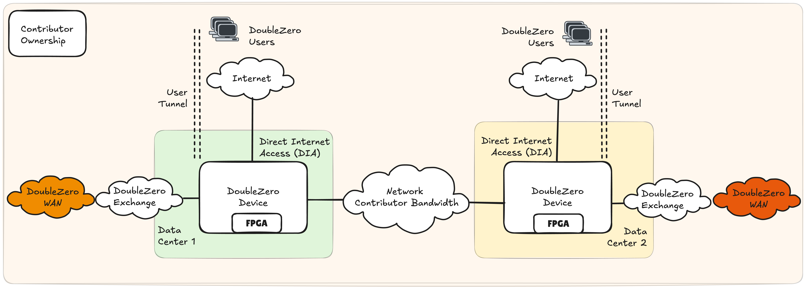
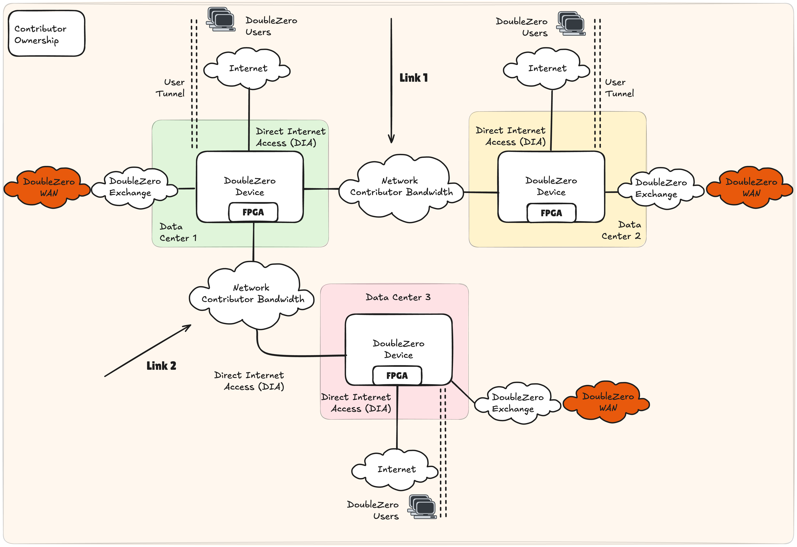
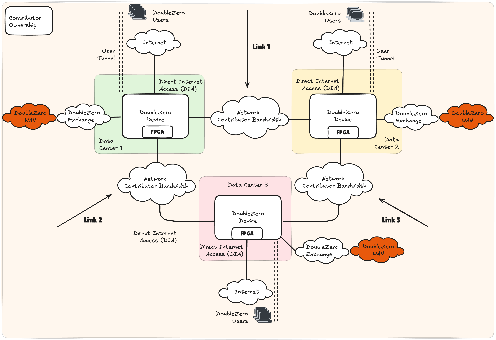
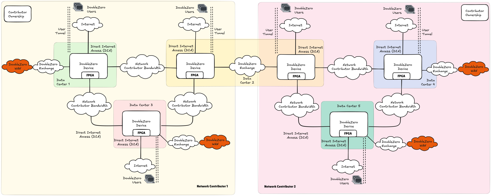
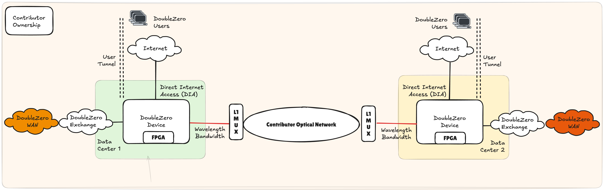
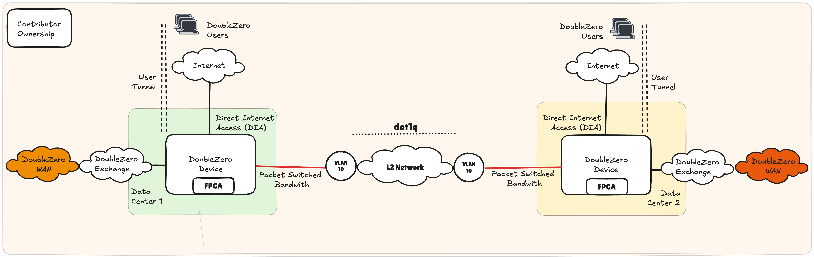
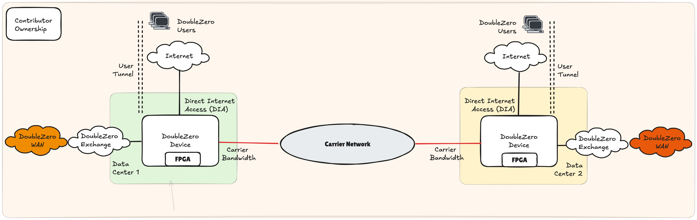

# Requisiti e Architettura per i Contributori
!!! warning "This translation was generated using artificial intelligence and has not been reviewed by a human translator. It may contain inaccuracies or errors and should not be relied upon."

## Sommario

Chiunque desideri monetizzare i propri cavi in fibra ottica e hardware di rete sottoutilizzati può contribuire alla rete DoubleZero. I contributori di rete devono fornire larghezza di banda dedicata tra due punti, operare dispositivi compatibili con DoubleZero (DZD) ad entrambe le estremità, e una connessione alla rete internet pubblica ad entrambe le estremità. I contributori di rete devono anche eseguire il software DoubleZero su ogni DZD per fornire servizi come multicast, ricerca utenti e filtraggio perimetrale.

Lo smart contract DoubleZero è il pilastro fondamentale per garantire che la rete mantenga link di alta qualità che possono essere misurati e integrati nella topologia, consentendo ai nostri controller di rete di sviluppare il percorso end-to-end più efficiente tra i diversi utenti e endpoint. A seguito dell'esecuzione dello smart contract e del deployment dell'infrastruttura di rete e della larghezza di banda, un'entità viene classificata come contributore di rete. Consulta [DoubleZero Economics](https://economics.doublezero.xyz/overview) per comprendere ulteriormente l'economia alla base della partecipazione a DoubleZero come contributore di rete.

---

## Requisiti per Diventare un Contributore di Rete DoubleZero

- Larghezza di banda dedicata in grado di fornire connettività IPv4 e un MTU di 2048 byte tra due data center
- Hardware DoubleZero Device (DZD) compatibile con il protocollo DoubleZero
- Connettività a internet e ad altri contributori della rete DoubleZero
- Installazione del software DoubleZero sul DZD

## Guida Rapida all'Avvio

Come contributore di rete, il modo più semplice per iniziare con DoubleZero è identificare la capacità nella propria rete che può essere dedicata a DoubleZero. Una volta identificata, i DZD devono essere distribuiti, facilitando la rete overlay DoubleZero che richiede solo raggiungibilità IPv4 e un MTU minimo di 2048 byte come dipendenze dalla rete del contributore.

La Figura 1 illustra il modello più semplice per contribuire con larghezza di banda e servizi di invio ed elaborazione dei pacchetti. Un DZD viene distribuito in ogni data center, interfacciandosi con la rete interna del contributore per fornire connettività WAN DoubleZero. Questo è integrato da un accesso internet locale, tipicamente una soluzione Direct Internet Access (DIA), utilizzata come punto di accesso per gli utenti DoubleZero. Mentre ci si aspetta che il DIA sia l'opzione preferita per facilitare l'accesso agli utenti di DoubleZero, sono possibili numerosi modelli di connettività, ad esempio cablaggio fisico ai server, estensione del fabric di rete, ecc. Ci riferiamo a queste opzioni come Choose Your Own Adventure (CYOA), fornendo al contributore la flessibilità di connettere utenti locali o remoti nel modo che meglio si adatta alle proprie politiche di rete interne.

Come in qualsiasi rete, la raggiungibilità è una parte fondamentale dell'architettura poiché i contributori di rete non possono vivere in isolamento. Pertanto, il DZD *deve* avere un link a un DoubleZero Exchange (DZX) per creare una rete contigua tra i partecipanti.

<figure markdown="span">
  { width="800" }
  <figcaption>Figura 1: Contributo di Larghezza di Banda alla Rete DoubleZero Tra 2 Data Center - Singolo Contributore</figcaption>
</figure>

### Esempi di Contributo

I modi in cui un contributore di rete può ampliare i propri contributi a DoubleZero sono molteplici, tra cui:

- Migliorare le caratteristiche di prestazione dei contributi esistenti: aumentare la larghezza di banda, ridurre la latenza
- Aggiungere più link tra gli stessi data center
- Aggiungere un nuovo link da un data center esistente a un nuovo data center
- Aggiungere un nuovo link indipendente tra due nuovi data center

#### Esempio 1: Singolo Contributore, 3 Data Center, Due Link
<figure markdown="span">
  { width="800" }
  <figcaption>Figura 2: Contributo di Larghezza di Banda alla Rete DoubleZero Tra 3 Data Center - Singolo Contributore</figcaption>
</figure>

Un singolo DZD può supportare più link contribuiti a DoubleZero. La Figura 2 illustra una potenziale topologia se un singolo data center, indicato come 1, termina la larghezza di banda verso due diversi data center remoti 2 e 3. In questo scenario, ogni data center contiene solo 1 DZD. Tutti i DZD utilizzano il DIA per i punti di accesso degli utenti come interfaccia CYOA.

#### Esempio 2: Singolo Contributore, 3 Data Center, Tre Link

La Figura 3 descrive la topologia DoubleZero quando un singolo contributore distribuisce tre link in una topologia a triangolo tra 3 data center. In uno scenario simile all'esempio 1, un singolo DZD viene distribuito nei data center 1, 2 e 3, ognuno dei quali supporta 2 link di rete indipendenti. La topologia risultante è un triangolo o anello tra i data center.

<figure markdown="span">
  { width="800" }
  <figcaption>Figura 3: Contributo di Larghezza di Banda alla Rete DoubleZero Tra 3 Data Center - Singolo Contributore </figcaption>
</figure>

### DoubleZero Exchange

La creazione di una rete contigua è un elemento fondamentale dell'architettura DoubleZero. I contributori si interfacciano tramite un DoubleZero Exchange (DZX) all'interno di un'area metropolitana, ovvero una città come New York (NYC), Londra (LON) o Tokyo (TYO). Un DZX è un fabric di rete simile a un Internet Exchange, che consente il peering e lo scambio di route.

Nella Figura 4, il contributore di rete 1 opera nei data center 1, 2 e 3, mentre il contributore di rete 2 opera nei data center 2, 4 e 5. Interconnettendosi nel data center 2, la portata della rete DoubleZero si estende a 5 data center contigui.

<figure markdown="span">
  { width="1000" }
  <figcaption>Figura 4: Contributo di Larghezza di Banda alla Rete DoubleZero Tra 2 Contributori di Larghezza di Banda </figcaption>
</figure>

### Opzioni di Contributo della Larghezza di Banda

DoubleZero richiede a un contributore di rete di offrire connettività integrata tramite una larghezza di banda garantita, un profilo di latenza e jitter tra DZD in due data center di terminazione espresso tramite uno smart contract. DoubleZero non impone come un contributore di rete implementa il proprio contributo, tuttavia, nelle sezioni seguenti forniamo opzioni indicative per l'utilizzo a loro esclusiva discrezione.

Aree importanti da considerare per un contributore di rete potrebbero essere:

- Capacità di garantire le prestazioni di rete del servizio DoubleZero: larghezza di banda, latenza e jitter
- Segregazione dai servizi di rete interni esistenti
- Conflitti di indirizzamento IPv4, in particolare con lo spazio di indirizzi underlay del tunnel
- Uptime e disponibilità
- Considerazioni su CAPEX e OPEX

#### Larghezza di Banda Layer 1
<figure markdown="span">
  { width="800" }
  <figcaption>Figura 5: Servizi Ottici Layer 1 </figcaption>
</figure>

La larghezza di banda Layer 1, più formalmente descritta come servizi a lunghezza d'onda, può prevedere capacità dedicata su un'infrastruttura ottica esistente, come DWDM, CWDM o tramite multiplexer ottici (MUX). Nella Figura 5, i DZD utilizzano un'ottica colorata cablata a un MUX L1, che sovrappone la lunghezza d'onda del DZD su una fibra scura esistente.

Questa soluzione offre numerosi vantaggi per i contributori di rete che già gestiscono una rete core esistente. Le modifiche operative iterative, così come i requisiti aggiuntivi di CAPEX e OPEX, sono modesti. Questa opzione è particolarmente robusta nell'offrire segregazione dai servizi di rete del contributore.

#### Larghezza di Banda Packet Switched

Le reti packet switched possono essere considerate una tipica rete aziendale, che esegue protocolli standard di routing e switching a supporto delle applicazioni aziendali. Esistono numerose tecnologie di rete che raggiungono la connettività, ad esempio estensioni layer 2 (L2) tramite tag VLAN.

##### Estensione L2
<figure markdown="span">
  { width="800" }
  <figcaption>Figura 6: Reti Packet Switched - Estensione L2 </figcaption>
</figure>

Un'estensione L2 come mostrato nella Figura 6 può essere facilitata tramite il tagging VLAN. La porta di un DZD può essere cablata a uno switch della rete interna del contributore, con la porta dello switch impostata come porta di accesso, ad esempio, nella VLAN 10. Tramite il tagging 802.1q, questa VLAN può essere trasportata su più hop di switch sulla rete del contributore, terminando allo switch che si interfaccia con il DZD remoto.

Questa soluzione beneficia di un'ampia compatibilità e di una relativa facilità di implementazione, creando al contempo segmentazione tra DoubleZero e i servizi layer 3 interni. La larghezza di banda può essere controllata in base alla velocità dell'interfaccia dello switch o router interno del contributore. Occorre prestare particolare attenzione alle prestazioni attraverso la rete L2 interna condivisa tramite tecnologie come Quality of Service (QoS) o altre politiche di gestione del traffico. Tuttavia, gli investimenti aggiuntivi in CAPEX e OPEX dovrebbero essere modesti se è disponibile capacità esistente nella rete core del contributore.

#### Larghezza di Banda di Terze Parti Dedicata
<figure markdown="span">
  { width="800" }
  <figcaption>Figura 7: Larghezza di Banda di Terze Parti Dedicata </figcaption>
</figure>

Sebbene il riutilizzo della capacità disponibile sarà interessante per molti contributori di rete, è possibile anche dedicare larghezza di banda appena acquisita a DoubleZero. In tale scenario, il DZD si collegherebbe direttamente al gestore di terze parti senza alcun dispositivo interno del contributore in linea (Figura 7).

Questa opzione è interessante in quanto garantisce larghezza di banda dedicata per DoubleZero, è semplice dal punto di vista operativo e garantisce una completa segmentazione da qualsiasi altro servizio di rete. Questa opzione avrà probabilmente il maggiore aumento dell'OPEX e richiede nuovi contratti di servizio con gestori di terze parti.

---

## Requisiti Hardware

### Contributo di Larghezza di Banda 100Gbps

Si noti che le quantità riportate di seguito riflettono l'attrezzatura necessaria in due data center, ovvero l'hardware totale necessario per distribuire 1 cavo in fibra ottica per il contributo di larghezza di banda.

??? warning "*Tutti gli FPGA sono soggetti a test finali. I contributi 10G possono essere supportati utilizzando switch Arista 7130LBR con FPGA dual Virtex® UltraScale+™ integrati (per qualsiasi domanda, DoubleZero Foundation / Malbec Labs sono lieti di fornire ulteriori informazioni)."

#### Requisiti di Funzione e Porta

| Funzione                    | Velocità Porta | Requisito DZ | QTY | Note |
|-----------------------------|---------------|--------------|-----|-------------------------------------------------------------------------------------------------------------------------------------------------------------------|
| Larghezza di Banda Privata  | 100G          | Sì           | 1   |                                                                                                                                                                   |
| Direct Internet Access (DIA) | 10G          | Sì           | 2   |                                                                                                                                                                   |
| DoubleZero eXchange (DZX)   | 100G          | Sì*          | 1   | Deve essere supportato una volta che più di 3 provider operano nella stessa area metropolitana; prima di ciò, cross-connect o altri accordi di peering possono essere utilizzati per interconnettersi con altri provider. |
| Management                  |               | No           | 1   | Determinato dalle politiche di gestione interne del contributore.                                                                                                |
| Console                     |               | No           | 1   | Determinato dalle politiche di gestione interne del contributore.                                                                                                |

#### Hardware di Rete DZD

| Produttore | Modello         | Numero Parte          | Requisito DZ | QTY | Note |
|------------|-----------------|----------------------|--------------|-----|-----------------------------------------------------------|
| AMD*       | V80*            | 24540474             | Sì           | 4   |                                                           |
| Arista     | 7280CR3A        | DCS-7280CR3A-32S     | Sì           | 2   | Possono essere possibili alternative se i lead time sono problematici. |

---

#### Ottiche - 100G

| Produttore | Modello         | Numero Parte     | Requisito DZ | QTY | Note |
|------------|-------------|----------------|--------------|-----|-------------------------------------------------------------|
| Arista     | 100GBASE-LR | QSFP-100G-LR    | No           | 16  | Scelta di cablaggio e ottica a discrezione del contributore. 100G richiesto per connettere gli FPGA. |

---

#### Ottiche - 10G

| Produttore | Modello         | Numero Parte     | Requisito DZ | QTY | Note |
|------------|-------------|----------------|--------------|-----|-------------------------------------------------------------|
| Arista     | 10GBASE-LR  | SFP-10G-LR      | No           | 2   | Scelta di cablaggio e ottica a discrezione del contributore. |
| Finisar    | DynamiX QSA™ | MAM1Q00A-QSA   | No           | 2   | Scelta di cablaggio e ottica a discrezione del contributore. |

---

#### Indirizzamento IP

| Indirizzamento IP | Dimensione Minima Sottorete | Requisito DZ | Note |
|------------------|---------------------------|--------------|----------------------------------------------------------|
| IPv4 Pubblico    | /29                       | Sì (per DZD edge/hybrid) | Deve essere instradabile tramite DIA. Potremmo eliminare la necessità di questo nel tempo. |

Assicurarsi che l'intero pool /29 sia disponibile per il protocollo DZ. Eventuali requisiti per l'indirizzamento point-to-point, ad esempio sulle interfacce DIA, devono essere gestiti tramite un pool di indirizzi diverso.

### Contributo di Larghezza di Banda 10Gbps

Si noti che le quantità riflettono l'attrezzatura di due data center, ovvero l'hardware totale necessario per distribuire 1 contributo di larghezza di banda.

#### Requisiti di Funzione e Porta

| Funzione                    | Velocità Porta | Requisito DZ | QTY | Note |
|-----------------------------|---------------|--------------|-----|-------------------------------------------------------------------------------------------------------------------------------------------------------------------|
| Larghezza di Banda Privata  | 10G           | Sì           | 1   |                                                                                                                                                                   |
| Direct Internet Access (DIA) | 10G          | Sì           | 2   |                                                                                                                                                                   |
| DoubleZero eXchange (DZX)   | 100G          | Sì*          | 1   | Deve essere supportato una volta che più di 3 provider operano nella stessa area metropolitana; prima di ciò, cross-connect o altri accordi di peering possono essere utilizzati per interconnettersi con altri provider. |
| Management                  |               | No           | 1   | Determinato dalle politiche di gestione interne del contributore.                                                                                                |
| Console                     |               | No           | 1   | Determinato dalle politiche di gestione interne del contributore.                                                                                                |

---

#### Hardware

| Produttore | Modello         | Numero Parte          | Requisito DZ | QTY | Note |
|------------|-----------------|----------------------|--------------|-----|-----------------------------------------------------------|
| AMD*       | V80*            | 24540474*            | Sì           | 4   |                                                           |
| Arista     | 7280CR3A        | DCS-7280CR3A-32S     | Sì           | 2   | Possono essere possibili alternative se i lead time sono problematici. |

---

#### Ottiche - 100G

| Produttore | Modello         | Numero Parte     | Requisito DZ | QTY | Note |
|------------|-------------|----------------|--------------|-----|-------------------------------------------------------------|
| Arista     | 100GBASE-LR | QSFP-100G-LR    | No           | 14  | Scelta di cablaggio e ottica a discrezione del contributore. 100G richiesto per connettere gli FPGA. |

---

#### Ottiche - 10G

| Produttore | Modello         | Numero Parte     | Requisito DZ | QTY | Note |
|------------|-------------|----------------|--------------|-----|-------------------------------------------------------------|
| Arista     | 10GBASE-LR  | SFP-10G-LR      | No           | 4   | Scelta di cablaggio e ottica a discrezione del contributore. |
| Finisar    | DynamiX QSA™ | MAM1Q00A-QSA   | No           | 4   | Scelta di cablaggio e ottica a discrezione del contributore. |

---

#### Indirizzamento IP

| Indirizzamento IP | Dimensione Minima Sottorete | Requisito DZ | Note |
|------------------|---------------------------|--------------|----------------------------------------------------------|
| IPv4 Pubblico    | /29                       | Sì (per DZD edge/hybrid) | Deve essere instradabile tramite DIA. Potremmo eliminare la necessità di questo nel tempo. |

Assicurarsi che l'intero pool /29 sia disponibile per il protocollo DZ. Eventuali requisiti per l'indirizzamento point-to-point, ad esempio sulle interfacce DIA, devono essere gestiti tramite un pool di indirizzi diverso.

### Requisiti del Data Center

#### Requisiti di Rack e Alimentazione

| Requisito    | Specifica |
|-------------|-----------|
| Spazio Rack | 4U        |
| Alimentazione | 4KW (raccomandato) |

---

## Prossimi Passi

Pronto a effettuare il provisioning del tuo primo DZD? Continua con la [Guida al Provisioning dei Dispositivi](contribute-provisioning.md).
