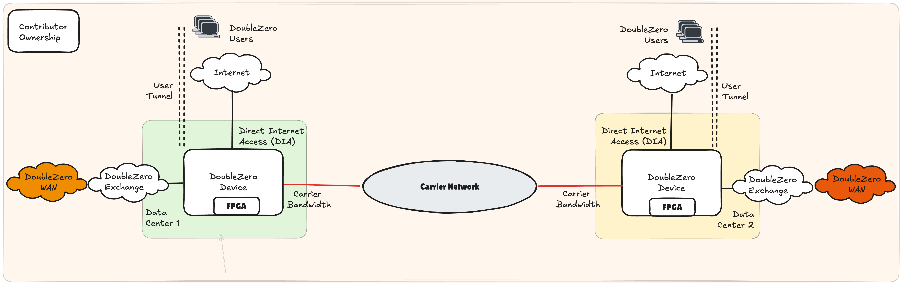

# Contributors Requirements & Architecture

## Summary

Anyone who wishes to monetize their underutilized fiber optic cables and network hardware may contribute to the DoubleZero network. Network contributors must provide dedicated bandwidth between two points, operate DoubleZero compatible devices (DZDs) at each end, and a connection to the public internet at each end. Network contributors must also run DoubleZero software on each DZD to provide services like multicast, user lookup, and edge filtration.

The DoubleZero smart contract is the cornerstone of ensuring that the network maintains high-quality links that can be measured and integrated into the topology, allowing our network controllers to develop the most efficient end-to-end path between our different users and endpoints. Upon execution of the smart contract and deployment of the network equipment and bandwidth, an entity is classified as a network contributor.  See [DoubleZero Economics](https://economics.doublezero.xyz/overview) to further understand the economics behind participating in DoubleZero as a network contributor.

---

## Requirements to be a DoubleZero Network Contributor

- Dedicated bandwidth that can provide IPv4 connectivity and an MTU of 2048 bytes between two data centers
- DoubleZero Device (DZD) hardware that is compatible with the DoubleZero protocol
- Connectivity to the internet and other DoubleZero network contributors
- Installation of DoubleZero software on the DZD

## Quick Start Guide

As a network contributor, the simplest way to get started in DoubleZero is by identifying capacity in your network that can be dedicated for DoubleZero. Once identified, DZDs must be deployed, facilitating the DoubleZero overlay network which only requires IPv4 reachability and a minimum MTU of 2048 bytes as its dependencies from the contributor's network.

Figure 1 highlights the simplest model for contributing bandwidth and packet sending and processing services. A DZD is deployed in each data center, interfacing with the network contributor's internal network to provide DoubleZero WAN connectivity. This is complemented by local internet, typically a Direct Internet Access (DIA) solution, that is used as on-ramps for DoubleZero users. While it is expected that DIA will be the preferred option for facilitating access to users of DoubleZero, numerous connectivity models are possible e.g. physical cabling to servers, network fabric extension, etc. We refer to these options as Choose Your Own Adventure (CYOA), providing the contributor flexibility to connect local or remote users in a way that best fits their internal network policies.

As with any network, reachability is a fundamental part of the architecture as network contributors cannot live in isolation. As such, the DZD *must* have a link to a DoubleZero Exchange (DZX) to create a contiguous network between participants.

<figure markdown="span">
  { width="800" }
  <figcaption>Figure 1: DoubleZero Network Bandwidth Contribution Between 2 Data Centers - Single Contributor</figcaption>
</figure>

### Example Contributions

The ways in which a network contributor can grow their DoubleZero contributions are many, including:

- Improve the performance characteristics of their existing contributions: increase bandwidth, reduce latency
- Add multiple links between the same data centers
- Add a new link from an existing data center to a new data center
- Add a new, independent link between two new data centers

#### Example 1: Single Contributor, 3 Data Centers, Two Links
<figure markdown="span">
  { width="800" }
  <figcaption>Figure 2: DoubleZero Network Bandwidth Contribution Between 3 Data Centers - Single Contributor</figcaption>
</figure>

A single DZD can support multiple links contributed to DoubleZero. Figure 2 illustrates a potential topology if a single data center, denoted as 1, terminates bandwidth to two different remote data centers 2 and 3. In this scenario, each data center contains only 1 DZD. All DZDs are using DIA for user on-ramps as their CYOA interface.

#### Example 2: Single Contributor, 3 Data Centers, Three Links

Figure 3 describes the DoubleZero topology when a single contributor deploys three links in a triangle topology between 3 data centers. In a scenario similar to example 1, a single DZD is deployed in data centers 1, 2 and 3, each supporting 2 independent network links. The resulting topology is a triangle or ring between data centers.

<figure markdown="span">
  { width="800" }
  <figcaption>Figure 3: DoubleZero Network Bandwidth Contribution Between 3 Data Centers - Single Contributor </figcaption>
</figure>

### DoubleZero Exchange

The creation of a contiguous network is a fundamental building block of the DoubleZero architecture. Contributors interface via a DoubleZero Exchange (DZX) within a metropolitan area, which is a city such as New York (NYC), London (LON) or Tokyo (TYO). A DZX is a network fabric similar to an Internet Exchange, allowing peering and route exchange.

In figure 4, network contributor 1 operates in data centers 1, 2 and 3, while network contributor 2 operates in data centers 2, 4 and 5. By interconnecting in data center 2, the DoubleZero network reach increases to 5 contiguous data centers.

<figure markdown="span">
  { width="1000" }
  <figcaption>Figure 4: DoubleZero Network Bandwidth Contribution Between 2 Network Bandwidth Contributors </figcaption>
</figure>

### Bandwidth Contribution Options

DoubleZero requires a network contributor to offer integrated connectivity via a guaranteed bandwidth, latency and jitter profile between DZDs at two terminating data centers expressed via a smart contract. DoubleZero does not mandate how a network contributor implements their contribution, however, in the following sections we provide indicative options for use at their sole discretion.

Important areas to consider for a network contributor might be:

- Ability to guarantee network performance of the DoubleZero service: bandwidth, latency, and jitter
- Segregation from their existing internal network services
- IPv4 addressing clashes, specifically with the tunnel underlay address space
- Uptime and availability
- CAPEX and OPEX considerations

#### Layer 1 Bandwidth
<figure markdown="span">
  { width="800" }
  <figcaption>Figure 5: Layer 1 Optical Services </figcaption>
</figure>

Layer 1 bandwidth, more formally described as wavelength services, may see dedicated capacity provisioned on an existing optical infrastructure, such as DWDM, CWDM or via optical multiplexers (MUX). In figure 5, the DZDs use a colored optic that is cabled to an L1 MUX, which interleaves the DZD wavelength on to an existing dark fiber.

This solution has numerous benefits for network contributors who already operate an existing core network. The iterative operational changes, as well as additional CAPEX and OPEX requirements, are modest. This option is particularly robust in offering segregation from the network contributor's network services.

#### Packet Switched Bandwidth

Packet switched networks can be considered a typical enterprise network, running standard routing and switching protocols supporting business applications. There are numerous networking technologies that achieve connectivity, for example, layer 2 (L2) extensions using VLAN tags.

##### L2 Extension
<figure markdown="span">
  { width="800" }
  <figcaption>Figure 6: Packet Switched Networks - L2 Extension </figcaption>
</figure>

An L2 extension as shown in Figure 6 can be facilitated through VLAN tagging. A DZD's port can be cabled to a contributor's internal network switch, with the switch port being set as an access port in, for example, VLAN 10. Through 802.1q tagging, this VLAN can be carried over multiple switch-hops on the contributor's network, terminating at the switch interfacing with the remote DZD.

This solution benefits from being widely supported and relatively easy to implement while creating segmentation between DoubleZero and internal layer 3 services. Bandwidth can be controlled based on the interface speed of the contributor's internal switch or router. Careful consideration must be given to performance across the shared internal L2 network through technologies such as Quality of Service (QoS) or other traffic management policies. However, additional CAPEX and OPEX investments should be modest if existing capacity is available within the contributor's core network.

#### Dedicated 3rd Party Bandwidth
<figure markdown="span">
  { width="800" }
  <figcaption>Figure 7: Dedicated 3rd Party Bandwidth </figcaption>
</figure>

While reusing available capacity will be attractive to many network contributors, one can also dedicate newly acquired bandwidth to DoubleZero. In such a scenario, the DZD would connect directly to the 3rd party carrier without any internal devices of the contributor sitting inline (figure 7).

This option is attractive as it ensures dedicated bandwidth for DoubleZero, is simple operationally and ensures complete segmentation from any other network services. This option will likely have the highest OPEX increase and requires new service contracts with 3rd party carriers.

---

## Hardware Requirements

### 100Gbps Bandwidth Contribution

Note that quantities below reflect equipment needed in two data centers, i.e. the total required hardware necessary to deploy 1 fiber optic cable for bandwidth contribution.

??? warning "*All FPGAs are subject to final testing.  10G contributions may be supported using Arista 7130LBR switches with inbuilt dual Virtex® UltraScale+™ FPGAs (please discuss with the DoubleZero Foundation / Malbec Labs)."

#### Function & Port Requirements

| Function                    | Port Speed | DZ Requirement | QTY | Note |
|-----------------------------|------------|----------------|-----|-------------------------------------------------------------------------------------------------------------------------------------------------------------------|
| Private Bandwidth           | 100G       | Yes            | 1   |                                                                                                                                                                   |
| Direct Internet Access (DIA) | 10G       | Yes            | 2   |                                                                                                                                                                   |
| DoubleZero eXchange (DZX)   | 100G       | Yes*           | 1   | Must be supported once more than 3 providers operate in the same metro area, preceding this, cross-connects or other peering arrangements can be used to interconnect to other providers. |
| Management                  |            | No            | 1   | Determined by contributor's own internal management policies.                                                                                                    |
| Console                     |            | No             | 1   | Determined by contributor's own internal management policies.                                                                                                    |

#### DZD Network Hardware

| Make     | Model            | Part Number           | DZ Requirement | QTY | Note |
|----------|-----------------|----------------------|----------------|-----|-----------------------------------------------------------|
| AMD*      | V80*           | 24540474    | Yes            | 4   |                                                           |
| Arista   | 7280CR3A        | DCS-7280CR3A-32S    | Yes            | 2   | Alternatives may be possible if lead times are challenging. |

---

#### Optics - 100G

| Make   | Model         | Part Number     | DZ Requirement | QTY | Note |
|--------|-------------|----------------|----------------|-----|-------------------------------------------------------------|
| Arista | 100GBASE-LR | QSFP-100G-LR    | No             | 16  | Cabling and optic choice available at contributor's discretion. 100G required to connect FPGAs. |

---

#### Optics - 10G

| Make   | Model         | Part Number     | DZ Requirement | QTY | Note |
|--------|-------------|----------------|----------------|-----|-------------------------------------------------------------|
| Arista | 10GBASE-LR | SFP-10G-LR    | No             | 2   | Cabling and optic choice available at contributor's discretion. |
| Finisar | DynamiX QSA™ | MAM1Q00A-QSA   | No             | 2   | Cabling and optic choice available at contributor's discretion. |

---

#### IP Addressing

| IP Addressing | Minimum Subnet Size | DZ Requirement | Note |
|--------------|-------------------|----------------|----------------------------------------------------------|
| Public IPv4  | /29               | Yes (for edge/hybrid DZDs)           | Must be routable via DIA. We may eliminate the need for this over time. |

Please ensure that the full /29 pool is available for the DZ protocol.  Any requirements for point-to-point addressing, e.g., on DIA interfaces, should be managed via a different address pool.

### 10Gbps Bandwidth Contribution

Note that quantities reflect two data centers' equipment i.e. the total required hardware necessary to deploy 1 bandwidth contribution.

#### Function & Port Requirements

| Function                    | Port Speed | DZ Requirement | QTY | Note |
|-----------------------------|------------|----------------|-----|-------------------------------------------------------------------------------------------------------------------------------------------------------------------|
| Private Bandwidth           | 10G        | Yes            | 1   |                                                                                                                                                                   |
| Direct Internet Access (DIA) | 10G        | Yes            | 2   |                                                                                                                                                                   |
| DoubleZero eXchange (DZX)   | 100G       | Yes*           | 1   | Must be supported once more than 3 providers operate in the same metro area; preceding this, cross-connects or other peering arrangements can be used to interconnect to other providers. |
| Management                  |            | No             | 1   | Determined by contributor's own internal management policies.                                                                                                    |
| Console                     |            | No             | 1   | Determined by contributor's own internal management policies.                                                                                                    |

---

#### Hardware

| Make     | Model            | Part Number           | DZ Requirement | QTY | Note |
|----------|-----------------|----------------------|----------------|-----|-----------------------------------------------------------|
| AMD*      | V80*           | 24540474*    | Yes            | 4   |                                                           |              |
| Arista   | 7280CR3A        | DCS-7280CR3A-32S    | Yes            | 2   | Alternatives may be possible if lead times are challenging. |

---

#### Optics - 100G

| Make   | Model         | Part Number     | DZ Requirement | QTY | Note |
|--------|-------------|----------------|----------------|-----|-------------------------------------------------------------|
| Arista | 100GBASE-LR | QSFP-100G-LR    | No             | 14  | Cabling and optic choice available at contributor's discretion. 100G required to connect FPGAs. |

---

#### Optics - 10G

| Make   | Model         | Part Number     | DZ Requirement | QTY | Note |
|--------|-------------|----------------|----------------|-----|-------------------------------------------------------------|
| Arista | 10GBASE-LR | SFP-10G-LR    | No             | 4   | Cabling and optic choice available at contributor's discretion. |
 Finisar | DynamiX QSA™ | MAM1Q00A-QSA   | No             | 4   | Cabling and optic choice available at contributor's discretion. |
---

#### IP Addressing

| IP Addressing | Minimum Subnet Size | DZ Requirement | Note |
|--------------|-------------------|----------------|----------------------------------------------------------|
| Public IPv4  | /29               | Yes (for edge/hybrid DZDs)            | Must be routable via DIA. We may eliminate the need for this over time. |

Please ensure that the full /29 pool is available for the DZ protocol.  Any requirements for point-to-point addressing, e.g., on DIA interfaces, should be managed via a different address pool.

### Data Center Requirements

#### Rack & Power Requirements

| Requirement  | Specification |
|-------------|--------------|
| Rack Space  | 4U           |
| Power       | 4KW (recommended) |

---

## Next Steps

Ready to provision your first DZD? Continue to the [Device Provisioning Guide](contribute-provisioning.md).
