# Guia de Provisionamento de Dispositivo

Este guia orienta você no provisionamento de um DoubleZero Device (DZD) do início ao fim. Cada fase corresponde ao [Checklist de Onboarding](index.md#onboarding-checklist).

---

## Como Tudo se Encaixa

Este guia orienta você no registro da sua infraestrutura on-chain para que a rede DoubleZero possa rotear tráfego através dela. Quanto mais completamente seu dispositivo estiver registrado, mais útil ele será para a rede. Uma representação on-chain completa do seu dispositivo permite melhor resolução de problemas, planejamento de capacidade e permite que o controlador tome decisões informadas. Com o tempo, o objetivo é que o controlador assuma mais responsabilidade de configuração.

### Conceitos principais

**Interfaces**

Interfaces em um DZD vêm em diferentes formas: portas Ethernet, port channels (LAGs compostos por múltiplas portas Ethernet) e loopbacks. Cada interface que desempenha um papel na rede precisa ser registrada on-chain com as flags apropriadas para que o protocolo saiba qual é sua função.

Portas Ethernet e port channels podem desempenhar os seguintes papéis:

| Flag | O que significa |
|------|-----------------|
| `--interface-dia dia` | Marca a interface como uplink de acesso direto à internet |
| `--interface-cyoa <subtype>` | Declara como os usuários estabelecem túneis GRE através desta interface (ex.: pela internet pública, via link de peering privado) |
| `--user-tunnel-endpoint true` | Esta interface carrega um IP público no qual os usuários terminam túneis GRE |

Interfaces usadas para links WAN ou DZX não possuem uma flag específica — elas são registradas com sua largura de banda e então referenciadas quando o link é criado.

Interfaces de loopback servem a diversos propósitos:

| Loopback | O que significa |
|----------|-----------------|
| **Loopback100 / 101** | Carregam IPs públicos nos quais os usuários terminam túneis GRE. Registrados com `--user-tunnel-endpoint true`. |
| **Loopback255** (`vpnv4`) | Registrado para que o controlador possa atribuir um IP usado para router ID BGP, peering VPN-IPv4 (unicast), identidade IS-IS e segment routing |
| **Loopback256** (`ipv4`) | Registrado para que o controlador possa atribuir um IP usado para peering BGP IPv4 (multicast) e sessões MSDP |

**Links**

Links são registrados separadamente das interfaces, e as interfaces devem existir on-chain antes que um link possa referenciá-las. Quando você cria um link WAN ou DZX, você especifica uma interface já registrada como endpoint físico do link. Nem todas as interfaces estão vinculadas a um link: interfaces DIA, CYOA e loopback não são conectadas a um link.

| Termo | O que significa |
|-------|-----------------|
| **WAN Link** | Um link entre dois dos seus próprios DZDs |
| **DZX Link** | Um link entre o seu DZD e o DZD de outro contribuidor |

### Visão geral da arquitetura

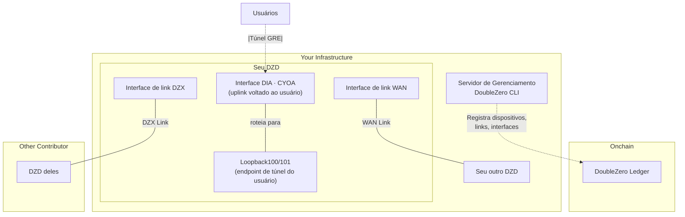

---

## Fase 1: Pré-requisitos

Antes de provisionar um dispositivo, você precisa do hardware físico configurado e alguns endereços IP alocados.

### O Que Você Precisa

| Requisito | Por Que É Necessário |
|-----------|----------------------|
| **Hardware DZD** | Switch Arista 7280CR3A (veja [especificações de hardware](requirements.md#hardware-requirements)) |
| **Espaço no Rack** | 4U com fluxo de ar adequado |
| **Energia** | Alimentação redundante, ~4KW recomendado |
| **Acesso de Gerenciamento** | Acesso SSH/console para configurar o switch |
| **Conectividade com a Internet** | Para publicação de métricas e para buscar configuração do controlador |
| **Bloco de IPv4 Público** | Mínimo /29 para o pool de prefixos DZ (veja abaixo) |

### Instale o DoubleZero CLI

O DoubleZero CLI (`doublezero`) é usado durante todo o provisionamento para registrar dispositivos, criar links e gerenciar sua contribuição. Ele deve ser instalado em um **servidor de gerenciamento ou VM** — não no switch DZD em si. O switch executa apenas o Config Agent e o Telemetry Agent (instalados na [Fase 4](#phase-4-link-establishment-agent-installation)).

**Ubuntu / Debian:**
```bash
curl -1sLf https://dl.cloudsmith.io/public/malbeclabs/doublezero/setup.deb.sh | sudo -E bash
sudo apt-get install doublezero
```

**Rocky Linux / RHEL:**
```bash
curl -1sLf https://dl.cloudsmith.io/public/malbeclabs/doublezero/setup.rpm.sh | sudo -E bash
sudo yum install doublezero
```

Verifique se o daemon está em execução:
```bash
sudo systemctl status doublezerod
```

### Entendendo Seu Prefixo DZ

Seu prefixo DZ é um bloco de endereços IP públicos que o protocolo DoubleZero gerencia para alocação de IP.

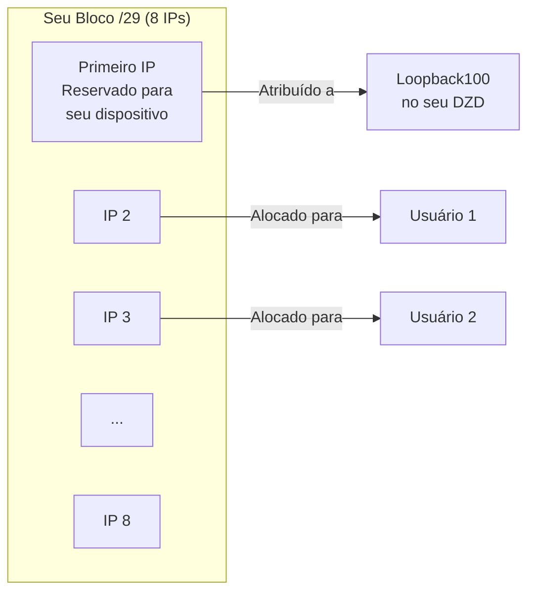

**Como os prefixos DZ são usados:**

- **Primeiro IP**: Reservado para seu dispositivo (atribuído à interface Loopback100)
- **IPs restantes**: Alocados para tipos específicos de usuários que se conectam ao seu DZD:
    - Usuários `IBRLWithAllocatedIP`
    - Usuários `EdgeFiltering` (caso de uso futuro)
- **Usuários IBRL**: NÃO consomem deste pool (eles usam seu próprio IP público)

!!! warning "Regras do Prefixo DZ"
    **Você NÃO PODE usar esses endereços para:**

    - Seus próprios equipamentos de rede
    - Links ponto a ponto em interfaces DIA
    - Interfaces de gerenciamento
    - Qualquer infraestrutura fora do protocolo DZ

    **Requisitos:**

    - Devem ser endereços IPv4 **globalmente roteáveis (públicos)**
    - Faixas de IP privado (10.x, 172.16-31.x, 192.168.x) são rejeitadas pelo smart contract
    - **Tamanho mínimo: /29** (8 endereços), prefixos maiores são preferíveis (ex.: /28, /27)
    - O bloco inteiro deve estar disponível — não pré-aloque nenhum endereço

    Se você precisar de endereços para seus próprios equipamentos (IPs de interface DIA, gerenciamento, etc.), use um **pool de endereços separado**.

---

## Fase 2: Configuração da Conta

Nesta fase, você cria as chaves criptográficas que identificam você e seus dispositivos na rede.

### Onde Executar o CLI

!!! warning "NÃO instale o CLI no seu switch"
    O DoubleZero CLI (`doublezero`) deve ser instalado em um **servidor de gerenciamento ou VM**, não no seu switch Arista.

    ```mermaid
    flowchart LR
        subgraph "Servidor de Gerenciamento/VM"
            CLI[DoubleZero CLI]
            KEYS[Seus Keypairs]
        end

        subgraph "Seu Switch DZD"
            CA[Config Agent]
            TA[Telemetry Agent]
        end

        CLI -->|Cria dispositivos, links| BC[Blockchain]
        CA -->|Busca config| CTRL[Controlador]
        TA -->|Envia métricas| BC
    ```

    | Instalar no Servidor de Gerenciamento | Instalar no Switch |
    |---------------------------------------|---------------------|
    | CLI `doublezero` | Config Agent |
    | Seu keypair de serviço | Telemetry Agent |
    | Seu keypair de metrics publisher | Keypair de metrics publisher (cópia) |

### O Que São Chaves?

Pense nas chaves como credenciais de login seguras:

- **Chave de Serviço**: Sua identidade de contribuidor — usada para executar comandos CLI
- **Chave de Metrics Publisher**: A identidade do seu dispositivo para enviar dados de telemetria

Ambas são pares de chaves criptográficas (uma chave pública que você compartilha, uma chave privada que você mantém em segredo).

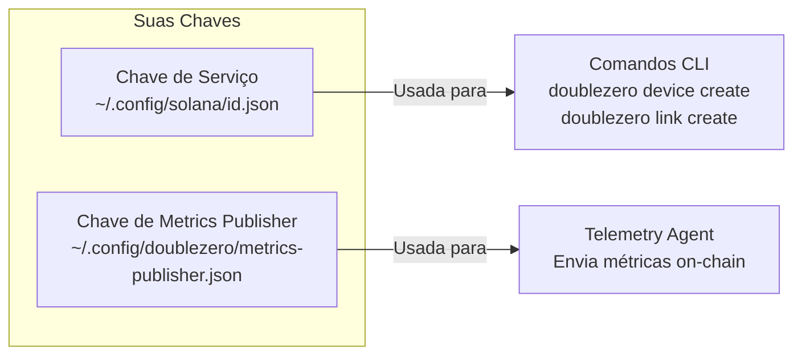

### Passo 2.1: Gere Sua Chave de Serviço

Esta é sua identidade principal para interagir com o DoubleZero.

```bash
doublezero keygen
```

Isso cria um par de chaves no local padrão. A saída mostra sua **chave pública** — é isso que você compartilhará com a DZF.

### Passo 2.2: Gere Sua Chave de Metrics Publisher

Esta chave é usada pelo Telemetry Agent para assinar envios de métricas.

```bash
doublezero keygen -o ~/.config/doublezero/metrics-publisher.json
```

### Passo 2.3: Envie as Chaves para a DZF

Entre em contato com a DoubleZero Foundation ou Malbec Labs e forneça:

1. Sua **chave pública da chave de serviço**
2. Seu **nome de usuário do GitHub** (para acesso ao repositório)

Eles irão:

- Criar sua **conta de contribuidor** on-chain
- Conceder acesso ao **repositório privado de contribuidores**

### Passo 2.4: Verifique Sua Conta

Uma vez confirmado, verifique se sua conta de contribuidor existe:

```bash
doublezero contributor list
```

Você deve ver seu código de contribuidor na lista.

### Passo 2.5: Acesse o Repositório de Contribuidores

O repositório [malbeclabs/contributors](https://github.com/malbeclabs/contributors) contém:

- Configurações base de dispositivos
- Perfis TCAM
- Configurações de ACL
- Instruções adicionais de configuração

Siga as instruções lá para configuração específica do dispositivo.

---

## Fase 3: Provisionamento do Dispositivo

Agora você vai registrar seu dispositivo físico na blockchain e configurar suas interfaces.

### Entendendo os Tipos de Dispositivo {#understanding-device-types}

**Edge** — aceita apenas conexões de usuários

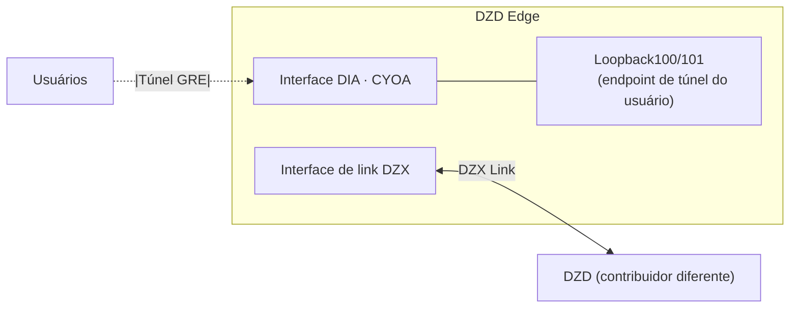

**Transit** — move tráfego entre dispositivos, sem conexões de usuários

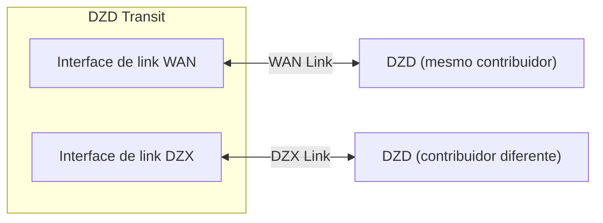

**Hybrid** — conexões de usuários e backbone, mais comum

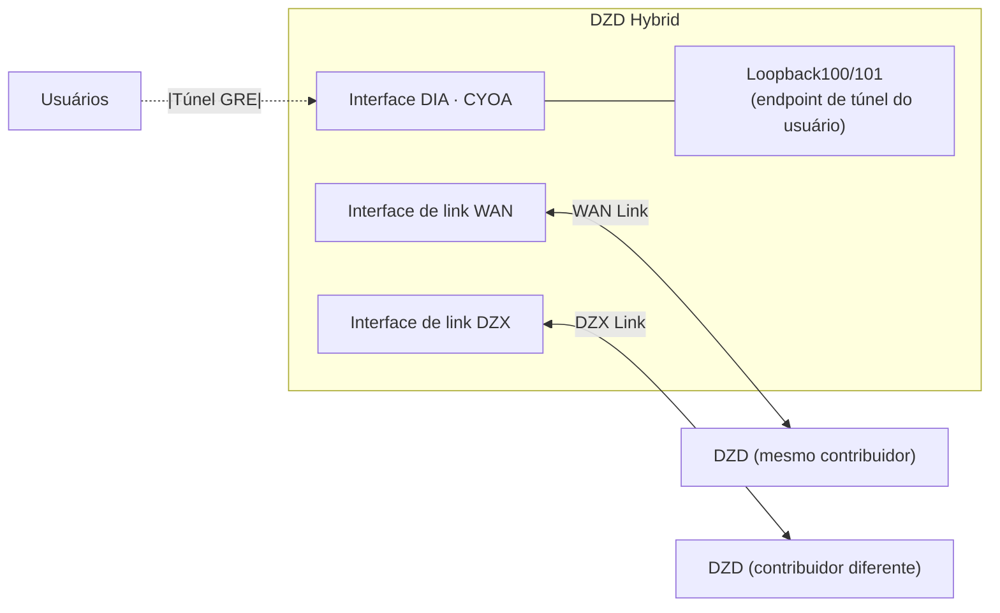

| Tipo | O Que Faz | Quando Usar |
|------|-----------|-------------|
| **Edge** | Aceita apenas conexões de usuários | Localização única, voltado apenas para usuários |
| **Transit** | Move tráfego entre dispositivos | Conectividade backbone, sem usuários |
| **Hybrid** | Conexões de usuários E backbone | Mais comum — faz tudo |

### Passo 3.1: Encontre Sua Localização e Exchange

Antes de criar seu dispositivo, consulte os códigos da localização do seu data center e da exchange mais próxima:

```bash
# Listar localizações disponíveis (data centers)
doublezero location list

# Listar exchanges disponíveis (pontos de interconexão)
doublezero exchange list
```

### Passo 3.2: Crie Seu Dispositivo On-chain {#step-32-create-your-device-onchain}

Registre seu dispositivo na blockchain:

```bash
doublezero device create \
  --code <SEU_CODIGO_DE_DISPOSITIVO> \
  --contributor <SEU_CODIGO_DE_CONTRIBUIDOR> \
  --device-type hybrid \
  --location <CODIGO_DE_LOCALIZACAO> \
  --exchange <CODIGO_DE_EXCHANGE> \
  --public-ip <IP_PUBLICO_DO_DISPOSITIVO> \
  --dz-prefixes <SEU_PREFIXO_DZ>
```

**Exemplo:**

```bash
doublezero device create \
  --code nyc-dz001 \
  --contributor acme \
  --device-type hybrid \
  --location EQX-NY5 \
  --exchange nyc \
  --public-ip "203.0.113.10" \
  --dz-prefixes "198.51.100.0/28"
```

**Saída esperada:**

```
Signature: 4vKz8H...truncated...7xPq2
```

Verifique se seu dispositivo foi criado:

```bash
doublezero device list | grep nyc-dz001
```

**Explicação dos parâmetros:**

| Parâmetro | O Que Significa |
|-----------|-----------------|
| `--code` | Um nome único para seu dispositivo (ex.: `nyc-dz001`) |
| `--contributor` | Seu código de contribuidor (fornecido pela DZF) |
| `--device-type` | `hybrid`, `transit` ou `edge` |
| `--location` | Código do data center obtido de `location list` |
| `--exchange` | Código da exchange mais próxima obtido de `exchange list` |
| `--public-ip` | O IP público onde os usuários se conectam ao seu dispositivo via internet |
| `--dz-prefixes` | Seu bloco de IP alocado para usuários |

### Passo 3.3: Crie as Interfaces Loopback Obrigatórias

Todo dispositivo precisa de duas interfaces loopback para roteamento interno:

```bash
# Loopback VPNv4
doublezero device interface create <CODIGO_DO_DISPOSITIVO> Loopback255 --loopback-type vpnv4

# Loopback IPv4
doublezero device interface create <CODIGO_DO_DISPOSITIVO> Loopback256 --loopback-type ipv4
```

**Saída esperada (para cada comando):**

```
Signature: 3mNx9K...truncated...8wRt5
```

### Passo 3.4: Crie as Interfaces Físicas

Registre as interfaces físicas que serão usadas para links WAN ou DZX. Essas interfaces devem existir on-chain antes que você possa criar um link que as referencie. Neste passo você apenas registra a interface e sua largura de banda — o link é criado em um passo posterior.

```bash
doublezero device interface create <CODIGO_DO_DISPOSITIVO> <NOME_DA_INTERFACE> \
  --bandwidth <VELOCIDADE_DA_PORTA>
```

**Exemplo:**

```bash
doublezero device interface create nyc-dz001 Ethernet1/1 \
  --bandwidth 10Gbps
```

**Saída esperada:**

```
Signature: 7pQw2R...truncated...4xKm9
```

Repita isso para cada interface que será usada como endpoint de link WAN ou DZX. Interfaces CYOA e DIA são registradas separadamente no próximo passo.

### Passo 3.5: Crie a Interface CYOA (para dispositivos Edge/Hybrid) {#step-35-create-cyoa-interface-for-edgehybrid-devices}

DZDs hybrid e edge precisam de **dois endereços IP públicos** nos quais os usuários terminam seus túneis GRE. Usuários podem se conectar via unicast, multicast ou ambos, e qual IP serve para qual finalidade alterna por usuário.

Ambos os IPs devem ser registrados com `--user-tunnel-endpoint true`, seja em uma interface física ou loopback. Isso inclui o IP que você forneceu no momento da criação do dispositivo — esse IP ainda precisa ser explicitamente registrado aqui.

Se você tem restrição de IP, pode usar o primeiro `/32` do seu prefixo DZ como um dos dois IPs.

#### CYOA e DIA

| Tipo | Flag | Finalidade |
|------|------|------------|
| DIA | `--interface-dia dia` | Marca a porta como acesso direto à internet |
| CYOA | `--interface-cyoa <subtype>` | Declara como os usuários conectam túneis GRE ao seu dispositivo |

A flag CYOA é sempre definida em uma **interface física** (porta Ethernet ou port channel). Nunca em um loopback.

| Subtipo CYOA | Quando usar |
|-------------|-------------|
| `gre-over-dia` | Usuários se conectam pela internet pública. Mais comum. |
| `gre-over-private-peering` | Usuários se conectam via cross-connect direto ou circuito privado |
| `gre-over-public-peering` | Usuários fazem peering com você em um Internet Exchange (IX) |
| `gre-over-fabric` | Usuários estão co-localizados e se conectam via fabric local |
| `gre-over-cable` | Conexão direta por cabo a um único usuário dedicado |

#### Cenário A: Interface física única

Um único uplink físico para o ISP. Ethernet1/1 é a interface CYOA e DIA e carrega um dos dois IPs públicos. Loopback100 carrega o segundo IP público.

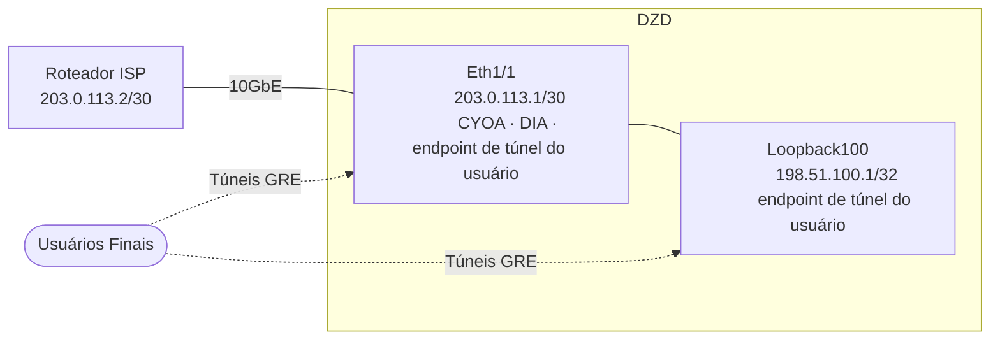

| Interface | `--interface-cyoa` | `--interface-dia` | `--ip-net` | `--bandwidth` | `--cir` | `--routing-mode` | `--user-tunnel-endpoint` |
|-----------|-------------------|------------------|------------|---------------|---------|-----------------|--------------------------|
| Ethernet1/1 | `gre-over-dia` | `dia` | IP/sub-rede atribuído pelo contribuidor | velocidade da porta | taxa comprometida | `bgp` ou `static` | `true` |
| Loopback100 | — | — | seu /32 público | `0bps` | — | — | `true` |

Exemplo de comandos a executar baseado no Cenário A:
```bash
doublezero device interface create mydzd-nyc01 Ethernet1/1 \
  --interface-cyoa gre-over-dia \
  --interface-dia dia \
  --ip-net 203.0.113.1/30 \
  --bandwidth 10Gbps \
  --cir 1Gbps \
  --routing-mode bgp \
  --user-tunnel-endpoint true

doublezero device interface create mydzd-nyc01 Loopback100 \
  --ip-net 198.51.100.1/32 \
  --bandwidth 0bps \
  --user-tunnel-endpoint true
```

#### Cenário B: Port channel (LAG)

O DZD se conecta ao dispositivo upstream via port channel com um IP. O port channel carrega um IP público e é o endpoint CYOA. Loopback100 carrega o segundo IP público.

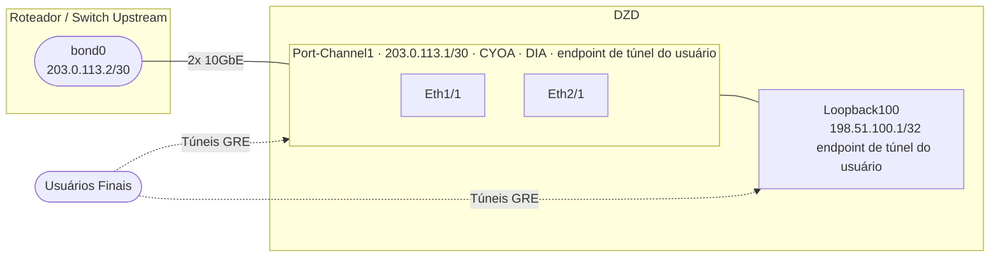

| Interface | `--interface-cyoa` | `--interface-dia` | `--ip-net` | `--bandwidth` | `--cir` | `--routing-mode` | `--user-tunnel-endpoint` |
|-----------|-------------------|------------------|------------|---------------|---------|-----------------|--------------------------|
| Port-Channel1 | `gre-over-dia` | `dia` | IP/sub-rede atribuído pelo contribuidor | velocidade combinada do LAG | taxa comprometida | `bgp` ou `static` | `true` |
| Loopback100 | — | — | seu /32 público | `0bps` | — | — | `true` |

Exemplo de comandos a executar baseado no Cenário B:
```bash
doublezero device interface create mydzd-fra01 Port-Channel1 \
  --interface-cyoa gre-over-dia \
  --interface-dia dia \
  --ip-net 203.0.113.1/30 \
  --bandwidth 20Gbps \
  --cir 2Gbps \
  --routing-mode bgp \
  --user-tunnel-endpoint true

doublezero device interface create mydzd-fra01 Loopback100 \
  --ip-net 198.51.100.1/32 \
  --bandwidth 0bps \
  --user-tunnel-endpoint true
```


#### Cenário C: Uplinks físicos duplos para roteadores separados

Cada interface física se conecta a um roteador upstream diferente. Os dois IPs públicos ficam em Loopback100 e Loopback101, ambos registrados como endpoints de túnel de usuário.

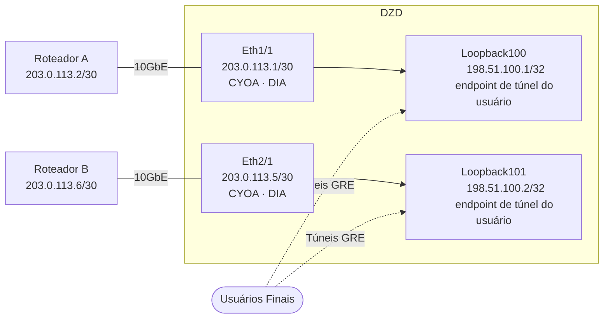

| Interface | `--interface-cyoa` | `--interface-dia` | `--ip-net` | `--bandwidth` | `--cir` | `--routing-mode` | `--user-tunnel-endpoint` |
|-----------|-------------------|------------------|------------|---------------|---------|-----------------|--------------------------|
| Ethernet1/1 | `gre-over-dia` | `dia` | IP/sub-rede atribuído pelo contribuidor | velocidade da porta | taxa comprometida | `bgp` ou `static` | — |
| Ethernet2/1 | `gre-over-dia` | `dia` | IP/sub-rede atribuído pelo contribuidor | velocidade da porta | taxa comprometida | `bgp` ou `static` | — |
| Loopback100 | — | — | seu /32 público | `0bps` | — | — | `true` |
| Loopback101 | — | — | seu /32 público | `0bps` | — | — | `true` |

Exemplo de comandos a executar baseado no Cenário C:
```bash
doublezero device interface create mydzd-ams01 Ethernet1/1 \
  --interface-cyoa gre-over-dia \
  --interface-dia dia \
  --ip-net 203.0.113.1/30 \
  --bandwidth 10Gbps \
  --cir 1Gbps \
  --routing-mode bgp

doublezero device interface create mydzd-ams01 Ethernet2/1 \
  --interface-cyoa gre-over-dia \
  --interface-dia dia \
  --ip-net 203.0.113.5/30 \
  --bandwidth 10Gbps \
  --cir 1Gbps \
  --routing-mode bgp

doublezero device interface create mydzd-ams01 Loopback100 \
  --ip-net 198.51.100.1/32 \
  --bandwidth 0bps \
  --user-tunnel-endpoint true

doublezero device interface create mydzd-ams01 Loopback101 \
  --ip-net 198.51.100.2/32 \
  --bandwidth 0bps \
  --user-tunnel-endpoint true
```

### Passo 3.6: Verifique Seu Dispositivo

```bash
doublezero device list
```

**Saída de exemplo:**

```
 account                                      | code      | contributor | location | exchange | device_type | public_ip    | dz_prefixes     | users | max_users | status    | health  | mgmt_vrf | owner
 7xKm9pQw2R4vHt3...                          | nyc-dz001 | acme        | EQX-NY5  | nyc      | hybrid      | 203.0.113.10 | 198.51.100.0/28 | 0     | 14        | activated | pending |          | 5FMtd5Woq5XAAg54...
```

Seu dispositivo deve aparecer com status `activated`.

---

## Fase 4: Estabelecimento de Links e Instalação de Agentes {#phase-4-link-establishment-agent-installation}

Links conectam seu dispositivo ao resto da rede DoubleZero.

### Entendendo Links

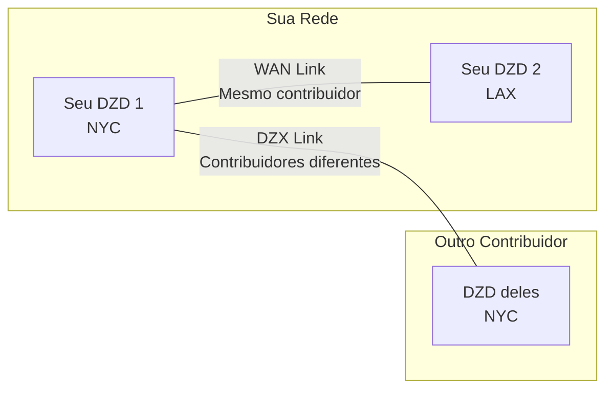

| Tipo de Link | Conecta | Aceitação |
|--------------|---------|-----------|
| **WAN Link** | Dois dos SEUS dispositivos | Automática (você é dono de ambos) |
| **DZX Link** | Seu dispositivo ao de OUTRO contribuidor | Requer aceitação deles |

### Passo 4.1: Crie Links WAN (se você tiver múltiplos dispositivos)

Links WAN conectam seus próprios dispositivos:

```bash
doublezero link create wan \
  --code <CODIGO_DO_LINK> \
  --contributor <SEU_CONTRIBUIDOR> \
  --side-a <CODIGO_DISPOSITIVO_1> \
  --side-a-interface <INTERFACE_NO_DISPOSITIVO_1> \
  --side-z <CODIGO_DISPOSITIVO_2> \
  --side-z-interface <INTERFACE_NO_DISPOSITIVO_2> \
  --bandwidth 10000 \
  --mtu 9000 \
  --delay-ms 20 \
  --jitter-ms 1
```

**Exemplo:**

```bash
doublezero link create wan \
  --code nyc-lax-wan01 \
  --contributor acme \
  --side-a nyc-dz001 \
  --side-a-interface Ethernet3/1 \
  --side-z lax-dz001 \
  --side-z-interface Ethernet3/1 \
  --bandwidth 10000 \
  --mtu 9000 \
  --delay-ms 65 \
  --jitter-ms 1
```

**Saída esperada:**

```
Signature: 5tNm7K...truncated...9pRw2
```

### Passo 4.2: Crie Links DZX

Links DZX conectam seu dispositivo diretamente ao DZD de outro contribuidor:

```bash
doublezero link create dzx \
  --code <CODIGO_DISPOSITIVO_A:CODIGO_DISPOSITIVO_Z> \
  --contributor <SEU_CONTRIBUIDOR> \
  --side-a <CODIGO_DO_SEU_DISPOSITIVO> \
  --side-a-interface <SUA_INTERFACE> \
  --side-z <CODIGO_DISPOSITIVO_OUTRO> \
  --bandwidth <LARGURA_DE_BANDA em Kbps, Mbps ou Gbps> \
  --mtu <MTU> \
  --delay-ms <ATRASO> \
  --jitter-ms <JITTER>
```

**Saída esperada:**

```
Signature: 8mKp3W...truncated...2nRx7
```

Após criar um link DZX, o outro contribuidor deve aceitá-lo:

```bash
# O OUTRO contribuidor executa isso
doublezero link accept \
  --code <CODIGO_DO_LINK> \
  --side-z-interface <INTERFACE_DELES>
```

**Saída esperada (para o contribuidor que aceita):**

```
Signature: 6vQt9L...truncated...3wPm4
```

### Passo 4.3: Verifique os Links

```bash
doublezero link list
```

**Saída de exemplo:**

```
 account                                      | code          | contributor | side_a_name | side_a_iface_name | side_z_name | side_z_iface_name | link_type | bandwidth | mtu  | delay_ms | jitter_ms | delay_override_ms | tunnel_id | tunnel_net      | status    | health  | owner
 8vkYpXaBW8RuknJq...                         | nyc-dz001:lax-dz001 | acme        | nyc-dz001   | Ethernet3/1       | lax-dz001   | Ethernet3/1       | WAN       | 10Gbps    | 9000 | 65.00ms  | 1.00ms    | 0.00ms            | 42        | 172.16.0.84/31  | activated | pending | 5FMtd5Woq5XAAg54...
```

Os links devem mostrar status `activated` quando ambos os lados estiverem configurados.

---

### Instalação dos Agentes

Dois agentes de software são executados no seu DZD:

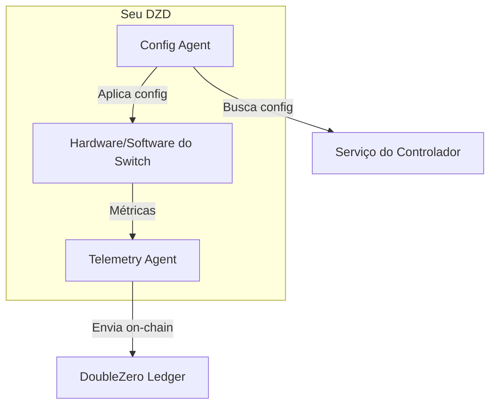

| Agente | O Que Faz |
|--------|-----------|
| **Config Agent** | Busca configuração do controlador e a aplica no seu switch |
| **Telemetry Agent** | Mede latência/perda para outros dispositivos e reporta métricas on-chain |

### Passo 4.4: Instale o Config Agent {#step-44-install-config-agent}

#### Habilite a API no seu switch

Adicione à configuração EOS:

```
management api eos-sdk-rpc
    transport grpc eapilocal
        localhost loopback vrf default
        service all
        no disabled
```

!!! note "Nota sobre VRF"
    Substitua `default` pelo nome da sua VRF de gerenciamento se for diferente (ex.: `management`).

#### Baixe e instale o agente

```bash
# Entre no bash do switch
switch# bash
$ sudo bash
# cd /mnt/flash
# wget AGENT_DOWNLOAD_URL
# exit
$ exit

# Instale como extensão EOS
switch# copy flash:AGENT_FILENAME extension:
switch# extension AGENT_FILENAME
switch# copy installed-extensions boot-extensions
```

#### Verifique a extensão

```bash
switch# show extensions
```

O Status deve ser "A, I, B":

```
Name                                        Version/Release     Status     Extension
------------------------------------------- ------------------- ---------- ---------
AGENT_FILENAME    MAINNET_CLIENT_VERSION/1             A, I, B    1

A: available | NA: not available | I: installed | F: forced | B: install at boot
```

#### Configure e inicie o agente

Adicione à configuração EOS:

```
daemon doublezero-agent
    exec /usr/local/bin/doublezero-agent -pubkey <PUBKEY_DO_SEU_DISPOSITIVO> -controller <IP_do_controlador>:<porta_do_controlador>
    no shut
```

!!! info "IP e porta do controlador"
    O IP e a porta do controlador podem ser encontrados no repositório de contribuidores ao qual você recebeu acesso no Passo 2.5.

!!! note "Nota sobre VRF"
    Se sua VRF de gerenciamento não for `default` (ou seja, o namespace não é `ns-default`), prefixe o comando exec com `exec /sbin/ip netns exec ns-<VRF>`. Por exemplo, se sua VRF for `management`:
    ```
    daemon doublezero-agent
        exec /sbin/ip netns exec ns-management /usr/local/bin/doublezero-agent -pubkey <PUBKEY_DO_SEU_DISPOSITIVO>
        no shut
    ```

Obtenha a pubkey do seu dispositivo de `doublezero device list` (coluna `account`).

#### Verifique se está em execução

```bash
switch# show agent doublezero-agent logs
```

Você deve ver "Starting doublezero-agent" e conexões bem-sucedidas com o controlador.

### Passo 4.5: Instale o Telemetry Agent {#step-45-install-telemetry-agent}

#### Copie a chave de metrics publisher para seu dispositivo

```bash
scp ~/.config/doublezero/metrics-publisher.json <IP_DO_SWITCH>:/mnt/flash/metrics-publisher-keypair.json
```

#### Registre o metrics publisher on-chain

```bash
doublezero device update \
  --pubkey <CONTA_DO_DISPOSITIVO> \
  --metrics-publisher <PUBKEY_DO_METRICS_PUBLISHER>
```

Obtenha a pubkey do seu arquivo metrics-publisher.json.

#### Baixe e instale o agente

```bash
switch# bash
$ sudo bash
# cd /mnt/flash
# wget TELEMETRY_DOWNLOAD_URL
# exit
$ exit

# Instale como extensão EOS
switch# copy flash:TELEMETRY_FILENAME extension:
switch# extension TELEMETRY_FILENAME
switch# copy installed-extensions boot-extensions
```

#### Verifique a extensão

```bash
switch# show extensions
```

O Status deve ser "A, I, B":

```
Name                                        Version/Release     Status     Extension
------------------------------------------- ------------------- ---------- ---------
TELEMETRY_FILENAME    MAINNET_CLIENT_VERSION/1             A, I, B    1

A: available | NA: not available | I: installed | F: forced | B: install at boot
```

#### Configure e inicie o agente

Adicione à configuração EOS:

```
daemon doublezero-telemetry
    exec /usr/local/bin/doublezero-telemetry --local-device-pubkey <CONTA_DO_DISPOSITIVO> --env mainnet --keypair /mnt/flash/metrics-publisher-keypair.json
    no shut
```

!!! note "Nota sobre VRF"
    Se sua VRF de gerenciamento não for `default` (ou seja, o namespace não é `ns-default`), adicione `--management-namespace ns-<VRF>` ao comando exec. Por exemplo, se sua VRF for `management`:
    ```
    daemon doublezero-telemetry
        exec /usr/local/bin/doublezero-telemetry --management-namespace ns-management --local-device-pubkey <CONTA_DO_DISPOSITIVO> --env mainnet --keypair /mnt/flash/metrics-publisher-keypair.json
        no shut
    ```

#### Verifique se está em execução

```bash
switch# show agent doublezero-telemetry logs
```

Você deve ver "Starting telemetry collector" e "Starting submission loop".

---

## Fase 5: Burn-in do Link

!!! warning "Todos os novos links devem passar por burn-in antes de transportar tráfego"
    Novos links devem permanecer **drenados por pelo menos 24 horas** antes de serem ativados para tráfego de produção. Este requisito de burn-in é definido no [RFC12: Network Provisioning](https://github.com/malbeclabs/doublezero/blob/main/rfcs/rfc12-network-provisioning.md), que especifica ~200.000 slots do DZ Ledger (~20 horas) de métricas limpas antes que um link esteja pronto para serviço.

Com os agentes instalados e em execução, monitore seus links em [metrics.doublezero.xyz](https://metrics.doublezero.xyz) por pelo menos 24 horas consecutivas:

- Dashboard **"DoubleZero Device-Link Latencies"** — verifique **zero perda de pacotes** no link ao longo do tempo
- Dashboard **"DoubleZero Network Metrics"** — verifique **zero erros** nos seus links

Só retire o dreno do link quando o período de burn-in mostrar um link limpo com zero perda e zero erros.

---

## Fase 6: Verificação e Ativação

Passe por este checklist para confirmar que tudo está funcionando.

!!! warning "Seu dispositivo começa bloqueado (`max_users = 0`)"
    Quando um dispositivo é criado, `max_users` é definido como **0** por padrão. Isso significa que nenhum usuário pode se conectar a ele ainda. Isso é intencional — você deve verificar que tudo funciona antes de aceitar tráfego de usuários.

    **Antes de definir `max_users` acima de 0, você deve:**

    1. Confirmar que todos os links completaram seu **burn-in de 24 horas** com zero perda/erros em [metrics.doublezero.xyz](https://metrics.doublezero.xyz)
    2. **Coordenar com DZ/Malbec Labs** para executar um teste de conectividade:
        - Um usuário de teste pode se conectar ao seu dispositivo?
        - O usuário recebe rotas pela rede DZ?
        - O usuário consegue rotear tráfego pela rede DZ de ponta a ponta?
    3. Somente após DZ/ML confirmar que os testes passaram, defina max_users para 96:

    ```bash
    doublezero device update --pubkey <CONTA_DO_DISPOSITIVO> --max-users 96
    ```

### Verificações do Dispositivo

```bash
# Seu dispositivo deve aparecer com status "activated"
doublezero device list | grep <CODIGO_DO_SEU_DISPOSITIVO>
```

**Saída esperada:**

```
 7xKm9pQw2R4vHt3... | nyc-dz001 | acme | EQX-NY5 | nyc | hybrid | 203.0.113.10 | 198.51.100.0/28 | 0 | 14 | activated | pending | | 5FMtd5Woq5XAAg54...
```

```bash
# Suas interfaces devem estar listadas
doublezero device interface list | grep <CODIGO_DO_SEU_DISPOSITIVO>
```

**Saída esperada:**

```
 nyc-dz001 | Loopback255 | loopback | vpnv4 | none | none | 0 | 0 | 1500 | static | 0 | 172.16.1.91/32  | 56 | false | activated
 nyc-dz001 | Loopback256 | loopback | ipv4  | none | none | 0 | 0 | 1500 | static | 0 | 172.16.1.100/32 | 0  | false | activated
 nyc-dz001 | Ethernet1/1 | physical | none  | none | none | 0 | 0 | 1500 | static | 0 |                 | 0  | false | activated
```

### Verificações dos Links

```bash
# Links devem mostrar status "activated"
doublezero link list | grep <CODIGO_DO_SEU_DISPOSITIVO>
```

**Saída esperada:**

```
 8vkYpXaBW8RuknJq... | nyc-lax-wan01 | acme | nyc-dz001 | Ethernet3/1 | lax-dz001 | Ethernet3/1 | WAN | 10Gbps | 9000 | 65.00ms | 1.00ms | 0.00ms | 42 | 172.16.0.84/31 | activated | pending | 5FMtd5Woq5XAAg54...
```

### Verificações dos Agentes

No switch:

```bash
# Config agent deve mostrar buscas de config bem-sucedidas
switch# show agent doublezero-agent logs | tail -20

# Telemetry agent deve mostrar envios bem-sucedidos
switch# show agent doublezero-telemetry logs | tail -20
```

### Diagrama de Verificação Final

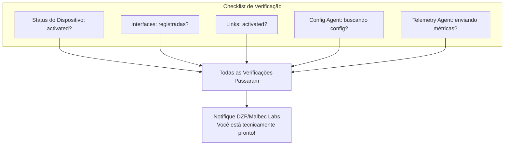

---

## Solução de Problemas

### Falha na criação do dispositivo

- Verifique se sua chave de serviço está autorizada (`doublezero contributor list`)
- Confira se os códigos de localização e exchange são válidos
- Certifique-se de que o prefixo DZ é uma faixa de IP público válida

### Link travado no status "requested"

- Links DZX requerem aceitação pelo outro contribuidor
- Entre em contato com eles para executar `doublezero link accept`

### Config Agent não conectando

- Verifique se a rede de gerenciamento tem acesso à internet
- Confira se a configuração de VRF corresponde à sua configuração
- Certifique-se de que a pubkey do dispositivo está correta

### Telemetry Agent não enviando

- Verifique se a chave de metrics publisher está registrada on-chain
- Confira se o arquivo de keypair existe no switch
- Certifique-se de que a pubkey da conta do dispositivo está correta

---

## Próximos Passos

- Consulte o [Guia de Operações](operations.md) para atualizações de agentes e gerenciamento de links
- Confira o [Glossário](../reference/glossary.md) para definições de termos
- Entre em contato com DZF/Malbec Labs se encontrar problemas