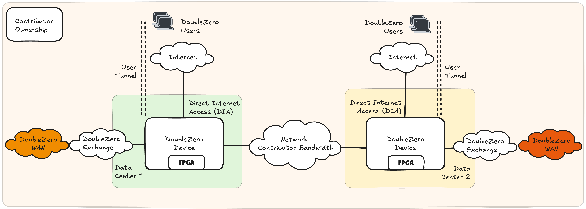
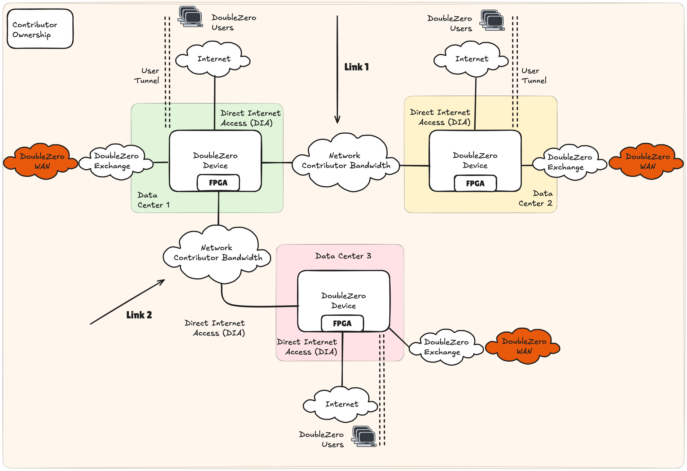
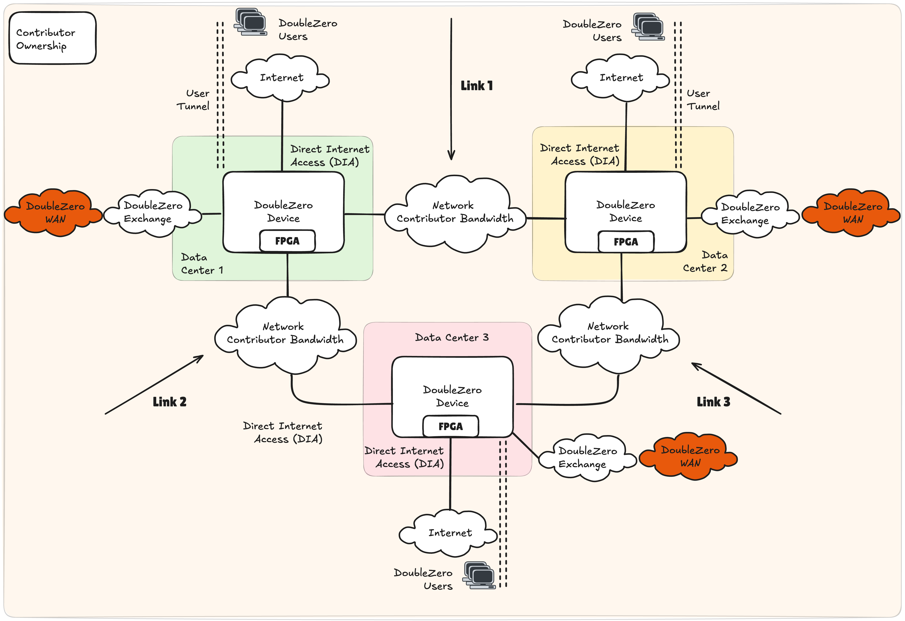
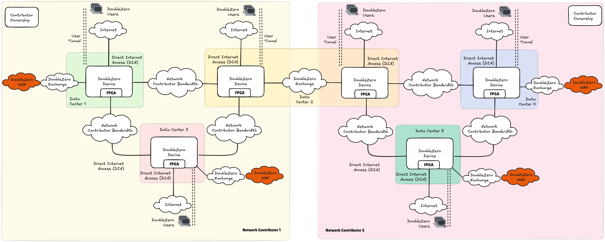
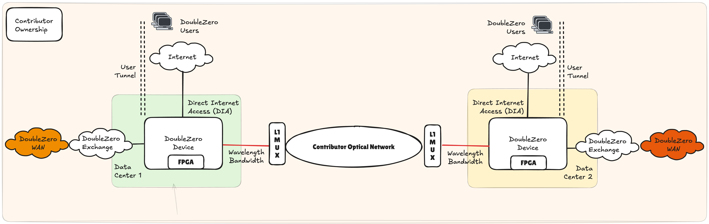
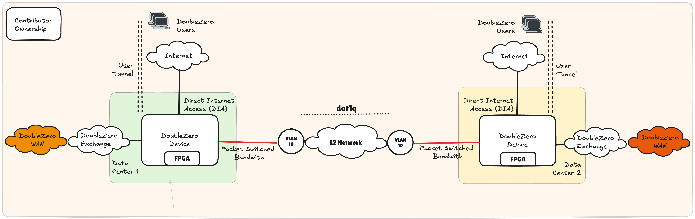
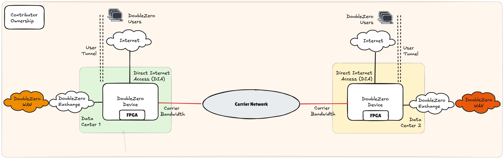

# Requisitos e Arquitetura para Contribuidores

## Resumo

Qualquer pessoa que deseje monetizar seus cabos de fibra óptica e hardware de rede subutilizados pode contribuir para a rede DoubleZero. Os contribuidores de rede devem fornecer largura de banda dedicada entre dois pontos, operar dispositivos compatíveis com DoubleZero (DZDs) em cada extremidade e uma conexão à internet pública em cada extremidade. Os contribuidores de rede também devem executar o software DoubleZero em cada DZD para fornecer serviços como multicast, pesquisa de usuários e filtragem de borda.

O contrato inteligente DoubleZero é a pedra angular para garantir que a rede mantenha links de alta qualidade que possam ser medidos e integrados à topologia, permitindo que nossos controladores de rede desenvolvam o caminho mais eficiente de ponta a ponta entre nossos diferentes usuários e endpoints. Após a execução do contrato inteligente e a implantação dos equipamentos de rede e largura de banda, uma entidade é classificada como contribuidor de rede. Consulte [DoubleZero Economics](https://economics.doublezero.xyz/overview) para entender melhor a economia por trás da participação no DoubleZero como contribuidor de rede.

---

## Requisitos para Ser um Contribuidor de Rede DoubleZero

- Largura de banda dedicada que possa fornecer conectividade IPv4 e um MTU de 2048 bytes entre dois data centers
- Hardware de Dispositivo DoubleZero (DZD) compatível com o protocolo DoubleZero
- Conectividade com a internet e outros contribuidores de rede DoubleZero
- Instalação do software DoubleZero no DZD

## Guia de Início Rápido

Como contribuidor de rede, a forma mais simples de começar no DoubleZero é identificando capacidade em sua rede que possa ser dedicada ao DoubleZero. Uma vez identificada, os DZDs devem ser implantados, facilitando a rede overlay DoubleZero que requer apenas alcançabilidade IPv4 e um MTU mínimo de 2048 bytes como dependências da rede do contribuidor.

A Figura 1 destaca o modelo mais simples para contribuição de largura de banda e serviços de envio e processamento de pacotes. Um DZD é implantado em cada data center, fazendo interface com a rede interna do contribuidor de rede para fornecer conectividade WAN DoubleZero. Isso é complementado por internet local, tipicamente uma solução de Acesso Direto à Internet (DIA), que é usada como pontos de entrada para usuários DoubleZero. Embora se espere que o DIA seja a opção preferida para facilitar o acesso aos usuários do DoubleZero, vários modelos de conectividade são possíveis, por exemplo, cabeamento físico para servidores, extensão de fabric de rede, etc. Referimo-nos a essas opções como Escolha Sua Própria Aventura (CYOA), proporcionando ao contribuidor flexibilidade para conectar usuários locais ou remotos da forma que melhor se adapte às suas políticas de rede interna.

Como em qualquer rede, a alcançabilidade é uma parte fundamental da arquitetura, pois os contribuidores de rede não podem existir isoladamente. Portanto, o DZD *deve* ter um link para um DoubleZero Exchange (DZX) para criar uma rede contígua entre os participantes.

<figure markdown="span">
  { width="800" }
  <figcaption>Figura 1: Contribuição de Largura de Banda de Rede DoubleZero Entre 2 Data Centers - Contribuidor Único</figcaption>
</figure>

### Exemplos de Contribuições

As formas pelas quais um contribuidor de rede pode expandir suas contribuições ao DoubleZero são muitas, incluindo:

- Melhorar as características de desempenho de suas contribuições existentes: aumentar largura de banda, reduzir latência
- Adicionar múltiplos links entre os mesmos data centers
- Adicionar um novo link de um data center existente para um novo data center
- Adicionar um novo link independente entre dois novos data centers

#### Exemplo 1: Contribuidor Único, 3 Data Centers, Dois Links
<figure markdown="span">
  { width="800" }
  <figcaption>Figura 2: Contribuição de Largura de Banda de Rede DoubleZero Entre 3 Data Centers - Contribuidor Único</figcaption>
</figure>

Um único DZD pode suportar múltiplos links contribuídos ao DoubleZero. A Figura 2 ilustra uma topologia potencial se um único data center, designado como 1, termina largura de banda para dois data centers remotos diferentes, 2 e 3. Neste cenário, cada data center contém apenas 1 DZD. Todos os DZDs estão usando DIA para pontos de entrada de usuários como sua interface CYOA.

#### Exemplo 2: Contribuidor Único, 3 Data Centers, Três Links

A Figura 3 descreve a topologia DoubleZero quando um único contribuidor implanta três links em uma topologia triangular entre 3 data centers. Em um cenário semelhante ao exemplo 1, um único DZD é implantado nos data centers 1, 2 e 3, cada um suportando 2 links de rede independentes. A topologia resultante é um triângulo ou anel entre data centers.

<figure markdown="span">
  { width="800" }
  <figcaption>Figura 3: Contribuição de Largura de Banda de Rede DoubleZero Entre 3 Data Centers - Contribuidor Único</figcaption>
</figure>

### DoubleZero Exchange

A criação de uma rede contígua é um bloco de construção fundamental da arquitetura DoubleZero. Os contribuidores fazem interface por meio de um DoubleZero Exchange (DZX) dentro de uma área metropolitana, que é uma cidade como Nova York (NYC), Londres (LON) ou Tóquio (TYO). Um DZX é um fabric de rede semelhante a um Internet Exchange, permitindo peering e troca de rotas.

Na figura 4, o contribuidor de rede 1 opera nos data centers 1, 2 e 3, enquanto o contribuidor de rede 2 opera nos data centers 2, 4 e 5. Ao interconectar no data center 2, o alcance da rede DoubleZero aumenta para 5 data centers contíguos.

<figure markdown="span">
  { width="1000" }
  <figcaption>Figura 4: Contribuição de Largura de Banda de Rede DoubleZero Entre 2 Contribuidores de Largura de Banda de Rede</figcaption>
</figure>

### Opções de Contribuição de Largura de Banda

O DoubleZero exige que um contribuidor de rede ofereça conectividade integrada por meio de um perfil garantido de largura de banda, latência e jitter entre DZDs em dois data centers terminais, expresso por meio de um contrato inteligente. O DoubleZero não determina como um contribuidor de rede implementa sua contribuição; no entanto, nas seções seguintes, fornecemos opções indicativas para uso a seu exclusivo critério.

Áreas importantes a considerar para um contribuidor de rede podem ser:

- Capacidade de garantir o desempenho de rede do serviço DoubleZero: largura de banda, latência e jitter
- Segregação dos seus serviços de rede interna existentes
- Conflitos de endereçamento IPv4, especificamente com o espaço de endereços do underlay do túnel
- Tempo de atividade e disponibilidade
- Considerações de CAPEX e OPEX

#### Largura de Banda de Camada 1
<figure markdown="span">
  { width="800" }
  <figcaption>Figura 5: Serviços Ópticos de Camada 1</figcaption>
</figure>

A largura de banda de Camada 1, mais formalmente descrita como serviços de comprimento de onda, pode ter capacidade dedicada provisionada em uma infraestrutura óptica existente, como DWDM, CWDM ou via multiplexadores ópticos (MUX). Na figura 5, os DZDs usam uma óptica colorida que é cabeada a um MUX L1, que intercala o comprimento de onda do DZD em uma fibra escura existente.

Esta solução tem inúmeros benefícios para contribuidores de rede que já operam uma rede core existente. As mudanças operacionais iterativas, bem como os requisitos adicionais de CAPEX e OPEX, são modestos. Esta opção é particularmente robusta em oferecer segregação dos serviços de rede do contribuidor de rede.

#### Largura de Banda Comutada por Pacotes

Redes comutadas por pacotes podem ser consideradas uma rede corporativa típica, executando protocolos padrão de roteamento e comutação que suportam aplicações de negócios. Existem inúmeras tecnologias de rede que alcançam conectividade, por exemplo, extensões de camada 2 (L2) usando tags VLAN.

##### Extensão L2
<figure markdown="span">
  { width="800" }
  <figcaption>Figura 6: Redes Comutadas por Pacotes - Extensão L2</figcaption>
</figure>

Uma extensão L2, conforme mostrado na Figura 6, pode ser facilitada por meio de marcação VLAN. A porta de um DZD pode ser cabeada ao switch de rede interna de um contribuidor, com a porta do switch sendo configurada como porta de acesso em, por exemplo, VLAN 10. Por meio de marcação 802.1q, esta VLAN pode ser transportada por múltiplos saltos de switch na rede do contribuidor, terminando no switch que faz interface com o DZD remoto.

Esta solução beneficia-se de ser amplamente suportada e relativamente fácil de implementar, ao mesmo tempo que cria segmentação entre o DoubleZero e os serviços internos de camada 3. A largura de banda pode ser controlada com base na velocidade da interface do switch ou roteador interno do contribuidor. Deve-se ter cuidado especial com o desempenho na rede L2 interna compartilhada por meio de tecnologias como Qualidade de Serviço (QoS) ou outras políticas de gerenciamento de tráfego. No entanto, os investimentos adicionais em CAPEX e OPEX devem ser modestos se houver capacidade existente disponível dentro da rede core do contribuidor.

#### Largura de Banda Dedicada de Terceiros
<figure markdown="span">
  { width="800" }
  <figcaption>Figura 7: Largura de Banda Dedicada de Terceiros</figcaption>
</figure>

Embora reutilizar capacidade disponível seja atrativo para muitos contribuidores de rede, também é possível dedicar largura de banda recém-adquirida ao DoubleZero. Em tal cenário, o DZD se conectaria diretamente à operadora terceirizada sem nenhum dispositivo interno do contribuidor posicionado no caminho (figura 7).

Esta opção é atrativa pois garante largura de banda dedicada para o DoubleZero, é operacionalmente simples e assegura segmentação completa de quaisquer outros serviços de rede. Esta opção provavelmente terá o maior aumento de OPEX e requer novos contratos de serviço com operadoras terceirizadas.

---

## Requisitos de Hardware {#hardware-requirements}

### Contribuição de Largura de Banda de 100Gbps

Observe que as quantidades abaixo refletem os equipamentos necessários em dois data centers, ou seja, o total de hardware necessário para implantar 1 cabo de fibra óptica para contribuição de largura de banda.

??? warning "*Todos os FPGAs estão sujeitos a testes finais. Contribuições de 10G podem ser suportadas usando switches Arista 7130LBR com FPGAs Virtex® UltraScale+™ duplos integrados (se você tiver alguma dúvida, a DoubleZero Foundation / Malbec Labs terá prazer em fornecer mais informações)."

#### Requisitos de Função e Portas

| Função                      | Velocidade da Porta | Requisito DZ | QTD | Nota |
|-----------------------------|------------|----------------|-----|-------------------------------------------------------------------------------------------------------------------------------------------------------------------|
| Largura de Banda Privada    | 100G       | Sim            | 1   |                                                                                                                                                                   |
| Acesso Direto à Internet (DIA) | 10G       | Sim            | 2   |                                                                                                                                                                   |
| DoubleZero eXchange (DZX)   | 100G       | Sim*           | 1   | Deve ser suportado quando mais de 3 provedores operam na mesma área metropolitana; antes disso, cross-connects ou outros arranjos de peering podem ser usados para interconectar com outros provedores. |
| Gerenciamento               |            | Não            | 1   | Determinado pelas políticas internas de gerenciamento do contribuidor.                                                                                           |
| Console                     |            | Não            | 1   | Determinado pelas políticas internas de gerenciamento do contribuidor.                                                                                           |

#### Hardware de Rede DZD {#dzd-network-hardware}

| Fabricante | Modelo          | Número de Peça        | Requisito DZ | QTD | Nota |
|----------|-----------------|----------------------|----------------|-----|-----------------------------------------------------------|
| AMD*      | V80*           | 24540474    | Sim            | 4   |                                                           |
| Arista   | 7280CR3A        | DCS-7280CR3A-32S    | Sim            | 2   | Alternativas podem ser possíveis se os prazos de entrega forem desafiadores. |

---

#### Ópticas - 100G

| Fabricante | Modelo        | Número de Peça  | Requisito DZ | QTD | Nota |
|--------|-------------|----------------|----------------|-----|-------------------------------------------------------------|
| Arista | 100GBASE-LR | QSFP-100G-LR    | Não            | 16  | Cabeamento e escolha de óptica disponíveis a critério do contribuidor. 100G necessário para conectar FPGAs. |

---

#### Ópticas - 10G

| Fabricante | Modelo        | Número de Peça  | Requisito DZ | QTD | Nota |
|--------|-------------|----------------|----------------|-----|-------------------------------------------------------------|
| Arista | 10GBASE-LR | SFP-10G-LR    | Não            | 2   | Cabeamento e escolha de óptica disponíveis a critério do contribuidor. |
| Finisar | DynamiX QSA™ | MAM1Q00A-QSA   | Não            | 2   | Cabeamento e escolha de óptica disponíveis a critério do contribuidor. |

---

#### Endereçamento IP

| Endereçamento IP | Tamanho Mínimo de Sub-rede | Requisito DZ | Nota |
|--------------|-------------------|----------------|----------------------------------------------------------|
| IPv4 Público | /29               | Sim (para DZDs de borda/híbridos)           | Deve ser roteável via DIA. Podemos eliminar a necessidade disso ao longo do tempo. |

Certifique-se de que o pool /29 completo esteja disponível para o protocolo DZ. Quaisquer requisitos de endereçamento ponto a ponto, por exemplo, em interfaces DIA, devem ser gerenciados por meio de um pool de endereços diferente.

### Contribuição de Largura de Banda de 10Gbps

Observe que as quantidades refletem os equipamentos de dois data centers, ou seja, o total de hardware necessário para implantar 1 contribuição de largura de banda.

#### Requisitos de Função e Portas

| Função                      | Velocidade da Porta | Requisito DZ | QTD | Nota |
|-----------------------------|------------|----------------|-----|-------------------------------------------------------------------------------------------------------------------------------------------------------------------|
| Largura de Banda Privada    | 10G        | Sim            | 1   |                                                                                                                                                                   |
| Acesso Direto à Internet (DIA) | 10G        | Sim            | 2   |                                                                                                                                                                   |
| DoubleZero eXchange (DZX)   | 100G       | Sim*           | 1   | Deve ser suportado quando mais de 3 provedores operam na mesma área metropolitana; antes disso, cross-connects ou outros arranjos de peering podem ser usados para interconectar com outros provedores. |
| Gerenciamento               |            | Não            | 1   | Determinado pelas políticas internas de gerenciamento do contribuidor.                                                                                           |
| Console                     |            | Não            | 1   | Determinado pelas políticas internas de gerenciamento do contribuidor.                                                                                           |

---

#### Hardware

| Fabricante | Modelo          | Número de Peça        | Requisito DZ | QTD | Nota |
|----------|-----------------|----------------------|----------------|-----|-----------------------------------------------------------|
| AMD*      | V80*           | 24540474*    | Sim            | 4   |                                                           |              |
| Arista   | 7280CR3A        | DCS-7280CR3A-32S    | Sim            | 2   | Alternativas podem ser possíveis se os prazos de entrega forem desafiadores. |

---

#### Ópticas - 100G

| Fabricante | Modelo        | Número de Peça  | Requisito DZ | QTD | Nota |
|--------|-------------|----------------|----------------|-----|-------------------------------------------------------------|
| Arista | 100GBASE-LR | QSFP-100G-LR    | Não            | 14  | Cabeamento e escolha de óptica disponíveis a critério do contribuidor. 100G necessário para conectar FPGAs. |

---

#### Ópticas - 10G

| Fabricante | Modelo        | Número de Peça  | Requisito DZ | QTD | Nota |
|--------|-------------|----------------|----------------|-----|-------------------------------------------------------------|
| Arista | 10GBASE-LR | SFP-10G-LR    | Não            | 4   | Cabeamento e escolha de óptica disponíveis a critério do contribuidor. |
 Finisar | DynamiX QSA™ | MAM1Q00A-QSA   | Não            | 4   | Cabeamento e escolha de óptica disponíveis a critério do contribuidor. |
---

#### Endereçamento IP

| Endereçamento IP | Tamanho Mínimo de Sub-rede | Requisito DZ | Nota |
|--------------|-------------------|----------------|----------------------------------------------------------|
| IPv4 Público | /29               | Sim (para DZDs de borda/híbridos)            | Deve ser roteável via DIA. Podemos eliminar a necessidade disso ao longo do tempo. |

Certifique-se de que o pool /29 completo esteja disponível para o protocolo DZ. Quaisquer requisitos de endereçamento ponto a ponto, por exemplo, em interfaces DIA, devem ser gerenciados por meio de um pool de endereços diferente.

### Requisitos do Data Center

#### Requisitos de Rack e Energia

| Requisito    | Especificação |
|-------------|--------------|
| Espaço em Rack | 4U           |
| Energia      | 4KW (recomendado) |

---

## Próximos Passos

Pronto para provisionar seu primeiro DZD? Continue para o [Guia de Provisionamento de Dispositivos](provisioning.md).