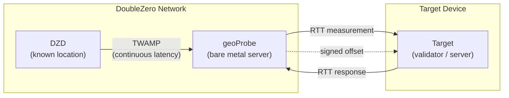
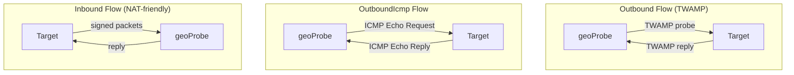

# Geolocalización

El servicio de Geolocalización de DoubleZero ayuda a los usuarios a determinar la ubicación física de dispositivos mediante mediciones de latencia. Las mediciones de [RTT](glossary.md#rtt-round-trip-time) (tiempo de ida y vuelta) entre infraestructura con ubicación conocida y un dispositivo objetivo proporcionan prueba firmada criptográficamente de que un dispositivo se encuentra dentro de una cierta distancia de un punto dado. El registro en cadena de las mediciones en el DoubleZero Ledger está planificado para una versión futura.

Los casos de uso incluyen cumplimiento normativo (por ejemplo, GDPR — demostrar que los validadores operan dentro de la UE), auditorías de distribución geográfica y cualquier aplicación que necesite prueba verificable de dónde se encuentra un dispositivo o IP.

---

## Cómo funciona {#how-it-works}



El siguiente diagrama muestra los tres tipos de flujo de sondeo — Outbound, OutboundIcmp e Inbound — que difieren en cómo el geoProbe se comunica con el objetivo:



La geolocalización utiliza una cadena de medición de tres niveles:

```
DZD (known location) ◄──TWAMP──► geoProbe ◄──RTT──► Target device
```

- **[DZD](glossary.md#dzd-doublezero-device) <-> geoProbe**: [TWAMP](glossary.md#twamp-two-way-active-measurement-protocol) mide continuamente la latencia entre el DoubleZero Device y el sondeo. Los DZDs tienen coordenadas geográficas conocidas y fijas registradas en el DZ Ledger.
- **geoProbe <-> Objetivo**: Se mide el RTT entre el sondeo y el dispositivo que se está localizando.

Los resultados de offset se firman criptográficamente y se entregan mediante UDP al objetivo o a un destino alternativo especificado por el usuario.

**Importante:** La geolocalización reporta únicamente RTT — no distancia inferida ni coordenadas. Una forma común de usar esto sería dividir el RTT entre 2 y luego multiplicar por la velocidad de la luz a través del vidrio (~200km/ms) para proporcionar un radio alrededor de las coordenadas del DZD dentro del cual se encuentra el objetivo. La forma en que usted interprete el RTT (por ejemplo, calculando un radio de distancia máxima) depende de usted.

### Tipos de flujo de sondeo {#probe-flow-types}

Hay tres formas en que un sondeo puede medir un objetivo:

| Flujo | Quién inicia | Protocolo | Usar cuando |
|-------|-------------|-----------|-------------|
| **Outbound** | Sondeo -> Objetivo | [TWAMP](glossary.md#twamp-two-way-active-measurement-protocol) | El objetivo tiene una IP pública, un puerto de entrada abierto y puede ejecutar un reflector TWAMP |
| **OutboundIcmp** | Sondeo -> Objetivo | ICMP echo | El objetivo tiene una IP pública pero no puede ejecutar un reflector TWAMP (o TWAMP está bloqueado por firewall) |
| **Inbound** | Objetivo -> Sondeo | TWAMP firmado | El objetivo no puede aceptar conexiones entrantes, o desea verificar la ubicación de una clave de firma |

En todos los casos, la medición DZD <-> geoProbe ocurre de la misma manera. Solo difieren la dirección y el protocolo de la comunicación geoProbe <-> objetivo.

!!! info "Especificación técnica"
    Para la especificación técnica completa del sistema de verificación de geolocalización, incluyendo detalles de firma criptográfica y el protocolo de medición, consulte [RFC 16: Geolocation Verification](https://github.com/malbeclabs/doublezero/blob/main/rfcs/rfc16-geolocation-verification.md).

---

## Requisitos previos {#prerequisites}

### 1. DoubleZero ID con créditos {#1-doublezero-id-with-credits}

Los usuarios de geolocalización necesitan un DoubleZero ID con fondos. No necesita conectarse a la red DoubleZero (no se requiere pase de acceso), pero su clave necesita créditos en el DoubleZero Ledger para crear una cuenta de usuario y gestionar objetivos — cada operación de añadir/eliminar objetivo consume créditos.

Si no tiene un DoubleZero ID:

```bash
doublezero keygen
doublezero address   # get your pubkey
```

Contacte al equipo de DoubleZero con su pubkey para obtener fondos en su ID. Fúndelo con una cantidad superior a la típica si espera añadir y eliminar objetivos dinámicamente.

### 2. Cuenta de token 2Z {#2-2z-token-account}

Necesita una cuenta de [token 2Z](glossary.md#2z-token). Las tarifas del servicio se deducen de esta cuenta por época.

---

## Instalación {#installation}

En un equipo de gestión:
```bash
curl -1sLf https://dl.cloudsmith.io/public/malbeclabs/doublezero/setup.deb.sh | sudo -E bash
sudo apt install doublezero
```

En un objetivo para Inbound o TWAMP Outbound:
```bash
curl -1sLf https://dl.cloudsmith.io/public/malbeclabs/doublezero/setup.deb.sh | sudo -E bash
sudo apt install doublezero-geoprobe-target
```
Esto instala `doublezero-geoprobe-target` (outbound) y `doublezero-geoprobe-target-sender` (inbound)

!!! note "ICMP Outbound"
    Los objetivos `outbound-icmp` no requieren software instalado.

---

## Consultar su saldo {#check-your-balance}

```bash
doublezero balance
```

---

## Configuración {#setup}

### Paso 1: Crear un usuario de geolocalización {#step-1-create-a-geolocation-user}

```bash
doublezero geolocation user create \
  --env testnet \
  --code <your-user-code> \
  --token-account <your-2Z-token-account>
```

- `--code`: un identificador corto y único para su cuenta (por ejemplo, `myorg`)
- `--token-account`: la clave pública de su cuenta de [token 2Z](glossary.md#2z-token) — las tarifas del servicio se deducen de aquí

!!! note "Activación de cuenta"
    Después de crear un usuario, contacte a la DoubleZero Foundation para activar su cuenta. El estado de pago debe estar marcado como activo antes de que comience el sondeo.

### Paso 2: Listar sondeos disponibles {#step-2-list-available-probes}

```bash
doublezero geolocation probe list
```

Anote el **code** o **public_ip**, y el **signing_pubkey** (para objetivos inbound) del sondeo que desea usar.

### Paso 3: Añadir un objetivo {#step-3-add-a-target}

=== "Outbound (el sondeo envía TWAMP al objetivo)"

    Use este flujo si su objetivo tiene una IP pública, un puerto de entrada abierto y puede ejecutar un reflector [TWAMP](glossary.md#twamp-two-way-active-measurement-protocol).

    ```bash
    doublezero geolocation user add-target \
      --user <your-user-code> \
      --type outbound \
      --probe <probe-code> \
      --target-ip <target-public-ip>
    ```

    `--probe`: el código del geoProbe que medirá el objetivo (por ejemplo, `ams-mn-gp1`)
    `--ip-address`: la dirección IPv4 pública del dispositivo objetivo

=== "OutboundIcmp (el sondeo hace ping al objetivo)"

    Use este flujo si su objetivo tiene una IP pública pero no puede ejecutar un reflector TWAMP, o si el tráfico TWAMP está bloqueado por firewall. El objetivo solo necesita responder a solicitudes de eco ICMP (ping) — no se requiere software adicional.

    ```bash
    doublezero geolocation user add-target \
      --user <your-user-code> \
      --type OutboundIcmp \
      --probe <probe-code> \
      --ip-address <target-public-ip>
    ```

    `--probe`: el código del geoProbe que medirá el objetivo (por ejemplo, `ams-mn-gp1`)
    `--ip-address`: la dirección IPv4 pública del dispositivo objetivo
    !!! Warning "Destino de resultados"
        Los objetivos Outbound ICMP solo funcionan si su usuario tiene configurado un destino alternativo de resultados. (Consulte el Paso 3b)

=== "Inbound (el objetivo envía al sondeo)"

    Use este flujo si su objetivo está detrás de NAT o no puede aceptar conexiones entrantes.

    ```bash
    doublezero geolocation user add-target \
      --user <your-user-code> \
      --type inbound \
      --probe <probe-code> \
      --target-pk <target-keypair-pubkey>
    ```

    `--probe`: el código del geoProbe que medirá el objetivo (por ejemplo, `ams-mn-gp1`)
    `--target-pk`: clave pública del par de claves que el objetivo usará para firmar mensajes — el sondeo solo acepta mensajes de claves públicas registradas

### Paso 3b: Establecer un destino de resultados (opcional) {#step-3b-set-a-result-destination-optional}

Configure un `host:port` alternativo donde se entregan los resultados compuestos de LocationOffset para cualquier tipo de objetivo Outbound. Esto reemplaza el envío del LocationOffset al objetivo y se configura por usuario. Si se necesita un comportamiento diferente por objetivo, es necesario configurar dos usuarios, uno para cada tipo de comportamiento deseado.

El destino alternativo es útil para agregar resultados de múltiples objetivos en un único endpoint. Es obligatorio para el sondeo ICMP.

```bash
doublezero geolocation user set-result-destination \
  --user <your-user-code> \
  --destination <host:port>
```

`--destination`: una dirección IPv4 enrutable públicamente o un nombre de dominio válido con puerto (por ejemplo, `203.0.113.10:9000` o `results.example.com:9000`). Pase una cadena vacía para limpiar.

Use `user get` para verificar su destino de resultados:

```bash
doublezero geolocation user get --user <your-user-code>
```

### Paso 4: Ejecutar la aplicación del objetivo {#step-4-run-the-target-application}

Tanto los flujos outbound como inbound requieren ejecutar una aplicación en el dispositivo objetivo. Hay implementaciones de referencia con ejemplos disponibles en Go — puede ejecutarlas directamente o usarlas como punto de partida para su propia integración.

=== "Outbound"

    Para el sondeo outbound, el dispositivo objetivo debe ejecutar un reflector [TWAMP](glossary.md#twamp-two-way-active-measurement-protocol) para que el geoProbe pueda medir el RTT. Ejecute la aplicación del objetivo en el dispositivo que se está midiendo:

    ```bash
    doublezero-geoprobe-target
    ```

=== "Inbound"

    Para el sondeo inbound, el dispositivo objetivo debe ejecutar software que envíe mensajes firmados al sondeo.

    En el dispositivo que se está midiendo:

    ```bash
    doublezero-geoprobe-target-sender \
      -probe-ip <probe-ip> \
      -probe-pk <probe-pubkey> \
      -keypair <path-to-keypair.json>
    ```

`-probe-ip`: dirección IP del geoProbe (de `probe list`)
`-probe-pk`: clave pública del geoProbe (de `probe list`)
`-keypair`: ruta al par de claves cuya clave pública fue registrada como `--target-pk` en el Paso 3

El emisor del objetivo utiliza un mecanismo de dos pares de sondeos: envía dos sondeos [TWAMP](glossary.md#twamp-two-way-active-measurement-protocol) prefirmados en rápida sucesión. La respuesta del sondeo al segundo paquete incluye `SinceLastRxNs` — el tiempo entre el envío de la respuesta 0 por parte del sondeo y la recepción del sondeo 1 — que sirve como el [RTT](glossary.md#rtt-round-trip-time) medido por el sondeo. Este enfoque pareado proporciona una medición de RTT precisa incluso cuando el objetivo no puede realizar marcas de tiempo precisas a nivel de kernel.

---

## Referencia de comandos {#command-reference}

### `doublezero geolocation user` {#doublezero-geolocation-user}

| Subcomando | Descripción |
|------------|-------------|
| `create` | Crear una nueva cuenta de usuario de geolocalización |
| `get` | Obtener detalles de un usuario específico |
| `list` | Listar todos los usuarios de geolocalización |
| `delete` | Eliminar un usuario |
| `add-target` | Añadir un objetivo a un usuario |
| `remove-target` | Eliminar un objetivo de un usuario |
| `set-result-destination` | Establecer un host:port alternativo para la entrega de offset |
| `update-payment` | Actualizar estado de pago (uso de la fundación) |

### `doublezero geolocation probe` {#doublezero-geolocation-probe}

| Subcomando | Descripción |
|------------|-------------|
| `create` | Registrar un nuevo geoProbe |
| `get` | Obtener detalles de un sondeo específico |
| `list` | Listar todos los sondeos |
| `update` | Actualizar la configuración del sondeo |
| `delete` | Eliminar un sondeo |
| `add-parent` | Vincular un DZD como padre del sondeo |
| `remove-parent` | Eliminar un DZD padre |

### Flags globales {#global-flags}

| Flag | Descripción |
|------|-------------|
| `--env` | Entorno de red: `testnet`, `devnet` o `mainnet-beta` |
| `--rpc-url` | Endpoint RPC personalizado de DoubleZero |
| `--keypair` | Ruta al par de claves de firma (requerido para operaciones de escritura) |