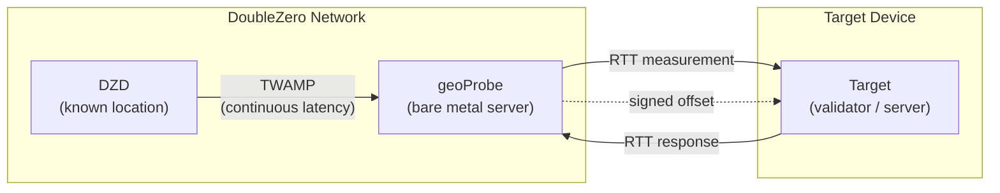
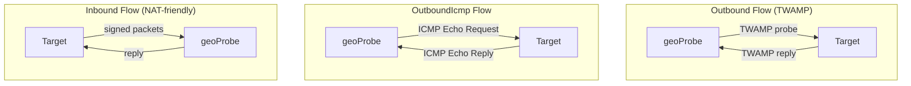

# Géolocalisation

Le service de géolocalisation DoubleZero aide les utilisateurs à déterminer la localisation physique des appareils à l'aide de mesures de latence. Les mesures de [RTT](glossary.md#rtt-round-trip-time) (temps aller-retour) entre une infrastructure à localisation connue et un appareil cible fournissent une preuve signée cryptographiquement qu'un appareil se trouve à une certaine distance d'un point donné. L'enregistrement onchain des mesures sur le DoubleZero Ledger est prévu pour une version future.

Les cas d'utilisation incluent la conformité réglementaire (par ex., RGPD — prouver que les validateurs opèrent au sein de l'UE), les audits de distribution géographique, et toute application nécessitant une preuve vérifiable de l'emplacement d'un appareil ou d'une IP.

---

## Comment ça fonctionne {#how-it-works}



Le diagramme suivant montre les trois types de flux de sonde — Outbound, OutboundIcmp et Inbound — qui diffèrent par la manière dont le geoProbe communique avec la cible :



La géolocalisation utilise une chaîne de mesure à trois niveaux :

```
DZD (known location) ◄──TWAMP──► geoProbe ◄──RTT──► Target device
```

- **[DZD](glossary.md#dzd-doublezero-device) <-> geoProbe** : [TWAMP](glossary.md#twamp-two-way-active-measurement-protocol) mesure en continu la latence entre le DoubleZero Device et la sonde. Les DZD ont des coordonnées géographiques connues et fixes enregistrées sur le DZ Ledger.
- **geoProbe <-> Cible** : Le RTT est mesuré entre la sonde et l'appareil à localiser.

Les résultats d'offset sont signés cryptographiquement et transmis via UDP à la cible ou à une destination alternative spécifiée par l'utilisateur.

**Important :** La géolocalisation rapporte uniquement le RTT — pas une distance inférée ni des coordonnées. Une façon courante d'utiliser cela serait de diviser le RTT par 2, puis de multiplier par la vitesse de la lumière dans le verre (~200 km/ms) pour fournir un rayon autour des coordonnées du DZD dans lequel la cible se trouve. La manière dont vous interprétez le RTT (par ex., calculer un rayon de distance maximale) vous appartient.

### Types de flux de sonde {#probe-flow-types}

Il existe trois façons dont une sonde peut mesurer une cible :

| Flux | Qui initie | Protocole | À utiliser quand |
|------|------------|-----------|------------------|
| **Outbound** | Sonde -> Cible | [TWAMP](glossary.md#twamp-two-way-active-measurement-protocol) | La cible a une IP publique, un port entrant ouvert et peut exécuter un réflecteur TWAMP |
| **OutboundIcmp** | Sonde -> Cible | Écho ICMP | La cible a une IP publique mais ne peut pas exécuter un réflecteur TWAMP (ou TWAMP est bloqué par un pare-feu) |
| **Inbound** | Cible -> Sonde | TWAMP signé | La cible ne peut pas accepter de connexions entrantes, ou vous souhaitez vérifier la localisation d'une clé de signature |

Dans tous les cas, la mesure DZD <-> geoProbe se fait de la même manière. Seuls la direction et le protocole de la communication geoProbe <-> cible diffèrent.

!!! info "Spécification technique"
    Pour la spécification technique complète du système de vérification de géolocalisation, y compris les détails de signature cryptographique et le protocole de mesure, voir [RFC 16: Geolocation Verification](https://github.com/malbeclabs/doublezero/blob/main/rfcs/rfc16-geolocation-verification.md).

---

## Prérequis {#prerequisites}

### 1. DoubleZero ID avec des crédits {#1-doublezero-id-with-credits}

Les utilisateurs de la géolocalisation ont besoin d'un DoubleZero ID approvisionné. Vous n'avez pas besoin de vous connecter au réseau DoubleZero (aucun pass d'accès requis), mais votre clé a besoin de crédits sur le ledger DoubleZero pour créer un compte utilisateur et gérer les cibles — chaque opération d'ajout/suppression de cible coûte des crédits.

Si vous n'avez pas de DoubleZero ID :

```bash
doublezero keygen
doublezero address   # get your pubkey
```

Contactez l'équipe DoubleZero avec votre clé publique pour faire approvisionner votre ID. Approvisionnez-le avec un montant supérieur à la normale si vous prévoyez d'ajouter et de supprimer des cibles de manière dynamique.

### 2. Compte de jetons 2Z {#2-2z-token-account}

Vous avez besoin d'un compte de [jetons 2Z](glossary.md#2z-token). Les frais de service sont déduits de ce compte sur une base par époque.

---

## Installation {#installation}

Sur un ordinateur de gestion :
```bash
curl -1sLf https://dl.cloudsmith.io/public/malbeclabs/doublezero/setup.deb.sh | sudo -E bash
sudo apt install doublezero
```

Sur une cible pour Inbound ou TWAMP Outbound :
```bash
curl -1sLf https://dl.cloudsmith.io/public/malbeclabs/doublezero/setup.deb.sh | sudo -E bash
sudo apt install doublezero-geoprobe-target
```
Cela installe `doublezero-geoprobe-target` (outbound) et `doublezero-geoprobe-target-sender` (inbound)

!!! note "ICMP Outbound"
    Les cibles `outbound-icmp` ne nécessitent aucun logiciel installé.

---

## Vérifier votre solde {#check-your-balance}

```bash
doublezero balance
```

---

## Configuration {#setup}

### Étape 1 : Créer un utilisateur de géolocalisation {#step-1-create-a-geolocation-user}

```bash
doublezero geolocation user create \
  --env testnet \
  --code <your-user-code> \
  --token-account <your-2Z-token-account>
```

- `--code` : un identifiant court et unique pour votre compte (par ex. `myorg`)
- `--token-account` : la clé publique de votre compte de [jetons 2Z](glossary.md#2z-token) — les frais de service sont déduits d'ici

!!! note "Activation du compte"
    Après avoir créé un utilisateur, contactez la DoubleZero Foundation pour activer votre compte. Le statut de paiement doit être marqué comme actif avant que le sondage ne commence.

### Étape 2 : Lister les sondes disponibles {#step-2-list-available-probes}

```bash
doublezero geolocation probe list
```

Notez le **code** ou **public_ip**, ainsi que le **signing_pubkey** (pour les cibles inbound) de la sonde que vous souhaitez utiliser.

### Étape 3 : Ajouter une cible {#step-3-add-a-target}

=== "Outbound (la sonde envoie TWAMP à la cible)"

    Utilisez ce flux si votre cible a une IP publique, un port entrant ouvert et peut exécuter un réflecteur [TWAMP](glossary.md#twamp-two-way-active-measurement-protocol).

    ```bash
    doublezero geolocation user add-target \
      --user <your-user-code> \
      --type outbound \
      --probe <probe-code> \
      --target-ip <target-public-ip>
    ```

    `--probe` : le code du geoProbe qui mesurera la cible (par ex. `ams-mn-gp1`)
    `--ip-address` : l'adresse IPv4 publique de l'appareil cible

=== "OutboundIcmp (la sonde ping la cible)"

    Utilisez ce flux si votre cible a une IP publique mais ne peut pas exécuter un réflecteur TWAMP, ou si le trafic TWAMP est bloqué par un pare-feu. La cible doit seulement répondre aux requêtes d'écho ICMP (ping) — aucun logiciel supplémentaire requis.

    ```bash
    doublezero geolocation user add-target \
      --user <your-user-code> \
      --type OutboundIcmp \
      --probe <probe-code> \
      --ip-address <target-public-ip>
    ```

    `--probe` : le code du geoProbe qui mesurera la cible (par ex. `ams-mn-gp1`)
    `--ip-address` : l'adresse IPv4 publique de l'appareil cible
    !!! Warning "Destination des résultats"
        Les cibles Outbound ICMP ne fonctionnent que si votre utilisateur a une destination de résultat alternative configurée. (Voir Étape 3b)

=== "Inbound (la cible envoie à la sonde)"

    Utilisez ce flux si votre cible est derrière un NAT ou ne peut pas accepter de connexions entrantes.

    ```bash
    doublezero geolocation user add-target \
      --user <your-user-code> \
      --type inbound \
      --probe <probe-code> \
      --target-pk <target-keypair-pubkey>
    ```

    `--probe` : le code du geoProbe qui mesurera la cible (par ex. `ams-mn-gp1`)
    `--target-pk` : clé publique de la paire de clés que la cible utilisera pour signer les messages — la sonde n'accepte que les messages provenant de clés publiques enregistrées

### Étape 3b : Définir une destination de résultat (optionnel) {#step-3b-set-a-result-destination-optional}

Configurez un `host:port` alternatif où les résultats composites LocationOffset sont transmis pour tous les types de cibles Outbound. Cela remplace l'envoi du LocationOffset à la cible et est configuré par utilisateur. Si un comportement différent par cible est nécessaire, il est requis de configurer deux utilisateurs, un pour chaque type de comportement souhaité.

La destination alternative est utile pour agréger les résultats de plusieurs cibles vers un seul point de terminaison. Elle est requise pour le sondage ICMP.

```bash
doublezero geolocation user set-result-destination \
  --user <your-user-code> \
  --destination <host:port>
```

`--destination` : une adresse IPv4 publiquement routable ou un nom de domaine valide avec un port (par ex., `203.0.113.10:9000` ou `results.example.com:9000`). Passez une chaîne vide pour effacer.

Utilisez `user get` pour vérifier votre destination de résultat :

```bash
doublezero geolocation user get --user <your-user-code>
```

### Étape 4 : Exécuter l'application cible {#step-4-run-the-target-application}

Les flux outbound et inbound nécessitent tous deux l'exécution d'une application sur l'appareil cible. Des implémentations de référence avec des exemples sont disponibles en Go — vous pouvez les exécuter directement ou les utiliser comme point de départ pour votre propre intégration.

=== "Outbound"

    Pour le sondage outbound, l'appareil cible doit exécuter un réflecteur [TWAMP](glossary.md#twamp-two-way-active-measurement-protocol) afin que le geoProbe puisse mesurer le RTT. Exécutez l'application cible sur l'appareil mesuré :

    ```bash
    doublezero-geoprobe-target
    ```

=== "Inbound"

    Pour le sondage inbound, l'appareil cible doit exécuter un logiciel qui envoie des messages signés à la sonde.

    Sur l'appareil mesuré :

    ```bash
    doublezero-geoprobe-target-sender \
      -probe-ip <probe-ip> \
      -probe-pk <probe-pubkey> \
      -keypair <path-to-keypair.json>
    ```

`-probe-ip` : adresse IP du geoProbe (depuis `probe list`)
`-probe-pk` : clé publique du geoProbe (depuis `probe list`)
`-keypair` : chemin vers la paire de clés dont la clé publique a été enregistrée comme `--target-pk` à l'Étape 3

L'émetteur cible utilise un mécanisme de double paire de sondes : il envoie deux sondes [TWAMP](glossary.md#twamp-two-way-active-measurement-protocol) pré-signées en succession rapide. La réponse de la sonde au second paquet inclut `SinceLastRxNs` — le temps entre l'envoi de la réponse 0 par la sonde et la réception de la sonde 1 — qui sert de [RTT](glossary.md#rtt-round-trip-time) mesuré par la sonde. Cette approche par paires fournit une mesure précise du RTT même lorsque la cible ne peut pas effectuer un horodatage précis au niveau du noyau.

---

## Référence des commandes {#command-reference}

### `doublezero geolocation user` {#doublezero-geolocation-user}

| Sous-commande | Description |
|---------------|-------------|
| `create` | Créer un nouveau compte utilisateur de géolocalisation |
| `get` | Obtenir les détails d'un utilisateur spécifique |
| `list` | Lister tous les utilisateurs de géolocalisation |
| `delete` | Supprimer un utilisateur |
| `add-target` | Ajouter une cible à un utilisateur |
| `remove-target` | Supprimer une cible d'un utilisateur |
| `set-result-destination` | Définir un host:port alternatif pour la livraison des offsets |
| `update-payment` | Mettre à jour le statut de paiement (usage fondation) |

### `doublezero geolocation probe` {#doublezero-geolocation-probe}

| Sous-commande | Description |
|---------------|-------------|
| `create` | Enregistrer un nouveau geoProbe |
| `get` | Obtenir les détails d'une sonde spécifique |
| `list` | Lister toutes les sondes |
| `update` | Mettre à jour la configuration d'une sonde |
| `delete` | Supprimer une sonde |
| `add-parent` | Lier un DZD comme parent de la sonde |
| `remove-parent` | Supprimer un DZD parent |

### Options globales {#global-flags}

| Option | Description |
|--------|-------------|
| `--env` | Environnement réseau : `testnet`, `devnet` ou `mainnet-beta` |
| `--rpc-url` | Point de terminaison RPC DoubleZero personnalisé |
| `--keypair` | Chemin vers la paire de clés de signature (requis pour les opérations d'écriture) |