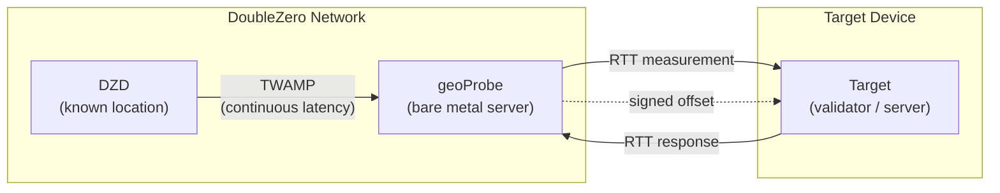
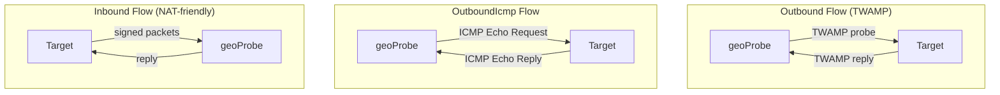

# Geolocalizzazione

Il servizio di Geolocalizzazione di DoubleZero aiuta gli utenti a determinare la posizione fisica dei dispositivi utilizzando misurazioni di latenza. Le misurazioni [RTT](glossary.md#rtt-round-trip-time) (round-trip time) tra infrastrutture con posizione nota e un dispositivo target forniscono prove firmate crittograficamente che un dispositivo si trova entro una certa distanza da un punto specifico. La registrazione onchain delle misurazioni sul DoubleZero Ledger è prevista per una versione futura.

I casi d'uso includono la conformità normativa (ad es., GDPR — dimostrare che i validatori operano all'interno dell'UE), audit sulla distribuzione geografica e qualsiasi applicazione che necessiti di prove verificabili sulla posizione di un dispositivo o IP.

---

## Come funziona {#how-it-works}



Il diagramma seguente mostra i tre tipi di flusso delle sonde — Outbound, OutboundIcmp e Inbound — che differiscono nel modo in cui il geoProbe comunica con il target:



La geolocalizzazione utilizza una catena di misurazione a tre livelli:

```
DZD (known location) ◄──TWAMP──► geoProbe ◄──RTT──► Target device
```

- **[DZD](glossary.md#dzd-doublezero-device) <-> geoProbe**: [TWAMP](glossary.md#twamp-two-way-active-measurement-protocol) misura continuamente la latenza tra il DoubleZero Device e la sonda. I DZD hanno coordinate geografiche note e fisse registrate sul DZ Ledger.
- **geoProbe <-> Target**: L'RTT viene misurato tra la sonda e il dispositivo da localizzare.

I risultati dell'offset sono firmati crittograficamente e consegnati tramite UDP al target o a una destinazione alternativa specificata dall'utente.

**Importante:** La geolocalizzazione riporta solo l'RTT — non la distanza dedotta o le coordinate. Un modo comune di utilizzarlo è dividere l'RTT per 2, e poi moltiplicare per la velocità della luce nel vetro (~200km/ms) per ottenere un raggio intorno alle coordinate del DZD entro il quale si trova il target. L'interpretazione dell'RTT (ad es., il calcolo di un raggio di distanza massima) è a vostra discrezione.

### Tipi di flusso delle sonde {#probe-flow-types}

Esistono tre modi in cui una sonda può misurare un target:

| Flusso | Chi inizia | Protocollo | Da usare quando |
|--------|------------|------------|-----------------|
| **Outbound** | Sonda -> Target | [TWAMP](glossary.md#twamp-two-way-active-measurement-protocol) | Il target ha un IP pubblico, una porta in ingresso aperta e può eseguire un riflettore TWAMP |
| **OutboundIcmp** | Sonda -> Target | ICMP echo | Il target ha un IP pubblico ma non può eseguire un riflettore TWAMP (o TWAMP è bloccato dal firewall) |
| **Inbound** | Target -> Sonda | TWAMP firmato | Il target non può accettare connessioni in ingresso, o si vuole verificare la posizione di una chiave di firma |

In tutti i casi, la misurazione DZD <-> geoProbe avviene nello stesso modo. Solo la direzione e il protocollo della comunicazione geoProbe <-> target differiscono.

!!! info "Specifica Tecnica"
    Per la specifica tecnica completa del sistema di verifica della geolocalizzazione, inclusi i dettagli sulla firma crittografica e il protocollo di misurazione, consultare [RFC 16: Geolocation Verification](https://github.com/malbeclabs/doublezero/blob/main/rfcs/rfc16-geolocation-verification.md).

---

## Prerequisiti {#prerequisites}

### 1. DoubleZero ID con crediti {#1-doublezero-id-with-credits}

Gli utenti della geolocalizzazione necessitano di un DoubleZero ID finanziato. Non è necessario connettersi alla rete DoubleZero (nessun pass di accesso richiesto), ma la propria chiave necessita di crediti sul DoubleZero ledger per creare un account utente e gestire i target — ogni operazione di aggiunta/rimozione target costa crediti.

Se non hai un DoubleZero ID:

```bash
doublezero keygen
doublezero address   # get your pubkey
```

Contatta il team DoubleZero con la tua pubkey per ottenere il finanziamento del tuo ID. Finanzialo con un importo superiore alla media se prevedi di aggiungere e rimuovere target in modo dinamico.

### 2. Account token 2Z {#2-2z-token-account}

È necessario un account [2Z token](glossary.md#2z-token). Le tariffe del servizio vengono detratte da questo account su base per-epoch.

---

## Installazione {#installation}

Su un computer di gestione:
```bash
curl -1sLf https://dl.cloudsmith.io/public/malbeclabs/doublezero/setup.deb.sh | sudo -E bash
sudo apt install doublezero
```

Su un target per Inbound o TWAMP Outbound:
```bash
curl -1sLf https://dl.cloudsmith.io/public/malbeclabs/doublezero/setup.deb.sh | sudo -E bash
sudo apt install doublezero-geoprobe-target
```
Questo installa `doublezero-geoprobe-target` (outbound) e `doublezero-geoprobe-target-sender` (inbound)

!!! note "ICMP Outbound"
    I target `outbound-icmp` non richiedono l'installazione di alcun software.

---

## Controllare il proprio saldo {#check-your-balance}

```bash
doublezero balance
```

---

## Configurazione {#setup}

### Passo 1: Creare un utente di geolocalizzazione {#step-1-create-a-geolocation-user}

```bash
doublezero geolocation user create \
  --env testnet \
  --code <your-user-code> \
  --token-account <your-2Z-token-account>
```

- `--code`: un identificatore breve e univoco per il tuo account (ad es. `myorg`)
- `--token-account`: la chiave pubblica del tuo account [2Z token](glossary.md#2z-token) — le tariffe del servizio vengono detratte da qui

!!! note "Attivazione dell'account"
    Dopo aver creato un utente, contatta la DoubleZero Foundation per attivare il tuo account. Lo stato del pagamento deve essere contrassegnato come attivo prima che il probing possa iniziare.

### Passo 2: Elencare le sonde disponibili {#step-2-list-available-probes}

```bash
doublezero geolocation probe list
```

Annota il **code** o il **public_ip**, e il **signing_pubkey** (per i target inbound) della sonda che desideri utilizzare.

### Passo 3: Aggiungere un target {#step-3-add-a-target}

=== "Outbound (la sonda invia TWAMP al target)"

    Usa questo flusso se il tuo target ha un IP pubblico, una porta in ingresso aperta e può eseguire un riflettore [TWAMP](glossary.md#twamp-two-way-active-measurement-protocol).

    ```bash
    doublezero geolocation user add-target \
      --user <your-user-code> \
      --type outbound \
      --probe <probe-code> \
      --target-ip <target-public-ip>
    ```

    `--probe`: il codice del geoProbe che misurerà il target (ad es. `ams-mn-gp1`)
    `--ip-address`: l'indirizzo IPv4 pubblico del dispositivo target

=== "OutboundIcmp (la sonda effettua ping al target)"

    Usa questo flusso se il tuo target ha un IP pubblico ma non può eseguire un riflettore TWAMP, o se il traffico TWAMP è bloccato dal firewall. Il target deve solo rispondere alle richieste ICMP echo (ping) — non è richiesto alcun software aggiuntivo.

    ```bash
    doublezero geolocation user add-target \
      --user <your-user-code> \
      --type OutboundIcmp \
      --probe <probe-code> \
      --ip-address <target-public-ip>
    ```

    `--probe`: il codice del geoProbe che misurerà il target (ad es. `ams-mn-gp1`)
    `--ip-address`: l'indirizzo IPv4 pubblico del dispositivo target
    !!! Warning "Destinazione dei risultati"
        I target Outbound ICMP funzionano solo se il tuo utente ha una destinazione alternativa per i risultati impostata. (Vedi Passo 3b)

=== "Inbound (il target invia alla sonda)"

    Usa questo flusso se il tuo target è dietro NAT o non può accettare connessioni in ingresso.

    ```bash
    doublezero geolocation user add-target \
      --user <your-user-code> \
      --type inbound \
      --probe <probe-code> \
      --target-pk <target-keypair-pubkey>
    ```

    `--probe`: il codice del geoProbe che misurerà il target (ad es. `ams-mn-gp1`)
    `--target-pk`: chiave pubblica della coppia di chiavi che il target userà per firmare i messaggi — la sonda accetta solo messaggi da chiavi pubbliche registrate

### Passo 3b: Impostare una destinazione dei risultati (opzionale) {#step-3b-set-a-result-destination-optional}

Configura un `host:port` alternativo dove vengono consegnati i risultati compositi LocationOffset per qualsiasi tipo di target Outbound. Questo sostituisce l'invio del LocationOffset al target ed è configurato su base per-utente. Se è necessario un comportamento diverso per ogni target, è richiesto configurare due utenti, uno per ciascun tipo di comportamento desiderato.

La destinazione alternativa è utile per aggregare i risultati di più target verso un singolo endpoint. È obbligatoria per il probing ICMP.

```bash
doublezero geolocation user set-result-destination \
  --user <your-user-code> \
  --destination <host:port>
```

`--destination`: un indirizzo IPv4 pubblicamente raggiungibile o un nome di dominio valido con porta (ad es., `203.0.113.10:9000` o `results.example.com:9000`). Passa una stringa vuota per cancellare.

Usa `user get` per verificare la tua destinazione dei risultati:

```bash
doublezero geolocation user get --user <your-user-code>
```

### Passo 4: Eseguire l'applicazione target {#step-4-run-the-target-application}

Sia i flussi outbound che inbound richiedono l'esecuzione di un'applicazione sul dispositivo target. Implementazioni di riferimento con esempi sono disponibili in Go — puoi eseguirle direttamente o usarle come punto di partenza per la tua integrazione.

=== "Outbound"

    Per il probing outbound, il dispositivo target deve eseguire un riflettore [TWAMP](glossary.md#twamp-two-way-active-measurement-protocol) in modo che il geoProbe possa misurare l'RTT. Esegui l'applicazione target sul dispositivo da misurare:

    ```bash
    doublezero-geoprobe-target
    ```

=== "Inbound"

    Per il probing inbound, il dispositivo target deve eseguire un software che invia messaggi firmati alla sonda.

    Sul dispositivo da misurare:

    ```bash
    doublezero-geoprobe-target-sender \
      -probe-ip <probe-ip> \
      -probe-pk <probe-pubkey> \
      -keypair <path-to-keypair.json>
    ```

`-probe-ip`: indirizzo IP del geoProbe (da `probe list`)
`-probe-pk`: chiave pubblica del geoProbe (da `probe list`)
`-keypair`: percorso alla coppia di chiavi la cui chiave pubblica è stata registrata come `--target-pk` nel Passo 3

Il target sender utilizza un meccanismo a doppia coppia di sonde: invia due sonde [TWAMP](glossary.md#twamp-two-way-active-measurement-protocol) pre-firmate in rapida successione. La risposta della sonda al secondo pacchetto include `SinceLastRxNs` — il tempo tra l'invio della risposta 0 da parte della sonda e la ricezione della sonda 1 — che funge da [RTT](glossary.md#rtt-round-trip-time) misurato dalla sonda. Questo approccio a coppie fornisce una misurazione accurata dell'RTT anche quando il target non è in grado di eseguire un timestamping preciso a livello kernel.

---

## Riferimento dei comandi {#command-reference}

### `doublezero geolocation user` {#doublezero-geolocation-user}

| Sottocomando | Descrizione |
|--------------|-------------|
| `create` | Crea un nuovo account utente di geolocalizzazione |
| `get` | Ottieni i dettagli di un utente specifico |
| `list` | Elenca tutti gli utenti di geolocalizzazione |
| `delete` | Elimina un utente |
| `add-target` | Aggiungi un target a un utente |
| `remove-target` | Rimuovi un target da un utente |
| `set-result-destination` | Imposta un host:port alternativo per la consegna degli offset |
| `update-payment` | Aggiorna lo stato del pagamento (uso fondazione) |

### `doublezero geolocation probe` {#doublezero-geolocation-probe}

| Sottocomando | Descrizione |
|--------------|-------------|
| `create` | Registra un nuovo geoProbe |
| `get` | Ottieni i dettagli di una sonda specifica |
| `list` | Elenca tutte le sonde |
| `update` | Aggiorna la configurazione della sonda |
| `delete` | Elimina una sonda |
| `add-parent` | Collega un DZD come parent della sonda |
| `remove-parent` | Rimuovi un DZD parent |

### Flag globali {#global-flags}

| Flag | Descrizione |
|------|-------------|
| `--env` | Ambiente di rete: `testnet`, `devnet` o `mainnet-beta` |
| `--rpc-url` | Endpoint RPC DoubleZero personalizzato |
| `--keypair` | Percorso alla coppia di chiavi per la firma (richiesto per le operazioni di scrittura) |