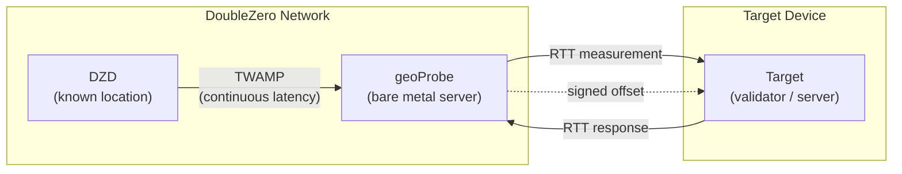
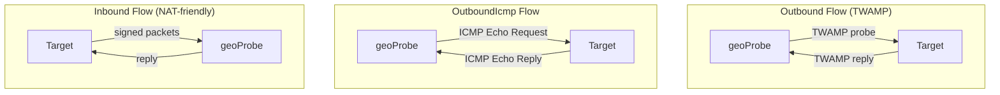

# Geolocation

DoubleZero Geolocationサービスは、レイテンシ測定を使用してデバイスの物理的な位置を特定するのに役立ちます。既知の位置にあるインフラストラクチャとターゲットデバイス間の[RTT](glossary.md#rtt-round-trip-time)（ラウンドトリップタイム）測定により、デバイスが特定の地点から一定の距離内にあることの暗号署名付き証明を提供します。DoubleZero Ledgerへの測定結果のオンチェーン記録は、将来のリリースで予定されています。

ユースケースには、規制コンプライアンス（例：GDPR — バリデーターがEU内で運用されていることの証明）、地理的分散の監査、デバイスやIPの所在地の検証可能な証明が必要なあらゆるアプリケーションが含まれます。

---

## 仕組み



以下の図は、3つのプローブフロータイプ — Outbound、OutboundIcmp、Inbound — を示しており、geoProbeがターゲットと通信する方法が異なります：



Geolocationは3層の測定チェーンを使用します：

```
DZD (known location) ◄──TWAMP──► geoProbe ◄──RTT──► Target device
```

- **[DZD](glossary.md#dzd-doublezero-device) <-> geoProbe**: [TWAMP](glossary.md#twamp-two-way-active-measurement-protocol)がDoubleZero Deviceとプローブ間のレイテンシを継続的に測定します。DZDはDZ Ledgerに登録された既知の固定地理座標を持っています。
- **geoProbe <-> Target**: プローブと位置特定対象のデバイス間でRTTが測定されます。

オフセット結果は暗号署名され、UDPでターゲットまたはユーザー指定の代替宛先に配信されます。

**重要:** Geolocationが報告するのはRTTのみです — 推定距離や座標ではありません。一般的な使用方法としては、RTTを2で割り、ガラス中の光速（約200km/ms）を掛けることで、ターゲットが存在するDZD座標周辺の半径を算出します。RTTの解釈方法（例：最大距離半径の計算）はユーザーに委ねられています。

### プローブフロータイプ

プローブがターゲットを測定する方法は3つあります：

| フロー | 開始者 | プロトコル | 使用場面 |
|------|---------------|----------|----------|
| **Outbound** | Probe -> Target | [TWAMP](glossary.md#twamp-two-way-active-measurement-protocol) | ターゲットがパブリックIP、オープンな受信ポートを持ち、TWAMPリフレクターを実行できる場合 |
| **OutboundIcmp** | Probe -> Target | ICMP echo | ターゲットがパブリックIPを持つがTWAMPリフレクターを実行できない場合（またはTWAMPがファイアウォールでブロックされている場合） |
| **Inbound** | Target -> Probe | Signed TWAMP | ターゲットが受信接続を受け入れられない場合、または署名鍵の位置を検証したい場合 |

すべてのケースで、DZD <-> geoProbeの測定は同じ方法で行われます。geoProbe <-> ターゲット通信の方向とプロトコルのみが異なります。

!!! info "技術仕様"
    暗号署名の詳細や測定プロトコルを含むジオロケーション検証システムの完全な技術仕様については、[RFC 16: Geolocation Verification](https://github.com/malbeclabs/doublezero/blob/main/rfcs/rfc16-geolocation-verification.md)を参照してください。

---

## 前提条件

### 1. クレジット付きのDoubleZero ID

Geolocationユーザーには、資金が投入されたDoubleZero IDが必要です。DoubleZeroネットワークへの接続は不要（アクセスパスは不要）ですが、ユーザーアカウントの作成やターゲットの管理にはDoubleZero Ledger上のクレジットが必要です — ターゲットの追加/削除操作ごとにクレジットがかかります。

DoubleZero IDをお持ちでない場合：

```bash
doublezero keygen
doublezero address   # get your pubkey
```

公開鍵をDoubleZeroチームに連絡してIDに資金を投入してもらいます。ターゲットを動的に追加・削除する予定がある場合は、通常より多めに資金を投入してください。

### 2. 2Zトークンアカウント

[2Zトークン](glossary.md#2z-token)アカウントが必要です。サービス料金はエポックごとにこのアカウントから差し引かれます。

---

## インストール

管理用コンピューターで：
```bash
curl -1sLf https://dl.cloudsmith.io/public/malbeclabs/doublezero/setup.deb.sh | sudo -E bash
sudo apt install doublezero
```

InboundまたはTWAMP Outboundのターゲットで：
```bash
curl -1sLf https://dl.cloudsmith.io/public/malbeclabs/doublezero/setup.deb.sh | sudo -E bash
sudo apt install doublezero-geoprobe-target
```
これにより`doublezero-geoprobe-target`（outbound）と`doublezero-geoprobe-target-sender`（inbound）がインストールされます。

!!! note "ICMP Outbound"
    `outbound-icmp`ターゲットにはソフトウェアのインストールは不要です。

---

## 残高確認

```bash
doublezero balance
```

---

## セットアップ

### ステップ1：geolocationユーザーの作成

```bash
doublezero geolocation user create \
  --env testnet \
  --code <your-user-code> \
  --token-account <your-2Z-token-account>
```

- `--code`: アカウントの短い一意の識別子（例：`myorg`）
- `--token-account`: [2Zトークン](glossary.md#2z-token)アカウントの公開鍵 — サービス料金がここから差し引かれます

!!! note "アカウントの有効化"
    ユーザー作成後、アカウントを有効化するためにDoubleZero Foundationに連絡してください。プローブの開始前に支払いステータスがアクティブとしてマークされている必要があります。

### ステップ2：利用可能なプローブの一覧表示

```bash
doublezero geolocation probe list
```

使用したいプローブの**code**または**public_ip**、および（inboundターゲット用の）**signing_pubkey**を控えてください。

### ステップ3：ターゲットの追加

=== "Outbound（プローブがターゲットにTWAMPを送信）"

    ターゲットがパブリックIP、オープンな受信ポートを持ち、[TWAMP](glossary.md#twamp-two-way-active-measurement-protocol)リフレクターを実行できる場合にこのフローを使用します。

    ```bash
    doublezero geolocation user add-target \
      --user <your-user-code> \
      --type outbound \
      --probe <probe-code> \
      --target-ip <target-public-ip>
    ```

    `--probe`: ターゲットを測定するgeoProbeのコード（例：`ams-mn-gp1`）
    `--ip-address`: ターゲットデバイスのパブリックIPv4アドレス

=== "OutboundIcmp（プローブがターゲットにpingを送信）"

    ターゲットがパブリックIPを持つがTWAMPリフレクターを実行できない場合、またはTWAMPトラフィックがファイアウォールでブロックされている場合にこのフローを使用します。ターゲットはICMP echo（ping）リクエストに応答するだけで済みます — 追加のソフトウェアは不要です。

    ```bash
    doublezero geolocation user add-target \
      --user <your-user-code> \
      --type OutboundIcmp \
      --probe <probe-code> \
      --ip-address <target-public-ip>
    ```

    `--probe`: ターゲットを測定するgeoProbeのコード（例：`ams-mn-gp1`）
    `--ip-address`: ターゲットデバイスのパブリックIPv4アドレス
    !!! Warning "結果の送信先"
        Outbound ICMPターゲットは、ユーザーに代替結果送信先が設定されている場合にのみ機能します。（ステップ3bを参照）

=== "Inbound（ターゲットがプローブに送信）"

    ターゲットがNATの背後にある場合や、受信接続を受け入れられない場合にこのフローを使用します。

    ```bash
    doublezero geolocation user add-target \
      --user <your-user-code> \
      --type inbound \
      --probe <probe-code> \
      --target-pk <target-keypair-pubkey>
    ```

    `--probe`: ターゲットを測定するgeoProbeのコード（例：`ams-mn-gp1`）
    `--target-pk`: ターゲットがメッセージの署名に使用するキーペアの公開鍵 — プローブは登録済みの公開鍵からのメッセージのみを受け入れます

### ステップ3b：結果の送信先の設定（オプション）

Outboundターゲットタイプの複合LocationOffset結果が配信される代替`host:port`を設定します。これはLocationOffsetをターゲットに送信する代わりに使用され、ユーザーごとに設定されます。ターゲットごとに異なる動作が必要な場合は、それぞれの動作タイプに対して2つのユーザーを設定する必要があります。

代替送信先は、複数のターゲットからの結果を単一のエンドポイントに集約するのに便利です。ICMPプローブでは必須です。

```bash
doublezero geolocation user set-result-destination \
  --user <your-user-code> \
  --destination <host:port>
```

`--destination`: パブリックにルーティング可能なIPv4アドレスまたは有効なドメイン名とポート（例：`203.0.113.10:9000`または`results.example.com:9000`）。空文字列を渡すとクリアされます。

`user get`を使用して結果の送信先を確認します：

```bash
doublezero geolocation user get --user <your-user-code>
```

### ステップ4：ターゲットアプリケーションの実行

OutboundフローとInboundフローの両方で、ターゲットデバイス上でアプリケーションを実行する必要があります。Go言語のリファレンス実装とサンプルが用意されており、直接実行するか、独自の統合の出発点として使用できます。

=== "Outbound"

    Outboundプローブでは、geoProbeがRTTを測定できるように、ターゲットデバイスで[TWAMP](glossary.md#twamp-two-way-active-measurement-protocol)リフレクターを実行する必要があります。測定対象のデバイスでターゲットアプリケーションを実行します：

    ```bash
    doublezero-geoprobe-target
    ```

=== "Inbound"

    Inboundプローブでは、ターゲットデバイスで署名済みメッセージをプローブに送信するソフトウェアを実行する必要があります。

    測定対象のデバイスで：

    ```bash
    doublezero-geoprobe-target-sender \
      -probe-ip <probe-ip> \
      -probe-pk <probe-pubkey> \
      -keypair <path-to-keypair.json>
    ```

`-probe-ip`: geoProbeのIPアドレス（`probe list`から取得）
`-probe-pk`: geoProbeの公開鍵（`probe list`から取得）
`-keypair`: ステップ3で`--target-pk`として登録した公開鍵のキーペアへのパス

ターゲットセンダーは2プローブペアメカニズムを使用します：2つの事前署名済み[TWAMP](glossary.md#twamp-two-way-active-measurement-protocol)プローブを連続して素早く送信します。プローブの2番目のパケットへの応答には`SinceLastRxNs`が含まれます — これはプローブがリプライ0を送信してからプローブ1を受信するまでの時間で、プローブが測定した[RTT](glossary.md#rtt-round-trip-time)として機能します。このペアアプローチにより、ターゲットが正確なカーネルレベルのタイムスタンプを実行できない場合でも、正確なRTT測定が可能になります。

---

## コマンドリファレンス

### `doublezero geolocation user`

| サブコマンド | 説明 |
|------------|-------------|
| `create` | 新しいgeolocationユーザーアカウントを作成 |
| `get` | 特定のユーザーの詳細を取得 |
| `list` | すべてのgeolocationユーザーを一覧表示 |
| `delete` | ユーザーを削除 |
| `add-target` | ユーザーにターゲットを追加 |
| `remove-target` | ユーザーからターゲットを削除 |
| `set-result-destination` | オフセット配信用の代替host:portを設定 |
| `update-payment` | 支払いステータスを更新（foundation使用） |

### `doublezero geolocation probe`

| サブコマンド | 説明 |
|------------|-------------|
| `create` | 新しいgeoProbeを登録 |
| `get` | 特定のプローブの詳細を取得 |
| `list` | すべてのプローブを一覧表示 |
| `update` | プローブの設定を更新 |
| `delete` | プローブを削除 |
| `add-parent` | DZDをプローブの親としてリンク |
| `remove-parent` | 親DZDを削除 |

### グローバルフラグ

| フラグ | 説明 |
|------|-------------|
| `--env` | ネットワーク環境：`testnet`、`devnet`、または`mainnet-beta` |
| `--rpc-url` | カスタムDoubleZero RPCエンドポイント |
| `--keypair` | 署名用キーペアへのパス（書き込み操作に必須） |