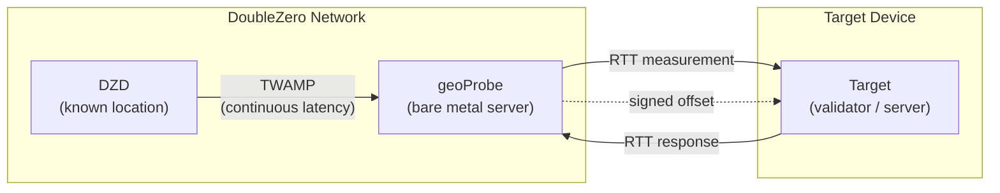
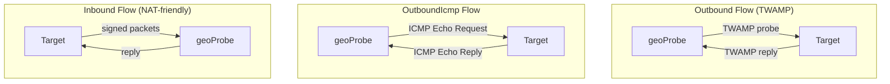

# ジオロケーション

DoubleZero ジオロケーションサービスは、レイテンシ測定を使用してデバイスの物理的な位置を特定するのに役立ちます。既知の位置にあるインフラストラクチャとターゲットデバイス間の [RTT](glossary.md#rtt-round-trip-time)（ラウンドトリップタイム）測定により、デバイスが特定の地点から一定の距離内にあることの暗号署名付き証明が提供されます。DoubleZero Ledger への測定結果のオンチェーン記録は、将来のリリースで計画されています。

ユースケースには、規制コンプライアンス（例：GDPR — バリデータが EU 内で運用されていることの証明）、地理的分散の監査、およびデバイスや IP の所在を検証可能な証明が必要なあらゆるアプリケーションが含まれます。

---

## 仕組み {#how-it-works}



以下の図は、3 つのプローブフロータイプ — Outbound、OutboundIcmp、および Inbound — を示しており、geoProbe がターゲットと通信する方法の違いを表しています：



ジオロケーションは 3 層の測定チェーンを使用します：

```
DZD (known location) ◄──TWAMP──► geoProbe ◄──RTT──► Target device
```

- **[DZD](glossary.md#dzd-doublezero-device) <-> geoProbe**: [TWAMP](glossary.md#twamp-two-way-active-measurement-protocol) が DoubleZero Device とプローブ間のレイテンシを継続的に測定します。DZD は DZ Ledger に登録された既知の固定地理座標を持っています。
- **geoProbe <-> ターゲット**: プローブと位置特定対象のデバイス間で RTT が測定されます。

オフセット結果は暗号署名され、UDP でターゲットまたはユーザー指定の代替送信先に配信されます。

**重要:** ジオロケーションは RTT のみをレポートします — 推定距離や座標ではありません。一般的な使用方法としては、RTT を 2 で割り、ガラス中の光速（約 200km/ms）を掛けて、ターゲットが位置する DZD 座標を中心とした半径を求めます。RTT の解釈方法（例：最大距離半径の計算）はユーザー次第です。

### プローブフロータイプ {#probe-flow-types}

プローブがターゲットを測定する方法は 3 つあります：

| フロー | 開始側 | プロトコル | 使用する場面 |
|------|---------------|----------|----------|
| **Outbound** | プローブ -> ターゲット | [TWAMP](glossary.md#twamp-two-way-active-measurement-protocol) | ターゲットがパブリック IP を持ち、インバウンドポートが開いており、TWAMP リフレクタを実行できる場合 |
| **OutboundIcmp** | プローブ -> ターゲット | ICMP echo | ターゲットがパブリック IP を持つが、TWAMP リフレクタを実行できない場合（またはファイアウォールで TWAMP がブロックされている場合） |
| **Inbound** | ターゲット -> プローブ | 署名付き TWAMP | ターゲットがインバウンド接続を受け付けられない場合、または署名鍵の位置を検証したい場合 |

すべてのケースで、DZD <-> geoProbe の測定は同じ方法で行われます。geoProbe <-> ターゲット間の通信の方向とプロトコルのみが異なります。

!!! info "技術仕様"
    暗号署名の詳細と測定プロトコルを含むジオロケーション検証システムの完全な技術仕様については、[RFC 16: Geolocation Verification](https://github.com/malbeclabs/doublezero/blob/main/rfcs/rfc16-geolocation-verification.md) を参照してください。

---

## 前提条件 {#prerequisites}

### 1. クレジット付きの DoubleZero ID {#1-doublezero-id-with-credits}

ジオロケーションユーザーには、資金が入った DoubleZero ID が必要です。DoubleZero ネットワークへの接続は不要です（アクセスパスは不要）が、ユーザーアカウントの作成とターゲット管理のために DoubleZero Ledger 上にクレジットが必要です — ターゲットの追加/削除操作ごとにクレジットが消費されます。

DoubleZero ID をお持ちでない場合：

```bash
doublezero keygen
doublezero address   # get your pubkey
```

公開鍵を添えて DoubleZero チームに連絡し、ID に資金を投入してもらってください。ターゲットを動的に追加・削除する予定がある場合は、通常よりも多めに資金を投入してください。

### 2. 2Z トークンアカウント {#2-2z-token-account}

[2Z token](glossary.md#2z-token) アカウントが必要です。サービス料金はエポックごとにこのアカウントから差し引かれます。

---

## インストール {#installation}

管理用コンピュータ上で：
```bash
curl -1sLf https://dl.cloudsmith.io/public/malbeclabs/doublezero/setup.deb.sh | sudo -E bash
sudo apt install doublezero
```

Inbound または TWAMP Outbound のターゲット上で：
```bash
curl -1sLf https://dl.cloudsmith.io/public/malbeclabs/doublezero/setup.deb.sh | sudo -E bash
sudo apt install doublezero-geoprobe-target
```
これにより `doublezero-geoprobe-target`（outbound）と `doublezero-geoprobe-target-sender`（inbound）がインストールされます。

!!! note "ICMP Outbound"
    `outbound-icmp` ターゲットにはソフトウェアのインストールは不要です。

---

## 残高の確認 {#check-your-balance}

```bash
doublezero balance
```

---

## セットアップ {#setup}

### ステップ 1: ジオロケーションユーザーの作成 {#step-1-create-a-geolocation-user}

```bash
doublezero geolocation user create \
  --env testnet \
  --code <your-user-code> \
  --token-account <your-2Z-token-account>
```

- `--code`: アカウントの短い一意の識別子（例：`myorg`）
- `--token-account`: [2Z token](glossary.md#2z-token) アカウントの公開鍵 — サービス料金はここから差し引かれます

!!! note "アカウントの有効化"
    ユーザー作成後、DoubleZero Foundation に連絡してアカウントを有効化してください。プローブが開始される前に支払いステータスがアクティブに設定されている必要があります。

### ステップ 2: 利用可能なプローブの一覧表示 {#step-2-list-available-probes}

```bash
doublezero geolocation probe list
```

使用したいプローブの **code** または **public_ip**、および **signing_pubkey**（inbound ターゲットの場合）を確認してください。

### ステップ 3: ターゲットの追加 {#step-3-add-a-target}

=== "Outbound（プローブがターゲットに TWAMP を送信）"

    ターゲットがパブリック IP を持ち、インバウンドポートが開いており、[TWAMP](glossary.md#twamp-two-way-active-measurement-protocol) リフレクタを実行できる場合は、このフローを使用します。

    ```bash
    doublezero geolocation user add-target \
      --user <your-user-code> \
      --type outbound \
      --probe <probe-code> \
      --target-ip <target-public-ip>
    ```

    `--probe`: ターゲットを測定する geoProbe のコード（例：`ams-mn-gp1`）
    `--ip-address`: ターゲットデバイスのパブリック IPv4 アドレス

=== "OutboundIcmp（プローブがターゲットに ping を送信）"

    ターゲットがパブリック IP を持つが TWAMP リフレクタを実行できない場合、またはファイアウォールで TWAMP トラフィックがブロックされている場合は、このフローを使用します。ターゲットは ICMP echo（ping）リクエストに応答するだけでよく、追加のソフトウェアは不要です。

    ```bash
    doublezero geolocation user add-target \
      --user <your-user-code> \
      --type OutboundIcmp \
      --probe <probe-code> \
      --ip-address <target-public-ip>
    ```

    `--probe`: ターゲットを測定する geoProbe のコード（例：`ams-mn-gp1`）
    `--ip-address`: ターゲットデバイスのパブリック IPv4 アドレス
    !!! Warning "結果の送信先"
        Outbound ICMP ターゲットは、ユーザーに代替結果送信先が設定されている場合にのみ機能します。（ステップ 3b を参照）

=== "Inbound（ターゲットがプローブに送信）"

    ターゲットが NAT の背後にあるか、インバウンド接続を受け付けられない場合は、このフローを使用します。

    ```bash
    doublezero geolocation user add-target \
      --user <your-user-code> \
      --type inbound \
      --probe <probe-code> \
      --target-pk <target-keypair-pubkey>
    ```

    `--probe`: ターゲットを測定する geoProbe のコード（例：`ams-mn-gp1`）
    `--target-pk`: ターゲットがメッセージの署名に使用するキーペアの公開鍵 — プローブは登録された公開鍵からのメッセージのみを受け付けます

### ステップ 3b: 結果の送信先の設定（オプション） {#step-3b-set-a-result-destination-optional}

任意の Outbound ターゲットタイプについて、合成された LocationOffset 結果が配信される代替の `host:port` を設定します。これにより LocationOffset のターゲットへの送信が置き換えられ、ユーザーごとに設定されます。ターゲットごとに異なる動作が必要な場合は、それぞれの動作タイプに対して 2 つのユーザーを設定する必要があります。

代替送信先は、複数のターゲットからの結果を単一のエンドポイントに集約するのに便利です。ICMP プローブでは必須です。

```bash
doublezero geolocation user set-result-destination \
  --user <your-user-code> \
  --destination <host:port>
```

`--destination`: 公的にルーティング可能な IPv4 アドレスまたは有効なドメイン名とポート（例：`203.0.113.10:9000` または `results.example.com:9000`）。クリアするには空文字列を渡します。

`user get` を使用して結果の送信先を確認します：

```bash
doublezero geolocation user get --user <your-user-code>
```

### ステップ 4: ターゲットアプリケーションの実行 {#step-4-run-the-target-application}

Outbound と Inbound の両方のフローでは、ターゲットデバイス上でアプリケーションを実行する必要があります。Go でリファレンス実装とサンプルが利用可能です — 直接実行するか、独自の統合の出発点として使用できます。

=== "Outbound"

    Outbound プローブの場合、geoProbe が RTT を測定できるように、ターゲットデバイスで [TWAMP](glossary.md#twamp-two-way-active-measurement-protocol) リフレクタを実行する必要があります。測定対象のデバイス上でターゲットアプリケーションを実行します：

    ```bash
    doublezero-geoprobe-target
    ```

=== "Inbound"

    Inbound プローブの場合、ターゲットデバイスで署名付きメッセージをプローブに送信するソフトウェアを実行する必要があります。

    測定対象のデバイス上で：

    ```bash
    doublezero-geoprobe-target-sender \
      -probe-ip <probe-ip> \
      -probe-pk <probe-pubkey> \
      -keypair <path-to-keypair.json>
    ```

`-probe-ip`: geoProbe の IP アドレス（`probe list` から取得）
`-probe-pk`: geoProbe の公開鍵（`probe list` から取得）
`-keypair`: ステップ 3 で `--target-pk` として登録した公開鍵を持つキーペアへのパス

ターゲットセンダーは 2 プローブペアメカニズムを使用します：2 つの事前署名された [TWAMP](glossary.md#twamp-two-way-active-measurement-protocol) プローブを素早く連続して送信します。プローブの 2 番目のパケットへの応答には `SinceLastRxNs` が含まれます — これはプローブがリプライ 0 を送信してからプローブ 1 を受信するまでの時間であり、プローブが測定した [RTT](glossary.md#rtt-round-trip-time) として機能します。このペアアプローチにより、ターゲットが正確なカーネルレベルのタイムスタンプを実行できない場合でも、正確な RTT 測定が提供されます。

---

## コマンドリファレンス {#command-reference}

### `doublezero geolocation user` {#doublezero-geolocation-user}

| サブコマンド | 説明 |
|------------|-------------|
| `create` | 新しいジオロケーションユーザーアカウントを作成 |
| `get` | 特定のユーザーの詳細を取得 |
| `list` | すべてのジオロケーションユーザーを一覧表示 |
| `delete` | ユーザーを削除 |
| `add-target` | ユーザーにターゲットを追加 |
| `remove-target` | ユーザーからターゲットを削除 |
| `set-result-destination` | オフセット配信の代替 host:port を設定 |
| `update-payment` | 支払いステータスを更新（Foundation 用） |

### `doublezero geolocation probe` {#doublezero-geolocation-probe}

| サブコマンド | 説明 |
|------------|-------------|
| `create` | 新しい geoProbe を登録 |
| `get` | 特定のプローブの詳細を取得 |
| `list` | すべてのプローブを一覧表示 |
| `update` | プローブの設定を更新 |
| `delete` | プローブを削除 |
| `add-parent` | DZD をプローブの親としてリンク |
| `remove-parent` | 親 DZD を削除 |

### グローバルフラグ {#global-flags}

| フラグ | 説明 |
|------|-------------|
| `--env` | ネットワーク環境: `testnet`、`devnet`、または `mainnet-beta` |
| `--rpc-url` | カスタム DoubleZero RPC エンドポイント |
| `--keypair` | 署名キーペアへのパス（書き込み操作に必須） |