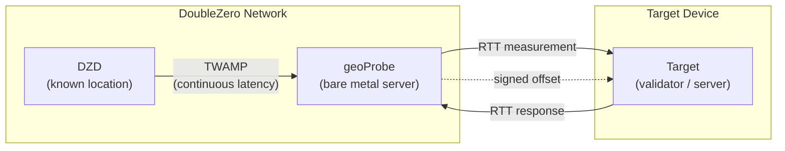
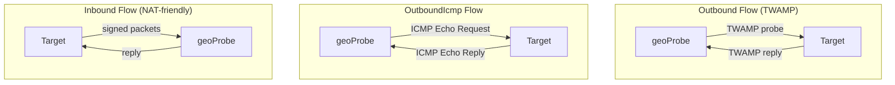

# 지리적 위치 확인

DoubleZero 지리적 위치 확인(Geolocation) 서비스는 사용자가 지연 시간 측정을 통해 장치의 물리적 위치를 확인할 수 있도록 도와줍니다. 알려진 위치의 인프라와 대상 장치 간의 [RTT](glossary.md#rtt-round-trip-time)(왕복 시간) 측정은 장치가 특정 지점으로부터 일정 거리 내에 있다는 암호화 서명 증명을 제공합니다. 측정값을 DoubleZero 원장에 온체인으로 기록하는 기능은 향후 릴리스에서 제공될 예정입니다.

사용 사례에는 규제 준수(예: GDPR — 검증자가 EU 내에서 운영됨을 증명), 지리적 분포 감사, 그리고 장치나 IP의 위치에 대한 검증 가능한 증명이 필요한 모든 애플리케이션이 포함됩니다.

---

## 작동 방식 {#how-it-works}



다음 다이어그램은 세 가지 프로브 흐름 유형 — Outbound, OutboundIcmp, Inbound — 을 보여주며, geoProbe가 대상과 통신하는 방식이 각각 다릅니다:



지리적 위치 확인은 3단계 측정 체인을 사용합니다:

```
DZD (known location) ◄──TWAMP──► geoProbe ◄──RTT──► Target device
```

- **[DZD](glossary.md#dzd-doublezero-device) <-> geoProbe**: [TWAMP](glossary.md#twamp-two-way-active-measurement-protocol)가 DoubleZero Device와 프로브 간의 지연 시간을 지속적으로 측정합니다. DZD는 DZ 원장에 등록된 알려진 고정 지리 좌표를 가지고 있습니다.
- **geoProbe <-> Target**: 프로브와 위치를 확인할 장치 간에 RTT를 측정합니다.

오프셋 결과는 암호화 서명되며, UDP를 통해 대상 또는 사용자가 지정한 대체 목적지로 전달됩니다.

**중요:** 지리적 위치 확인은 RTT만 보고하며, 추론된 거리나 좌표를 보고하지 않습니다. 일반적인 사용 방법은 RTT를 2로 나눈 후 유리 내 빛의 속도(~200km/ms)를 곱하여 대상이 위치한 DZD 좌표 주변의 반경을 계산하는 것입니다. RTT를 어떻게 해석할지(예: 최대 거리 반경 계산)는 사용자에게 달려 있습니다.

### 프로브 흐름 유형 {#probe-flow-types}

프로브가 대상을 측정하는 세 가지 방법이 있습니다:

| 흐름 | 시작하는 쪽 | 프로토콜 | 사용 시점 |
|------|---------------|----------|----------|
| **Outbound** | 프로브 -> 대상 | [TWAMP](glossary.md#twamp-two-way-active-measurement-protocol) | 대상이 공인 IP를 가지고 있고, 인바운드 포트가 열려 있으며, TWAMP 리플렉터를 실행할 수 있는 경우 |
| **OutboundIcmp** | 프로브 -> 대상 | ICMP echo | 대상이 공인 IP를 가지고 있지만 TWAMP 리플렉터를 실행할 수 없는 경우(또는 방화벽에 의해 TWAMP가 차단된 경우) |
| **Inbound** | 대상 -> 프로브 | Signed TWAMP | 대상이 인바운드 연결을 수락할 수 없거나, 서명 키의 위치를 검증하고자 하는 경우 |

모든 경우에서 DZD <-> geoProbe 측정은 동일한 방식으로 이루어집니다. geoProbe <-> 대상 간 통신의 방향과 프로토콜만 다릅니다.

!!! info "기술 사양"
    암호화 서명 세부 사항 및 측정 프로토콜을 포함한 지리적 위치 확인 검증 시스템의 전체 기술 사양은 [RFC 16: Geolocation Verification](https://github.com/malbeclabs/doublezero/blob/main/rfcs/rfc16-geolocation-verification.md)을 참조하세요.

---

## 사전 요구 사항 {#prerequisites}

### 1. 크레딧이 충전된 DoubleZero ID {#1-doublezero-id-with-credits}

지리적 위치 확인 사용자는 충전된 DoubleZero ID가 필요합니다. DoubleZero 네트워크에 연결할 필요는 없지만(액세스 패스 불필요), 사용자 계정을 생성하고 대상을 관리하려면 DoubleZero 원장에 크레딧이 있는 키가 필요합니다 — 각 대상 추가/제거 작업에는 크레딧이 소비됩니다.

DoubleZero ID가 없는 경우:

```bash
doublezero keygen
doublezero address   # get your pubkey
```

공개 키를 DoubleZero 팀에 전달하여 ID에 크레딧을 충전받으세요. 대상을 동적으로 자주 추가하고 제거할 예정이라면 일반적인 금액보다 높게 충전하세요.

### 2. 2Z 토큰 계정 {#2-2z-token-account}

[2Z token](glossary.md#2z-token) 계정이 필요합니다. 서비스 수수료는 에포크 단위로 이 계정에서 차감됩니다.

---

## 설치 {#installation}

관리 컴퓨터에서:
```bash
curl -1sLf https://dl.cloudsmith.io/public/malbeclabs/doublezero/setup.deb.sh | sudo -E bash
sudo apt install doublezero
```

Inbound 또는 TWAMP Outbound 대상에서:
```bash
curl -1sLf https://dl.cloudsmith.io/public/malbeclabs/doublezero/setup.deb.sh | sudo -E bash
sudo apt install doublezero-geoprobe-target
```
이 명령은 `doublezero-geoprobe-target`(outbound)과 `doublezero-geoprobe-target-sender`(inbound)를 설치합니다.

!!! note "ICMP Outbound"
    `outbound-icmp` 대상에는 별도의 소프트웨어 설치가 필요하지 않습니다.

---

## 잔액 확인 {#check-your-balance}

```bash
doublezero balance
```

---

## 설정 {#setup}

### 1단계: 지리적 위치 확인 사용자 생성 {#step-1-create-a-geolocation-user}

```bash
doublezero geolocation user create \
  --env testnet \
  --code <your-user-code> \
  --token-account <your-2Z-token-account>
```

- `--code`: 계정의 짧고 고유한 식별자 (예: `myorg`)
- `--token-account`: [2Z token](glossary.md#2z-token) 계정의 공개 키 — 서비스 수수료가 여기에서 차감됩니다

!!! note "계정 활성화"
    사용자를 생성한 후 DoubleZero 재단에 연락하여 계정을 활성화하세요. 프로빙이 시작되기 전에 결제 상태가 활성으로 표시되어야 합니다.

### 2단계: 사용 가능한 프로브 목록 조회 {#step-2-list-available-probes}

```bash
doublezero geolocation probe list
```

사용하려는 프로브의 **code** 또는 **public_ip**, 그리고 **signing_pubkey**(인바운드 대상의 경우)를 기록하세요.

### 3단계: 대상 추가 {#step-3-add-a-target}

=== "Outbound (프로브가 대상에 TWAMP 전송)"

    대상이 공인 IP를 가지고 있고, 인바운드 포트가 열려 있으며, [TWAMP](glossary.md#twamp-two-way-active-measurement-protocol) 리플렉터를 실행할 수 있는 경우 이 흐름을 사용하세요.

    ```bash
    doublezero geolocation user add-target \
      --user <your-user-code> \
      --type outbound \
      --probe <probe-code> \
      --target-ip <target-public-ip>
    ```

    `--probe`: 대상을 측정할 geoProbe의 코드 (예: `ams-mn-gp1`)
    `--ip-address`: 대상 장치의 공인 IPv4 주소

=== "OutboundIcmp (프로브가 대상에 ping 전송)"

    대상이 공인 IP를 가지고 있지만 TWAMP 리플렉터를 실행할 수 없거나, 방화벽에 의해 TWAMP 트래픽이 차단된 경우 이 흐름을 사용하세요. 대상은 ICMP echo(ping) 요청에 응답하기만 하면 됩니다 — 추가 소프트웨어가 필요하지 않습니다.

    ```bash
    doublezero geolocation user add-target \
      --user <your-user-code> \
      --type OutboundIcmp \
      --probe <probe-code> \
      --ip-address <target-public-ip>
    ```

    `--probe`: 대상을 측정할 geoProbe의 코드 (예: `ams-mn-gp1`)
    `--ip-address`: 대상 장치의 공인 IPv4 주소
    !!! Warning "결과 수신 목적지"
        Outbound ICMP 대상은 사용자에게 대체 결과 수신 목적지가 설정되어 있어야만 동작합니다. (3b단계 참조)

=== "Inbound (대상이 프로브로 전송)"

    대상이 NAT 뒤에 있거나 인바운드 연결을 수락할 수 없는 경우 이 흐름을 사용하세요.

    ```bash
    doublezero geolocation user add-target \
      --user <your-user-code> \
      --type inbound \
      --probe <probe-code> \
      --target-pk <target-keypair-pubkey>
    ```

    `--probe`: 대상을 측정할 geoProbe의 코드 (예: `ams-mn-gp1`)
    `--target-pk`: 대상이 메시지에 서명할 때 사용할 키페어의 공개 키 — 프로브는 등록된 공개 키의 메시지만 수락합니다

### 3b단계: 결과 수신 목적지 설정 (선택 사항) {#step-3b-set-a-result-destination-optional}

모든 Outbound 대상 유형에 대해 복합 LocationOffset 결과가 전달되는 대체 `host:port`를 설정합니다. 이는 대상으로 LocationOffset을 전송하는 것을 대체하며 사용자 단위로 설정됩니다. 대상별로 다른 동작이 필요한 경우, 각 원하는 동작 유형에 대해 두 명의 사용자를 설정해야 합니다.

대체 목적지는 여러 대상의 결과를 단일 엔드포인트로 집계하는 데 유용합니다. ICMP 프로빙에는 필수입니다.

```bash
doublezero geolocation user set-result-destination \
  --user <your-user-code> \
  --destination <host:port>
```

`--destination`: 공개적으로 라우팅 가능한 IPv4 주소 또는 유효한 도메인 이름과 포트 (예: `203.0.113.10:9000` 또는 `results.example.com:9000`). 빈 문자열을 전달하면 초기화됩니다.

`user get`을 사용하여 결과 수신 목적지를 확인하세요:

```bash
doublezero geolocation user get --user <your-user-code>
```

### 4단계: 대상 애플리케이션 실행 {#step-4-run-the-target-application}

Outbound와 Inbound 흐름 모두 대상 장치에서 애플리케이션을 실행해야 합니다. 예제가 포함된 Go 레퍼런스 구현이 제공됩니다 — 직접 실행하거나 자체 통합의 시작점으로 사용할 수 있습니다.

=== "Outbound"

    Outbound 프로빙의 경우, geoProbe가 RTT를 측정할 수 있도록 대상 장치에서 [TWAMP](glossary.md#twamp-two-way-active-measurement-protocol) 리플렉터를 실행해야 합니다. 측정 대상 장치에서 대상 애플리케이션을 실행하세요:

    ```bash
    doublezero-geoprobe-target
    ```

=== "Inbound"

    Inbound 프로빙의 경우, 대상 장치에서 서명된 메시지를 프로브로 전송하는 소프트웨어를 실행해야 합니다.

    측정 대상 장치에서:

    ```bash
    doublezero-geoprobe-target-sender \
      -probe-ip <probe-ip> \
      -probe-pk <probe-pubkey> \
      -keypair <path-to-keypair.json>
    ```

`-probe-ip`: geoProbe의 IP 주소 (`probe list`에서 확인)
`-probe-pk`: geoProbe의 공개 키 (`probe list`에서 확인)
`-keypair`: 3단계에서 `--target-pk`로 등록한 공개 키에 해당하는 키페어 경로

대상 전송기는 2개 프로브 쌍 메커니즘을 사용합니다: 두 개의 사전 서명된 [TWAMP](glossary.md#twamp-two-way-active-measurement-protocol) 프로브를 연속으로 빠르게 전송합니다. 두 번째 패킷에 대한 프로브의 응답에는 `SinceLastRxNs` — 프로브가 응답 0을 전송하고 프로브 1을 수신하기까지의 시간 — 가 포함되며, 이는 프로브가 측정한 [RTT](glossary.md#rtt-round-trip-time) 역할을 합니다. 이 쌍 기반 접근 방식은 대상이 정밀한 커널 수준 타임스탬핑을 수행할 수 없는 경우에도 정확한 RTT 측정을 제공합니다.

---

## 명령어 참조 {#command-reference}

### `doublezero geolocation user` {#doublezero-geolocation-user}

| 하위 명령어 | 설명 |
|------------|-------------|
| `create` | 새 지리적 위치 확인 사용자 계정 생성 |
| `get` | 특정 사용자의 세부 정보 조회 |
| `list` | 모든 지리적 위치 확인 사용자 목록 조회 |
| `delete` | 사용자 삭제 |
| `add-target` | 사용자에게 대상 추가 |
| `remove-target` | 사용자에게서 대상 제거 |
| `set-result-destination` | 오프셋 전달을 위한 대체 host:port 설정 |
| `update-payment` | 결제 상태 업데이트 (재단 전용) |

### `doublezero geolocation probe` {#doublezero-geolocation-probe}

| 하위 명령어 | 설명 |
|------------|-------------|
| `create` | 새 geoProbe 등록 |
| `get` | 특정 프로브의 세부 정보 조회 |
| `list` | 모든 프로브 목록 조회 |
| `update` | 프로브 구성 업데이트 |
| `delete` | 프로브 삭제 |
| `add-parent` | DZD를 프로브의 상위로 연결 |
| `remove-parent` | 상위 DZD 제거 |

### 전역 플래그 {#global-flags}

| 플래그 | 설명 |
|------|-------------|
| `--env` | 네트워크 환경: `testnet`, `devnet`, 또는 `mainnet-beta` |
| `--rpc-url` | 사용자 지정 DoubleZero RPC 엔드포인트 |
| `--keypair` | 서명 키페어 경로 (쓰기 작업에 필수) |